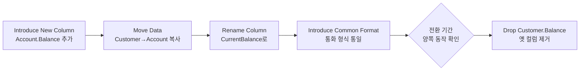

## 이게 뭔데

작은 단계로 바꾼다. 별거 아닌 말 같은데, 실무에서 가장 안 지켜지는 룰이다.

스키마를 손볼 일이 생기면 보통 한 번에 여러 개가 같이 떠오른다. "`Customer.Balance` 컬럼을 `Account`로 옮기고, 이름도 `CurrentBalance`로 바꾸고, 김에 통화 형식도 통일하자." 머릿속에선 한 덩어리다. 그래서 마이그레이션 스크립트 하나에 `ALTER` 세 개를 욱여넣는다. 한 방에 끝내야 효율적인 것 같으니까.

근데 그 한 방짜리 스크립트가 운영에서 깨지면, 어디서 깨졌는지 모른다. 컬럼을 옮기다 깨진 건지, 이름을 바꾸다 깨진 건지, 형식을 맞추다 깨진 건지. 변경 세 개를 한 트랜잭션에 묶어버렸으니 범인이 셋이다.

<Callout type="warning" title="한 줄 요약">
큰 변경은 작은 리팩토링을 순서대로 쌓아 만든다. 한 번에 하나씩만 바꾸면, 깨졌을 때 범인이 항상 "방금 바꾼 그것"이라 디버깅이 추적이 아니라 즉답이 된다.
</Callout>

비유하자면 코끼리 먹기다. 책에도 나오는 표현인데, 코끼리를 어떻게 먹냐고 물으면 답은 하나다. 한 입씩. 큰 스키마 변경도 똑같다. "전사 대리키(surrogate key) 전략을 통일하자" 같은 건 한 입에 못 삼킨다. 작은 변환의 모음으로 쪼개서, 한 입씩 넘긴다.

## 시나리오: 이런 적 있을 거임

은행 DB다. 잔액이 엉뚱하게 `Customer` 테이블에 박혀 있다. 고객 한 명이 계좌를 여러 개 가질 수 있는데 잔액은 고객 단위라니, 누가 봐도 잘못된 위치다. `Account`로 옮겨야 한다. 옮기는 김에 이름도 깔끔하게 정리하고 싶고, 화면마다 `1000`, `1,000.00`, `\$1000` 제각각인 형식도 통일하고 싶다.

그래서 이런 마이그레이션을 쓴다.

```sql
-- migration: V42__fix_balance.sql  (한 방에 다 처리)
ALTER TABLE Account ADD CurrentBalance NUMERIC(15,2);

UPDATE Account a SET CurrentBalance =
  (SELECT format_currency(c.Balance)
   FROM Customer c WHERE c.CustomerID = a.CustomerID);

ALTER TABLE Customer DROP COLUMN Balance;
```

배포한다. 그리고 운영에서 잔액이 틀어진다. 어떤 계좌는 0이고, 어떤 계좌는 소수점이 밀려 있다.

자, 범인을 찾아보자.

- 컬럼을 새로 만든 게 잘못됐나? (`NUMERIC(15,2)` 정밀도가 부족했나?)
- 고객 → 계좌 매핑이 1:N이라 `Balance`를 계좌마다 복사하면서 중복·누락이 생겼나?
- `format_currency()`가 문자열을 반환해서 숫자 컬럼에 들어가며 깨졌나?
- 옛 컬럼을 너무 빨리 `DROP`해서, 롤백할 원본이 사라졌나?

후보가 네 개다. 게다가 원본 `Customer.Balance`는 이미 지워졌다. 비교 기준점도 날아갔다. 이제 이걸 운영에서 거꾸로 추적해야 한다. 새벽 3시에.

진짜 문제는 코드가 아니다. **변경 네 개를 한 트랜잭션에 묶었다는 결정**이다. 옮기기·이름 바꾸기·형식 맞추기·옛것 지우기는 서로 다른 일인데, 하나로 합쳐서 범인을 넷으로 만들어 놨다.

## 무슨 일이 벌어지나

작은 변경이 왜 압도적으로 유리한지, 책이 콕 집어 말한다.

> The larger the change, the greater the chance that you will introduce a defect, and the greater the difficulty in finding any defects that you do inject.

변경이 클수록 (1) 결함이 들어갈 확률이 높아지고, (2) 들어간 결함을 찾기가 어려워진다. 두 개가 동시에 나빠진다. 곱으로 나빠진다는 게 핵심이다.

반대로 작은 변경 후에 뭔가 깨지면, **어느 변경이 원인인지 거의 안다.** 방금 그거다. 직전 한 칸만 의심하면 된다. 디버깅이 "수사"에서 "확인"으로 바뀐다.

이건 그냥 git bisect의 DB 버전이다. 커밋을 잘게 쪼개야 bisect가 정확히 한 커밋을 집어내는 것처럼, 마이그레이션을 잘게 쪼개야 "어느 마이그레이션이 데이터를 망쳤는지"가 한 칸으로 좁혀진다. 변경 네 개를 한 스크립트에 묶으면, bisect가 가리키는 곳이 그 스크립트 하나라 결국 "이 안 어딘가"까지밖에 못 좁힌다.

<Callout type="error" title="뭐가 문제냐면">
- **범인 식별이 안 된다**: 한 스크립트에 변경 N개를 묶으면, 깨졌을 때 후보가 N개다. 작은 변경이면 후보가 항상 1개다.
- **부분 롤백이 안 된다**: 셋 중 하나만 잘못됐어도 묶음 전체를 되돌려야 한다. 잘 된 둘까지 같이 날아간다.
- **결함 확률 자체가 올라간다**: 큰 변경은 들어갈 자리가 많다. 컬럼 추가·데이터 복사·이름 변경·형식 변환이 서로 간섭하는 엣지케이스까지 한꺼번에 떠안는다.
</Callout>

## 큰 변경은 작은 변경의 모음이다

여기가 핵심이다. "큰 리팩토링"이라고 부르는 것들도, 뜯어보면 작은 변환의 순서 있는 묶음이다.

대표 예가 `Split Table`이다. 이름은 단일 리팩토링처럼 생겼지만, 실제로 적용하려면 이렇게 분해된다.

<Steps>
<Step title="Introduce New Table">
쪼개서 나갈 컬럼들을 담을 새 테이블을 만든다. 아직 데이터는 없다. 그냥 빈 그릇.
</Step>
<Step title="Move Column (컬럼마다 반복)">
옮길 컬럼을 하나씩 이동한다. 그리고 이 `Move Column` 자체도 더 잘게 쪼개진다 — `Introduce New Column`(새 위치에 컬럼 생성) + `Move Data`(데이터 복사). 컬럼이 다섯 개면 이 한 입을 다섯 번 씹는다.
</Step>
<Step title="Introduce Index">
새 테이블의 PK·필요한 인덱스를 건다.
</Step>
<Step title="데이터 품질 리팩토링 (필요 시)">
옮기는 과정에서 값이 지저분하면(형식 제각각, 표준 코드 불일치) 정제 리팩토링을 끼워 넣는다. 단, 이것도 별도 단계로.
</Step>
</Steps>

`Split Table` 하나가 사실은 변환 열 몇 개의 시퀀스다. 그리고 이 시퀀스의 각 항목은 **독립적으로 적용·검증·롤백**할 수 있다. 5번 컬럼을 옮기다 깨지면, 1~4번은 멀쩡히 살아 있고 5번만 들여다보면 된다.

시작 시나리오의 "옮기고·이름 바꾸고·형식 맞추기"도 마찬가지다. 책은 이걸 명시적으로 순서화하라고 한다.

> 컬럼을 이동하고, 이름 바꾸고, 공통 형식을 적용해야 한다면 한꺼번에 하지 말고 `Move Column` → `Rename Column` → `Introduce Common Format`을 하나씩 순서대로 성공시킨다.

순서가 의미를 갖는 것도 중요하다. 리팩토링은 서로 위에 쌓인다. 이름을 먼저 바꾸고 나중에 옮기면, 옮기기 단계는 "바뀐 이름"을 전제로 동작한다. 그래서 잘게 쪼개되 **순서대로** 쌓아야 한다 — 각 마이그레이션에 고유 번호(또는 타임스탬프)를 부여해 FIFO로 적용하는 이유가 이거다.

```text
잘못: V42__fix_balance.sql        (옮기기 + 이름 + 형식 + 삭제, 범인 4명)

옳게:
  V42__add_account_balance.sql        Introduce New Column
  V43__copy_balance_to_account.sql    Move Data
  V44__rename_to_current_balance.sql  Rename Column
  V45__normalize_balance_format.sql   Introduce Common Format
  V46__drop_customer_balance.sql      옛 컬럼 제거 (전환 기간 후, 별도)
```

다섯 줄이 한 줄보다 길어 보여서 비효율 같지만, 깨졌을 때 비용이 정반대다. `V44`에서 잔액이 틀어지면 `V42`, `V43`은 무죄가 확정돼 있다. 이름 변경 로직만 보면 된다. 그리고 `V46`(옛 컬럼 제거)을 끝까지 미뤄두면, 그 전 어느 단계가 데이터를 망쳐도 원본이 살아 있어 언제든 다시 복사할 수 있다.

## 현대 실무로 매핑

2006년 책은 이걸 손으로 번호 매긴 SQL 스크립트로 했다. 지금은 도구가 이 패턴을 그대로 구현한다. 원리는 안 바뀌었고, 위생 습관만 현대화하면 된다.

<Tabs defaultValue="migration">
<TabsList>
<TabsTrigger value="migration">작은 마이그레이션</TabsTrigger>
<TabsTrigger value="pr">작은 PR</TabsTrigger>
<TabsTrigger value="online">온라인 DDL</TabsTrigger>
</TabsList>

<TabsContent value="migration">

**한 마이그레이션 = 한 리팩토링.** Flyway·Liquibase·Alembic·Rails 마이그레이션·Prisma Migrate 전부 "번호(또는 타임스탬프) 매긴 스크립트를 순서대로 적용 + 버전 테이블로 어디까지 적용했는지 추적"이라는 책의 패턴 그 자체다. 그러니 도구를 쓰는 건 기본이고, 진짜 룰은 **"한 파일에 변경 하나만"**이다.

`V42`에 `ALTER` 세 개를 몰아넣는 순간, 도구가 주는 추적성·롤백성을 스스로 버리는 거다. 도구는 파일 단위로 적용·롤백·버전 기록을 하는데, 파일 하나에 변경 셋을 넣으면 그 단위가 다시 뭉뚱그려진다. 파일을 쪼개야 도구가 일을 한다.

</TabsContent>

<TabsContent value="pr">

**작은 마이그레이션은 작은 PR로 이어진다.** 스키마 변경 하나 + 그걸 쓰는 애플리케이션 코드 변경을 한 PR로 묶으면, 리뷰어가 "이 PR이 뭘 바꾸는지"를 한눈에 본다. `Move Column` PR, `Rename Column` PR을 따로 올리면 리뷰가 정확해지고, 문제 생긴 PR만 revert하면 된다.

git bisect와 같은 논리다. 커밋이 잘아야 bisect가 한 커밋을 집고, 마이그레이션이 잘아야 "어느 배포가 데이터를 망쳤는지"가 한 칸으로 좁혀진다. 큰 PR은 리뷰도 부실하고 bisect도 무력화한다.

</TabsContent>

<TabsContent value="online">

**작은 단계는 무중단 변경의 전제이기도 하다.** expand-contract(parallel change) 패턴이 정확히 "작은 단계로"의 무중단 버전이다.

- **Expand**: 새 컬럼/테이블을 추가만 한다 (기존 건 그대로). 작은 단계 1.
- **Migrate + dual-write**: 데이터를 채우고, 양쪽에 동시 기록. 작은 단계 2.
- **Contract**: 모두 새것을 읽는 게 확인되면 옛것을 제거. 작은 단계 3, 충분한 전환 기간 후.

각 DDL도 잘게 쪼갠다. Postgres라면 제약을 `NOT VALID`로 먼저 붙이고(즉시·짧은 락) 나중에 `VALIDATE CONSTRAINT`로 검증을 분리한다. 인덱스는 `CREATE INDEX CONCURRENTLY`. MySQL이면 `gh-ost`·`pt-osc`로 큰 테이블 변경을 온라인으로 흘린다. 큰 `ALTER` 한 방이 테이블을 오래 잠그는 걸, 작은 단계로 쪼개 락 시간을 잘게 나누는 거다 — "작은 변경이 위험을 줄인다"가 가용성 차원에서 다시 반복된다.

</TabsContent>

</Tabs>

전환 흐름으로 보면 이렇게 된다. 한 입씩, 그리고 옛것 제거는 맨 끝에 따로.



각 화살표가 독립 마이그레이션·독립 PR이다. 어느 칸에서 깨지든, 그 칸 하나만 보면 된다.

<Callout type="info" title="작게 쪼개면 배포가 더 자주여서 손해 아닌가?">
아니다. 작은 마이그레이션 다섯 개를 한 릴리스에 묶어서 한 번에 올려도 된다 — 책에서 말하는 "리팩토링 묶음(bundle)"이다. 쪼갠다는 건 "배포를 다섯 번으로 나눈다"가 아니라 "스크립트를 다섯 개로 나눈다"는 뜻이다. 묶어 배포하되, 깨졌을 때 도구가 어느 스크립트에서 멈췄는지 알려주니 범인이 여전히 한 칸으로 좁혀진다. 적용 단위(작게)와 배포 단위(묶어서)는 별개다.
</Callout>

<Callout type="note" title="그럼 무한히 잘게 쪼개야 하나?">
아니다. 의미 있는 최소 단위까지면 된다. 기준은 "이 변경이 깨졌을 때 독립적으로 롤백·검증되길 원하는가"다. `Move Data`와 `Drop Column`은 분리할 가치가 크다(원본 보존 + 부분 롤백). 반면 같은 트랜잭션 안에서 원자적으로 끝나야 정합성이 맞는 두 `ALTER`(예: 컬럼 추가 + 그 컬럼에 NOT NULL 제약을 같은 시점에)는 굳이 두 파일로 가르면 중간 상태가 깨질 수 있으니 묶는다. 쪼개기의 목적은 "범인 식별 + 부분 롤백"이지, 파일 개수 늘리기가 아니다.
</Callout>

## 정리

큰 변경은 위험하다. 결함이 들어갈 확률도 높고, 들어간 결함을 찾기도 어렵다. 두 개가 동시에 나빠진다. 그래서 큰 변경은 그 자체로 하지 않는다. 작은 변환의 순서 있는 모음으로 분해해서, 한 입씩 넘긴다.

> **한 번에 하나씩만 바꾸면, 깨졌을 때 범인은 항상 방금 바꾼 그것이다.**

`Split Table`이 사실은 `Introduce New Table` + `Move Column` 여러 번 + `Introduce Index`의 시퀀스이고, `Move Column`이 다시 `Introduce New Column` + `Move Data`로 쪼개지듯, 모든 큰 리팩토링은 작은 변환으로 환원된다. 현대 도구(Flyway·Liquibase·Alembic·Rails·Prisma)는 이 "번호 매긴 작은 스크립트를 순서대로" 패턴을 그대로 구현하니, 우리가 할 일은 단 하나다 — **한 파일에 변경 하나만 넣는 것.** 그게 도구가 주는 추적성·롤백성을 켜는 스위치다.

그러니 마이그레이션 하나에 `ALTER`를 세 개 욱여넣고 싶어지면, 그건 코끼리를 한 입에 삼키려는 순간이다. 잘라서, 순서대로, 한 입씩.
