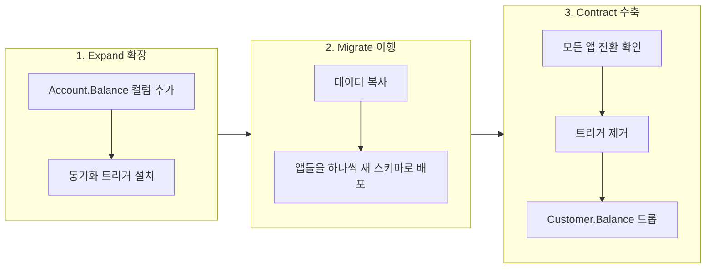

import { Callout, Steps, Step, Tabs, TabsList, TabsTrigger, TabsContent } from '@/components/writing-ui';

## 이게 뭔데

스키마 하나 바꾸는 거, 책상에서 보면 30초짜리다. `ALTER TABLE Account ADD Balance Numeric;` 치고, `Customer.Balance`에서 옮겨오고, 옛 컬럼 드롭. 끝. 개발 샌드박스에서는 진짜로 이렇게 끝난다. 스키마도 코드도 내가 다 쥐고 있으니까 같은 PR에서 한 방에 바꾸면 된다.

문제는 그 DB를 **나만 쓰는 게 아닐 때** 시작된다.

은행 DB를 떠올려보자. `Customer`, `Account`, `Policy`, `Insurance` 테이블이 있고, 여기 붙어서 돌아가는 애플리케이션이 한두 개가 아니다. 인터넷뱅킹 앱, 콜센터 상담 시스템, 새벽에 도는 이자 정산 배치, 분기에 한 번 깨어나는 규제 리포팅 잡, 그리고 누가 만들었는지 아무도 기억 못 하는 15년 된 COBOL 프로그램까지. 이게 다 `Customer.Balance`를 읽고 쓴다.

이 상황에서 `Customer.Balance`를 `Account.Balance`로 옮긴다고 컬럼을 그냥 드롭하면? 인터넷뱅킹은 새 코드로 배포돼서 멀쩡한데, 아직 배포 안 된 배치 잡이 새벽 2시에 깨어나서 `Customer.Balance`를 찾다가 그대로 자빠진다. 다음 날 아침, 고객 잔액이 안 맞는다는 민원이 콜센터에 쌓인다.

그래서 등장하는 게 **전환 기간(transition period)**이다. 옛 스키마와 새 스키마를 **한동안 둘 다 살려두는** 기간. 모든 팀이 자기 앱을 새 스키마로 갈아탈 시간을 벌어주는 거다.

<Callout type="info" title="한 줄 요약">
공유 DB에서 스키마를 바꿀 때, 모든 앱을 동시에 못 바꾸니까 옛/새 스키마를 한동안 병렬로 돌린다. 옛것과 새것 사이를 동기화 트리거(스캐폴딩)로 묶어두고, 모든 앱이 새것으로 넘어오면 정해둔 날짜에 옛것을 제거한다. 이게 곧 현대의 expand-contract(parallel change) 패턴이다.
</Callout>

## 단일 앱이면 이 고민 자체가 없다

먼저 선을 하나 긋자. **전환 기간이 필요한 건 다중 애플리케이션 환경 얘기다.**

스키마와 코드를 내가 전부 통제하는 단일 애플리케이션이라면, 옛/새 스키마를 병렬 지원할 이유가 없다. 그냥 같은 릴리스에서 같이 바꾸면 된다. 책에서 권하는 순서도 사실 단순하다. TDD로 가면 이렇다.

<Steps>
<Step title="새 위치 도입">
`Account.Balance` 컬럼을 추가한다. 먼저 `Account.Balance`를 읽는 테스트를 쓰고(실패 확인), 컬럼을 추가해서 통과시킨다.
</Step>
<Step title="코드를 새 위치로">
입금/출금 로직이 `Customer.Balance`가 아니라 `Account.Balance`로 동작하도록 고친다. 테스트가 빨개지면 로직을 고친다.
</Step>
<Step title="데이터 복사">
안전하게 `Customer.Balance` 값을 백업하고 해당 행의 `Account.Balance`로 복사한다. 고객별로 제대로 옮겨졌는지 테스트로 검증.
</Step>
<Step title="옛 위치 드롭">
`Customer.Balance` 컬럼을 드롭하고 전체 테스트를 다시 돌린다. 통합 환경으로 승격.
</Step>
</Steps>

여기엔 전환 기간이 없다. 굳이 따지면 통합 샌드박스 안에서 동료들이 코드 갱신하고 재테스트할 며칠 정도가 "미니 전환 기간"일 뿐이다.

<Callout type="note" title="SI·소규모 팀이라면 대부분 여기">
SI 프로젝트나 우리 앱 하나가 DB를 전담하는 환경이면 1.5년짜리 전환 기간이나 동기화 트리거는 거의 필요 없다. 스키마와 코드를 같은 릴리스에서 같이 바꾸는 게 가장 큰 단순화다. 진짜 위험은 "운영 중인 레거시 DB를 협력사·배치 잡·리포팅 도구가 같이 쓰고 있을 때" 생긴다. 그때만 아래 얘기가 필요하다.
</Callout>

## 다중 앱: 한날한시에 못 바꾼다는 게 핵심

다중 애플리케이션 환경의 전제는 딱 하나다. **모든 앱을 동시에 리팩토링·배포할 수 없다.**

왜 그럴까. 팀마다 릴리스 속도가 천차만별이라서다. 인터넷뱅킹 팀은 2주에 한 번 배포하지만, 어떤 시스템은 지금 아무도 손 안 대고 있고, 또 어떤 레거시는 전통적 생애주기를 따라 **1년에 한 번** 릴리스한다. 분기 규제 리포팅 잡은 분기에 한 번만 깨어난다. 전환 기간은 이 **느린 팀과 빠른 팀을 전부** 감안해야 한다. 그래서 책에서는 전형적으로 몇 분기에서 몇 년, 예제에서는 최소 1.5년을 잡는다.

전환 기간 동안 두 가지를 가정한다.

- 어떤 앱은 아직 옛 스키마를 쓰고, 어떤 앱은 이미 새 스키마를 쓴다. **둘이 공존한다.**
- 한 앱은 옛것이든 새것이든 **둘 중 하나만** 쓰면 된다. 둘 다 갱신하라고 강요하지 않는다.

이 두 번째 가정이 중요하다. 우리는 개별 앱이 옛 컬럼과 새 컬럼을 둘 다 성실히 갱신해 주리라고 **믿을 수 없다**. 15년 된 COBOL 프로그램한테 "이제부터 `Account.Balance`도 같이 써줘"라고 부탁할 수는 없잖아. 그 앱은 자기가 아는 `Customer.Balance`만 계속 쓴다. 새 인터넷뱅킹 앱은 `Account.Balance`만 쓴다. 그럼 둘 사이가 어긋난다.

그래서 **동기화 메커니즘**이 필요하다.

## 두 컬럼을 트리거로 묶어두기

옛 컬럼과 새 컬럼을 묶는 풀(glue)이 바로 동기화 트리거다. 책에서는 이걸 **스캐폴딩 코드(scaffolding code)**라고 부른다. 건물 다 지으면 뜯어낼 비계라는 뜻이다. 영구물이 아니다.

`Customer.Balance` ↔ `Account.Balance` 양방향을 묶으려면 트리거가 둘 필요하다. 한쪽이 바뀌면 다른 쪽도 따라 바뀌게.

```sql
-- 옛 코드가 Customer.Balance를 갱신하면 → Account.Balance로 전파
-- drop date: 2026-12-14 (전환 기간 종료 시 제거)
CREATE OR REPLACE TRIGGER SynchronizeAccountBalance
AFTER UPDATE OF Balance ON Customer
FOR EACH ROW
BEGIN
  UPDATE Account
     SET Balance = :NEW.Balance
   WHERE Account.CustomerID = :NEW.CustomerID;
END;
```

```sql
-- 새 코드가 Account.Balance를 갱신하면 → Customer.Balance로 역전파
-- drop date: 2026-12-14
CREATE OR REPLACE TRIGGER SynchronizeCustomerBalance
AFTER UPDATE OF Balance ON Account
FOR EACH ROW
BEGIN
  UPDATE Customer
     SET Balance = :NEW.Balance
   WHERE Customer.CustomerID = :NEW.CustomerID;
END;
```

이러면 옛 코드가 `Customer.Balance`만 만져도 트리거가 `Account.Balance`로 전파하고, 새 코드가 `Account.Balance`만 만져도 트리거가 `Customer.Balance`로 되돌린다. 어느 쪽 앱을 쓰든 두 컬럼이 항상 같은 값을 본다. 앱 입장에선 마치 같은 데이터를 보는 것 같다.

폐기 대상에는 날짜를 박아둔다. 옛 컬럼에는 **제거 날짜(removal date)**, 트리거에는 **드롭 날짜(drop date)**를. 책의 예제처럼 컬럼 코멘트에 박는 식이다.

```sql
COMMENT ON COLUMN Customer.Balance IS
  'DEPRECATED. Moved to Account.Balance. Removal date: 2026-12-14';
```

<Callout type="warning" title="왜 하필 트리거냐">
"뷰로 옛 컬럼을 흉내 내거나, 배치로 밤마다 동기화하면 안 되나?" 된다. 대안은 있다. 하지만 뷰는 쓰기를 깔끔하게 못 받아주는 경우가 많고, 사후 배치 동기화는 동기화되기 전까지 두 값이 어긋나는 창(window)이 생긴다. 두 앱이 그 창에서 서로 다른 잔액을 본다는 건 은행에선 사고다. 그래서 책은 "트리거가 가장 잘 작동한다"고 결론짓는다. 실시간으로, 트랜잭션 안에서 묶이니까.
</Callout>

## 이게 사실 expand-contract다

여기까지가 2006년 책의 골격이다. 그리고 지금 보면 이건 정확히 현대의 **expand-contract** 패턴이다. **parallel change**라고도 부른다. Martin Fowler가 정리한 그 패턴 맞다. 이름만 다르지 구조가 똑같다.

세 단계로 끊는다.



<Steps>
<Step title="Expand — 늘린다">
새 컬럼/테이블을 추가한다. 옛것은 그대로 둔다. 동기화 트리거(스캐폴딩)를 깔아서 둘을 묶는다. 이 단계는 기존 앱을 하나도 안 깨뜨린다. 옛 컬럼이 멀쩡히 살아 있으니까. 가산적 변경(additive change)만 한다는 게 핵심이다.
</Step>
<Step title="Migrate — 옮긴다">
존재하는 데이터를 새 위치로 복사한다. 그다음 앱들을 **각자의 속도로** 새 스키마로 갱신·재배포한다. 인터넷뱅킹은 다음 스프린트에, 배치 잡은 다음 분기에, 레거시는 내년에. 트리거가 묶고 있으니 누가 먼저 넘어가든 데이터는 안 깨진다.
</Step>
<Step title="Contract — 줄인다">
모든 앱이 새 스키마로 넘어온 걸 확인한 뒤, 스캐폴딩(트리거)을 뜯고 옛 컬럼을 드롭한다. 이제야 리팩토링이 진짜로 끝난다.
</Step>
</Steps>

가장 흔한 사고는 1단계(expand)와 3단계(contract)를 **같은 배포에 욱여넣는** 거다. 그게 바로 맨 위에서 본 "컬럼 그냥 드롭했다가 배치 잡 자빠진" 사고다. expand-contract의 본질은 "확장과 수축을 시간으로 떼어 놓는 것"이다. 그 사이 간격이 곧 전환 기간이다.

<Callout type="error" title="뭐가 문제냐면 (한 배포에 다 넣을 때)">
- **느린 팀이 못 따라온다**: 1년에 한 번 배포하는 앱은 다음 릴리스 전까지 옛 스키마를 본다. 그 전에 드롭하면 그 앱이 죽는다.
- **롤백이 지옥이 된다**: 컬럼을 드롭한 배포를 되돌리려면 데이터를 복구해야 한다. 확장만 한 배포는 그냥 새 컬럼 무시하면 되니 롤백이 공짜에 가깝다.
- **언제 누가 깨지는지 안 보인다**: 분기 리포팅 잡은 분기에 한 번 깨어난다. 평소엔 멀쩡하다가 결산 시즌에 터진다. git blame 찍으면 3개월 전의 내가 나온다.
</Callout>

## 현대 도구로 옮기면

2006년 책은 이걸 번호 매긴 SQL 스크립트와 손코딩한 트리거로 했다. 지금은 마이그레이션 도구가 이 단계를 그대로 받아준다. 핵심은 **expand와 contract를 별도 마이그레이션 파일로 떼어 놓는 것**이다. 한 파일에 둘 다 넣지 말고.

<Tabs defaultValue="flyway">
<TabsList>
<TabsTrigger value="flyway">Flyway / Liquibase</TabsTrigger>
<TabsTrigger value="orm">ORM 마이그레이션</TabsTrigger>
<TabsTrigger value="online">온라인 스키마 변경</TabsTrigger>
</TabsList>

<TabsContent value="flyway">

번호 매긴 스크립트를 순차 적용하는 Flyway/Liquibase는 책의 "작은 스크립트에 고유 번호 부여"와 정확히 같은 모델이다. expand와 contract를 버전을 갈라 둔다.

```text
V42__expand_add_account_balance.sql      <- 릴리스 1: 컬럼 + 트리거 추가
V43__migrate_copy_balance_data.sql       <- 릴리스 1: 데이터 복사
-- ... 전환 기간 (여러 릴리스에 걸쳐 앱들이 갈아탐) ...
V58__contract_drop_customer_balance.sql  <- 릴리스 N: 트리거 + 옛 컬럼 제거
```

V58은 전환 기간이 끝나기 전엔 만들지도 말고 운영에 올리지도 마라. 책의 "지정 날짜(분기당 한 번)에 폐기 스키마를 묶어서 제거"가 곧 이 contract 릴리스다.

</TabsContent>

<TabsContent value="orm">

Prisma, TypeORM, Django ORM, Rails, Alembic 다 같은 원칙이다. 도구가 마이그레이션을 자동 생성해주더라도, **모델을 한 번에 다 바꾸고 자동 생성에 맡기면 자동으로 destructive 마이그레이션이 나온다**(옛 컬럼 drop이 같은 파일에 딸려 들어옴). 그게 위험하다.

expand-contract를 손으로 끊어줘야 한다. 1차 PR에선 새 필드만 추가(옛 필드는 코드에 남겨둠), 데이터 백필, 코드 전환. 옛 필드 제거는 별도 PR로, 모든 소비자가 넘어온 걸 확인한 뒤. ORM이 알아서 안 해준다. 사람이 끊는다.

</TabsContent>

<TabsContent value="online">

전환 기간이 짧고 단일 DB 안에서 컬럼/인덱스를 무중단으로 바꾸는 거라면 온라인 스키마 변경 도구가 들어온다. 이것도 결국 expand-contract의 자동화다 — 그림자 테이블을 만들고(expand), 데이터를 채우고(migrate), 원자적으로 교체한 뒤 옛것을 버린다(contract).

- MySQL: gh-ost, pt-online-schema-change
- PostgreSQL: `CREATE INDEX CONCURRENTLY`, 제약은 `ADD CONSTRAINT ... NOT VALID` → 나중에 `VALIDATE CONSTRAINT`로 쪼개기

`NOT VALID` → `VALIDATE` 이 두 단계가 바로 미니 expand-contract다. 긴 락을 한 번에 잡는 대신 두 단계로 끊어서, 기존 쓰기를 안 막는다.

</TabsContent>
</Tabs>

<Callout type="info" title="앱끼리 DB를 공유하는 게 진짜 원흉">
사실 전환 기간이 이렇게 길고 고통스러운 근본 원인은 "여러 앱이 한 DB를 직접 공유"하는 구조 자체다. 마이크로서비스 세계에서 공유 DB는 대표적 안티패턴으로 꼽힌다. DB를 한 서비스가 소유하고 나머지는 API로만 접근하면, 스키마는 그 서비스 안에서만 바꾸면 되니 전환 기간이 며칠로 줄어든다. 정 옛 앱들과 데이터를 나눠야 하면 CDC(Debezium)로 변경을 흘려보내거나 outbox 패턴으로 이벤트를 발행하는 식으로 결합을 끊는다. 결합을 줄일수록 전환 기간이 짧아진다는 게 핵심이다.
</Callout>

## 전환 기간을 끝내기: 폐기 스키마 제거

여기서 많이들 놓치는 게 있다. **폐기 스키마를 운영에서 실제로 제거하기 전까지, 리팩토링은 진짜로 끝난 게 아니다.**

전환 기간이 끝나면 폐기된 옛 컬럼과 **모든 스캐폴딩 코드**(동기화 트리거)를 제거해야 한다. 안 그러면 영원히 비계를 둘러쓴 건물이 된다. 트리거는 계속 돌면서 쓰기 성능을 갉아먹고, 옛 컬럼은 "이거 진짜 죽은 거 맞아?" 하는 의심을 계속 만든다.

그런데 전환 기간이 수년일 수 있다는 게 함정이다. 그동안 부서 인력이 바뀐다. 처음에 트리거 깔았던 사람은 퇴사했고, 드롭 날짜 2026-12-14를 기억하는 사람도 없다. 그래서 책의 조언은 **자동화하고, 지정 날짜를 두라**는 거다. 가장 쉬운 방법은 "분기당 한 번, 폐기된 것들을 묶어서 제거하는 날"을 정해두는 거다. 스키마 개선과 폐기 제거를 같은 윈도우에 묶어서.

제거 순서는 신중하게.

<Steps>
<Step title="모든 소비자 전환 확인">
옛 컬럼을 진짜 아무도 안 쓰는지 확인한다. 쿼리 로그, 모니터링, 또는 컬럼에 일시적으로 트리거를 걸어 "누가 아직 쓰면 알림" 같은 장치로 검증한다. 분기 리포팅 잡처럼 가끔 깨어나는 놈을 놓치지 마라.
</Step>
<Step title="스테이징에서 먼저 제거">
운영에서 빼기 전에 사전 운영(스테이징/QA) 환경에서 먼저 폐기 부분을 제거하고 전체 재테스트한다. 여전히 다 도는지 확인.
</Step>
<Step title="운영에 적용 + 테스트">
운영에 적용하고 거기서 회귀 테스트 스위트를 돌린다. 깨지면 백아웃, 멀쩡하면 진행.
</Step>
<Step title="비계 철거">
트리거 드롭, 옛 컬럼 드롭. 이제야 리팩토링 완료.
</Step>
</Steps>

<Callout type="warning" title="아무리 강조해도 지나치지 않다">
폐기 부분을 운영에서 빼기 전에 반드시 스테이징에서 먼저 빼고 전부 재테스트해라. "이 컬럼 이제 아무도 안 쓰겠지" 하는 추측만으로 운영에서 드롭하면, 분기에 한 번 깨어나는 그 리포팅 잡이 결산일에 깨지면서 당신을 찾아온다. 드롭은 되돌리기 가장 비싼 작업이다. 데이터가 같이 날아가니까.
</Callout>

## 전환 기간이 필요 없는 리팩토링도 있다

마지막으로 균형. 모든 스키마 변경에 전환 기간이 필요한 건 아니다.

값을 **넓히는** 변경(가산적)은 옛 앱을 안 깨뜨리니 전환 기간이 거의 필요 없다. 반대로 값을 **좁히는** 변경 — 예를 들어 컬럼에 제약을 거는 `Introduce Column Constraint`나 허용 코드를 좁히는 `Apply Standard Codes` — 은 컬럼 구조 자체는 그대로라 옛/새 스키마가 따로 없다. 그래서 전환 기간이 없다.

다만 함정은, **좁아진 값이 기존 앱을 깰 수 있다**는 거다. 지금까지 아무 문자열이나 넣던 컬럼에 갑자기 "1~7만 허용" 제약을 걸면, 8을 넣던 옛 앱이 INSERT에서 터진다. 전환 기간이 없다고 안전한 게 아니라, **종류가 다른 위험**이다. 이런 변경은 전환 기간 대신 "기존 데이터가 새 제약을 다 만족하는지 먼저 검증"이 숙제가 된다. PostgreSQL의 `NOT VALID` → `VALIDATE` 가 이 검증을 무중단으로 쪼개는 도구인 것도 같은 맥락이다.

## 정리

공유 DB의 스키마 변경이 무서운 건 변경 자체가 어려워서가 아니다. **모든 앱을 한날한시에 못 바꾸기 때문**이다.

> **전환 기간 = 확장과 수축 사이의 시간. 그 사이를 스캐폴딩으로 묶어 둔다.**

옛 스키마와 새 스키마를 한동안 둘 다 살려두고(expand), 동기화 트리거로 묶어서 어느 앱이 어느 쪽을 쓰든 데이터가 안 어긋나게 하고, 모든 팀이 각자 속도로 새 스키마로 넘어올 시간을 준다(migrate). 그리고 전부 넘어온 걸 확인한 뒤 정해둔 날짜에 비계를 철거한다(contract). 2006년엔 손코딩한 트리거와 번호 매긴 SQL로, 지금은 Flyway/Liquibase의 갈라둔 마이그레이션과 온라인 스키마 변경 도구로 한다. 도구는 바뀌었지만 골격은 그대로다.

그러니 공유 DB에서 컬럼 하나 드롭하려고 마우스를 가져갈 때, 스스로에게 물어라. "이거 쓰는 앱이 정말 하나도 안 남았나? 분기에 한 번 깨어나는 그놈까지?" 확신이 안 서면, 아직 contract할 때가 아니다.
