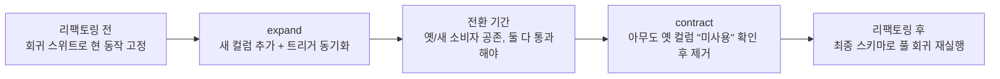

## 이런 적 있을 거임

금요일 저녁, 마이그레이션 하나를 운영에 올린다. `Customer.Balance` 컬럼을 새로 만든 `Account.Balance`로 옮기는 작업이다. DDL은 깔끔하고, 로컬에서도 잘 돌았고, CI도 초록불이다. 배포 버튼을 누른다. 마이그레이션 툴이 "Successfully applied migration 163"이라고 찍는다. 흐뭇하다. 퇴근한다.

월요일 아침, 슬랙이 빨갛다. 고객 3,200명의 잔액이 0으로 찍혀 있다. 마이그레이션은 분명 "성공"했다. `ALTER TABLE`도 됐고, 데이터 복사 쿼리도 에러 없이 끝났다. 그런데 왜 잔액이 날아갔냐면 — 복사 쿼리의 `JOIN` 조건이 살짝 어긋나서, 계좌가 둘 이상인 고객의 잔액이 한쪽 계좌로만 들어가거나 아예 매칭이 안 됐던 거다. 마이그레이션 툴 입장에선 SQL이 에러 없이 끝났으니 "성공"이고, 너 입장에선 데이터가 증발한 거다.

여기서 핵심을 하나 짚자. **마이그레이션이 "에러 없이 실행됐다"는 것과 "데이터가 올바르다"는 건 전혀 다른 얘기다.** DDL이 통과하는 건 문법이 맞다는 뜻이지, 의미가 맞다는 뜻이 아니다. 이 간극을 메우는 게 테스트다.

<Callout type="warning" title="한 줄 요약">
데이터베이스 리팩토링은 세 군데가 깨질 수 있다 — (1) 스키마 자체(제약·트리거·뷰), (2) 데이터 마이그레이션(복사·정제가 진짜 맞았는지), (3) 그 스키마를 쓰는 외부 프로그램. 리팩토링 전·중·후로 이 셋을 각각 검증해야 안심하고 손댈 수 있다.
</Callout>

## TDD를 DB에도 적용한다

애플리케이션 코드에선 TDD가 익숙하다. 테스트를 먼저 쓰고, 그걸 통과시킬 만큼만 코드를 짜고, 반복한다. 데이터베이스 리팩토링도 똑같이 굴릴 수 있다. 다만 여기서 "코드"는 대개 DDL이다.

흐름은 이렇다.

<Steps>
<Step title="실패하는 테스트를 먼저 쓴다">
"`Account.Balance` 컬럼이 존재해야 한다", "잔액의 default는 0이어야 한다", "`Customer.Balance`의 합과 `Account.Balance`의 합이 고객별로 같아야 한다" 같은 기대를 테스트로 박는다. 아직 컬럼이 없으니 당연히 빨간불.
</Step>
<Step title="통과할 만큼만 DDL을 쓴다">
`ALTER TABLE Account ADD Balance Numeric DEFAULT 0;` 정도. 동기화 트리거가 필요하면 그것도. 딱 테스트를 초록불로 만들 만큼만.
</Step>
<Step title="리팩토링이 완성될 때까지 반복한다">
스키마 → 데이터 복사 → 트리거 → 정합성 검증, 하나씩 테스트를 추가하며 굴린다. 매 단계가 테스트로 고정돼 있으니, 다음 단계에서 앞 단계를 깨면 바로 빨간불이 뜬다.
</Step>
</Steps>

2006년의 원전(Scott Ambler & Pramod Sadalage)에선 이걸 손으로 짠 SQL 스크립트와 DBUnit/SQLUnit으로 했다. 지금은 도구가 훨씬 좋아졌지만 **철학은 1mm도 안 바뀌었다.** 테스트가 먼저, DDL이 나중. 그러면 "마이그레이션이 성공했는데 데이터가 틀린" 그 월요일 아침을 안 맞는다.

## 축 1 — 스키마 테스트

첫 번째 축은 스키마 그 자체다. 컬럼을 추가하고 제약을 걸고 트리거를 만들었으면, 그게 **진짜로 우리가 의도한 대로 동작하는지**를 봐야 한다. "ALTER가 에러 없이 끝났음"은 증거가 아니다.

스키마 테스트가 잡아야 하는 것들:

- **제약(constraint)**: 허용 값이 진짜로 좁혀졌나. 정책 코드가 1~7만 허용이라면, 8을 넣었을 때 정말 거부되는지 직접 INSERT 해보고 실패를 확인한다.
- **default value**: 컬럼에 default를 줬으면, 값 없이 INSERT 했을 때 그 default가 실제로 박히는지. "DEFAULT 0이라고 적었으니 되겠지"는 가정이지 검증이 아니다.
- **참조 무결성**: `Account`가 사라진 `Customer`를 가리키지 못하는지, 연쇄 삭제(cascade)가 의도대로 도는지. 부모를 지웠을 때 자식이 같이 죽거나, 막혀야 하면 막히는지.
- **트리거**: 동기화 트리거를 넣었으면, 한쪽을 갱신했을 때 다른 쪽이 정말 따라오는지.
- **뷰 정의**: 필터/선택 로직, 행 개수, 컬럼 순서. 뷰는 조용히 틀리기 쉽다.

이걸 "스키마가 이렇게 생겼어야 한다"는 정적 비교가 아니라, **실제로 INSERT/UPDATE/DELETE를 때려보고 결과를 단언하는** 행동 테스트로 짜는 게 핵심이다. 제약은 깨봐야 걸리는지 알 수 있다.

```sql
-- 제약 테스트: 허용 범위 밖 값은 거부돼야 한다
-- (정책 코드는 1~7만 허용)
INSERT INTO Policy (CustomerID, PolicyCode) VALUES (42, 8);
-- 기대: ERROR — check constraint 위반. 통과하면 제약이 안 걸린 거다.

-- default 테스트: 값을 안 주면 0이 박혀야 한다
INSERT INTO Account (CustomerID) VALUES (42);
SELECT Balance FROM Account WHERE CustomerID = 42;  -- 기대: 0
```

동기화 트리거를 깐 경우, 트리거가 양방향으로 도는지 직접 확인한다. 새 코드는 `Account.Balance`만 갱신하고 갱신 안 된 옛 코드는 `Customer.Balance`만 갱신한다고 가정하므로, 트리거가 둘을 묶어주는 게 전환 기간의 생명줄이다. 이게 한 방향만 돌면 데이터가 조용히 갈라진다.

```sql
-- 트리거 테스트: 한쪽을 바꾸면 다른 쪽도 따라와야 한다
UPDATE Customer SET Balance = 1000 WHERE CustomerID = 42;
SELECT Balance FROM Account WHERE CustomerID = 42;   -- 기대: 1000

UPDATE Account SET Balance = 2000 WHERE CustomerID = 42;
SELECT Balance FROM Customer WHERE CustomerID = 42;  -- 기대: 2000
```

<Callout type="info" title="요즘은 이렇게도 한다">
스키마 테스트는 코드 테스트랑 합칠 수 있다. 일회용 테스트 DB(Testcontainers로 진짜 Postgres 컨테이너를 띄우거나, 인메모리 대신 실 DB)에 마이그레이션을 통째로 적용한 다음, 그 위에서 위 INSERT/UPDATE 단언을 돌리면 된다. SQLUnit이 하던 일(저장 프로시저·제약 검증)을 지금은 pgTAP, 혹은 그냥 평범한 통합 테스트 코드로 한다. 도구 이름은 바뀌어도 "스키마를 실제로 때려보고 단언한다"는 행위는 같다.
</Callout>

## 축 2 — 데이터 마이그레이션 검증

두 번째 축이 그 월요일 아침을 부른 범인이다. 스키마는 멀쩡한데 **옮긴 데이터가 틀린** 경우. 이게 제일 무섭고, 제일 자주 빠뜨린다.

DDL은 구조를 바꾸지만, 데이터 마이그레이션은 값을 옮긴다. `Customer.Balance`를 `Account.Balance`로 복사한다면, **고객 한 명 한 명에 대해** 잔액이 올바르게 넘어갔는지 봐야 한다. 전체 합계만 맞춰서는 안 된다 — A 고객 잔액이 B 고객으로 잘못 들어가도 총합은 그대로니까.

데이터 정제(cleanse)가 끼면 더 까다롭다. 원전의 두 사례:

- **Apply Standard Codes**: `USA`, `U.S.`, `United States`를 전부 `US`로 통일. 검증 포인트 — 정제 후에 옛 표기가 **단 하나도 안 남았는지**, 그리고 정제 과정에서 멀쩡한 다른 값을 잘못 건드리진 않았는지.
- **Consolidate Key Strategy**: 고객 식별을 customer ID로 일원화. 검증 포인트 — 옛 식별자가 더는 안 쓰이는지, 그리고 그걸 일원화하면서 **고객-계좌 관계가 끊기지 않았는지**.

검증의 실전 무기는 단순하다. **행 수와 체크섬.**

```sql
-- 1) 행 수 보존: 옮기는 동안 행이 새거나 증발하지 않았나
SELECT
  (SELECT COUNT(*) FROM Customer)                AS customer_count,
  (SELECT COUNT(*) FROM Account WHERE Balance IS NOT NULL) AS migrated_count;
-- 두 수의 관계가 기대(예: 1:1이면 같음)와 맞는지 확인

-- 2) 고객별 정합성: 한 명이라도 어긋나면 행이 잡힌다
SELECT c.CustomerID, c.Balance AS old_bal, a.Balance AS new_bal
FROM Customer c
JOIN Account a ON a.CustomerID = c.CustomerID
WHERE c.Balance <> a.Balance;
-- 기대: 0행. 한 줄이라도 나오면 그 고객이 틀린 거다.

-- 3) 정제 검증: 옛 표기가 정말 다 사라졌나
SELECT Country, COUNT(*)
FROM Customer
WHERE Country IN ('USA', 'U.S.', 'United States')
GROUP BY Country;
-- 기대: 0행
```

체크섬은 "값 전체가 통째로 보존됐는지"를 한 방에 보는 트릭이다. 마이그레이션 전후로 같은 컬럼 집합의 집계 해시를 떠서 비교하면, 단 하나의 값이라도 바뀌면 해시가 달라진다.

```sql
-- 마이그레이션 전후로 떠서 비교 (Postgres 예시)
SELECT md5(string_agg(CustomerID || ':' || Balance, ',' ORDER BY CustomerID))
FROM Account;
```

<Callout type="error" title="뭐가 문제냐면">
데이터 마이그레이션 버그는 **조용하다.** 스키마 오류는 그 자리에서 에러로 터지지만, 잘못 옮겨진 데이터는 멀쩡한 얼굴로 앉아 있다가 한참 뒤에 "고객이 잔액 이상하다고 문의했어요"로 발견된다. 그때쯤이면 원본은 이미 지웠을 수도 있다. 그래서 **마이그레이션 직후, 원본을 지우기 전에** 정합성 쿼리를 돌리는 게 마지노선이다.
</Callout>

이걸 더 든든하게 만드는 게 **dry-run**이다. 운영에 직접 쓰기 전에, 운영 데이터의 사본(혹은 운영 규모의 스테이징)에 똑같은 마이그레이션을 한 번 굴려보고 위 검증 쿼리를 돌린다. 로컬의 10건짜리 데이터에선 절대 안 보이는 게 운영 규모에선 보인다 — NULL 처리, 중복 키, 인코딩 깨진 옛 데이터, 계좌가 둘인 고객. dry-run은 "내 마이그레이션이 실제 데이터의 더러움을 견디는가"를 보는 리허설이다.

## 축 3 — 외부 접근 프로그램 테스트

세 번째 축은 스키마 바깥이다. 그 테이블을 읽고 쓰는 **모든 프로그램** — 앱, 배치 잡, 리포트, 다른 팀의 서비스, ETL. 스키마를 바꾸면 이것들이 깨질 수 있다.

원전의 접근법은 정직하다. **최종 스키마를 도입해보고 무엇이 깨지는지 본다.** 이게 가능하려면 풀 회귀 테스트 스위트가 있어야 한다. 그게 있으면 "Customer.Balance를 지웠더니 야간 정산 배치가 죽네"를 운영이 아니라 CI에서 본다.

원전은 솔직하게 인정한다 — **"풀 회귀 스위트가 있을 가능성은 크지 않다. 하지만 지금이 그걸 만들기 시작할 최적의 시점이다."** 이건 2006년이나 지금이나 똑같이 맞다. 리팩토링을 안전하게 하고 싶으면, 안전망부터 짠다.

여기서 2006년과 지금이 결정적으로 갈린다. 그때는 보통 **한 회사 안의 한 DB를 여러 앱이 공유**했다. 지금은 마이크로서비스 시대고, **남의 서비스가 내 DB를 직접 읽는 건 안티패턴(shared database)**이다. 그래도 현실에선 공유 DB가 흔하고, 그럴수록 "이 테이블을 누가 만지는지"를 내가 다 알 수 없다는 게 더 무섭다. 그래서 도구가 진화했다.

- **expand-contract (parallel change)**: 컬럼을 바로 지우지 않는다. (expand) 새 컬럼 추가 + 둘 다 채움 → (전환) 모든 소비자가 새 컬럼으로 갈아탈 시간을 줌 → (contract) 아무도 옛 컬럼을 안 쓰는 걸 확인한 뒤 제거. 트리거로 둘을 동기화하는 원전의 "전환 기간"이 정확히 이 패턴의 조상이다.
- **온라인 스키마 변경**: 큰 테이블에 `ALTER`를 직접 걸면 락이 잡혀 앱이 멈춘다. Postgres는 `CREATE INDEX CONCURRENTLY`, 제약은 `ADD CONSTRAINT ... NOT VALID` 후 `VALIDATE CONSTRAINT`로 락을 쪼갠다. MySQL은 gh-ost나 pt-osc로 그림자 테이블에 복사하며 바꾼다. 검증 관점에서 중요한 건, 이 과정 **중에도** 앱이 멀쩡히 도는지를 테스트해야 한다는 거다.
- **CDC / outbox**: 옛 코드를 직접 못 고치는 경우, Debezium 같은 CDC로 변경을 흘려 새 구조에 반영하기도 한다. 이때도 "흘러간 데이터가 맞는가"는 결국 축 2의 정합성 쿼리로 돌아온다.



## 그리고 — 롤백도 테스트다

배포 얘기할 때 다들 "어떻게 올릴까"만 본다. 정작 새벽 3시에 너를 살리는 건 **"어떻게 내릴까"**다. 마이그레이션 도구(Flyway, Liquibase, Alembic, Rails/Django/Prisma 마이그레이션)는 대부분 down/rollback 스크립트를 지원한다. 근데 그 down 스크립트, **테스트해본 적 있나?**

대개 없다. up만 굴려보고 끝낸다. 그러다 진짜 롤백이 필요한 순간에 down 스크립트가 에러를 뱉거나, 더 나쁘게는 데이터를 날린다. 그래서 CI에 이 한 줄짜리 리허설을 넣는 게 싸고 강력하다.

```text
1. 마이그레이션 적용 (up)        → 스키마 테스트 통과 확인
2. 롤백 (down)                  → 에러 없이 원상복귀 확인
3. 다시 적용 (up)               → 두 번째도 깨끗이 통과 확인 (멱등/재현성)
```

이 up → down → up 사이클을 매 PR마다 자동으로 돌리면, "되돌릴 수 없는 마이그레이션"을 머지 전에 잡는다. 단, 정직하게 말하면 **모든 변경이 안전하게 롤백되진 않는다.** 컬럼을 드롭하면 그 데이터는 down으로 못 되살린다. 그래서 더더욱 expand-contract가 중요하다 — 제거를 가장 뒤로, 가장 천천히 미루면, 롤백이 위험한 구간 자체가 짧아진다.

<Callout type="note" title="모든 리팩토링이 다 무거운 건 아님">
전환 기간이 필요 없는 리팩토링도 있다. `Introduce Column Constraint`나 `Apply Standard Codes`처럼 단지 허용 값을 좁히는 변경은 두 스키마가 공존할 일이 없다. 다만 좁아진 값이 기존 앱을 깰 수 있으니(전엔 통과하던 값이 이제 거부됨), 이 경우엔 전환 기간 대신 **축 3(외부 프로그램)을 더 꼼꼼히** 봐야 한다. 어디에 무게를 둘지는 리팩토링 종류가 정한다.
</Callout>

## 테스트가 없으면 — 지금이 만들 때다

원전이 짚는 가장 흔한 변명은 셋이다. (1) DB 테스트 기술이 없다, (2) DB 단위 테스트 문화가 없다, (3) 도구가 없다. 2006년엔 DBUnit(테스트 데이터 관리)·SQLUnit(저장 프로시저 검증)이 막 나온 참이었다. 지금은 Testcontainers, pgTAP, 마이그레이션 도구의 내장 검증, CI 파이프라인까지 발에 채이게 많다. **도구 없다는 변명은 이제 유효기간이 지났다.**

기술 부족은 훈련·페어링·시행착오로 넘는다. 그리고 가장 중요한 건 타이밍이다. 리팩토링을 앞두고 "테스트가 하나도 없네"를 깨달았다면, 그게 바로 테스트 스위트를 만들기 시작할 최적의 순간이다. 안전망 없이 공중그네를 타는 것보다, 그물을 먼저 치고 시작하는 게 빠르다.

## 정리

데이터베이스 리팩토링에서 "마이그레이션 성공"은 시작이지 끝이 아니다. SQL이 에러 없이 끝났다는 건 문법이 맞다는 뜻일 뿐, 데이터가 맞다는 보장이 아니다. 그래서 전·중·후로 세 축을 검증한다.

> **스키마가 의도대로 도는가 / 데이터가 한 명도 안 틀리고 옮겨졌는가 / 그걸 쓰는 모든 프로그램이 멀쩡한가.**

스키마는 INSERT/UPDATE를 실제로 때려 단언하고(제약·default·트리거·뷰), 데이터는 행 수·체크섬·고객별 정합성 쿼리로 검증하고(원본 지우기 전에, dry-run으로 한 번 더), 외부 프로그램은 풀 회귀 스위트로 최종 스키마를 미리 깨본다. 여기에 expand-contract로 위험을 잘게 쪼개고, 온라인 스키마 변경으로 락을 피하고, up → down → up 사이클로 롤백까지 리허설하면 — 금요일 저녁에 배포하고도 주말에 슬랙을 안 켜도 된다.

테스트가 없으면? 변명할 시간에 스위트를 만든다. 안전망을 먼저 치는 게, 결국 제일 빠른 길이다.
