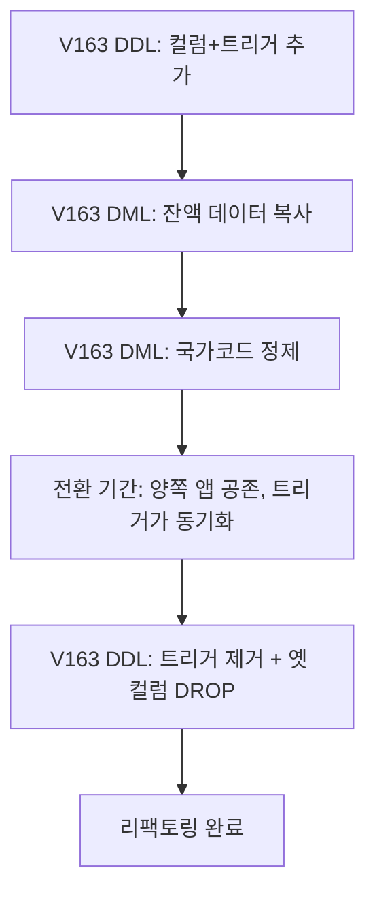

## 이게 뭔데

리팩토링을 결정했고, 테스트도 깔아놨다. 이제 진짜로 스키마를 손댈 차례다. 근데 "손댄다"는 게 생각보다 두 가지 일이다.

하나는 **구조를 바꾸는 일**이다. `Account` 테이블에 `Balance` 컬럼을 추가하고, 트리거를 걸고, 인덱스를 만들고. 데이터베이스의 *모양*을 바꾸는 거다. 이걸 DDL(Data Definition Language)이라 부른다. `ALTER TABLE`, `CREATE`, `DROP` 같은 것들.

다른 하나는 **데이터를 옮기는 일**이다. 새로 만든 `Account.Balance`에 기존 `Customer.Balance` 값을 실제로 복사해 넣는 거다. 모양만 바꾸고 칸을 비워두면 의미가 없으니까. 이건 DML(Data Manipulation Language). `UPDATE`, `INSERT`, `DELETE`.

이 편의 주제는 단순하다. **이 두 일을 작은 스크립트로 쪼개고, 각각 고유 번호를 붙이고, DDL과 DML을 섞지 마라.** 별것 아닌 것 같은데, 이걸 안 지키면 나중에 운영 DB 앞에서 식은땀을 흘리게 된다.

<Callout type="info" title="한 줄 요약">
스키마 변경은 "작게, 번호 매겨서, 순서대로" 쌓는 게임이다. 구조를 바꾸는 DDL과 데이터를 옮기는 DML을 따로 떼어 각각 번호 붙은 스크립트로 관리하면, 단순성·정확성·버전 관리가 공짜로 따라온다.
</Callout>

## 시나리오: 이런 적 있을 거임

은행 시스템을 만지는 Eddy와 Beverley 얘기를 해보자. 원래 잔액(`Balance`)이 `Customer` 테이블에 박혀 있었는데, 이게 영 어색하다. 잔액은 고객의 속성이 아니라 계좌의 속성이잖아. 한 고객이 계좌를 세 개 가질 수도 있고. 그래서 `Customer.Balance`를 `Account.Balance`로 옮기기로 한다.

자, 두 사람이 개발 샌드박스에서 마이그레이션 파일 하나를 연다. 그리고 의욕에 차서 이렇게 한 방에 다 때려넣는다.

```sql
-- migration_huge.sql — 다 한 파일에 욱여넣은 버전
ALTER TABLE Account ADD Balance Numeric;

UPDATE Account SET Balance =
  (SELECT Balance FROM Customer WHERE CustomerID = Account.CustomerID);

CREATE OR REPLACE TRIGGER SyncBalance
  -- ...전환 기간 동안 양쪽 동기화하는 트리거
  ;

ALTER TABLE Customer DROP COLUMN Balance;   -- 그리고 옛 컬럼도 김에 지워버림
```

개발 DB에선 잘 돈다. 데이터도 몇 줄 안 되니 `UPDATE`도 순식간. 커밋하고 PR 올린다. "스키마 변경 완료 👍".

그런데 며칠 뒤 운영 배포에서 사고가 난다. `UPDATE`가 600만 행을 한 트랜잭션으로 잡고 락을 걸어버려서 잔액 조회 API가 줄줄이 타임아웃이 났다. 게다가 마지막 줄 `DROP COLUMN Balance` 때문에 **아직 옛 컬럼을 읽던 리포팅 시스템이 죽었다.** 롤백하려고 보니, 이미 옛 컬럼을 날린 뒤라 데이터가 어디 있는지도 헷갈린다. DDL과 DML과 "정리 작업"을 한 파일에 다 비벼놨으니, **어디까지 됐고 어디서 터졌는지조차 모른다.**

이게 "큰 스크립트 한 방"의 최후다. 정작 문제는 SQL이 틀려서가 아니다. **변경을 통째로 묶어서** 쪼갤 수도, 빼낼 수도, 되돌릴 수도 없게 만든 게 문제다.

<Callout type="error" title="뭐가 문제냐면">
- **순서를 못 보장한다**: 한 파일에 다 들어가면 "이 변경이 저 변경 위에 쌓인다"는 의존 관계가 안 보인다.
- **부분 롤백이 불가능하다**: 리팩토링 하나만 빼고 싶은데, 다른 거랑 한 덩어리라 못 뺀다.
- **어디서 깨졌는지 모른다**: DDL과 DML이 섞여서, 실패하면 구조가 깨진 건지 데이터가 깨진 건지 추적이 안 된다.
- **DB마다 버전이 달라 추적이 안 된다**: 개발은 됐고 운영은 안 됐는데, "운영에 뭐가 빠졌나"를 셀 수가 없다.
</Callout>

## 작게 쪼개고 번호를 붙여라

책의 처방은 단순하다. **작은 스크립트로 작업하고, 각 리팩토링에 고유 번호를 부여하라.** 가장 쉬운 방법은 1부터 시작해 새 리팩토링마다 카운터를 하나씩 올리는 거다. 애플리케이션 빌드 번호를 그대로 갖다 써도 된다.

왜 작게 쪼개야 하나? 세 가지 이유가 있다. 이게 핵심이다.

<Steps>
<Step title="단순성 — 작은 변경은 빼기도 쉽다">
작고 집중된 스크립트는 유지보수가 쉽다. 무엇보다 **어떤 리팩토링을 취소해야 할 때 그것만 쏙 빼면 된다.** 위 시나리오처럼 다 비벼놓으면 한 줄 빼려다 전체가 무너진다.
</Step>
<Step title="정확성 — 리팩토링은 서로 위에 쌓인다">
스키마 변경은 적절한 순서로 적용돼야 정해진 방식으로 진화한다. 컬럼 이름을 바꾼 뒤 몇 주 후에 그 컬럼을 이동시킨다면, **두 번째 변경은 첫 번째에 의존한다.** 번호가 곧 순서고, 순서가 곧 정확성이다.
</Step>
<Step title="버전 관리 — DB마다 버전이 다르다">
같은 시스템이라도 개발은 163번까지, 통합은 161, QA는 155, 운영은 134까지 적용돼 있을 수 있다. 통합을 163으로 올리려면 **162·163만 골라서 적용**하면 된다. 번호가 없으면 이 계산 자체가 불가능하다.
</Step>
</Steps>

그래서 현재 어느 DB가 몇 번까지 적용됐는지를 추적하려면, `DatabaseConfiguration` 같은 공통 테이블 하나를 둬서 버전을 기록한다. 2006년식 손코딩 시절 얘기지만, 이 발상이 그대로 현대 마이그레이션 도구의 심장이 된다. 뒤에서 본다.

<Callout type="note" title="다중 팀이면 번호가 충돌하는데?">
Team A의 1701과 Team B의 1701이 부딪힌다. 해법은 둘. (1) 번호 앞에 팀 식별자를 붙여 `A-1701`, `B-1701`처럼 네임스페이스를 나누거나, (2) 카운터 대신 타임스탬프를 쓴다(`20260609T1430`). 현대 도구들이 파일명에 타임스탬프를 박는 게 바로 이 이유다.
</Callout>

## DDL과 DML은 따로 떼어라

여기가 진짜 중요한 부분이다. 책은 **구조를 바꾸는 DDL과 데이터를 옮기는 DML을 별도 스크립트로 분리**하라고 한다. 같은 식별 번호를 공유하되, 파일은 다르게.

`Customer.Balance` → `Account.Balance` 이동을 제대로 쪼개면 이렇게 된다.

먼저 구조를 만든다 (DDL). 컬럼을 추가하고, 전환 기간 동안 양쪽 잔액을 자동으로 맞춰줄 동기화 트리거를 건다. 그리고 — 이게 책의 디테일인데 — 나중에 제거할 날짜를 `COMMENT`로 박아둔다. "이 스캐폴딩 코드는 언제 치워야 한다"는 메모를 스키마 자체에 남기는 거다.

```sql
-- V163__add_account_balance.sql  (DDL: 구조만)
ALTER TABLE Account ADD Balance Numeric;

CREATE OR REPLACE TRIGGER SyncAccountBalance
  -- 전환 기간 동안 Customer.Balance <-> Account.Balance 동기화
  -- (양쪽 앱이 공존하는 동안만 살아 있는 임시 코드)
  ;

COMMENT ON COLUMN Account.Balance IS
  'Added 2026-06-09. Sync trigger removable after 2026-09-01.';
```

그다음, **같은 번호의 별도 파일**에서 데이터를 옮긴다 (DML). 책의 예제가 정확히 이거다.

```sql
-- V163__migrate_balance_data.sql  (DML: 데이터만)
UPDATE Account SET Balance =
  (SELECT Balance FROM Customer WHERE CustomerID = Account.CustomerID);
```

구조(DDL)와 데이터(DML)를 왜 굳이 나누나? 둘은 **성격이 완전히 다른 작업**이기 때문이다. DDL은 보통 빠르고(메타데이터 변경), DML은 행 수에 비례해 무겁고 오래 걸린다(위에서 본 600만 행 락). 실패했을 때 의미도 다르다. DDL이 실패하면 "구조가 안 바뀐 것", DML이 실패하면 "데이터가 안 옮겨진 것". 섞여 있으면 이 진단이 안 된다.

그리고 이 데이터 마이그레이션은 단순 이동만 있는 게 아니다. 값을 **정제(cleanse)**해야 할 때도 많다. `USA`, `U.S.`, `United States`로 제각각인 값을 `US`로 통일한다거나, 고객 식별을 customer ID로 일원화한다거나. 레거시 설계에선 이런 데이터 품질 문제가 거의 항상 같이 굴러나온다. 구조를 옮기는 김에 품질도 손보게 되는 거고, 그래서 DML 스크립트가 따로 있어야 그 정제 로직을 깔끔히 담을 수 있다.

```sql
-- V163__cleanse_country_codes.sql  (DML: 정제)
UPDATE Customer SET Country = 'US'
WHERE Country IN ('USA', 'U.S.', 'U.S.A.', 'United States');
```

마지막으로, 전환 기간이 끝난 뒤 스캐폴딩을 치우는 DDL도 **같은 번호로 미리 캡처**해 둔다. 트리거를 떼고 옛 컬럼을 떨어뜨리는 작업. 단, 이건 전환 기간이 끝나기 전엔 실행하지 않는다. 그래서 별도 파일로 대기시켜 둔다.

```sql
-- V163__drop_legacy_balance.sql  (DDL: 전환 종료 후 실행)
DROP TRIGGER SyncAccountBalance;
ALTER TABLE Customer DROP COLUMN Balance;
```

<Callout type="warning" title="설계 규약을 따르라">
변경하는 부분이 전사 데이터베이스 개발 가이드라인 — 최소한 **명명 규칙과 문서화 규칙** — 을 따르게 하라. `Account.Balance`로 만들 거면 다른 컬럼들과 같은 네이밍 컨벤션이어야 하고, 위 `COMMENT`처럼 "왜·언제까지" 살아 있는 코드인지 흔적을 남겨야 한다. 나중에 이 트리거를 발견할 사람은 미래의 너고, 메모가 없으면 그 사람은 "이게 왜 여기 있지?"부터 시작한다.
</Callout>

전체 흐름을 그림으로 보면 이렇다. 하나의 리팩토링(163번)이 여러 작은 스크립트로 쪼개지지만, 같은 번호로 묶여 순서대로 흘러간다.



## 현대 실무: Flyway가 이걸 자동화한다

2006년의 Eddy와 Beverley는 이걸 다 손으로 했다. 카운터도 손으로 세고, `DatabaseConfiguration` 테이블도 직접 만들고, "어느 DB가 몇 번까지 적용됐나"를 사람이 추적했다. 지금은 **Flyway, Liquibase, Alembic, Rails 마이그레이션** 같은 도구가 정확히 이 일을 대신한다. 그리고 핵심 아이디어는 책에서 한 발짝도 안 벗어났다.

Flyway를 예로 보자. 책의 처방이 거의 일대일로 매핑된다.

**파일 이름이 곧 고유 번호다.** Flyway는 `V163__add_account_balance.sql`처럼 `V<버전>__<설명>.sql` 규칙으로 파일을 읽는다. `V` 뒤 숫자가 책에서 말한 "고유 번호"고, 도구가 이 번호 순서대로 적용한다. 위에서 쓴 파일명이 우연이 아니다.

```text
db/migration/
  V161__rename_cust_columns.sql
  V162__add_policy_index.sql
  V163__add_account_balance.sql      <- DDL
  V163_1__migrate_balance_data.sql   <- DML (같은 163 묶음, 하위 번호)
  V164__drop_legacy_balance.sql
```

**`DatabaseConfiguration` 테이블은 `flyway_schema_history`가 됐다.** Flyway는 적용된 마이그레이션을 이 히스토리 테이블에 자동 기록한다. 어느 DB가 몇 번까지 갔는지 사람이 셀 필요가 없다. `flyway info` 한 방이면 "개발 163, 운영 134"가 그대로 찍힌다. 책이 손으로 하라던 버전 추적을 도구가 공짜로 해준다.

<Callout type="info" title="멱등성 — 두 번 돌려도 안전한가">
운영에서 마이그레이션은 재시도되거나 두 번 실행될 수 있다. Flyway 같은 도구는 히스토리 테이블로 "이미 적용된 건 다시 안 돌린다"를 보장하지만, **스크립트 내용 자체도 멱등하게 쓰는 습관**이 안전하다. `CREATE TABLE` 대신 `CREATE TABLE IF NOT EXISTS`, `DROP` 앞에 존재 확인. 특히 DML 정제 스크립트는 두 번 돌아도 결과가 같도록(`WHERE Country IN ('USA', ...)`는 이미 `US`인 행을 안 건드리니 멱등) 짜두면, 재시도가 사고가 아니라 안전망이 된다.
</Callout>

**그리고 무거운 DML은 별도로 떼어 온라인으로.** 600만 행 `UPDATE`를 한 트랜잭션으로 잡으면 락이 걸린다는 시나리오, 기억나지? DDL과 DML을 분리했기 때문에 DML만 골라 다르게 처리할 수 있다. 큰 백필은 배치로 쪼개 돌리고(예: PK 범위로 1만 행씩), PostgreSQL이라면 인덱스는 `CREATE INDEX CONCURRENTLY`로, 제약은 `ADD CONSTRAINT ... NOT VALID` 후 한가할 때 `VALIDATE CONSTRAINT`로 검증을 떼어낸다. **구조와 데이터를 나눠놨기 때문에 가능한 운영 기법이다.** 다 한 파일에 비벼놨으면 이런 선택지가 없다.

## up은 알겠는데, down은?

현대 마이그레이션 도구는 대개 **up(적용)과 down(되돌리기)** 한 쌍을 권한다. Rails나 Alembic을 써봤으면 `def up` / `def down`, `upgrade()` / `downgrade()`가 익숙할 거다. 책이 말한 "리팩토링을 취소해야 하면 쉽게 제외"의 도구판 버전이다.

```sql
-- up: 컬럼 추가
ALTER TABLE Account ADD Balance Numeric;

-- down: 되돌리기
ALTER TABLE Account DROP COLUMN Balance;
```

근데 여기 함정이 하나 있다. **down으로 모든 걸 되돌릴 수 있는 건 아니다.** 구조(DDL)의 down은 보통 깔끔하다. 컬럼 추가의 반대는 컬럼 삭제니까. 하지만 데이터(DML)의 down은 다르다. 위에서 `Customer.Balance`를 `Account.Balance`로 복사하고 **옛 컬럼을 DROP 해버리면**, 그 down은 데이터를 못 되살린다. 원본이 이미 사라졌으니까.

<Callout type="error" title="파괴적 변경의 down은 거짓말일 수 있다">
컬럼을 DROP하거나 데이터를 정제(`USA` → `US`)하면 **원래 값이 소실된다.** 이때 down 스크립트는 "구조는 되돌리지만 데이터는 못 되돌린다." 그래서 현대 실무는 파괴적 단계를 최대한 늦추고(전환 기간 동안 옛 컬럼을 안 지움), 정 지워야 할 땐 그게 정말 마지막 단계 — 위 흐름도의 `V164` — 여야 한다. **되돌릴 수 없는 변경일수록 가장 작은, 가장 마지막 스크립트로 격리하라.** 이게 DDL/DML 분리가 빛나는 또 다른 이유다.
</Callout>

그래서 실무에선 "down으로 롤백"보다 **앞으로 가는 롤백(roll-forward)**을 더 신뢰한다. 잘못됐으면 되돌리는 게 아니라, 고치는 새 마이그레이션(V165)을 또 쌓는 거다. 어느 쪽이든, 변경을 작게 번호 붙여 쪼개놨기에 가능한 선택이다. 결국 책으로 돌아온다.

## 정리

스키마를 고치고 데이터를 옮기는 일은 두 개의 다른 작업이다. 구조를 바꾸는 DDL, 데이터를 옮기는 DML. 이 둘을 한 파일에 비벼넣는 순간, 순서도·롤백도·진단도 다 잃는다.

> **작게, 번호 붙여서, DDL과 DML을 따로. 그게 전부다.**

2006년 책이 손으로 카운터를 세며 했던 일을, 지금은 Flyway가 파일명 `V163__...`과 `flyway_schema_history` 테이블로 자동화한다. 하지만 도구가 바뀌었을 뿐 원리는 그대로다. 작은 스크립트는 빼기 쉽고(단순성), 번호는 의존 순서를 보장하고(정확성), 히스토리 테이블은 어느 DB가 몇 번까지 갔는지 알려준다(버전 관리).

그리고 잊지 말 것 하나. 데이터를 옮기거나 정제하는 변경, 특히 옛 컬럼을 떨어뜨리는 변경은 **되돌릴 수 없을 수 있다.** 그러니 파괴적인 건 가장 작게, 가장 마지막에, 가장 늦게. DDL과 DML을 떼어놨기에 그렇게 격리할 수 있는 거다. 다 비벼놓은 한 방짜리 스크립트로는 이 모든 안전장치가 한꺼번에 사라진다.
