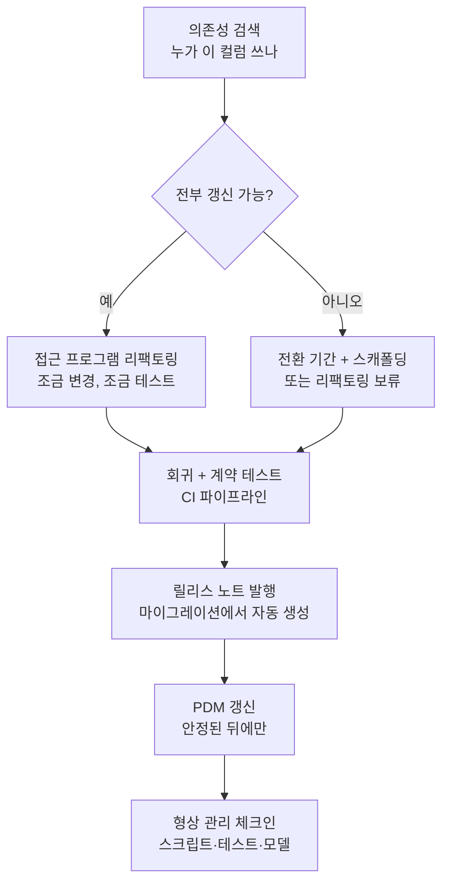

## 이게 진짜 어려운 부분임

DB 리팩토링이라고 하면 다들 `ALTER TABLE` 한 줄을 떠올린다. 컬럼을 옮기고, 이름을 바꾸고, 테이블을 쪼개고. 근데 그건 일의 절반, 아니 어쩌면 십분의 일이다. 진짜 일은 **그 컬럼에 꽂혀 있던 코드들을 전부 찾아서 따라오게 만드는 것**이다.

은행 시스템을 떠올려 보자. `Customer.Balance` 컬럼을 `Account` 테이블로 옮기기로 했다. 스키마 변경 스크립트는 30분이면 짠다. 그런데 그 `Customer.Balance`를 읽는 코드가 도대체 몇 군데 있는지 아는 사람이 아무도 없다. 우리 팀 결제 서비스가 읽고, 옆 팀 리포팅 시스템이 읽고, 야간 배치 정산이 읽고, 5년 전 퇴사한 사람이 만든 펄 스크립트가 새벽 3시에 cron으로 돌면서 읽는다. 그리고 그 펄 스크립트는 git에도 없다.

<Callout type="warning" title="한 줄 요약">
스키마 리팩토링의 어려움은 SQL이 아니라 사람과 코드다. 누가 그 컬럼을 쓰는지 찾고, 그들을 따라오게 설득하고, 무엇을 언제 바꿨는지 기록으로 남기는 것 — 이게 본체다.
</Callout>

## 시나리오: "그거 누가 쓰는데요?"

`Customer.Balance`를 `Account.Balance`로 옮기는 회의가 열린다. 화이트보드 앞에서 누군가 묻는다.

> "이거 옮기면 누가 깨져요?"

침묵. 다들 자기 코드는 안다. "우리 결제는 안 깨져요, 우리는 그거 안 봐요." 근데 우리 코드만 아는 게 함정이다. DB는 **공유 자원**이다. 내 코드 말고도 이 컬럼을 빨아먹는 입이 한둘이 아니다.

여기서 두 가지 위험이 동시에 터진다.

1. **담당 팀이 갱신을 안 해준다.** 옆 팀 리포팅 시스템이 이 컬럼을 쓰는데, 그 팀은 자기네 로드맵이 빡빡해서 "그건 다음 분기에…"라고 한다. 근데 내 리팩토링은 이번 스프린트다.
2. **담당 팀이 아예 없다.** 새벽 3시 펄 스크립트. 만든 사람 퇴사. 인수인계 안 됨. 깨지면 정산이 틀어지는데, 누가 고칠지 모름.

Ambler와 Sadalage가 책에서 대놓고 적은 문장이 이거다. **기술적 어려움보다 다른 시스템을 갱신하게 만드는 정치적 도전이 훨씬 큰 경우가 흔하다.** 컬럼 옮기는 건 30분, 옆 팀 PM 설득하는 건 3주.

<Callout type="error" title="뭐가 문제냐면">
- **의존성을 모른다**: 누가 이 컬럼/프로시저를 읽는지 전수 목록이 없다. 그래서 무엇이 깨질지 모른 채 배포한다.
- **비용 주체가 모호하다**: 외부 프로그램 갱신 비용을 누가 지느냐. 이상적으로는 그 프로그램을 소유한 팀이지만, 현실에선 리팩토링을 시작한 우리 팀이 떠안는다.
- **고아 코드가 있다**: 담당자도 없고 소스도 없는데 운영에서 돌고 있는 코드. 이게 제일 무섭다.
</Callout>

## 먼저, 누가 쓰는지부터 찾아라 (의존성 검색)

2006년 책은 "외부 프로그램을 찾아 리팩토링하라"고 말하지만, *어떻게* 찾을지는 너한테 맡긴다. 2026년엔 도구가 있다. 무작정 옮기기 전에, 의존성 지도부터 그려야 한다.

<Steps>
<Step title="DB 레벨에서 사용처 추적">
DB가 스스로 알려주는 것부터 본다. 저장 프로시저·뷰·트리거 안에서 그 컬럼을 참조하는 정의를 긁어낸다. PostgreSQL이면 `pg_depend`·`information_schema.view_column_usage`, 오라클이면 `DBA_DEPENDENCIES`, SQL Server면 `sys.dm_sql_referencing_entities`. DB 내부 의존성은 이걸로 거의 다 잡힌다.
</Step>
<Step title="쿼리 로그/통계로 실제 트래픽 확인">
정의에 없어도 런타임에 날아오는 쿼리가 있다. `pg_stat_statements`(Postgres), General Query Log·Performance Schema(MySQL), Query Store(SQL Server)를 켜고 일정 기간 모은다. `Customer.Balance`를 SELECT하는 쿼리가 실제로 어디서 얼마나 들어오는지 보면, 아무도 모르던 새벽 3시 펄 스크립트가 통계에 정체를 드러낸다.
</Step>
<Step title="코드베이스 전수 grep">
모든 리포지토리를 가로질러 컬럼명/테이블명을 검색한다. ORM이 컬럼명을 추상화해서 문자열 grep으로 안 잡히는 경우가 많으니, 엔티티 매핑(`@Column('balance')`, Prisma 스키마, Django 모델 필드)까지 함께 본다. ripgrep으로 organization 전체를 훑거나, GitHub면 코드 검색 API/`gh search code`를 쓴다.
</Step>
<Step title="고아 코드는 별도 리스트로 격리">
소스가 어디 있는지조차 모르는 트래픽이 통계에 남았다면, 그건 "찾을 수 없는 의존성"으로 별도 관리한다. 이게 전환 기간을 길게 잡아야 하는 진짜 이유가 된다.
</Step>
</Steps>

핵심은, **"누가 쓰는지 모른다"를 "여기 목록 있다"로 바꾸는 것**이다. 목록이 있어야 정치적 협상도 가능하다. "당신 팀 리포팅 서비스가 이 컬럼을 하루 4만 번 읽고 있습니다, 통계 첨부합니다"는 "아마 영향 있을걸요"보다 백 배 강하다.

```sql
-- PostgreSQL: 이 컬럼을 참조하는 뷰 찾기
SELECT view_schema, view_name
FROM information_schema.view_column_usage
WHERE table_name = 'customer' AND column_name = 'balance';

-- 실제로 이 컬럼을 때리는 쿼리 통계 (pg_stat_statements 켜져 있을 때)
SELECT calls, query
FROM pg_stat_statements
WHERE query ILIKE '%customer%balance%'
ORDER BY calls DESC;
```

## 돈이 없어서 못 고칠 때 (전환 기간 전략)

찾았다고 다 고칠 수 있는 건 아니다. 옆 팀이 예산이 없거나, 고아 코드라 손댈 사람이 없을 수 있다. 책은 이 막다른 골목에서 두 가지 선택지를 준다.

1. **전환 기간을 길게(때로는 수십 년) 잡는다.** 못 바꾸는 프로그램은 옛 인터페이스를 그대로 쓰게 두고, 바꿀 수 있는 앱만 새 설계를 쓴다. 옛 인터페이스를 살려두는 비용은 보통 **스캐폴딩 코드** — 동기화 트리거나 호환 뷰다.
2. **그냥 리팩토링을 안 한다.** 정직한 선택지다. 못 따라올 의존성이 너무 많고 가치가 충분치 않으면, 안 하는 게 맞을 때도 있다.

1번을 택하면, `Customer.Balance`를 옮긴 뒤에도 옛 컬럼을 살려두고 새 위치와 동기화하는 스캐폴딩이 필요하다. 현대식으로는 트리거뿐 아니라 **expand-contract(parallel change)** 패턴으로 깔끔하게 단계화한다.

<Tabs defaultValue="trigger">
<TabsList>
<TabsTrigger value="trigger">2006식 동기화 트리거</TabsTrigger>
<TabsTrigger value="expand">expand-contract</TabsTrigger>
</TabsList>
<TabsContent value="trigger">

옛 `Customer.Balance`와 새 `Account.Balance`를 양방향 동기화. 못 바꾸는 앱은 옛 컬럼을, 바꾼 앱은 새 컬럼을 쓴다. 둘 중 어디에 쓰든 다른 쪽에 반영된다.

```sql
-- Account.Balance가 바뀌면 옛 Customer.Balance에도 반영 (스캐폴딩)
CREATE OR REPLACE FUNCTION sync_balance_to_customer()
RETURNS trigger AS $$
BEGIN
  UPDATE customer
  SET balance = NEW.balance
  WHERE customer_id = NEW.customer_id;
  RETURN NEW;
END;
$$ LANGUAGE plpgsql;

CREATE TRIGGER trg_sync_balance
AFTER UPDATE OF balance ON account
FOR EACH ROW EXECUTE FUNCTION sync_balance_to_customer();
```

단점은 책이 경고한 그대로다. 스캐폴딩 코드가 **오래 남으면 성능이 떨어지고 DB가 어수선해진다.** 트리거는 공짜가 아니고, 양방향이면 무한 루프도 조심해야 한다. 그래서 전환 기간엔 반드시 "언제 이 스캐폴딩을 제거하는가"를 같이 정해둬야 한다.

</TabsContent>
<TabsContent value="expand">

전환을 3단계로 쪼갠다. 각 단계 사이에 모든 리더가 따라올 시간을 준다.

```text
[Expand]   새 위치(Account.Balance) 추가. 쓰기는 양쪽 다, 읽기는 아직 옛 위치.
              ↓ (소비자들이 새 위치 읽도록 차례로 갱신)
[Migrate]  읽기를 새 위치로 전환. 옛 위치는 동기화로 살아 있음.
              ↓ (모든 소비자 전환 + 충분한 안정화 기간)
[Contract] 옛 위치(Customer.Balance)와 동기화 스캐폴딩 제거.
```

Contract 단계는 **모든 리더가 새 위치로 옮겨갔다는 게 의존성 추적으로 확인된 뒤에만** 실행한다. pg_stat_statements에서 `customer.balance`를 읽는 쿼리가 0이 됐는지 보고 결정한다. 이게 전환 기간을 "감"이 아니라 "데이터"로 끝내는 방법이다.

</TabsContent>
</Tabs>

## 문서를 써야 하면, 그건 리팩토링하라는 신호임

책에 박힌 잠언 하나를 그대로 가져온다.

> 테이블·컬럼·저장 프로시저를 설명하는 문서를 길게 써야 한다면, 그건 그 부분을 더 이해하기 쉽게 리팩토링하라는 좋은 신호다.

생각해보면 맞다. `cust_bal_2`, `cust_bal_old`, `cust_bal_new_DO_NOT_USE` 같은 컬럼이 있고, 위키에 "주의: `cust_bal_2`는 2019년 마이그레이션 잔재로 실제 잔액이 아니라 직전 정산 잔액이며, 야간 배치가 돌기 전엔 `cust_bal`과 다를 수 있음"이라는 세 문단짜리 경고가 붙어 있다면 — 그 세 문단은 컬럼 이름이 거짓말을 하고 있다는 증거다.

**단순한 이름 변경 하나가 여러 문단의 문서를 통째로 없앨 수 있다.** `cust_bal_2`를 `settled_balance`로 바꾸면 경고문 절반이 사라진다. 설계가 깔끔할수록 문서가 덜 필요하고, 문서가 자꾸 길어지면 설계가 더럽다는 뜻이다. 그러니 위키 경고문을 쌓지 말고, 그 경고가 가리키는 컬럼을 고쳐라.

## 고치는 동안: 조금 바꾸고, 조금 테스트하고

외부 프로그램을 고치는 작업도 리팩토링이다. 그러니 리팩토링의 정석대로 한다. **조금 변경, 조금 테스트, 조금 변경, 조금 테스트.** 한 번에 다 바꾸고 마지막에 테스트하는 게 아니라, 작은 변경마다 회귀 테스트를 돌린다.

작은 단위로 가는 이유는 디버깅이 공짜가 되기 때문이다. 방금 한 줄 바꾸고 테스트가 깨지면, 범인은 거의 확실히 방금 바꾼 그 줄이다. 범위가 한 줄이면 추적할 게 없다. 반대로 200줄 바꾸고 테스트가 빨개지면, 그때부턴 이등분 탐색을 시작해야 한다.

현대 환경에선 이걸 사람이 기억으로 하지 않는다. **CI 파이프라인에 마이그레이션과 회귀 테스트를 묶는다.**

```yaml
# 마이그레이션 → 회귀 테스트를 한 파이프라인에서
steps:
  - run: flyway migrate            # 스키마 리팩토링 적용
  - run: npm test -- --suite=db    # 접근 코드 회귀 테스트
  - run: npm run test:contract     # 다른 서비스와의 계약 테스트
```

여기서 **계약 테스트(contract test)**가 핵심이다. 마이크로서비스가 공유 DB를 함께 빨아먹는 안티패턴 상황이라면, 내 마이그레이션이 옆 서비스의 기대를 깨는지 CI에서 미리 잡아야 한다. 그게 운영 배포 후에 슬랙으로 알려지는 것보다 백만 배 싸다.

## 공지하기: 릴리스 노트가 진짜 결과물이다

테스트 다 통과하고 머지했다고 끝이 아니다. DB는 공유 자원이라 했다. **누가 무엇을 언제 바꿨는지를 다른 팀이 알 수 있어야** 한다. 공지의 무게는 환경에 따라 다르다.

- **초기/단일 팀**: 스탠드업에서 한마디면 충분하다. "오늘 `Customer.Balance` `Account`로 옮깁니다."
- **다중 애플리케이션 환경**: 특히 스테이징/운영 같은 사전 운영 환경으로 승격할 때는 공식적으로 알린다. 전용 메일링 리스트, 정기 상태 보고의 항목, 운영 DBA 그룹에 보고.

그리고 책이 강조하는 핵심 산출물이 **데이터베이스 릴리스 노트**다. 적용한 리팩토링을 순서대로, 번호를 매겨 나열한다.

```text
DB Release Notes — 2026.06 release
161: Add Account.Balance column
162: Backfill Account.Balance from Customer.Balance
163: Move the Customer.Balance column into the Account table
164: Deprecate Customer.Balance (sync trigger active until 2026.09)
```

이게 왜 필요하냐면, 엔터프라이즈 데이터 관리자나 다른 팀이 자기네 **메타데이터를 갱신**하려면 변경 목록이 있어야 하기 때문이다. (더 좋은 건 리팩토링한 팀이 메타데이터를 직접 갱신하는 거지만, 적어도 노트는 있어야 한다.)

<Callout type="info" title="릴리스 노트 자동화">
2026년엔 이 노트를 손으로 안 적어도 된다. 마이그레이션 도구 자체가 변경 이력이다.

- **Flyway / Liquibase / Alembic / Rails 마이그레이션**: 버전 번호 + 설명이 파일명·changelog에 이미 박혀 있다. `flyway info`, `alembic history`, Liquibase changelog가 사실상 릴리스 노트 초안이다.
- 이걸 CI에서 긁어 마크다운으로 변환해 배포 채널(슬랙/메일링 리스트)에 자동 게시하면, "163: Move the Customer.Balance column into the Account table" 같은 줄이 사람 손 안 거치고 생성된다.
- 마이그레이션 파일의 description을 **읽는 사람을 위한 문장**으로 쓰는 습관만 들이면, 릴리스 노트는 공짜로 따라온다.
</Callout>

마이크로서비스라면 한 발 더 나간다. 컬럼이 옮겨졌다는 사실을 **CDC(Debezium)나 outbox로 이벤트화**해서, 다른 서비스가 폴링이 아니라 구독으로 스키마 변화를 인지하게 할 수도 있다. 다만 모든 편에 욱여넣을 도구는 아니고, 진짜로 여러 서비스가 같은 데이터를 비동기로 따라와야 할 때만 꺼낸다.

## PDM 갱신: 살아남는 단 하나의 모델

물리 데이터 모델(PDM)도 갱신한다. 책이 짚는 포인트가 묵직하다. PDM은 스키마를 기술하는 **주요 모델이자, 프로젝트가 끝나도 살아남는 몇 안 되는 "보존(keeper)" 모델**이다. 유스케이스 다이어그램, 시퀀스 다이어그램 다 사라져도 PDM은 남는다. DB가 살아 있는 한 PDM은 계속 참조되니까.

대신 책은 함정도 경고한다.

> **데이터 모델을 성급히 발행하지 말라.**

진화적 설계에선 스키마가 초기엔 요동친다. 새 부분이 안 정해진 상태에서 PDM을 발행하면, 발행하자마자 또 바꿔야 하고 — 그걸 본 다른 팀들이 매번 흔들린다. 그러니 **새 부분이 안정될 때까지 기다렸다가** PDM 갱신을 발행한다. 그러면 문서화 노력도, 타 팀에 미치는 충격도 줄어든다.

## 형상 관리: 스크립트도 코드다

마지막 단계. 리팩토링이 성공하면 **모든 산출물을 버전 관리에 체크인**한다. 소스 코드와 *똑같이* 다룬다. 여기엔 다음이 다 포함된다.

- 변경 스크립트 (forward + 가능하면 rollback)
- 테스트 데이터와 그 생성 코드
- 테스트 케이스
- 갱신된 문서
- 갱신된 모델(PDM)

DB 변경 스크립트를 "한 번 쓰고 버리는 일회용"으로 취급하는 순간 재현성이 사라진다. git에 들어가 있으면 "163번 리팩토링이 정확히 뭘 했지?"에 대한 답이 영원히 남고, 어떤 환경에서도 동일하게 재생할 수 있다. 마이그레이션 도구를 쓴다면 이건 거저 따라온다 — 마이그레이션 파일이 곧 형상 관리 대상이다.

<Callout type="success" title="지속적 개발을 지향하라">
조직이 모든 애플리케이션을 지속적으로 진화시키고 정기 배포하면, DB에 꽂힌 모든 앱도 정기적으로 갱신된다. 그러면 "수십 년짜리 전환 기간"이 "한 스프린트짜리 전환 기간"으로 줄어든다. CI/CD가 잘 깔린 조직에서 expand-contract가 가볍게 도는 이유가 이거다. 못 따라오는 앱이 없으니, 스캐폴딩을 오래 끌 필요가 없다.
</Callout>

## 전체 흐름

스키마 변경 한 줄이 실제로는 이런 파이프라인이다.



## 정리

DB 리팩토링에서 `ALTER TABLE`은 시작이지 끝이 아니다. 진짜 일은 그 컬럼에 매달린 코드와 사람들을 따라오게 만드는 것이고, 그건 기술보다 정치에 가깝다.

> **스키마는 혼자 못 바꾼다. 그 스키마를 읽는 모든 입을 데리고 같이 움직여야 한다.**

그래서 순서가 있다. 누가 쓰는지 먼저 찾고(의존성 검색), 못 따라오는 게 있으면 전환 기간으로 다리를 놓고, 작게 고치며 테스트하고, 무엇을 바꿨는지 릴리스 노트로 공지하고, PDM은 안정된 뒤 발행하고, 모든 산출물을 코드처럼 형상 관리에 넣는다. 그리고 위키에 경고문이 세 문단 쌓이기 시작하면 — 그건 더 쓰라는 신호가 아니라, 그 컬럼을 고치라는 신호다.
