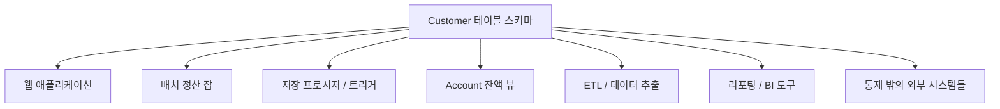
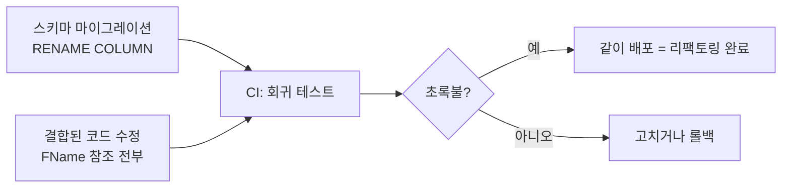

## 이게 뭔데

리팩토링이란 단어, 다들 코드에서 먼저 배웠을 거다. `getPersons()`라는 메서드가 있는데 누가 봐도 영어가 어색하다. "person의 복수는 persons가 아니라 people이잖아." 그래서 `getPeople()`로 이름을 바꾼다. 동작은 1도 안 바뀐다. 들어가는 입력도 같고, 나오는 출력도 같다. 그냥 **이름만 더 좋아졌다.** 이게 리팩토링이다. 기능을 더하거나 빼는 게 아니라, 행동은 그대로 두고 설계 품질만 올리는 작은 변경.

데이터베이스 리팩토링도 정확히 같은 마음에서 출발한다. `Customer` 테이블에 `FName`이라는 컬럼이 있다. 10년 전 누군가 타이핑을 줄이려고 줄여 쓴 거고, 지금 와서 보면 그냥 못 알아먹겠다. `FirstName`으로 바꾸고 싶다. 데이터가 더 들어오는 것도 아니고, 빠지는 것도 아니다. 같은 사람의 같은 이름이 같은 자리에 그대로 있다. **저장된 정보는 한 글자도 안 바뀌고, 이름표만 좋아진다.** 컬럼명 하나 바꾸는 게 뭐 대수냐 싶지만, 바로 여기서 데이터베이스 리팩토링의 모든 어려움이 시작된다.

<Callout type="info" title="한 줄 정의">
데이터베이스 리팩토링은 **행위적 의미(behavioral semantics)와 정보적 의미(informational semantics)를 둘 다 유지하면서** 설계를 개선하는, 스키마에 대한 단순한 변경이다. 새 기능을 더하지도, 기존 데이터의 의미를 바꾸지도 않는다. 딱 품질만 올린다.
</Callout>

## 두 가지 "의미"를 지킨다는 것

코드 리팩토링은 지킬 게 하나다. **행위적 의미** — 입력을 넣으면 같은 출력이 나와야 한다. `getPersons`를 `getPeople`로 바꿔도 호출하면 같은 사람 리스트가 나와야 진짜 리팩토링이다.

데이터베이스 리팩토링은 지켜야 할 게 둘이다. 행위적 의미에 더해 **정보적 의미**까지. 무슨 차이냐면:

- **행위적 의미** — 스키마를 건드린 뒤에도, 이 DB를 쓰는 애플리케이션·저장 프로시저·트리거가 예전과 똑같이 동작해야 한다. 조회 쿼리, 검증 규칙, 참조 무결성, 결과가 다 그대로여야 한다.
- **정보적 의미** — 저장된 데이터가 **표현하는 의미**가 안 바뀌어야 한다. `FName`을 `FirstName`으로 바꿔도 그 칸엔 여전히 "고객의 이름"이 들어 있어야지, 갑자기 "고객의 별명"이 되면 안 된다. 데이터의 정밀도(precision)나 의미를 슬쩍 바꾸는 건 리팩토링이 아니라 그냥 다른 일이다.

예를 들어 `Customer.PhoneNumber`를 `VARCHAR(10)`에서 `VARCHAR(20)`으로 늘리는 건? 미묘하다. 기존 번호는 다 그대로 들어가고 표현이 망가지지 않으니 정보적 의미는 보존된다. 그래서 보통 안전한 리팩토링으로 친다. 반대로 `VARCHAR(20)`을 `VARCHAR(10)`으로 **줄이면** 이미 들어 있던 긴 번호가 잘려나간다. 정보가 손실된다. 이건 리팩토링이 아니다. 정보적 의미를 깨는 순간, 그건 다른 종류의 변경(데이터 모델 변경, 기능 변경)이고, 다른 무게로 다뤄야 한다.

<Callout type="note" title="둘은 다른 거다">
"리팩토링"이라는 단어를 "DB 손보는 일" 전부에 갖다 붙이는 사람이 많은데, 정의상 리팩토링은 의미를 보존하는 변경만 가리킨다. 컬럼을 추가해서 새 데이터를 받기 시작하면 그건 기능 추가지 리팩토링이 아니다. 이 구분이 중요한 이유는, 리팩토링은 "안전하니까 회귀 테스트만 통과하면 OK"인 변경이고, 기능 변경은 "데이터의 진짜 내용이 바뀌니까 더 신중하게" 다뤄야 하는 변경이기 때문이다.
</Callout>

## 왜 코드보다 어렵냐면: 결합(coupling)

`getPersons` → `getPeople`도 사실 메서드 이름 하나만 바꾸고 끝나는 게 아니다. 그 메서드를 **호출하는 모든 곳**을 같이 바꿔야 한다. 한 군데라도 옛 이름으로 부르는 데가 남아 있으면 컴파일이 깨지거나 런타임에 터진다. 이름 바꾸기가 진짜로 끝나는 건, 코드가 예전처럼 다시 멀쩡히 도는 순간이다.

이게 **결합(coupling)** 이다. 결합은 두 항목 사이 의존성의 척도다. A와 B가 강하게 결합돼 있을수록, A를 바꾸면 B도 바꿔야 할 가능성이 커진다. 코드 리팩토링이 어려운 만큼이 딱 결합의 양만큼이다.

데이터베이스는 이 결합이 **훨씬** 심하다. 스키마 하나에 온갖 게 들러붙어 있다.



`Customer.FName` 하나를 `FirstName`으로 바꾸면, 위 화살표가 가리키는 것들이 줄줄이 깨질 수 있다. 책에 이런 예가 나온다 — `FName`을 `FirstName`으로 바꿨더니 이 컬럼을 직접 참조하던 외부 프로그램 50개가 깨졌고, 그걸 다 고치는 비용이 너무 커서 결국 되돌려야 했다. 컬럼 이름 한 줄 바꾸는 게, 사실은 50개 시스템을 동시에 바꾸는 일이었던 거다.

<Callout type="warning" title="뭐가 문제냐면">
코드 리팩토링은 보통 **한 코드베이스 안에서** 끝난다. IDE가 "이 메서드 호출하는 곳 47군데"를 찾아주고, 한 방에 바꿔준다. 그런데 DB 스키마에 결합된 것들은 한 저장소, 한 팀, 한 배포 단위 안에 다 있지 않다. 옆 팀 서비스가 그 테이블을 직접 읽고 있을 수도 있고, 새벽에 도는 배치가 그 컬럼명을 하드코딩해놨을 수도 있다. **누가 내 스키마를 붙들고 있는지조차 모르는 경우**가 결합의 진짜 무서운 점이다.
</Callout>

## 결합의 두 얼굴: 단일 앱 DB vs 다중 앱 DB

같은 컬럼명 변경이라도, DB가 처한 상황에 따라 난이도가 천지차이다.

<Steps>
<Step title="단일 애플리케이션 DB (single-application database)">
이 DB를 건드리는 게 딱 하나의 애플리케이션뿐인 경우. 가장 행복한 시나리오다. 스키마와 그걸 쓰는 코드가 같은 저장소, 같은 배포 파이프라인에 있으니, **스키마 변경과 코드 변경을 한 커밋에 묶어 같이 배포**하면 된다. `FName` → `FirstName` 마이그레이션과, 그 컬럼을 참조하던 코드 수정을 한 PR에 넣고, 한 번에 나간다. 책에서 말하는 "스토브파이프 시스템(stovepipe)"이 이거다.
</Step>
<Step title="다중 애플리케이션 DB (multi-application database)">
하나의 DB를 통제 범위 밖의 여러 외부 프로그램이 공유하는 경우. 현실에서 압도적으로 흔하고, 압도적으로 골치 아프다. 그 50개 프로그램이 한날한시에 같이 배포된다는 보장이 없다. 그래서 옛 스키마와 새 스키마를 동시에 살려두는 **전환 기간(transition period, 폐기 기간이라고도 함)** 이 필요해진다. 이건 그 자체로 별도의 깊은 주제라 여기선 "이런 게 필요하다"까지만 짚고 넘어간다.
</Step>
</Steps>

핵심은, 데이터베이스 리팩토링의 어려움이 **변경 자체의 크기가 아니라 결합의 양에서 온다**는 거다. 같은 한 줄짜리 `RENAME COLUMN`이라도, 결합이 적으면 5분, 결합이 많으면 6개월짜리 프로젝트가 된다.

## 2006년의 손코딩, 그리고 지금

원전(原典)인 『Refactoring Databases』는 2006년 책이다. 거기선 스키마 변경을 번호 매긴 SQL 스크립트로 손코딩하고, 전환을 트리거로 직접 짠다. 골격은 지금도 똑같이 유효하다. 다만 그 사이에 도구가 많이 좋아졌다. "마이그레이션 한 줄 + 그에 딸려오는 코드 변경"이 오늘날 어떻게 생겼는지 보자.

마이그레이션은 이제 손으로 SQL 파일에 번호를 매기는 대신, 마이그레이션 도구가 버전과 순서를 관리한다. 같은 `FName` → `FirstName` 리팩토링을 도구별로 보면.

<Tabs defaultValue="flyway">
<TabsList>
<TabsTrigger value="flyway">Flyway (SQL)</TabsTrigger>
<TabsTrigger value="prisma">Prisma</TabsTrigger>
<TabsTrigger value="rails">Rails</TabsTrigger>
</TabsList>

<TabsContent value="flyway">

```sql
-- V2__rename_fname_to_firstname.sql
-- Flyway는 파일명의 버전(V2)으로 순서를 관리한다.
-- 2006년 책의 "번호 매긴 스크립트"를 도구가 대신 챙겨주는 셈.
ALTER TABLE Customer RENAME COLUMN FName TO FirstName;
```

Liquibase도 거의 같은 자리에 있고, XML/YAML/SQL 중 골라 쓸 수 있다.

</TabsContent>

<TabsContent value="prisma">

```text
// schema.prisma — 컬럼명을 바꾸고
model Customer {
  id        Int    @id @default(autoincrement())
  firstName String @map("FirstName")   // ← 매핑을 바꾼다
}
```

`prisma migrate dev`를 돌리면 도구가 diff를 떠서 `ALTER TABLE ... RENAME` 마이그레이션을 생성한다. Alembic(Python), Django ORM 마이그레이션, TypeORM도 같은 결의 "선언 바꾸면 마이그레이션 생성" 흐름이다.

</TabsContent>

<TabsContent value="rails">

```text
# db/migrate/20060101_rename_fname.rb
class RenameFname < ActiveRecord::Migration[7.1]
  def change
    rename_column :customers, :f_name, :first_name
  end
end
```

`change` 안에 정방향만 적으면 Rails가 롤백(`down`)을 자동으로 추론해준다. 2006년에 손으로 짜던 "되돌리기 스크립트"를 도구가 챙긴다.

</TabsContent>
</Tabs>

여기까지가 화살표 하나, 즉 **스키마**다. 그런데 정의에서 봤듯, 리팩토링은 결합된 코드를 같이 안 바꾸면 안 끝난다. 마이그레이션 한 줄에는 항상 **코드 변경이 딸려온다.**

```typescript
// Before: 옛 컬럼명을 참조하던 코드 — 마이그레이션 후 깨진다
const name = row.FName;
const customers = await db.query("SELECT FName FROM Customer");

// After: 새 이름으로 같이 바꿔줘야 비로소 리팩토링이 "완료"된다
const name = row.FirstName;
const customers = await db.query("SELECT FirstName FROM Customer");
```

이 코드 변경을 빠뜨리면, `getPeople`로 바꿔놓고 호출부는 `getPersons`로 남겨둔 것과 똑같은 상태가 된다. 단일 앱 DB라면 이 둘(마이그레이션 + 코드)을 한 PR로 묶어 CI 파이프라인에 태우고, 회귀 테스트가 초록불이면 같이 배포한다. 그게 현대판 "리팩토링 완료"다.



<Callout type="success" title="현대화의 핵심">
2006년에 새로워진 건 "마이그레이션을 도구가 관리한다"는 점이 아니라, **마이그레이션 스크립트가 애플리케이션 소스와 같은 Git 저장소·같은 CI 파이프라인에 들어왔다**는 점이다. 스키마 변경과 그에 결합된 코드 변경이 한 커밋·한 PR로 묶이니, "스키마만 바뀌고 코드는 안 바뀐" 어중간한 상태가 리뷰와 테스트 단계에서 잡힌다. 결합을 관리하는 가장 강력한 도구는 결국 형상 관리(configuration management)다.
</Callout>

## 회귀 테스트가 없으면 리팩토링도 없다

코드 리팩토링에서 가장 중요한 전제가 회귀 테스트라는 건 다들 안다. "안 깨졌다는 확신"이 없으면 리팩토링할 **용기**가 안 난다. 깨질까 봐 무서워서 `FName`을 30년 동안 그대로 둔다.

DB도 똑같다. 아니, 더하다. 저장 프로시저, 데이터 검증 규칙, 참조 무결성(RI) 같은 핵심 비즈니스 로직이 DB **안에** 살고 있는 경우가 많아서, 애플리케이션 테스트만으론 안 깨진 걸 보장 못 한다. 그래서 DB도 별도로 회귀 테스트를 갖춰야 한다.

```text
# 리팩토링 한 사이클의 모양 (테스트 우선)
1. 깨질 만큼만 테스트를 먼저 추가한다 (실패 확인)
2. 테스트를 돌려 정말 실패하는지 본다
3. 마이그레이션 + 코드를 고쳐 통과시킨다
4. 다시 전부 돌린다 → 통과하면 다음 리팩토링으로
```

이게 갖춰져 있어야 비로소 "마이그레이션 한 줄 + 코드 변경"을 마음 편히 날릴 수 있다. 회귀 테스트는 리팩토링의 조건이지, 옵션이 아니다.

## 정리

데이터베이스 리팩토링은 거창한 게 아니다. `getPersons`를 `getPeople`로 바꾸는 그 마음 그대로, `FName`을 `FirstName`으로 바꾸는 거다. 차이는 딱 둘.

> **데이터베이스 리팩토링은 행위적 의미와 정보적 의미를 둘 다 지키면서, 스키마에 가하는 작은 변경이다.**

- **지킬 게 하나 더 많다** — 코드는 행동만 지키면 되지만, DB는 저장된 데이터가 표현하는 **정보적 의미**까지 지켜야 한다. 의미가 바뀌면 그건 리팩토링이 아니라 다른 일이다.
- **결합이 더 세다** — 스키마엔 애플리케이션, 저장 프로시저, 뷰, 배치, 옆 팀 서비스까지 줄줄이 결합돼 있다. 한 줄짜리 `RENAME`이 50개 시스템을 동시에 바꾸는 일이 되기도 한다.

그래서 현대 실무는 마이그레이션을 도구로 관리하고, 마이그레이션과 그에 딸린 코드 변경을 한 PR로 묶어 같은 CI에 태우고, 회귀 테스트가 초록불일 때 같이 배포한다. 마이그레이션 한 줄이 외롭게 혼자 나가는 일은 없다. 항상 결합된 코드 변경을 데리고 함께 나가야, 그제야 리팩토링이 "완료"된다.
