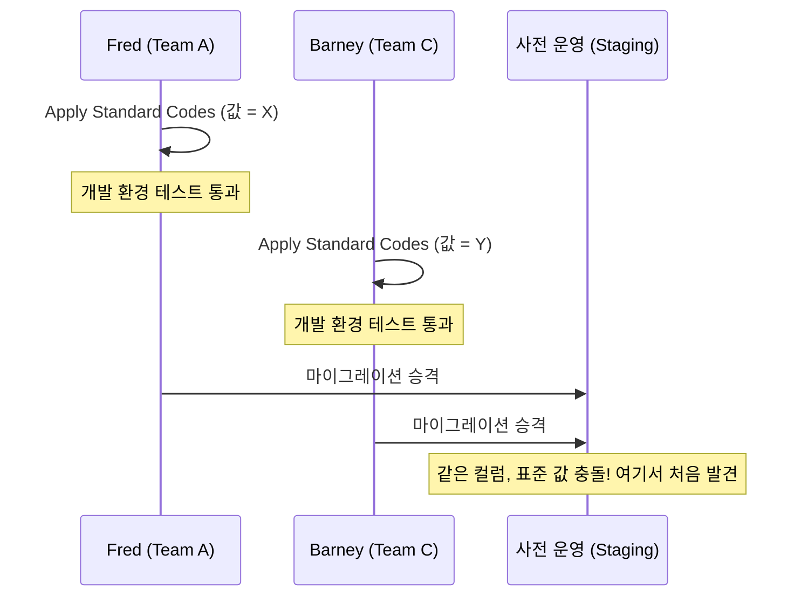

## 이게 뭔데

스키마 리팩토링 하나는 별거 아니다. 컬럼 하나 옮기고, 인덱스 하나 추가하고. 문제는 이게 **하나로 안 끝난다는 것**이다. 한 프로젝트에서 작은 리팩토링을 수십, 수백 개 적용하게 되고, 이것들이 **서로 위에 쌓인다.** `Account.balance` 컬럼 이름을 `current_balance`로 바꿨는데, 다음 주에 그 컬럼을 `Balance` 테이블로 통째로 옮긴다. 그럼 "이름 바꾸기"를 먼저 돌리고 "옮기기"를 나중에 돌려야 한다. 순서가 바뀌면 옮기기 스크립트가 존재하지도 않는 컬럼을 찾다가 터진다.

즉, 마지막 운영 배포 이후 만든 모든 리팩토링은 **번호가 매겨진 묶음(bundle)**으로 관리돼야 한다. 그리고 그 묶음 안의 각 변경은 **고유하게 식별**되고, **올바른 순서**로 적용돼야 한다. 이게 이 편의 전부다. 별거 아닌 것 같은데, 이거 안 하면 운영 배포 새벽에 "어? 이 스크립트 돌렸나 안 돌렸나?"를 손톱 물어뜯으며 추적하게 된다.

<Callout type="info" title="한 줄 요약">
스키마 변경은 순서대로 쌓이는 마이그레이션의 스택이다. 각 변경에 고유 ID(빌드 번호/타임스탬프/GUID)를 붙이고, DB 어딘가에 "지금 어디까지 적용됐는지"를 기록해두면, 어느 환경에든 안전하게 순서대로 적용할 수 있다. Flyway/Liquibase가 정확히 이 일을 자동으로 한다.
</Callout>

## 시나리오: 이런 적 있을 거임

은행 시스템을 굴린다고 치자. 짧은 반복(1~2주)으로 일하는데, 매주 운영에 새 버전을 올리지는 않는다. 보통 몇 달에 한 번 배포한다. 그 사이에 `Customer` 테이블 리팩토링 세 개, `Policy` 쪽 두 개, `Insurance` 외래키 정리 하나가 쌓였다. 운영 배포일 새벽, DBA가 묻는다.

> "그래서, 운영에 뭘 어떤 순서로 돌려야 하죠?"

손코딩 시절의 답은 이랬다. 각 리팩토링을 **자체 트랜잭션**으로 본다. 스키마 변경 DDL + 데이터 마이그레이션 + 그 부분을 건드리는 앱 소스 변경을 한 덩어리로 묶고, 거기에 **고유 ID를 붙여 순서를 매긴다.** 그러면 손으로 쓴 스크립트든 도구든, 어느 샌드박스에든 그 순서대로 줄줄이 적용할 수 있다.

```text
758_rename_balance_column.sql
759_introduce_balance_table.sql
760_move_balance_data.sql
761_add_policy_fk.sql
762_drop_deprecated_account_balance.sql
```

여기서 진짜 골치 아픈 가정이 하나 깨진다. **모든 환경의 스키마가 같다는 보장이 없다.** 운영은 758까지 올라가 있고, 데모는 800, 사전 운영(스테이징)은 805, 통합은 811, 그리고 개발 DB 세 대는 813/809/815로 제각각이다. 통합을 갱신하려면 812부터 돌리고, 사전 운영은 806부터, 데모는 801부터, 운영은 759부터 돌려야 한다. 심지어 운영엔 이번 릴리스에 794까지만 올리기로 했을 수도 있다.

머리 아프지? 이걸 사람이 엑셀로 관리하면 사고 난다. 그래서 이 패턴 전체가 결국 **"각 환경이 지금 몇 번까지 적용됐는지"를 기계가 추적**하게 만드는 방향으로 진화했다.

## 리팩토링 스택: 릴리스 단위로 쌓고, 기준선화한다

한 가지 깔끔한 사고방식은 **스택(stack)**이다.

<Steps>
<Step title="릴리스 시작 시 빈 스택을 연다">
새 릴리스 개발을 시작할 때 리팩토링 스택을 새로 시작한다. 마지막 운영 배포가 758이었다면, 759부터 새 스택이 쌓이기 시작한다.
</Step>
<Step title="개발 내내 변경을 쌓는다">
스키마 변경이 생길 때마다 스택에 push 한다. 759, 760, 761... 개발하면서 "어 이건 취소하자" 싶은 건 스택에서 빼낸다(아직 운영에 안 나갔으니까 가능하다).
</Step>
<Step title="릴리스 끝에서 기준선화(baseline)한다">
릴리스 개발이 끝나면 스택을 기준선화해서, 이번 릴리스의 스키마 변경 묶음으로 확정한다. 이게 운영에 한꺼번에 나갈 묶음이다.
</Step>
</Steps>

핵심은, 매주 동작하는 소프트웨어를 만들더라도 그걸 매주 운영에 릴리스하지는 않는다는 거다. **반복마다 만든 마이그레이션을 모았다가 릴리스 시점에 한꺼번에 올린다.** 단일 앱을 다루는 작은 팀이라면 환경별로 813/809/815 같은 번호를 정교하게 관리할 필요까지는 없다. 개발/스테이징/운영 3환경에 **같은 스크립트를 같은 순서로** 적용하는 것으로 충분하다. 중요한 건 정교한 환경 관리가 아니라, "스테이징에 자주 배포해서 배포 스크립트 자체를 미리 검증"하는 습관이다. 배포 사고의 대부분은 "운영에서 처음 돌려본 마이그레이션"에서 나온다.

## 그래서 ID를 뭐로 붙일 건데: 세 가지 전략

리팩토링을 순서대로 적용하려면 ID가 필요하다. 후보는 셋이다. 각각 장단이 있다.

<Tabs defaultValue="build">
<TabsList>
<TabsTrigger value="build">빌드 번호</TabsTrigger>
<TabsTrigger value="timestamp">타임스탬프</TabsTrigger>
<TabsTrigger value="guid">GUID</TabsTrigger>
</TabsList>

<TabsContent value="build">
**빌드 번호(build number).** 빌드 도구가 변경을 컴파일하고 단위 테스트가 통과하면 정수 하나를 부여한다. 옛날엔 CruiseControl, 지금이면 CI 파이프라인의 빌드 번호다.

- **장점:** 단순하다. FIFO 큐처럼 작은 번호부터 순서대로 적용하면 끝. DB 버전이 앱 버전과 **직접 연결**된다. "앱 v812 = 스키마 812"처럼 1:1로 떨어지니 추적이 쉽다.
- **단점:** DB 리팩토링 도구가 빌드 도구와 통합돼 있거나, 각 리팩토링이 형상 관리되는 스크립트라고 **가정**한다. 게다가 많은 빌드엔 DB 변경이 없어서 번호가 **불연속**이다(1, 7, 11, 12...). 그리고 결정적으로 **다중 앱/다중 팀 환경에선 팀마다 같은 빌드 번호를 갖는다** — 두 팀이 각자 빌드 811을 만들면 어느 게 먼저인지 알 길이 없다.
</TabsContent>

<TabsContent value="timestamp">
**날짜/타임스탬프(date/timestamp).** 리팩토링을 만든 시각을 ID로 쓴다. `20260609143022_move_balance.sql` 같은 식.

- **장점:** 단순하고, FIFO 큐로 순서가 자동으로 잡힌다. **순서를 바로 알 수 있다** — 1-7과 7-7 중 뭐가 먼저인지 빌드 번호론 알 수 없지만, 타임스탬프는 큰 게 나중이다. 누가 봐도 명확하다.
- **단점:** 스크립트 파일명으로 쓰기엔 좀 길고 어색하다. 그리고 "적절한 앱 빌드와 어떻게 연관짓느냐"는 별도 전략이 필요하다(타임스탬프만 봐선 "이게 어느 릴리스 거지?"가 안 보인다).
</TabsContent>

<TabsContent value="guid">
**고유 식별자(GUID 등).** 기존 GUID 생성기를 그대로 활용한다.

- **장점:** 충돌이 사실상 없다. 이미 있는 생성기를 쓰면 되니 새로 만들 게 없다.
- **단점:** GUID는 파일명으로 정말 어색하다(`a3f8b2e1-...`를 누가 눈으로 읽나). 그리고 **여전히 적용 순서를 따로 식별해야 한다** — GUID 자체엔 순서 정보가 없으니까. 앱 빌드와 연관짓는 전략도 또 필요하다.
</TabsContent>
</Tabs>

<Callout type="success" title="경험칙">
- **단일 팀이 DB를 책임진다 → 빌드 번호 전략이 최선.** 단순하고, 앱 버전과 DB 버전이 깔끔하게 묶인다.
- **여러 팀이 같은 DB를 진화시킨다 → 타임스탬프 전략이 최선.** 적용 순서를 바로 알 수 있기 때문이다. 빌드 번호 1-7과 7-7 중 무엇이 먼저인지는 알 수 없지만, 타임스탬프는 그냥 큰 게 나중이다.
</Callout>

## 다중 팀의 함정: 순서만 맞춰선 안 된다 (Fred & Barney 일화)

여기서 멈추면 안 된다. "순서대로 적용한다"는 것만으론 충분하지 않은 함정이 있다. Scott Ambler가 직접 겪은 일화가 이걸 정확히 보여준다.

네 팀이 **같은 스키마**를 동시에 진화시키고 있었고, DBA 두 명 — Fred와 Barney — 가 이들을 지원했다. 어느 날 Fred가 한 컬럼에 `Apply Standard Codes`(표준 코드 적용) 리팩토링을 돌렸다. 며칠 뒤, Barney가 **다른 팀에서 같은 컬럼에 같은 리팩토링**을 돌렸다 — 그런데 **다른 표준 값**으로. 두 변경 다 컴파일됐고, 각자의 개발 환경에선 테스트도 통과했다. 아무도 몰랐다.

이 충돌은 **사전 운영(스테이징) 환경에 승격할 때서야** 드러났다. 두 팀의 마이그레이션이 같은 DB에서 만나면서, "어? 이 컬럼 표준 값이 왜 두 종류지?" 하고 터진 거다.



교훈은 명확하다. **다중 팀 환경에선 식별·순서만으론 부족하고, 조율(coordination) 전략이 반드시 필요하다.** 누가 어느 리팩토링을 만들었는지 ID에 팀 정보를 박는 것도 한 방법이다(team 1 → `1-7`, `1-12`; team 7 → `7-3`, `7-7`).

<Callout type="warning" title="현대판 Fred & Barney: 공유 DB 안티패턴">
2006년의 이 일화는 마이크로서비스 시대에 더 흔해졌다. 여러 서비스(=여러 팀)가 **하나의 DB를 공유**하면, Fred와 Barney가 매일 재현된다. 두 서비스가 같은 테이블에 동시에 마이그레이션을 거는 순간 충돌이 스테이징에서 터진다. 그래서 현대의 처방은 "조율을 더 잘하자"가 아니라 아예 **"DB를 공유하지 마라(database-per-service)"**다. 정 공유해야 한다면, 스키마 소유권을 한 팀에 명확히 두고 나머지는 API/CDC(Debezium)·outbox로 데이터를 받게 한다. 충돌의 근본 원인인 "공유 쓰기"를 없애는 거다.
</Callout>

## 지금 어디까지 왔는지 기록하라: DatabaseConfiguration

순서대로 적용하려면, DB가 **"나 지금 몇 번까지 적용됐어"**를 스스로 알고 있어야 한다. 안 그러면 스크립트를 두 번 돌리거나, 빼먹거나, 순서가 꼬인다. 가장 쉬운 방법은 이 정보를 담는 테이블 하나를 두는 거다.

```sql
CREATE TABLE DatabaseConfiguration (
    SchemaVersion NUMBER NOT NULL
);

INSERT INTO DatabaseConfiguration (SchemaVersion) VALUES (0);
```

리팩토링을 적용할 때마다 이 값을 갱신한다.

```sql
-- 17번 리팩토링을 적용한 직후
UPDATE DatabaseConfiguration SET SchemaVersion = 17;
```

스키마 버전은 **식별 전략을 그대로 반영**해야 한다. 빌드 번호 전략이면 버전도 정수고, 타임스탬프 전략이면 버전도 타임스탬프여야 한다. 그래야 "현재 버전 = 758"을 보고 "759부터 돌리면 되겠네"가 바로 나온다.

<Callout type="note" title="이거 어디서 많이 본 패턴인데?">
맞다. 이 `DatabaseConfiguration` 테이블이 바로 **모든 현대 마이그레이션 도구의 심장**이다. Flyway의 `flyway_schema_history`, Rails의 `schema_migrations`, Django의 `django_migrations`, Liquibase의 `DATABASECHANGELOG`. 전부 "어디까지 적용했나"를 DB 안에 기록하는, 2006년 책의 이 테이블의 직계 후손이다. 이름만 다를 뿐 발상은 똑같다.
</Callout>

## 현대화: Flyway / Liquibase가 이 패턴 그 자체다

여기까지 읽었으면 눈치챘을 거다. 이 편에서 설명한 모든 것 — **순서 매긴 번호, 묶음 적용, 버전 추적** — 은 손코딩하라고 만든 패턴이 아니다. 이걸 통째로 자동화한 게 Flyway와 Liquibase다.

Flyway의 동작을 보면 이 책의 5장을 코드로 옮긴 것에 가깝다.

```text
db/migration/
  V758__rename_balance_column.sql
  V759__introduce_balance_table.sql
  V760__move_balance_data.sql
  V761__add_policy_fk.sql
```

<Steps>
<Step title="순서 = 파일명 버전">
`V758`, `V759`... 파일명의 버전 숫자가 곧 적용 순서다. 빌드 번호 전략을 그대로 파일명에 박은 거다. 타임스탬프를 쓰고 싶으면 `V20260609143022__...`로 쓰면 된다.
</Step>
<Step title="버전 추적 = 히스토리 테이블">
Flyway는 `flyway_schema_history` 테이블에 "어디까지 적용했나"를 기록한다. 우리의 `DatabaseConfiguration`이 이거다. `flyway migrate`를 돌리면 이 테이블을 보고 **아직 안 돌린 것만, 순서대로** 적용한다.
</Step>
<Step title="checksum = 손대면 안 됨">
여기가 책에 없던 현대적 강화다. Flyway는 각 마이그레이션 파일의 **checksum**을 히스토리에 저장한다. 이미 적용된 `V758` 파일을 누군가 나중에 수정하면, checksum이 안 맞아서 `flyway migrate`가 **에러로 막는다**. "이미 운영에 나간 마이그레이션은 불변(immutable)"이라는 규율을 도구가 강제하는 거다. 고칠 게 있으면 수정 말고 새 마이그레이션(`V762`)을 추가하라는 뜻이다.
</Step>
</Steps>

<Callout type="error" title="뭐가 강화됐냐면">
- **불연속 번호 문제, 자동 해결:** 책에서 "많은 빌드에 DB 변경이 없어 번호가 1,7,11,12로 튄다"고 걱정했던 그거. 도구는 어차피 파일이 있는 버전만 보니 불연속이어도 아무 문제없다.
- **"돌렸나 안 돌렸나" 추적, 자동:** 히스토리 테이블이 진실의 원천이다. 사람이 엑셀로 813/809/815를 관리하던 그 고통이 사라진다.
- **이미 나간 마이그레이션 보호:** checksum이 "운영에 나간 건 건드리지 마라"를 기계적으로 막는다. Fred가 며칠 뒤 슬쩍 값을 바꾸는 사고를 도구가 차단한다.
- **롤백/repeatable:** Liquibase는 `rollback` 블록을, Flyway는 반복 실행되는 `R__` 마이그레이션(뷰·함수 재정의용)을 지원한다.
</Callout>

ORM 쪽도 발상은 같다. Prisma는 `migrations/` 폴더에 타임스탬프 디렉터리를 쌓고 `_prisma_migrations` 테이블로 추적한다. TypeORM은 타임스탬프가 박힌 마이그레이션 클래스를 순서대로 돌린다. Django/Rails도 마찬가지다. **어느 도구든 "순서 매긴 묶음 + 버전 추적 테이블"이라는 뼈대는 동일하다.** 2006년 책이 손으로 짜라고 했던 걸, 도구가 공짜로 준다.

## 그래서 실무에선 어떻게 정착시키나

작은 팀/SI 기준으로 추려보면 이렇다.

- **손코딩하지 마라.** 번호 매긴 스크립트를 직접 관리하지 말고 Flyway/Liquibase(또는 ORM 마이그레이션)를 도입한다. 이 편에서 설명한 패턴을 전부 공짜로 준다.
- **이미 나간 마이그레이션은 불변.** 운영에 적용된 마이그레이션 파일은 절대 수정하지 않는다. 고칠 게 있으면 새 마이그레이션을 추가한다. checksum이 이걸 강제하게 두면 사고가 준다.
- **반복마다 쌓고, 릴리스에 묶어 올린다.** 스프린트마다 만든 마이그레이션을 모았다가 릴리스 시점에 스테이징 → 운영 순으로 한꺼번에 적용한다.
- **스테이징에 자주 배포해 스크립트를 미리 검증한다.** 운영에서 처음 돌려보는 마이그레이션이 사고의 주범이다. 스테이징은 "배포 스크립트 자체를 테스트하는 장소"다.
- **공유 DB는 피하라.** 여러 팀이 같은 DB에 마이그레이션을 걸면 Fred & Barney가 재현된다. database-per-service로 쪼개거나, 안 되면 스키마 소유권을 한 팀에 명확히 둔다.

## 정리

스키마 리팩토링은 하나씩 보면 사소하지만, 모이면 **순서대로 쌓이는 스택**이 된다. 이걸 안전하게 다루려면 두 가지가 필요하다.

> **각 변경에 고유 ID를 붙여 순서를 매기고(빌드 번호 또는 타임스탬프), DB 안에 "어디까지 적용됐는지"를 기록하라.**

단일 팀이면 빌드 번호가, 여러 팀이면 순서가 자명한 타임스탬프가 낫다. 그리고 다중 팀이라면 식별·순서만으론 부족하다 — Fred와 Barney처럼 같은 컬럼을 다른 값으로 건드리는 충돌은 조율(또는 아예 공유 DB 회피)로만 막힌다.

좋은 소식은, 이 모든 걸 손으로 짤 필요가 없다는 거다. Flyway·Liquibase·ORM 마이그레이션이 "순서 매긴 묶음 + 버전 추적 + checksum 보호"를 통째로 제공한다. 2006년에 DBA가 새벽에 손톱 물어뜯으며 하던 일을, 지금은 `migrate` 한 방이 대신 해준다. 우리가 할 일은 그 도구의 규율 — **이미 나간 건 건드리지 말 것, 스테이징에서 먼저 돌려볼 것** — 을 지키는 것뿐이다.
