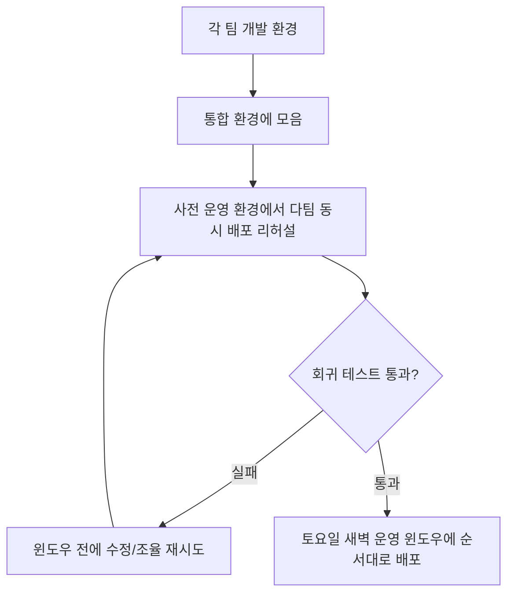
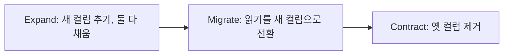

import { Callout, Steps, Step, Tabs, TabsList, TabsTrigger, TabsContent } from '@/components/writing-ui';

## 이게 뭔데

배포 윈도우(deployment window). 릴리스 윈도우라고도 부른다. 말은 거창한데, 실체는 단순하다. **운영에 뭔가를 올려도 되는, 미리 정해진 시간대**다. 그 시간 바깥에는 문이 잠겨 있다. 아무리 코드가 준비됐어도, 아무리 PR이 머지됐어도, 토요일 새벽 2시가 되기 전엔 운영에 손을 댈 수 없다.

비유를 하나 들어보자. 너는 이사를 가고 싶다. 짐도 다 쌌고 차도 빌렸고 마음의 준비도 됐다. 근데 이 아파트는 이삿짐 엘리베이터를 **토요일 오전에만** 예약받는다. 평일에 짐 빼겠다고 하면 경비 아저씨가 막는다. "다른 집도 써야 하잖아요. 순서대로." 그래서 너는 짐을 다 싸 놓고도 토요일까지 기다린다. 그리고 같은 토요일에 이사 나가는 다른 집이랑 시간을 쪼개 써야 한다. 이게 배포 윈도우다.

Customer / Account / Balance 테이블을 굴리는 은행 시스템을 떠올려 보자. 여기서 `Account` 테이블에 컬럼 하나 추가하는 작은 리팩토링이 끝났다. 코드도 다 됐다. 그럼 바로 올릴 수 있나? 아니다. 운영팀이 정해 둔 다음 윈도우는 **셋째 주 토요일 새벽 2시부터 6시까지**다. 그 전엔 못 올린다. 그리고 그 윈도우엔 너 말고도 결제팀, 정산팀, 인증팀이 다 같이 올린다.

<Callout type="info" title="한 줄 요약">
배포 윈도우는 "언제 운영을 건드려도 되는가"를 운영팀이 통제하는 장치다. 너는 원하는 때가 아니라 **예약된 창**에 배포해야 하고, 같은 창을 쓰는 다른 팀과 미리 조율해야 한다. 이 조율을 안전하게 리허설하는 곳이 사전 운영(pre-production) 환경이다.
</Callout>

## 시나리오: 이런 적 있을 거임

금요일 오후 4시. `Balance` 테이블에 `last_calculated_at` 컬럼을 추가하는 마이그레이션이 드디어 통과됐다. 테스트 다 초록불, 리뷰 LGTM, 머지 완료. 기분 좋게 슬랙에 "배포 갑니다~" 쳤더니, 운영팀에서 이렇게 답이 온다.

```text
운영팀: 금요일 오후엔 운영 배포 안 됩니다.
운영팀: change freeze 기간이에요. 월말 정산 돌고 있어서요.
운영팀: 스키마 변경은 셋째 주 토요일 새벽 윈도우에만 받습니다.
운영팀: 다음 윈도우 = 이번 주 토요일 02:00~06:00.
운영팀: 그 슬롯에 결제팀도 들어와요. 시간 겹치니까 조율하세요.
```

처음 겪으면 황당하다. "아니 코드 다 됐는데 왜 못 올려요?" 싶다. CI/CD 다 깔아놨는데 버튼 하나 누르면 끝 아니냐고. 근데 운영팀 입장에서 보면 전혀 다른 그림이다.

저쪽이 보는 건 이런 거다. 지금 운영 DB에선 **월말 정산 배치**가 `Balance`를 풀스캔하며 돌고 있다. 이 와중에 누가 `ALTER TABLE Balance ADD COLUMN`을 때리면? MySQL 구버전이면 테이블 전체에 락이 걸리고, 정산 배치가 멈추고, 그 배치를 기다리던 다른 시스템이 줄줄이 밀린다. 고객은 잔액이 안 맞는다고 전화한다. 새벽 2시에 이 짓을 하는 이유가 바로 이거다. **그 시간엔 정산도 안 돌고, 고객도 안 자고 있지 않다.** 활동이 가장 적은 시간이다.

<Callout type="warning" title="뭐가 문제냐면">
- **너의 일정 ≠ 운영의 일정**: 코드가 준비된 시점과 운영이 받아주는 시점은 다르다. 그 간극이 윈도우다.
- **혼자 올리는 게 아니다**: 같은 윈도우에 여러 팀이 들어온다. 내 리팩토링이 남의 리팩토링과 같은 시간, 같은 DB를 건드릴 수 있다.
- **freeze는 갑자기 온다**: 월말/연말/대형 이벤트 전엔 아예 배포가 동결된다. 모르고 있으면 "왜 안 올라가요?"를 매번 반복한다.
</Callout>

## 윈도우는 왜 이렇게 빡빡한가

운영팀이 심술궂어서가 아니다. 윈도우의 규칙은 보통 위험도에 비례해서 촘촘해진다.

| 변경 종류 | 전형적인 윈도우 | 왜 |
| --- | --- | --- |
| 버그 픽스(코드만) | 평일 새벽 4~6시 | 롤백이 쉽고 스키마를 안 건드림 |
| 일반 릴리스 | 토요일 저녁/새벽 | 코드+설정, 트래픽 적은 시간 |
| 스키마 변경(DDL) | 매월 셋째 토요일만 | 되돌리기 어렵고, 데이터 마이그레이션 동반 |

스키마 변경이 가장 빡빡하다. 이유는 명확하다. `ALTER TABLE`은 코드 롤백처럼 깔끔하게 안 돌아온다. 컬럼을 추가하는 건 그나마 낫지만, **드롭하거나 타입을 바꾸거나 데이터를 마이그레이션한 뒤엔** 그냥 이전 버전 도커 이미지로 갈아끼운다고 원상복구가 안 된다. 데이터는 코드와 달리 누적되는 상태이기 때문이다.

그리고 조직이 작을수록 윈도우는 더 드물어진다. 진행 중인 프로젝트가 몇 개 없으면 운영팀이 굳이 매주 새벽에 대기할 이유가 없다. 그래서 **몇 달에 한 번** 윈도우를 여는 곳도 있다. 그런 조직에서 "이번 분기 릴리스 트레인 놓치면 다음 분기"라는 말이 나오는 거다.

<Callout type="note" title="change freeze는 윈도우의 반대말">
배포 윈도우가 "열리는 시간"이라면, change freeze는 "닫아거는 기간"이다. 블랙프라이데이 주간, 연말 결산, 대형 마케팅 이벤트 직전엔 멀쩡한 윈도우도 통째로 막는다. 트래픽이 최대일 때 변경을 넣는 건 불난 집에 기름 붓는 거라서. 릴리스 캘린더에 freeze 기간을 미리 칠해두면 "왜 안 올라가요?" 핑퐁이 사라진다.
</Callout>

## 그래서 다 같이 모여서 조율한다

여기서 핵심이 나온다. **너 혼자 윈도우를 쓰는 게 아니다.** 같은 토요일 새벽 슬롯에 결제팀, 정산팀, 인증팀이 다 들어온다. 그럼 자연히 질문이 생긴다.

- 누가 먼저 올리나? (인증팀이 `Customer` 스키마를 바꾸면, 그걸 참조하는 결제팀이 그 뒤에 올라가야 한다)
- 누구 마이그레이션이 누구 마이그레이션과 충돌하나? (둘 다 같은 테이블을 건드리면?)
- 한 팀이 백아웃하면 다른 팀도 같이 되돌려야 하나?

이걸 토요일 새벽 2시에 처음 논의하면 그날 새벽은 지옥이 된다. 그래서 이 조율은 **배포 한참 전에** 끝내야 한다. 그리고 그걸 **리허설**할 장소가 필요하다. 그게 바로 사전 운영(pre-production / staging) 환경이다.



사전 운영 환경의 **주된 존재 이유가 바로 이 다중 시스템 조율**이다. 단순히 "운영이랑 똑같은 데서 한 번 더 테스트"하는 게 아니다. 여러 팀이 만든 여러 리팩토링을, 운영에 올리기 전에 **한 샌드박스에 다 같이 모아서** 돌려보는 거다. 결제팀 마이그레이션 + 인증팀 마이그레이션 + 우리팀 마이그레이션을 같은 순서로 적용했을 때 깨지는 게 없는지 미리 본다.

<Callout type="info" title="사전 운영이 진짜로 검증하는 것">
"이 리팩토링이 동작하나?"는 너희 개발 환경에서 이미 봤다. 사전 운영이 검증하는 건 다른 질문이다 — **"다른 팀들 변경이랑 같은 윈도우에 같이 올려도 괜찮나?"** 몇 개의 리팩토링이든, 몇 팀이 만들었든, 운영에 적용되기 전에 먼저 여기서 한 솥에 끓여본다.
</Callout>

## 윈도우 안에서 실제로 일어나는 일

그래서 그 토요일 새벽, 윈도우가 열리면 뭘 하나? 그냥 "배포 버튼 누르고 끝"이 아니다. 순서가 있다. 은행 시스템 배포를 예로 들면 대략 이렇게 흘러간다.

<Steps>
<Step title="DB 백업 (알려진 상태 확보)">
대형 운영 DB라 전체 백업이 부담스럽더라도, 최소한 되돌릴 수 있는 알려진 상태는 잡아둔다. 리팩토링 하나하나는 작아서 개별 백아웃이 쉽지만, 배포를 자꾸 미뤄 여러 리팩토링이 서로 의존하게 되면 이 이점이 사라진다. **작게, 자주**가 백아웃을 쉽게 만든다.
</Step>
<Step title="이전 버전 회귀 테스트">
변경을 올리기 전에, 현재 운영 시스템이 멀쩡히 돌고 있는지부터 확인한다. 누가 모르게 뭘 바꿔놨을 수도 있으니까. 이전 배포 기준 테스트 스위트가 실패하면 그냥 **중단(abort)**하고 원인부터 찾는다. (운영에서 테스트 돌릴 땐 부작용 조심 — 실제 송금이 나가면 안 되니까.)
</Step>
<Step title="애플리케이션 배포">
바뀐 앱부터 올린다. 단, 뒤에 나올 backward-compatible 원칙을 지켰다면, 새 앱은 옛 스키마에서도 일단 동작해야 한다.
</Step>
<Step title="스키마 + 데이터 마이그레이션 배포">
Flyway / Liquibase / Alembic 같은 마이그레이션 도구로 스키마 변경 스크립트와 데이터 마이그레이션 스크립트를 순서대로 적용한다. 번호(또는 타임스탬프)로 순서가 매겨져 있어서 어느 환경이든 같은 순서로 돈다.
</Step>
<Step title="현재 버전 회귀 테스트">
앱과 스키마가 다 올라간 상태에서, 현재 버전 테스트 스위트로 운영에서 진짜 동작하는지 확인한다. 여기서도 부작용 조심.
</Step>
<Step title="문제 생기면 백아웃">
심각한 결함이 드러나면 앱·스키마를 이전 버전으로 되돌리고 1단계 백업으로 DB를 복원한다. 백아웃이 복잡하면 통째로 말고 **증분 단위로** 배포해서, 한 부분이 깨져도 전체가 무너지지 않게 한다.
</Step>
</Steps>

이 시퀀스를 토요일 새벽에 처음 짜면 안 된다. 사전 운영에서 똑같이 한 번 돌려봐서 "3단계랑 4단계 사이에 인증팀 배포가 끼어야 하는구나"를 미리 알아내야 한다. 윈도우는 리허설을 본방으로 옮기는 시간이지, 즉흥극을 하는 시간이 아니다.

## 그런데, 이 빡빡함을 풀 수 있다

여기까지 읽으면 좀 답답할 거다. "2026년인데 아직도 토요일 새벽에 다 같이 모여서 손으로 배포한다고?" 맞다. 그리고 이 답답함의 정체를 정확히 짚어야 한다. **윈도우가 빡빡한 진짜 이유는 "스키마 변경이 위험해서"가 아니라, "스키마 변경을 위험하게 하고 있어서"다.**

위험의 핵심은 두 가지다. (1) `ALTER`가 락을 잡아 서비스를 멈추고, (2) 스키마와 코드가 동시에 바뀌어야 해서 둘을 한 순간에 칼같이 맞춰야 한다는 것. 이 둘을 없애면 윈도우가 필요 없어진다. 현대 실무는 정확히 이 둘을 공략한다.

### 1) 락 없는 온라인 스키마 변경

`ALTER`가 테이블을 잠그는 게 문제라면, 안 잠그고 바꾸면 된다.

<Tabs defaultValue="pg">
<TabsList>
<TabsTrigger value="pg">PostgreSQL</TabsTrigger>
<TabsTrigger value="mysql">MySQL</TabsTrigger>
</TabsList>
<TabsContent value="pg">

인덱스는 `CONCURRENTLY`로 만들면 쓰기를 막지 않는다. 제약은 `NOT VALID`로 먼저 붙이고 나중에 `VALIDATE`해서 풀스캔 락을 피한다.

```sql
-- 인덱스: 테이블 쓰기 잠그지 않고 생성
CREATE INDEX CONCURRENTLY idx_balance_calc
  ON Balance (last_calculated_at);

-- 제약: 일단 검증 없이 붙이고(짧은 락),
ALTER TABLE Account
  ADD CONSTRAINT chk_balance_nonneg CHECK (balance >= 0) NOT VALID;

-- 나중에 천천히 검증(이건 풀스캔이지만 쓰기를 막지 않음)
ALTER TABLE Account VALIDATE CONSTRAINT chk_balance_nonneg;
```

</TabsContent>
<TabsContent value="mysql">

큰 테이블의 스키마 변경은 gh-ost나 pt-online-schema-change로 돌린다. 원본을 직접 `ALTER`하는 대신, 새 구조의 그림자 테이블을 만들고 데이터를 복사한 뒤 트리거/바이너리 로그로 변경분을 따라잡고, 마지막에 순간적으로 테이블을 교체한다.

```text
gh-ost \
  --table=Balance \
  --alter="ADD COLUMN last_calculated_at DATETIME NULL" \
  --execute
```

서비스가 도는 와중에 바꿀 수 있으니, 새벽 2시까지 기다릴 이유 하나가 사라진다.
</TabsContent>
</Tabs>

### 2) expand-contract로 코드와 스키마를 분리

진짜 핵심은 이거다. **스키마와 코드를 같은 순간에 맞바꾸려고 하니까 윈도우가 필요한 거다.** 둘을 분리하면 된다. 그 방법이 expand-contract(parallel change)다. 컬럼 이름 하나 바꾸는 걸 예로 들면, 한 방에 안 바꾸고 세 번에 나눠서 한다.



<Steps>
<Step title="Expand — 더하기만">
`Account`에 새 컬럼을 추가한다. 옛 컬럼은 그대로 둔다. 앱은 쓸 때 **둘 다** 채운다(트리거 또는 앱 코드로). 이 단계의 스키마 변경은 순수하게 더하기뿐이라 **이전 버전 코드도 멀쩡히 돈다.** backward-compatible.
</Step>
<Step title="Migrate — 읽기 전환">
배경에서 기존 데이터를 새 컬럼으로 백필(backfill)한다. 다 채워지면 앱이 읽기를 새 컬럼으로 전환한다. 이것도 그냥 코드 배포라 평범한 윈도우(혹은 평시)에 가능.
</Step>
<Step title="Contract — 빼기">
모든 코드가 새 컬럼만 쓰는 게 확인되면, 한참 뒤 별도 배포에서 옛 컬럼을 드롭한다. 이 시점엔 아무도 옛 컬럼을 안 보므로 위험이 거의 없다.
</Step>
</Steps>

이 패턴의 마법은 **모든 중간 단계가 backward-compatible**이라는 데 있다. 새 앱은 옛 스키마에서 돌고, 옛 앱은 새 스키마에서 돈다. 그러면 "코드와 스키마를 같은 0.1초에 칼같이 맞춰야 한다"는 압박이 사라진다. 압박이 사라지면, 굳이 모두가 멈춰 있는 새벽 2시일 이유도 없어진다.

<Callout type="success" title="윈도우를 없애는 게 아니라, 필요 없게 만든다">
backward-compatible 마이그레이션은 배포를 **되돌리기 쉽고, 순서에 둔감하고, 트래픽 중에도 안전하게** 만든다. 위험이 사라지면 운영팀이 윈도우를 좁게 잡을 이유가 사라진다. 그래서 CD(continuous delivery)로 가는 팀은 윈도우를 깨부수는 게 아니라, **각 마이그레이션을 윈도우가 필요 없을 만큼 안전하게** 만들어서 자연히 윈도우를 없앤다.
</Callout>

물론 현실은 점진적이다. 규제 산업(은행이 딱 그렇다)이나 공유 DB를 여러 서비스가 같이 쓰는 환경에선 윈도우가 쉽게 안 사라진다. 여러 서비스가 한 DB를 공유하면 한 팀의 스키마 변경이 남의 서비스를 깨므로, 결국 다시 "다 같이 모여서 조율"로 회귀한다. 그래서 마이크로서비스에서 **공유 DB는 안티패턴**이고, 서비스마다 자기 DB를 갖고 expand-contract로 독립 배포하는 쪽으로 간다. 윈도우를 없애는 진짜 작업은 배포 절차가 아니라 **결합도를 푸는 일**인 셈이다.

## 정리

배포 윈도우는 운영팀의 변덕이 아니라 통제 장치다. **무엇이 언제 운영에 들어가는지**를 한곳에서 통제해, 운영팀은 새벽에 대기할 시간을 짜고, 개발팀은 목표 일정을 잡고, 사용자는 점검 시간을 안다. 그 통제의 핵심은 두 가지다 — 트래픽 적은 시간에 몰고, 같은 창을 쓰는 팀끼리 미리 조율하는 것. 그 조율을 안전하게 리허설하는 곳이 사전 운영 환경이다.

> **윈도우가 빡빡한 건 스키마 변경이 위험해서가 아니라, 위험하게 하고 있어서다.**

그러니 답답함을 푸는 길은 "윈도우 규칙과 싸우는 것"이 아니다. 온라인 스키마 변경으로 락을 없애고, expand-contract로 코드와 스키마를 분리해서, **각 마이그레이션을 윈도우가 필요 없을 만큼 안전하게** 만드는 것이다. 위험이 사라지면 문은 저절로 더 자주, 더 넓게 열린다. 토요일 새벽 2시에만 열리던 문이, 평일 오후 3시에도 열리기 시작한다.
