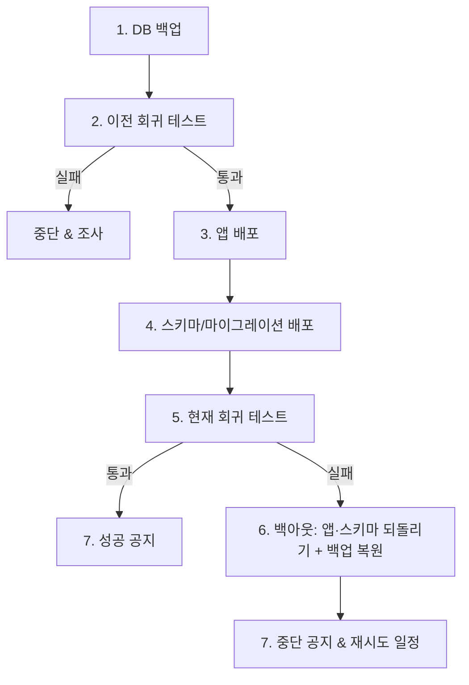
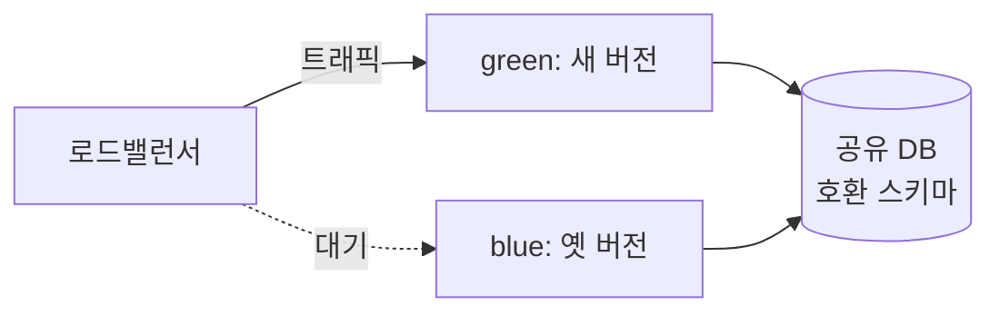

## 이게 뭔데

스키마를 멋지게 리팩토링했다고 치자. 로컬에서 돌아간다. 스테이징에서도 돌아간다. 테스트 다 통과한다. 이제 운영에 올리기만 하면 된다. 근데 "올린다"는 그 한 단어가, 실은 일곱 단계짜리 의식이다.

비유하자면 이렇다. 비행기 이륙은 "기장이 스로틀 밀면 끝"이 아니다. 출발 전 체크리스트가 있고, 활주로 진입 허가가 있고, 이륙 도중에도 V1이라는 "이 속도 넘으면 못 멈춘다" 지점이 있고, 뭔가 잘못되면 이륙 포기(reject) 절차가 있다. 운영 DB 배포도 똑같다. **그냥 마이그레이션 스크립트 하나 던지는 게 아니라, 던지기 전후로 "지금 멀쩡한가"를 확인하고, 잘못되면 되돌릴 길을 미리 깔아두는 절차 전체**가 배포다.

Scott Ambler와 Pramod Sadalage가 『Refactoring Databases』에서 정리한 배포 프로세스는 7단계다. 2006년 책이라 번호 매긴 SQL 스크립트를 손으로 돌리는 얘기지만, 골격은 지금 Flyway 돌리든 gh-ost 돌리든 그대로 유효하다. 오히려 도구가 그 골격을 자동화한 거다.

<Callout type="warning" title="한 줄 요약">
배포는 "스크립트 실행"이 아니라 "백업 → 이전 상태 확인 → 배포 → 현재 상태 확인 → 안 되면 되돌리기 → 공지"의 절차다. 그리고 이 절차가 성립하려면 배포가 **되돌릴 수 있게** 설계돼 있어야 한다.
</Callout>

## 시나리오: 이런 적 있을 거임

토요일 새벽 2시. 배포 윈도우. 은행 시스템의 `Customer` 테이블을 손보는 릴리스다. 슬랙엔 "배포 시작합니다" 한 줄. 누군가 자신만만하게 마이그레이션을 돌린다.

```sql
ALTER TABLE Customer DROP COLUMN PhoneNumber;
ALTER TABLE Customer ADD COLUMN ContactInfo JSONB;
```

3초 만에 끝난다. "배포 완료 ✅" 슬랙에 찍고, 다들 자러 간다.

새벽 4시. 페이저가 운다. 콜센터 시스템이 죽었다. 알고 보니 콜센터 앱은 아직 옛날 버전이라 `Customer.PhoneNumber`를 `SELECT` 하고 있었다. 그 컬럼은 두 시간 전에 사라졌다. 앱은 `column "phonenumber" does not exist` 뱉으면서 줄줄이 500을 던지는 중이다.

자, 롤백하자. 근데 어떻게? `PhoneNumber`를 `DROP` 했다. 그 안에 들어있던 600만 명의 전화번호는 **이미 사라졌다.** 백업? "DB가 너무 커서 이번엔 백업 스킵했어요." 끝났다. 새벽 4시에 600만 명 전화번호를 어디서 복구할지 회의가 잡힌다.

여기서 깨진 건 코드가 아니다. **절차**다. 백업을 안 했고(1단계 누락), 옛날 앱이 그 컬럼을 쓰는지 확인 안 했고(이전 회귀 테스트 누락), 컬럼을 즉시 `DROP` 해서 **되돌릴 수 없는 변경**을 만들었다. 7단계는 정확히 이 사고를 막으려고 존재한다.

## 7단계 배포 프로세스

책의 핵심이 이거다. 리팩토링 하나만 달랑 배포하는 일은 거의 없다. 보통 앱 변경 + 스키마 변경 + 데이터 마이그레이션을 묶어 시스템 전체 배포의 일부로 올린다. 그 묶음을 운영에 안전하게 내려놓는 순서가 다음 7단계다.

<Steps>

<Step title="데이터베이스 백업">
배포 전, 알려진 상태(known state)로 되돌릴 수 있게 백업을 뜬다. 대형 운영 DB에선 이게 어렵다는 게 함정이다 — 수 TB짜리 풀 백업을 배포 윈도우 안에 뜨는 건 비현실적이다. 그래서 현실에선 풀 백업 대신 **스냅샷(클라우드 볼륨 스냅샷, RDS snapshot)**, **PITR(point-in-time recovery) 기준점**, 또는 **논리 백업으로 영향받는 테이블만** 같은 가벼운 형태를 쓴다. 핵심은 "되돌릴 수 있는 좌표를 찍어둔다"는 것이지, 매번 통짜 dump를 뜨라는 게 아니다.
</Step>

<Step title="이전 회귀 테스트 실행">
배포를 시작하기 전에, **지금 운영 시스템이 멀쩡히 돌고 있는지부터** 확인한다. 의외로 중요하다. 누군가 모르게 핫픽스를 끼워넣었을 수도 있고, 저번 배포 잔재가 남아있을 수도 있다. 이전 릴리스 기준의 테스트 스위트가 여기서 실패하면 **배포를 중단(abort)하고 원인부터 캔다.** 멀쩡하지 않은 바닥 위에 새 배포를 얹으면, 나중에 뭐가 터졌을 때 "이번 배포 때문인지, 원래 깨져 있던 건지" 구분이 안 된다.
</Step>

<Step title="변경된 애플리케이션 배포">
앱부터 올린다. 기존 배포 절차(CI/CD 파이프라인, 롤링 업데이트 등)를 그대로 따른다. 여기서 중요한 전제 하나 — **앱은 옛 스키마와 새 스키마 양쪽 모두에서 동작해야 한다.** 이게 backward-compatible 배포의 핵심이고, 뒤에서 자세히 본다.
</Step>

<Step title="데이터베이스 리팩토링 배포">
스키마 변경 스크립트 + 데이터 마이그레이션 스크립트를 데이터 출처에 실행한다. Flyway면 `flyway migrate`, Liquibase면 `liquibase update`, Rails면 `rails db:migrate`다. 번호 매긴 스크립트를 순서대로 적용하는 책의 방식이 그대로 도구의 기본 동작이다.
</Step>

<Step title="현재 회귀 테스트 실행">
앱과 스키마가 다 올라간 뒤, **새 버전 기준 테스트 스위트**로 운영에서 동작을 검증한다. 여기까지 통과하면 배포가 사실상 성공한 거다. (운영에서 테스트 돌릴 때 부작용 주의 — 테스트가 진짜 고객 데이터를 건드리거나 진짜 알림을 쏘면 안 된다.)
</Step>

<Step title="필요시 백아웃(롤백)">
5단계에서 심각한 결함이 드러나면, 앱과 스키마를 이전 버전으로 되돌리고 1단계 백업으로 DB를 복원한다. 이게 복잡하면 한 방에 다 올리지 말고 **증분(increment) 단위로 쪼개 배포**해서, 한 조각이 터져도 전체 배포가 무너지지 않게 한다.
</Step>

<Step title="배포 결과 공지">
성공하면 즉시 이해관계자에게 알린다. 중단했어도 알린다 — "무슨 일이 있었고, 언제 재시도하는지." 새벽에 조용히 롤백하고 입 닫는 게 제일 나쁘다. 월요일 아침에 "어제 그 기능 왜 안 돼요?"가 터지기 때문이다.

</Step>

</Steps>

흐름으로 보면 이렇다.



<Callout type="info" title="번호 스택으로 묶어 올린다">
매주 동작하는 소프트웨어를 만든다고 매주 운영에 올리는 건 아니다. 보통 리팩토링들을 **릴리스 단위로 모았다가** 배포 윈도우에 한꺼번에 올린다. 이걸 책은 "리팩토링 스택(stack)"이라 부른다 — 릴리스 개발 동안 마이그레이션을 쌓고, 취소할 건 빼고, 릴리스 끝에 기준선화(baseline)한다. Flyway/Liquibase의 버전 매긴 마이그레이션 폴더가 정확히 이 스택이다. `V1__`, `V2__`, `V3__` 순서대로 쌓이고, 스테이징에서 같은 순서로 검증한 묶음을 운영에 그대로 적용한다.
</Callout>

## 핵심은 "되돌릴 수 있는가"다

7단계 중 6단계(백아웃)가 사실상 나머지 전부를 지탱한다. 백업도, 이전 테스트도, 증분 배포도 결국 "잘못됐을 때 되돌리기 위한" 장치다. 그래서 진짜 질문은 하나로 수렴한다 — **이 배포, 되돌릴 수 있게 만들었나?**

여기서 변경을 두 종류로 나눠야 한다.

**되돌릴 수 있는 변경.** 컬럼 추가, 인덱스 추가, 새 테이블 생성. 이런 건 망해도 `DROP`으로 깨끗이 지우면 원상복구다. 데이터 손실이 없다.

**되돌릴 수 없는(또는 비싸게만 되돌릴 수 있는) 변경.** 컬럼/테이블 `DROP`, 타입 축소(`VARCHAR(255)` → `VARCHAR(50)`), 파괴적 데이터 마이그레이션(두 컬럼 합치고 원본 삭제). 이건 한 번 실행되면 **원본 데이터가 사라진다.** 롤백 스크립트를 아무리 잘 짜도, 사라진 데이터는 백업에서 끌어오는 수밖에 없다.

<Callout type="error" title="뭐가 문제냐면">
- **파괴적 변경은 롤백이 "스크립트"가 아니라 "복구 작업"이 된다**: `DROP COLUMN`의 롤백은 `ADD COLUMN`이 아니다. 컬럼 구조는 되살려도 그 안의 데이터는 안 돌아온다. 백업 복원 + PITR이 동원되고, 그 사이 운영은 멈춰 있다.
- **앱과 스키마의 배포 순서가 어긋나면 그 틈에서 죽는다**: 스키마를 먼저 깨고 앱을 늦게 올리면, 그 사이 옛 앱이 없는 컬럼을 찾는다. 반대도 마찬가지.
- **"롤백하면 되지"라는 안일함이 제일 위험하다**: 롤백을 한 번도 리허설 안 해봤으면, 그건 롤백 계획이 아니라 희망사항이다.
</Callout>

핵심 원칙은 이거다. **파괴적 변경은 같은 배포에서 하지 않는다.** 새벽 시나리오의 진짜 실수는 "백업을 안 한 것"보다 더 근본적으로, **컬럼 추가와 컬럼 삭제를 같은 배포에 욱여넣은 것**이다. 둘을 떼어내면 사고 자체가 안 난다.

## 현대화: expand-contract로 파괴적 변경을 비파괴적으로

책의 7단계는 "한 배포 안에서 백업 뜨고 롤백 준비하는" 절차다. 현대 실무는 한 발 더 나간다 — **애초에 롤백이 거의 필요 없도록 변경을 잘게 쪼갠다.** 그 패턴이 expand-contract(= parallel change)다.

`Customer.PhoneNumber`(문자열)를 `ContactInfo`(JSONB)로 옮기는 그 위험한 변경을, 세 번의 안전한 배포로 분해해 보자.

<Steps>

<Step title="Expand — 새 구조를 추가만 한다">
`ContactInfo` 컬럼을 **추가한다. 옛 컬럼은 그대로 둔다.** 앱은 쓸 때 양쪽에 다 쓰고(dual write), 읽을 땐 아직 옛 컬럼에서 읽는다. 이 배포는 순수 추가라 되돌리기가 `DROP COLUMN ContactInfo` 한 줄이다. 안전하다.

```sql
ALTER TABLE Customer ADD COLUMN ContactInfo JSONB;
-- PhoneNumber는 건드리지 않는다
```
</Step>

<Step title="Migrate — 데이터를 채우고 읽기를 옮긴다">
기존 600만 행의 `PhoneNumber`를 백필(backfill)해 `ContactInfo`로 옮긴다. 큰 테이블이면 한 방에 `UPDATE` 하지 말고 배치로 쪼갠다. 다 채워졌으면 앱의 **읽기 경로를 `ContactInfo`로 전환**한다. 이때도 옛 컬럼은 여전히 살아있어서, 문제가 생기면 읽기만 옛 컬럼으로 되돌리면 끝이다. feature flag로 읽기 소스를 토글하면 배포 없이 즉시 되돌릴 수도 있다.
</Step>

<Step title="Contract — 다 안전해진 뒤에야 옛 구조를 제거한다">
앱이 더는 `PhoneNumber`를 안 읽고, 모니터링으로 "이 컬럼 접근 0건"을 며칠 확인한 뒤에야 `DROP`한다. 이 시점엔 그 컬럼을 쓰는 코드가 운영에 하나도 없으므로, 삭제해도 아무도 안 죽는다.

```sql
ALTER TABLE Customer DROP COLUMN PhoneNumber;
```
</Step>

</Steps>

차이가 보이나. 새벽 시나리오는 expand와 contract를 **같은 3초에** 했다. expand-contract는 그걸 며칠~몇 주에 걸쳐 **세 번으로 나눈다.** 각 단계가 독립적으로 되돌릴 수 있고, 옛 앱과 새 앱이 전환 기간 동안 공존한다. 그래서 앱과 스키마의 배포 순서가 어긋나도 안 죽는다 — 양쪽 다 양쪽 스키마에서 동작하니까(7단계의 backward-compatible 전제가 이거다).

<Callout type="note" title="왜 backward-compatible이 필수냐">
운영 배포는 보통 한 순간에 안 끝난다. 롤링 업데이트면 구버전 인스턴스와 신버전 인스턴스가 몇 분~몇십 분 공존하고, blue-green이면 두 환경이 트래픽을 나눠 받는 동안 둘 다 같은 DB를 본다. 그 공존 구간 내내 **옛 코드도 새 코드도 동시에 멀쩡해야** 한다. 그래서 "스키마는 항상 한 버전 앞뒤로 호환되게" 바뀌어야 하고, 그걸 보장하는 게 expand-contract다.
</Callout>

## 온라인 스키마 변경: 잠그지 않고 바꾸기

7단계 중 4단계(스키마 배포)가 의외의 복병이다. 작은 테이블이면 `ALTER`가 0.1초지만, 600만 행짜리 `Customer`에 인덱스를 거는 순간 테이블이 통째로 잠겨 배포 윈도우 내내 서비스가 멈출 수 있다. 그래서 온라인 스키마 변경 도구가 필요하다.

```sql
-- PostgreSQL: 테이블 안 잠그고 인덱스 생성
CREATE INDEX CONCURRENTLY idx_customer_email ON Customer (Email);

-- 제약을 일단 NOT VALID로 빠르게 추가하고
ALTER TABLE Account ADD CONSTRAINT chk_balance
    CHECK (Balance >= 0) NOT VALID;
-- 검증은 락 없이 나중에
ALTER TABLE Account VALIDATE CONSTRAINT chk_balance;
```

MySQL이면 `pt-online-schema-change`(pt-osc)나 `gh-ost`가 같은 일을 한다 — 그림자 테이블을 만들어 트리거/binlog로 변경을 따라 복사하고, 다 따라잡으면 원자적으로 이름만 바꾼다. 락 없이 큰 테이블을 바꾸는 표준 기법이다.

이게 7단계와 어떻게 엮이냐면, **온라인 변경은 그 자체가 점진적이라 도중 중단도 더 안전**하다. `CREATE INDEX CONCURRENTLY`가 실패하면 무효(invalid) 인덱스만 남고 테이블 데이터는 멀쩡하다 — `DROP INDEX` 하고 다시 하면 된다. 통짜 락 `ALTER`가 절반에서 죽었을 때의 악몽과는 다르다.

## blue-green과 feature flag

배포 전략 자체로도 롤백 비용을 낮출 수 있다.

**blue-green 배포.** 동일한 운영 환경을 둘(blue/green) 띄워놓고, 새 버전을 green에 올린 뒤 트래픽을 green으로 스위치한다. 문제가 생기면 트래픽을 blue로 되돌리면 끝 — **앱 롤백이 초 단위**다. 다만 함정이 있다. 보통 blue와 green이 **같은 DB를 공유**하므로, 앱은 즉시 되돌려도 **스키마는 안 되돌아간다.** 그래서 blue-green과 expand-contract는 짝이다 — 스키마를 항상 양쪽 호환되게 바꿔야 트래픽 스위치/롤백이 진짜로 안전하다.



**feature flag.** 코드 경로를 플래그로 감싸두면, 새 동작이 잘못됐을 때 **배포 없이 플래그만 꺼서** 즉시 옛 경로로 되돌린다. expand-contract의 "읽기 소스 전환"을 플래그로 걸어두면, 롤백이 마이그레이션이 아니라 토글 한 번이 된다. 단, 플래그는 임시 비계(scaffolding)다 — 전환 끝나면 죽은 분기와 함께 치워야 한다. 안 치우면 그게 다음 사람의 지뢰가 된다.

<Callout type="warning" title="공유 DB는 롤백의 적이다">
마이크로서비스에서 여러 서비스가 한 DB를 직접 공유하면(= 공유 DB 안티패턴), 한 서비스가 스키마를 바꾸는 순간 다른 서비스들이 줄줄이 영향받는다. 이러면 "이전 회귀 테스트"(2단계)가 **내 서비스만으론 불가능**해진다 — 그 컬럼을 누가 또 쓰는지 알 수가 없으니까. 새벽 콜센터 사고가 정확히 이 모양이다. 스키마 변경을 안전하게 롤백하려면, 한 테이블의 변경 영향이 **알 수 있는 범위**로 갇혀 있어야 한다.
</Callout>

## 폐기 스키마 제거: 마지막 한 단계

expand-contract의 contract, 즉 옛 컬럼/테이블/트리거를 치우는 일은 **별도의 배포로** 다룬다. 책의 표현으로는 "폐기된 스키마를 운영에서 제거하기 전까지는 리팩토링이 진짜 끝난 게 아니다." 전환 기간 동안 양쪽을 동기화하던 스캐폴딩(버전 동기화 트리거 같은 것)도 이때 같이 걷어낸다.

전환 기간은 길다. 그 컬럼을 쓰는 모든 프로그램이 갱신될 때까지 기다려야 하니까, 길면 몇 년이다. 그래서 "언제든 마음 내킬 때 지운다"가 아니라 **지정된 날짜(예: 분기당 한 번)에 묶어서** 제거한다. 그리고 제거조차도 7단계를 그대로 탄다 — 스테이징에서 먼저 지우고 전부 재테스트한 뒤, 운영에 적용하고 거기서 테스트 돌려 백아웃하거나 진행한다.

<Callout type="success" title="제거 체크리스트">
폐기 스키마를 `DROP` 하기 전에 확인할 것:
- 이 컬럼/테이블에 접근하는 코드가 운영에 **0개**임을 모니터링/쿼리 로그로 확인했나
- 전환 기간 동안 걸어둔 동기화 트리거·플래그·이중 쓰기 코드도 같이 치우나
- 스테이징에서 먼저 제거하고 전체 회귀 테스트를 통과했나
- `DROP` 직전 백업/스냅샷 좌표를 찍었나 (이건 진짜 되돌릴 수 없는 변경이니까)
</Callout>

## 정리

배포는 스크립트 실행이 아니라 절차다. 그 절차의 뼈대는 일곱 단계 — **백업하고, 지금 멀쩡한지 확인하고, 앱 올리고, 스키마 올리고, 잘 됐는지 확인하고, 안 되면 되돌리고, 알린다.**

> **배포의 성패는 "올릴 수 있나"가 아니라 "되돌릴 수 있나"에서 갈린다.**

그래서 현대 실무의 방향은 명확하다. 파괴적 변경은 같은 배포에 넣지 말고, expand-contract로 잘게 쪼개 각 단계를 독립적으로 되돌릴 수 있게 만든다. 스키마는 항상 앞뒤 버전과 호환되게 바꿔서 롤링·blue-green 공존 구간에서도 안 죽게 한다. 큰 테이블은 온라인 스키마 변경으로 락 없이 바꾸고, 위험한 경로는 feature flag로 감싸 토글 한 번에 되돌린다. 그리고 옛 구조를 치우는 일조차 별도 배포로, 다시 7단계를 태운다.

새벽 4시에 600만 명 전화번호를 어디서 복구할지 회의하고 싶지 않다면, 답은 하나다. **`DROP`을 같은 배포에 넣지 마라.** 추가하는 배포와 지우는 배포 사이에, 되돌릴 시간을 벌어둬라.
