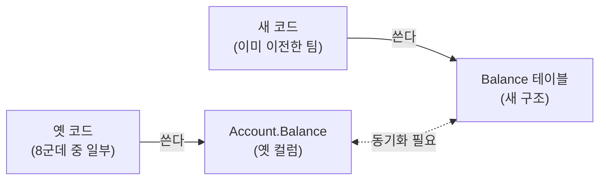
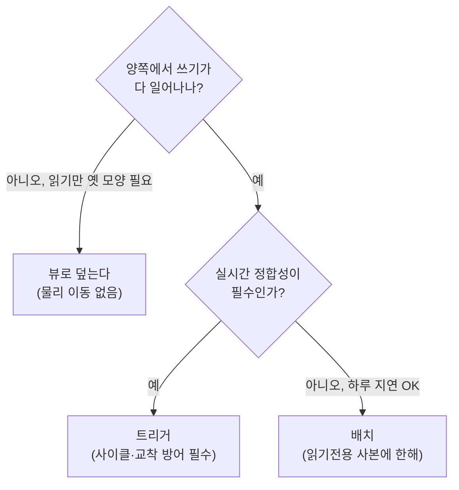
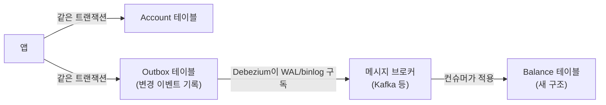

import { Callout, Steps, Step, Tabs, TabsList, TabsTrigger, TabsContent } from '@/components/writing-ui';

## 이게 뭔데

스키마를 안전하게 바꾸는 정석은 "한 번에 갈아엎지 않는 것"이다. 옛 컬럼을 바로 지우는 대신, 새 컬럼을 옆에 만들고 둘을 한동안 **같이 살려둔다**. 이게 expand-contract(parallel change)고, 그 "같이 살려두는" 구간을 전환 기간(transition period)이라고 부른다.

그런데 여기서 아무도 처음엔 진지하게 안 묻는 질문이 하나 있다.

> **두 스키마가 동시에 살아 있는 동안, 누가 둘을 똑같이 맞춰주냐?**

예를 들어 `Customer` 테이블의 통짜 `Name` 컬럼을 `FirstName` / `LastName` 두 개로 쪼개는 중이라 치자. 전환 기간엔 세 컬럼이 다 존재한다. 옛 코드는 `Name`에 쓰고, 새 코드는 `FirstName`/`LastName`에 쓴다. 누군가 옛 코드로 `Name = '김철수'`를 업데이트하면, 그 순간 `FirstName='철수'`도 따라 바뀌어야 한다. 안 그러면 같은 사람을 옛 화면에선 "김철수", 새 화면에선 "철수민(어제 값)"으로 보게 된다. **데이터가 갈라진다.**

이 갈라짐을 막는 게 동기화(synchronization) 전략이다. 그리고 손에 쥔 카드는 크게 셋이다. 트리거, 뷰, 배치.

<Callout type="info" title="한 줄 요약">
전환 기간엔 옛 스키마와 새 스키마가 공존한다. 어느 쪽에 쓰든 다른 쪽이 따라와야 한다. 동기화는 트리거 · 뷰 · 배치 셋 중 하나로 하고, 대부분의 경우 답은 트리거다. 단, 트리거는 사이클·교착이라는 함정을 깔고 있다.
</Callout>

## 시나리오: 이런 적 있을 거임

월요일에 결심한다. "`Account.Balance`를 `Account` 테이블에서 떼어내서 별도 `Balance` 테이블로 옮기자. 잔액 이력도 같이 관리하게." 좋은 리팩토링이다. 문제는 이 `Balance` 컬럼을 읽고 쓰는 코드가 사내에 **여덟 군데** 있다는 거다. 정산 배치, 모바일 앱 API, 콜센터 어드민, 어제 퇴사한 사람이 만든 정체불명 크론잡까지.

이 여덟 개를 하루아침에 다 새 테이블로 바꾸는 건 불가능하다. 그래서 자연스럽게 expand-contract로 간다.

<Steps>
<Step title="Expand — 새 구조를 옆에 만든다">
`Balance` 테이블을 새로 만들고, `Account` 테이블의 옛 `Balance` 컬럼은 일단 그대로 둔다. 둘 다 산다.
</Step>
<Step title="Migrate — 코드를 한 팀씩 옮긴다">
여덟 군데를 하나씩, 자기 배포 주기에 맞춰 새 `Balance` 테이블 쪽으로 옮긴다. 몇 주, 길면 몇 달 걸린다.
</Step>
<Step title="Contract — 마지막 사용자가 떠나면 옛 컬럼을 지운다">
아무도 옛 `Account.Balance`를 안 읽는 게 확인되면, 그때 비로소 컬럼을 떨군다.
</Step>
</Steps>

여기서 핵심은 2단계 내내, 어떤 코드는 옛 컬럼에 쓰고 어떤 코드는 새 테이블에 쓴다는 거다. 누가 어디에 쓰든 잔액은 **하나의 진실**이어야 한다. 콜센터에서 `Account.Balance = 50000`으로 고쳤는데 모바일 앱이 새 `Balance` 테이블에서 옛날 값 `48000`을 읽어 고객한테 보여주면? 그날 CS 폭발이고, 운 나쁘면 그 \$2000 차이로 누군가 송금을 시도한다.

그래서 전환 기간 동안 둘을 강제로 묶어줄 장치가 필요하다. 그게 동기화다.



저 점선 화살표를 누가 책임지느냐가 이 글의 전부다.

## 세 가지 전략

원전(原典)이 정리한 표는 단순하다. 트리거 · 뷰 · 배치. 하나씩 흉터를 풀어보자.

### 트리거 — 실시간으로, DB가 직접

가장 직관적인 방법. 옛 컬럼에 INSERT/UPDATE가 들어오면 트리거가 그 자리에서 새 테이블도 갱신한다. 반대 방향도 마찬가지. **양방향 트리거**를 거는 거다.

```sql
-- 옛 컬럼 -> 새 테이블 동기화
CREATE TRIGGER SyncBalanceForward
AFTER UPDATE OF Balance ON Account
FOR EACH ROW
BEGIN
  MERGE INTO Balance b
  USING (SELECT :NEW.AccountId AS aid, :NEW.Balance AS amt FROM dual) s
  ON (b.AccountId = s.aid)
  WHEN MATCHED THEN UPDATE SET b.Amount = s.amt
  WHEN NOT MATCHED THEN INSERT (AccountId, Amount) VALUES (s.aid, s.amt);
END;

-- 새 테이블 -> 옛 컬럼 동기화
CREATE TRIGGER SyncBalanceBackward
AFTER UPDATE OF Amount ON Balance
FOR EACH ROW
BEGIN
  UPDATE Account SET Balance = :NEW.Amount
  WHERE AccountId = :NEW.AccountId;
END;
```

장점은 명확하다. **실시간**이다. 누가 어디에 쓰든 즉시 반영되니, 어느 버전을 읽어도 같은 값이 나온다. 그래서 원전도, 이 책의 거의 모든 예제도 트리거를 깔고 간다.

단점은 두 가지인데, 둘 다 사람 잡는다. 첫째, **성능**. 모든 쓰기마다 트리거가 따라붙으니 쓰기 비용이 올라간다. 둘째, 그리고 이게 진짜 무서운데 — **사이클과 교착**이다.

<Callout type="error" title="트리거 무한루프 — 직접 안 밟아보면 안 믿는다">
위 두 트리거를 그대로 켜면 어떻게 될까. 누가 `Account.Balance`를 고친다 → `SyncBalanceForward`가 `Balance` 테이블을 고친다 → 그게 `SyncBalanceBackward`를 깨운다 → `Account.Balance`를 또 고친다 → 다시 `SyncBalanceForward`가... **무한루프다.** DB가 재귀 깊이 한도에 걸려 트랜잭션을 통째로 뱉어낸다. 양방향 동기화 트리거는 거의 항상 이 함정을 깐다.
</Callout>

이걸 막으려면 트리거 안에서 "이번 변경이 동기화 때문에 발생한 건지"를 구분해야 한다. 흔한 방법이 가드 플래그나 값 비교다.

```sql
CREATE TRIGGER SyncBalanceBackward
AFTER UPDATE OF Amount ON Balance
FOR EACH ROW
BEGIN
  -- 이미 같은 값이면 굳이 쓰지 않는다 -> 사이클 차단
  UPDATE Account SET Balance = :NEW.Amount
  WHERE AccountId = :NEW.AccountId
    AND Balance <> :NEW.Amount;
END;
```

값이 이미 같으면 UPDATE가 0행을 건드리고, 0행이면 상대 트리거도 안 깨어난다. 핑퐁이 한 번에 멈춘다. 세션 변수로 "동기화 중" 플래그를 세워 트리거 본체를 통째로 건너뛰게 하는 방법도 흔하다.

교착(deadlock)은 또 다른 이야기다. 트리거가 트랜잭션 안에서 다른 테이블에 락을 추가로 잡으니, 두 트랜잭션이 `Account`와 `Balance`를 **반대 순서로** 만지면 서로의 락을 기다리다 데드락이 난다. 평소엔 멀쩡하다가 동시성 올라가는 피크 타임에만 터지는, 가장 재현 안 되는 종류의 버그다.

### 뷰 — 물리 이동 없이, 한 꺼풀로 덮기

두 번째 카드. 데이터를 실제로 두 곳에 두는 대신, 한쪽은 **뷰**로 만들어 덮어버린다. 원전 용어로 `Encapsulate Table With View`. 옛 코드가 보는 `Account.Balance`를 뷰로 만들어, 실제로는 새 `Balance` 테이블을 가리키게 하는 식이다.

```sql
-- Account의 실체는 그대로 두되,
-- 옛 코드가 보던 "Balance까지 포함된 모양"을 뷰로 재현
CREATE VIEW Account_Compat AS
SELECT a.AccountId, a.CustomerId, b.Amount AS Balance
FROM Account a
JOIN Balance b ON b.AccountId = a.AccountId;
```

장점은 **물리적 데이터 이동이 없다**는 거다. 잔액은 `Balance` 테이블 한 곳에만 진짜로 산다. 옛 코드는 뷰를 통해 같은 모양으로 읽으니 데이터 중복이 없고, 따라서 "두 값이 갈라지는" 문제 자체가 사라진다. 깔끔하다.

문제는 **쓰기**다.

<Callout type="warning" title="갱신 가능 뷰의 벽">
읽기는 뷰가 잘한다. 그런데 옛 코드가 `UPDATE Account_Compat SET Balance = 50000`을 날리면? 이건 조인이 들어간 뷰에 대한 UPDATE다. 많은 DB가 조인 뷰에 대한 직접 갱신을 아예 막거나(updatable view 미지원), 어느 베이스 테이블에 써야 할지 모호하다며 거부한다. 결국 `INSTEAD OF` 트리거를 또 붙여야 하고, 그러면 "트리거 없이 가려던" 목적이 무너진다.
</Callout>

그래서 뷰 전략은 **읽기는 옛 모양, 쓰기는 이미 새 코드로 다 넘어간** 상황에 잘 맞는다. 쓰기까지 양쪽에서 섞이면 결국 트리거를 부르게 된다. 원전이 "뷰는 몇 번 쓴다" 정도로 위치 지은 이유다.

### 배치 — 밤에 몰아서, 대신 늦게

세 번째 카드. 실시간 포기. 하루에 한 번, 새벽 3시에 배치 잡이 돌면서 옛 컬럼과 새 테이블의 차이를 메운다.

```sql
-- 매일 새벽 돌리는 동기화 배치 (개념)
UPDATE Balance b
SET Amount = (SELECT a.Balance FROM Account a WHERE a.AccountId = b.AccountId)
WHERE b.AccountId IN (
  SELECT AccountId FROM Account
  WHERE LastModified >= :yesterday_3am   -- 어제 이후 바뀐 것만
);
```

장점은 **부하를 비피크 시간에 흡수**한다는 거다. 쓰기 경로에 아무 부담을 안 준다. 낮엔 빠르고, 무거운 일은 새벽에.

단점은 치명적이다. **참조 무결성이 깨진다.** 새벽 3시 배치와 다음 날 새벽 3시 사이의 24시간 동안, 옛 값과 새 값이 대놓고 다르다. 그 사이에 옛 화면과 새 화면을 번갈아 본 고객은 잔액이 다르게 보인다. 게다가 같은 행이 하루 동안 여러 번 바뀌었으면 "어느 변경을 최종으로 채택할지" 판단이 어렵다. 양쪽에서 다 고쳤으면 어느 쪽이 이기나?

<Callout type="note" title="배치가 그래도 맞는 경우">
배치가 무조건 나쁜 건 아니다. (1) 한쪽이 사실상 읽기 전용인 분석/리포팅 사본이고, (2) 하루치 지연이 비즈니스적으로 허용되며, (3) 변경 충돌이 구조적으로 안 나는 상황이라면 배치가 가장 싸고 단순하다. 잔액처럼 실시간 정합성이 돈과 직결되는 데이터엔 안 맞을 뿐이다.
</Callout>

## 그래서 뭘 골라야 하나

원전의 경험칙은 한 문장으로 압축된다.

> **대부분의 상황에서 트리거가 최선이다. 뷰는 가끔, 배치는 드물게.**

이걸 표로 정리하면 이렇다.

| 전략 | 정합성 | 쓰기 부담 | 데이터 중복 | 주된 함정 |
|---|---|---|---|---|
| **트리거** | 실시간 | 매 쓰기마다 | 양쪽 저장(보통) | 사이클 · 교착 |
| **뷰** | 실시간(읽기) | 갱신 뷰 제약 | 없음 | 조인 뷰 쓰기 불가 |
| **배치** | 지연(예: 하루) | 비피크로 분산 | 양쪽 저장 | 참조 무결성 붕괴 |

판단 흐름은 대략 이렇게 잡으면 된다.



트리거가 기본값인 이유는 단순하다. 셋 중 **실시간 + 양방향 쓰기**를 동시에 만족하는 게 트리거뿐이라서다. 뷰는 쓰기에서 막히고, 배치는 실시간을 포기한다.

## 현대화: 트리거를 넘어서

2006년의 책은 이 동기화를 DB 트리거로 손코딩하는 걸 전제했다. 골격은 지금도 유효한데, 2026년 실무엔 트리거 말고도 같은 문제를 푸는 도구가 더 생겼다. 그리고 그중 일부는 트리거의 함정을 **구조적으로** 피한다.

### dual-write의 함정 — 앱에서 양쪽에 쓰지 마라

가장 먼저 떠올리는, 그리고 가장 흔하게 망하는 접근이 dual-write다. "트리거 복잡하니까 그냥 애플리케이션 코드에서 두 군데 다 쓰자."

```typescript
// 절대 이렇게 하지 마라
await db.account.update({ where: { id }, data: { balance: 50000 } });
await db.balance.update({ where: { accountId: id }, data: { amount: 50000 } });
```

문제는 두 UPDATE가 **원자적이지 않다는 것**이다. 첫 줄이 성공하고 둘째 줄 직전에 프로세스가 죽으면? 옛 컬럼은 50000, 새 테이블은 옛 값. 영구히 갈라진다. 같은 트랜잭션으로 묶어도, 두 DB거나 두 서비스면 묶을 수조차 없다.

<Callout type="error" title="dual-write는 분산 트랜잭션 문제를 슬쩍 떠넘긴 것">
dual-write가 위험한 건 "두 쓰기 사이의 틈"이 항상 존재하기 때문이다. 단일 DB 안이면 차라리 트리거가 낫다(트리거는 같은 트랜잭션·같은 락 범위에서 돈다). 앱 레벨 dual-write는 그 원자성 보장을 스스로 포기하면서 책임만 애플리케이션으로 떠넘긴 셈이다. 동기화 로직은 가능하면 데이터에 가장 가까운 곳(DB)에 두자.
</Callout>

### CDC + outbox — 로그를 흘려보내 갱신한다

같은 DB 안이 아니라, 새 구조가 **다른 테이블·다른 DB·다른 서비스**에 있을 때 트리거는 손이 안 닿는다. 여기서 현대 패턴이 CDC(Change Data Capture)다.

핵심 아이디어: 트리거로 상대를 직접 건드리는 대신, **변경을 일단 로그로 남기고**, 그 로그를 비동기로 흘려보내 상대를 갱신한다.



여기서 transactional outbox가 dual-write의 틈을 메운다. `Account` 업데이트와 "변경 발생" 이벤트를 **같은 트랜잭션 안에서** `Outbox` 테이블에 함께 쓴다. 둘은 원자적으로 커밋되니 갈라질 틈이 없다. 그다음 Debezium이 DB의 WAL/binlog를 읽어 outbox 행을 메시지로 흘려보내고, 컨슈머가 새 `Balance` 테이블에 적용한다.

```typescript
// outbox: 비즈니스 변경과 이벤트를 같은 트랜잭션으로
await db.$transaction(async (tx) => {
  await tx.account.update({ where: { id }, data: { balance: 50000 } });
  await tx.outbox.create({
    data: {
      aggregate: 'Account',
      aggregateId: id,
      eventType: 'BalanceChanged',
      payload: { accountId: id, amount: 50000 },
    },
  });
});
// 이후 Debezium이 outbox를 구독해 새 구조로 비동기 전파
```

트리거와의 차이는 정합성 모델이다. CDC는 **최종 일관성(eventually consistent)**이다. 옛 컬럼은 즉시, 새 구조는 몇 밀리초~몇 초 뒤에 따라온다. 잔액처럼 강한 즉시 정합성이 필요하면 단일 DB 트리거가 여전히 맞고, 마이크로서비스 경계를 넘어 동기화해야 하면 CDC가 거의 유일한 정답이다.

### application-level backfill — 트리거가 못 메우는 과거

트리거든 CDC든, 켜는 순간부터의 변경만 잡는다. 그런데 전환 기간 시작 시점에 이미 `Account`에 600만 행이 쌓여 있다면? 그 과거 데이터는 동기화 장치가 못 본다. 이건 별도로 **backfill**해야 한다.

```typescript
// 과거 데이터는 배치로 한 번 메운다 (작은 청크로 끊어서)
let lastId = 0;
while (true) {
  const rows = await db.account.findMany({
    where: { id: { gt: lastId } },
    orderBy: { id: 'asc' },
    take: 1000,
  });
  if (rows.length === 0) break;
  await db.balance.createMany({
    data: rows.map((r) => ({ accountId: r.id, amount: r.balance })),
    skipDuplicates: true,
  });
  lastId = rows[rows.length - 1].id;
}
```

핵심은 **청크로 끊어 돌린다**는 것. 600만 행을 한 트랜잭션으로 옮기면 거대한 락과 거대한 언두 로그로 운영 DB를 마비시킨다. `take: 1000`씩 끊고, `skipDuplicates`로 트리거가 이미 메운 행과 충돌하지 않게 한다. 순서는 항상 **동기화 장치(트리거/CDC)를 먼저 켜고 → 그다음 과거를 backfill**한다. 반대로 하면 backfill 도중 들어온 신규 변경을 놓친다.

<Callout type="success" title="현대 동기화 조립 레시피">
1. **expand**: 새 구조를 만든다(`Balance` 테이블).
2. **동기화 장치 ON**: 단일 DB면 양방향 트리거(사이클·교착 방어 포함), 경계를 넘으면 outbox + CDC.
3. **backfill**: 과거 데이터를 청크 단위로 메운다(`skipDuplicates`).
4. **검증**: 두 소스의 행 수·체크섬을 주기적으로 대조(reconciliation)해 드리프트를 잡는다.
5. **migrate**: 코드를 한 팀씩 새 구조로 옮긴다.
6. **contract**: 마지막 사용자가 떠나면 동기화 장치와 옛 컬럼을 함께 제거한다.
</Callout>

## 마이크로서비스에선 한 번 더 생각하기

원전은 "한 DB를 여러 앱이 공유"하는 세계를 전제한다. 그런데 마이크로서비스 시대엔 그 전제 자체가 안티패턴 취급을 받는다. 공유 DB(shared database)는 서비스 간 강결합을 만들고, 한 서비스의 스키마 변경이 옆 서비스를 깨뜨린다.

그래서 동기화를 설계할 때 질문이 하나 더 붙는다. **"이 두 스키마가 같은 서비스 소유인가?"**

- **같은 서비스, 같은 DB** — 트리거가 가장 단순하고 강하다. 원전의 조언이 거의 그대로 통한다.
- **다른 서비스** — 트리거로 남의 DB를 건드리는 건 곧 공유 DB 안티패턴이다. 여기선 CDC/outbox로 **이벤트를 발행**하고, 상대 서비스가 자기 스키마를 알아서 갱신하게 한다. 동기화 책임이 "한 트리거"가 아니라 "이벤트 계약"으로 옮겨간다.

전환 기간 동기화는 본질적으로 같은 문제인데, 경계가 어디냐에 따라 트리거에서 이벤트로 도구가 바뀌는 거다.

## 정리

전환 기간은 expand-contract의 가장 위험한 구간이다. 두 스키마가 동시에 살아 있고, 그 둘을 누군가는 맞춰줘야 한다. 안 맞추면 같은 데이터가 화면마다 다르게 보인다.

> **동기화 장치 없는 전환 기간은, 갈라질 날을 기다리는 데이터다.**

손에 쥔 카드는 셋이다. 실시간·양방향이 필요하면 트리거(대부분 여기), 읽기만 옛 모양으로 덮으면 뷰, 하루 지연이 허용되는 읽기 전용 사본이면 배치. 그리고 트리거를 고를 땐 **사이클과 교착을 먼저 방어**하고 시작하라 — 양방향 트리거는 거의 항상 무한루프를 깐다.

현대 실무는 여기에 도구를 더 얹는다. 앱에서 양쪽에 쓰는 dual-write는 원자성이 깨지니 피하고, 단일 DB 안이면 트리거, 서비스 경계를 넘으면 transactional outbox + CDC로 변경을 흘려보낸다. 과거 데이터는 청크 backfill로 따로 메우고, 행 수·체크섬 대조로 드리프트를 감시한다. 도구는 늘었지만 원리는 2006년 그대로다 — **두 스키마가 공존하는 동안, 둘은 하나의 진실을 가리켜야 한다.**
