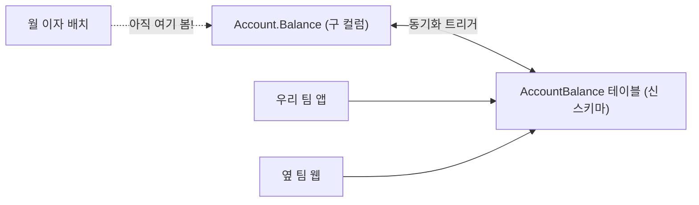
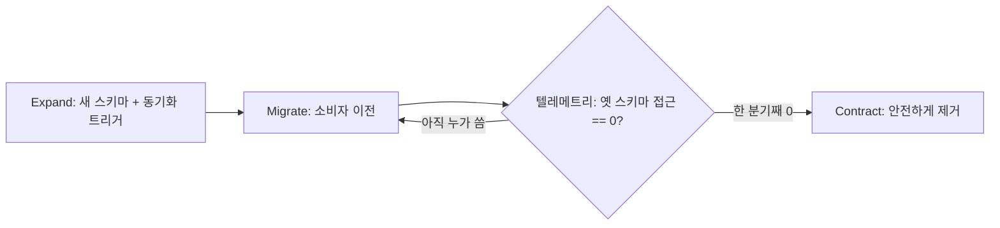

import { Callout, Steps, Step } from '@/components/writing-ui';

## 이게 뭔데

스키마를 안전하게 바꾸는 정석은 "한 번에 갈아엎기" 가 아니라 "옛것과 새것을 잠시 같이 두기" 다. `Customer.PhoneNumber` 컬럼을 별도 `PhoneNumber` 테이블로 빼냈다고 치자. 정상적인 팀은 옛 컬럼을 바로 지우지 않는다. 한동안 옛 컬럼과 새 테이블을 **둘 다 살려두고**, 트리거로 양쪽을 동기화하면서, 그 컬럼을 읽던 앱들이 전부 새 테이블로 이사할 때까지 기다린다. 이 "둘 다 살아 있는 기간" 이 바로 **전환 기간(transition period)** 이다.

여기서 질문이 하나 튀어나온다. **그래서 얼마나 기다려야 하는데?** 1주? 한 달? 1년? 너무 짧으면 아직 옛 컬럼 보고 있던 야간 배치가 어느 날 갑자기 깨진다. 너무 길면 트리거랑 중복 컬럼이 1년 넘게 DB에 둥둥 떠 있으면서 누구도 책임 안 지는 좀비 스키마가 된다. 이 편은 그 "얼마나" 를 어떻게 정하느냐에 대한 이야기다.

<Callout type="warning" title="한 줄 요약">
전환 기간은 "DB 만지는 사람" 이 아니라 "그 DB를 쓰는 가장 느린 앱" 의 일정에 맞춰진다. 그래서 기본은 길게(범주별로 미리 합의), 대신 만료 전이라도 아무도 안 쓰는 게 확인되면 즉시 제거한다. 그리고 "아무도 안 쓴다" 는 추측이 아니라 텔레메트리로 증명한다.
</Callout>

## 시나리오: 이런 적 있을 거임

은행 코어 DB. 너는 프로젝트 DBA고, `Account` 테이블에 박혀 있던 `Balance` 컬럼을 별도 `AccountBalance` 테이블로 분리하는 리팩토링을 한다. 멀쩡하게 했다. 트리거로 옛 컬럼과 새 테이블을 양방향 동기화하고, 너희 팀 앱은 다 새 테이블 보게 바꿨다. 회귀 테스트 초록불. 배포 완료. 끝.

3주 뒤, "이제 옛 컬럼 깔끔하게 지워야지" 하고 `Account.Balance` 를 DROP 한다. 또 한 번 회귀 테스트 초록불. 너희 팀 코드는 그 컬럼 안 보니까 당연히 멀쩡하다.

그리고 그날 밤.

```text
03:00  [batch-job: monthly-interest] FAILED
       ORA-00904: "BALANCE": invalid identifier
       at calc_interest.sql:42
```

월 1회 도는 **이자 계산 배치**가 죽었다. 이 배치는 분기에 한 번 정도만 손대는, 옆 팀이 5년 전에 짜둔 PL/SQL 덩어리였고, 아직도 `Account.Balance` 를 직접 읽고 있었다. 너희 팀 회귀 테스트엔 당연히 안 들어가 있다. 너는 그 배치의 존재조차 몰랐다. 그런데 `git blame` 을 찍으면 컬럼을 지운 건 3주 전의 너다.

뭐가 문제였냐면, 너는 **너희 팀 일정**으로 전환 기간을 잡았다. "우리 코드 다 바꿨고 3주 지났으니 됐지." 근데 그 컬럼은 너희 팀만 쓰는 게 아니었다. 전환 기간은 그 스키마를 만지는 **모든** 소비자 중 **가장 느리게 따라오는 놈**한테 맞춰져야 했다. 월 배치는 한 달에 한 번 돌아야 비로소 깨진 걸 안다. 3주는 그놈이 단 한 번도 안 돌아본 시간이었던 거다.



## 왜 이렇게 오래 걸리나

직관적으로는 "코드 다 바꿨으면 끝 아니냐" 싶다. 근데 실제로 전환 기간이 길어지는 이유는 따로 있다. 핵심은 **DB는 공유 자원**이라는 사실이다.

너희 회사 DB 하나에 매달려 있는 앱이 한두 개가 아니다. 자주 배포되는 메인 웹앱도 있지만, 분기에 한 번 손대는 정산 시스템, 1년에 한 번 도는 연말 결산 잡, 외주가 5년 전에 짜고 떠난 리포팅 도구, 누가 만들었는지 아무도 모르는 엑셀 매크로까지. 이 중 단 하나라도 옛 스키마를 보고 있으면, 옛 스키마는 못 지운다.

그래서 전환 기간은 **"모든 소비자가 새 스키마로 갈아탈 때까지 걸리는 시간"** 이고, 이건 결국 **"가장 굼뜬 소비자가 자기 다음 릴리스를 낼 때까지"** 다. 배포 주기가 1년인 앱이 끼어 있으면, 산술적으로 전환 기간의 하한이 1년 가까이로 밀린다. 이게 책이 "전환 기간이 수년일 수 있다" 고 말하는 이유다. 코드 고치는 데 며칠 걸려서가 아니라, **그 며칠짜리 수정이 운영에 반영되기까지 1년을 기다려야 하는 앱**이 존재해서다.

<Callout type="error" title="뭐가 문제냐면">
- **느린 소비자 한 명이 전체를 잡는다**: DB 하나에 앱 열 개가 붙어 있으면, 그중 가장 느린 한 개의 릴리스 주기가 전환 기간의 바닥을 결정한다.
- **모르는 소비자가 있다**: 문서에 안 적힌 배치·리포트·외부 연동이 옛 스키마를 보고 있을 수 있다. "우리가 아는 소비자" 와 "실제 소비자" 는 다르다.
- **좀비 스캐폴딩이 쌓인다**: 동기화 트리거와 중복 컬럼은 임시 구조물인데, 전환 기간이 흐지부지 길어지면 영구 구조물이 된다. 다음 리팩토링이 그 위에 또 트리거를 얹으면 트리거가 트리거를 부르는 지옥이 열린다.
</Callout>

## 그래서 얼마로 잡냐 — 범주별 공통 기간

리팩토링마다 "이건 며칠, 저건 몇 달" 일일이 협상하면 DBA가 협상만 하다 인생 끝난다. 책의 처방은 단순하다. **리팩토링을 범주로 묶고, 범주별로 공통 전환 기간을 미리 합의해서 일관되게 적용하라.**

예를 들어 이렇게 테이블 하나 박아두는 거다.

```text
구조 리팩토링 (컬럼 이름 변경, 테이블 분리, 컬럼 이동 등)     →  전환 기간 2년
아키텍처 리팩토링 (공유 SP 제거, 외부 인터페이스 변경 등)     →  전환 기간 3년
데이터 품질 리팩토링 (제약조건 추가, 룩업 테이블 도입 등)     →  케이스별
```

이러면 협상이 없다. "테이블 분리했어? 그럼 구조 리팩토링이니까 옛 스키마는 2년 뒤 만료." 모두가 같은 규칙을 알고, 각 팀은 "아 이건 2년 안에만 이사하면 되는구나" 하고 자기 일정을 짠다. 예측 가능성이 협상 비용을 이긴다.

<Callout type="info" title="왜 하필 2년/3년 같은 긴 숫자냐">
이 숫자가 큰 이유는 다시 "가장 느린 소비자" 때문이다. 1년에 한 번 배포하는 앱한테 "6개월 안에 이사해" 라고 하면 물리적으로 불가능하다. 그 앱의 다음 릴리스가 6개월 안에 없으니까. 그래서 공통 기간은 "조직에서 가장 느린 정상 배포 주기" 를 두어 번 품을 만큼 잡는 거다. 너희 조직이 전부 2주마다 배포하는 빠른 팀이면 이 숫자는 당연히 훨씬 짧아진다. 2년은 법칙이 아니라, 느린 레거시가 섞인 조직의 보수적 디폴트일 뿐이다.
</Callout>

이 방식의 단점도 분명하다. **자주 배포되는 소수 앱만 접근하는 스키마에도 가장 긴 기간(3년)이 통째로 적용된다는 것.** 그 스키마 보는 앱이 사실 매주 배포되는 우리 웹앱 하나뿐인데도, 규칙이 "아키텍처는 3년" 이면 3년을 기다려야 한다. 명백한 낭비다. 그래서 완화책이 두 개 붙는다.

## 완화책 1 — 만료 전이라도 적극 제거하라

전환 기간은 **상한이지 하한이 아니다.** "2년 뒤 만료" 는 "2년은 무조건 살려둬라" 가 아니라 "늦어도 2년 안엔 정리한다" 는 뜻이다. 그 전에 **아무도 안 쓰는 게 확인되면** 즉시 지워도 된다. 아니, 지우는 게 낫다. 안 쓰는 트리거랑 중복 컬럼을 만료일까지 굳이 끌고 갈 이유가 없다.

문제는 "아무도 안 쓴다" 를 어떻게 아느냐다. 2006년 책은 여기서 살짝 손을 든다 — 결국 사람한테 물어보거나 추측해야 했으니까. 그런데 지금은 이걸 **데이터로 증명**할 수 있다. 이게 이 편의 현대화 포인트다.

### 텔레메트리로 "안 쓴다" 를 증명하기

옛 스키마가 실제로 쓰이는지를 추측하지 말고 계측해라.

<Steps>
<Step title="옛 스키마 접근을 계측한다">
지우려는 대상이 컬럼/테이블이면 그걸 감싸는 뷰나 함수에 접근 카운터를 단다. 또는 DB 차원의 도구를 쓴다. PostgreSQL이면 `pg_stat_user_tables.seq_scan`/`idx_scan`, `pg_stat_statements` 로 특정 컬럼·테이블을 건드리는 쿼리가 도는지 본다. 옛 컬럼만 정조준하고 싶으면 더 이상 SELECT 대상이 아니어야 할 컬럼을 읽는 쿼리를 로그로 남기는 임시 트리거나 감사(audit) 정책을 건다.
</Step>
<Step title="충분히 긴 관찰 창을 둔다">
여기가 함정이다. 일주일 관찰하고 "접근 0이네, 안전!" 하고 지우면 위 시나리오의 월 배치한테 또 당한다. 관찰 창은 **가장 느린 소비자의 한 주기보다 길어야** 한다. 월 배치가 있으면 최소 한 달 + 여유, 분기 잡이 있으면 한 분기 + 여유. "그 컬럼을 읽을 가능성이 있는 모든 주기가 적어도 한 번씩 돌아본 시간" 을 확보해야 0이 진짜 0이다.
</Step>
<Step title="대기·확인 단계를 넣고 제거한다">
바로 DROP 하지 말고, 먼저 "지운 척" 만 한다. 컬럼이면 애플리케이션과 권한에서만 안 보이게 끊거나(가능하면) 이름을 `Balance_deprecated_20260601` 로 바꿔서 누가 쓰면 즉시 에러나게 만든다. 며칠~몇 주 더 지켜보고 아무 비명도 안 들리면 그때 진짜 DROP 한다. 되돌리기 쉬운 단계를 사이에 끼우는 거다.
</Step>
</Steps>

<Callout type="success" title="현대 deprecation policy로 묶기">
이건 API 마이그레이션의 expand-contract(parallel change) 패턴과 정확히 같은 구조다. **Expand**: 새 스키마를 만들고 트리거로 둘을 동기화한다(옛것과 새것 공존 = 전환 기간 시작). **Migrate**: 소비자들을 하나씩 새 스키마로 옮긴다. **Contract**: 텔레메트리로 옛 스키마 접근이 0임을 확인하고 만료일 안에 제거한다. 전환 기간은 곧 expand-contract의 가운데 단계 길이고, 텔레메트리는 contract를 언제 당겨도 되는지 알려주는 신호등이다.
</Callout>



## 완화책 2 — 짧게 협상하라

공통 기간이 과하게 느껴지는 특정 케이스에선 그냥 **협상으로 줄인다.** 이 스키마 보는 앱이 우리 둘뿐이고 둘 다 매주 배포하면, 3년 기다릴 이유가 없다. CCB(변경통제위원회)에 안건으로 올리거나 영향받는 팀과 직접 합의해서 "이건 2개월로 단축" 하고 못 박는 거다.

협상을 단순하게 유지하는 게 핵심이다. 리팩토링마다 전수 협상하면 완화책이 아니라 새로운 병목이 된다. 그래서 실무 규칙은 보통 이렇게 굴러간다.

- **기본값은 공통 기간**(예: 구조 2년). 별말 없으면 이게 적용된다.
- **줄이고 싶을 때만** 협상한다. 소비자가 적고 다 빠른, 명백한 케이스에 한해서.
- 협상 결과는 **만료일과 함께 문서/티켓에 박는다.** "구두로 줄이기로 함" 은 6개월 뒤 아무도 기억 못 한다.

<Callout type="note" title="공유 DB 자체를 줄이는 게 근본 처방">
전환 기간이 길어지는 근본 원인은 "DB 하나를 너무 많은 앱이 직접 들여다본다" 는 데 있다. 마이크로서비스에서 공유 DB를 안티패턴으로 보는 이유가 정확히 이거다 — 한 서비스가 자기 테이블을 리팩토링하려는데 옆 서비스 다섯 개가 그 테이블을 직접 SELECT 하고 있으면, 스키마 변경이 다섯 서비스의 합산 배포 주기에 인질로 잡힌다. 각 서비스가 자기 DB를 소유하고 바깥엔 API/이벤트로만 노출하면, 내부 스키마 리팩토링의 전환 기간은 그 서비스 안에서만 닫힌다. 외부로 나가는 인터페이스(API 버전·이벤트 스키마)만 별도의, 더 긴 전환 기간을 갖는다. 전환 기간을 짧게 만드는 가장 강력한 수단은 텔레메트리도 협상도 아니고, 애초에 **소비자 수를 줄이는 캡슐화**다.
</Callout>

## 빠른 팀이면 며칠짜리 전환 기간도 가능하다

위 숫자들(2년/3년)에 겁먹지 마라. 그건 느린 레거시가 섞인 조직의 보수적 디폴트다. 전부 CD(지속 배포)로 하루에도 여러 번 배포하고, DB 마이그레이션이 CI 파이프라인에 묶여 있고, 모든 소비자를 너희가 통제하는 환경이라면, 전환 기간은 **며칠 또는 몇 시간**으로도 충분하다. 같은 expand-contract를 이렇게 압축한다.

<Steps>
<Step title="Expand — 마이그레이션 도구로 비파괴 변경만">
Flyway/Liquibase(JVM), Alembic(Python), Prisma Migrate/TypeORM(Node), Rails 마이그레이션 — 도구는 뭐든, 이 배포엔 **추가만** 한다. 새 컬럼/테이블 만들고, 백필하고, 양쪽 동기화를 켠다. 기존 컬럼은 절대 안 건드린다. 그래야 구버전 앱과 신버전 앱이 같은 DB 위에서 동시에 멀쩡히 돈다(롤링 배포 중에는 항상 두 버전이 공존한다는 걸 잊지 마라).
</Step>
<Step title="Migrate — 코드를 새 스키마로 배포">
앱 코드를 새 스키마 읽게 바꿔서 배포한다. CD라 몇 시간 안에 모든 인스턴스가 새 코드로 갈린다. 소비자가 전부 너희 통제 하에 있으니, "굼뜬 외부 배치" 같은 변수가 없다.
</Step>
<Step title="Contract — 다음 마이그레이션에서 제거">
며칠 뒤, 텔레메트리로 옛 컬럼 접근 0을 확인하고 **별도의 마이그레이션**으로 옛 컬럼과 동기화 트리거를 DROP 한다. 제거를 같은 배포에 욱여넣지 말고 항상 다음 배포로 미루는 게 핵심이다 — 그래야 롤백 여지가 남는다.
</Step>
</Steps>

여기서 온라인 스키마 변경 도구가 빛난다. 큰 테이블에 인덱스를 추가하거나 컬럼을 바꿀 때 테이블을 잠그면 전환이고 뭐고 서비스가 멈춘다. PostgreSQL이면 `CREATE INDEX CONCURRENTLY`, 제약조건은 `ADD CONSTRAINT ... NOT VALID` 로 빠르게 추가하고 한가할 때 `VALIDATE CONSTRAINT` 로 검증. MySQL이면 `gh-ost`/`pt-online-schema-change` 로 무중단 변경. 이 도구들 덕에 "expand 단계가 서비스를 멈출까봐" 전환을 미루는 일이 없어진다.

<Callout type="warning" title="압축의 전제: 진짜로 모든 소비자를 통제하는가">
며칠짜리 전환 기간의 대전제는 "옛 스키마를 보는 모든 코드를 내가 안다" 는 것이다. 위 은행 시나리오의 월 배치처럼 **모르는 소비자가 단 하나라도 있으면** 며칠은 재앙이다. 그러니 압축하기 전에 텔레메트리로 "정말 우리가 아는 소비자가 전부인가" 를 먼저 확인해라. 관찰로 미지의 소비자가 없음을 증명하지 못하면, 며칠이 아니라 그 미지의 소비자가 한 번은 돌아볼 만큼 기간을 잡아야 한다.
</Callout>

## 정리

전환 기간 길이의 본질은 하나다. **그건 "DB 고치는 사람" 의 시간이 아니라 "그 DB를 쓰는 가장 느린 소비자" 의 시간이다.** 컬럼 지우는 SQL은 1초면 짠다. 그 1초를 안전하게 만드는 건 그 컬럼을 보던 마지막 한 명이 새 스키마로 이사를 마치는 순간이고, 그게 1년 걸리는 앱이라면 전환 기간도 거기에 맞춰진다.

그래서 운영은 이렇게 굴린다.

> **기본은 길게(범주별 공통 기간으로 예측 가능하게), 실제는 짧게(텔레메트리로 '안 쓴다'를 증명되는 즉시 제거).**

긴 디폴트는 가장 느린 소비자를 보호하기 위한 보험이고, 텔레메트리 기반 조기 제거는 그 보험료를 매번 다 낼 필요가 없게 해주는 환급이다. 추측으로 "이제 안 쓰겠지" 하고 지우면 새벽 3시에 배치가 죽고, 무서워서 안 지우면 좀비 트리거가 DB에 영원히 산다. 둘 다 피하는 길은 데이터로 묻는 것뿐이다 — **"지난 한 분기 동안 이거 누가 건드린 적 있어?"** 그 답이 진짜 0일 때, 비로소 만료일을 당겨도 된다.
