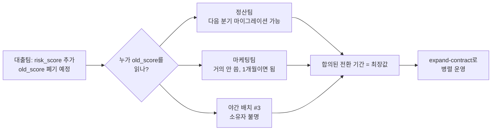

## 이게 뭔데

스키마를 바꾸는 데 기술은 사실 제일 쉬운 부분이다. `ALTER TABLE` 한 줄이면 끝나는 변경을, 일주일째 못 배포하고 있는 경험. 다들 한 번씩 있을 거다.

이유는 코드가 아니다. 사람이다. `Account` 테이블에 컬럼 하나 추가하려는데 그 테이블을 정산팀이 같이 쓰고 있고, 정산팀 위에는 운영 DBA가 있고, DBA는 "변경통제위원회(CCB) 회의에 올려라"라고 하고, 그 회의는 다음 주 수요일이다. 코드는 5분이면 짜는데 승인받는 데 9일이 걸린다.

이번 편은 그 9일에 관한 얘기다. **변경통제위원회를 어떻게 가볍게 만들지, 스키마를 공유하는 다른 팀과 어떻게 협상할지, 그리고 그 밑에 깔린 정치를 어떻게 다룰지.** 셋 다 SQL이 아니라 사람 문제고, 그래서 더 어렵다.

<Callout type="warning" title="한 줄 요약">
DB 리팩토링의 진짜 병목은 옵티마이저가 아니라 거버넌스다. CCB는 매일 굴리거나 "사후 번복 가능한 셀프 승인"으로 가볍게 만들고, 공유 스키마는 팀 간 협상으로 풀고, 정치는 무시하지 말고 작은 변경·롤백·테스트로 신뢰를 쌓아 이겨라.
</Callout>

## 시나리오: 수요일까지 못 기다리는 변경

상황을 깔아보자. 너는 대출 상품 팀이고, `Customer` 테이블에 `risk_score` 컬럼을 하나 더해야 한다. 신용 평가 모델이 새로 들어와서다. 변경 자체는 너무 쉽다.

```sql
ALTER TABLE Customer ADD COLUMN risk_score NUMERIC(5,2);
```

이걸 짜는 데 30초. 그런데 `Customer` 테이블은 너네 팀만 쓰는 게 아니다. 정산팀, 마케팅팀, 그리고 어디 있는지도 모르는 야간 배치 잡 셋이 같이 빨아먹는다. 그래서 운영 DBA로 구성된 CCB가 변경을 막고 서 있다. 룰은 이렇다.

- **주 1회, 수요일 오전에 회의.**
- 프로젝트 DBA가 변경 제안 목록을 들고 들어간다.
- 위원회가 허용 여부와 폐기(전환) 기간을 정한다.

표면적으로는 멀쩡한 프로세스다. 통제가 빡빡해 보이니까 경영진도 안심한다. 문제는 **개발이 그 속도에 맞춰 죽는다**는 거다. 화요일 오후에 컬럼이 필요하다는 걸 깨달으면? 다음 수요일까지 기다린다. 그동안 너는 원본 스키마를 감내하며 우회 코드를 짠다. 임시로 JSON 컬럼에 쑤셔 넣거나, 별도 사이드 테이블을 만들거나. 그 임시방편이 결국 운영에 박혀서 아무도 안 치우는 게 진짜 비극이고.

<Callout type="error" title="뭐가 문제냐면">
- **결정은 몇 시간이면 나는데, 회의 주기가 주 단위다.** 실제 판단 시간이 아니라 "다음 슬롯까지의 대기"가 병목이다.
- **막힌 개발자는 우회한다.** 정식 경로가 느리면 사람들은 샛길을 판다. 그 순간 CCB의 "엄격한 통제"는 종이호랑이가 된다. 통제하는 척만 하고, 실제 스키마는 통제 밖에서 굴러간다.
- **통제의 인상 vs 통제의 실체.** CCB가 주는 건 종종 "우리가 관리하고 있다"는 안심뿐이고, 개발 팀이 우회하는 순간 그 안심마저 거짓이 된다.
</Callout>

Scott Ambler가 책에서 솔직하게 짚는 게 이거다. CCB의 장점이라고 적힌 "더 엄격한 통제의 인상"에 굳이 **"인상(impression)"**이라는 단어를 붙인 이유. 개발 팀이 우회하면 그건 인상일 뿐 실체가 아니다.

## CCB를 단순화하는 두 갈래

그럼 CCB를 없애면 되나? 아니다. 공유 스키마에 진짜로 위원회가 필요한 조직이 있다. 없애는 게 아니라 **빠르게** 만드는 거다. 방법은 둘이다.

<Steps>
<Step title="프로젝트 DBA에게 변경 권한을 주되, CCB가 나중에 뒤집을 수 있게">
승인을 앞단에서 막지 말고 뒷단에서 검토한다. 프로젝트 DBA가 일단 변경을 적용하고, CCB는 사후에 "이건 곤란하니 되돌려라"라고 할 권한을 가진다. 대부분의 변경은 무탈하게 지나가고, 위원회는 진짜 위험한 소수만 사후에 잡는다. 개발은 안 멈춘다.
</Step>
<Step title="CCB가 매일 회의하게">
주 1회를 매일 15분으로 바꾼다. 화요일에 필요한 변경이 수요일 아침이면 결론 난다. 회의 자체를 가볍게(스탠드업처럼) 만들면 매일 해도 부담이 적다. 핵심은 "결정에 걸리는 시간"을 "다음 슬롯까지의 대기"에서 떼어내는 거다.
</Step>
</Steps>

눈치챘겠지만 둘 다 한 방향을 가리킨다. **앞단의 게이트를 뒷단의 검토로, 주기를 짧게.** 이게 2006년 책의 통찰인데, 놀랍게도 우리는 이걸 이미 매일 쓰고 있다. 이름만 다르다.

## 현대판 CCB는 PR 리뷰다

오늘날 "프로젝트 DBA에게 권한을 주되 나중에 뒤집을 수 있게"의 정확한 구현체가 뭔지 아는가. **Pull Request 리뷰**다.

마이그레이션 파일을 짜서 PR을 올린다. 리뷰어(DBA든 시니어든)가 본다. 승인되면 머지되고, CI가 스테이징에 적용해보고 깨지면 막는다. 이게 경량 CCB다. 비동기라 "수요일 회의"를 기다릴 필요 없고, 기록이 git에 남으니 누가 뭘 왜 바꿨는지 추적되고, 머지 전에 자동 테스트가 1차 게이트를 선다.

```text
[기존 CCB]                          [현대 경량 CCB = PR 리뷰]
주 1회 회의 ─── 대기 9일       │   PR 올림 ─── 리뷰 ─── 머지 (몇 시간)
구두 승인 ─── 기록 안 남음     │   git 히스토리에 영구 기록
사람이 위험 판단 ─── 느림      │   CI가 테스트 1차 게이트
```

마이그레이션 도구(Flyway, Liquibase, Alembic, Rails/Django ORM 마이그레이션)가 변경을 **버전 관리되는 코드 파일**로 만들어준 덕이다. `Customer`에 컬럼 추가는 더 이상 회의록 속 결정이 아니라, `V37__add_risk_score.sql` 같은 파일이고, 그 파일은 PR로 리뷰되고 git에 박힌다. 책의 "DB 자산을 애플리케이션과 같은 저장소에 두라"가 바로 이걸 가능하게 한 전제다.

<Callout type="info" title="RFC: 큰 변경엔 의사결정 문서를">
모든 게 PR로 끝나는 건 아니다. 테이블을 통째로 쪼개거나, 공유 컬럼의 의미를 바꾸거나, 마이크로서비스 경계를 넘는 변경이라면 코드 리뷰가 너무 늦은 단계다. 이럴 땐 RFC(Request for Comments) 문서를 먼저 돌린다. "이런 변경을 왜, 어떻게, 누구에게 영향이 가는지"를 글로 적어 관련 팀에 회람하고 코멘트를 받는다. 이게 "회의로서의 CCB"를 "문서로서의 비동기 CCB"로 바꾼 거다. 결정은 비동기로 나고, 맥락은 영구히 남는다.
</Callout>

## 다른 팀과 협상하기

CCB가 "허용 여부"를 정하는 기구라면, 그 옆엔 항상 **전환 기간 협상**이 있다. `Customer` 컬럼 하나를 deprecate하려는데, 그 컬럼을 읽는 팀이 셋이면 그 셋이 언제까지 떠날 수 있는지를 정해야 한다.

책이 주는 대안은 이거다. 모든 변경에 똑같은 다년(예: 구조적 2년) 기간을 일괄 적용하는 대신, **영향받는 시스템 소유자와 개별로 협상**한다. 리팩토링 하나마다 한 번 협상하거나, 정기 협상 회의에서 일괄로.



장점은 명확하다. **모두에게 변경을 알리게 되고, 가장 정확한 전환 기간을 얻는다.** 마케팅팀이 한 달이면 충분한데 일괄 정책 때문에 2년을 기다리는 낭비가 사라진다.

단점도 명확하다. **느리고 고되다.** 책의 저자조차 "이게 실제로 시도된 걸 본 적 없다"고 솔직히 적는다. 그래서 책의 조언은 "굳이 한다면 최대한 단순하게"다.

<Callout type="warning" title="협상보다 먼저 — 공유 DB를 의심하라">
세 팀이 `Customer` 한 테이블을 직접 읽는다는 것 자체가 사실 안티패턴이다. 마이크로서비스의 "공유 데이터베이스" 안티패턴. 협상이 고통스러운 근본 원인은 스키마가 여러 팀의 공유 자산이라는 데 있다. 그래서 현대적 해법은 협상을 잘하는 게 아니라, **협상할 필요가 없게 만드는 것**이다. 각 서비스가 자기 데이터를 소유하고, 다른 팀은 직접 테이블을 읽는 대신 API로 받거나, CDC(Debezium 등)·outbox 패턴으로 변경 이벤트를 구독한다. 그러면 내 스키마는 내 마음대로 바꿀 수 있고, 계약(contract)은 테이블이 아니라 이벤트/API 스펙이 된다. 협상의 단위가 "물리 컬럼"에서 "공개 계약"으로 올라가는 거다.
</Callout>

협상이 불가피한 경우(레거시 공유 DB라 당장 못 쪼갬), 그 협상을 견디게 해주는 기술이 **expand-contract(parallel change)**다. 옛 컬럼과 새 컬럼을 동시에 살려두고, 양쪽을 동기화한 채로 각 팀이 자기 속도로 새 컬럼으로 옮겨가게 한다. 협상으로 정한 전환 기간 동안 둘 다 동작하니, 누구도 "내일까지 고쳐"라는 압박을 받지 않는다. 협상이 **정치**라면 expand-contract는 그 정치를 **기술적으로 받쳐주는 안전망**이다.

```sql
-- expand: 새 컬럼 추가, 옛 컬럼 유지. 양쪽 다 산다.
ALTER TABLE Customer ADD COLUMN risk_score NUMERIC(5,2);

-- 전환 기간 동안 동기화 (트리거 또는 앱 이중 쓰기).
-- 각 팀은 합의된 기한 안에 risk_score로 갈아탄다.

-- contract: 모두가 떠난 게 확인되면 그때 옛 컬럼 제거.
ALTER TABLE Customer DROP COLUMN old_risk_score;
```

## 그리고, 정치를 무시하지 마라

여기까지가 절차다. 그런데 책의 5장에서 제일 인간적인 문장은 절차가 아니라 이거다.

> IT 전문가들은 정치를 무시하고 자신은 그 위에 있다고 순진하게 믿지만, 그러면 위험하다.

엔지니어들이 제일 잘 빠지는 함정이다. "나는 기술로 말한다, 정치 같은 거 안 한다." 멋있어 보이지만 순진하다. 진화적 DB 기법을 조직에 들이는 건 조직의 중대한 변화고, *Fearless Change*(Manns & Rising)가 짚듯 변화엔 항상 정치가 따라붙는다.

왜 따라붙냐면, 이 기법들이 **사람들의 일하는 방식을 강제로 바꾸기** 때문이다. 특히 전통적 데이터 전문가, 그러니까 "스키마는 신성불가침이고 변경은 분기에 한 번 신중히"가 몸에 밴 DBA에게, "우리는 매일 마이그레이션을 PR로 올려서 머지합니다"는 위협이다. 자기 통제권이 줄어드는 것처럼 느껴지고, 솔직히 그렇게 느끼는 게 당연하다. 그 두려움을 "구식이라서 그래"라고 무시하는 순간, 너는 가장 강력한 게이트키퍼를 적으로 돌린다.

<Callout type="note" title="정치는 더러운 게 아니라, 신뢰의 다른 이름이다">
"정치 게임을 한다"는 게 뒤에서 음모를 꾸미라는 게 아니다. 두려워하는 사람의 두려움을 인정하고, 그가 안심할 근거를 만들어주는 일이다. 기술적 우월함을 들이대는 게 아니라, "당신이 걱정하는 그 사고, 안 나게 해뒀다"를 보여주는 일. 그게 진화적 DB 도입의 절반이다.
</Callout>

## 신뢰는 작은 변경으로 쌓인다

그래서 정치를 이기는 방법은 논쟁이 아니다. **증거**다. 그리고 증거는 작은 데서 나온다.

DBA가 두려워하는 건 "큰 변경이 운영을 깬다"는 시나리오다. 그러면 정확히 그 반대를 반복해서 보여주면 된다.

<Steps>
<Step title="변경을 작게 쪼갠다">
한 PR에 컬럼 추가 하나, 인덱스 하나. `risk_score` 추가와 `old_score` 제거를 한 번에 하지 않는다. 작은 변경은 리뷰가 쉽고, 깨져도 영향 범위가 좁고, 무엇보다 덜 무섭다. 무서움이 줄면 승인이 빨라진다.
</Step>
<Step title="롤백을 항상 준비한다">
모든 마이그레이션에 되돌리는 경로를 함께 둔다. Flyway의 undo, Rails의 `down`, 혹은 expand-contract라 애초에 contract 전까진 옛것이 살아 있어 언제든 멈출 수 있는 구조. "되돌릴 수 있다"는 사실 자체가 게이트키퍼의 두려움을 절반으로 줄인다.
</Step>
<Step title="테스트로 증명한다">
변경마다 CI가 스키마를 새로 세우고, 마이그레이션을 적용하고, 회귀 테스트를 돌린다. "이 변경이 기존 동작을 안 깬다"가 사람의 자신감이 아니라 초록색 체크로 증명된다. DBA에게 보여줄 게 의견이 아니라 결과가 된다.
</Step>
<Step title="온라인 스키마 변경으로 운영 무중단을 보장한다">
"인덱스 걸면 테이블 잠겨서 장애 난다"는 고전적 공포엔 기술로 답한다. PostgreSQL이면 `CREATE INDEX CONCURRENTLY`, 제약은 `NOT VALID`로 걸고 한가할 때 `VALIDATE CONSTRAINT`. MySQL이면 gh-ost나 pt-online-schema-change. "운영 중에 잠금 없이 바꿨다"를 한 번 보여주면, 그다음 변경은 훨씬 수월해진다.
</Step>
</Steps>

이 네 개가 한 분기쯤 무사고로 돌면, 회의실 분위기가 바뀐다. 처음엔 "또 스키마 바꾼다고?"였던 DBA가, 어느 순간 "이번 건 PR 어디 있어요? 롤백은 있죠?"로 바뀐다. 그가 게이트키퍼에서 협력자가 되는 순간이다. 그걸 만든 건 멋진 발표나 논리적 설득이 아니라, **40번쯤 반복된 작고 안전한 변경의 누적**이다.

<Callout type="success" title="정리하면 이런 선순환">
작은 변경 → 리뷰·롤백·테스트로 안전 입증 → 무사고 누적 → DBA의 신뢰 → 게이트가 가벼워짐(매일 회의/셀프 승인+사후 검토) → 변경이 더 빨라짐 → 더 작게 더 자주. 정치는 이 루프를 한 바퀴 돌릴 때마다 알아서 풀린다.
</Callout>

## 정리

스키마 변경의 병목은 거의 늘 기술 밖에 있다. `ALTER TABLE`은 30초고, 승인은 9일이다.

> **CCB는 게이트가 아니라 신뢰의 속도다. 신뢰가 빠르면 게이트도 가벼워진다.**

세 가지를 기억하자. 첫째, **CCB는 없애지 말고 가볍게** 한다. 앞단의 회의 승인을 뒷단의 검토로 바꾸고, 주기를 짧게. 그 현대적 구현체가 PR 리뷰와 RFC다. 둘째, **공유 스키마는 협상하되, 더 좋은 건 협상이 필요 없게 만드는 것**이다. 직접 테이블 공유를 API·이벤트 계약으로 끌어올리고, 불가피한 전환은 expand-contract로 받친다. 셋째, **정치를 무시하지 마라.** 게이트키퍼의 두려움은 정당하고, 그 두려움은 논쟁이 아니라 작은 변경·롤백·테스트의 반복된 증거로만 녹는다.

기술은 배우면 되는데, 신뢰는 쌓아야 한다. 그리고 신뢰는 거창한 한 방이 아니라, 무사고로 머지된 작은 PR 마흔 개가 만든다. DB 리팩토링이 어려운 진짜 이유, 그리고 그걸 푸는 진짜 방법이 둘 다 거기 있다.
