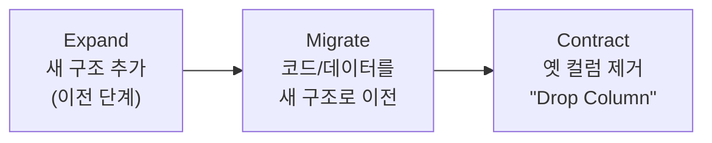

import { Callout, Steps, Step, Tabs, TabsList, TabsTrigger, TabsContent, Icon } from '@/components/writing-ui';

## 이게 뭔데

Drop Column. 이름 그대로다. **테이블에서 컬럼 하나를 제거**하는 리팩토링이다.

```sql
ALTER TABLE Customer DROP COLUMN FavoriteColor;
```

이게 끝이다. 한 줄짜리 DDL. 카탈로그에서 제일 짧게 끝날 것 같은 항목이고, 실제로 잘 풀리면 정말 한 줄이다.

근데 비유를 하나 들어보자. 옷장 정리할 때 "이거 1년 동안 한 번도 안 입었네, 버리자" 하고 버린 옷이, 다음 주에 갑자기 입어야 할 일이 생긴 적 있을 거다. 컬럼 삭제가 딱 그렇다. **버리는 행위 자체는 쉽다. 어려운 건 "정말 아무도 안 입는 옷이 맞나"를 확신하는 일**이다. 그리고 DB의 옷장에선, 옷 하나 잘못 버리면 운영에서 `NullPointerException`이 슬랙으로 날아온다.

<Callout type="info" title="한 줄 요약">
Drop Column은 DDL 한 줄이지만, 진짜 일은 "이 컬럼을 아무도 안 읽고 안 쓴다"를 증명하는 단계에 있다. 삭제는 마지막에 누르는 버튼일 뿐이다.
</Callout>

은행 도메인으로 가자. 이 시리즈가 줄곧 써온 `Customer` 테이블이 있다. 고객 정보 테이블인데, 언젠가 마케팅팀이 "고객 좋아하는 색 받아서 카드 디자인 추천하자"는 기획을 밀어서 `FavoriteColor` 컬럼이 추가됐다. 기획은 한 분기 만에 엎어졌고, 그 컬럼은 그 후로 2년째 아무도 안 건드린 채 `Customer` 테이블 한구석에 박혀 있다. 이걸 지우는 게 오늘의 일이다.

## 언제 쓰나

컬럼을 지우고 싶어지는 상황은 대체로 셋 중 하나다.

**첫째, 그냥 안 쓴다.** 위의 `FavoriteColor`처럼 기획이 엎어졌거나, 기능이 사라졌거나, 데이터가 다른 곳으로 옮겨갔는데 원본만 좀비처럼 남은 경우. DB 냄새로 치면 **"NULL만 가득하거나, 항상 같은 기본값만 들어가는 컬럼"**이 전형적인 신호다.

**둘째, Move Column의 마지막 단계다.** 컬럼을 다른 테이블로 옮기는 리팩토링(Move Column)은 결국 "새 위치에 컬럼을 만들고 → 데이터를 복사하고 → 양쪽을 한동안 동기화하고 → **원래 자리의 컬럼을 지우는**" 흐름이다. 그 마지막 "지우는" 동작이 바로 Drop Column이다. 그래서 Drop Column은 독립적으로도 쓰이지만, 더 큰 리팩토링의 **마무리 청소** 역할로 더 자주 등장한다.

**셋째 — 그리고 이게 제일 중요한데 — 실수로 다시 쓰이기 전에 미리 치우려고.** 미사용 컬럼을 그냥 두면 무슨 일이 생기냐면, 어느 날 신규 입사자가 테이블을 보고 "오 `FavoriteColor` 컬럼 있네? 이거 쓰면 되겠다" 하고 새 기능에서 갖다 쓴다. 정의도 모르고, 데이터 품질도 모르고, 2년 전 엎어진 기획의 잔재라는 것도 모른 채로. 그 순간 "안 쓰는 컬럼"이 "쓰는 컬럼"으로 부활하고, 지울 기회는 영영 날아간다.

<Callout type="note" title="미사용 컬럼은 빨리 치우는 게 이득">
원본 책이 강조하는 포인트가 이거다. 안 쓰는 컬럼은 **누군가 실수로 쓰기 시작하기 전에 제거**하는 게 낫다. 코드에서 dead code를 방치하면 언젠가 누가 호출하듯이, DB의 dead column도 방치하면 언젠가 누가 SELECT한다.
</Callout>

### 시나리오: 이런 적 있을 거임

`Customer` 테이블을 정리하다가 `FavoriteColor`를 발견한다. 깃 블레임을 찍어보니 2년 전. 코드베이스를 `grep FavoriteColor` 해보니 안 나온다. "오케이, 아무 데서도 안 쓰네. 지우자." 하고 `DROP COLUMN`을 날린다. 배포. 평화.

그런데 사흘 뒤, 야간 배치 하나가 죽는다. 로그를 까보니 매주 일요일 새벽에만 도는 **레거시 정산 스크립트**가, 하필 `SELECT *`로 `Customer` 전체를 긁은 다음 컬럼 **위치(인덱스)로** 값을 꺼내 쓰고 있었다. `row[14]`가 원래 `FavoriteColor`였는데, 컬럼을 지우니 `row[14]`가 그 뒤 컬럼인 `CreditScore`로 밀려버렸다. 정산 스크립트가 신용점수를 색깔로 알고 처리하다가 터진 거다.

`grep`엔 안 걸렸다. 그 스크립트는 컬럼명을 코드에 안 적었으니까. **위치로 읽었으니까.** 이게 Drop Column이 깔아놓는 가장 음흉한 함정이다.

## 주의할 점

<Callout type="warning" title="컬럼을 지우기 전에 반드시 의심할 것 3가지">
**1. SELECT \* + 위치 기반 참조.** 컬럼을 지우면 그 뒤 컬럼들의 순서 인덱스가 한 칸씩 당겨진다. `row[14]`로 값을 읽던 코드는 조용히 **다른 컬럼**을 읽게 된다. 에러도 안 나고 그냥 틀린 값을 쓴다. 컬럼명으로 `grep`해도 안 잡힌다.

**2. 데이터가 진짜 가치 없는지.** 지우는 순간 그 컬럼의 데이터는 사라진다. "안 쓰는 줄 알았는데 감사·규제·분석용으로 쓸 일이 있던" 경우가 있다. 백업이나 아카이브 테이블로 보존이 필요할 수 있다.

**3. 대용량 테이블의 잠금.** 수천만 행짜리 테이블에서 `DROP COLUMN`은 DB·엔진에 따라 테이블을 통째로 재작성(rewrite)하며 오래 락을 잡는다. 그동안 그 테이블은 갱신 불가 상태가 되고, 운영 트래픽이 줄줄이 막힌다.
</Callout>

여기에 하나 더. 지우려는 컬럼이 **PK의 일부**거나 다른 테이블에서 **FK로 참조**되고 있으면, 그 제약부터 풀어야 한다. `Customer.CustomerID`를 무심코 지우려다 `Account`, `Policy` 테이블의 FK가 줄줄이 깨지는 식이다. PK·FK가 얽힌 컬럼은 Drop Column 단독으로 끝나지 않고, 보통 Drop Foreign Key 같은 선행 리팩토링이 붙는다.

## 이렇게 한다

순서를 잡아보자. "지운다"는 결과는 같아도, 그 앞에 깔리는 안전장치가 본체다.

<Steps>
<Step title="진짜 안 쓰는지 증명한다 (현대화의 핵심)">
책이 2006년에 쓰일 땐 "코드 다 뒤져서 SELECT 문 찾아라"가 최선이었다. 지금은 더 나은 무기가 있다.

- **쿼리 로그 / 통계로 사용량 확인.** PostgreSQL이면 `pg_stat_statements`에 쌓인 쿼리 텍스트를 뒤져 해당 컬럼이 등장하는 쿼리가 있는지 본다. MySQL이면 general log나 Performance Schema, 또는 ProxySQL 같은 중간 계층의 쿼리 로그를 기간을 두고 수집한다.
- **컬럼 접근 자체를 관찰.** 정 불안하면 운영에서 그 컬럼을 읽을 때 흔적을 남기게 만들어 한 사이클(월간 배치까지 도는 충분한 기간) 동안 0건인지 확인한다.
- **`grep`은 보조 수단.** 코드 전수 검색은 컬럼명으로 명시 참조하는 코드만 잡는다. 위 시나리오의 위치 기반 코드는 못 잡으니, 쿼리 로그 관찰과 병행해야 한다.

핵심은 **"기억"이 아니라 "관측"으로 판단하는 것**이다. "내가 알기론 안 써요"는 증거가 아니다.
</Step>

<Step title="필요하면 데이터를 보존한다">
지우기 전에 데이터를 살려둬야 한다면, PK와 대상 컬럼만 아카이브 테이블로 떠놓는다.

```sql
-- FavoriteColor를 지우기 전에, CustomerID와 함께 따로 보존
CREATE TABLE CustomerFavoriteColor AS
SELECT CustomerID, FavoriteColor
FROM Customer
WHERE FavoriteColor IS NOT NULL;
```

PK(`CustomerID`)를 같이 담는 게 포인트다. 나중에 "어떤 고객의 무슨 색이었는지" 복원하거나 조인할 수 있어야 하니까. 규제·감사 때문에 통째로 남겨야 하면 전체 백업 스냅샷으로 처리한다.
</Step>

<Step title="대용량이면 잠금 전략을 고른다">
작은 테이블이면 그냥 `DROP COLUMN` 한 줄로 끝난다. 문제는 대용량이다.

- **Oracle `SET UNUSED`.** 실제 삭제는 무겁고 락이 길다. `SET UNUSED`는 컬럼을 **논리적으로 즉시 숨기는** 연산이라 거의 순식간이다. 앱과 쿼리에선 컬럼이 사라진 것처럼 보이고, 물리적 제거는 한가한 다운타임에 `DROP UNUSED COLUMNS`로 따로 처리한다. "보이게는 지금 지우고, 디스크는 나중에 정리"하는 2단 분리다.

```sql
-- 1) 지금: 즉시 숨김 (락 거의 없음)
ALTER TABLE Customer SET UNUSED (FavoriteColor);

-- 2) 나중에 (다운타임): 실제 물리 제거
ALTER TABLE Customer DROP UNUSED COLUMNS;
```

- **PostgreSQL.** `DROP COLUMN`은 보통 빠르다 — 메타데이터만 바꾸고 컬럼을 "죽은 것"으로 표시할 뿐, 디스크 공간은 이후 `VACUUM`/재작성 때 회수한다. 다만 `ACCESS EXCLUSIVE` 락을 짧게라도 잡으므로, `lock_timeout`을 짧게 걸어 운영 트래픽을 오래 막지 않게 하고, 막히면 재시도하는 패턴을 쓴다.
- **MySQL/온라인 스키마 변경.** 엔진·버전에 따라 `DROP COLUMN`이 테이블 재작성을 유발할 수 있다. 그럴 땐 `gh-ost`나 `pt-online-schema-change` 같은 온라인 스키마 변경 도구로 그림자 테이블에 변경을 적용하고 트래픽을 끊지 않은 채 스왑한다.
- 어느 쪽이든, 정통 처방은 여전히 유효하다: **사용량 적은 시간대에 수행**.
</Step>

<Step title="접근 프로그램을 정리한다">
컬럼이 사라지면 그걸 만지던 코드도 같이 정리해야 한다.

- **`SELECT *`를 명시 컬럼 목록으로 바꾼다.** 이게 위치 기반 함정을 근본적으로 막는 길이다.
- **`INSERT`/`UPDATE`에서 그 컬럼에 가짜 값(placeholder)을 넣던 코드를 제거**한다.
- 그 컬럼을 읽던 화면·리포트는 **대체 데이터 소스로 재배선**하거나, 정말 안 쓰면 표시 자체를 들어낸다.

before/after로 보면:

```sql
-- Before: SELECT * — 컬럼 순서에 코드가 묶임
SELECT * FROM Customer WHERE CustomerID = 42;

-- After: 필요한 컬럼만 명시 — DROP COLUMN에 안전
SELECT CustomerID, FullName, CreditScore
FROM Customer WHERE CustomerID = 42;
```

```typescript
// Before: INSERT에 안 쓰는 컬럼까지 가짜 값으로 채움
await db.insert('Customer', {
  customerId,
  fullName,
  favoriteColor: 'N/A',   // 의미 없는 placeholder
  creditScore,
});

// After: 죽은 컬럼 관련 코드 삭제
await db.insert('Customer', {
  customerId,
  fullName,
  creditScore,
});
```
</Step>

<Step title="지운다">
모든 안전장치가 끝났으면, 마지막에 버튼을 누른다.

```sql
ALTER TABLE Customer DROP COLUMN FavoriteColor;
```

이걸 손으로 운영에 날리지 말고 **마이그레이션 도구의 버전 관리된 변경**으로 넣는다. Flyway면 `V27__drop_customer_favorite_color.sql`, Liquibase면 `dropColumn` changeSet, Alembic이면 `op.drop_column('Customer', 'FavoriteColor')`. 이렇게 하면 변경이 코드 리뷰를 거치고, 적용 이력이 남고, 어떤 환경에 적용됐는지 추적된다.
</Step>
</Steps>

### expand-contract의 contract 단계로 보기

Drop Column을 현대적으로 가장 잘 설명하는 프레임이 **expand-contract(parallel change)**다. 스키마를 안전하게 바꾸는 3박자 패턴인데, Drop Column은 그중 마지막 박자다.



요지는 이렇다. **읽는 쪽(코드)을 먼저 떼어낸 다음, 마지막에 컬럼을 지운다.** 컬럼을 먼저 지우고 코드를 고치는 게 아니라, 코드가 그 컬럼을 안 읽게 만든 걸 확인한 뒤에 지운다. 위 단계의 4번(접근 프로그램 정리)이 5번(삭제)보다 앞에 오는 게 우연이 아닌 이유다.

<Callout type="success" title="contract는 서두르지 않는다">
expand-contract에서 contract 단계는 **충분히 기다린 뒤에** 하는 게 정석이다. 새 코드가 모든 인스턴스에 배포 완료됐고, 롤백 가능성이 지나갔고, 옛 컬럼을 읽는 트래픽이 관측상 0이 된 걸 확인한 다음에 지운다. 다중 애플리케이션 환경(여러 서비스·배치·협력사가 같은 DB를 공유)이라면 더더욱, "전환 기간(transition period)"과 명시적인 drop 날짜를 정하고 외부 프로그램이 적응할 시간을 줘야 한다. 급하게 지워서 좋을 게 하나도 없다.
</Callout>

마이크로서비스라면 한 발 더 나간다. 그 컬럼이 진짜 한 서비스 소유 데이터라면, 다른 서비스가 DB를 직접 들여다보는 게 아니라 API/이벤트로만 접근하게 만들어 두면, 컬럼 삭제는 **그 서비스 내부 변경**으로 격리된다. 데이터 소유권이 명확할수록 Drop Column이 무서울 일이 줄어든다.

## 정리

Drop Column은 카탈로그에서 제일 단순해 보이는 리팩토링이고, 실제 DDL은 한 줄이다.

> **컬럼 삭제의 난이도는 "지우는 법"이 아니라 "안 쓴다는 걸 증명하는 법"에 있다.**

- 안 쓰는 컬럼은 누가 실수로 다시 쓰기 전에 **미리** 치우는 게 이득이다.
- 지우기 전에 **관측으로** 사용량 0을 증명하라. `grep`은 위치 기반 코드를 못 잡으니 쿼리 로그·통계와 병행한다.
- `SELECT *` + 위치 기반 참조는 컬럼이 밀리면서 **조용히 틀린 값을 읽는다**. 명시 컬럼 목록으로 바꿔라.
- 대용량은 `SET UNUSED`나 온라인 스키마 변경 도구로 락을 피하고, 한가한 시간대에 한다.
- expand-contract의 **contract 단계**로 다뤄라. 코드를 먼저 떼어내고, 충분히 기다린 뒤, 마지막에 버전 관리된 마이그레이션으로 지운다.

옷장에서 옷 버리는 일과 똑같다. 버리는 건 1초지만, 정말 안 입는 옷이 맞는지 확인하는 데 시간을 써야 다음 주에 후회하지 않는다.
