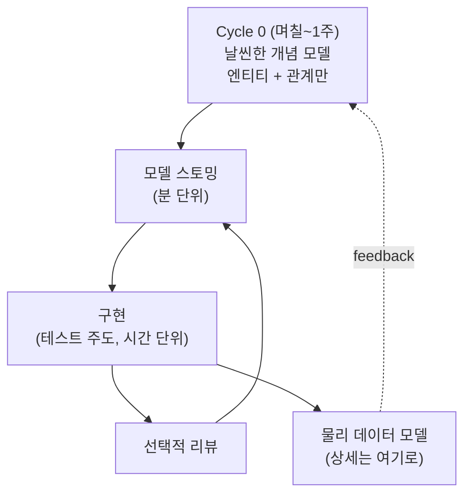

## 이게 뭔데

진화적 데이터 모델링. 한 줄로 줄이면 이렇다. **데이터 모델을 프로젝트 시작할 때 완성하려고 들지 말고, 큰 그림만 먼저 그린 다음 나머지는 필요해질 때마다 키워라.**

이게 무슨 신박한 헛소리냐 싶을 거다. 우리가 학교에서, 신입 때 사수한테서, 그 두꺼운 DB 교과서에서 배운 건 정반대니까. "스키마는 처음에 제대로 설계해야 한다. 한 번 깔린 테이블은 못 바꾼다. 그러니 ERD를 끝까지 그려놓고 시작해라." 다들 이렇게 배웠다.

그런데 30년 치 현장 데이터가 말하는 건 다르다. 처음에 다 그린 ERD는 6개월 뒤에 보면 거의 다 틀려 있다. 비즈니스가 그새 바뀌었고, 우리가 도메인을 그때 다 이해하지도 못했고, 기획이 또 갈아엎었기 때문이다. 그래서 책의 저자 Scott Ambler와 Pramod Sadalage는 이렇게 말한다. **앞에서 다 그리려고 애쓰지 말고, 모델을 코드처럼 진화시켜라.**

<Callout type="info" title="한 줄 요약">
빅 디자인 업 프론트(BDUF)는 미래를 다 안다는 가정 위에 서 있다. 그 가정이 거의 항상 틀리기 때문에, 큰 그림만 먼저 잡고(AMDD) 세부는 필요할 때 채우는(JIT) 게 결국 더 싸게 먹힌다.
</Callout>

## "앞에서 제대로 만들면 되잖아?"

이 글의 모든 반박은 사실 이 한 문장을 향한다. 누군가는 분명 이렇게 말한다.

> "리팩토링이 필요한 건 처음에 대충 만들었기 때문 아님? 처음부터 모델링 제대로 해놓으면 나중에 바꿀 일도 없잖아."

논리적으로는 흠잡을 데가 없어 보인다. 문제는 이게 **현실에서 단 한 번도 제대로 작동한 적이 없다**는 거다. 저자는 30년 경험을 근거로 못을 박는다. 전통적인 "앞에서 다 모델링" 방식은 IT 업계 전반에서 잘 작동하지 않았다고.

왜 안 됐을까. 가정이 틀렸기 때문이다. BDUF는 이런 전제 위에 서 있다.

- 우리가 **지금** 도메인을 충분히 이해하고 있다.
- 비즈니스 요구사항이 프로젝트 끝까지 **안 바뀐다**.
- 우리가 **미래에 필요할 모든 것**을 지금 예측할 수 있다.

셋 다 거짓이다. 은행 시스템을 짓는다고 치자. Cycle 0에 `Customer`, `Account`, `Balance`, `Policy`, `Insurance` 테이블을 그려놓고 "완벽하다" 했는데, 3개월 뒤 기획에서 "고객 한 명이 계좌를 공동명의로 여러 개 가질 수 있어야 한다"가 떨어진다. 6개월 뒤엔 "법인 고객도 받아야 한다", 9개월 뒤엔 "외화 계좌", 1년 뒤엔 "마이너스 통장 한도 관리". 처음 ERD엔 이 중 단 하나도 없었다.

비즈니스 고객은 점점 **더 빠른 속도로** 새 기능과 변경을 요구한다. 이 속도를 미리 다 받아내는 모델은 존재할 수 없다. 그러니 "처음에 제대로"는 달성 가능한 목표가 아니라, 달성했다고 **착각**하는 순간 가장 위험한 함정이다.

<Callout type="warning" title="과잉 모델링의 비용">
"혹시 모르니까 미리 다 넣어두자"는 공짜가 아니다. 안 쓸 컬럼, 안 쓸 정규화 단계, 안 쓸 연결 테이블이 스키마에 쌓이면 (1) 코드가 그걸 다 알아야 하고, (2) 마이그레이션할 때마다 같이 끌고 다녀야 하고, (3) 새로 합류한 사람이 "이건 왜 있어요?"를 묻는데 아무도 답을 모른다. 미래를 위한 보험이 현재의 부채가 된다.
</Callout>

## 그럼 모델링을 아예 안 하자는 거임?

여기서 오해가 생긴다. "진화적으로 한다"를 "그냥 닥치는 대로 코딩하고 나중에 고친다"로 들으면 곤란하다. 저자가 가장 먼저 선을 긋는 지점이 바로 여기다.

> 진화적·애자일 기법은 "코드 짜고 고치기(code and fix)에 새 이름 붙인 게" **결코 아니다**.

여전히 요구사항을 탐색하고, 아키텍처와 설계를 **미리 생각해야** 한다. 단지 그 "미리"의 양과 시점이 다를 뿐이다. 좋은 방법 하나가 코딩 전에 모델링하는 것이다 — 다만 **딱 필요한 만큼만**.

이 "딱 필요한 만큼"을 체계화한 게 저자가 제시하는 AMDD(Agile Model-Driven Development) 생애주기다.

## AMDD: Cycle 0와 그 이후

AMDD는 시간 축을 두 덩어리로 나눈다. 시작할 때 한 번 크게 그리는 **Cycle 0**, 그리고 개발하면서 잘게잘게 그리는 **Cycle 1~n**.

<Steps>
<Step title="Cycle 0 — 초기 모델링 (며칠)">
프로젝트 맨 앞. 초기 요구사항 모델링 + 초기 아키텍처 모델링을 한다. 문제 영역의 **범위**와 **잠재적 아키텍처**를 개략적으로 그린다. 여기서 흔히 만드는 게 "날씬한(slim)" 개념/도메인 모델이다 — 주요 비즈니스 엔티티와 그 관계만 표현하는 거다. 은행이면 `Customer`가 `Account`를 갖고, `Account`에 `Balance`가 달리고, `Customer`가 `Policy`/`Insurance`와 연결된다, 이 정도. 컬럼 타입이 VARCHAR(50)이냐 100이냐 같은 건 여기서 안 정한다. **1년 미만 프로젝트라면 Cycle 0은 보통 1주**면 충분하다.
</Step>
<Step title="Cycle 1~n — 개발 (시간 단위)">
이제 실제로 만든다. 각 사이클은 세 박자로 돈다. (1) **모델 스토밍**(model storming) — 화이트보드 앞에 둘셋이 모여 분 단위로 "이 기능 만들려면 테이블 어떻게 생겨야 하지?"를 잠깐 그린다. (2) **구현** — 이상적으론 테스트 주도로, 시간 단위. (3) 선택적 **리뷰**. 핵심은 모델링이 거대한 선행 단계가 아니라, 개발 흐름 안에 **분 단위로 녹아든다**는 거다.
</Step>
</Steps>

여기서 헷갈리기 쉬운 게 하나 있다. 개념 모델은 도메인 이해가 깊어지면서 **자연스럽게 진화하지만, 상세 수준은 그대로 유지**한다. 즉 개념 모델이 점점 더 디테일해지는 게 아니다. 개념 모델은 끝까지 "큰 그림"으로 남는다. 상세 내용은 어디로 가냐면 — **객체 모델(=소스 코드)**과 **물리 데이터 모델(PDM)**로 흘러간다. 큰 그림은 큰 그림 자리에, 디테일은 코드와 실제 스키마에. 이게 역할 분담이다.



## JIT 모델링: 적시에, 필요한 만큼

AMDD의 심장은 **JIT(just-in-time) 모델링**이라는 한 가지 원칙이다. 제조업의 적시 생산(재고를 미리 쌓지 않고 필요할 때 만든다)을 모델링에 가져온 거다.

원칙은 단순하다. **초반엔 큰 이슈만 생각하고, 불필요한 세부는 나중에 진짜 필요할 때 다룬다.**

은행 예시로 돌아가 보자. Cycle 0에서 우리는 "고객은 보험 정책을 가질 수 있다"는 관계만 그렸다. 그럼 `Policy` 테이블에 들어갈 컬럼은? 갱신 주기는? 해지 환급금 계산 규칙은? 정책별 약관 버전 관리는? — JIT 모델링은 이렇게 답한다. **"그 기능을 만들 차례가 오면 그때 모델 스토밍해서 정하자."** 지금 보험 정책 화면을 안 만드는데 약관 버전 테이블을 미리 설계할 이유가 없다. 그 설계는 지금 우리가 가진 정보로는 어차피 틀릴 가능성이 높고, 만들 즈음엔 더 정확한 정보가 손에 있을 거다.

<Callout type="success" title="JIT가 주는 것">
- **덜 틀린다**: 결정을 늦출수록 더 많은 정보를 갖고 결정한다. 정보가 많을수록 덜 틀린다.
- **덜 버린다**: 안 쓸 모델을 미리 안 그리니 버릴 것도 없다.
- **덜 막힌다**: "스키마 확정 회의" 한 번에 프로젝트 전체가 인질로 잡히지 않는다.
</Callout>

물론 공짜 점심은 아니다. JIT는 "결정을 미루는 것"이지 "결정을 안 하는 것"이 아니다. 미룬 결정은 반드시 와서 처리해야 하고, 미루는 동안 "이건 나중에 정한다"를 팀이 공유하고 있어야 한다. 안 그러면 그냥 까먹은 거랑 구별이 안 된다.

## 레거시 데이터라는 현실의 벽

여기까지 들으면 "오 진화적으로 가면 다 해결되네"라고 들릴 수 있는데, 저자는 솔직하게 인정한다. **진화적 데이터 모델링은 쉽지 않다.** 가장 큰 이유가 **레거시 데이터 제약(legacy data constraints)**이다.

코드는 마음대로 고쳐도 데이터는 안 그렇다. 새 시스템을 코드 짜고 고치듯 진화시키려는데, 이미 운영 DB엔 600만 고객의 진짜 데이터가 들어 있다. `Customer` 테이블 구조를 바꾸려는 순간 그 600만 행을 어떻게 옮길지가 따라온다. 게다가 이 테이블은 우리 앱만 보는 게 아니다. 정산 배치도 보고, 사기탐지 시스템도 보고, 옆 팀 리포팅 도구도 본다. 스키마 하나 바꾸는데 손볼 시스템이 줄줄이 딸려 나온다.

그래서 진화적 모델링은 "자유롭게 진화시킨다"가 아니라 **"제약 안에서 진화시킨다"**가 정확한 표현이다. 그런데 — 그렇다고 BDUF로 돌아가야 한다는 결론은 안 나온다. 레거시가 있어도 진화는 해야 하고, 다만 그 진화를 **안전하게** 하는 기술이 필요할 뿐이다. 그게 바로 이 시리즈가 통째로 다루는 "데이터베이스 리팩토링" 기법들(이행 기간을 두고, 마이그레이션 스크립트로, 회귀 테스트로 보호하며 바꾸기)이다.

<Callout type="note" title="데이터 전문가는 어디로 갔나">
"애자일 하면 DBA 필요 없는 거 아님?" — 정반대다. 저자는 데이터 전문가의 전문성을 **직렬(BDUF) 방식만큼이나 JIT 방식으로도** 적용할 수 있다고 본다. 차이는 일하는 시점이다. 프로젝트 앞에 몰아서 거대 ERD를 그리는 대신, 각 사이클의 모델 스토밍에 들어와 "그 컬럼은 인덱스 타기 어려운 구조다", "그 정규화는 이 조회 패턴이랑 안 맞는다"를 그때그때 짚어준다. 전문성은 그대로 필요하다. 투입 방식만 바뀐다.
</Callout>

## 현대화: 모델은 이제 코드다

2006년 책이 쓰일 때 진화적 모델링의 가장 큰 적은 "모델을 어떻게 진화시키고 그 기록을 어떻게 남기느냐"였다. 화이트보드 사진과 Visio 파일과 실제 DB 스키마가 서로 따로 놀았으니까. 지금은 이 문제의 상당 부분이 도구로 풀렸다. JIT 모델링이 2006년보다 **훨씬 현실적**이 된 이유다.

### schema-as-code: 모델이 곧 텍스트

요즘은 스키마를 머릿속이나 Visio가 아니라 **버전 관리되는 코드**로 들고 있는다. Prisma의 `schema.prisma`, Django의 `models.py`, TypeORM의 엔티티 클래스, SQLAlchemy 모델 — 다 "schema-as-code"다. 개념 모델의 진화가 곧 코드 diff가 되고, PR 리뷰 대상이 되고, git 히스토리에 남는다.

```typescript
// Cycle 0: 날씬한 모델 — 큰 그림만
model Customer {
  id        String    @id @default(uuid())
  name      String
  accounts  Account[]
}

model Account {
  id          String   @id @default(uuid())
  customer    Customer @relation(fields: [customerId], references: [id])
  customerId  String
  balance     Decimal  @db.Decimal(18, 2)
}
```

Cycle 3쯤 "공동명의 계좌" 요구가 오면, 그제서야(=JIT) 모델을 키운다. 일대다였던 관계를 다대다로 진화시키는 거다.

```typescript
// Cycle 3: 필요해져서 진화 — 공동명의 지원
model Customer {
  id       String           @id @default(uuid())
  name     String
  accounts AccountHolder[]
}

model Account {
  id      String          @id @default(uuid())
  balance Decimal         @db.Decimal(18, 2)
  holders AccountHolder[]
}

// 진짜 필요해진 시점에 등장한 연결 테이블
model AccountHolder {
  customer   Customer @relation(fields: [customerId], references: [id])
  customerId String
  account    Account  @relation(fields: [accountId], references: [id])
  accountId  String
  role       String   // "primary" | "joint"

  @@id([customerId, accountId])
}
```

핵심은 이 `AccountHolder`를 **Cycle 0에 안 만들었다**는 점이다. 미래에 공동명의가 필요할 줄 "혹시 몰라서" 미리 넣어뒀다면 그건 과잉 모델링이다. 필요해진 사이클에 만들었기 때문에 JIT다.

### 마이그레이션이 곧 모델 진화의 기록

여기가 책의 시대와 지금이 가장 크게 갈리는 지점이다. 2006년 책은 번호 매긴 SQL 스크립트(`001_split_customer.sql` 같은)와 트리거를 손으로 짠다. 그 정신은 그대로 살아 있는데, 도구가 그걸 표준화했다.

Flyway, Liquibase, Alembic(Python), Rails 마이그레이션, Prisma Migrate — 다 같은 일을 한다. **스키마의 모든 변경을 순서 있는 마이그레이션 파일로 남기고, 어떤 환경이 지금 몇 번 버전까지 적용됐는지 추적한다.** 그래서 마이그레이션 디렉터리를 열면, 그게 그대로 **모델이 어떻게 진화해 왔는지의 연대기**가 된다.

```text
migrations/
  V1__init_customer_account.sql        -- Cycle 0: 큰 그림
  V2__add_policy_insurance.sql         -- Cycle 1: 보험 도메인 추가
  V3__customer_split_corporate.sql     -- Cycle 2: 법인 고객 분리
  V4__account_joint_holders.sql        -- Cycle 3: 공동명의 (위 다대다)
  V5__account_add_currency.sql         -- Cycle 5: 외화 계좌
```

이 디렉터리 자체가 살아 있는 설계 문서다. 누가 "왜 `AccountHolder` 테이블이 생겼어요?"라고 물으면, `git blame`과 `V4` 마이그레이션과 그 PR이 답을 들고 있다. 별도의 ERD 문서가 현실과 따로 노는 일이 줄어든다 — 모델의 단일 진실 원천(single source of truth)이 코드와 마이그레이션 안에 있으니까.

<Callout type="info" title="ERD는 죽었나? 아니다, 자동 생성된다">
요즘 ERD 도구(dbdiagram.io, Prisma의 ERD generator, SchemaSpy, DBeaverER 등)는 schema-as-code나 실제 DB를 입력으로 받아 ERD를 **자동으로 뽑아준다**. 그림을 손으로 그려 유지하는 게 아니라, 코드에서 파생시키는 거다. 그래서 "그림과 실물이 어긋나는" 고전적 문제가 구조적으로 사라진다. ERD는 여전히 유용하다 — 다만 진실의 원천이 아니라 진실의 뷰(view)로 강등됐을 뿐이다.
</Callout>

### 진화를 안전하게: expand-contract

진화적 모델링이 레거시 데이터 앞에서 무릎 꿇지 않게 해주는 현대적 기술 하나만 짚자. **expand-contract(=parallel change)** 패턴이다.

스키마를 한 방에 갈아엎으면 그 순간 옛 코드가 다 깨진다. 그래서 단계를 쪼갠다.

<Steps>
<Step title="Expand — 새 구조를 더한다 (옛것 유지)">
`AccountHolder` 같은 새 구조를 만들되, 옛 `Account.customerId`는 그대로 둔다. 둘이 잠깐 공존한다. 새 컬럼/테이블은 NULL 허용으로 추가하고, Postgres라면 제약은 `NOT VALID`로 붙였다가 나중에 `VALIDATE`해서 운영 중 락을 피한다. 인덱스도 `CREATE INDEX CONCURRENTLY`로 무중단으로 만든다.
</Step>
<Step title="Migrate & dual-write — 데이터를 옮기고 양쪽에 쓴다">
기존 행을 백필(backfill)하고, 한동안 애플리케이션이 **양쪽 구조에 동시에 쓴다**. 옛 독자도, 새 독자도 다 정상 데이터를 본다. 이 기간이 책에서 말하는 "이행 기간(transition period)"이다.
</Step>
<Step title="Contract — 다 옮겨졌으면 옛것을 제거한다">
모든 독자가 새 구조로 넘어온 게 확인되면, 그제서야 옛 컬럼/테이블을 떨군다. 되돌릴 수 없는 단계라 가장 마지막에, 가장 신중하게.
</Step>
</Steps>


여기에 온라인 스키마 변경 도구(MySQL의 gh-ost, pt-online-schema-change)까지 얹으면, 600만 행짜리 테이블도 운영을 멈추지 않고 진화시킬 수 있다. **레거시 데이터 제약이 진화를 막는 벽이 아니라, 우회하는 절차가 있는 검문소가 되는 것**이다. 2006년에 "어렵다"던 일이 2020년대엔 "정해진 레시피가 있다"가 됐다.

<Callout type="warning" title="공유 DB는 진화의 천적">
한 가지 경고. 여러 서비스가 **같은 테이블을 직접** 읽고 쓰면, 그 테이블은 사실상 못 바꾸는 화석이 된다. 누가 어디서 어떤 컬럼에 의존하는지 아무도 모르니까. 마이크로서비스에서 "공유 DB"가 안티패턴으로 찍히는 이유다. 모델을 계속 진화시키려면 결합을 줄여야 한다 — 서비스마다 DB를 분리하고, 데이터가 필요하면 API나 CDC(Debezium)/outbox로 이벤트를 흘려보내라. 결합이 낮을수록 진화가 자유롭다.
</Callout>

## 정리

진화적 데이터 모델링은 "설계를 대충 하자"가 아니다. **언제, 얼마나 설계할지를 다시 배치하자**는 거다.

> **앞에서 다 그리려는 욕망은, 미래를 다 안다는 착각 위에 서 있다.**

미래를 모르기 때문에 — 도메인은 차차 이해되고, 비즈니스는 계속 바뀌고, 요구는 점점 빨라지기 때문에 — 큰 그림만 먼저 잡고(AMDD의 Cycle 0), 세부는 진짜 필요할 때 결정하는(JIT) 게 결국 덜 틀리고 덜 버리는 길이다.

그리고 2006년엔 이게 "어렵지만 옳은 방향"이었다면, 지금은 도구가 받쳐준다. schema-as-code가 모델을 코드로 만들고, 마이그레이션 도구가 모델의 진화를 연대기로 남기고, ERD는 코드에서 자동으로 파생되고, expand-contract와 온라인 스키마 변경이 레거시 데이터 앞에서도 진화를 가능하게 한다.

그러니 새 프로젝트 첫날 "ERD부터 끝까지 그리고 시작하자"는 말이 나오면, 잠깐 멈추자. 큰 그림은 1주면 충분하다. 나머지는, 필요해질 때 그리면 된다.
