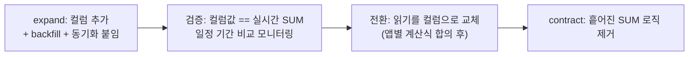

import { Callout, Steps, Step, Tabs, TabsList, TabsTrigger, TabsContent } from '@/components/writing-ui';

## 이게 뭔데

**Introduce Calculated Column.** 한 줄로 말하면, 매번 계산하던 파생값을 미리 계산해서 컬럼 하나에 박아두는 리팩토링이다.

비유를 하나 들어보자. 가계부를 쓰는데, 누가 "지금 통장 잔고 총합 얼마야?"라고 물을 때마다 지갑이랑 통장 다섯 개를 꺼내서 일일이 더한다고 치자. 한 번이면 모르겠는데, 하루에 백 번씩 물어보면 미친다. 그래서 보통은 냉장고 화이트보드에 "오늘 총잔고: 1,200만 원"이라고 적어둔다. 누가 물으면 화이트보드만 보면 된다. 더 안 한다.

이 화이트보드가 바로 계산 컬럼이다. 은행 도메인으로 옮기면, 고객이 가진 계좌(`Account`)들의 잔고를 다 더한 `Customer.TotalAccountBalance`. 누가 고객 총잔고를 물을 때마다 `SUM(balance)`를 돌리는 대신, `Customer` 테이블에서 컬럼 하나 읽으면 끝나게 만드는 거다.

<Callout type="info" title="한 줄 요약">
Introduce Calculated Column은 "읽을 때마다 계산"을 "미리 계산해서 저장"으로 바꾸는 의도적 비정규화다. 읽기는 싸지는데, 그 대가로 동기화를 누군가 책임져야 한다.
</Callout>

화이트보드 비유의 함정도 거기 있다. 통장에서 돈이 빠졌는데 화이트보드를 안 고치면, 거기 적힌 숫자는 그냥 거짓말이 된다. 계산 컬럼의 전부는 결국 **"소스가 바뀔 때 이 컬럼을 누가 갱신하느냐"**다.

## 언제 쓰나

동기는 단순하다. **성능.** 정확히는, 같은 파생값을 너무 자주, 너무 비싸게 계산하고 있을 때다.

이 리팩토링이 답이 되는 냄새들:

- **읽기가 압도적으로 잦다.** 고객 총잔고는 대시보드, 마이페이지, 알림 배치, 등급 산정 등 사방에서 읽힌다. 근데 계좌 잔고가 바뀌는 빈도는 그보다 훨씬 낮다. 읽기 백 번에 쓰기 한 번이면, 백 번 계산하느니 한 번 갱신하는 게 이득이다.
- **계산이 비싸다.** 단순 `SUM` 정도면 인덱스로도 버틸 만하지만, 여러 테이블을 조인하고 조건을 걸고 가중치를 먹이는 신용 위험 등급(credit risk rating) 같은 거라면 매 조회가 부담이다.
- **여러 앱이 같은 계산을 제각각 한다.** 앱 A는 `SUM`, 앱 B는 어떤 계좌 종류는 빼고 더하고... 계산 로직이 코드 곳곳에 흩어지면 결과가 미묘하게 어긋난다. 계산 컬럼으로 빼면 "정답"이 DB에 한 군데 모인다.

반대로, 계좌가 바뀔 때마다 총잔고도 거의 매번 다시 읽힌다면(쓰기와 읽기 빈도가 비슷하면) 이득이 별로 없다. 갱신 비용만 늘고 읽기 절감은 미미하다. 그땐 그냥 쿼리로 계산하는 게 낫다.

### 시나리오: 이런 적 있을 거임

마이페이지 상단에 "내 총자산"을 띄운다. 처음엔 별생각 없이 이렇게 짰을 거다.

```sql
SELECT SUM(balance)
FROM Account
WHERE customer_id = :customerId;
```

로컬에선 0.001초. 깔끔하다. PR 통과. 그런데 6개월 뒤, 이 화면이 마이페이지 첫 진입마다 뜨고, 푸시 알림 배치가 새벽마다 전 고객 총자산을 다시 계산하고, 등급 산정 잡이 또 돌린다. 고객 한 명당 계좌가 평균 8개, 고객은 300만 명. 새벽 배치 한 번에 `SUM`이 300만 번 돈다.

APM에 `SELECT SUM(balance) FROM Account WHERE customer_id = ?`가 호출 수 1위로 박혀 있고, 슬랙엔 "마이페이지 왜 이렇게 느려요?"가 올라온다. 정작 잔고가 실제로 바뀌는 건 하루에 고객당 한두 번꼴이다. **백 번 묻는데 정답은 하루에 한 번 바뀌는 값을, 매번 처음부터 계산하고 있었던 거다.**

여기서 `Customer.TotalAccountBalance` 컬럼 하나 도입하면, 그 비싼 `SUM`이 `SELECT total_account_balance FROM Customer WHERE id = ?` 한 줄이 된다.

## 주의할 점

좋은 얘기만 했으니 이제 청구서를 볼 차례다. 계산 컬럼은 공짜가 아니다. 본질적으로 **비정규화**다 — 같은 정보를 두 군데(원본 `Account.balance`들과 파생 `Customer.TotalAccountBalance`)에 들고 있겠다는 선언이다.

<Callout type="warning" title="동기화가 깨지면, 그건 데이터가 아니라 거짓말이다">
계산 컬럼의 유일하고 진짜인 위험은 **소스와 어긋나는 것**이다. 어떤 경로 하나가 `Account.balance`를 바꾸면서 `TotalAccountBalance` 갱신을 건너뛰면, 그 고객의 총잔고는 조용히 틀려진다. 에러도 안 난다. 화면엔 멀쩡한 숫자가 떠 있고, 그게 진짜 합계랑 다를 뿐이다. 그리고 그게 돈이라면, 이건 성능 이슈가 아니라 신뢰 이슈가 된다.

- **모든 쓰기 경로를 빠짐없이 잡아야 한다.** 앱 코드, 배치, 관리자 콘솔, 손으로 친 `UPDATE` 하나까지. 하나라도 새면 깨진다.
- **트리거 순환을 조심하라.** 갱신 트리거가 또 다른 갱신을 부르는 고리를 만들지 마라.
- **이건 캐시다.** 캐시는 언젠가 stale 해진다는 걸 전제로 설계해야 한다. "절대 안 틀린다"가 아니라 "틀어지면 어떻게 복구하느냐"를 준비하는 게 맞다.
</Callout>

그래서 동기화 전략을 고르는 게 이 리팩토링의 8할이다. 컬럼 추가는 1분이고, 그걸 끝까지 진실되게 유지하는 게 일이다.

## 이렇게 한다

큰 그림은 이렇다.

<Steps>
<Step title="동기화 전략을 먼저 정한다">
컬럼 추가보다 이게 먼저다. 실시간 정확성이 필요하면 트리거(또는 DB 생성 컬럼), 약간의 지연을 허용하면 배치/머티리얼라이즈드 뷰, 앱이 단일 진입점이면 앱 레이어 갱신. 이 선택이 나머지를 다 결정한다.
</Step>
<Step title="계산 방법을 정의한다">
"총잔고"가 뭘 다 더한 거냐. 해지된 계좌는 빼는가? 외화 계좌는? 마이너스 통장은? 이걸 이해관계자랑 합의해야 한다. 책이 콕 집어 경고하는 부분인데, 앱마다 계산식이 미묘하게 다르면 어느 게 "정답"인지부터 정해야 한다.
</Step>
<Step title="컬럼을 둘 테이블을 고른다">
이 파생값을 가장 잘 설명하는 비즈니스 엔티티가 누구냐. 고객 총잔고면 `Customer`다. 계좌 단위 파생값이면 `Account`. 엉뚱한 테이블에 붙이면 조인이 또 늘어 의미가 반감된다.
</Step>
<Step title="컬럼을 추가하고 초기값을 1회 채운다">
`ALTER TABLE`로 컬럼 추가 후, 기존 데이터 전체에 대해 합계를 한 번 계산해 넣는다. 이게 데이터 마이그레이션의 전부다 — 옮길 데이터는 없고, 처음 한 번 채우는 게 끝이다.
</Step>
<Step title="갱신 전략을 구현하고 테스트한다">
정한 동기화 방식을 실제로 붙이고, 소스를 흔들었을 때 컬럼이 따라 움직이는지 검증한다. 여기서 "모든 쓰기 경로"를 빠짐없이 잡았는지가 판가름 난다.
</Step>
</Steps>

### 스키마 변경 + 초기 1회 채움

먼저 컬럼을 추가하고, 기존 데이터로 초기값을 한 번 채운다. 책의 원형 그대로다.

```sql
-- 1) 컬럼 추가
ALTER TABLE Customer
  ADD total_account_balance NUMERIC(15, 2);

-- 2) 초기값 1회 채움 (모든 고객의 현재 합계를 backfill)
UPDATE Customer c
SET total_account_balance = COALESCE((
  SELECT SUM(a.balance)
  FROM Account a
  WHERE a.customer_id = c.id
), 0);
```

<Callout type="warning" title="대용량이면 이 UPDATE가 테이블을 잠근다">
고객 300만 명에게 한 방 `UPDATE`를 날리면, 그 한 트랜잭션이 거대한 락과 거대한 WAL/redo를 만든다. 운영 중이라면 PK 범위로 쪼개 배치로 돌려라(`WHERE id BETWEEN ...` 청크 + 중간 커밋). MySQL이라면 `pt-online-schema-change`나 `gh-ost`로 컬럼 추가 자체를 온라인으로 처리하고, backfill은 별도 배치로 분리하는 게 안전하다.
</Callout>

### 동기화: 네 가지 방식

여기가 핵심이다. 같은 컬럼이라도 어떻게 살아 있게 유지하느냐는 선택지가 여럿이다.

<Tabs defaultValue="trigger">
<TabsList>
<TabsTrigger value="trigger">트리거</TabsTrigger>
<TabsTrigger value="generated">생성 컬럼</TabsTrigger>
<TabsTrigger value="matview">머티리얼라이즈드 뷰</TabsTrigger>
<TabsTrigger value="app">앱/배치</TabsTrigger>
</TabsList>

<TabsContent value="trigger">

**책의 기본 처방.** `Account`가 바뀔 때 트리거가 해당 고객의 `TotalAccountBalance`를 다시 계산한다. 실시간 정확성이 가장 높다.

```sql
CREATE OR REPLACE FUNCTION sync_total_balance()
RETURNS TRIGGER AS $$
BEGIN
  -- 영향받은 고객(들)의 합계만 재계산
  UPDATE Customer c
  SET total_account_balance = COALESCE((
    SELECT SUM(a.balance) FROM Account a WHERE a.customer_id = c.id
  ), 0)
  WHERE c.id IN (NEW.customer_id, OLD.customer_id);
  RETURN NULL;
END;
$$ LANGUAGE plpgsql;

CREATE TRIGGER trg_sync_total_balance
AFTER INSERT OR UPDATE OF balance OR DELETE ON Account
FOR EACH ROW EXECUTE FUNCTION sync_total_balance();
```

장점은 어느 경로로 `Account`를 건드려도 따라온다는 것(앱이든 손UPDATE든 배치든). 트리거는 DB 안에 있으니 우회가 안 된다. 단점은 쓰기마다 비용이 붙고, 트리거 로직이 숨어 있어 디버깅이 까다롭다는 것. `UPDATE OF balance`로 잔고가 바뀔 때만 발화시켜 불필요한 재계산을 줄였다.

</TabsContent>

<TabsContent value="generated">

같은 행 안에서 계산되는 값이라면(예: `Account` 한 행 안의 `principal + interest`로 `payoff_amount`), DB의 **생성 컬럼(generated column)**이 트리거보다 깔끔하다. DB가 동기화를 보장해줘서 어긋날 틈이 없다.

```sql
-- PostgreSQL: STORED 생성 컬럼 (디스크에 저장, 미리 계산됨)
ALTER TABLE Account
  ADD payoff_amount NUMERIC(15, 2)
  GENERATED ALWAYS AS (principal + accrued_interest) STORED;
```

<Callout type="note" title="생성 컬럼은 '같은 행' 안에서만 된다">
`GENERATED ALWAYS AS`의 표현식은 **같은 행의 다른 컬럼**만 참조할 수 있다. 서브쿼리나 다른 테이블 집계(우리 `SUM(Account.balance)`처럼 여러 행을 가로지르는 것)는 못 쓴다. 그래서 행 단위 파생값엔 생성 컬럼, 여러 행/테이블 집계엔 트리거나 머티리얼라이즈드 뷰로 갈린다. `STORED`는 미리 계산해 저장(읽기 빠름), 가상 컬럼은 읽을 때 계산(저장 안 함) — 우리 목적은 읽기 최적화니까 `STORED`다.
</Callout>

</TabsContent>

<TabsContent value="matview">

약간의 지연(stale)을 허용할 수 있다면, 별도 컬럼 대신 **머티리얼라이즈드 뷰**로 파생값을 통째로 빼는 방법도 있다. 합계 로직이 한 곳에 선언적으로 모이고, 원본 테이블엔 손을 안 댄다.

```sql
CREATE MATERIALIZED VIEW customer_balance_mv AS
SELECT c.id AS customer_id, COALESCE(SUM(a.balance), 0) AS total_account_balance
FROM Customer c
LEFT JOIN Account a ON a.customer_id = c.id
GROUP BY c.id;

CREATE UNIQUE INDEX ON customer_balance_mv (customer_id);

-- 주기적으로(또는 변경 후) 갱신. UNIQUE 인덱스가 있으면 락 없이:
REFRESH MATERIALIZED VIEW CONCURRENTLY customer_balance_mv;
```

대시보드/리포팅처럼 "5분 전 숫자여도 괜찮은" 화면에 잘 맞는다. 대신 갱신 주기만큼은 무조건 stale 하다는 걸 받아들여야 한다. 실시간 잔고 화면엔 안 맞다.

</TabsContent>

<TabsContent value="app">

쓰기 경로가 **앱 서비스 한 군데로 일원화**돼 있다면, 트랜잭션 안에서 앱이 직접 갱신하는 것도 방법이다. 잔고를 바꾸는 모든 곳이 이 서비스를 거친다는 보장이 있을 때만 안전하다.

```typescript
// 모든 잔고 변경이 이 서비스를 통한다는 전제하에서만 OK
await db.transaction(async (tx) => {
  await tx.account.update({ where: { id: accountId }, data: { balance: newBalance } });

  // 같은 트랜잭션 안에서 파생값도 갱신 — 원자성 보장
  const sum = await tx.account.aggregate({
    where: { customerId },
    _sum: { balance: true },
  });
  await tx.customer.update({
    where: { id: customerId },
    data: { totalAccountBalance: sum._sum.balance ?? 0 },
  });
});
```

가장 명시적이고 디버깅하기 쉽지만, 가장 깨지기도 쉽다. 누군가 이 서비스를 우회해 `Account`를 직접 건드리는 순간 끝이다(관리자 콘솔, 데이터 패치 스크립트, 다른 마이크로서비스...). 마이크로서비스라면 변경 이벤트를 **outbox/CDC(Debezium)**로 흘려 별도 컨슈머가 집계를 갱신하는 방식으로 확장할 수 있는데, 이러면 일관성이 결국 최종 일관성(eventual)으로 바뀐다는 걸 명심해라.

</TabsContent>
</Tabs>

<Callout type="info" title="뭘 골라야 하나">
거칠게 정리하면: **같은 행 파생값이면 생성 컬럼(STORED)**, **실시간 + 여러 행 집계면 트리거**, **지연 허용 리포팅이면 머티리얼라이즈드 뷰**, **앱이 유일한 쓰기 게이트면 앱/트랜잭션 갱신**. 정답은 정확성 요구 수준과 "쓰기 경로를 내가 전부 통제하느냐"로 갈린다.
</Callout>

### 접근 프로그램 수정

마지막은 코드다. 흩어져 있던 계산 로직을 컬럼 읽기로 바꾼다.

```typescript
// Before: 읽을 때마다 SUM
async function getTotalBalance(customerId: string) {
  const rows = await db.account.findMany({ where: { customerId } });
  return rows.reduce((sum, a) => sum + a.balance, 0);
}

// After: 미리 계산된 컬럼을 그냥 읽는다
async function getTotalBalance(customerId: string) {
  const c = await db.customer.findUnique({
    where: { id: customerId },
    select: { totalAccountBalance: true },
  });
  return c?.totalAccountBalance ?? 0;
}
```

여기서 책이 짚는 함정이 있다. **앱마다 계산식이 미묘하게 다를 수 있다.** 어떤 앱은 해지 계좌를 빼고 더했는데 계산 컬럼은 다 더했다면, 그 앱은 컬럼으로 바꾸는 순간 숫자가 달라진다. 그래서 "기존 로직을 컬럼 읽기로 대체"하기 전에, 모든 사용처가 같은 정의를 쓰는지부터 확인하고 이해관계자와 알고리즘을 합의해야 한다.

### 안전하게 전환하기: expand-contract

기존 코드를 한 번에 갈아엎지 말고, **expand-contract(parallel change)**로 점진 전환하는 게 안전하다.



핵심은 가운데 검증 단계다. **계산 컬럼과 실시간 `SUM`을 한동안 나란히 돌려 값이 일치하는지 비교**하라. 어긋나는 케이스가 나오면 그게 바로 네가 못 잡은 쓰기 경로다. 이 비교 잡은 컬럼을 정식 채택한 뒤에도 주기적으로 돌려두면, 동기화가 깨졌을 때 조용히 거짓말하기 전에 잡아낼 수 있다. 계산 컬럼은 캐시고, 캐시엔 검증과 복구 경로가 딸려야 한다.

## 정리

Introduce Calculated Column은 "읽을 때마다 계산"을 "미리 계산해 저장"으로 바꾸는, 성능을 위한 의도적 비정규화다. 읽기는 확실히 싸진다. 비싼 `SUM`이 컬럼 한 줄 읽기가 되니까.

> **계산 컬럼은 화이트보드다. 적어두면 빠른데, 통장이 바뀔 때마다 누군가는 화이트보드를 고쳐야 한다.**

그래서 이 리팩토링의 본체는 컬럼 추가(`ALTER TABLE` 1분)가 아니라 **동기화**다. 같은 행 파생값이면 생성 컬럼, 실시간 집계면 트리거, 지연 OK면 머티리얼라이즈드 뷰, 앱이 유일한 게이트면 트랜잭션 갱신. 무엇을 고르든, "모든 쓰기 경로를 잡았는가"와 "어긋났을 때 어떻게 잡아내는가"라는 두 질문에 답할 수 있어야 한다. 그 답이 없으면 계산 컬럼은 빠른 거짓말 생성기가 된다.
