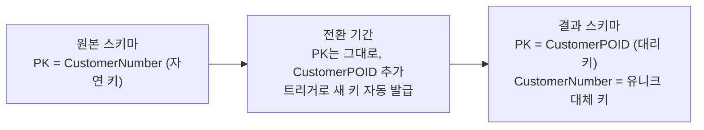

import { Callout, Steps, Step, Tabs, TabsList, TabsTrigger, TabsContent, Icon } from '@/components/writing-ui';

## 이게 뭔데

대리 키 도입. 한 문장으로 말하면, **테이블의 기본 키를 "비즈니스 의미가 있는 자연 키"에서 "아무 의미 없는 인공 키"로 갈아끼우는 작업**이다.

비유를 하나 들자. 회사에서 사람을 식별하는 방법은 두 가지다. 하나는 "보안팀 김철수 차장님"이다. 이름, 부서, 직급을 묶으면 한 사람이 특정된다. 다른 하나는 사번 `20180417`이다. 이게 누군지는 사번만 봐선 모른다. 근데 이 사람이 결혼해서 성이 바뀌든, 보안팀에서 인사팀으로 옮기든, 차장에서 부장이 되든 **사번 `20180417`은 끝까지 안 바뀐다.**

`Customer` 테이블의 기본 키를 주민번호나 이메일 같은 "그 사람을 설명하는 값"으로 잡는 게 자연 키다. 반대로 `1`, `2`, `3`... 처럼 시스템이 그냥 발급한, 아무 뜻 없는 번호를 키로 잡는 게 대리 키(surrogate key)다. 책에서는 이런 컬럼을 `CustomerPOID`(Persistent Object IDentifier) 식으로 부른다.

<Callout type="info" title="한 줄 요약">
대리 키는 "이 행이 무엇인가"를 설명하지 않는다. 오직 "이 행이 다른 행과 다르다"만 보장한다. 의미가 없다는 게 약점이 아니라, 의미가 없어서 절대 안 바뀐다는 게 핵심 가치다.
</Callout>

## 언제 쓰나

자연 키로 잘 살고 있었는데 왜 갈아엎냐. 동기는 보통 셋 중 하나에서 온다.

**1. 결합도를 끊고 싶을 때.** 자연 키의 가장 큰 문제는 **언젠가 바뀐다**는 거다. 처음엔 "고객 이메일은 절대 안 바뀌니까 PK로 쓰자" 싶다가, 어느 날 고객이 이메일을 바꾼다. 그런데 그 이메일이 `Account`, `Policy`, `Insurance` 테이블에 FK로 줄줄이 박혀 있다. 이메일 하나 바꾸려고 다섯 테이블을 동시에 업데이트해야 한다. 자연 키를 PK로 쓰는 순간, **그 자연 값이 변할 가능성이 곧 스키마 전체의 결합 비용**이 된다. 대리 키는 이 사슬을 끊는다. 이메일이 바뀌어도 `Customer.email` 한 칸만 고치면 끝이고, FK로 박힌 `CustomerPOID`는 미동도 안 한다.

**2. 일관성을 원할 때.** 테이블마다 키 전략이 제각각이면 — 어디는 이메일, 어디는 사번, 어디는 복합 키 — 조인 로직도 제각각이고 코드도 제각각이다. 모든 테이블이 `(엔티티명)POID`라는 동일한 단일 컬럼 정수/식별자 키를 가지면, 책에서 말하는 **Consolidate Key Strategy**(키 전략 통일)가 가능해진다. 조인이 단순해지고, ORM 매핑이 단순해지고, 코드 생성도 쉬워진다.

**3. 성능 때문에.** 자연 키가 `(CountryCode, StateCode, BranchCode, AccountNumber)` 같은 **거대한 복합 키**라고 해보자. 이게 PK라는 건, 이 네 컬럼 묶음이 모든 자식 테이블에 FK로 통째로 복사되고, 모든 인덱스에 통째로 들어가고, 모든 조인 조건에 네 번씩 등장한다는 뜻이다. 이걸 단일 `BIGINT` 대리 키 하나로 바꾸면 인덱스가 작아지고, 조인이 가벼워지고, FK 컬럼 폭이 줄어든다.

### 현실 시나리오 한 토막

은행 시스템을 인수했다. `Customer` 테이블의 PK가 `CustomerNumber`인데, 알고 보니 이게 의미를 잔뜩 담은 값이다. 앞 2자리는 지점 코드, 가운데는 가입 연도, 뒤는 순번. 처음 설계한 사람은 "번호만 보면 어느 지점 고객인지 알 수 있어서 좋다"고 했겠지.

그러던 어느 날 두 지점이 합병된다. 한쪽 지점 코드를 다른 쪽으로 흡수해야 한다. 그 말은 **`CustomerNumber`의 앞 2자리를 바꿔야 한다**는 거고, 그건 PK를 바꾼다는 거고, 그건 이 키를 FK로 들고 있는 `Account`, `Policy`, `Insurance` 전부를 같이 바꿔야 한다는 거다. 운영 중인 DB에서. 수십만 건을.

이 순간 "아, 키에 의미를 담는 게 아니었다"를 깨닫는다. 그래서 대리 키를 도입하기로 한다.

## 주의할 점

대리 키가 만능 키처럼 보이지만, 함정이 몇 개 있다.

<Callout type="warning" title="대리 키 도입 전에 확인할 것">
- **자연 대체 키는 여전히 필요하다.** 대리 키 `CustomerPOID = 84217`만 있으면 사람이 검색을 못 한다. "고객번호 C-2018-0417로 조회"는 여전히 돼야 하니까, 옛 자연 키는 PK 자리에서 내려오더라도 **유니크 인덱스를 가진 대체 키(alternate key)**로 남겨야 한다. 책 예시의 `InventoryItemPOID`(대리 PK) + `InventoryID`(자연 대체 키) 조합이 그거다. 대리 키를 도입한다고 자연 값을 버리는 게 아니다.
- **과잉 적용 금지.** "주/도 코드" 같은 안정적인 룩업 테이블에까지 대리 키를 박을 필요는 없다. `state_code = 'CA'`는 캘리포니아가 사라지지 않는 한 절대 안 바뀐다. 안 바뀌는 자연 키는 그냥 자연 키로 두는 게 낫다. 짧고, 의미 있고, 조인해도 사람이 읽을 수 있으니까.
- **자연 키 vs 대리 키 논쟁은 "종교적 이슈"다.** 책 저자도 못 박는다. 양쪽 다 광신도가 있고, 둘 다 틀린 경우가 있다. 동기(결합/일관성/성능) 없이 "대리 키가 정석이라던데" 하나로 갈아엎지 마라.
- **FK로 이미 널리 쓰이는 키라면 비용이 크다.** 그 키가 자식 테이블 곳곳에 FK로 박혀 있으면 Consolidate Key Strategy까지 끌고 가야 하고, 전파 작업이 만만치 않다. 노력 대비 효과를 다시 재 봐라.
</Callout>

## 이렇게 한다

전체 그림부터. 원본 스키마에서 결과 스키마로 한 번에 점프하지 않는다. 운영 DB에선 **전환 기간(transition period)**을 두고, 그동안 옛 키와 새 키를 트리거로 양쪽 다 살려둔 채 외부 프로그램들이 새 키로 갈아탈 시간을 준다.



### 1단계 — 스키마 변경 (DDL)

<Steps>
<Step title="대리 키 컬럼을 추가하고 유니크 값을 채운다">
`Customer`에 `CustomerPOID`를 새로 단다. 기존 행에는 전부 유니크한 값을 발급해 채운다. 아직 PK는 아니다. 그냥 값만 들어찬 컬럼이다.
</Step>
<Step title="인덱스를 건다">
새 키 컬럼에 유니크 인덱스를 건다. 조인과 조회에 쓰일 거니까. 대용량이면 운영 중 락을 피하려고 온라인으로 건다(뒤에서 다룬다).
</Step>
<Step title="원본 자연 키를 대체 키로 강등 예고한다">
`CustomerNumber`를 PK 자리에서 내려보내되 버리진 않는다. 전환 종료 시 유니크 인덱스를 가진 대체 키로 남길 거라고 예고하고, drop 날짜를 잡는다.
</Step>
<Step title="RI 트리거를 갱신/추가한다">
전환 기간 동안 새로 들어오는 행에도 `CustomerPOID`가 자동으로 채워지도록, 그리고 자식 테이블의 FK가 새 키 기준으로도 정합성을 유지하도록 트리거를 둔다.
</Step>
<Step title="전환 종료 시 PK 제약을 교체한다">
외부 프로그램이 전부 새 키로 갈아탔으면, PK 제약을 `CustomerNumber`에서 `CustomerPOID`로 교체하고, `CustomerNumber`에는 유니크 인덱스를 부여해 대체 키로 정착시킨다.
</Step>
</Steps>

before / after를 SQL로 보면 이렇다.

```sql
-- Before: 자연 키가 PK
CREATE TABLE Customer (
    CustomerNumber  VARCHAR(20)  NOT NULL,   -- 'C-2018-0417'
    email           VARCHAR(255) NOT NULL,
    name            VARCHAR(100) NOT NULL,
    CONSTRAINT pk_customer PRIMARY KEY (CustomerNumber)
);

-- 전환: 대리 키 컬럼 추가 + 유니크 값 채움 + 인덱스
ALTER TABLE Customer ADD COLUMN CustomerPOID BIGINT;

-- 기존 행에 유니크 값 발급 (DB별 방식은 데이터 마이그레이션에서)
-- ... 채운 뒤 ...

CREATE UNIQUE INDEX uk_customer_poid ON Customer (CustomerPOID);

-- After: PK 교체, 자연 키는 대체 키로 생존
ALTER TABLE Customer DROP CONSTRAINT pk_customer;
ALTER TABLE Customer ALTER COLUMN CustomerPOID SET NOT NULL;
ALTER TABLE Customer ADD CONSTRAINT pk_customer PRIMARY KEY (CustomerPOID);
ALTER TABLE Customer ADD CONSTRAINT uk_customer_number UNIQUE (CustomerNumber);
```

핵심은 마지막 두 줄이다. PK는 의미 없는 `CustomerPOID`로 갔지만, `CustomerNumber`는 사라진 게 아니라 **유니크 대체 키로 살아남았다.** 사람이 여전히 고객번호로 검색할 수 있다.

### 2단계 — 데이터 마이그레이션 (DML)

`CustomerPOID` 값을 만들어 채우고, 이 키를 FK로 참조하는 자식 테이블(`Account`, `Policy`, `Insurance`)에 전파해야 한다.

```sql
-- Account가 옛날엔 Customer를 CustomerNumber로 참조했다고 하자
-- 새 키 CustomerPOID를 Account에도 추가하고, 조인으로 전파
ALTER TABLE Account ADD COLUMN CustomerPOID BIGINT;

UPDATE Account a
SET CustomerPOID = (
    SELECT c.CustomerPOID
    FROM Customer c
    WHERE c.CustomerNumber = a.CustomerNumber
);

-- 다 채워졌으면 FK를 새 키 기준으로 추가
ALTER TABLE Account
    ADD CONSTRAINT fk_account_customer
    FOREIGN KEY (CustomerPOID) REFERENCES Customer (CustomerPOID);
```

`Policy`, `Insurance`도 동일한 패턴으로 전파한다. 이게 "FK로 이미 널리 쓰이는 키면 비용이 크다"고 경고한 그 작업이다. 자식 테이블이 많을수록 이 UPDATE 전파가 늘어난다.

### 키 값을 어떻게 발급하나 — 2006 vs 지금

원본 책은 유니크 값 발급에 **HIGH-LOW 알고리즘**을 쓴다. 키 발급 서비스가 HIGH 블록(예: `8400`)을 한 번 받아오면, 애플리케이션이 메모리에서 LOW를 0부터 9999까지 붙여 `84000000`~`84009999`를 DB 왕복 없이 발급한다. 블록을 다 쓰면 다음 HIGH를 받아온다. 매번 DB에 시퀀스를 물으러 가는 왕복을 줄이는 영리한 트릭이고, 분산 환경에서 키 충돌도 막는다. 골격은 여전히 훌륭하다.

근데 2026년엔 선택지가 훨씬 많다. 상황별로 갈린다.

<Tabs defaultValue="autoinc">
<TabsList>
<TabsTrigger value="autoinc">auto-increment</TabsTrigger>
<TabsTrigger value="uuid">UUID</TabsTrigger>
<TabsTrigger value="ulid">ULID / snowflake</TabsTrigger>
</TabsList>

<TabsContent value="autoinc">

**`BIGINT` auto-increment / IDENTITY / 시퀀스.** 가장 흔하고 가장 싸다. 단일 DB 환경이면 거의 항상 정답이다.

```sql
-- PostgreSQL
ALTER TABLE Customer
    ALTER COLUMN CustomerPOID
    ADD GENERATED ALWAYS AS IDENTITY;

-- MySQL
ALTER TABLE Customer
    MODIFY CustomerPOID BIGINT AUTO_INCREMENT;
```

- 장점: 작다(8바이트), 순차라 인덱스 지역성(locality)이 좋아 B-트리가 안 쪼개진다, 사람이 읽고 디버깅하기 편하다.
- 단점: **단일 발급 지점**에 의존한다. DB 샤딩하거나 여러 노드가 동시에 키를 발급해야 하면 충돌·핫스팟 문제가 생긴다. 또 순차라 "다음 ID 추측"이 쉬워서 외부 노출 ID로는 부적절하다(내부 PK와 외부 노출 ID를 분리해라).

</TabsContent>

<TabsContent value="uuid">

**UUID (v4 랜덤, v7 시간순).** 발급 지점이 분산돼 있어도 충돌 걱정 없이 **클라이언트/앱 노드가 키를 직접 만든다.** 마이크로서비스나 오프라인-우선 앱에서 강력하다.

```sql
-- PostgreSQL: 앱에서 만들거나 DB 기본값으로
ALTER TABLE Customer
    ALTER COLUMN CustomerPOID SET DATA TYPE UUID;
-- 신규 행: gen_random_uuid() 또는 앱에서 UUIDv7 생성
```

- 장점: 발급에 DB 왕복도, 중앙 코디네이터도 필요 없다. HIGH-LOW가 풀려던 분산 충돌 문제를 더 단순하게 푼다.
- 단점: 16바이트로 크다. 그리고 **v4 랜덤은 인덱스 지역성이 최악**이다 — 삽입이 B-트리 곳곳에 랜덤하게 흩어져 페이지 분할과 캐시 미스를 부른다. 대용량 테이블 PK로 v4 UUID를 쓰면 쓰기 성능이 무너진다. 이게 다음 카드(ULID/v7)가 등장한 이유다.

</TabsContent>

<TabsContent value="ulid">

**ULID / UUIDv7 / Snowflake — "시간 정렬되는" 분산 키.** UUID의 분산 발급 장점은 살리고, 랜덤 UUID의 인덱스 파편화는 죽인 절충안. 키 앞쪽에 타임스탬프를 박아 **대략 시간순으로 증가**하게 만든다.

```text
ULID:       01ARZ3NDEKTSV4RRFFQ69G5FAV
            └── 앞 48비트 = 밀리초 타임스탬프 (정렬 가능)

Snowflake:  타임스탬프(41) + 워커ID(10) + 시퀀스(12)
            = 노드별로 분산 발급되면서도 시간순 증가
```

- 장점: 분산 발급(UUID의 장점) + 순차 삽입에 가까운 인덱스 지역성(auto-increment의 장점). 트위터 Snowflake, 그 변종(Sonyflake, Instagram ID 등)이 대규모 분산 시스템의 사실상 표준이 됐다.
- 단점: v4 UUID보다 구현이 약간 복잡하고, 타임스탬프가 박혀 생성 시각이 노출될 수 있다. 워커 ID 할당(어느 노드가 어떤 ID 쓸지)이라는 운영 부담이 생긴다.

</TabsContent>
</Tabs>

<Callout type="note" title="키 발급은 공통 서비스로 일원화">
책의 조언이 지금도 유효하다. 새 키 값을 할당하는 로직은 테이블마다 흩뿌리지 말고 **공통 키 서비스 하나**로 모아라. auto-increment면 DB가 그 서비스고, UUIDv7/Snowflake면 공용 ID 생성 유틸이 그 서비스다. 키 전략을 한 곳에서 바꿀 수 있어야 나중에 후회가 적다.
</Callout>

### 3단계 — 접근 프로그램 수정 (코드)

스키마만 바꾸고 코드를 안 바꾸면 아무 일도 안 일어난다. 애플리케이션이 자연 키로 조인하고 조회하던 걸 전부 대리 키 기준으로 갈아야 한다.

```typescript
// Before: 자연 키(CustomerNumber)로 조인하고 조회
const accounts = await db.query(`
  SELECT a.*
  FROM Account a
  JOIN Customer c ON c.CustomerNumber = a.CustomerNumber
  WHERE c.CustomerNumber = $1
`, [customerNumber]);

// After: 대리 키(CustomerPOID)로 조인. 자연 키는 사람 검색용으로만
const customer = await db.query(
  `SELECT CustomerPOID FROM Customer WHERE CustomerNumber = $1`,
  [customerNumber]
);
const accounts = await db.query(`
  SELECT a.*
  FROM Account a
  JOIN Customer c ON c.CustomerPOID = a.CustomerPOID
  WHERE c.CustomerPOID = $1
`, [customer.CustomerPOID]);
```

ORM 매핑도 손봐야 한다. 책에선 Hibernate 매핑에 `<id>` + generator를 추가하라고 한다. 요즘 도구로 옮기면 이렇다.

```typescript
// TypeORM 예시: 대리 키를 PK로, 자연 키는 유니크 컬럼으로
@Entity()
export class Customer {
  @PrimaryGeneratedColumn('identity')   // 대리 키 (DB가 발급)
  customerPOID: number;

  @Column({ unique: true })             // 자연 대체 키로 생존
  customerNumber: string;

  @Column()
  email: string;
}
```

### 전환 기간을 안전하게 — expand-contract와 온라인 변경

운영 DB라면 위 단계를 통째로 한 배포에 우겨넣으면 안 된다. **expand-contract(parallel change)** 패턴으로 쪼갠다.

<Steps>
<Step title="Expand — 새 키를 더한다 (구버전 코드도 살아있음)">
`CustomerPOID` 컬럼을 추가하고 채운다. 이 시점엔 옛 키 `CustomerNumber`도 그대로 PK라서, 새 키를 모르는 구버전 애플리케이션도 멀쩡히 돈다. 양쪽이 공존하는 게 핵심이다.
</Step>
<Step title="Migrate — 코드를 새 키로 옮긴다">
애플리케이션을 한 버전씩 배포하며 조인/조회를 `CustomerPOID` 기준으로 갈아탄다. 트리거나 백필 잡으로 새 키가 항상 채워지도록 보장한다.
</Step>
<Step title="Contract — 옛 키를 강등한다">
모든 코드가 새 키로 갈아탄 게 확인되면, PK를 `CustomerPOID`로 교체하고 `CustomerNumber`는 유니크 대체 키로 내린다. drop 날짜에 맞춰 옛 PK 제약을 정리한다.
</Step>
</Steps>

대용량 테이블이면 DDL 자체가 락을 잡아 서비스를 멈출 수 있다. 그래서 온라인 변경 도구를 쓴다.

- **PostgreSQL** — 인덱스는 `CREATE INDEX CONCURRENTLY`로 락 없이 건다. FK는 `ADD CONSTRAINT ... NOT VALID`로 일단 빠르게 걸고, 나중에 `VALIDATE CONSTRAINT`로 풀스캔 검증을 분리해 락 시간을 줄인다. 대리 키 컬럼 채우기는 `GENERATED ... AS IDENTITY`나 백필 배치로.
- **MySQL** — `gh-ost`나 `pt-online-schema-change`로 섀도 테이블을 만들어 데이터를 복사하면서 트리거로 변경분을 따라잡아, 거의 무중단으로 스키마를 바꾼다. 이게 책의 "전환 기간 트리거"를 도구가 대신 깔아주는 셈이다.
- **자식 테이블 FK 전파**는 한 방에 UPDATE하면 거대한 트랜잭션이 락을 잡으니, 배치로 쪼개거나 CDC(Debezium 등)로 변경분을 흘려보내며 채운다.

<Callout type="success" title="2006의 트리거 = 2026의 도구">
책이 손으로 깔던 "전환 기간 동기화 트리거"는, 지금은 gh-ost·pt-osc 같은 온라인 변경 도구나 Flyway/Liquibase/Alembic 마이그레이션이 상당 부분 대신해준다. 원리(원본·결과 스키마를 잠시 공존시키고 데이터를 동기화한 뒤 컷오버)는 20년 전과 똑같다. 바뀐 건 그 원리를 굴리는 손이 더 안전하고 자동화됐다는 것뿐이다.
</Callout>

## 정리

대리 키 도입은 "키에서 의미를 빼는" 리팩토링이다. 의미가 없어서 안 바뀌고, 안 바뀌어서 결합을 끊고, 단일 컬럼이라 일관성과 성능을 준다.

> **자연 키는 데이터를 설명하라고 있고, 대리 키는 행을 식별하라고 있다. 한 컬럼에 두 일을 다 시키면 둘 다 어설퍼진다.**

다만 만능은 아니다. 안 바뀌는 안정적인 자연 키(주/도 코드 룩업)까지 갈아엎을 필요 없고, 자연 대체 키는 사람 검색용으로 반드시 살려둬야 한다. 그리고 키 발급은 — HIGH-LOW든 auto-increment든 UUIDv7이든 — **공통 서비스로 일원화**해서 나중에 전략을 갈아끼울 여지를 남겨라. 단일 DB면 `BIGINT` 시퀀스로 충분하고, 노드가 흩어져 키를 동시에 발급해야 하는 순간에야 ULID·Snowflake 같은 시간 정렬 분산 키를 꺼내면 된다.
