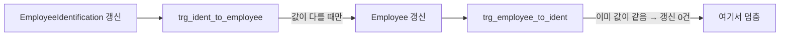

import { Callout, Steps, Step, Tabs, TabsList, TabsTrigger, TabsContent, Icon } from '@/components/writing-ui';

## 이게 뭔데

**Merge Tables는 둘 이상의 테이블을 하나로 합치는 구조 리팩토링이다.** 특히 `Employee`와 `EmployeeIdentification`처럼 행 하나당 행 하나로 딱 붙어 다니는(1:1) 테이블들을 한 테이블로 포개는 일이다.

비유하자면 이렇다. 같이 출퇴근하는 부부가 있다. 매일 똑같은 시간에, 똑같은 차를 타고, 똑같은 목적지로 간다. 근데 무슨 이유에서인지 각자 자기 차를 끌고 나란히 줄지어 간다. 행선지가 100% 같은데 차 두 대가 매번 같이 움직인다. 누가 봐도 "그냥 한 차 타지?" 싶잖아. Merge Tables는 그 두 대를 한 대로 합치는 거다. 조회할 때마다 두 테이블을 `JOIN`으로 다시 붙여 주던 수고를, 처음부터 한 테이블에 담아서 없애 버린다.

이건 정규화의 반대 방향, 즉 **의도적인 비정규화**다. 책 도메인 그대로 은행 예시를 쓰면 `Employee`(이름, 부서)와 `EmployeeIdentification`(사진, 지문 해시, 보안 등급)이 직원 한 명당 한 행씩 1:1로 매달려 있다. 모든 조회가 둘을 조인한다면, 그냥 합치는 게 답일 수 있다.

<Callout type="info" title="한 줄 요약">
항상 같이 조회되고 항상 1:1로 붙어 다니는 테이블이라면, 조인으로 매번 붙이느니 처음부터 한 테이블로 합쳐서 조인 자체를 없앤다.
</Callout>

## 언제 쓰나

동기는 크게 셋이다. 셋 다 "테이블이 둘로 나뉜 게 비용만 만들고 이득이 없을 때"라는 한 줄로 수렴한다.

**1. 과잉 설계(over-engineering).** 설계 초기에 "나중에 확장될지도 모르니까" 하면서 테이블을 미리 쪼개 놓는 경우다. `EmployeeIdentification`이 언젠가 직원당 여러 신원 정보를 갖게 될 줄 알고 별도 테이블로 뺐는데, 5년이 지나도 여전히 1:1이다. 미래는 안 왔고 조인 비용만 남았다.

**2. 시간이 지나며 용도가 같아진 테이블.** 처음엔 다른 목적이었는데 쓰다 보니 사실상 같은 엔티티를 설명하게 된 경우. 두 테이블의 PK가 같고, 한쪽이 있으면 다른 쪽도 반드시 있고, 항상 같이 읽힌다면 분리의 의미가 사라진 거다.

**3. 실수로 중복 생성된 테이블.** 책에 나오는 `FeeStructure`와 `FeeSchedule`이 전형적이다. 서로 다른 팀이, 혹은 서로 다른 시기에, 같은 개념을 각자 만들어 버린 거다. 둘 다 수수료 체계를 담는데 이름만 다르다. 이런 건 합치는 게 아니라 사실 "둘 중 하나로 통일"하는 작업에 가깝다.

### 현실 시나리오 한 토막

직원 목록 화면을 만든다. 이름, 부서, 그리고 옆에 증명사진을 띄운다. 코드를 보면 매번 이렇게 생겼다.

```sql
SELECT e.EmployeeID, e.Name, e.Department, ei.Picture
FROM Employee e
JOIN EmployeeIdentification ei ON ei.EmployeeID = e.EmployeeID;
```

직원 상세를 봐도 조인, 목록을 봐도 조인, 리포트를 뽑아도 조인. `EmployeeIdentification`을 **조인 없이 단독으로 쓰는 쿼리가 코드베이스에 단 하나도 없다.** 게다가 `Employee`에 행이 있으면 `EmployeeIdentification`에도 반드시 짝꿍 행이 있다. 없으면 그게 버그다.

이 시점에서 누군가 한 번쯤 생각한다. "근데 이거 왜 두 테이블이지?" 그게 바로 Merge Tables의 신호다. **분리가 어떤 일도 안 하고 있고, 그 분리를 유지하느라 모든 쿼리가 세금을 내고 있다면** 합칠 때가 된 거다.

## 주의할 점

합치기 전에 멈춰서 따져야 할 게 있다. Merge는 한번 하면 되돌리기 귀찮은 결정이라서다.

<Callout type="warning" title="합치기 전에 반드시 확인할 것">
- **정밀도(분리의 의미) 손실**: 두 테이블이 "사실은" 다른 용도였는데 우연히 1:1처럼 보였을 뿐이면, 합친 뒤에 다시 쪼개야(Split Table) 한다. 데이터 사용 양태를 먼저 확인하라 — 정말 항상 1:1이고 항상 같이 읽히는가?
- **보안 분리는 함부로 못 합친다**: `EmployeeIdentification`이 사진/지문/보안등급을 담고 있고, 일부러 접근 권한을 분리하려고 별도 테이블로 뺀 거라면 얘기가 완전히 다르다. 합치는 순간 `Employee`를 읽을 수 있는 모든 사람이 보안 데이터까지 보게 된다. 이건 리팩토링이 아니라 보안 사고다.
- **NULL 가능성 증가**: 한쪽 테이블의 행이 가끔 없었다면(즉 진짜 1:1이 아니라 1:0..1이었다면), 병합 후 그 컬럼들은 NULL이 된다. NULL을 다룰 준비가 됐는지 봐야 한다.
- **로우 크기 증가**: 합치면 한 행이 커진다. `Picture` 같은 BLOB을 자주 안 읽는데 `Employee`에 끼워 넣으면, `SELECT Name` 한 줄 읽는 것조차 무거워질 수 있다. 그땐 합치지 않는 게 맞다.
</Callout>

특히 두 번째, 보안 분리 케이스는 강조하고 또 강조해도 모자라다. **"1:1이니까 합치자"는 구조적 판단과 "권한이 다르니까 나누자"는 보안 판단은 별개다.** 구조적으로 합쳐도 되는지 보기 전에, 이게 보안 목적으로 갈라진 건 아닌지부터 확인해라. 보안 분리 테이블이라면 컬럼 단위 권한(column-level grant), 행 수준 보안(RLS), 혹은 마스킹으로 따로 풀어야지 Merge로 풀면 안 된다.

## 이렇게 한다

핵심은 **빅뱅으로 합치지 않는 것**이다. 여러 앱이 두 테이블에 동시에 접근하는 상황에서, 어느 날 갑자기 테이블을 합쳐 버리면 옛 코드가 전부 깨진다. 그래서 책은 "전환 기간(transition period)"을 두고 그동안 트리거로 양쪽을 동기화한다. 현대 용어로는 이게 바로 **expand-contract(parallel change)** 패턴이다. 늘렸다가(병합 컬럼 추가) 한동안 둘 다 살려 두고(동기화), 마지막에 줄인다(원본 테이블 드롭).

<Steps>
<Step title="병합 컬럼 추가 (Expand)">
`Employee` 테이블에 `EmployeeIdentification`의 컬럼들을 추가한다. 이미 일부 컬럼이 `Employee`에 존재할 수도 있으니 겹치는 건 빼고.
</Step>
<Step title="기존 데이터 1회 복사 (Backfill)">
`EmployeeIdentification`에 이미 들어 있던 데이터를 새로 추가한 컬럼으로 한 번 옮긴다. 변환 단계는 없다 — 그냥 자리만 옮기는 복사다.
</Step>
<Step title="양방향 동기화 트리거 도입">
전환 기간 동안 옛 코드는 여전히 `EmployeeIdentification`에 쓰고, 새 코드는 `Employee`의 새 컬럼에 쓴다. 둘이 어긋나지 않게 양쪽을 동기화하는 트리거를 건다. 이때 순환을 반드시 막는다(아래 설명).
</Step>
<Step title="접근 프로그램을 새 컬럼으로 전환">
모든 앱이 `Employee`의 병합 컬럼만 읽고 쓰도록 코드를 하나씩 옮긴다. 조인이 사라지면서 코드도 같이 단순해진다.
</Step>
<Step title="트리거와 원본 테이블 드롭 (Contract)">
전환 기간이 끝나고 아무도 `EmployeeIdentification`을 안 쓰는 게 확인되면, 동기화 트리거를 떼고 원본 테이블을 드롭한다.
</Step>
</Steps>

### 스키마 변경 (DDL)

먼저 `Employee`에 병합 컬럼을 추가한다.

```sql
-- Before: 1:1로 갈라진 두 테이블
-- Employee(EmployeeID PK, Name, Department)
-- EmployeeIdentification(EmployeeID PK/FK, Picture, FingerprintHash, SecurityLevel)

-- After 1단계: Employee에 병합 컬럼을 추가 (Expand)
ALTER TABLE Employee ADD COLUMN Picture          BYTEA;
ALTER TABLE Employee ADD COLUMN FingerprintHash  VARCHAR(128);
ALTER TABLE Employee ADD COLUMN SecurityLevel     SMALLINT;
```

대용량 테이블에서 `ADD COLUMN`은 조심해야 한다. NULL 허용 컬럼을 디폴트 없이 추가하면 Postgres 11+나 최신 MySQL은 메타데이터만 바꿔서 즉시(instant) 끝나지만, 디폴트 값을 주거나 NOT NULL을 걸면 전체 행을 다시 쓰면서 테이블이 오래 잠길 수 있다. 그래서 **일단 NULL 허용으로 추가하고, backfill을 배치로 채운 뒤, 필요하면 나중에 제약을 거는** 순서를 쓴다.

### 데이터 마이그레이션 (DML)

원본 테이블의 값을 병합 컬럼으로 한 번 복사한다. 변환은 없고 자리만 옮긴다.

```sql
-- 기존 EmployeeIdentification 데이터를 Employee로 backfill
UPDATE Employee e
SET Picture         = ei.Picture,
    FingerprintHash = ei.FingerprintHash,
    SecurityLevel   = ei.SecurityLevel
FROM EmployeeIdentification ei
WHERE ei.EmployeeID = e.EmployeeID;
```

행이 수백만이면 이 `UPDATE`도 한 방에 돌리면 락과 WAL 폭증을 부른다. PK 범위로 잘라 배치로 돌리는 게 안전하다.

```sql
-- 1만 건씩 끊어서 backfill (의사 루프)
UPDATE Employee e
SET Picture = ei.Picture,
    FingerprintHash = ei.FingerprintHash,
    SecurityLevel = ei.SecurityLevel
FROM EmployeeIdentification ei
WHERE ei.EmployeeID = e.EmployeeID
  AND e.EmployeeID BETWEEN :start AND :start + 9999;
-- :start 를 0, 10000, 20000 ... 으로 올려 가며 반복
```

### 양방향 동기화 트리거 (순환 방지가 핵심)

전환 기간 동안 옛 코드는 `EmployeeIdentification`에, 새 코드는 `Employee.Picture` 등에 쓴다. 둘이 어긋나면 안 되므로 양방향으로 동기화한다. 여기서 **트리거 순환(cycle)** 문제가 터진다.

생각해 보면 뻔하다. `EmployeeIdentification`이 바뀌면 트리거가 `Employee`를 갱신한다 → 그 갱신이 `Employee`의 트리거를 깨운다 → 그게 다시 `EmployeeIdentification`을 갱신한다 → 또 첫 트리거를 깨운다 → ... 무한 루프거나, 운 좋으면 DB가 "트리거 재귀 한도 초과"로 끊어 준다. 둘 다 반갑지 않다.

순환을 끊는 정석은 **"값이 실제로 달라졌을 때만 반대편을 갱신"**하는 것이다. 양쪽이 이미 같은 값이면 반대편 트리거가 깨어나도 할 일이 없어서 거기서 멈춘다.

<Tabs defaultValue="pg">
<TabsList>
<TabsTrigger value="pg">PostgreSQL</TabsTrigger>
<TabsTrigger value="cycle">순환 흐름</TabsTrigger>
</TabsList>
<TabsContent value="pg">

```sql
-- EmployeeIdentification → Employee 방향
CREATE OR REPLACE FUNCTION sync_ident_to_employee()
RETURNS TRIGGER AS $$
BEGIN
  -- 값이 실제로 다를 때만 갱신 → 같으면 반대편 트리거가 깨어나도 멈춤
  UPDATE Employee e
  SET Picture         = NEW.Picture,
      FingerprintHash = NEW.FingerprintHash,
      SecurityLevel   = NEW.SecurityLevel
  WHERE e.EmployeeID = NEW.EmployeeID
    AND (e.Picture IS DISTINCT FROM NEW.Picture
      OR e.FingerprintHash IS DISTINCT FROM NEW.FingerprintHash
      OR e.SecurityLevel   IS DISTINCT FROM NEW.SecurityLevel);
  RETURN NEW;
END;
$$ LANGUAGE plpgsql;

CREATE TRIGGER trg_ident_to_employee
AFTER INSERT OR UPDATE ON EmployeeIdentification
FOR EACH ROW EXECUTE FUNCTION sync_ident_to_employee();

-- 반대 방향(Employee → EmployeeIdentification)도 대칭으로 똑같이 만든다.
-- 핵심은 동일: IS DISTINCT FROM 으로 "달라졌을 때만" 갱신.
```

`IS DISTINCT FROM`을 쓰는 이유가 하나 더 있다 — NULL 안전 비교다. 일반 `<>`는 한쪽이 NULL이면 결과가 NULL(=거짓 취급)이라 NULL↔값 변경을 못 잡는데, `IS DISTINCT FROM`은 NULL을 제대로 비교한다.

</TabsContent>
<TabsContent value="cycle">



핵심은 D 단계에서 "이미 값이 같으니 갱신할 행이 0건"이 되어 루프가 끊긴다는 것. 만약 무조건 갱신했다면 D가 다시 A를 깨워 무한 루프가 된다.

</TabsContent>
</Tabs>

<Callout type="note" title="요즘은 트리거 말고 다른 손도 있다">
2006년 책은 동기화를 트리거로 손코딩했다. 지금도 정석이지만, 상황에 따라 더 가벼운 길이 있다.

- **DB 컴퓨티드 컬럼**: 병합 컬럼이 "다른 컬럼에서 계산되는 값"이라면 Postgres `GENERATED ALWAYS AS ... STORED`나 MySQL generated column으로 동기화 자체가 불필요해진다. (단순 1:1 복사엔 안 맞고, 같은 테이블 안의 파생값일 때 유효)
- **CDC + outbox(Debezium)**: 운영 DB에 트리거를 박기 싫고, 동기화 대상이 다른 서비스/데이터스토어라면 변경분을 스트림으로 흘려보낸다. 마이크로서비스에서 테이블 소유권이 갈린 경우 특히.
- **앱 레벨 이중 쓰기(dual write)**: 단일 앱이면 트리거 대신 애플리케이션이 전환 기간 동안 양쪽에 쓰게 할 수도 있다. 단 트랜잭션 경계와 부분 실패 처리를 직접 책임져야 해서, 트리거보다 안전하다고 보기는 어렵다.
</Callout>

### 접근 프로그램 (코드) 수정

이 리팩토링의 보상은 여기서 나온다. **코드가 단순해진다.** 두 테이블을 갱신하던 곳이 한 테이블로 줄고, 조인이 사라지고, "두 테이블이 어긋났을 때"를 방어하던 코드가 통째로 필요 없어진다.

```typescript
// Before: 두 테이블을 각각 갱신. 어긋남 위험 + 트랜잭션으로 묶어야 함
await tx.employee.update({
  where: { employeeId },
  data: { name, department },
});
await tx.employeeIdentification.update({   // 따로 한 번 더
  where: { employeeId },
  data: { picture, fingerprintHash, securityLevel },
});

// After: 한 테이블 한 번. 어긋날 일이 없다
await db.employee.update({
  where: { employeeId },
  data: { name, department, picture, fingerprintHash, securityLevel },
});
```

조회도 마찬가지로 조인이 빠진다.

```sql
-- Before: 매번 조인
SELECT e.EmployeeID, e.Name, e.Department, ei.Picture
FROM Employee e
JOIN EmployeeIdentification ei ON ei.EmployeeID = e.EmployeeID;

-- After: 한 테이블에서
SELECT EmployeeID, Name, Department, Picture
FROM Employee;
```

이 전환은 **expand-contract의 한가운데**라는 점을 기억해라. 전환 기간 동안엔 옛 코드와 새 코드가 공존하고, 트리거가 둘을 맞춰 준다. 그래서 코드를 한 번에 다 바꿀 필요 없이, 화면 하나씩·서비스 하나씩 안전하게 옮길 수 있다. 다 옮긴 걸 확인한 다음에야 Contract 단계로 넘어간다.

```sql
-- 모든 앱이 Employee의 병합 컬럼만 쓰는 게 확인된 뒤 (Contract)
DROP TRIGGER trg_ident_to_employee ON EmployeeIdentification;
DROP TRIGGER trg_employee_to_ident ON Employee;
DROP TABLE EmployeeIdentification;
```

<Callout type="warning" title="원본 테이블 드롭은 가장 마지막에, 가장 신중하게">
다중 앱 환경이라면 `EmployeeIdentification`에 명시적인 **드롭 예정일(drop date)**을 박고, 모든 팀이 그 날짜까지 코드를 옮기도록 공지해야 한다. 협력사나 배치 잡, 리포팅 도구가 그 테이블을 조용히 읽고 있을 수 있다. 드롭하기 전에 일정 기간 사용량을 모니터링해서 정말 아무도 안 건드리는지 확인하고, 만에 하나를 대비해 드롭 전에 `CREATE TABLE EmployeeIdentification_Removed AS SELECT * FROM EmployeeIdentification`로 아카이브를 떠 두면 마음이 편하다.
</Callout>

### Flyway/Liquibase로 묶기

현대 실무에선 위 DDL/DML/트리거를 손으로 순서 맞춰 돌리지 않는다. 마이그레이션 도구가 버전·순번·체크섬을 관리하고, expand 단계와 contract 단계를 **별개의 마이그레이션 파일**로 나눠 배포 사이에 충분한 전환 기간을 둔다.

```text
db/migration/
  V41__merge_tables_add_employee_columns.sql      # Expand: ADD COLUMN
  V42__merge_tables_backfill_and_triggers.sql     # Backfill + 동기화 트리거
  ── (여기서 여러 배포에 걸쳐 앱 코드를 전환) ──
  V58__merge_tables_drop_identification.sql        # Contract: 트리거·원본 테이블 드롭
```

V41/V42와 V58 사이의 간격이 곧 전환 기간이다. 이 간격을 충분히 벌리는 게 multi-app 환경에서 사고를 안 내는 핵심이다.

## 정리

Merge Tables는 "쪼개 놓은 게 아무 일도 안 하고 조인 비용만 내고 있을 때" 쓰는, 의도적 비정규화다.

> **항상 1:1이고 항상 같이 읽힌다면, 분리는 비용일 뿐이다. 합쳐서 조인을 없애라.**

다만 합치기 전에 두 가지를 반드시 통과시켜라. 첫째, **정말 1:1이고 정말 같이 읽히는가** — 사용 양태로 확인할 것. 둘째, **이게 보안 목적으로 갈라진 건 아닌가** — `EmployeeIdentification` 같은 보안 분리는 Merge로 풀면 안 된다.

그리고 실행은 빅뱅이 아니라 expand-contract로. 병합 컬럼을 늘리고(expand), 양방향 동기화 트리거로 전환 기간을 버티되 **값이 달라졌을 때만 갱신해서 순환을 끊고**, 모두가 새 컬럼으로 옮긴 걸 확인한 다음에야 원본 테이블을 줄인다(contract). 그렇게 하면 600만 행짜리 운영 DB에서도, 동시에 수십 개 앱이 붙어 있어도, 다운타임 없이 두 차를 한 차로 합칠 수 있다.
