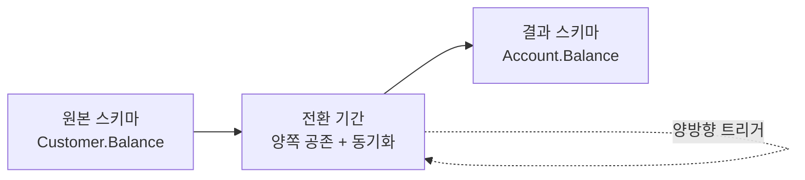

import { Callout, Steps, Step, Tabs, TabsList, TabsTrigger, TabsContent } from '@/components/writing-ui';

## 이게 뭔데

Move Column은 이름 그대로다. **컬럼 하나를 데이터까지 통째로 들어서 다른 테이블로 옮기는 것**이다. 컬럼 정의만 베껴 넣는 게 아니라, 그 안에 들어 있던 값도 같이 따라간다.

비유하자면 이사다. 우리 집 거실에 누가 옆집 냉장고를 갖다 놨다고 치자. 코드 짜다 보면 "어, 냉장고를 쓰려면 옆집 거실까지 갔다 와야 하네?" 싶은 순간이 온다. 냉장고는 부엌에 있어야 하고, 잔액(Balance)은 계좌(Account)에 있어야 한다. Move Column은 그 냉장고를 제 집 부엌으로 옮기는 작업이다. 옮기는 동안 냉장고 안의 반찬까지 같이 옮겨야 하니까, 단순히 "냉장고 자리만 비우기"보다 손이 더 간다.

<Callout type="info" title="한 줄 요약">
컬럼을 데이터와 함께 다른 테이블로 옮긴다. 빈 컬럼만 추가하는 게 아니라 값을 한 번 복사하고, 전환 기간 동안 양쪽을 동기화한 뒤, 원본을 떼어낸다.
</Callout>

은행 도메인으로 깔고 가자. 책에 나오는 그 도메인이다. `Customer`(고객)와 `Account`(계좌)가 있고, 한 고객이 여러 계좌를 가진다(1:N). 그런데 어쩌다 보니 `Balance`(잔액) 컬럼이 `Customer`에 박혀 있다. 이게 이번 편 내내 옮길 그 냉장고다.

## 언제 쓰나

여기서 재밌는 게, **Move Column을 부르는 동기가 정반대 둘**이라는 거다. 같은 리팩토링인데 한쪽은 "정규화하자"고, 다른 한쪽은 "비정규화하자"고 외친다. 방향만 반대지 도구는 똑같다.

**동기 1 — 정규화 (중복 줄이기).** `Customer.Balance`라는 설계를 보자. 고객 한 명이 계좌를 세 개 가졌으면 잔액이 세 개여야 하는데, `Customer`에 컬럼이 하나뿐이니 잔액을 도대체 어디에 적냐는 문제가 생긴다. 합쳐서 적나? 마지막 계좌 걸 적나? 어느 쪽이든 정보가 뭉개진다. 잔액은 명백히 **계좌의 속성**이지 고객의 속성이 아니다. 엉뚱한 테이블에 얹혀 있으니 제 집인 `Account`로 보내자. 이게 정규화 방향이다.

**동기 2 — 비정규화 (조인 줄이기).** 정반대 상황도 있다. 어떤 값이 논리적으로는 A 테이블에 속하는데, 실무에서 맨날 B 테이블이랑 같이 조회된다고 해보자. 화면을 띄울 때마다 A랑 B를 조인해야 하고, 그 조인이 핫패스에서 자꾸 걸린다면, 그 컬럼을 아예 B로 옮겨서 조인 자체를 없애버리는 선택을 할 수 있다. 정규화 점수는 깎이지만 읽기 성능을 산다.

**동기 3 — 분할 테이블 재조정.** 테이블을 쪼개거나(Split Table) 합치는(Merge Table) 와중에 "이 컬럼은 이쪽이 맞네" 하고 자리를 다시 잡는 경우다. 큰 구조조정의 부품으로 끼어든다.

<Callout type="note" title="방향을 정하는 건 '데이터를 어떻게 쓰느냐'다">
정규화냐 비정규화냐는 신념이 아니라 측정으로 정한다. 조인이 실제 병목인지 `EXPLAIN`으로 확인하고, 중복이 실제 갱신 이상(update anomaly)을 일으키는지 보고 정한다. "왠지 깔끔해서"는 동기가 아니다.
</Callout>

### 현실 시나리오

신입 때 짠 스키마라고 치자. 고객 가입 화면 만들면서 `Customer` 테이블에 이것저것 다 때려넣었다. 이름, 주소, 그리고 무슨 생각이었는지 `Balance`까지. 그땐 "고객당 계좌 하나"라는 가정이 머릿속에 있었으니 별 문제 없어 보였다.

반년 뒤, 기획이 바뀐다. "고객 한 명이 입출금 계좌랑 적금 계좌를 따로 가질 수 있게 해주세요." `Account` 테이블이 새로 생기고 1:N 관계가 붙는다. 근데 `Balance`는 여전히 `Customer`에 있다. 이제부터 코드가 미친다.

```sql
-- 계좌별 잔액을 보여줘야 하는데 잔액은 고객에 하나뿐...
SELECT a.account_id, c.balance   -- ??? 어느 계좌의 잔액인데?
FROM Account a
JOIN Customer c ON c.customer_id = a.customer_id;
```

이 쿼리가 말이 안 되는 순간, `Balance`가 집을 잘못 찾았다는 게 확정된다. 계좌가 셋이면 `c.balance`는 셋 다한테 같은 값을 뱉는다. Move Column이 답인 전형적인 신호다. **컬럼 값이 그 테이블의 PK가 아니라 다른 무언가에 종속**되기 시작하면, 그건 이사 가야 한다는 뜻이다.

## 주의할 점

<Callout type="warning" title="옮기면 한쪽 비용이 반대쪽으로 넘어간다">
Move Column은 공짜가 아니라 **트레이드오프 교환**이다.

- **정규화 방향**(Customer.Balance → Account.Balance): 중복은 사라지지만, 예전엔 `Customer`만 읽으면 됐던 곳이 이제 `Account`까지 조인해야 한다. **조인이 늘어 읽기가 느려질 수 있다.**
- **비정규화 방향**: 조인은 줄지만 같은 값이 여러 군데 생겨 **갱신 이상과 동기화 부담**이 생긴다.

어느 쪽이든, 전환 기간 동안 양쪽 컬럼이 공존하면 둘이 어긋날 위험이 항상 있다. 동기화 트리거를 잘못 짜면 **순환(트리거 A가 B를 바꾸고 B가 다시 A를 바꾸는 무한 루프)**에 빠진다. 값이 실제로 달라졌을 때만 반대편을 건드리도록 가드를 걸어야 한다.
</Callout>

그리고 하나 더. `Balance` 같은 컬럼은 **돈**이다. 이사 중에 반찬 하나 흘리면 누군가의 잔액이 틀어진다. 이건 칼럼명 오타 고치는 Rename Column과는 무게가 다르다. 복사 전후 합계 검증(reconciliation)을 반드시 끼워야 한다.

## 이렇게 한다

전통적인 책의 절차를 먼저 골격으로 깔고, 그 위에 현대 도구를 얹는다. 큰 그림은 이렇다.



핵심은 **전환 기간(transition period)**이다. 컬럼을 옮기는 순간 모든 코드가 동시에 바뀌어주면 좋겠지만, 현실은 그 컬럼을 읽고 쓰는 앱이 여럿이고 배포 시점도 제각각이다. 그래서 한동안 **원본(`Customer.Balance`)과 신규(`Account.Balance`)가 동시에 살아 있으면서 서로 동기화**된 채로 버틴다. 그 사이 코드를 하나씩 신규 쪽으로 옮기고, 다 옮기면 원본을 떼어낸다.

<Steps>

<Step title="삭제 규칙 / 삽입 규칙 정의">
컬럼이 이사 가면 참조 무결성(RI)도 따라 움직인다. `Account`의 행이 지워질 때 잔액은 어떻게 되나, 새 계좌가 생길 때 초기 잔액은 뭐로 채우나 — 이걸 먼저 정한다. 운이 좋으면 기존 RI 트리거가 이미 이 일을 해줘서 별도 삭제 규칙이 필요 없는 경우도 있다.
</Step>

<Step title="대상 테이블에 컬럼 추가 (expand)">
`Account`에 `Balance` 컬럼을 새로 단다. 이 시점엔 값이 비어 있다(NULL 또는 기본값). 원본은 아직 그대로 둔다.
</Step>

<Step title="데이터 1회 복사 (backfill)">
원본 값을 신규 컬럼으로 한 번 복사한다. UPDATE 한 방.
</Step>

<Step title="양방향 동기화 트리거 도입">
전환 기간 동안 한쪽이 바뀌면 반대쪽도 따라 바뀌게 한다. 순환만 조심.
</Step>

<Step title="접근 프로그램을 신규 컬럼으로 이전">
조인과 SELECT/UPDATE를 하나씩 `Account.Balance` 기준으로 바꾼다.
</Step>

<Step title="원본 제거 (contract)">
모든 코드가 신규를 쓰게 되면 트리거를 떼고 `Customer.Balance`를 드롭한다. 이사 완료.
</Step>

</Steps>

### 스키마 변경 (DDL)

`Account`에 자리를 만든다.

```sql
-- expand: 신규 컬럼을 먼저 추가한다. 원본 Customer.Balance는 그대로.
ALTER TABLE Account
  ADD COLUMN Balance DECIMAL(15,2);
```

### 데이터 마이그레이션 (DML)

원본 값을 신규 컬럼으로 1회 복사한다. 책의 그 UPDATE다. 다만 여기서 **방향성**을 의식해야 한다. 정규화 이동에선 "고객의 잔액 하나"를 "그 고객의 계좌(들)"로 내려보내는 건데, 1:N이면 어느 계좌로 보낼지를 비즈니스 규칙으로 정해야 한다. 가장 흔한 시나리오인 "전환 시점엔 고객당 주 계좌 하나"를 가정하자.

```sql
-- backfill: Customer.Balance → Account.Balance 1회 복사
UPDATE Account a
SET Balance = (
  SELECT c.Balance
  FROM Customer c
  WHERE c.customer_id = a.customer_id
)
WHERE EXISTS (
  SELECT 1 FROM Customer c WHERE c.customer_id = a.customer_id
);
```

복사 끝나면 바로 검증한다. 돈이니까.

```sql
-- reconciliation: 옮긴 값이 원본과 맞는지 확인. 0 행이 나와야 정상.
SELECT a.account_id, a.Balance AS new_val, c.Balance AS old_val
FROM Account a
JOIN Customer c ON c.customer_id = a.customer_id
WHERE a.Balance IS DISTINCT FROM c.Balance;
```

### 양방향 동기화

전환 기간 동안엔 둘이 살아 있다. 누가 `Customer.Balance`를 바꾸면 `Account.Balance`도 따라가야 하고, 그 반대도 마찬가지다. 이게 책이 트리거로 푸는 부분이다. **반드시 "값이 실제로 달라졌을 때만" 반대편을 건드려서 순환을 끊어야 한다.**

<Tabs defaultValue="trigger">
<TabsList>
<TabsTrigger value="trigger">전통: 트리거</TabsTrigger>
<TabsTrigger value="app">현대: 앱 이중 쓰기</TabsTrigger>
<TabsTrigger value="cdc">현대: CDC/outbox</TabsTrigger>
</TabsList>

<TabsContent value="trigger">

책의 방식. DB 트리거로 양쪽을 묶는다. 핵심은 `IS DISTINCT FROM` 가드 — 실제로 바뀐 경우에만 반대편을 갱신해 무한 루프를 막는다.

```sql
-- Customer.Balance가 바뀌면 Account.Balance를 따라 갱신 (PostgreSQL 예시)
CREATE OR REPLACE FUNCTION sync_customer_to_account()
RETURNS trigger AS $$
BEGIN
  IF NEW.Balance IS DISTINCT FROM OLD.Balance THEN
    UPDATE Account
    SET Balance = NEW.Balance
    WHERE customer_id = NEW.customer_id
      AND Balance IS DISTINCT FROM NEW.Balance;  -- 순환 가드
  END IF;
  RETURN NEW;
END;
$$ LANGUAGE plpgsql;

CREATE TRIGGER trg_sync_customer_to_account
AFTER UPDATE OF Balance ON Customer
FOR EACH ROW EXECUTE FUNCTION sync_customer_to_account();
```

반대 방향(`Account` → `Customer`)도 대칭으로 하나 더 만든다. 둘 다 `IS DISTINCT FROM` 가드가 있어야 핑퐁이 멈춘다.

</TabsContent>

<TabsContent value="app">

단일 앱이 잔액을 독점적으로 쓰는 SI 환경이면, 트리거 없이 **애플리케이션이 한동안 양쪽에 같이 쓰는** 방법이 더 단순하고 디버깅하기 쉽다.

```typescript
// 전환 기간: 잔액을 바꿀 때 양쪽을 한 트랜잭션에서 같이 쓴다
async function updateBalance(tx, customerId, accountId, amount) {
  await tx.account.update({
    where: { id: accountId },
    data: { balance: amount },
  });
  // 아직 Customer.Balance를 읽는 코드가 남아 있는 동안만 유지
  await tx.customer.update({
    where: { id: customerId },
    data: { balance: amount },
  });
}
```

읽기는 신규(`Account.Balance`)로 점진 전환하고, 마지막 reader가 사라지면 `Customer` 쓰기 라인을 지운다.

</TabsContent>

<TabsContent value="cdc">

여러 서비스가 잔액을 공유하고, 그중 일부는 우리가 코드를 못 만지는 외부 협력사라면, 트리거보다 **CDC(Debezium 같은)나 outbox 패턴**으로 변경을 흘려 동기화하는 편이 결합도를 낮춘다. `Customer.Balance` 변경 이벤트를 잡아 `Account.Balance`로 반영하는 컨슈머를 둔다. 트리거가 DB 안에서 도는 대신, 동기화 로직이 파이프라인 바깥으로 빠져 관측·재처리가 쉬워진다.

</TabsContent>

</Tabs>

### 접근 프로그램 수정 (코드)

이게 사실 제일 손이 많이 간다. 잔액을 읽고 쓰던 모든 SQL을 `Account` 기준으로 바꿔야 한다. 조인 모양이 바뀐다.

```sql
-- Before: 잔액이 Customer에 있어서 엉뚱하게 Customer를 끌어다 썼다
SELECT a.account_id, c.Balance
FROM Account a
JOIN Customer c ON c.customer_id = a.customer_id;

-- After: 잔액이 Account에 있으니 조인 자체가 사라진다 (비정규화 이동의 이득이 여기서 나옴)
SELECT a.account_id, a.Balance
FROM Account a;
```

위 After를 보면 **단지 잔액 때문에 끌려오던 `Customer` 조인이 통째로 빠졌다.** 컬럼이 제 집을 찾으면 쿼리가 단순해지고, 그 자체가 성능 이득이 되는 경우가 많다. 반대로 정규화 방향이었다면 새 테이블이 조인에 추가됐을 거다. 방향에 따라 조인이 늘기도 줄기도 한다.

### 현대화: expand-contract로 무중단 이동

여기까지가 책의 골격이다. 그런데 2006년 이후 세상이 바뀌었다. 트리거를 손코딩하고 번호 매긴 SQL을 DBA가 야간에 직접 돌리던 시절의 절차를, 지금은 **마이그레이션 도구 + expand-contract(parallel change) 패턴**으로 무중단으로 굴린다. 위 Steps가 사실상 이 패턴의 교과서적 사례다.

- **Expand(확장)** — `Account.Balance` 추가, 백필, 동기화 시작. 이 단계에선 아무 코드도 안 깨진다. 원본이 그대로 살아 있으니까. Flyway/Liquibase/Alembic의 마이그레이션 한 버전으로 묶어 버전 관리·체크섬·롤백까지 도구에 맡긴다.
- **Migrate(이전)** — 앱 코드를 한 배포씩 신규 컬럼으로 옮긴다. 천천히, 카나리아로.
- **Contract(수축)** — 모든 reader/writer가 신규를 쓰면 트리거를 떼고 원본을 드롭한다. 이건 별도 마이그레이션 버전으로, 충분히 기다린 뒤에.

```sql
-- 마이그레이션 V34__expand_move_balance.sql (Flyway 예시)
ALTER TABLE Account ADD COLUMN Balance DECIMAL(15,2);

UPDATE Account a
SET Balance = (SELECT c.Balance FROM Customer c WHERE c.customer_id = a.customer_id);
-- + 동기화 트리거 생성

-- ... (여러 배포에 걸쳐 앱 코드 이전) ...

-- 마이그레이션 V41__contract_drop_old_balance.sql (한참 뒤, 별도 버전)
DROP TRIGGER trg_sync_customer_to_account ON Customer;
ALTER TABLE Customer DROP COLUMN Balance;
```

<Callout type="warning" title="대용량 테이블이면 ADD COLUMN·DROP COLUMN도 함정">
`Account`가 수천만 행이면 `ALTER TABLE ... ADD COLUMN`이나 백필 `UPDATE`가 테이블을 오래 잠글 수 있다. Postgres는 기본값 없는 `ADD COLUMN`이 메타데이터만 바꿔 빠르지만, 백필 UPDATE는 배치로 쪼개 돌리는 게 안전하다. MySQL이면 `gh-ost`나 `pt-online-schema-change`로 온라인 변경을 하고, 마지막 `DROP COLUMN`도 같은 온라인 도구로 처리한다. 백필은 한 방 UPDATE 대신 PK 범위로 나눠 청크 단위로.
</Callout>

ORM을 쓴다면 매핑도 같이 옮긴다. 엔티티 정의에서 `balance` 필드를 `Customer`에서 `Account`로 이사시키고, 마이그레이션 자동 생성을 돌린 뒤 위 백필/동기화 SQL을 손으로 끼워 넣으면 된다. 도구가 DDL은 만들어주지만, **데이터 복사와 동기화 전략은 사람이 정해야 한다.** 거기가 이 리팩토링의 진짜 머리 쓰는 부분이다.

## 정리

Move Column은 "엉뚱한 데 있던 컬럼을 제 집으로 옮기는" 단순한 아이디어지만, 안에 든 게 데이터라 이사가 까다롭다.

> **컬럼만 옮기는 게 아니라, 값을 복사하고, 전환 기간 동안 양쪽을 동기화하고, 그제서야 원본을 떼는 3단 작업이다.**

기억할 건 셋이다. 첫째, **동기가 정규화일 수도 비정규화일 수도 있다** — 방향은 신념이 아니라 측정으로 정한다. 둘째, **전환 기간에 양쪽이 공존하므로 동기화가 필수**고, 트리거든 앱 이중 쓰기든 CDC든 순환만은 반드시 끊는다. 셋째, 현대엔 이 전부를 **expand-contract + 마이그레이션 도구**로 무중단으로 굴린다. 컬럼 하나 옮기는 일에 이렇게까지 싶겠지만, 그 컬럼이 누군가의 잔액이라면 이 정도는 해야 밤에 잘 잔다.
