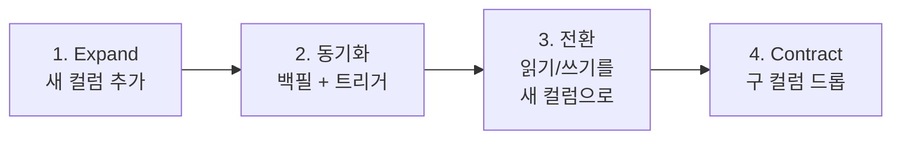
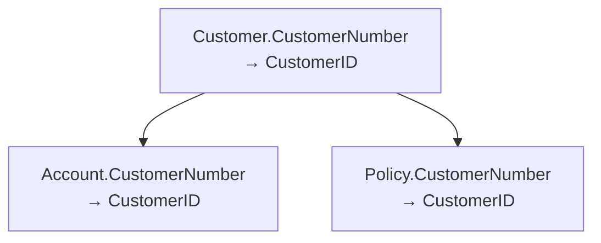

## 이게 뭔데

컬럼 이름 하나 바꾸는 일이다. `FName`을 `FirstName`으로, `user_nm`을 `user_name`으로, `flag1`을 `is_active`로. 정의는 이게 끝이다. 세상에서 제일 간단해 보이는 리팩토링이고, 실제로 SQL 한 줄이면 된다.

```sql
ALTER TABLE Customer RENAME COLUMN FName TO FirstName;
```

비유하자면 명함의 이름 철자를 고치는 거다. 본인은 그대로고, 표기만 바꾸는 거니까. 문제는 그 명함을 받아 간 사람이 100명이고, 그중 몇 명이 그 철자를 자기 수첩에 베껴 적어놨다는 거다. 내가 명함 한 장 고친다고 그 100명의 수첩이 같이 고쳐지진 않는다. 그리고 그 수첩 어딘가에 `SELECT FName FROM Customer`가 적혀 있다.

그래서 이 리팩토링은 **"DB 안에서는 1초, DB 바깥에서는 3주"** 짜리다. 컬럼명 자체는 한 줄로 바뀌지만, 그걸 참조하던 모든 SQL, ORM 매핑, 리포트, FK로 따라온 동명 컬럼들이 줄줄이 깨진다. 이름을 바꾸는 게 어려운 게 아니라, **이름이 바뀌었다는 걸 모르는 코드들과 공존하는 기간**을 견디는 게 어렵다.

<Callout type="warning" title="한 줄 요약">
`RENAME COLUMN` 한 방은 "지금 이 DB를 보는 코드가 나 하나뿐"일 때만 안전하다. 여러 앱·배치·리포트가 같은 컬럼을 보고 있다면, 단일 RENAME은 그 모두를 동시에 깨뜨리는 폭탄이다. 안전하게 하려면 한 줄이 아니라 네 단계로 나눠야 한다.
</Callout>

## 언제 쓰나

동기는 거의 항상 셋 중 하나다.

**가독성.** `flag1`, `col_a`, `nm`, `dt2` 같은 이름은 작성한 사람만 안다. 6개월 뒤엔 그 사람도 모른다. 컬럼명은 그 자체로 문서다. `is_active`, `created_at`, `customer_name`이면 주석 없이도 의도가 읽힌다. 나쁜 이름은 매번 테이블 정의를 열어보게 만드는 세금이다.

**명명 규칙 준수.** 어떤 테이블은 `camelCase`, 어떤 건 `snake_case`, 어떤 건 `CustNo`고 옆 테이블은 `customer_id`. 팀이 커지고 시간이 흐르면 작명이 제멋대로 갈라진다. 한 DB 안에서 같은 개념이 다른 이름으로 불리면, 조인할 때마다 머릿속에서 번역을 해야 한다. Rename Column은 이 표기를 한 줄에 세우는 도구다.

**DB 포팅·예약어 충돌.** Oracle에서 잘 돌던 `comment`, `order`, `level`, `user` 같은 컬럼명이 다른 엔진으로 가면 예약어라 매번 따옴표로 감싸야 하거나 아예 거부당한다. 이럴 때 `comment` → `note`, `order` → `sort_order`로 바꿔주면 포팅 지옥에서 벗어난다.

### 시나리오: 이런 적 있을 거임

은행 시스템이다. `Customer` 테이블에 누가 10년 전에 `FName`, `LName`이라고 만들어 놨다. 신입이 들어와서 묻는다. "이거 First Name이에요 Family Name이에요?" 베테랑이 답한다. "어... First Name일걸? 아마." 아무도 확신을 못 한다. 그날 회의에서 결정이 난다. "`FName`을 `FirstName`으로 바꿉시다. 한 줄이면 되잖아요."

그래서 운영 DB에 `ALTER TABLE Customer RENAME COLUMN FName TO FirstName`을 친다. 0.3초 만에 끝난다. 다들 박수. 그리고 5분 뒤, 야간 정산 배치가 죽는다. 그 배치는 별도 레포에 있는 10년 된 Perl 스크립트였고, `SELECT FName FROM Customer`를 하고 있었다. 30분 뒤, 협력사가 쓰는 리포팅 도구가 죽는다. 그 도구의 SQL은 우리 소스 코드에 있지도 않다. 1시간 뒤, `Account` 테이블을 보던 다른 팀이 슬랙에 글을 올린다. "혹시 Customer 쪽에서 뭐 바꾸셨어요? FK 조인이 깨지는데요."

컬럼 하나 바꿨을 뿐인데, 우리가 존재하는지도 몰랐던 코드 세 군데가 죽었다. 이게 Rename Column의 본질이다. **변경 자체는 사소하고, 영향 범위는 우리가 가진 git grep의 바깥에 있다.**

## 주의할 점

<Callout type="warning" title="단일 RENAME의 함정">
`ALTER TABLE ... RENAME COLUMN`은 원자적이고 즉각적이다. 좋아 보이지만, 그게 정확히 함정이다. 이 명령이 커밋되는 순간 구 이름은 **즉시, 완전히** 사라진다. 유예 기간이 없다. 그 사이 구 이름을 참조하던 모든 것이 동시에 깨진다.

- **우리 레포 밖의 코드는 grep으로 안 잡힌다.** 별도 배치, 협력사 리포트, BI 대시보드, 운영팀 수기 쿼리, 스토어드 프로시저 — 컬럼명은 명명 규칙을 통해 다른 테이블의 동명 컬럼(`Account.CustomerNumber` 등)과도 간접 결합돼 있다.
- **롤백이 또 다른 변경이다.** 깨진 걸 보고 급하게 되돌리려 해도, 되돌리는 RENAME 역시 그사이 새 이름에 맞춰 고쳐놓은 코드를 다시 깨뜨린다. 앞으로도 뒤로도 못 가는 교착에 빠진다.
- **정밀도/의미가 슬쩍 바뀔 수 있다.** `FName`이 정말 First Name이었는지 아무도 확신 못 하는 상태에서 `FirstName`으로 못 박으면, 잘못된 의미가 영구화된다. 이름을 바꾸기 전에 그 컬럼이 실제로 무엇인지부터 확정해야 한다.
</Callout>

그래서 책에서도, 현대 실무에서도 답은 같다. **한 번에 바꾸지 말고, 두 이름을 잠시 공존시켜라.** 이 "잠시 공존"이 바로 expand-contract(=parallel change) 패턴이고, Rename Column은 이 패턴의 교과서적 예제다.

## 이렇게 한다

핵심 아이디어는 **이름을 바꾸는 게 아니라, 새 이름의 컬럼을 옆에 하나 더 만들어서 같은 값을 들고 있게 한 다음, 읽는 쪽을 천천히 옮기고, 마지막에 구 컬럼을 버리는 것**이다. RENAME을 "추가 → 동기화 → 전환 → 삭제"의 네 박자로 분해한다.

먼저 전체 그림.



핵심은 2번과 3번 사이에 **전환 기간(transition period)** 이 존재한다는 거다. 이 기간 동안 `FName`과 `FirstName`은 같은 값을 들고 나란히 산다. 어떤 코드가 어느 쪽을 읽어도 똑같은 답이 나온다. 그래서 코드를 한꺼번에 안 고쳐도 된다. 하나씩, 안전하게 옮기면 된다.

### 1단계 — Expand: 새 컬럼 추가 (DDL)

구 컬럼은 그대로 두고, 새 이름의 컬럼을 추가한다. 이 단계는 기존 코드를 전혀 건드리지 않는다. 아무것도 깨지지 않는다.

```sql
-- 구 컬럼 FName은 그대로 둔다. 새 컬럼만 추가.
ALTER TABLE Customer ADD COLUMN FirstName VARCHAR(40);
```

<Callout type="info" title="PostgreSQL이라면 generated column이 더 깔끔할 때도 있다">
순수하게 "같은 값의 다른 이름"이고 쓰기 경로가 단순하다면, 동기화 트리거 대신 생성 컬럼을 쓸 수 있다.

```sql
ALTER TABLE Customer
  ADD COLUMN FirstName VARCHAR(40)
  GENERATED ALWAYS AS (FName) STORED;
```

이러면 백필도 트리거도 필요 없이 DB가 알아서 `FName`을 따라간다. 다만 generated column은 직접 INSERT/UPDATE가 불가능하니, 전환 기간 동안 **쓰기는 여전히 구 컬럼으로** 들어가야 한다는 제약이 있다. 양방향 쓰기가 필요하면 아래 트리거 방식으로 가야 한다.
</Callout>

### 2단계 — 동기화: 백필 + 양방향 트리거 (DML + 트리거)

먼저 기존 데이터를 한 번에 복사한다(백필).

```sql
-- 기존 행 전부에 대해 1회 복사
UPDATE Customer SET FirstName = FName;
```

대용량 테이블이면 이 `UPDATE`가 테이블을 오래 잠근다. 운영에서는 **배치로 쪼개서** 돌리는 게 정석이다. PK 범위를 나눠 청크 단위로 커밋한다.

```sql
-- 10만 건씩 끊어서 백필 (의사 코드 — 실제론 스크립트 루프로)
UPDATE Customer
   SET FirstName = FName
 WHERE CustomerPOID BETWEEN :start AND :end
   AND FirstName IS NULL;
```

백필이 끝나도 끝이 아니다. 전환 기간 동안 **아직 구 컬럼에 쓰는 코드**가 남아 있다. 그 코드가 `FName`을 갱신하면 `FirstName`은 옛날 값으로 남아 둘이 어긋난다. 그래서 두 컬럼을 실시간으로 묶어주는 동기화 트리거가 필요하다. 한쪽이 바뀌면 다른 쪽도 따라가게.

```sql
-- 양방향 동기화 트리거 (Oracle 문법 예시)
CREATE OR REPLACE TRIGGER SyncCustomerFirstName
BEFORE INSERT OR UPDATE ON Customer
FOR EACH ROW
BEGIN
    -- FName이 바뀌었으면 FirstName을 맞춘다
    IF :NEW.FName <> :OLD.FName OR (:OLD.FName IS NULL AND :NEW.FName IS NOT NULL) THEN
        :NEW.FirstName := :NEW.FName;
    -- FirstName이 바뀌었으면 FName을 맞춘다
    ELSIF :NEW.FirstName <> :OLD.FirstName OR (:OLD.FirstName IS NULL AND :NEW.FirstName IS NOT NULL) THEN
        :NEW.FName := :NEW.FirstName;
    END IF;
END;
```

<Callout type="warning" title="트리거 순환 조심">
양방향 동기화에서 가장 흔한 사고가 **트리거 순환**이다. "FName이 바뀌면 FirstName을 갱신" + "FirstName이 바뀌면 FName을 갱신"을 무조건 실행하게 짜면, 한쪽 갱신이 반대쪽 갱신을 부르고 그게 다시 처음을 불러 무한 루프가 된다.

방어법은 **값이 실제로 달라졌을 때만** 반대편을 건드리는 거다. 위 코드처럼 `<>` 비교로 가드를 걸고, 가능하면 `BEFORE` 트리거에서 `:NEW`를 직접 수정해(같은 행을 다시 UPDATE하지 않고) 재귀 자체를 차단한다. `AFTER` 트리거로 같은 테이블을 또 UPDATE하는 방식은 순환에 훨씬 취약하다.
</Callout>

### 3단계 — 전환: 읽기/쓰기를 새 컬럼으로 (접근 프로그램 수정)

이제 두 컬럼이 항상 같은 값을 들고 있으니, 코드를 **하나씩** 새 컬럼으로 옮긴다. 급할 것 없다. 한 번에 다 안 고쳐도 안 깨지니까. 이게 expand-contract의 본질적 이득이다 — **배포를 직렬화하지 않아도 된다.**

임베디드 SQL부터.

```sql
-- Before
SELECT FName FROM Customer WHERE CustomerPOID = :id;
INSERT INTO Customer (CustomerPOID, FName) VALUES (:id, :name);

-- After
SELECT FirstName FROM Customer WHERE CustomerPOID = :id;
INSERT INTO Customer (CustomerPOID, FirstName) VALUES (:id, :name);
```

ORM 매핑이 진짜 expand-contract의 묘미가 드러나는 곳이다. 책의 조언도 동일하다 — **전환기에 두 property를 모두 두었다가 나중에 정리한다.** 한 클래스가 같은 컬럼을 두 이름으로 동시에 노출하게 만들어, 옛 이름을 쓰는 코드와 새 이름을 쓰는 코드가 공존하게 한다.

<Tabs defaultValue="orm">
  <TabsList>
    <TabsTrigger value="orm">ORM 전환기 매핑</TabsTrigger>
    <TabsTrigger value="migration">마이그레이션 도구</TabsTrigger>
  </TabsList>

  <TabsContent value="orm">

```typescript
// 전환기: 구 이름과 새 이름을 둘 다 노출.
// 둘은 같은 값을 가리키므로(DB에서 트리거로 동기화됨)
// 어느 쪽 코드를 호출해도 안전하다.
class Customer {
  // 새 이름 — 앞으로 이걸 쓴다
  @Column({ name: 'FirstName' })
  firstName: string;

  // 구 이름 — 아직 fName을 쓰는 코드를 위한 호환 게터.
  // @deprecated 새 코드는 firstName을 쓸 것
  get fName(): string {
    return this.firstName;
  }
}
```

전환 기간이 끝나 `fName`을 부르는 코드가 0이 되면, 이 게터를 지운다.

  </TabsContent>

  <TabsContent value="migration">

마이그레이션 도구로도 단계를 그대로 표현한다. Rename을 한 파일에 몰아넣지 말고, 단계별 마이그레이션으로 쪼개는 게 핵심이다.

```sql
-- Flyway: V35_1__add_firstname.sql  (expand)
ALTER TABLE Customer ADD COLUMN FirstName VARCHAR(40);

-- V35_2__backfill_firstname.sql     (sync)
UPDATE Customer SET FirstName = FName WHERE FirstName IS NULL;

-- ... 코드 배포로 읽기/쓰기 전환, 충분히 관찰 ...

-- V35_3__drop_fname.sql             (contract — 며칠/몇 주 뒤 별도 릴리스)
ALTER TABLE Customer DROP COLUMN FName;
```

ORM 마이그레이션(Alembic의 `op.alter_column(..., new_column_name=...)`, Rails의 `rename_column`, TypeORM의 `RenameColumn`)은 한 줄로 RENAME을 내준다. 편하지만 그건 곧 **단일 RENAME**이다. 멀티 앱·배치·리포트가 붙은 DB라면 그 한 줄의 편의를 거절하고, 위처럼 add/backfill/drop을 별도 마이그레이션으로 분리해라.

  </TabsContent>
</Tabs>

### FK로 쓰이면 재귀적으로 함께 개명

여기가 Rename Column이 단순 안 끝나는 두 번째 이유다. 바꾸려는 컬럼이 **다른 테이블에서 FK로 참조되고 있으면**, 일관성을 위해 그 동명 컬럼들도 같이 개명하는 게 맞다.

은행 도메인으로 보자. `Customer.CustomerNumber`를 `CustomerID`로 바꾼다 치자. 그런데 `Account`와 `Policy`가 둘 다 `CustomerNumber`라는 FK 컬럼을 들고 `Customer`를 참조하고 있다. `Customer` 쪽만 바꾸면 `Customer.CustomerID = Account.CustomerNumber`처럼 같은 개념이 두 이름으로 갈라져, 오히려 가독성이 더 나빠진다.



그래서 각 참조 테이블에 대해서도 **똑같이 expand-contract를 적용**한다. 각 테이블마다 새 FK 컬럼 추가 → 백필 → 동기화 → 전환 → 드롭. FK 제약 자체도 새 컬럼 쌍을 기준으로 다시 만들어야 한다. 일은 한 테이블 분량의 N배가 되지만, 절차는 동일하다. 이름의 일관성을 얻으려면 그 이름을 쓰는 곳 전부를 데려가야 한다.

### 4단계 — Contract: 구 컬럼 드롭

전환 기간이 끝나는 조건은 명확하다. **구 이름을 참조하는 코드가 0이 되고, 그게 충분히 오래 안정적으로 돌았을 때.** 멀티 앱 환경이면 책의 조언대로 구 컬럼·트리거에 **동일한 드롭 날짜**를 못 박고, 외부 프로그램 수정에 필요한 시간을 넉넉히 줘라.

그날이 오면 정리는 짧다.

```sql
-- 동기화 트리거부터 제거 (이제 한 컬럼만 남으니 불필요)
DROP TRIGGER SyncCustomerFirstName;

-- 구 컬럼 드롭
ALTER TABLE Customer DROP COLUMN FName;
```

이제 `Customer`에는 `FirstName`만 남고, 모든 코드가 그걸 본다. 리팩토링 완료. 처음의 `RENAME` 한 줄로 했다면 0.3초였을 일을, 우리는 며칠~몇 주에 걸쳐 했다. 그리고 그 대가로 **그동안 단 한 건의 장애도 없었다.**

<Callout type="success" title="왜 이 고생을 하나">
단일 RENAME은 "DB를 보는 게 나 하나뿐"일 때 완벽히 정당하다. 작은 단일 앱이고, 마이그레이션과 코드가 같이 배포되고, 다운타임을 허용한다면 그냥 `RENAME` 한 줄 쓰면 된다. 과한 절차는 그 자체로 비용이다.

expand-contract가 빛나는 건 **하나라도 참이면**일 때다 — 같은 컬럼을 여러 앱/배치/리포트가 본다, 무중단 배포가 필수다, 협력사처럼 우리가 통제 못 하는 소비자가 있다, 롤백 가능성을 열어둬야 한다. 이 경우 "잠깐의 컬럼 중복 + 트리거"라는 비용을 내고 "동시 다발 장애 0"을 사는 거다. 거의 항상 남는 장사다.
</Callout>

## 정리

Rename Column은 정의만 보면 한 줄짜리 리팩토링이지만, 실무에서 가장 자주 사고가 나는 구조 리팩토링이다. 이유는 단순하다.

> **이름을 바꾸는 건 쉽다. 이름이 바뀐 걸 모르는 코드들과 공존하는 게 어렵다.**

그래서 핵심은 RENAME을 명령 하나가 아니라 **네 박자(추가 → 동기화 → 전환 → 삭제)** 로 분해하는 거다. 새 컬럼을 옆에 세워 두 이름이 같은 값을 들고 잠시 공존하게 하고, 그 사이 읽고 쓰는 코드를 하나씩 옮긴 뒤, 아무도 안 보게 됐을 때 구 컬럼을 버린다. 2006년 책은 이걸 동기화 트리거로 손코딩했고, 지금 우리는 Flyway/Liquibase의 단계별 마이그레이션, PostgreSQL generated column, ORM의 전환기 이중 매핑으로 같은 일을 더 매끄럽게 한다. 도구는 바뀌었어도 원리는 그대로다.

그러니 컬럼명을 바꾸고 싶어지면, 먼저 물어라. **"이 컬럼을 보는 게 정말 나 하나뿐인가?"** 답이 "아니"이거나 "잘 모르겠는데"라면, 그건 한 줄이 아니라 네 단계로 가야 한다는 신호다.
