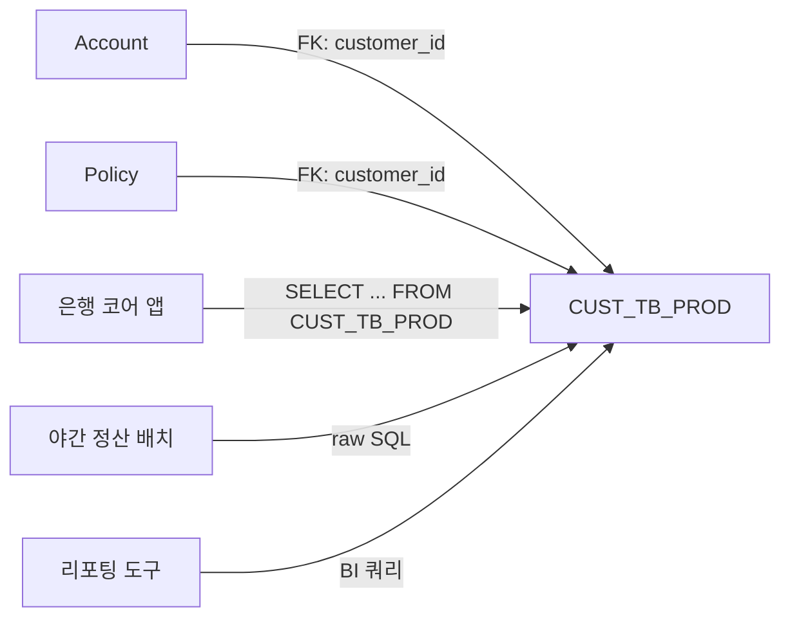
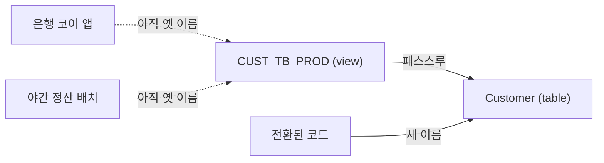
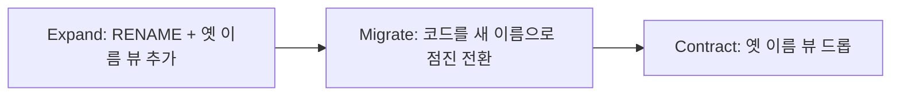

import { Callout, Steps, Step, Tabs, TabsList, TabsTrigger, TabsContent, Icon } from '@/components/writing-ui';

## 이게 뭔데

`CUST_TB_PROD`. 이게 무슨 테이블인지 1초 안에 맞히면 손에 장을 지진다. 고객(Customer) 테이블인데, 2009년에 누가 만들면서 접두사로 `CUST_`, 접미사로 `_TB`(table), 거기에 또 `_PROD`(production이었나 product였나 아무도 모름)를 붙여놨다. 그리고 그 위에 14년치 코드가 쌓였다.

**Rename Table은 그냥 이걸 `Customer`로 고치는 리팩토링이다.** 데이터도 그대로, 컬럼도 그대로, 의미도 그대로. 바뀌는 건 오직 **이름표** 하나다.

비유하자면 회사 신입 시절에 받은 사번 기반 이메일(`emp00417@corp.com`)을 이름 이메일(`jihye.kim@corp.com`)로 바꾸는 거랑 똑같다. 사람은 그대로인데, 받는 사람이 누군지 한눈에 보인다. 문제는 그동안 명함 뿌리고, 이런저런 서비스에 가입하고, 자동이체 걸어둔 데가 한둘이 아니라는 거다. 이메일 주소 하나 바꾸면 그게 다 끊긴다. 테이블 이름도 똑같다. 이름 자체를 바꾸는 건 `ALTER` 한 줄인데, 그 이름을 참조하던 **FK, 인덱스, 뷰, 트리거, 그리고 수십 개 애플리케이션의 SQL**이 전부 그 한 줄에 매달려 있다.

<Callout type="info" title="한 줄 요약">
테이블 이름을 바꾸는 건 쉽다. 어려운 건 그 이름을 알고 있던 모든 것들에게 "나 이름 바꿨어"를 한꺼번에, 무중단으로 알리는 일이다.
</Callout>

## 언제 쓰나

동기는 단순하고 명확하다. **이름이 의도를 못 드러낼 때.** 책에서 드는 이유도 딱 두 가지다 — 의미·의도 명확화, 그리고 명명 규칙 준수.

현실에서 마주치는 냄새는 이렇게 생겼다.

- **접두사·접미사 쓰레기**: `TB_CUSTOMER`, `CUSTOMER_TBL`, `T_CUST`. 테이블인 거 다 안다. `TB` 떼라.
- **약어 화석**: `CUST_INFO`, `ACCT`, `INS_PLCY`. 모음 빼면 멋있는 줄 알던 시절의 유산. `Customer`, `Account`, `InsurancePolicy`로.
- **거짓말하는 이름**: 테이블 이름은 `AccountLog`인데 실제론 모든 거래 트랜잭션이 들어있다. 로그가 아니라 `Transaction`이다. 이름이 거짓말을 하면 신입은 그 거짓말을 믿고 코드를 짠다.
- **명명 규칙 통일**: 어떤 팀은 단수(`Customer`), 어떤 팀은 복수(`Accounts`), 어떤 팀은 스네이크(`insurance_policy`). 새 컨벤션을 정했으면 기존 것도 끌고 와야 일관성이 산다.

<Callout type="note" title="이름은 가장 싼 문서다">
주석은 썩고, 위키는 안 읽고, 설계 문서는 첫날만 본다. 근데 테이블 이름은 쿼리 짤 때마다 강제로 읽힌다. `CUST_TB_PROD JOIN ACCT_BAL_M` 같은 조인을 매일 보는 팀과 `Customer JOIN Account` 조인을 보는 팀은, 1년 뒤 코드 품질이 다르다. 이름값은 매일 복리로 쌓인다.
</Callout>

### 시나리오: 이런 적 있을 거임

은행 시스템 유지보수를 맡았다. 신용 한도 계산 로직을 고치려고 코드를 까보니, 핵심 테이블 이름이 `CUST_TB_PROD`다. 옆자리 10년차한테 물어본다. "이거 고객 테이블 맞죠?" "어... 맞을걸요? 근데 `CUST_TB_DEV`도 있어요. 그건 안 쓰는 건데 무서워서 못 지워요." "...`_PROD`가 production이에요 product예요?" "그건 저도 몰라요. 만든 분 퇴사했어요."

이 대화, 어디서 들어본 것 같지 않나. 테이블 이름 하나가 모르는 사이에 **부족(tribal) 지식**이 돼버린 거다. 신규 입사자는 이걸 알아내려고 반나절을 쓰고, 그 반나절이 매번 반복된다. `CUST_TB_PROD`를 `Customer`로 바꾸는 순간, 이 질문 자체가 영원히 사라진다. 그게 Rename Table의 ROI다.

## 주의할 점

겉보기엔 세상에서 제일 안전한 리팩토링 같다. 데이터를 안 건드리니까. 근데 함정이 있다.

<Callout type="warning" title="테이블 이름은 '간접 결합'의 허브다">
컬럼 하나 바꾸면 그 컬럼 쓰는 코드만 깨진다. 근데 테이블 이름은 다르다. 이 테이블에 걸린 **모든 FK 제약, 모든 인덱스, 이 테이블을 참조하는 모든 뷰·트리거·저장 프로시저, 그리고 모든 애플리케이션의 SQL**이 이름으로 결합돼 있다. `Customer.CustomerNumber`를 바꾸면 `Account`, `Policy`의 동명 컬럼까지 고려해야 한다는 책의 경고가 테이블 레벨에선 더 넓게 적용된다. 이름 하나에 매달린 의존성이 생각보다 넓고 깊다.
</Callout>

특히 조심할 것들:

- **FK 제약 이름**: DB마다 다르지만 FK 제약이 `fk_account_custtbprod` 같이 옛 이름을 박고 만들어진 경우가 많다. 테이블만 바꾸고 제약 이름을 안 바꾸면, 동작은 하는데 또 다른 화석을 남기는 거다.
- **동적 SQL·문자열 조합**: 코드 안에서 테이블 이름을 문자열로 조립하는 부분(`"SELECT * FROM " + tableName`)은 정적 분석으로 안 잡힌다. grep으로도 놓치기 쉽다. 리포팅 도구, ETL 잡, BI 대시보드 안에 박힌 raw SQL이 특히 위험하다.
- **다중 앱 환경**: 이 테이블을 우리 앱만 쓰는 게 아니다. 야간 배치, 정산 시스템, 협력사 연동, 사내 리포트가 다 같은 이름을 알고 있다. 단일 앱이면 RENAME 한 방으로 끝나지만, 여럿이 공유하면 **전환 기간(transition period)** 동안 옛 이름과 새 이름이 둘 다 살아 있어야 한다.

이 마지막 포인트가 두 가지 접근법을 가르는 분기점이다.

## 이렇게 한다

도메인은 은행이다. `CUST_TB_PROD` 테이블을 `Customer`로 바꾼다. `Account`, `Policy` 테이블이 이 테이블을 FK로 참조하고 있다.

먼저 지금 상태를 그림으로 보자.



`Account`, `Policy`는 우리가 같은 마이그레이션에서 고칠 수 있다. 근데 배치랑 리포팅 도구는 우리가 통제 못 한다. 이 차이가 방식을 정한다.

접근법은 두 가지다. 단일 앱이면 (B) updatable view 방식이 압도적으로 깔끔하고, 다중 앱이라 한 번에 못 바꾸면 (A) 새 테이블+트리거 방식이 정석이다.

<Tabs defaultValue="view">
  <TabsList>
    <TabsTrigger value="view">방식 B: RENAME + 뷰 파사드 (권장)</TabsTrigger>
    <TabsTrigger value="trigger">방식 A: 새 테이블 + 양방향 트리거</TabsTrigger>
  </TabsList>

  <TabsContent value="view">

**핵심 아이디어:** 테이블은 진짜로 `RENAME` 한 방에 바꿔버린다. 그리고 옛 이름(`CUST_TB_PROD`)으로 들어오는 쿼리를 받아줄 **갱신 가능한 뷰(updatable view)**를 새 이름 위에 씌운다. 옛 이름을 아는 녀석들은 뷰를 통과해 그대로 동작하고, 우리는 코드를 천천히 새 이름으로 옮긴다. 데이터는 하나뿐이라 동기화 문제가 아예 없다.

이게 바로 **파사드(facade)** 패턴이다. 진짜 객체는 이름을 바꿨지만, 옛 인터페이스를 그대로 유지하는 얇은 껍데기를 하나 둔다.

  </TabsContent>

  <TabsContent value="trigger">

**핵심 아이디어:** 옛 테이블을 그대로 두고, 새 이름의 **새 테이블**을 만든 뒤 양쪽에 데이터를 복사하고, 전환 기간 동안 **양방향 트리거**로 둘을 동기화한다. 어느 쪽에 INSERT/UPDATE/DELETE가 들어와도 반대쪽에 반영된다.

DB가 갱신 가능한 뷰를 지원 안 하거나, 옛 이름 쪽에 INSERT까지 그대로 받아야 하는데 뷰로는 제약이 걸리는 경우, 또는 전환 중 두 테이블을 물리적으로 분리해두고 싶을 때 쓴다. 대신 **트리거 순환(cycle)** 지옥과 동기화 비용을 떠안는다.

  </TabsContent>
</Tabs>

### 방식 B — RENAME + updatable view

단일 앱이거나, 옛 이름을 일정 기간만 호환시켜주면 되는 다중 앱일 때 1순위다.

<Steps>
  <Step title="스키마 변경: 테이블 RENAME">

테이블 자체를 바꾼다. 대부분의 DB가 한 줄로 지원한다.

```sql
-- PostgreSQL / MySQL
ALTER TABLE CUST_TB_PROD RENAME TO Customer;

-- Oracle
ALTER TABLE CUST_TB_PROD RENAME TO Customer;
```

이건 보통 메타데이터만 건드리는 연산이라 거대 테이블이라도 거의 즉시 끝난다(데이터를 안 옮기니까). 단, 짧게 잡히는 락은 있으니 트래픽 적은 시간에 하는 게 안전하다.

  </Step>

  <Step title="옛 이름으로 갱신 가능한 뷰 생성">

옛 이름을 아는 코드들이 끊기지 않게, 옛 이름의 뷰를 새 테이블 위에 얹는다.

```sql
CREATE VIEW CUST_TB_PROD AS
SELECT * FROM Customer;
```

PostgreSQL/Oracle에서 단순 1:1 뷰는 보통 자동으로 갱신 가능(insertable/updatable)하다. 즉 `INSERT INTO CUST_TB_PROD ...`, `UPDATE CUST_TB_PROD ...`가 그대로 `Customer`에 꽂힌다. 자동으로 안 되는 컬럼 매핑이 있으면 `INSTEAD OF` 트리거로 명시적으로 라우팅한다.

```sql
-- 컬럼 매핑이 단순하지 않을 때만 (PostgreSQL 예)
CREATE FUNCTION cust_tb_prod_ins() RETURNS trigger AS $$
BEGIN
  INSERT INTO Customer (customer_id, first_name, balance)
  VALUES (NEW.customer_id, NEW.first_name, NEW.balance);
  RETURN NEW;
END;
$$ LANGUAGE plpgsql;

CREATE TRIGGER cust_tb_prod_ins_trg
  INSTEAD OF INSERT ON CUST_TB_PROD
  FOR EACH ROW EXECUTE FUNCTION cust_tb_prod_ins();
```

이 시점 그림은 이렇다. 데이터는 하나, 옛 이름은 껍데기다.



  </Step>

  <Step title="FK 제약과 인덱스를 새 이름으로 재작성">

RENAME을 하면 대부분의 DB는 FK·인덱스를 자동으로 따라오게 해주지만(데이터 의존성이 OID/내부 ID로 묶여 있어서), **제약·인덱스의 이름**은 옛 이름을 그대로 박고 있는 경우가 많다. 화석을 남기지 않으려면 정리한다.

```sql
-- 옛 이름이 박힌 인덱스/제약 이름 정리
ALTER INDEX idx_custtbprod_email RENAME TO idx_customer_email;

-- Account/Policy가 이 테이블을 참조하는 FK 제약 이름 정리
ALTER TABLE Account
  RENAME CONSTRAINT fk_account_custtbprod TO fk_account_customer;
ALTER TABLE Policy
  RENAME CONSTRAINT fk_policy_custtbprod TO fk_policy_customer;
```

자식 테이블(`Account`, `Policy`)의 FK가 가리키는 대상은 RENAME으로 자동 갱신되니 재생성할 필요는 없다. 이름만 다듬는 거다.

  </Step>

  <Step title="접근 프로그램을 새 이름으로 점진 전환">

이제 코드를 천천히 새 이름으로 옮긴다. 뷰가 옛 이름을 받아주고 있으니 **한 번에 다 안 바꿔도 된다.** 이게 핵심이다.

```sql
-- Before
SELECT customer_id, first_name, balance FROM CUST_TB_PROD WHERE balance > 0;

-- After
SELECT customer_id, first_name, balance FROM Customer WHERE balance > 0;
```

ORM이면 매핑의 테이블명만 바꾼다.

```typescript
// Before (TypeORM)
@Entity({ name: 'CUST_TB_PROD' })
export class Customer { /* ... */ }

// After
@Entity({ name: 'Customer' })
export class Customer { /* ... */ }
```

Hibernate면 `@Table(name = "Customer")`로, JPA 매핑 XML이면 `table=` 속성을 바꾼다. 우리가 통제하는 앱부터 PR로 하나씩 옮기고, 통제 못 하는 배치·리포팅은 담당 팀에 드롭 날짜를 공지한다.

  </Step>

  <Step title="전환 기간 종료: 뷰 드롭">

옛 이름을 참조하는 게 하나도 안 남았다는 게 확인되면(아래 모니터링 참고) 껍데기를 떼낸다.

```sql
DROP VIEW CUST_TB_PROD;
```

끝. 이제 `Customer`만 남는다.

  </Step>
</Steps>

<Callout type="success" title="뷰 방식이 좋은 이유: 데이터가 하나다">
새 테이블+트리거 방식의 모든 고통(동기화 지연, 트리거 순환, 두 벌의 데이터)은 결국 "진실의 원천(source of truth)이 둘"이라서 생긴다. 뷰 방식은 데이터가 물리적으로 한 벌뿐이고, 옛 이름은 그냥 그걸 가리키는 별명일 뿐이다. 동기화할 게 없으니 동기화가 깨질 일도 없다. DB가 updatable view를 지원하면 거의 항상 이쪽이 정답이다.
</Callout>

### 방식 A — 새 테이블 + 양방향 트리거

DB가 갱신 가능 뷰를 못 받쳐주거나, 전환 중 두 테이블을 물리적으로 떼어놔야 하는 특수 상황의 정석 폴백이다. 책의 기본 패턴이기도 하다.

<Steps>
  <Step title="새 이름의 테이블 생성 + 데이터 복사">

```sql
-- 구조 동일한 새 테이블
CREATE TABLE Customer (LIKE CUST_TB_PROD INCLUDING ALL);

-- 데이터 한 번 복사
INSERT INTO Customer SELECT * FROM CUST_TB_PROD;
```

  </Step>

  <Step title="양방향 동기화 트리거 (순환 주의)">

전환 기간 동안 어느 쪽에 써도 반대쪽에 반영돼야 한다. 여기서 **트리거 순환**을 반드시 막아야 한다. 옛 테이블 변경 → 새 테이블 갱신 → 그게 다시 옛 테이블을 갱신 → 무한 루프. 책의 처방대로 **값이 실제로 달라진 경우에만** 반대편을 건드린다.

```sql
-- 옛 → 새 (PostgreSQL 예시, AFTER UPDATE)
CREATE FUNCTION sync_old_to_new() RETURNS trigger AS $$
BEGIN
  -- 이미 같으면 건드리지 않아 순환 차단
  UPDATE Customer
     SET first_name = NEW.first_name, balance = NEW.balance
   WHERE customer_id = NEW.customer_id
     AND (first_name IS DISTINCT FROM NEW.first_name
          OR balance IS DISTINCT FROM NEW.balance);
  RETURN NEW;
END;
$$ LANGUAGE plpgsql;
```

반대 방향(`sync_new_to_old`)도 대칭으로 만든다. INSERT/DELETE까지 양방향으로 다 깔아야 하니, 이미 슬슬 손이 많이 가는 게 보일 거다. 트리거 6개(양방향 × INS/UPD/DEL)를 다 검증해야 한다.

  </Step>

  <Step title="FK·인덱스 재작성, 코드 전환, 전환 종료">

`Account`, `Policy`의 FK를 새 테이블 `Customer`를 가리키도록 다시 만들고(이 방식은 물리적으로 다른 테이블이라 FK 재생성이 필수다), 인덱스도 새 테이블에 맞춰 만든다. 코드를 새 이름으로 옮긴 다음, 전환이 끝나면 **트리거 6개와 옛 테이블 `CUST_TB_PROD`를 드롭**한다.

```sql
ALTER TABLE Account DROP CONSTRAINT fk_account_custtbprod;
ALTER TABLE Account ADD CONSTRAINT fk_account_customer
  FOREIGN KEY (customer_id) REFERENCES Customer(customer_id);
-- ... Policy도 동일
-- 전환 종료
DROP TRIGGER ... ; -- 6개
DROP TABLE CUST_TB_PROD;
```

  </Step>
</Steps>

### 현대 도구로 강화하기

2006년 책은 이걸 손으로 번호 매긴 SQL과 트리거로 했다. 지금은 도구가 절반을 대신한다.

**마이그레이션 도구 = 버전 관리 + 롤백.** Flyway/Liquibase/Alembic은 RENAME과 뷰 생성을 버전 매겨진 마이그레이션 파일로 관리한다. 손으로 SQL 순서를 챙길 필요가 없다.

<Tabs defaultValue="flyway">
  <TabsList>
    <TabsTrigger value="flyway">Flyway</TabsTrigger>
    <TabsTrigger value="liquibase">Liquibase</TabsTrigger>
  </TabsList>

  <TabsContent value="flyway">

```sql
-- V37__rename_custtbprod_to_customer.sql
ALTER TABLE CUST_TB_PROD RENAME TO Customer;
CREATE VIEW CUST_TB_PROD AS SELECT * FROM Customer;

-- (전환 종료 후 별도 마이그레이션)
-- V42__drop_custtbprod_view.sql
DROP VIEW CUST_TB_PROD;
```

뷰 생성과 뷰 드롭을 **별개 마이그레이션**으로 떼어놓는 게 포인트다. 그 사이의 모든 버전에서 옛 이름이 살아 있어, 배포를 단계적으로 굴릴 수 있다.

  </TabsContent>

  <TabsContent value="liquibase">

Liquibase는 `renameTable`이라는 전용 changeset이 있어서 DB 방언 차이까지 흡수해준다.

```xml
<changeSet id="37-rename-customer" author="jh">
  <renameTable oldTableName="CUST_TB_PROD" newTableName="Customer"/>
  <rollback>
    <renameTable oldTableName="Customer" newTableName="CUST_TB_PROD"/>
  </rollback>
</changeSet>
```

`<rollback>`까지 선언해두면, 배포 직후 문제가 터져도 한 명령으로 되돌린다. 책이 말하던 "작은 변경 + 롤백 가능 + 테스트로 신뢰 쌓기" 전략을 도구가 강제해주는 셈이다.

  </TabsContent>
</Tabs>

**expand-contract(parallel change)로 사고를 구조화하자.** 위의 모든 단계는 사실 이 한 패턴의 인스턴스다.



- **Expand** — 새 이름을 추가하되 옛 이름도 살려둔다(뷰). 이 시점엔 둘 다 동작.
- **Migrate** — 읽기/쓰기 코드를 한 배포씩 새 이름으로 옮긴다.
- **Contract** — 옛 이름을 참조하는 게 0이 됐을 때 껍데기를 떼낸다.

**Contract 전에 "정말 0이냐"를 데이터로 확인하자.** 옛 이름을 아직 누가 쓰는지 모른 채 뷰를 드롭하면, 통제 못 하던 배치가 한밤중에 깨진다. DB 로그/감사 기능으로 옛 이름 접근을 모니터링한다.

```sql
-- PostgreSQL: 통계 뷰에서 옛 이름(뷰) 접근 횟수 확인
SELECT relname, seq_scan, idx_scan
FROM pg_stat_user_tables
WHERE relname = 'cust_tb_prod';
-- seq_scan/idx_scan이 한동안 0이면 드롭해도 안전
```

접근 로그가 며칠~몇 주간 0으로 깔리는 걸 확인하고 나서야 Contract 단계로 간다. 다중 앱 환경에서 **드롭 날짜를 미리 공지**하라는 책의 경고가, 여기선 "공지 + 실측 모니터링"으로 업그레이드되는 거다.

<Callout type="info" title="마이크로서비스라면 더 단순할 수도 있다">
테이블 소유권이 한 서비스에 명확히 갇혀 있고, 그 테이블에 다른 서비스가 직접 SQL로 안 붙는다면(붙으면 안 된다, 그게 데이터 소유권 원칙이다) Rename Table은 그 서비스 내부 사정일 뿐이다. 외부엔 API로만 노출되니 테이블 이름이 뭐든 바깥은 모른다. 잘 나뉜 경계는 이 리팩토링의 폭발 반경을 한 서비스 안으로 가둬준다. 반대로, 여러 서비스가 같은 테이블에 raw SQL로 붙어 있다면 그 자체가 더 큰 냄새고, Rename은 그 결합을 드러내는 리트머스다.
</Callout>

## 정리

Rename Table은 리팩토링 카탈로그에서 제일 쉬워 보이는 항목 중 하나다. 데이터 변환도, 의미 변화도 없으니까. 그런데 막상 해보면 **"이름 하나에 얼마나 많은 것들이 매달려 있었는지"**를 깨닫게 되는, 결합도 측정기 같은 작업이다.

> **이름을 바꾸는 건 ALTER 한 줄이다. 어려운 건 그 이름을 알던 모두를 무중단으로 데려가는 일이다.**

방법은 둘로 정리된다. DB가 updatable view를 지원하면 **RENAME + 뷰 파사드**가 정답이다 — 데이터가 한 벌이라 동기화가 깨질 일이 없다. 그게 안 되거나 두 테이블을 물리적으로 떼야 하면 **새 테이블 + 양방향 트리거**로 가되, 트리거 순환만 죽도록 조심한다. 어느 쪽이든 흐름은 expand-contract다 — 옛 이름을 살려둔 채 새 이름을 띄우고, 코드를 옮기고, 아무도 안 쓰는 걸 실측으로 확인한 뒤에야 껍데기를 떼낸다. Flyway/Liquibase가 버전과 롤백을 받쳐주고, `pg_stat_user_tables` 같은 모니터링이 "정말 0이냐"를 증명해준다.

그러니 `CUST_TB_PROD` 같은 이름을 만났을 때, 무서워서 그냥 두지 말자. 작은 변경 하나가 매일 복리로 돌려주는 가독성이 생각보다 크다.
