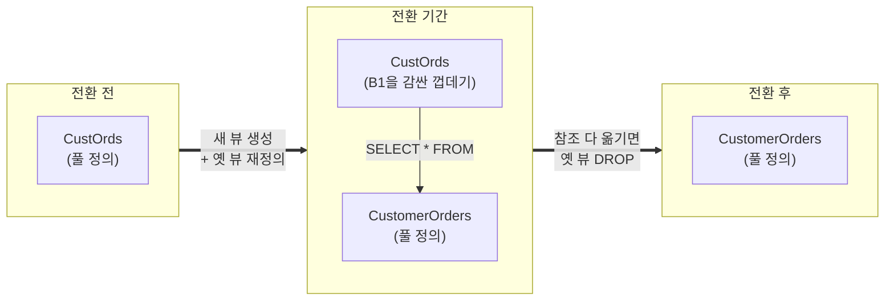

import { Callout, Steps, Step, Tabs, TabsList, TabsTrigger, TabsContent, Icon } from '@/components/writing-ui';

## 이게 뭔데

Rename View. 이름 그대로다. **기존 뷰의 이름을 더 나은 이름으로 바꾸는** 리팩토링이다. 끝. 카탈로그 통틀어 이만큼 마음 편한 항목도 드물다.

생각해보면 그렇잖아. 컬럼 이름 바꾸면 트리거 걸어서 양쪽 동기화하고, 테이블 이름 바꾸면 FK 제약 줄줄이 재작성하고, 데이터 마이그레이션까지 신경 써야 한다. 근데 뷰는? **뷰엔 데이터가 없다.** 뷰는 그냥 "저장된 SELECT 문"일 뿐이다. 옷장에 걸린 옷이 아니라, 옷장으로 가는 길을 적어둔 메모지다. 메모지 제목을 바꾸는 데 옷을 옮길 필요는 없다.

그래서 마이그레이션할 데이터도 없고, 채울 트리거도 없다. 단 하나, 신경 쓸 게 있다면 **그 뷰를 이름으로 부르던 바깥 프로그램들**이다. 메모지 제목을 바꿨는데 누군가 옛 제목으로 그 메모지를 찾고 있으면, 그 사람은 길을 잃는다.

<Callout type="info" title="한 줄 요약">
Rename View는 데이터도 트리거도 마이그레이션도 없다. 진짜 일은 "옛 이름을 쓰던 코드들이 무사히 새 이름으로 넘어오게 하는 것" 하나뿐이다.
</Callout>

## 언제 쓰나

동기는 단순하다. **이름이 그 뷰를 제대로 설명하지 못할 때**다. 두 가지 냄새가 대표적이다.

첫째, 약어와 옛 컨벤션. 누군가 2010년에 `CustOrds`라는 뷰를 만들었다. 그땐 다들 줄여 쓰는 게 미덕이었고, `CUST_TB_PROD` 같은 이름이 사방에 깔려 있었다. 근데 지금 팀 컨벤션은 약어 안 쓰고 풀어 쓰기다. `CustOrds`는 새 코드 사이에서 혼자 옛날 사람처럼 서 있다. 신입이 보면 "Cust... Ords... 이게 뭐 줄임말이지?" 하고 한참 고민한다.

둘째, 이름이 실제 내용과 어긋날 때. `AccountSummary`라는 뷰가 있는데, 정작 들여다보면 고객별 총잔액에 보험 정책까지 조인한 물건이다. 요약이 아니라 거의 360도 고객 뷰다. 이름이 거짓말을 하고 있는 거다. 거짓말하는 이름은 주석보다 위험하다. 주석은 안 읽기라도 하지, 이름은 모두가 믿는다.

<Callout type="note" title="이름은 가장 싼 문서다">
뷰 이름은 그 뷰를 쓰는 모든 개발자가 매일 읽는 문서다. `CustOrds`를 `CustomerOrders`로 바꾸는 건 사소해 보이지만, 앞으로 그 뷰를 쓸 수십 명이 매번 "이게 뭐지"를 0.5초씩 덜 고민하게 만드는 일이다. 가독성 리팩토링의 ROI는 늘 과소평가된다.
</Callout>

### 현실 시나리오

은행 시스템. 누군가 옛날에 고객별 주문 내역을 뽑는 뷰를 `CustOrds`라고 만들어뒀다.

```sql
CREATE VIEW CustOrds AS
SELECT
    c.CustomerID,
    c.FirstName,
    c.LastName,
    o.OrderID,
    o.OrderDate,
    o.TotalAmount
FROM Customer c
JOIN AccountOrder o ON o.CustomerID = c.CustomerID;
```

리포팅 팀이 이걸 갖다 쓴다. 정산 배치도 쓴다. 어느 인턴이 만든 대시보드도 쓴다. 다들 `SELECT ... FROM CustOrds`라고 박아놨다. 그런데 새로 합류한 팀이 코드를 읽다가 묻는다. "CustOrds가 customer orders예요, custom orders예요? Ords가 orders 맞아요?" 답은 customer orders인데, 이걸 매번 설명해야 한다는 게 비용이다.

이름을 `CustomerOrders`로 바꾸고 싶다. 근데 무서운 게 있다. `CustOrds`를 `FROM` 절에 박아둔 코드가 **대체 어디어디에 있는지 아무도 모른다.** 리포팅 SQL, 배치 잡, 그 인턴 대시보드, 그리고 누가 만들었는지도 기억 안 나는 엑셀 ODBC 연결까지. 그냥 `DROP`하고 새로 만들면 그 순간 그것들이 전부 깨진다.

여기서 책이 주는 핵심 통찰이 나온다. **이름을 한 방에 갈아치우지 말고, 잠깐 둘 다 살려둬라.**

## 주의할 점

<Callout type="warning" title="트레이드오프: 가독성 vs. 바깥 코드 수정 비용">
Rename View의 트레이드오프는 깔끔하다. 얻는 건 가독성과 명명 일관성, 치르는 건 그 뷰를 참조하는 외부 프로그램을 전부 찾아 고치는 비용이다. 문제는 후자가 **얼마인지 가늠이 안 된다**는 것. 뷰를 누가 쓰는지는 스키마만 봐선 모른다. 리포트, 배치, BI 도구, 남의 마이크로서비스, 심지어 누가 만든지도 모르는 엑셀 연결까지 — 추적이 안 되는 참조가 깨지는 게 진짜 리스크다. "그까짓 뷰 이름" 하고 가볍게 `DROP CREATE` 했다가 새벽에 정산 배치가 죽는 게 이 항목의 전형적인 사고다.
</Callout>

그래서 이 리팩토링의 무게중심은 DDL이 아니라 **전환 기간(transition period)** 관리에 있다. 책이 제시하는 영리한 트릭이 바로 이거다. 새 이름의 뷰를 진짜 정의로 만들고, **옛 이름의 뷰는 새 뷰를 한 줄로 감싼 얇은 껍데기로 재정의한다.** 그러면 전환 기간 동안 옛 이름으로 부르든 새 이름으로 부르든 똑같은 결과가 나온다. 둘 다 산다.

여기서 가장 흔히 저지르는 실수가 하나 있다. 급한 마음에 두 뷰의 SELECT 본문을 **복붙**해서 둘 다 똑같은 풀 정의로 만들어버리는 거다.

<Callout type="error" title="복붙하면 정의가 두 갈래로 갈라진다">
옛 뷰와 새 뷰에 똑같은 SELECT 문을 각각 박아두면, 나중에 컬럼 하나 추가할 일이 생겼을 때 두 군데를 다 고쳐야 한다. 한 쪽만 고치면 같은 이름의 두 뷰가 다른 데이터를 뱉는다. 디버깅 지옥의 입구다. 반드시 옛 뷰는 새 뷰를 가리키는 한 줄짜리 껍데기로 만들어서, 정의는 **한 곳에만** 존재하게 해라.
</Callout>

## 이렇게 한다

전체 흐름을 그림으로 먼저 보자.



### 스키마 변경 (DDL)

핵심은 세 단계다.

<Steps>
<Step title="동일 정의의 새 뷰를 만든다">
원본 `CustOrds`의 SELECT 본문을 그대로 가져와 새 이름 `CustomerOrders`로 뷰를 생성한다. 이 뷰가 앞으로 정의의 **단일 출처**가 된다.

```sql
CREATE VIEW CustomerOrders AS
SELECT
    c.CustomerID,
    c.FirstName,
    c.LastName,
    o.OrderID,
    o.OrderDate,
    o.TotalAmount
FROM Customer c
JOIN AccountOrder o ON o.CustomerID = c.CustomerID;
```
</Step>

<Step title="원본 뷰를 새 뷰 기반으로 재정의한다">
옛 이름 `CustOrds`를 드롭하지 말고, **새 뷰를 감싸는 한 줄짜리 껍데기**로 다시 만든다. 이렇게 하면 정의가 한 곳(`CustomerOrders`)에만 있고, 변경은 자동으로 옛 이름에도 전파된다.

```sql
CREATE OR REPLACE VIEW CustOrds AS
SELECT * FROM CustomerOrders;
```

이제 `FROM CustOrds`로 부르는 옛 코드도, `FROM CustomerOrders`로 부르는 새 코드도 똑같은 결과를 받는다. 전환 기간 동안 둘 다 산다.
</Step>

<Step title="전환 기간이 끝나면 옛 뷰를 드롭한다">
바깥 참조를 전부 새 이름으로 옮긴 걸 확인한 뒤, 정해둔 드롭 날짜(drop date)에 옛 껍데기를 제거한다.

```sql
DROP VIEW CustOrds;
```

이게 마지막이다. 데이터는 처음부터 끝까지 한 톨도 안 건드렸다.
</Step>
</Steps>

<Callout type="note" title="deprecate를 코드로 남겨라">
2단계와 3단계 사이에 옛 뷰는 "곧 사라질 물건"이다. 이걸 사람 기억에만 맡기지 말자. 옛 뷰 정의에 코멘트(`COMMENT ON VIEW CustOrds IS 'DEPRECATED: 2026-09-01 삭제 예정, CustomerOrders 사용';`)를 박거나, 마이그레이션 PR 설명·이슈 트래커에 드롭 날짜를 명시해라. 다중 애플리케이션 환경이라면 외부 팀이 코드를 고칠 시간을 충분히 줘야 한다.
</Callout>

### 데이터 마이그레이션 (DML)

없다. 뷰엔 데이터가 없으니까. 이 항목이 카탈로그에서 가장 마음 편한 이유다. 다음 섹션으로 넘어가자.

### 접근 프로그램 수정

진짜 일은 여기다. 뷰를 이름으로 부르던 모든 바깥 코드의 참조를 `CustOrds` → `CustomerOrders`로 갈아준다. 임베디드 SQL의 `FROM`/`INTO` 절, ORM 매핑 메타데이터, 리포트 정의, BI 도구 데이터셋까지.

<Tabs defaultValue="sql">
<TabsList>
<TabsTrigger value="sql">SQL / 리포트</TabsTrigger>
<TabsTrigger value="orm">ORM 매핑</TabsTrigger>
</TabsList>

<TabsContent value="sql">

```sql
-- Before
SELECT CustomerID, OrderDate, TotalAmount
FROM CustOrds
WHERE OrderDate >= DATE '2026-01-01';

-- After
SELECT CustomerID, OrderDate, TotalAmount
FROM CustomerOrders
WHERE OrderDate >= DATE '2026-01-01';
```

</TabsContent>

<TabsContent value="orm">

ORM에서 뷰를 읽기 전용 엔티티로 매핑해뒀다면, 테이블명만 새 이름으로 바꾸면 끝이다.

```typescript
// Before
@ViewEntity({ name: 'CustOrds' })
export class CustomerOrders {
  @ViewColumn() customerId: number;
  @ViewColumn() orderDate: Date;
  @ViewColumn() totalAmount: number;
}

// After
@ViewEntity({ name: 'CustomerOrders' })  // 이름만 교체
export class CustomerOrders {
  @ViewColumn() customerId: number;
  @ViewColumn() orderDate: Date;
  @ViewColumn() totalAmount: number;
}
```

</TabsContent>
</Tabs>

문제는 "그 참조가 다 어디 있느냐"다. 추적되는 코드(우리 리포지토리 안의 SQL·매핑)는 전역 검색으로 잡으면 된다.

```bash
# 리포지토리 전체에서 옛 뷰 이름을 쓰는 곳을 한 방에 찾는다
grep -rni '\bCustOrds\b' ./src ./reports ./batch
```

#### 현대 실무로 강화하기

2006년 책은 이 과정을 손으로 SQL 번호 매겨가며 굴렸다. 지금은 더 안전하게 할 수 있다.

**1. expand-contract로 굴려라.** 위 3단계는 사실 expand-contract(parallel change) 패턴 그 자체다. 한 번에 갈아치우지 않고 (1) 새 이름을 **추가**하고(expand), (2) 참조를 천천히 옮긴 뒤, (3) 옛 이름을 **제거**한다(contract). 옛 뷰를 껍데기로 살려두는 게 expand 단계의 핵심이다. 무중단 배포의 정석이고, 뷰 리네임은 이 패턴을 연습하기에 가장 안전한 케이스다.

**2. 마이그레이션 도구에 단계를 나눠 담아라.** Flyway/Liquibase 같은 도구를 쓴다면, 한 마이그레이션에 전부 몰아넣지 말고 expand와 contract를 **별개 버전**으로 쪼갠다.

<Tabs defaultValue="flyway">
<TabsList>
<TabsTrigger value="flyway">Flyway</TabsTrigger>
<TabsTrigger value="liquibase">Liquibase</TabsTrigger>
</TabsList>

<TabsContent value="flyway">

```sql
-- V37.1__add_customer_orders_view.sql  (expand: 지금 배포)
CREATE VIEW CustomerOrders AS
SELECT c.CustomerID, c.FirstName, c.LastName,
       o.OrderID, o.OrderDate, o.TotalAmount
FROM Customer c
JOIN AccountOrder o ON o.CustomerID = c.CustomerID;

CREATE OR REPLACE VIEW CustOrds AS
SELECT * FROM CustomerOrders;
```

```sql
-- V42.1__drop_legacy_custords_view.sql  (contract: 몇 스프린트 뒤)
DROP VIEW CustOrds;
```

</TabsContent>

<TabsContent value="liquibase">

```sql
--changeset jh:37-add-customer-orders-view
CREATE VIEW CustomerOrders AS
SELECT c.CustomerID, c.FirstName, c.LastName,
       o.OrderID, o.OrderDate, o.TotalAmount
FROM Customer c
JOIN AccountOrder o ON o.CustomerID = c.CustomerID;
--rollback DROP VIEW CustomerOrders;

--changeset jh:37-wrap-legacy-custords
CREATE OR REPLACE VIEW CustOrds AS SELECT * FROM CustomerOrders;
--rollback DROP VIEW CustOrds;
```

</TabsContent>
</Tabs>

expand 마이그레이션을 먼저 배포하면, 코드를 한 줄도 안 고친 상태에서도 시스템은 멀쩡히 돈다(옛 뷰가 살아 있으니까). 그 안전한 상태에서 참조를 옮기고, contract는 충분히 시간을 둔 뒤 별도 PR로 내보낸다. 롤백도 쉽다. contract를 되돌려도 옛 뷰가 부활할 뿐, 잃을 데이터가 없다.

**3. 추적 안 되는 참조는 모니터링으로 잡아라.** 진짜 골치는 우리 코드 밖의 참조다. 옛 뷰를 드롭하기 전에, **누가 아직도 `CustOrds`를 부르는지** 관측하고 싶다. DB 쿼리 통계를 활용하자.

```sql
-- PostgreSQL: pg_stat_statements로 옛 뷰를 아직 부르는 쿼리가 있는지 확인
SELECT query, calls, last_call
FROM pg_stat_statements
WHERE query ILIKE '%CustOrds%'
ORDER BY last_call DESC;
```

며칠~몇 주 지켜봐서 호출이 0으로 떨어지면, 그때 안심하고 드롭한다. "코드는 다 고친 것 같은데 혹시 모를 누군가"를 데이터로 확인하고 넘어가는 거다. 감으로 드롭하지 말자.

<Callout type="info" title="마이크로서비스라면 뷰는 계약이다">
여러 서비스가 같은 DB를 공유하고 뷰를 인터페이스로 쓰고 있다면, 뷰 이름은 단순 이름이 아니라 서비스 간 **계약**이다. 이때 Rename View는 API 버저닝과 똑같이 다뤄야 한다. 옛 뷰를 deprecated 버전으로 한동안 유지하고, 드롭 날짜를 소비 팀에 공지하고, 합의된 기간이 지난 뒤 contract한다. 옛 뷰를 껍데기로 살려두는 트릭이 여기서 빛을 발한다 — 소비 서비스를 하나도 안 깨고 새 이름을 먼저 풀어놓을 수 있으니까.
</Callout>

## 정리

Rename View는 카탈로그에서 가장 겁낼 게 없는 항목이다. 뷰는 데이터가 아니라 저장된 SELECT라서, 마이그레이션도 트리거도 없다. 핵심 기법은 딱 하나로 요약된다.

> **새 이름이 정의의 단일 출처가 되고, 옛 이름은 새 뷰를 감싼 한 줄짜리 껍데기로 살아남는다.**

이 한 줄짜리 껍데기가 전부다. 덕분에 옛 코드를 하나도 안 깨고 새 이름을 먼저 풀어놓을 수 있고(expand), 참조를 천천히 옮긴 뒤(transition), 호출이 0으로 떨어진 걸 확인하고 옛 이름을 제거할 수 있다(contract). 정의를 복붙해 두 갈래로 가르지만 않으면, 그리고 추적 안 되는 참조를 모니터링으로 확인하고 드롭하기만 하면, 이 리팩토링은 정말로 마음 편하다.

겁낼 건 뷰 이름이 아니라, 그 이름을 부르는 보이지 않는 코드들이다. 그것만 챙기면 된다.
