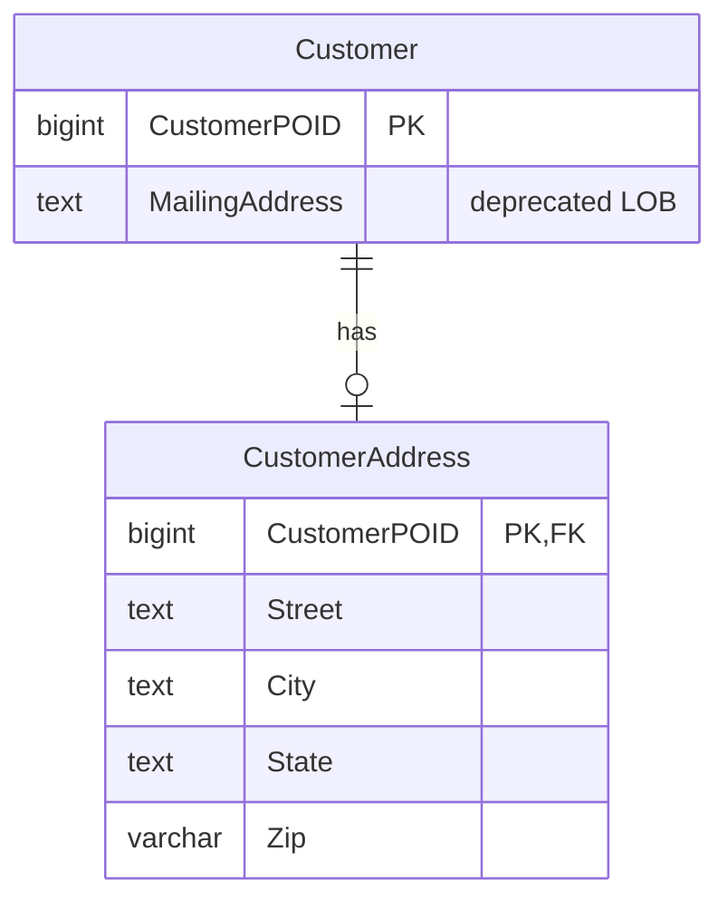

import { Callout, Steps, Step, Tabs, TabsList, TabsTrigger, TabsContent, Icon } from '@/components/writing-ui';

## 이게 뭔데

**Replace LOB With Table은, 한 컬럼에 통째로 쑤셔넣었던 구조화 데이터(XML, JSON, 직렬화된 BLOB)를 풀어헤쳐서 진짜 테이블이나 개별 컬럼으로 바꿔주는 리팩토링이다.**

비유하자면 이사 박스다. 처음엔 빠르다. "주방 물건 전부"라고 적힌 박스 하나에 냄비, 그릇, 수저, 양념통을 다 때려넣는다. 짐 싸는 데 1분이면 끝나. 그런데 새 집에서 간장 하나가 필요해진 날, 그 박스를 통째로 열어서 바닥까지 다 헤집어야 간장을 꺼낼 수 있다. 게다가 누가 "우리 집 양념통이 몇 개야?"라고 물으면 답을 못 한다. 박스 안을 일일이 세기 전엔 모르거든.

DB에서 그 박스가 바로 LOB 컬럼이다. `Customer.MailingAddress`에 주소를 통째로 XML 한 덩어리로 박아뒀는데, 어느 날 "서울 사는 고객만 뽑아줘"라는 요청이 온다. 그 순간 박스를 열어야 한다.

<Callout type="info" title="한 줄 요약">
LOB은 "통째로 넣고 통째로 꺼낼 때"는 최고다. 하지만 그 안의 한 조각을 검색하거나, 인덱스 태우거나, 다른 앱이 따로 쓰려는 순간 박스를 풀어야 한다. 그게 Replace LOB With Table이다.
</Callout>

## 언제 쓰나

동기는 한 문장으로 끝난다. **LOB 안의 일부를 개별 데이터 요소로 다뤄야 할 때.**

처음 그 컬럼을 만든 사람을 욕하지 말자. LOB 한 방에 넣는 건 합리적인 선택이었을 가능성이 높다. 주소든 설정이든 외부 시스템 응답이든, "어차피 한 덩어리로 받아서 한 덩어리로 보여주기만 할 거"라면 컬럼 하나가 제일 싸고 빠르다. 스키마 고민도 없고, 새 필드가 생겨도 ALTER TABLE 안 쳐도 되고. 책에서 XML을 단일 컬럼에 그냥 저장하는 게 "흔하다"고 한 게 괜히 한 말이 아니다.

문제는 **요구사항이 박스 안으로 들어가기 시작할 때** 생긴다.

- "특정 우편번호 고객한테만 안내문 보내야 해" — WHERE 절이 박스 안을 봐야 한다.
- "주소를 시/도, 시/군/구, 도로명으로 쪼개서 통계 내줘" — GROUP BY가 박스 안을 봐야 한다.
- "배송팀이 주소 데이터를 따로 쓰고 싶대" — 다른 앱이 박스 안 한 조각만 필요하다.
- "주소 같은데 어떤 건 'Seoul', 어떤 건 '서울', 어떤 건 'SEOUL'이야" — 박스 안에 검증이 없어서 쓰레기가 쌓였다.

이 중 하나라도 들리기 시작하면, 그게 LOB을 풀라는 신호다. 박스 안의 내용물을 **검색·조인·인덱스·검증·공유**해야 하는 순간, 한 덩어리 저장은 비용으로 돌변한다.

### 시나리오: 이런 적 있을 거임

은행 시스템이다. `Customer` 테이블에 `MailingAddress` 컬럼 하나가 있다. 타입은 그냥 TEXT(또는 XML, JSONB). 안에는 이런 게 들어 있다.

```json
{
  "street": "테헤란로 152",
  "city": "서울",
  "state": "서울특별시",
  "zip": "06236"
}
```

3년 동안 아무 문제 없었다. 고객 상세 화면에서 주소를 보여줄 땐 통째로 꺼내서 파싱해 뿌리면 그만이었으니까. 코드도 단순했다. `JSON.parse(customer.mailingAddress)` 한 줄.

그러다 마케팅팀에서 요청이 온다. "서울 06xxx 우편번호 고객들한테 신규 적금 안내 보낼 건데, 명단 좀." 자, 이제 어떻게 뽑지?

```sql
-- 박스를 열어서 뒤지는 수밖에 없다
SELECT * FROM Customer
WHERE MailingAddress LIKE '%"zip": "06%';
```

`LIKE '%...%'`다. 앞에 `%`가 붙는 순간 인덱스는 못 탄다. **고객 600만 명 풀스캔.** 게다가 JSON 안의 공백이나 키 순서가 조금만 달라도 매칭이 깨진다. 운 좋게 JSONB라서 `MailingAddress->>'zip'`으로 깔끔하게 뽑는다 쳐도, 인덱스를 미리 안 걸어뒀으면 결국 풀스캔이다.

여기서 끝이 아니다. 다음 분기엔 "도/시별 고객 분포 대시보드"가 백로그에 올라온다. 그다음엔 배송 자동화팀이 주소를 정규화된 형태로 달라고 한다. 매번 박스를 다시 열고, 매번 파싱 코드를 복붙한다. 이쯤 되면 답은 정해졌다. **박스를 풀어서 진짜 테이블로 만들 때가 됐다.**

## 주의할 점

근데 무작정 풀면 안 된다. LOB을 풀면 잃는 것도 있다.

<Callout type="warning" title="트레이드오프 — 풀면 얻고, 풀면 잃는다">
**단일 LOB 컬럼이 유리한 경우:**
- 구조 전체를 한 번에 읽고 쓰는 게 대부분이다 (상세 화면 통째 표시 등).
- 스키마가 자주 바뀌거나 비정형이다 (필드가 들쭉날쭉한 외부 응답).
- 기존 직렬화/파싱 코드를 그대로 재사용하고 싶다.

**테이블로 분해(shredding)가 유리한 경우:**
- 개별 요소를 검색·조인·집계·인덱싱해야 한다.
- 다른 앱·팀이 그 조각만 따로 쓴다 (데이터 소유권 분산).
- 같은 구조가 여러 곳에 중복 저장돼 있어 정규화로 줄이고 싶다.

**대가:** 분해(LOB → 컬럼)와 재조립(컬럼 → LOB)에 변환 비용과 복잡도가 붙는다. 통째로 읽던 화면은 이제 조인을 해야 한다. 그러니 "전부 다 풀어야 한다"가 아니라 **"검색·공유가 필요한 조각만"** 풀어야 한다. 안에 또 구조가 있으면(주소 안에 여러 연락처 배열) 그 부분은 재귀적으로 다시 이 리팩토링을 적용한다.
</Callout>

한 가지 더. 현대 DB는 책이 쓰이던 2006년과 다르다. Postgres의 JSONB, MySQL의 JSON 타입은 **컬럼을 안 풀고도** 안을 인덱싱할 수 있다. 그래서 선택지가 둘이 아니라 셋이다.

<Tabs defaultValue="lob">
  <TabsList>
    <TabsTrigger value="lob">그냥 LOB</TabsTrigger>
    <TabsTrigger value="indexed">LOB + 인덱스</TabsTrigger>
    <TabsTrigger value="table">테이블로 분해</TabsTrigger>
  </TabsList>
  <TabsContent value="lob">
원래 모습. `MailingAddress` 한 컬럼에 JSON 덩어리. 통째 읽기엔 최고, 안을 검색하면 풀스캔. 스키마 자유도는 만점.
  </TabsContent>
  <TabsContent value="indexed">
JSONB로 두되 자주 찾는 경로에만 인덱스를 건다. 풀지 않고도 검색이 빨라진다. 조인이나 타 앱 공유, 컬럼 단위 제약(NOT NULL, CHECK)이 필요 없을 때 가성비가 좋다. 책에는 없던 현대적 중간 단계다.
  </TabsContent>
  <TabsContent value="table">
책의 정공법. 별도 테이블이나 개별 컬럼으로 분해. 검색·조인·집계·제약·소유권 분산 다 되지만, 스키마가 고정되고 변환 비용이 붙는다. 진짜 관계형 시민이 된다.
  </TabsContent>
</Tabs>

<Callout type="note" title="먼저 물어볼 것: 정말 풀어야 하나?">
검색만 빠르면 된다면 분해까지 갈 것 없이 JSONB 인덱스 하나로 끝날 수 있다. 분해는 "다른 앱이 이 조각을 쓴다", "컬럼 단위 무결성 제약이 필요하다", "이 구조 자체로 조인을 건다" 같은 이유가 있을 때 정당화된다. 인덱스 한 줄로 될 일에 테이블 마이그레이션을 벌이지 말자.
</Callout>

## 이렇게 한다

진짜로 분해하기로 했다 치자. 핵심은 **빅뱅으로 갈아엎지 않는 것**이다. LOB과 분해된 테이블을 한동안 **동시에** 유지하면서, 양쪽을 동기화하고, 코드를 천천히 옮기고, 마지막에 LOB을 떼낸다. 책의 "전환 기간(transition period) + 양방향 동기화" 그대로이고, 현대 용어로는 **expand-contract(parallel change)** 패턴이다.

목표 스키마는 이렇다. `Customer.MailingAddress`(LOB)를 `CustomerAddress`라는 자식 테이블로 분해한다.



<Steps>
  <Step title="목표 테이블 스키마 결정">
LOB 안의 어떤 조각을 컬럼으로 뽑을지 정한다. 주소면 street/city/state/zip. 안에 또 반복 구조(연락처 여러 개)가 있으면 그건 또 다른 자식 테이블로 재귀 적용한다. 여기서 검증 규칙도 같이 정한다 — zip은 5자리, state는 NOT NULL 같은 것. LOB 시절엔 못 걸던 제약을 이제 컬럼 제약으로 건다.
  </Step>
  <Step title="새 테이블 추가 (expand)">
원본 PK(CustomerPOID)를 키로 갖고, 분해된 컬럼들을 담는 테이블을 만든다. 아직 LOB은 안 건드린다. 그냥 빈 테이블 하나 추가하는 거라 운영 무중단이다.
  </Step>
  <Step title="기존 데이터 분해 복사 (백필)">
지금까지 쌓인 LOB을 풀어서 새 테이블에 한 번 채운다. NULL이나 빈 LOB은 행을 안 만든다.
  </Step>
  <Step title="양방향 동기화 (transition period)">
전환 기간 동안 LOB을 쓰는 코드와 테이블을 쓰는 코드가 공존한다. 한쪽이 바뀌면 다른 쪽도 따라가야 한다. LOB이 갱신되면 → 테이블 분해, 테이블이 갱신되면 → LOB 재조립. 트리거(또는 앱 레벨 동기화, 또는 CDC)로 잡는다. **순환 주의** — 분해해서 테이블 쓴 게 다시 LOB을 건드려 또 분해를 부르는 무한 루프가 안 나게, 값이 실제로 달라졌을 때만 반대편을 갱신한다.
  </Step>
  <Step title="인덱스 추가">
이제 zip이나 city로 검색할 거니까 인덱스를 건다. LOB 시절 `LIKE '%...%'` 풀스캔이 진짜 인덱스 탐색이 된다.
  </Step>
  <Step title="접근 코드 이전">
파싱·재조립하던 코드를 테이블 직접 접근으로 하나씩 옮긴다. 전부 옮기고 안정화될 때까지 기다린다.
  </Step>
  <Step title="LOB 컬럼 드롭 (contract)">
모든 앱이 테이블로 넘어왔고, 합의된 drop date가 지나면 동기화 트리거와 LOB 컬럼을 떼낸다. 다중 앱 환경이면 가장 늦게 옮기는 앱 기준으로 날짜를 잡는다.
  </Step>
</Steps>

### 스키마 변경 (DDL)

```sql
-- 2단계: 분해 테이블 추가 (expand)
CREATE TABLE CustomerAddress (
    CustomerPOID  BIGINT      NOT NULL,
    Street        TEXT        NOT NULL,
    City          TEXT        NOT NULL,
    State         TEXT        NOT NULL,
    Zip           VARCHAR(10) NOT NULL,
    CONSTRAINT pk_customer_address PRIMARY KEY (CustomerPOID),
    CONSTRAINT fk_customer_address
        FOREIGN KEY (CustomerPOID) REFERENCES Customer (CustomerPOID),
    CONSTRAINT chk_zip CHECK (Zip ~ '^[0-9]{5}$')  -- LOB 시절엔 못 걸던 검증
);
```

### 데이터 마이그레이션 (DML)

책의 `ExtractStreet(...)` 손코딩 함수 대신, JSONB면 DB가 추출을 직접 해준다. 한 번 백필.

```sql
-- 3단계: 기존 LOB을 분해해서 새 테이블로 (백필)
INSERT INTO CustomerAddress (CustomerPOID, Street, City, State, Zip)
SELECT
    c.CustomerPOID,
    c.MailingAddress->>'street',
    c.MailingAddress->>'city',
    c.MailingAddress->>'state',
    c.MailingAddress->>'zip'
FROM Customer c
WHERE c.MailingAddress IS NOT NULL          -- NULL은 행 안 만듦
  AND c.MailingAddress->>'street' IS NOT NULL;
```

운영 테이블이 600만 행이면 이 INSERT 하나가 테이블을 오래 잠글 수 있다. 그땐 PK 범위로 잘라서 배치로 돌린다. `WHERE CustomerPOID BETWEEN 1 AND 100000` 식으로 쪼개고, 완료 후 새로 들어온 데이터는 다음 단계의 동기화가 잡는다.

### 양방향 동기화 — 세 가지 방법

전환 기간 동안 LOB과 테이블을 맞춰주는 부분. 환경에 따라 셋 중 하나를 고른다.

<Tabs defaultValue="trigger">
  <TabsList>
    <TabsTrigger value="trigger">트리거</TabsTrigger>
    <TabsTrigger value="app">앱 레벨</TabsTrigger>
    <TabsTrigger value="cdc">CDC</TabsTrigger>
  </TabsList>
  <TabsContent value="trigger">

DB가 알아서 잡아준다. 여러 앱이 같은 DB를 직접 쓸 때 가장 안전하다. 책의 정공법.

```sql
-- LOB이 바뀌면 -> 테이블로 분해 (한 방향)
CREATE OR REPLACE FUNCTION sync_address_from_lob()
RETURNS TRIGGER AS $$
BEGIN
    -- 순환 방지: 실제로 LOB이 달라졌을 때만 동작
    IF NEW.MailingAddress IS DISTINCT FROM OLD.MailingAddress THEN
        INSERT INTO CustomerAddress (CustomerPOID, Street, City, State, Zip)
        VALUES (
            NEW.CustomerPOID,
            NEW.MailingAddress->>'street',
            NEW.MailingAddress->>'city',
            NEW.MailingAddress->>'state',
            NEW.MailingAddress->>'zip'
        )
        ON CONFLICT (CustomerPOID) DO UPDATE SET
            Street = EXCLUDED.Street,
            City   = EXCLUDED.City,
            State  = EXCLUDED.State,
            Zip    = EXCLUDED.Zip;
    END IF;
    RETURN NEW;
END;
$$ LANGUAGE plpgsql;

CREATE TRIGGER trg_sync_address_from_lob
    AFTER INSERT OR UPDATE OF MailingAddress ON Customer
    FOR EACH ROW EXECUTE FUNCTION sync_address_from_lob();
```

반대 방향(테이블 → LOB 재조립)도 대칭으로 하나 더 만든다. 핵심은 `IS DISTINCT FROM`으로 **값이 진짜 바뀌었을 때만** 반대편을 건드려 트리거 순환을 끊는 것.

  </TabsContent>
  <TabsContent value="app">

앱이 DB 접근을 독점한다면(마이크로서비스 한 곳이 이 테이블 소유) 트리거 대신 코드에서 둘을 같이 쓴다. 같은 트랜잭션 안에서 LOB과 테이블을 동시에 갱신하면 된다.

```typescript
// 전환 기간: 두 군데 다 쓴다 (parallel write)
await db.transaction(async (tx) => {
  await tx.update(customer)
    .set({ mailingAddress: addr })          // 기존 LOB
    .where(eq(customer.customerPoid, id));

  await tx.insert(customerAddress)          // 새 테이블
    .values({ customerPoid: id, ...addr })
    .onConflictDoUpdate({
      target: customerAddress.customerPoid,
      set: addr,
    });
});
```

장점은 디버깅·테스트가 쉽다는 것. 단점은 그 DB를 건드리는 모든 경로가 이 코드를 거쳐야 한다는 것 — 배치 잡이나 다른 앱이 직접 UPDATE를 치면 동기화가 새니까, 그런 환경이면 트리거가 안전하다.

  </TabsContent>
  <TabsContent value="cdc">

Customer 테이블의 변경 로그(WAL)를 Debezium 같은 CDC로 흘려서, 컨슈머가 분해해 테이블에 쓴다. 동기화 부담을 DB·앱 밖으로 빼고 싶거나, 분해 결과를 다른 서비스로도 보내야 할 때.

```text
Customer (LOB UPDATE)
   -> WAL
   -> Debezium
   -> Kafka topic "customer.changes"
   -> consumer: JSON 분해
   -> CustomerAddress UPSERT  (+ 필요시 다른 서비스로 fan-out)
```

비동기라 약간의 지연(eventual consistency)을 감수해야 하지만, 동기화 로직이 운영 DB 트랜잭션을 무겁게 하지 않고, 분해된 데이터를 여러 소비자가 나눠 쓰기 좋다.

  </TabsContent>
</Tabs>

### 접근 프로그램 수정 (코드)

마지막은 읽는 코드를 바꾸는 일. 파싱이 사라지고 컬럼 직접 접근으로 단순해진다.

```typescript
// Before: 박스를 매번 연다
const customer = await getCustomer(id);
const addr = JSON.parse(customer.mailingAddress);   // 파싱
const seoulZip = addr.zip.startsWith('06');         // 코드로 필터

// 우편번호로 고객 찾기? -> 풀스캔 LIKE 밖엔 답이 없었다
```

```sql
-- After: 인덱스 타는 진짜 검색
SELECT c.CustomerPOID, c.Name, ca.Zip
FROM Customer c
JOIN CustomerAddress ca ON ca.CustomerPOID = c.CustomerPOID
WHERE ca.Zip LIKE '06%';      -- 앞부분 매칭이라 인덱스 탄다
```

일부 레거시 앱이 여전히 원래 LOB 구조를 통째로 원하면, 책 말대로 **재조립용 함수/뷰**를 하나 둔다. 컬럼들을 다시 JSON으로 묶어 예전 모양으로 돌려주는 갱신 가능 뷰나 함수면, 그 앱들은 변경 없이 살 수 있다.

```sql
-- 레거시용: 분해된 컬럼을 옛 LOB 모양으로 재조립
CREATE VIEW CustomerWithAddressLob AS
SELECT
    c.CustomerPOID,
    c.Name,
    jsonb_build_object(
        'street', ca.Street,
        'city',   ca.City,
        'state',  ca.State,
        'zip',    ca.Zip
    ) AS MailingAddress
FROM Customer c
JOIN CustomerAddress ca ON ca.CustomerPOID = c.CustomerPOID;
```

### 안 풀고 인덱스만 — 가벼운 대안

다시 강조. 검색 속도만 문제였다면 **테이블 분해 없이** 끝낼 수도 있다. JSONB를 유지한 채 자주 찾는 경로에만 인덱스를 건다.

```sql
-- zip 경로에만 표현식 인덱스 (B-tree)
CREATE INDEX idx_customer_zip
    ON Customer ((MailingAddress->>'zip'));

-- 또는 JSONB 전체에 GIN (다양한 키로 검색할 때)
CREATE INDEX idx_customer_addr_gin
    ON Customer USING GIN (MailingAddress jsonb_path_ops);
```

여기에 한 발 더, **자주 쓰는 한두 조각만** generated column으로 끄집어내는 절충도 있다. 컬럼처럼 검색·인덱싱되면서 LOB은 그대로 둔다. 전면 분해와 그냥 LOB 사이의 중간 지점이다.

```sql
-- zip만 진짜 컬럼으로 추출 (저장형 생성 컬럼) -> 인덱스 가능
ALTER TABLE Customer
    ADD COLUMN AddressZip VARCHAR(10)
    GENERATED ALWAYS AS (MailingAddress->>'zip') STORED;

CREATE INDEX idx_customer_addr_zip ON Customer (AddressZip);
```

generated column은 원본 LOB에서 자동 계산되니 동기화 트리거가 필요 없다 — DB가 알아서 맞춰준다. "조각 하나만 검색되면 되는데 전체를 풀긴 부담스럽다" 할 때 딱이다.

## 정리

LOB은 죄가 없다. 통째로 넣고 통째로 꺼낼 땐 가장 빠르고 단순한 선택이다. 문제는 박스 안의 한 조각이 **밖으로 불려 나와야 할 때** 시작된다 — 검색되고, 조인되고, 집계되고, 다른 팀이 쓰고, 검증돼야 할 때.

> **LOB을 풀어야 한다는 신호는, 그 안의 한 조각에 WHERE를 걸기 시작할 때 온다.**

그리고 푸는 방법은 전부냐 전무냐가 아니다. 검색만 빠르면 되면 JSONB 인덱스 한 줄, 조각 한둘만 필요하면 generated column, 진짜로 다른 앱과 공유하고 제약을 걸고 조인해야 하면 그때 테이블로 분해한다. 분해할 땐 빅뱅으로 갈지 말고 expand-contract로 — 새 테이블 추가, 백필, 양방향 동기화, 코드 이전, 그리고 마지막에 박스를 떼낸다. 박스를 푸는 데에도 순서가 있다.
