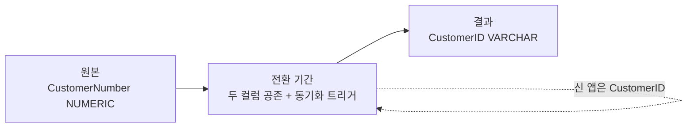

## 이게 뭔데

Replace Column. 한 문장으로 줄이면, **기존 컬럼을 타입이나 포맷이 다른 새 컬럼으로 갈아끼우는 일**이다. 이름은 같은 자리에 그대로 둘 수도 있고 새로 만들 수도 있는데, 핵심은 "담는 그릇의 모양이 바뀐다"는 거다.

비유하자면 이사다. 짐을 버리는 게 아니라(그건 Drop Column이다), 그대로 들고 새 집으로 옮긴다. 단, 새 집은 방 구조가 다르다. 예전엔 정수만 들어가던 방이었는데, 이제는 영문자도 섞인 식별자가 들어가야 한다. 짐을 옮기다 보면 "어? 이건 새 집 벽장에 안 들어가는데?" 하는 물건이 나온다. 그게 바로 이 리팩토링의 진짜 함정 — **타입 변환 과정의 정보 손실**이다.

대상은 **비키(nonkey) 컬럼**이다. 키 컬럼을 바꾸는 건 Introduce Surrogate Key / Replace Surrogate Key 쪽 얘기고, 여기선 그냥 일반 컬럼을 다룬다. 다만 현실에선 그 "일반 컬럼"이 다른 테이블에서 FK로 참조되고 있는 경우가 많아서, 결국 키 비슷한 무게를 짊어지게 된다. 이건 뒤에서 다룬다.

<Callout type="info" title="한 줄 요약">
Replace Column = "이 컬럼, 타입이 용도에 안 맞아졌다. 새 타입의 컬럼으로 데이터를 옮기고, 전환 기간 동안 트리거로 양쪽을 동기화하다가, 다 옮으면 옛 컬럼을 버린다." 옮기는 도중 변환이 깨질 데이터가 없는지가 전부다.
</Callout>

## 언제 쓰나

가장 흔한 트리거는 **용도가 변해서 타입이 안 맞아진 경우**다. 책의 은행 도메인으로 가보자. `Customer` 테이블에 `CustomerNumber`라는 컬럼이 있다. 처음 설계할 때는 그냥 순차 정수였다. `NUMERIC(10)`. 잘 굴러갔다.

그런데 비즈니스가 자란다. 보험 자회사를 인수했더니 그쪽 고객 번호는 `INS-00481` 같은 영숫자 코드다. 제휴 카드사에서 넘어온 고객은 `KB7F20A1`다. 이제 고객 식별자에 **숫자가 아닌 문자가 섞여야** 한다. 그런데 컬럼은 여전히 `NUMERIC`이다. `INS-00481`을 넣으려는 순간 `ALTER`도 안 한 채로 INSERT가 터진다.

이럴 때 답이 Replace Column이다. `NUMERIC(10) CustomerNumber`를 `VARCHAR(20) CustomerID`로 갈아끼운다. 숫자에서 영숫자로.

두 번째 동기는 **데이터 소스 병합의 중간 단계**다. 두 시스템을 합치는데 한쪽은 고객 식별자가 정수, 다른 쪽은 문자열이라고 치자. 그대로는 못 합친다. 합치려면 양쪽 타입·포맷을 먼저 일치시켜야 하고, 그 과정에서 한쪽 컬럼을 다른 타입으로 Replace 하게 된다. Consolidate Key Strategy로 가는 길목에서 자주 등장한다.

<Callout type="note" title="어떤 냄새가 나면 이 리팩토링인가">
- 컬럼에 들어가는 값의 "종류"가 늘었다 (정수만 → 정수 + 문자 코드).
- 애플리케이션 코드 곳곳에 `String(customerNumber)`나 `parseInt(id)` 같은 변환이 덕지덕지 붙기 시작했다.
- 외부에서 들어오는 식별자를 억지로 숫자로 욱여넣느라 `0481`의 앞자리 0이 사라지는 사고가 났다.
- 두 테이블을 조인해야 하는데 한쪽은 `INT`, 다른 쪽은 `VARCHAR`라 암묵적 형변환이 인덱스를 못 타고 있다.

이게 보이면 "컬럼 타입이 용도를 못 따라온 것"이고, Replace Column이 답이다.
</Callout>

## 시나리오: 이런 적 있을 거임

운영 중인 서비스다. `Customer.CustomerNumber`는 `NUMERIC(10)`, 600만 행. 보험 자회사 데이터를 통합하라는 지시가 떨어진다. 그쪽 고객 번호는 `INS-` 접두사가 붙은 영숫자다.

급한 마음에 누군가 이렇게 친다.

```sql
-- "그냥 타입만 바꾸면 되잖아?"
ALTER TABLE Customer ALTER COLUMN CustomerNumber TYPE VARCHAR(20);
```

운이 좋으면 PostgreSQL이 알아서 `NUMERIC → VARCHAR` 변환을 해주긴 한다. 근데 두 가지가 동시에 터진다.

첫째, **대용량 테이블에서 이 한 줄은 테이블 전체를 다시 쓴다**(rewrite). 600만 행을 통째로 갈아엎는 동안 `ACCESS EXCLUSIVE` 락이 걸려서, 그 테이블을 건드리는 모든 쿼리가 줄을 선다. 점심시간에 돌렸다간 슬랙에 불이 난다.

둘째, 더 무서운 건 **반대 방향**이다. 만약 컬럼이 `VARCHAR`였고 이걸 `NUMERIC`으로 바꾸는 상황이었다면, `INS-00481` 같은 비숫자 값이 단 하나라도 있는 순간 변환이 통째로 실패하거나, 더 나쁘게는 그 값들이 조용히 손실된다. 책이 콕 집어 경고하는 지점이 바로 이거다.

<Callout type="warning" title="CHAR → NUMERIC, 비가역적 손실 주의">
타입을 좁히는 방향(`VARCHAR → NUMERIC`, `BIGINT → INT`)은 정보 손실의 지뢰밭이다.

- `VARCHAR`에 `'INS-00481'`이 있으면 `NUMERIC` 변환이 깨진다.
- `'0481'`을 `NUMERIC`으로 옮기면 앞자리 0이 날아가 `481`이 된다 — 식별자였다면 다른 사람이 된 거다.
- `'  481  '`처럼 공백이 섞여 있으면 변환 규칙에 따라 결과가 갈린다.

그래서 좁히는 변환 전에는 **반드시 데이터 품질 점검**이 선행돼야 한다. `SELECT * FROM Customer WHERE CustomerNumber !~ '^[0-9]+$'`로 변환 불가 행을 먼저 세어보고, 0이 아니면 멈춰서 이해관계자와 처리 규칙을 합의해라. 책 표현으로는 "포맷 차이가 크면 사전에 데이터 품질 리팩토링이 필요하다."
</Callout>

이 시나리오의 진짜 교훈은, Replace Column이 "타입만 바꾸는" 단순 작업처럼 보이지만 실은 **데이터 이전 + 호환성 유지 + 무중단**이 얽힌 작은 프로젝트라는 거다. 그래서 책도 이걸 한 방에 끝내지 않고 전환 기간을 둔다.

## 어떻게 진행되나 (전환 기간)

구조 리팩토링의 표준 리듬을 그대로 탄다. **원본 → 전환 기간 → 결과**. 전환 기간 동안엔 옛 컬럼과 새 컬럼이 공존하고, 트리거가 둘을 동기화한다.



이 그림이 중요한 이유. 다중 애플리케이션 환경에선 모든 앱을 동시에 못 고친다. 어떤 앱은 아직 `CustomerNumber`(숫자)를 읽고, 어떤 앱은 벌써 `CustomerID`(문자)를 읽는다. 전환 기간 동안 양쪽이 같은 진실을 보게 하려면 **누가 어느 쪽을 갱신하든 반대편도 따라 갱신돼야** 한다. 그게 동기화 트리거의 일이다.

현대 용어로는 이게 바로 **expand-contract**(또는 parallel change) 패턴이다. 책이 2006년에 트리거로 손코딩하던 그림을, 지금은 마이그레이션 도구와 배포 파이프라인으로 단계화해서 굴린다. 골격은 똑같다.

<Steps>
<Step title="Expand — 새 컬럼 추가">
새 타입의 컬럼을 추가한다. 기존 컬럼은 그대로 둔다. 이 단계는 데이터를 안 건드리므로 안전하고 빠르다.
</Step>
<Step title="Backfill — 기존 데이터 복사 + 변환">
원본 값을 새 포맷으로 변환해 새 컬럼을 채운다. 대용량이면 한 방에 하지 말고 배치로 쪼개 돌린다.
</Step>
<Step title="Sync — 동기화 트리거로 양쪽 유지">
전환 기간 동안 한쪽이 바뀌면 반대쪽도 변환해서 갱신한다. 순환 갱신을 피하는 게 핵심.
</Step>
<Step title="Migrate apps — 접근 프로그램 교체">
읽기/쓰기를 새 컬럼 기준으로 옮긴다. FK로 참조하던 다른 테이블도 함께 교체한다.
</Step>
<Step title="Contract — 옛 컬럼 + 트리거 드롭">
모든 앱이 새 컬럼만 쓰는 게 확인되면, 트리거를 내리고 원본 컬럼을 드롭한다.
</Step>
</Steps>

## 이렇게 한다

### 1. 스키마 변경 (Expand)

새 컬럼을 추가한다. 여기선 `NUMERIC(10) CustomerNumber`를 `VARCHAR(20) CustomerID`로 바꾸는 시나리오다.

```sql
-- 새 컬럼 추가 (기존 CustomerNumber는 일단 그대로)
ALTER TABLE Customer ADD COLUMN CustomerID VARCHAR(20);

-- 원본은 deprecated 표시 — 책에선 코멘트/문서로,
-- 운영에선 보통 마이그레이션 노트나 컬럼 코멘트로 남긴다
COMMENT ON COLUMN Customer.CustomerNumber IS 'DEPRECATED 2026-09-30, replaced by CustomerID';
```

`ADD COLUMN`은 기본값 없이 추가하면 PostgreSQL/대부분의 현대 DB에서 메타데이터만 바꾸는 즉시 작업이라 락이 짧다. (NOT NULL + 기본값을 한 번에 걸면 rewrite가 날 수 있으니, 일단 nullable로 추가하고 백필 후에 제약을 거는 게 무중단의 정석이다.)

### 2. 데이터 마이그레이션 (Backfill)

원본 값을 새 컬럼으로 복사한다. 책의 가장 단순한 형태는 이렇다.

```sql
-- 포맷이 같으면 그냥 복사
UPDATE Customer SET CustomerID = CAST(CustomerNumber AS VARCHAR);
```

근데 핵심은 **포맷 변환**이 끼는 경우다. 예전 숫자 고객번호에 자릿수 패딩과 접두사를 붙여 새 식별자 규칙(`CUS-0000481`)으로 만든다면 이렇게 된다.

```sql
-- 숫자 -> 영숫자 식별자로 포맷 변환하며 백필
UPDATE Customer
SET CustomerID = 'CUS-' || LPAD(CAST(CustomerNumber AS VARCHAR), 7, '0')
WHERE CustomerID IS NULL;
```

운영 테이블이 600만 행이면 위 `UPDATE` 한 방은 거대한 트랜잭션이 돼서 WAL을 폭증시키고 락을 오래 잡는다. **배치로 쪼갠다.**

```sql
-- PK 범위를 잘라 청크 단위로 백필 (애플리케이션/잡에서 루프)
UPDATE Customer
SET CustomerID = 'CUS-' || LPAD(CAST(CustomerNumber AS VARCHAR), 7, '0')
WHERE CustomerPOID BETWEEN :lo AND :hi
  AND CustomerID IS NULL;
```

<Callout type="warning" title="좁히는 변환이면 백필 전에 검증부터">
넓히는 방향(`NUMERIC → VARCHAR`)은 손실이 없지만, 반대로 좁히는 방향이면 백필을 돌리기 전에 변환 불가 데이터를 반드시 먼저 세야 한다.

```sql
-- VARCHAR -> NUMERIC 으로 갈 때: 숫자로 못 바꾸는 값 점검
SELECT CustomerPOID, CustomerNumber
FROM Customer
WHERE CustomerNumber !~ '^[0-9]+$';
```

여기서 한 줄이라도 나오면 백필을 멈춘다. 이 행들을 어떻게 처리할지(매핑 테이블, 별도 보존 컬럼, 데이터 정정)는 도메인 결정이지 DBA 혼자 정할 일이 아니다.
</Callout>

### 3. 동기화 트리거 (Sync)

전환 기간 동안 구/신 컬럼을 양쪽으로 묶는다. 책이 강조하는 함정은 **트리거 순환**이다. A가 바뀌어서 B를 갱신했는데, 그 B 갱신이 다시 트리거를 깨워 A를 갱신하고... 무한 루프. 회피법은 단순하다. **값이 실제로 달라졌을 때만** 반대편을 건드린다.

```sql
CREATE OR REPLACE FUNCTION sync_customer_id()
RETURNS TRIGGER AS $$
BEGIN
  -- 구 컬럼이 바뀌면 -> 신 컬럼을 변환해서 채운다
  IF NEW.CustomerNumber IS DISTINCT FROM OLD.CustomerNumber THEN
    NEW.CustomerID := 'CUS-' || LPAD(CAST(NEW.CustomerNumber AS VARCHAR), 7, '0');
  END IF;

  -- 신 컬럼이 바뀌면 -> 구 컬럼을 역변환해서 채운다 (접두사 제거 후 숫자화)
  IF NEW.CustomerID IS DISTINCT FROM OLD.CustomerID THEN
    NEW.CustomerNumber := CAST(REGEXP_REPLACE(NEW.CustomerID, '^CUS-0*', '') AS NUMERIC);
  END IF;

  RETURN NEW;
END;
$$ LANGUAGE plpgsql;

CREATE TRIGGER trg_sync_customer_id
BEFORE INSERT OR UPDATE ON Customer
FOR EACH ROW EXECUTE FUNCTION sync_customer_id();
```

`IS DISTINCT FROM`이 순환 차단기다. 트리거가 신 컬럼을 채워도 그 값이 이미 같으면 다음 비교에서 안 걸리니 역방향이 안 깨운다. 또 `BEFORE` 트리거에서 `NEW`를 직접 손보면 추가 `UPDATE` 없이 같은 행을 고치므로, 재귀 트리거가 아예 안 돈다.

<Callout type="note" title="트리거가 부담스러우면 CDC/outbox로">
2006년엔 동기화 수단이 사실상 트리거뿐이었다. 지금은 선택지가 있다. 운영 DB에 트리거를 심는 게 부담스럽거나(성능·디버깅·리뷰 비용), 여러 서비스가 같은 테이블을 본다면 **CDC**(Debezium 등)로 변경 로그를 잡아 별도 동기화 워커가 새 포맷으로 변환해 채우는 방식도 있다. outbox 패턴과 묶으면 "원본 갱신 → 이벤트 → 변환 → 신 컬럼"이 애플리케이션 트랜잭션 밖에서 흘러간다. 단, 이건 동기화가 비동기가 된다는 뜻이라 짧은 지연(eventual consistency)을 받아들여야 한다. 단일 앱·단일 DB라면 트리거가 여전히 가장 단순하고 정확하다.
</Callout>

### 4. FK도 함께 교체

이게 Replace Column에서 사람들이 가장 자주 빼먹는 부분이다. `CustomerNumber`가 `Account`, `Policy`, `Insurance` 같은 테이블에서 **FK로 참조되고 있다면**, 그 컬럼들도 같이 새 타입으로 갈아끼워야 한다. 한쪽만 `VARCHAR`로 바꾸면 조인이 `INT = VARCHAR` 암묵 형변환에 걸려 인덱스를 못 타고, 최악엔 RI 제약이 깨진다.

```sql
-- 참조하는 테이블에도 새 타입 컬럼 추가 + 백필 + 동기화
ALTER TABLE Account ADD COLUMN CustomerID VARCHAR(20);

UPDATE Account
SET CustomerID = 'CUS-' || LPAD(CAST(CustomerNumber AS VARCHAR), 7, '0');

-- 전환 종료 시점에 FK 제약을 새 컬럼으로 재작성
-- NOT VALID 로 즉시 추가(기존 행 검증 생략, 락 짧음) 후 별도로 검증
ALTER TABLE Account
  ADD CONSTRAINT fk_account_customer
  FOREIGN KEY (CustomerID) REFERENCES Customer(CustomerID) NOT VALID;

ALTER TABLE Account VALIDATE CONSTRAINT fk_account_customer;
```

`ADD CONSTRAINT ... NOT VALID` 후 `VALIDATE`로 쪼개는 건 무중단의 핵심 기술이다. `NOT VALID`는 신규 행만 검증하며 짧은 락으로 즉시 붙고, `VALIDATE`는 기존 행을 `SHARE UPDATE EXCLUSIVE`(읽기/쓰기 허용)로 훑는다. 한 방에 `ADD CONSTRAINT`만 쓰면 검증 동안 테이블이 통째로 잠긴다.

새 컬럼에 인덱스도 잊지 마라. 조인·조회의 무게가 그쪽으로 옮겨갔으니까.

```sql
-- 운영 중이면 CONCURRENTLY로 (락 없이 인덱스 생성)
CREATE INDEX CONCURRENTLY idx_account_customer_id ON Account(CustomerID);
```

### 5. 접근 프로그램 수정 (Migrate apps)

코드 쪽은 타입·포맷이 바뀐 만큼 손이 간다. 책의 권고는 두 갈래 — 전환기엔 구/신 포맷 변환 어댑터를 두고, 장기적으론 전면 재작업. ORM에선 전환기에 두 프로퍼티를 같이 두는 식이다.

```typescript
// Before: 숫자 고객번호
@Entity()
class Customer {
  @Column({ type: "numeric" })
  customerNumber!: number;
}

// 전환기: 두 프로퍼티 공존 (DB의 두 컬럼에 각각 매핑)
@Entity()
class Customer {
  @Column({ type: "numeric", nullable: true })
  customerNumber!: number | null; // deprecated, 곧 제거

  @Column({ type: "varchar", length: 20 })
  customerId!: string; // 신 식별자
}

// After: 옛 컬럼 제거 후
@Entity()
class Customer {
  @Column({ type: "varchar", length: 20 })
  customerId!: string;
}
```

조심할 코드 냄새 하나. 식별자가 숫자였을 때 묵시적으로 기대던 동작들 — 정렬이 사전순이 아니라 수치순이었다거나, `id + 1`로 다음 번호를 계산했다거나, URL에 `/customer/481`처럼 숫자로 박혀 있었다거나 — 이런 게 영숫자로 바뀌면 조용히 어긋난다. 타입을 바꾸면 **그 타입에 기생하던 가정들**도 같이 점검해라.

### 마이그레이션 도구로 단계화

위 SQL들을 손으로 순서 맞춰 돌리는 대신, Flyway/Liquibase/Alembic 같은 도구로 버전 단위 마이그레이션으로 쪼개 두면 expand-contract가 자연스럽게 배포 단계와 맞물린다.

<Tabs defaultValue="flyway">
<TabsList>
<TabsTrigger value="flyway">Flyway</TabsTrigger>
<TabsTrigger value="liquibase">Liquibase</TabsTrigger>
<TabsTrigger value="alembic">Alembic</TabsTrigger>
</TabsList>

<TabsContent value="flyway">

단계마다 별도 버전 스크립트로 쪼갠다. Expand와 Contract를 다른 배포로 분리하는 게 핵심.

```text
V41__expand_add_customer_id.sql      -- ADD COLUMN + 트리거 생성
V42__backfill_customer_id.sql        -- 배치 백필 (또는 repeatable)
V43__expand_account_fk.sql           -- FK 측 컬럼 추가/백필
-- (여기서 앱 배포: 새 컬럼 읽기/쓰기로 전환)
V50__contract_drop_customer_number.sql  -- 트리거/구 컬럼 드롭
```

</TabsContent>

<TabsContent value="liquibase">

`addColumn` + `sql`(트리거) + 나중 changeset의 `dropColumn`으로 단계를 표현한다. 각 changeset에 `rollback`을 명시해 두면 expand 단계는 안전하게 되돌릴 수 있다.

```text
changeset: expand-add-customer-id   (addColumn CustomerID)
changeset: create-sync-trigger      (sql ...)
changeset: backfill-customer-id     (sql UPDATE ... , runInTransaction:false)
-- 앱 배포 후
changeset: contract-drop-number     (dropColumn CustomerNumber)
```

</TabsContent>

<TabsContent value="alembic">

`op.add_column` / `op.drop_column`을 서로 다른 리비전으로 나눈다. 백필은 `op.execute`로 청크 루프를, 또는 데이터 마이그레이션 전용 리비전으로 분리.

```python
# revision: expand
def upgrade():
    op.add_column("customer",
        sa.Column("customer_id", sa.String(20), nullable=True))
    # 트리거/백필은 별도 리비전 권장

# revision: contract (별도 파일, 앱 배포 후 적용)
def upgrade():
    op.drop_column("customer", "customer_number")
```

</TabsContent>
</Tabs>

도구가 바뀌어도 책의 골격은 그대로다 — **새 컬럼 추가 → 백필 → 동기화 → 앱 교체 → 옛 컬럼 드롭**. 도구는 이 순서를 버전·롤백·체크섬으로 안전하게 강제해줄 뿐이다.

## 정리

Replace Column은 "컬럼 타입이 용도를 못 따라왔을 때, 새 타입의 컬럼으로 데이터를 옮겨 갈아끼우는" 구조 리팩토링이다. 숫자에서 영숫자로 가는 게 교과서적 예시고, 데이터 소스를 합칠 때 타입을 맞추는 중간 단계로도 쓰인다.

겉보기엔 `ALTER COLUMN TYPE` 한 줄이지만, 실제로는 세 가지가 얽힌다.

> **변환 시 정보 손실(특히 좁히는 방향), 전환 기간의 양방향 동기화, 그리고 FK를 포함한 연쇄 교체.**

2006년 책이 트리거로 풀던 동기화를, 지금은 expand-contract 패턴과 마이그레이션 도구로 단계화하고, 무중단을 위해 `ADD COLUMN`(nullable) → 배치 백필 → `NOT VALID` FK → `VALIDATE` → `CREATE INDEX CONCURRENTLY`로 락을 잘게 쪼갠다. 도구와 기법은 현대화됐지만 잊지 말아야 할 한 가지는 변하지 않았다 — **좁히는 변환 전엔, 옮겨지지 못할 데이터가 있는지 먼저 세어보고 멈출 줄 알아야 한다.** 짐을 옮기다 벽장에 안 들어가는 물건은, 옮긴 다음에 발견하면 이미 늦었다.
