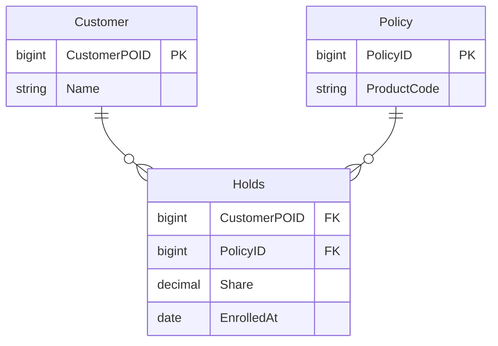

## 이게 뭔데

Replace One-To-Many With Associative Table. 이름은 길지만 핵심은 한 줄이다. **"한 부모에 자식 여럿"이던 1:N 관계를, 그 사이에 다리 테이블 하나를 끼워서 표현하는 것**이다. 자식 테이블이 부모의 PK를 FK로 직접 들고 있던 걸, 둘을 짝지어 적어두는 별도 테이블(연관 테이블)로 옮긴다.

비유하자면 이렇다. 원래는 보험 증권(Policy)마다 "이건 김고객 거야"라고 증권 뒷장에 고객 이름을 직접 적어둔 거다. 증권 하나엔 주인이 딱 한 명. 이걸 리팩토링하면, 증권에서 고객 이름을 지우고 대신 **"누가 무슨 증권을 들고 있는지" 적는 장부 한 권**(`Holds` 테이블)을 새로 판다. 장부엔 "김고객 — P1", "김고객 — P2" 이렇게 짝으로 적힌다.

그러면 묘하게도 능력이 하나 열린다. 장부엔 같은 증권을 두 줄에 적을 수도 있게 된다. "김고객 — P1", "이고객 — P1". 증권 하나에 주인 둘. 즉 1:N이던 관계가 **N:M으로 확장 가능한 구조**로 바뀐다. 게다가 장부의 각 줄에 "지분 50%", "가입일", "수익자 여부" 같은 칸을 더 붙일 수도 있다. 관계 그 자체에 속성을 매다는 거다.

<Callout type="info" title="한 줄 요약">
1:N은 N:M의 부분집합이다. 자식이 부모 FK를 직접 들던 구조를 연관 테이블로 바꾸면, (1) 나중에 N:M으로 자연스럽게 열리고 (2) 관계 자체에 속성을 붙일 자리가 생긴다.
</Callout>

## 언제 쓰나

이 리팩토링이 답이 되는 상황은 크게 둘이다. 둘 다 "지금 1:N인데, 1:N으로는 표현이 안 되는 미래가 보일 때"다.

**첫째, N:M으로 진화할 낌새가 보일 때.** 처음 도메인 모델을 짤 때 "증권 하나엔 가입자 한 명"이라고 못 박았다. 그런데 어느 날 기획에서 공동명의 상품, 부부 합산 보험, 법인 단체보험 얘기가 나온다. 증권 하나에 가입자가 여럿 붙는다. `Policy` 테이블에 `CustomerPOID` FK 하나만 있는 구조로는 이걸 표현할 방법이 없다. 컬럼 하나에 값 하나니까. 이 벽을 넘으려면 결국 사이에 연관 테이블을 끼워야 한다.

**둘째, 관계 자체에 데이터를 붙이고 싶을 때.** 책에서 드는 예가 매트릭스 조직이다. 원래 직원은 부서 하나에 소속(1:N)이었는데, 매트릭스 조직으로 바뀌면서 한 직원이 여러 프로젝트/부서에 걸치게 된다. 그리고 "이 직원이 이 부서에서 차지하는 비중 30%" 같은 값을 어딘가 적어야 한다. 이 "30%"는 직원의 속성도 아니고 부서의 속성도 아니다. **둘 사이 관계의 속성**이다. 1:N FK 구조엔 이걸 둘 곳이 없다. 연관 테이블의 한 행이 바로 그 자리다.

### 현실 시나리오: 이런 적 있을 거임

은행 보험팀. 처음엔 단순했다. 증권(`Policy`) 하나는 고객(`Customer`) 한 명이 가입한다. 그래서 `Policy` 테이블에 `CustomerPOID` 컬럼 하나 박고 끝냈다. 조회도 깔끔하다. 증권 들고 와서 고객 조인 한 방.

```sql
-- 처음엔 이걸로 충분했다
SELECT p.PolicyID, c.Name
FROM Policy p
JOIN Customer c ON c.CustomerPOID = p.CustomerPOID;
```

반년 뒤. 기획서에 한 줄이 떨어진다. "부부 공동 가입 상품 출시. 증권 하나에 주피보험자/종피보험자 둘." 그리고 옆 줄에 작게: "각 가입자별 보장 지분 표시 필요."

개발자는 잠깐 고민한다. `Policy`에 `CustomerPOID2`를 추가할까? 그럼 셋이 되면 `CustomerPOID3`? 지분은 `Share1`, `Share2`? 이게 바로 그 유명한 **반복 그룹(repeating group) 안티패턴**으로 가는 입구다. 컬럼을 옆으로 늘리기 시작하면, 가입자가 다섯이 되는 단체상품이 나오는 순간 스키마가 통째로 무너진다.

정답은 옆으로 늘리는 게 아니라, **세로로 쌓을 수 있는 연관 테이블**을 만드는 거다. 그게 이 리팩토링이다.



## 주의할 점

좋은 도구지만, 아무 1:N에나 막 갖다 대면 안 된다. 이건 명백히 **과잉설계의 위험이 큰 리팩토링**이다.

<Callout type="warning" title="N:M이 안 올 거면 하지 마라">
연관 테이블의 정당성은 거의 전부 "관계가 N:M으로 진화한다" 또는 "관계에 속성이 붙는다"에서 나온다. **이 둘 중 어느 것도 실제로 일어날 일이 없는데** 멋있어 보여서 모든 1:N을 연관 테이블로 바꾸면, 얻는 것 없이 비용만 떠안는다.

- **조인이 한 단계 늘어난다.** `Customer ↔ Policy` 한 번이면 끝나던 게 `Customer ↔ Holds ↔ Policy`로 두 번이 된다. 핫패스 쿼리마다 이 비용이 깔린다.
- **스키마 이해도가 떨어진다.** "이 둘은 그냥 1:N인데 왜 중간 테이블이 있지?" 다음 사람이 헷갈린다. 의도 없는 추상화는 부채다.
- **무결성 보장이 한 겹 약해진다.** 1:N FK는 "증권엔 주인 하나"를 DB가 강제했다. 연관 테이블로 풀면 이 제약은 기본적으로 사라진다. 1:N을 유지하고 싶으면 `Holds.PolicyID`에 별도 UNIQUE 제약을 걸어 "증권당 한 줄"을 막아야 한다. 안 그러면 의도치 않게 N:M이 돼버린다.
</Callout>

판단 기준은 단순하다. **"증권 하나에 사람 여럿"이 실제 요구사항이거나 곧 올 게 확실하면 한다.** "그럴 수도 있지 않을까?" 수준의 막연한 미래 대비라면, 그건 YAGNI(You Aren't Gonna Need It)에 걸린다. 그땐 1:N으로 두고, 진짜 필요해질 때 이 리팩토링을 적용하면 된다. 데이터베이스 리팩토링의 정신 자체가 "필요할 때 작게 바꾼다"니까.

## 이렇게 한다

책의 골격은 명확하다. 연관 테이블 추가 → 원본 FK deprecate → 인덱스 → 양방향 동기화 트리거. 다만 이걸 2006년처럼 트리거 손코딩으로만 풀면 운영 중 서비스엔 위험하다. 여기선 **expand-contract(parallel change)** 패턴으로 옮겨서, 무중단으로 굴리는 현대 절차로 다시 짠다.

핵심 아이디어는 "한 번에 갈아엎지 않는다"는 거다. 새 구조(`Holds`)와 옛 구조(`Policy.CustomerPOID`)를 **한동안 동시에 살려두고**, 둘을 동기화해두면, 옛 구조를 읽는 코드와 새 구조를 읽는 코드가 공존할 수 있다. 모든 코드가 새 구조로 넘어간 뒤에야 옛 컬럼을 떨군다.

<Steps>

<Step title="Expand — 연관 테이블을 만든다 (DDL)">

새 테이블을 추가한다. 이름은 책의 권장대로 관계명(`Holds`)을 쓰거나, 헷갈리면 두 테이블명을 이어 `CustomerPolicy`로 한다. PK는 두 FK의 조합이다.

```sql
CREATE TABLE Holds (
    CustomerPOID BIGINT NOT NULL,
    PolicyID     BIGINT NOT NULL,
    -- 관계 자체의 속성을 여기 매단다
    Share        DECIMAL(5,2) NOT NULL DEFAULT 100.00,
    EnrolledAt   DATE         NOT NULL DEFAULT CURRENT_DATE,
    CONSTRAINT PK_Holds PRIMARY KEY (CustomerPOID, PolicyID),
    CONSTRAINT FK_Holds_Customer FOREIGN KEY (CustomerPOID) REFERENCES Customer(CustomerPOID),
    CONSTRAINT FK_Holds_Policy   FOREIGN KEY (PolicyID)     REFERENCES Policy(PolicyID)
);

-- 양방향 조회를 위한 인덱스. PK가 (Customer, Policy)이므로
-- "증권으로 가입자 찾기"용 보조 인덱스를 따로 깐다
CREATE INDEX IX_Holds_Policy ON Holds (PolicyID, CustomerPOID);
```

<Callout type="note" title="아직 N:M으로 열지 않으려면">
이 시점에 `Holds.PolicyID`에 UNIQUE를 걸면 "증권당 가입자 하나"라는 옛 1:N 제약이 그대로 유지된다. N:M으로 열 준비가 됐을 때 이 UNIQUE를 떼면 된다. 즉 제약 하나의 추가/제거로 1:N ↔ N:M을 오갈 수 있다 — 이게 연관 테이블 구조의 진짜 유연함이다.
</Callout>

FK 제약을 운영 중인 큰 테이블에 거는 건 락 때문에 위험할 수 있다. PostgreSQL이면 `ADD CONSTRAINT ... NOT VALID`로 먼저 무검증으로 붙이고, 트래픽 적은 시간대에 `VALIDATE CONSTRAINT`로 검증만 따로 돌려 풀스캔 락을 피한다.

</Step>

<Step title="데이터 마이그레이션 — 기존 FK를 연관 테이블로 복사 (DML)">

이미 `Policy.CustomerPOID`에 들어 있던 관계를 `Holds`로 한 번 퍼 옮긴다. 변환 로직이랄 게 없다. 기존 1:N은 N:M의 부분집합이니, 행을 그대로 옮기면 된다.

```sql
INSERT INTO Holds (CustomerPOID, PolicyID, Share, EnrolledAt)
SELECT CustomerPOID, PolicyID, 100.00, CURRENT_DATE
FROM Policy
WHERE CustomerPOID IS NOT NULL;
```

Flyway/Liquibase라면 이 INSERT를 버전 마이그레이션 스크립트로 넣어두면 체크섬과 적용 이력까지 관리된다. 직접 SQL을 들고 다닐 일이 없다.

</Step>

<Step title="동기화 — 전환 기간 동안 양쪽을 일치시킨다">

전환 기간엔 옛 컬럼을 읽는 코드와 새 테이블을 읽는 코드가 공존한다. 그래서 한쪽이 바뀌면 다른 쪽도 따라가야 한다. 책은 양방향 트리거로 풀고, 트리거 순환(`Policy` 갱신 → `Holds` 갱신 → 다시 `Policy` 갱신…)을 피하라고 경고한다. 값이 실제로 달라졌을 때만 반대편을 건드리는 게 요령이다.

```sql
-- Policy.CustomerPOID가 바뀌면 Holds를 맞춘다 (1:N 가정 하에서)
CREATE OR REPLACE FUNCTION sync_policy_to_holds() RETURNS TRIGGER AS $$
BEGIN
    -- 실제로 달라진 경우에만 동작 (순환 차단)
    IF NEW.CustomerPOID IS DISTINCT FROM OLD.CustomerPOID THEN
        DELETE FROM Holds WHERE PolicyID = NEW.PolicyID;
        IF NEW.CustomerPOID IS NOT NULL THEN
            INSERT INTO Holds (CustomerPOID, PolicyID)
            VALUES (NEW.CustomerPOID, NEW.PolicyID);
        END IF;
    END IF;
    RETURN NEW;
END;
$$ LANGUAGE plpgsql;
```

<Callout type="warning" title="트리거가 부담스러우면">
운영 DB에서 트리거 양방향 동기화는 디버깅이 고통스럽다. 대안은 **outbox/CDC**. 애플리케이션이 단일 진실 소스(예: `Holds`)에만 쓰고, Debezium 같은 CDC로 변경을 흘려 옛 컬럼을 채우는 컨슈머를 둔다. 동기화 로직이 DB 트리거가 아니라 추적 가능한 애플리케이션 코드로 나오므로 관측·롤백이 쉽다. 동기화 방향이 한쪽이면(앱은 `Holds`에만 쓰고 `Policy.CustomerPOID`는 읽기 호환용으로만 채움) 순환 걱정도 사라진다.
</Callout>

</Step>

<Step title="접근 프로그램 수정 — 코드를 연관 테이블로 옮긴다">

읽기/쓰기 코드를 `Holds` 경유로 바꾼다. 조인이 한 단계 늘어난다.

```sql
-- Before: Policy의 FK로 직접 조인
SELECT p.PolicyID, c.Name
FROM Policy p
JOIN Customer c ON c.CustomerPOID = p.CustomerPOID;

-- After: Holds를 경유
SELECT p.PolicyID, c.Name, h.Share
FROM Policy p
JOIN Holds h    ON h.PolicyID = p.PolicyID
JOIN Customer c ON c.CustomerPOID = h.CustomerPOID;
```

ORM이라면 1:N 매핑을 N:M(또는 연관 엔티티) 매핑으로 바꾼다. 관계에 `Share` 같은 속성이 붙으므로, 단순 다대다 조인 테이블이 아니라 **연관 엔티티(`Holds`를 진짜 엔티티로)** 로 모델링하는 게 보통 옳다.

```typescript
// Before: Policy가 Customer 하나를 들고 있던 1:N
@Entity()
class Policy {
  @ManyToOne(() => Customer)
  customer: Customer;
}

// After: 관계 자체를 엔티티로. Share 같은 속성을 여기 매단다
@Entity()
class Holds {
  @ManyToOne(() => Customer) customer: Customer;
  @ManyToOne(() => Policy)   policy: Policy;

  @Column("decimal", { precision: 5, scale: 2, default: 100 })
  share: number;
}
```

쓰기 코드도 바뀐다. 예전엔 `policy.CustomerPOID = ...` 한 줄로 끝나던 관계 설정이, 이제 `Holds`에 행을 INSERT/DELETE 하는 일이 된다. "FK 한 칸 갱신"에서 "연결 테이블 행 관리"로 사고가 바뀌는 게 이 리팩토링의 본질적 비용이자 본질적 자유다.

</Step>

<Step title="Contract — 옛 구조를 떨군다">

모든 접근 코드가 `Holds`로 넘어갔고, 옛 컬럼을 읽는 곳이 없음을 확인하면(전환 기간의 drop date가 지나면) 동기화 트리거를 떼고 `Policy.CustomerPOID`를 드롭한다.

```sql
DROP TRIGGER IF EXISTS trg_sync_policy_to_holds ON Policy;
ALTER TABLE Policy DROP COLUMN CustomerPOID;
```

이제부터 `Holds`의 `PolicyID` UNIQUE 제약만 떼면 곧장 N:M으로 열린다. 공동명의 상품? `Holds`에 한 줄 더 INSERT 하면 끝이다.

</Step>

</Steps>

<Callout type="success" title="이 리팩토링의 진짜 결과물">
스키마가 N:M으로 "갈 수 있는" 상태가 됐다는 것. 당장 N:M으로 쓰지 않아도, 연관 테이블 + UNIQUE 제약 조합은 "지금은 1:N이지만 제약 하나만 떼면 N:M"이라는 옵션을 손에 쥐여준다. 그리고 관계에 `Share`/`EnrolledAt` 같은 속성을 매달 자리가 생겼다.
</Callout>

## 정리

Replace One-To-Many With Associative Table은 "관계를 일급 시민으로 승격시키는" 리팩토링이다. 자식이 부모 FK를 직접 들던 1:N 구조를, 둘을 짝지어 적는 연관 테이블로 옮긴다.

> **1:N은 N:M의 부분집합이고, 연관 테이블은 그 둘을 잇는 다리다 — 제약 하나로 어느 쪽이든 될 수 있다.**

쓸 만한 자리는 분명하다. N:M으로 진화가 보이거나, 관계 그 자체에 속성("지분", "가입일")을 붙여야 할 때. 반대로 그 둘 중 어느 것도 안 올 거라면, 조인 한 단계와 이해도 비용만 떠안는 과잉설계다. 그러니 모든 1:N에 선제적으로 깔지 말고, 필요가 보일 때 expand-contract로 무중단 전환하는 게 정답이다. 데이터베이스 리팩토링의 미덕은 "지금 필요한 만큼만, 안전하게" 바꾸는 데 있으니까.
