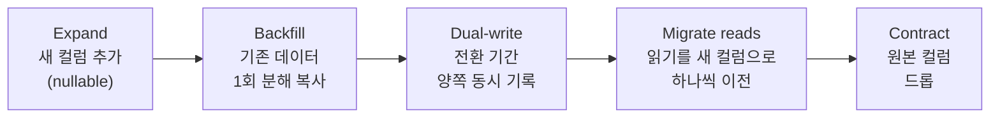

import { Callout, Steps, Step, Tabs, TabsList, TabsTrigger, TabsContent, Icon } from '@/components/writing-ui';

## 이게 뭔데

Split Column은 이름 그대로다. **한 컬럼에 욱여넣어 둔 걸 여러 컬럼으로 가르는 것**. `Customer.Name`에 `"홍 길동"`을 통째로 박아뒀다가 `FirstName` / `MiddleName` / `LastName`으로 쪼개거나, `Status` 컬럼 하나에 "활성/정지" 같은 상태랑 "VIP/일반" 같은 유형을 같이 우겨넣어 놨던 걸 두 컬럼으로 가르는 일이다.

비유하자면 옷장 서랍이다. 처음엔 양말도 속옷도 손수건도 다 한 서랍에 던져 넣는다. 빠르고 편하다. 근데 양이 늘면 매일 아침 서랍을 뒤적이며 양말을 찾게 된다. 결국 칸막이를 사다가 양말 칸, 속옷 칸을 나눈다. Split Column이 딱 그 칸막이 사는 일이다. **데이터가 처음부터 따로였어야 했는데, 귀찮아서 한 칸에 몰아넣어 뒀던 걸 뒤늦게 나누는 것.**

<Callout type="info" title="한 줄 정의">
한 컬럼이 두 가지 이상의 의미를 지고 있으면, 그걸 의미별로 별도 컬럼으로 분리한다. 반대 방향 리팩토링은 Merge Columns다.
</Callout>

## 언제 쓰나

동기는 크게 두 갈래다. 둘은 냄새가 다르니 구분해서 보자.

**1. 세분화가 필요해졌다.** 처음엔 `Name` 한 줄이면 충분했다. 화면에 "홍 길동"이라고 찍기만 하면 됐으니까. 그런데 어느 날 기획에서 "성씨 기준으로 정렬해주세요", "이름만 떼서 '길동님 안녕하세요' 띄워주세요", "외국인 고객 미들네임 따로 받아야 해요"가 들어온다. 이제 `Name`을 통째로 들고 있어서는 답이 없다. 매번 코드에서 공백으로 `split` 떠야 하는데, "홍 길동"은 되지만 "Mary Jane Watson"은 깨지고, "이순신 장군"은 성이 "이순신"이 돼버린다. 이쯤 되면 **데이터 자체를 세분화해서 저장**해야 한다.

**2. 한 컬럼이 이중 용도로 쓰이고 있다.** 이게 더 악질이다. `Account.Status`라는 컬럼이 있는데, 코드를 까보면 이런 값들이 굴러다닌다.

```text
ACTIVE_VIP
ACTIVE_NORMAL
SUSPENDED_VIP
CLOSED_NORMAL
```

`Status` 하나에 **계좌 상태(활성/정지/해지)** 와 **고객 등급(VIP/일반)** 이라는 서로 무관한 두 개념이 인코딩돼 있다. 누군가 "활성 계좌 전부 가져와"를 짜려면 `WHERE Status LIKE 'ACTIVE%'`를 쓰게 되고, "VIP 등급 전부"는 `WHERE Status LIKE '%VIP'`를 쓴다. `LIKE '%VIP'`는 인덱스도 못 탄다. 새 상태값이 하나 생기면 조합이 곱으로 늘어나서 `ACTIVE_VIP`, `SUSPENDED_VIP`... 끝없이 enum이 불어난다. 그리고 언젠가 누군가 `ACTIVE_VlP`(소문자 L과 대문자 I를 헷갈린)를 박아넣고 그 계좌만 VIP 혜택에서 조용히 누락된다.

<Callout type="warning" title="이중 용도 컬럼은 버그 공장">
한 컬럼이 두 가지 독립된 사실을 표현하면, 둘 중 하나만 바꾸고 싶어도 항상 둘을 같이 만져야 한다. 계좌를 정지시키면서 등급은 그대로 두고 싶은데, `SUSPENDED_VIP`라는 값을 새로 만들어 갈아끼워야 한다. 조합 폭발 + 인덱스 무력화 + 오타 한 방에 침묵하는 버그. Split Column은 이 셋을 한 번에 끝낸다.
</Callout>

## 시나리오: 이런 적 있을 거임

은행 고객 테이블이 이렇게 생겼다고 치자.

```sql
CREATE TABLE Customer (
  CustomerID  BIGINT PRIMARY KEY,
  Name        VARCHAR(200) NOT NULL,   -- "홍 길동", "Mary Jane Watson", ...
  Email       VARCHAR(200)
);
```

5년간 잘 굴러갔다. 그러던 어느 날 마케팅팀이 온다. "고객한테 '길동님, 이번 달 캐시백 안내드려요' 이렇게 이름만 넣어서 보내고 싶어요." 너는 자신만만하게 답한다. "그거 한 줄이면 됩니다."

```typescript
const firstName = customer.name.split(' ')[0]; // ...?
```

그리고 잠시 후 깨닫는다. 한국 이름은 성이 앞이라 `split(' ')[0]`이 성씨다. 외국인 고객 `"Mary Jane Watson"`은 `[0]`이 `"Mary"`라 맞는데, 한국인 `"홍 길동"`은 `[0]`이 `"홍"`이라 틀린다. 공백 없이 `"홍길동"`으로 저장된 고객은 split이 안 되고, 어떤 고객은 `" 홍길동"`처럼 앞에 공백이 끼어 있다. 200만 건 데이터에 규칙이 없다.

이 시점에서 진짜 문제가 드러난다. **`Name` 컬럼이 사람 이름이라는 사실은 알지만, 그 안의 구조는 아무도 보장한 적이 없다.** 코드로 아무리 똑똑하게 파싱해도, 원본이 엉망이면 답이 없다. 해법은 파싱 로직을 더 똑똑하게 만드는 게 아니라, **First/Last를 처음부터 따로 받아서 따로 저장**하는 거다. 그게 Split Column이다.

## 주의할 점

쪼개기 전에 한 번 멈춰서 물어봐야 한다. **"이게 진짜 두 가지냐, 아니면 그냥 한 값을 두 군데서 보고 있는 거냐?"**

<Callout type="warning" title="같은 용도였다면 쪼개면 안 된다">
세분화·이중용도가 아니라 그냥 **한 가지 사실을 표현하는 한 값**이라면, 억지로 쪼개는 순간 데이터 중복과 동기화 지옥이 시작된다. 예를 들어 전화번호 `"02-1234-5678"`을 지역번호/국번/번호로 굳이 셋으로 가르면, 다시 합쳐 보여줄 때마다 조립해야 하고 셋이 따로 놀 위험만 생긴다. 그런 경우엔 오히려 Merge Columns(합치기)가 맞다.

판단 기준은 단 하나: **"각 조각을 독립적으로 조회하거나 변경하는 일이 실제로 있느냐?"** 성씨로 정렬하고, 이름만 떼서 인사말에 쓰고, 등급만 바꾸고 싶은 일이 진짜 있으면 쪼갠다. 그런 일이 없는데 "정규화하면 멋있어 보여서" 쪼개는 거면 손대지 마라.
</Callout>

또 하나, 분할은 **검증 책임이 옮겨간다**는 뜻이기도 하다. `Name` 한 컬럼일 땐 "비어 있지 않다" 정도만 봤는데, `FirstName`/`LastName`으로 가르면 둘 다 NOT NULL이어야 하는지, 미들네임은 없을 수 있는지, 옛 데이터 중 한 토막이 비어버리는 케이스는 어떻게 채울지를 다 정해야 한다. 쪼개는 순간 빈칸이 보이기 시작한다. 그게 Split Column의 부수 효과이자 진짜 가치다 — **숨어 있던 데이터 품질 문제가 드러난다.**

## 이렇게 한다

2006년 책은 이 작업을 "새 컬럼 추가 → 분해 트리거 도입 → 전환 기간 동안 양쪽 동기화 → 원본 드롭"으로 손코딩한다. 골격은 지금도 똑같다. 다만 현대엔 트리거를 직접 쓰는 대신, **expand-contract(parallel change)** 패턴과 **생성 컬럼**으로 훨씬 안전하게 굴린다. 핵심 아이디어는 하나다: **읽는 쪽도 쓰는 쪽도 한 번에 갈아엎지 말고, 새 컬럼과 옛 컬럼을 잠시 공존시킨 뒤 천천히 넘어간다.**

전체 흐름을 먼저 그림으로 보자.



이걸 단계별로 따라가 보자. `Customer.Name`을 `FirstName`/`MiddleName`/`LastName`으로 쪼개는 케이스다.

<Steps>

<Step title="새 컬럼을 nullable로 추가한다 (Expand)">

쪼갤 대상 컬럼들을 먼저 추가한다. **반드시 nullable로**, 그리고 NOT NULL 제약은 나중에 붙인다. 지금 NOT NULL로 추가하면 기존 200만 행이 전부 NULL이라 ALTER가 터지거나 테이블을 락 잡고 통째로 다시 쓴다.

```sql
ALTER TABLE Customer ADD COLUMN FirstName  VARCHAR(100);
ALTER TABLE Customer ADD COLUMN MiddleName VARCHAR(100);
ALTER TABLE Customer ADD COLUMN LastName   VARCHAR(100);
```

PostgreSQL이라면 `ALTER TABLE ... ADD COLUMN`은 디폴트가 없으면 메타데이터만 바꾸는 즉시 연산이라 부담이 적다. MySQL 대용량 테이블에서 락이 걱정되면 gh-ost나 pt-online-schema-change로 온라인 변경한다.

</Step>

<Step title="기존 데이터를 1회 분해 복사한다 (Backfill)">

책의 `UPDATE Customer SET FirstName = getFirstName(Name)`이 바로 이 단계다. 다만 200만 건을 한 트랜잭션으로 `UPDATE`하면 락도 오래 잡고 WAL/undo도 폭발한다. **배치로 끊어서** 채운다.

```sql
-- PK 범위로 끊어가며 반복 (10000건씩)
UPDATE Customer
SET FirstName  = split_part(Name, ' ', 1),
    LastName   = split_part(Name, ' ', 2)
WHERE CustomerID BETWEEN :lo AND :hi
  AND FirstName IS NULL;
```

여기서 `split_part`로 끝낼 수 있는 데이터는 운이 좋은 거다. 시나리오에서 봤듯 원본이 엉망이면 백필 단계에서 **파싱 불가능한 행 목록이 그대로 드러난다.** 이건 버그가 아니라 선물이다. 못 쪼갠 행을 따로 뽑아 사람이 보정하거나, 보정 전까지 원본 `Name`을 그대로 살려둔다.

```sql
-- 자동 분해가 실패한(공백 없는, 토큰 3개 이상인) 행 찾기
SELECT CustomerID, Name FROM Customer
WHERE FirstName IS NULL OR array_length(string_to_array(Name, ' '), 1) <> 2;
```

</Step>

<Step title="전환 기간 동안 양쪽에 같이 쓴다 (Dual-write)">

백필이 끝나도 끝이 아니다. 그동안에도 새 고객은 계속 들어오고, 그 INSERT/UPDATE는 여전히 옛 `Name`만 채운다. 전환 기간 동안 **쓰기는 양쪽을 다 채워야** 한다. 방법은 두 가지.

<Tabs defaultValue="generated">
  <TabsList>
    <TabsTrigger value="generated">생성 컬럼 (권장)</TabsTrigger>
    <TabsTrigger value="trigger">동기화 트리거 (책 방식)</TabsTrigger>
  </TabsList>
  <TabsContent value="generated">

새 컬럼을 **생성 컬럼(generated column)** 으로 두면 동기화 코드를 한 줄도 안 짜도 된다. 원본이 바뀌면 DB가 알아서 파생값을 다시 계산한다. 순환 걱정도 없다(파생 컬럼은 쓰기가 불가능하니까).

```sql
-- 원본 Name이 진실, First/Last는 거기서 파생 (PostgreSQL 12+)
ALTER TABLE Customer ADD COLUMN FirstName VARCHAR(100)
  GENERATED ALWAYS AS (split_part(Name, ' ', 1)) STORED;
ALTER TABLE Customer ADD COLUMN LastName VARCHAR(100)
  GENERATED ALWAYS AS (split_part(Name, ' ', 2)) STORED;
```

세분화 케이스에서 "당분간 `Name`이 진실의 원천이고 First/Last는 읽기 전용 파생"으로 갈 거면 이게 제일 깔끔하다. 단, 최종적으로 First/Last를 **직접 편집 가능한 진짜 컬럼**으로 만들 거면 마지막에 생성 컬럼 정의를 떼어내야 한다.

  </TabsContent>
  <TabsContent value="trigger">

First/Last를 처음부터 독립 편집 가능하게 하려면 책처럼 트리거로 양방향 동기화한다. 이때 **트리거 순환**을 반드시 막아야 한다. `Name`이 바뀌면 First/Last를 갱신하고, First/Last가 바뀌면 `Name`을 재조립하는데, 서로가 서로를 트리거하면 무한 루프가 난다. **값이 실제로 달라졌을 때만** 반대편을 건드린다.

```sql
CREATE OR REPLACE FUNCTION sync_customer_name()
RETURNS TRIGGER AS $$
BEGIN
  -- Name이 바뀐 경우에만 분해 (순환 방지)
  IF NEW.Name IS DISTINCT FROM OLD.Name THEN
    NEW.FirstName := split_part(NEW.Name, ' ', 1);
    NEW.LastName  := split_part(NEW.Name, ' ', 2);
  -- First/Last가 바뀐 경우에만 재조립
  ELSIF NEW.FirstName IS DISTINCT FROM OLD.FirstName
     OR NEW.LastName  IS DISTINCT FROM OLD.LastName THEN
    NEW.Name := NEW.FirstName || ' ' || NEW.LastName;
  END IF;
  RETURN NEW;
END;
$$ LANGUAGE plpgsql;

CREATE TRIGGER trg_sync_customer_name
BEFORE INSERT OR UPDATE ON Customer
FOR EACH ROW EXECUTE FUNCTION sync_customer_name();
```

`IS DISTINCT FROM`을 쓰는 이유가 핵심이다. 한쪽이 NULL이어도 안전하게 비교되고, 안 바뀐 쪽은 안 건드리니 순환이 끊긴다.

  </TabsContent>
</Tabs>

여러 앱·배치·협력사가 같은 운영 DB에 붙는 환경이라면, 앱 코드를 다 못 고치니 트리거나 생성 컬럼처럼 **DB 레벨 동기화**가 안전망이 된다. 단일 앱이라면 애플리케이션 코드에서 expand-contract로 두 컬럼을 같이 쓰는 게 더 명료하다.

</Step>

<Step title="읽는 쪽을 새 컬럼으로 하나씩 옮긴다 (Migrate reads)">

쓰기가 양쪽에 다 들어가고 있으니, 이제 **읽는 코드를 한 곳씩** 새 컬럼으로 갈아탄다. 한 번에 다 바꾸지 않는다. 화면 하나, API 하나씩 옮기고 배포하고 지켜본다.

```typescript
// Before: 통짜 Name을 코드에서 파싱 (취약)
const firstName = customer.name.split(' ')[0];

// After: DB가 보장하는 분해 컬럼을 그대로 읽음
const firstName = customer.firstName;
```

이중 용도 `Status` 케이스라면 읽기 이전이 이렇게 된다.

```sql
-- Before: 인덱스 못 타는 LIKE
SELECT * FROM Account WHERE Status LIKE 'ACTIVE%';

-- After: 분리된 컬럼 + 인덱스 (부분 인덱스로 더 조일 수도)
SELECT * FROM Account WHERE AccountStatus = 'ACTIVE';
CREATE INDEX idx_account_status ON Account (AccountStatus);
```

</Step>

<Step title="제약을 채우고 원본을 드롭한다 (Contract)">

모든 읽기/쓰기가 새 컬럼으로 넘어왔으면, 백필이 비워둔 NOT NULL 제약을 이제 안전하게 붙인다. PostgreSQL은 `NOT VALID`로 먼저 걸고 락 없이 검증한 뒤 `VALIDATE`하면 큰 테이블도 짧은 락으로 끝난다.

```sql
ALTER TABLE Customer ADD CONSTRAINT chk_firstname
  CHECK (FirstName IS NOT NULL) NOT VALID;   -- 즉시, 락 짧음
ALTER TABLE Customer VALIDATE CONSTRAINT chk_firstname;  -- 풀스캔이지만 쓰기 안 막음
```

그리고 마지막으로 동기화 트리거와 원본 컬럼을 드롭한다. **이게 전환 기간의 끝(drop date)이다.** 여러 외부 프로그램이 붙어 있었다면, 그들이 전부 새 컬럼으로 넘어왔는지 확인한 뒤에만 드롭한다. 여기서 서두르면 협력사 배치 하나가 다음 날 새벽에 `Name` 컬럼을 못 찾아 죽는다.

```sql
DROP TRIGGER trg_sync_customer_name ON Customer;
DROP FUNCTION sync_customer_name();
ALTER TABLE Customer DROP COLUMN Name;
```

</Step>

</Steps>

<Callout type="note" title="새 컬럼이 다른 테이블로 가야 한다면">
가끔은 쪼갠 조각이 같은 테이블에 머물 게 아니라 아예 딴 테이블로 가야 맞다. 예를 들어 `Account.Status`에서 분리한 고객 등급이 사실 계좌가 아니라 고객의 속성이라면, Split Column으로 일단 `CustomerTier`를 가른 다음 **Move Column**으로 `Customer` 테이블에 옮긴다. Split과 Move는 짝으로 자주 다닌다.
</Callout>

<Callout type="success" title="마이그레이션은 버전 관리 도구에 맡겨라">
위 DDL/DML을 콘솔에 손으로 치지 마라. Flyway/Liquibase(JVM), Alembic(Python), Prisma/TypeORM 마이그레이션 같은 도구에 단계별 스크립트로 넣으면 버전·체크섬·적용 이력을 알아서 관리한다. expand-contract의 각 단계(Expand, Backfill, Contract)를 **별개의 마이그레이션 파일**로 쪼개 두는 게 핵심이다 — 그래야 배포 사이에 dual-write 코드를 끼워 넣을 틈이 생기고, 문제 생기면 단계 단위로 롤백할 수 있다. 백필은 마이그레이션 안에서 한 방에 돌리기보다 배치 잡으로 빼는 편이 운영 부하 조절에 유리하다.
</Callout>

## 정리

Split Column은 "한 칸에 몰아넣었던 걸 칸막이로 나누는" 단순한 리팩토링이지만, 두 가지를 분명히 하고 시작해야 한다.

> **쪼개기 전에 물어라: 각 조각을 따로 조회하거나 변경하는 일이 실제로 있는가?**

있으면 쪼개고, 없으면 손대지 마라(없는데 쪼개면 Merge Columns로 되돌아오게 된다). 그리고 실행은 **한 번에 갈아엎지 말 것.** 새 컬럼을 nullable로 더하고(Expand), 기존 데이터를 배치로 분해 복사하고(Backfill), 전환 기간엔 생성 컬럼이나 순환 안 도는 트리거로 양쪽을 같이 쓰고(Dual-write), 읽기를 한 곳씩 옮긴 뒤(Migrate), 모두가 넘어온 걸 확인하고서야 원본을 드롭한다(Contract).

이중 용도 `Status` 하나만 제대로 갈라도 `LIKE '%VIP'`로 풀스캔하던 쿼리가 인덱스를 타고, 오타 한 글자에 침묵하던 버그가 사라지고, 새 상태값이 enum을 곱으로 불리던 일이 멈춘다. 서랍 칸막이 하나가 매일 아침의 뒤적임을 없애는 것처럼.
