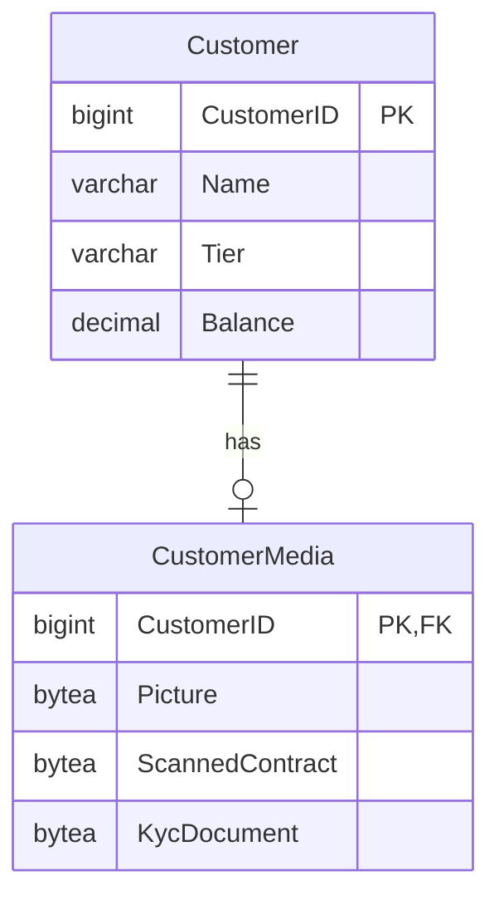

import { Callout, Steps, Step, Tabs, TabsList, TabsTrigger, TabsContent, Icon } from '@/components/writing-ui';

## 이게 뭔데

Split Table은 **테이블 하나를 컬럼 기준으로 쪼개서 여러 테이블로 나누는** 리팩토링이다. 행을 나누는 게 아니라 **세로로** 자른다. "이 컬럼들은 여기, 저 컬럼들은 저기"로.

비유하자면 이사 가방 정리다. 매일 쓰는 칫솔·속옷·노트북은 손에 드는 가방에 넣고, 일 년에 한 번 꺼낼까 말까 한 겨울 패딩·앨범·졸업 가운은 큰 캐리어에 넣어 짐칸에 부친다. 같은 짐인데 **꺼내는 빈도가 다르니까 따로 담는 거다.** 칫솔 하나 꺼내겠다고 패딩까지 들어 있는 가방을 통째로 들고 다닐 필요는 없잖아.

DB에서 이 "패딩"에 해당하는 게 바로 거대하고 잘 안 읽는 컬럼이다. 책의 표준 예시가 `Employee.Picture` — 직원 증명사진 BLOB. 이름·부서·연봉은 화면마다 긁는데, 사진은 프로필 페이지 한 군데서만 쓴다. 근데 이 사진이 같은 row에 박혀 있으면, 이름만 읽는 쿼리도 매번 사진 무게를 짊어진다.

<Callout type="info" title="한 줄 요약">
자주 같이 읽는 컬럼끼리, 잘 안 읽는 무거운 컬럼끼리 따로 모아라. 세로로 자른 만큼 평소 쿼리의 row가 가벼워진다.
</Callout>

## 왜 자르나 (동기)

수직 분할이 답이 되는 상황은 크게 세 갈래다. 책은 이걸 성능·접근 제한·정규화로 나눠 설명한다.

**1. 성능 — 넓은 row가 무겁다.** 대부분의 RDBMS는 데이터를 페이지(보통 8KB 단위) 묶음으로 디스크에서 읽는다. 한 row가 넓으면 페이지 하나에 들어가는 row 수가 줄고, 같은 행 개수를 스캔해도 읽어야 할 페이지가 늘어난다. `Customer` 테이블에 `Picture BLOB`, `Notes TEXT`, `ScannedContract BLOB` 같은 덩치들이 박혀 있으면, **고객 이름·잔액만 보는 목록 쿼리조차** 이 덩치가 깔린 페이지를 줄줄이 읽게 된다. 안 쓰는 컬럼이 안 읽는 게 아니라 **같은 페이지에 묻어와서** 캐시(버퍼 풀)를 차지한다는 게 핵심이다.

**2. 접근 제한 — SAC.** 한 테이블에 민감 컬럼과 일반 컬럼이 섞여 있으면 권한을 컬럼 단위로 거는 게 번거롭다. 은행 도메인이면 `Customer`에 일반 정보와 `CreditScore`, `AnnualIncome` 같은 SAC(Sensitive Access Column)가 같이 있는 경우다. 민감 컬럼만 `CustomerSensitive` 테이블로 떼어내면 그 테이블에만 `GRANT`를 빡세게 걸 수 있다. 테이블 단위 권한이 컬럼 단위 권한보다 다루기 쉽다.

**3. 정규화 — 반복 그룹 제거(1NF).** 같은 값이 row마다 통째로 중복되면 그건 보통 별도 엔티티가 숨어 있다는 신호다. 책 예시가 주소 테이블의 `StateCode`/`StateName` — 같은 주(state) 이름이 주소 row마다 반복된다. 이걸 `State` 테이블로 분리하면 중복이 사라지고, "캘리포니아 → California"라는 사실을 한 곳에서만 관리한다.

<Callout type="note" title="Split Table vs Move Column vs Move Data">
용어를 헷갈리기 쉬운데 정리하면: **컬럼을 세로로** 떼서 **새 테이블**을 만들면 Split Table, 떼서 **이미 있는 테이블**로 옮기면 Move Column(Split을 반복 적용한 꼴), **행을 가로로** 나눠 다른 테이블/샤드로 보내면 Move Data다. 이번 편은 "새 테이블로 세로 분할"이다.
</Callout>

## 시나리오: 이런 적 있을 거임

`Customer` 목록 화면이 어느 날부터 느려졌다. 고객 50명을 페이지로 띄우는데, 보여주는 건 이름·등급·잔액 세 컬럼뿐이다. 그런데 응답이 800ms씩 나온다. 슬로우 쿼리 로그를 켜고 보면 쿼리 자체는 평범한 `SELECT ... FROM Customer ... LIMIT 50`. 인덱스도 잘 탄다. 근데 왜 느려?

테이블 정의를 열어보면 범인이 나온다.

```sql
CREATE TABLE Customer (
    CustomerID      BIGINT PRIMARY KEY,
    Name            VARCHAR(200),
    Tier            VARCHAR(20),
    Balance         DECIMAL(15,2),
    Picture         BYTEA,          -- 평균 2MB 증명사진
    ScannedContract BYTEA,          -- 평균 5MB 계약서 스캔본
    KycDocument     BYTEA,          -- KYC 서류 묶음
    Notes           TEXT            -- 상담 메모, 가끔 수십 KB
);
```

화면에선 `Picture`·`ScannedContract`·`KycDocument`를 한 글자도 안 쓴다. 그런데 이놈들이 같은 row, 같은 페이지에 박혀 있다. 옵티마이저가 이름·잔액만 가져오려 해도, 그 컬럼이 들어 있는 페이지를 통째로 디스크에서 읽어 버퍼 풀에 올려야 한다. row 하나가 7MB짜리니까, 50명이면 **이름 세 글자 보겠다고 350MB어치 페이지를 휘젓는** 셈이다. 버퍼 풀은 오염되고, 정작 자주 쓰는 잔액 데이터는 캐시에서 밀려난다.

여기서 흔히 하는 응급처치가 `SELECT *`를 `SELECT CustomerID, Name, Tier, Balance`로 바꾸는 거다. 도움은 된다. 안 읽는 BLOB을 네트워크로 전송은 안 하니까. **하지만 절반의 처방이다.** PostgreSQL 같은 DB는 큰 값을 TOAST라는 별도 저장소로 빼서 어느 정도 완화해 주지만, 모든 DB가 그렇진 않고, 무엇보다 row가 물리적으로 넓다는 사실 자체는 안 바뀐다. 인덱스를 안 타는 풀스캔/범위스캔이 끼면 넓은 row의 비용이 그대로 돌아온다. 근본 처방은 **무거운 컬럼을 아예 다른 테이블로 들어내는 것** — 그게 Split Table이다.

## 주의할 점

<Callout type="warning" title="자르기 전에 사용 양태부터 확인해라">
Split Table의 트레이드오프는 분명하다. 한 번 자르면 **두 테이블을 다시 합쳐 보려면 JOIN이 필요해진다.** 만약 그 컬럼들이 사실은 늘 같이 읽히는 한 덩어리였다면, 분할은 매 쿼리에 JOIN 비용만 얹는 자해다. 그때 필요한 건 정반대 리팩토링(Merge Tables)이다.

판단 기준은 데이터의 **사용 양태(usage pattern)** 다. 컬럼들이 늘 함께 읽히면 합쳐 두고, **읽는 빈도와 패턴이 갈리면** 가른다. "사진은 프로필에서만, 이름은 어디서나"처럼 접근 빈도가 명확히 다를 때가 분할의 신호다. 직감 말고 실제 쿼리 로그로 확인하자.
</Callout>

추가로 머리에 둘 것 둘:

- **분할은 JOIN을 부른다, 하지만 보통 남는 장사다.** 분할 후 `Customer`와 `CustomerMedia`를 같이 보려면 `CustomerID`로 JOIN해야 한다. 약간의 비용이다. 하지만 프로필 페이지(한 명, 사진 필요)는 어차피 단건 조회라 JOIN 비용이 미미하고, 목록 페이지(여러 명, 사진 불필요)는 **아예 무거운 테이블을 안 건드린다.** 자주 가는 쪽이 가벼워지고 드물게 가는 쪽만 JOIN을 무니, 전체로는 이득인 경우가 대부분이다.
- **전환 기간에는 두 테이블의 데이터가 일치해야 한다.** 분할 도중에는 구 컬럼과 신 테이블이 동시에 존재한다. 양쪽이 어긋나면 데이터 정합성이 깨진다. 책은 이걸 **양방향 동기화 트리거**로 막는다 — 그리고 트리거에는 순환이라는 함정이 있다(아래에서 다룬다).

## 이렇게 한다

은행 도메인으로 가자. `Customer`에서 무거운 미디어 컬럼들(`Picture`, `ScannedContract`, `KycDocument`)을 떼어 `CustomerMedia` 테이블로 분리한다. 결과 스키마는 이렇게 된다.



`Customer`는 자주 읽는 가벼운 컬럼만 남기고, `CustomerMedia`는 `CustomerID`를 PK이자 FK로 갖는 1:1(정확히는 1:0..1) 위성 테이블이 된다. 핵심은 **이 변경을 운영 중에 안전하게** 굴리는 거다. 책의 정석(전환 기간 + 트리거)을 먼저 보고, 현대 도구로 갈아탄다.

### 1단계 — 스키마 변경 (DDL)

새 테이블을 만든다. PK를 `CustomerID`로 두고 동시에 `Customer`를 가리키는 FK로 건다. 이 한 줄이 1:1 관계와 무결성을 동시에 보장한다.

```sql
-- After: 무거운 컬럼들의 새 보금자리
CREATE TABLE CustomerMedia (
    CustomerID      BIGINT PRIMARY KEY
                    REFERENCES Customer(CustomerID) ON DELETE CASCADE,
    Picture         BYTEA,
    ScannedContract BYTEA,
    KycDocument     BYTEA
);
```

<Callout type="warning" title="운영 테이블에 무거운 변경 거는 법">
큰 테이블에 컬럼을 추가하거나 인덱스를 거는 DDL은 락을 오래 잡아 테이블을 멈춰 세울 수 있다. 다행히 여기선 새 테이블을 `CREATE`만 하므로 기존 `Customer`에 락이 안 걸린다. 문제는 **마지막에 구 컬럼을 `DROP COLUMN`** 할 때다. 큰 테이블의 컬럼 드롭은 DB·버전에 따라 테이블 재작성으로 번질 수 있으니, 무중단이 필요하면 **gh-ost / pt-online-schema-change**(MySQL)나 PostgreSQL의 비차단 경로(`ADD CONSTRAINT ... NOT VALID` 후 `VALIDATE`, `CREATE INDEX CONCURRENTLY`)를 챙겨라.
</Callout>

### 2단계 — 데이터 마이그레이션 (DML)

기존 row의 미디어 컬럼을 새 테이블로 복사한다. 책의 1NF 예시(`State` 분리)에선 중복 제거를 위해 `GROUP BY`를 썼지만, 여기 1:1 분할은 단순 복사다. NULL뿐인 미디어는 굳이 안 만들어도 되니 `WHERE`로 거른다.

```sql
-- 미디어가 하나라도 있는 고객만 위성 row 생성
INSERT INTO CustomerMedia (CustomerID, Picture, ScannedContract, KycDocument)
SELECT CustomerID, Picture, ScannedContract, KycDocument
FROM Customer
WHERE Picture IS NOT NULL
   OR ScannedContract IS NOT NULL
   OR KycDocument IS NOT NULL;
```

대용량이면 한 방에 `INSERT ... SELECT`로 7TB를 긁다 트랜잭션이 폭발한다. **PK 범위로 배치를 끊어** 돌려라. `WHERE CustomerID BETWEEN ? AND ?`로 1만 건씩, 사이사이 커밋하면서.

### 3단계 — 전환 기간: 양방향 동기화 (트리거)

여기가 책의 핵심이자 함정이다. 다중 애플리케이션 환경에선 구 컬럼을 바로 못 지운다. 아직 옛 코드(다른 팀의 배치, 협력사 프로그램)가 `Customer.Picture`를 읽고 쓰고 있을 수 있으니까. 그래서 **전환 기간** 동안 구 컬럼 ↔ 신 테이블을 **양쪽으로** 동기화한다. 옛 코드가 `Customer.Picture`를 갱신하면 `CustomerMedia`로, 새 코드가 `CustomerMedia`를 갱신하면 `Customer.Picture`로.

<Callout type="error" title="트리거 순환 — 무한루프의 함정">
양방향 트리거의 고전적 사고는 순환이다. A를 바꾸면 트리거가 B를 바꾸고, B가 바뀌니 또 다른 트리거가 A를 바꾸고... 무한루프. **반드시 값이 실제로 달라졌을 때만 반대편을 갱신**해야 한다(`IS DISTINCT FROM` 가드). "이미 같으면 안 건드린다"는 조건이 순환의 고리를 끊는다.
</Callout>

```sql
-- 구 컬럼 -> 신 테이블 (옛 코드가 Customer.Picture를 건드릴 때)
CREATE OR REPLACE FUNCTION sync_customer_to_media() RETURNS TRIGGER AS $$
BEGIN
    INSERT INTO CustomerMedia (CustomerID, Picture, ScannedContract, KycDocument)
    VALUES (NEW.CustomerID, NEW.Picture, NEW.ScannedContract, NEW.KycDocument)
    ON CONFLICT (CustomerID) DO UPDATE
        SET Picture         = EXCLUDED.Picture,
            ScannedContract = EXCLUDED.ScannedContract,
            KycDocument     = EXCLUDED.KycDocument
    -- 순환 차단: 값이 실제로 달라졌을 때만 반영
    WHERE CustomerMedia.Picture IS DISTINCT FROM EXCLUDED.Picture
       OR CustomerMedia.ScannedContract IS DISTINCT FROM EXCLUDED.ScannedContract
       OR CustomerMedia.KycDocument IS DISTINCT FROM EXCLUDED.KycDocument;
    RETURN NEW;
END;
$$ LANGUAGE plpgsql;
```

반대 방향(`CustomerMedia` → `Customer`)도 같은 `IS DISTINCT FROM` 가드로 대칭 구현한다. 책이 가르치는 정석은 이렇게 양쪽 트리거를 깔고, 정해진 **드롭 날짜**까지 유지하다가, 모든 접근 프로그램이 새 구조로 넘어온 게 확인되면 구 컬럼과 트리거를 함께 드롭하는 것이다.

### 3단계, 현대판 — expand-contract로 트리거 없이

2006년엔 트리거가 거의 유일한 무중단 수단이었다. 지금은 **expand-contract(parallel change)** 패턴 + 마이그레이션 툴로 같은 일을 더 안전하게 한다. 트리거의 순환·디버깅 지옥을 애플리케이션 코드로 끌어올리는 발상이다.

<Steps>
<Step title="Expand — 새 구조를 추가만 한다">
`CustomerMedia`를 만들고(1단계), 데이터를 복사한다(2단계). 이때 구 컬럼은 **그대로 둔다.** 스키마는 신·구를 동시에 품은 "넓은" 상태가 된다. Flyway/Liquibase면 `V43__create_customer_media.sql`, Alembic이면 한 리비전, ORM 마이그레이션이면 한 커밋. 되돌리기 쉬운 가산 변경(additive)만 한다.
</Step>
<Step title="Migrate writes — 코드가 양쪽에 쓴다">
애플리케이션을 배포해 미디어를 **신 테이블에 쓰되, 전환 기간엔 구 컬럼에도 같이 쓴다(dual-write)**. 트리거가 하던 동기화를 코드가 명시적으로 한다. 읽기는 아직 구 컬럼에서 해도 되고 신 테이블로 옮겨도 된다. 다중 앱이면 모든 앱이 이 단계를 통과할 때까지 기다린다.
</Step>
<Step title="Migrate reads — 읽기를 신 테이블로">
모든 읽기를 `CustomerMedia` JOIN으로 전환한다. 목록 쿼리는 애초에 미디어를 안 읽으니 `Customer`만 보고 가볍다. 프로필 같은 상세 화면만 JOIN한다. 이 시점이면 구 컬럼은 아무도 안 읽는다.
</Step>
<Step title="Contract — 구조를 줄인다">
드롭 날짜가 지나고 구 컬럼을 아무도 안 건드리는 걸 확인한 뒤, dual-write를 끄고 `ALTER TABLE Customer DROP COLUMN Picture, ...`로 구 컬럼을 제거한다. 무거운 컬럼이 빠진 `Customer`는 이제 row가 얇아 캐시 효율이 확 오른다.
</Step>
</Steps>

핵심은 **각 단계가 독립 배포 가능하고 되돌릴 수 있다**는 거다. 트리거 한 방으로 신·구를 묶어 두면 롤백 시 트리거까지 같이 풀어야 하지만, expand-contract는 매 단계가 작은 가역 변경이라 사고 반경이 좁다.

### 4단계 — 접근 프로그램 수정 (코드)

이제 코드가 새 구조를 안다. before/after를 보자.

<Tabs defaultValue="before">
<TabsList>
<TabsTrigger value="before">Before</TabsTrigger>
<TabsTrigger value="after">After</TabsTrigger>
</TabsList>
<TabsContent value="before">
분할 전. 한 테이블에서 다 긁는다. 목록조차 무거운 BLOB 컬럼이 같은 row에 깔려 있어 페이지가 무겁다.

```typescript
// 목록: 이름·잔액만 필요한데 row 자체가 무겁다
async function listCustomers(limit: number) {
  return db.query(
    `SELECT CustomerID, Name, Tier, Balance
       FROM Customer
      ORDER BY Name
      LIMIT $1`,
    [limit],
  );
}

// 상세: 사진까지 같은 테이블에서
async function getCustomerProfile(id: number) {
  return db.queryOne(
    `SELECT CustomerID, Name, Tier, Balance, Picture
       FROM Customer
      WHERE CustomerID = $1`,
    [id],
  );
}
```
</TabsContent>
<TabsContent value="after">
분할 후. 목록은 가벼운 `Customer`만, 상세만 `CustomerMedia`를 JOIN한다. 자주 가는 경로가 가벼워졌다.

```typescript
// 목록: 얇아진 Customer만 읽는다 — 페이지당 row 수가 늘어 I/O가 준다
async function listCustomers(limit: number) {
  return db.query(
    `SELECT CustomerID, Name, Tier, Balance
       FROM Customer
      ORDER BY Name
      LIMIT $1`,
    [limit],
  );
}

// 상세: 사진이 필요할 때만 위성 테이블을 JOIN(LEFT — 미디어 없는 고객 대비)
async function getCustomerProfile(id: number) {
  return db.queryOne(
    `SELECT c.CustomerID, c.Name, c.Tier, c.Balance, m.Picture
       FROM Customer c
       LEFT JOIN CustomerMedia m ON m.CustomerID = c.CustomerID
      WHERE c.CustomerID = $1`,
    [id],
  );
}
```
</TabsContent>
</Tabs>

ORM이면 1:1 관계 매핑으로 같은 효과를 낸다. 미디어 엔티티를 별도로 두고 lazy로 묶으면, 목록 쿼리는 미디어를 안 건드리고 상세에서만 관계를 eager 로드한다. 책이 말한 "새 테이블 메타데이터 도입 + SQL을 JOIN으로 갱신 + UI를 세분화 구조에 맞게 리팩토링"이 코드 레벨에선 이 모양이다.

<Callout type="info" title="더 멀리 — BLOB은 DB 밖이 정답일 때가 많다">
사실 `Picture`·`ScannedContract` 같은 대용량 바이너리는 **테이블 분할을 넘어 DB 밖으로** 빼는 게 현대적 정석이다. 파일은 S3 같은 오브젝트 스토리지에 두고, DB엔 키(URL/경로)만 저장한다. 그러면 `CustomerMedia`조차 `VARCHAR` 키 몇 개로 가벼워진다. Split Table은 이 여정의 1단계 — "일단 hot 컬럼에서 cold 컬럼을 떼어낸다" — 로 보면 된다. 떼어낸 뒤 그 cold 테이블의 실데이터를 오브젝트 스토리지로 다시 옮기는 게 자연스러운 다음 수순이다.
</Callout>

## 현대 실무로 한 번 더 — hot/cold 분리

Split Table을 오늘날 언어로 다시 부르면 **hot/cold 데이터 분리**다. 같은 엔티티라도 접근 빈도가 다른 컬럼을 나눠, 자주 가는 핫 경로를 좁고 캐시 친화적으로 유지하는 설계다. 책의 `Employee.Picture` 예시가 정확히 이 패러다임의 원형이다.

- **넓은 row 비용**: row가 넓을수록 페이지당 row 수가 줄고, 풀/범위 스캔의 I/O가 늘며, 버퍼 풀에 핫 데이터가 덜 들어간다. 잘 안 읽는 큰 컬럼을 떼면 같은 메모리에 더 많은 핫 row가 캐시된다.
- **partial index로 보완**: 미디어가 있는 고객만 따로 조회한다면 `WHERE Picture IS NOT NULL` 조건의 **partial index**가 위성 테이블 분할의 대안/보완이 되기도 한다. 분할이 과하다 싶을 때 가벼운 카드 한 장.
- **materialized view로 핫 경로 평탄화**: 목록 화면이 여러 테이블 집계를 매번 JOIN한다면, 자주 읽는 컬럼만 모은 materialized view가 또 다른 형태의 "핫 분리"다. 분할이 쓰기 경로를 나눈다면, MV는 읽기 경로를 미리 구워 둔다.
- **소유권 분리의 씨앗**: 마이크로서비스로 가다 보면 "이 컬럼들은 결제 서비스 소유, 저건 프로필 서비스 소유"로 갈린다. 모놀리식 테이블의 수직 분할은 그 데이터 소유권 분리의 첫걸음이 되곤 한다. 나중에 CDC(Debezium)/outbox로 서비스 간 동기화를 붙일 때, 이미 컬럼이 갈려 있으면 경계가 깔끔하다.

<Callout type="success" title="언제 자르고 언제 두나 — 단일 앱이면 트리거 생략">
접근 경로가 **단일 애플리케이션(단일 ORM/DAO)** 이라면 전환 기간 자체를 생략해도 된다. 배포 시점에 스키마 변경 + 코드 변경을 한 마이그레이션으로 묶으면 트리거도, 드롭 날짜 관리도 필요 없다. 양방향 트리거·드롭 날짜는 **무중단이 필요한 다중 앱 환경에서만** 꺼내는 비싼 도구다. 이 판단 기준 하나를 팀이 공유하는 게, 카탈로그 항목 100개 외우는 것보다 실전에서 더 쓸모 있다.
</Callout>

## 정리

Split Table은 한 문장이다. **빈도와 패턴이 다른 컬럼은 따로 담아라.** 자주 읽는 가벼운 컬럼과 가끔 읽는 무거운 컬럼을 같은 row에 묶어 두면, 평소 쿼리가 안 쓰는 무게를 매번 짊어진다.

> **세로로 한 번 잘 자르면, 자주 가는 길이 가벼워진다.**

판단은 직감이 아니라 사용 양태로 한다. 늘 함께 읽히면 두고, 빈도가 갈리면 가른다. 실행은 단일 앱이면 마이그레이션 한 방으로 묶고, 무중단 다중 앱이면 expand-contract로 단계를 쪼개 각 단계를 되돌릴 수 있게 한다. 책이 트리거로 풀던 양방향 동기화는, 오늘날 dual-write와 마이그레이션 툴로 더 안전하게 풀린다. 그리고 떼어낸 무거운 컬럼이 BLOB이라면, 그건 DB 밖 오브젝트 스토리지로 가는 더 긴 여정의 출발점이기도 하다.
