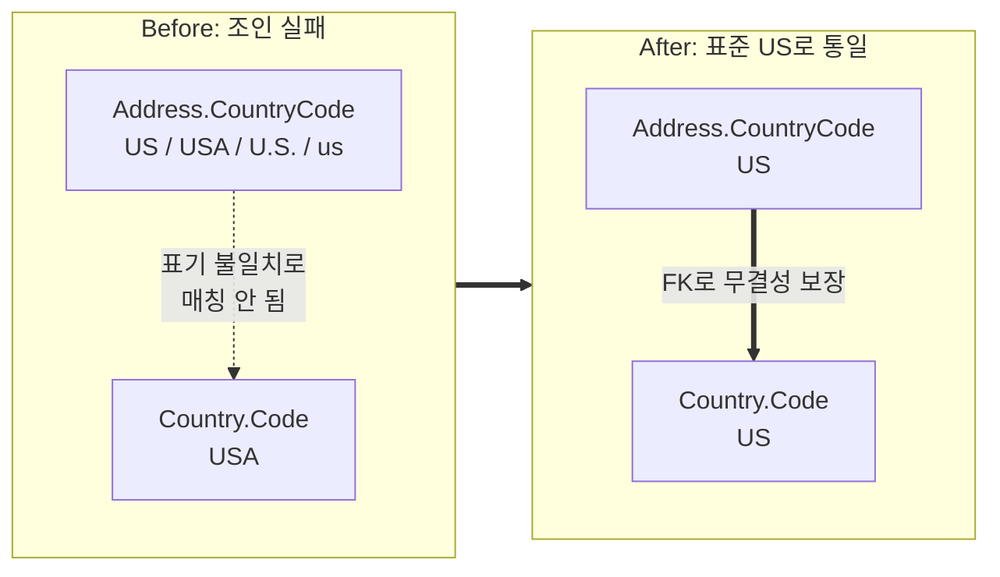

## 이게 뭔데

Apply Standard Codes. 풀어 쓰면 **"같은 뜻인데 표기가 제각각인 코드 값을, 미리 정한 하나의 표준 값으로 통일하는 것"**이다. `'US'`, `'USA'`, `'U.S.'`, `'United States'`가 한 컬럼 안에 사이좋게 뒤섞여 살고 있을 때, 이걸 전부 `'US'` 하나로 줄 세우는 작업.

비유를 하나 들자. 회사 단톡방에서 "오늘 회의실 A요"라고 했는데, 누구는 "A실", 누구는 "1번방", 누구는 "예전 그 방"이라고 부른다고 치자. 가리키는 건 똑같은 방인데 호칭이 네 개다. 그럼 "A실에 모인 사람"을 세려고 하면 호칭마다 따로 세야 한다. 답답하잖아. 그래서 "그 방은 앞으로 '회의실 A'로만 부른다"고 못 박는 게 표준 코드 적용이다. 의미는 안 바뀌고, **부르는 이름만 하나로 통일**된다.

<Callout type="info" title="한 줄 요약">
같은 의미의 코드가 여러 표기로 흩어져 있으면 조인도 안 되고 집계도 안 맞는다. Apply Standard Codes는 그 표기를 하나의 표준으로 정제해, 데이터를 다시 "비교 가능한" 상태로 되돌린다.
</Callout>

## 언제 쓰나

핵심 동기는 단순하다. **표기가 다르면 같은 값으로 취급되지 않는다.** DB 입장에서 `'US'`와 `'USA'`는 그냥 서로 다른 문자열이다. 너한테는 둘 다 미국이지만, 옵티마이저한테는 `'고양이'`와 `'강아지'`만큼이나 남남이다.

이게 실제로 무슨 사고를 치냐면.

**1. 조인이 안 된다.** 은행 도메인을 떠올려보자. 국가 마스터 테이블 `Country.Code`에는 `'USA'`가 들어 있는데, 고객 주소 테이블 `Address.CountryCode`에는 `'US'`가 들어 있다. 둘을 조인해서 "미국 고객의 국가명을 같이 보여줘" 하면 한 건도 안 맞는다. 같은 나라인데 키가 안 붙으니까. 데이터는 멀쩡히 다 있는데 결과가 텅 빈다.

**2. FK를 걸 수가 없다.** `Address.CountryCode`에 `Country` 테이블을 가리키는 외래 키를 걸고 싶어도, `'US'`가 `Country` 마스터에 없으니 제약 추가가 그냥 실패한다. 즉 표준화는 **FK 도입의 사전 작업**이다. 값을 먼저 줄 세워야 그 위에 무결성 제약을 얹을 수 있다.

**3. 집계가 거짓말을 한다.** "국가별 계좌 수"를 뽑는데 미국이 `US` 묶음 따로, `USA` 묶음 따로, `U.S.` 묶음 따로 세 줄로 나온다. 대시보드 보는 사람은 미국 비중을 1/3로 과소평가하게 된다.

**4. 분기 코드가 지저분해진다.** 그래서 결국 애플리케이션이 이런 꼴이 된다.

```sql
SELECT * FROM Account a
JOIN Address ad ON ad.CustomerId = a.CustomerId
WHERE ad.CountryCode = 'US'
   OR ad.CountryCode = 'USA'
   OR ad.CountryCode = 'U.S.';
```

이 `OR` 행렬을 모든 쿼리, 모든 검증 로직, 모든 리포트마다 복붙하고 다닌다. 그리고 어느 날 누군가 `'United States'`라고 적힌 새 데이터를 넣으면, 그 `OR` 목록에 없으니까 또 조용히 누락된다. **표기 종류는 시간이 갈수록 늘어나지, 줄지 않는다.**

이 네 가지 냄새 중 하나라도 맡았다면, 그게 Apply Standard Codes가 답이라는 신호다.

### 시나리오: 이런 적 있을 거임

분기점이 전국에 깔린 은행에서 "외국 국적 고객 비율" 리포트를 처음 만든다고 하자. 쿼리를 짜고 돌렸는데 외국 국적 고객이 이상하게 적다. 검산하려고 `Address` 테이블의 국가 코드를 그냥 `GROUP BY` 해본다.

```sql
SELECT CountryCode, COUNT(*) FROM Address GROUP BY CountryCode ORDER BY 2 DESC;
```

```text
CountryCode      count
-----------      -----
US               41023
KR                8841
USA               2207   <- ???
U.S.               431   <- ???
Korea              190   <- ???
us                  88   <- ???
KOR                 51   <- ???
(null)              12
```

여기서 등골이 서늘해진다. 미국은 `US`, `USA`, `U.S.`, `us` 네 가지로, 한국은 `KR`, `Korea`, `KOR` 세 가지로 흩어져 있다. 10년간 여러 입력 화면, 여러 마이그레이션, 여러 외부 연동이 제각각 자기 표기를 꽂아 넣은 결과다. 누구 하나의 잘못이 아니라 **표준이 없던 세월의 퇴적층**이다.

이걸 발견한 순간 너의 리포트는 부정확한 정도가 아니라 **거짓**이었다는 게 확정된다. 그리고 이 컬럼을 참조하는 다른 모든 쿼리도 똑같이 거짓이었다. 이게 데이터 품질 부채가 무서운 이유다. 조용히 쌓이다가, 누군가 `GROUP BY` 한 줄 돌리는 순간 전부 드러난다.

## 주의할 점

값을 통째로 바꾸는 작업이라 트레이드오프가 분명하다. 가볍게 보면 다친다.

<Callout type="warning" title="표준화 전에 반드시 따져야 할 것">
- **FK로 퍼져 있으면 소스만 고쳐선 안 된다.** `CountryCode`가 `Country` 마스터를 가리키는 FK라면, `Address`만 `USA`->`US`로 바꾸고 `Country` 마스터의 PK는 `USA`로 둔 채면 FK가 깨진다. **마스터(부모)와 참조(자식)를 같은 표준으로, 같은 변경 안에서** 손봐야 한다. 컬럼 하나만 바꾸는 게 아니라 그 코드를 쓰는 모든 컬럼이 대상이다.
- **표준 값을 누가 정하는지 합의가 먼저다.** "미국을 `US`로 할까 `USA`로 할까"는 기술 문제가 아니라 정책 문제다. ISO 3166-1 alpha-2(`US`)를 따를지, 사내 레거시 표준을 따를지 이해관계자 승인 없이 개발자가 혼자 정하면, 나중에 외부 연동 표준과 안 맞아서 또 한 번 갈아엎게 된다.
- **하드코딩이 도처에 박혀 있다.** 책이 경고하듯, 애플리케이션마다 `'USA'`를 자기 코드에 박아 뒀을 수 있다. DB만 `US`로 바꾸고 앱은 그대로면, 앱이 `WHERE CountryCode='USA'`로 조회해 0건을 받아온다. **DB 정제와 코드 수정은 한 묶음**이다.
- **모호한 값은 사람이 판단해야 한다.** `'US'`가 미국인지(United States) 우루과이 어딘가의 오타인지, `(null)`과 `''`(빈 문자열)을 어떻게 처리할지는 자동 매핑으로 못 푼다. 정제 규칙에 "이건 사람이 확인" 버킷을 반드시 남겨라.
</Callout>

## 이렇게 한다

작업은 크게 세 갈래다. 스키마 손질, 데이터 정제, 그리고 코드 수정. 작은 리팩토링처럼 보여도 "값을 바꾼다"는 건 운영 DB에서 항상 조심스러운 일이라, 순서대로 간다.

<Steps>
<Step title="표준 값을 확정하고 매핑표를 만든다">
먼저 "무엇이 정답인지"를 못 박는다. 미국은 `US`, 한국은 `KR`(ISO alpha-2 기준). 그다음 현장에 실제로 존재하는 표기를 전부 긁어, 표준으로 가는 매핑표를 만든다. 이 매핑표가 정제의 사양서다.

```text
원본 표기                  -> 표준
-----------------------------------
USA, U.S., us, U.S.A.      -> US
Korea, KOR, kr, 대한민국    -> KR
(null), ''                 -> 사람이 확인 (자동 변환 금지)
```
</Step>

<Step title="비표준 행을 표준 값으로 UPDATE 한다 (데이터 정제)">
소량이면 그냥 SQL 스크립트로 끝낸다. 매핑표를 그대로 `UPDATE`로 옮긴다.

```sql
-- Before: US / USA / U.S. / us 가 뒤섞인 상태
UPDATE Address SET CountryCode = 'US'
WHERE CountryCode IN ('USA', 'U.S.', 'U.S.A.', 'us');

UPDATE Address SET CountryCode = 'KR'
WHERE CountryCode IN ('Korea', 'KOR', 'kr', '대한민국');
```

여기서 책의 한 줄을 꼭 챙기자. **이 컬럼이 FK로 여러 곳에 쓰이면, 부모 마스터와 자식 참조를 같이 표준화해야 한다.** 예를 들어 `Country` 마스터가 `USA`를 PK로 갖고 있다면, 마스터를 `US`로 바꾸고 그걸 참조하는 모든 자식 컬럼(`Address.CountryCode`, `Policy.IssueCountryCode`, ...)을 같은 변경 안에서 함께 옮긴다.

```sql
-- 부모 마스터부터 표준화 (FK가 ON UPDATE CASCADE면 자식이 따라옴)
UPDATE Country SET Code = 'US' WHERE Code = 'USA';

-- CASCADE가 아니라면 자식들도 명시적으로
UPDATE Address SET CountryCode = 'US' WHERE CountryCode = 'USA';
UPDATE Policy  SET IssueCountryCode = 'US' WHERE IssueCountryCode = 'USA';
```
</Step>

<Step title="표준만 들어오도록 잠근다 (CHECK 또는 FK)">
정제만 하고 끝내면 다음 주에 또 `USA`가 들어온다. 표준을 **강제**해야 진짜 끝이다. 두 방법이 있다.

값 집합이 작고 고정적이면 `CHECK` 제약이 가볍다.

```sql
-- 운영 중이라면 NOT VALID로 먼저 걸고(기존 행 검사 스킵, 락 짧음),
-- 나중에 별도로 검증해서 풀스캔 락을 분리한다 (PostgreSQL)
ALTER TABLE Address
  ADD CONSTRAINT chk_country_iso
  CHECK (CountryCode IN ('US', 'KR', 'JP', 'GB')) NOT VALID;

ALTER TABLE Address VALIDATE CONSTRAINT chk_country_iso;
```

값이 많거나 설명까지 붙이고 싶으면 룩업 테이블 + FK가 낫다. 이게 바로 표준화가 **FK 도입의 사전 작업**이라고 한 이유다 — 값을 먼저 줄 세웠으니 이제 무결성을 얹을 수 있다.

```sql
ALTER TABLE Address
  ADD CONSTRAINT fk_country
  FOREIGN KEY (CountryCode) REFERENCES Country(Code);
```
</Step>

<Step title="접근 프로그램의 하드코딩을 걷어낸다">
DB를 아무리 깨끗이 해도, 앱이 `'USA'`를 박아 두면 도로아미타불이다. 하드코딩 `WHERE`절, 검증 로직, 상수/enum, 그리고 **테스트 데이터 생성기까지** 새 표준으로 바꾼다.

지저분한 분기가 통째로 사라지는 게 가장 큰 보상이다.

```typescript
// Before: 표기가 흩어져 있어서 OR로 방어
const US_VARIANTS = ['US', 'USA', 'U.S.', 'us'];
function isUsCustomer(addr: Address): boolean {
  return US_VARIANTS.includes(addr.countryCode);
}

// After: 표준이 하나뿐이라 비교도 하나뿐
function isUsCustomer(addr: Address): boolean {
  return addr.countryCode === 'US';
}
```

```sql
-- Before
SELECT * FROM Account a JOIN Address ad ON ad.CustomerId = a.CustomerId
WHERE ad.CountryCode = 'US' OR ad.CountryCode = 'USA' OR ad.CountryCode = 'U.S.';

-- After
SELECT * FROM Account a JOIN Address ad ON ad.CustomerId = a.CustomerId
WHERE ad.CountryCode = 'US';
```
</Step>
</Steps>

### 그림으로 보면

표준화 전후로 데이터가 어떻게 "다시 붙는지" 보자.



### 현대화: 손코딩 UPDATE를 넘어서

2006년 책은 번호 매긴 SQL 스크립트로 한 방에 `UPDATE` 한다. 골격은 지금도 유효하지만, 운영 규모에선 몇 가지를 얹는다.

<Tabs defaultValue="migration">
<TabsList>
<TabsTrigger value="migration">버전 관리 마이그레이션</TabsTrigger>
<TabsTrigger value="pipeline">정제 파이프라인</TabsTrigger>
<TabsTrigger value="online">대용량/무중단</TabsTrigger>
</TabsList>

<TabsContent value="migration">
정제 `UPDATE`와 제약 추가는 손으로 콘솔에 붙여 넣는 게 아니라, Flyway/Liquibase/Alembic 같은 도구로 **버전 관리되는 마이그레이션**으로 남긴다. 그래야 어느 환경에 어떤 정제가 적용됐는지 추적되고, 매핑표가 곧 코드 리뷰 대상이 된다.

```sql
-- V45__apply_standard_country_codes.sql (Flyway)
UPDATE Address SET CountryCode = 'US'
WHERE CountryCode IN ('USA', 'U.S.', 'U.S.A.', 'us');

UPDATE Address SET CountryCode = 'KR'
WHERE CountryCode IN ('Korea', 'KOR', 'kr', '대한민국');

ALTER TABLE Address
  ADD CONSTRAINT chk_country_iso
  CHECK (CountryCode IN ('US', 'KR', 'JP', 'GB')) NOT VALID;
```
</TabsContent>

<TabsContent value="pipeline">
표기 변형이 수십 종이라 `IN (...)` 목록으로 감당이 안 되면, 매핑을 **데이터로** 들고 정제 파이프라인을 돌린다. 매핑 테이블을 만들고 조인으로 한 번에 치환하면, 새 변형이 발견될 때마다 SQL을 고치는 게 아니라 매핑 행만 추가하면 된다.

```sql
-- 매핑을 데이터로 관리
CREATE TABLE CountryCodeMapping (
  RawCode      VARCHAR(32) PRIMARY KEY,
  StandardCode CHAR(2) NOT NULL
);
INSERT INTO CountryCodeMapping VALUES
  ('USA','US'), ('U.S.','US'), ('us','US'),
  ('Korea','KR'), ('KOR','KR'), ('대한민국','KR');

-- 조인으로 일괄 정제 (수십 종 변형도 한 방)
UPDATE Address a
SET CountryCode = m.StandardCode
FROM CountryCodeMapping m
WHERE a.CountryCode = m.RawCode;
```

남은 미매핑 값은 따로 격리해 사람이 본다. "정제됐다"가 아니라 "정제 안 된 게 무엇인지 안다"가 핵심이다.

```sql
-- 매핑표에 없어서 표준화 못 한 잔여물 = 사람이 볼 큐
SELECT DISTINCT a.CountryCode
FROM Address a
LEFT JOIN CountryCodeMapping m ON m.RawCode = a.CountryCode
WHERE m.RawCode IS NULL
  AND a.CountryCode NOT IN ('US','KR','JP','GB');
```
</TabsContent>

<TabsContent value="online">
수억 행짜리 트랜잭션 테이블을 한 `UPDATE`로 갈면 거대한 락과 롱 트랜잭션이 생긴다. 이럴 땐 **배치로 잘라** 돌린다(PK 범위 단위로 커밋). 책이 말한 "한 행씩 락" 전략의 현대판이다.

```sql
-- PK 범위로 쪼개 반복 (앱 동시 사용 유지)
UPDATE Address SET CountryCode = 'US'
WHERE CountryCode IN ('USA','U.S.','us')
  AND AddressId BETWEEN :lo AND :hi;   -- :lo,:hi 를 슬라이딩
```

스키마 변경을 동반하면 expand-contract(parallel change)로 간다. 표준 값을 담을 새 컬럼을 추가(expand)하고, 정제 결과를 채우며, 앱을 새 컬럼으로 전환한 뒤, 구 컬럼을 떼어낸다(contract). 무중단 다중 앱 환경에서 안전 마진을 주는 정석이다.
</TabsContent>
</Tabs>

<Callout type="success" title="끝나면 무엇이 좋아지나">
- `Country` ↔ `Address` 조인이 드디어 맞고, "국가별 집계"가 한 줄로 정확히 나온다.
- `OR CountryCode='USA' OR ...` 분기 코드가 전부 단일 비교로 줄어든다.
- `CHECK`/FK가 잠가두니, 다음 주에 또 `USA`를 넣으려는 시도가 입력 시점에 막힌다.
- 룩업 테이블 추가나 본격 FK 무결성으로 가는 길이 열린다 — 값이 줄 서 있어야 그 위에 무결성을 얹을 수 있으니까.
</Callout>

## 정리

Apply Standard Codes는 화려한 리팩토링이 아니다. 구조를 바꾸지도, 성능을 극적으로 끌어올리지도 않는다. 그냥 **"같은 건 같게 적자"**는, 어찌 보면 당연한 약속을 데이터에 사후 적용하는 일이다.

그런데 이 당연한 게 안 지켜진 데이터는 조용히 모든 걸 망친다. 조인이 비고, 집계가 틀리고, 쿼리마다 `OR` 행렬이 자라고, FK는 영영 못 건다. 그래서 데이터 품질 리팩토링의 출발점에 이게 있는 거다.

> **값을 먼저 줄 세워야, 그 위에 무결성도 의미도 얹을 수 있다.**

정제하고(UPDATE), 잠그고(CHECK/FK), 코드의 하드코딩을 걷어낸다. 그리고 가능하면 이 셋을 버전 관리되는 마이그레이션 한 묶음으로 묶어, "언제 누가 무엇을 표준으로 정했는지"를 코드로 남긴다. 그게 `'US'`와 `'USA'`가 다시는 한 컬럼에서 동거하지 않게 만드는 방법이다.
