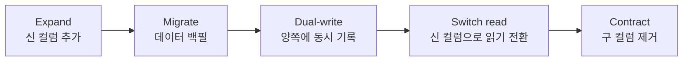

import { Callout, Steps, Step, Tabs, TabsList, TabsTrigger, TabsContent, Icon } from '@/components/writing-ui';

## 이게 뭔데

**Apply Standard Type**은 같은 의미를 가진 컬럼들의 데이터 타입을 하나로 맞추는 리팩토링이다. 한 줄로 줄이면, "전화번호는 전부 전화번호 타입으로, 우편번호는 전부 우편번호 타입으로" 통일하는 거다.

비유를 하나 들자. 콘센트 얘기다. 집에 가전제품이 열 개 있는데, 어떤 건 220V 플러그고 어떤 건 110V 플러그고 어떤 건 USB-C, 어떤 건 라이트닝이다. 전부 "전원을 공급한다"는 같은 목적인데 꽂는 모양이 제각각이라, 멀티탭 하나로 정리가 안 된다. 어댑터를 주렁주렁 달아야 한다. 데이터베이스에서 이 어댑터가 바로 `CAST`고, 타입 분기 코드고, 조인이 안 돼서 코드로 끌어모으는 짓이다.

`Branch` 테이블의 `Phone`은 `VARCHAR(15)`인데 `Customer` 테이블의 `PhoneNumber`는 `BIGINT`. 의미는 똑같이 "전화번호"인데 타입이 다르다. 이걸 한 타입으로 못 박는 게 Apply Standard Type이다.

<Callout type="info" title="옆 동네 리팩토링과 헷갈리지 말 것">
**Apply Standard Codes**는 *값*을 통일한다(`USA` vs `US` → `US`). **Apply Standard Type**은 *타입*을 통일한다(`VARCHAR` vs `NUMERIC` → `NUMERIC`). 값이 같아도 타입이 다르면 FK도 못 걸고 조인도 삐걱대니까, 보통 이 둘은 짝으로 따라다닌다.
</Callout>

## 언제 쓰나

타입이 갈라져 있을 때 나는 냄새는 대충 이렇다.

가장 흔한 건 **조인하려는데 타입이 안 맞아서 못 거는 경우**다. `Branch.Phone`(VARCHAR)과 `CallLog.CallerPhone`(BIGINT)을 조인하려고 했더니, DB가 암묵적으로 캐스팅을 끼워 넣는다. 운 좋으면 결과는 나오는데 인덱스를 못 탄다. 운 나쁘면 `'02-1234-5678'`을 숫자로 못 바꿔서 통째로 터진다. 어느 쪽이든 좋은 신호는 아니다.

그다음은 **FK를 걸고 싶은데 타입이 달라서 못 거는 경우**다. FK 제약은 양쪽 컬럼 타입이 같아야 한다. 룩업 테이블을 도입(Add Lookup Table)하려는데 코드 컬럼 타입이 테이블마다 제각각이면, 표준화가 선행 작업이 된다.

마지막은 **타입별 분기 코드가 자라나는 경우**다. 어떤 곳은 전화번호를 문자열로 받아 정규식으로 검증하고, 어떤 곳은 숫자로 받아 범위로 검증한다. 검증 로직이 두 벌이고, 둘이 미묘하게 다르고, 버그도 따로 난다. 타입을 통일하면 검증 메서드 하나로 합칠 수 있다.

<Callout type="note" title="동기 요약">
- 같은 의미 컬럼 간 FK·조인을 위한 타입 표준화 (전화번호 전부 정수로, `ZipCode` VARCHAR vs NUMERIC 통일)
- 룩업 테이블 코드 컬럼 타입 일관성
- 전사 데이터 표준 준수
- 타입별로 갈라진 분기·검증 코드 제거 → 공유 메서드 하나로
</Callout>

### 현실 시나리오: 어느 날 조인이 0건을 반환하다

은행 시스템이다. `Branch`(지점) 테이블의 전화번호는 2003년에 만들어졌고 `Phone VARCHAR(20)`다. `'02) 1234-5678'`처럼 괄호랑 하이픈이 그대로 박혀 있다. 한편 2019년에 추가된 `CallCenter` 테이블의 `BranchPhone`은 `BIGINT`다. 누군가 "전화번호는 숫자지"라고 결정했고, `0212345678`로 깔끔하게 저장돼 있다.

평화롭던 어느 날, 콜센터 인입 통화를 지점별로 집계하는 리포트를 만들랬다. 자연스럽게 조인을 짠다.

```sql
SELECT b.Name, COUNT(*) AS call_count
FROM Branch b
JOIN CallCenter c ON c.BranchPhone = b.Phone
GROUP BY b.Name;
```

결과는 0건. 에러도 안 난다. 그냥 아무것도 안 매칭된다. `b.Phone`은 `'02) 1234-5678'`이고 `c.BranchPhone`은 `212345678`이니까, 암묵적 캐스팅이 일어나도 절대 같아질 수가 없다. 리포트는 "통화 0건"을 당당하게 띄우고, 한 달 뒤 지점장 회의에서 "우리 콜센터 일 안 하냐"는 질문이 나오고, 원인을 추적하다 보면 이 조인 한 줄에 도착한다.

문제의 본질은 쿼리가 아니다. **같은 "전화번호"가 DB 안에서 두 개의 다른 타입으로 살고 있다는 것**이다. Apply Standard Type은 이 두 삶을 하나로 합친다.

## 주의할 점

이게 작은 리팩토링처럼 보여도 함정이 두 개 있다. 둘 다 데이터 자체에서 온다.

<Callout type="warning" title="변환이 불가능한 데이터가 끼어 있다">
"전화번호니까 숫자로 바꾸면 되겠지"는 깨끗한 데이터일 때 얘기다. 현실엔 항상 이상한 게 섞여 있다.

대표적인 게 **국제 우편번호**다. 한국 우편번호 `06236`은 숫자로 보이지만(앞자리 0이 날아가는 별개 문제가 있다), 캐나다 우편번호 `R2D 2C3`이나 영국 `SW1A 1AA`는 문자가 섞여 있어서 `NUMERIC`으로 **변환 자체가 불가능**하다. 전화번호도 마찬가지다. `+82-2-1234-5678`의 `+`, 내선 표기 `1234-5678 (ext.301)`, 옛날에 누가 `미정`이라고 한글로 박아놓은 값까지.

`UPDATE ... SET ZipNo = CAST(Zip AS NUMERIC)` 한 방으로 끝낼 생각이었다면, 이 한 행 때문에 마이그레이션 전체가 롤백된다. **변환 불가 데이터를 먼저 찾아내는 게 진짜 일이다.** 타입을 좁히기 전에 반드시 "변환 안 되는 값이 몇 건인지" 먼저 세야 한다.
</Callout>

두 번째 함정은 **파급(ripple)**이다. 그 컬럼은 혼자 살지 않는다. FK로 참조하는 다른 테이블이 있을 수 있고, 그 컬럼을 읽는 애플리케이션 코드, 검증 로직, 룩업 상수, 테스트 데이터 생성기까지 전부 그 타입을 가정하고 짜여 있다. 소스 컬럼 하나 바꾸면 거기 매달린 게 줄줄이 딸려 온다. FK로 쓰이는 코드 컬럼이라면, 소스뿐 아니라 **참조하는 모든 FK 컬럼도 같이** 표준화해야 한다.

세 번째는 사소하지만 진짜 있는 일. **구형 언어/드라이버가 신규 타입을 처리 못 하는 경우**가 있다. 이건 책이 2006년에 쓴 걱정인데, 지금도 레거시 ODBC 드라이버나 오래된 ORM 버전에서 `BIGINT`를 `int32`로 잘라 읽는 식으로 살아 있다.

## 이렇게 한다

핵심 원리는 단순하다. **타입을 한 번에 바꾸려고 하지 마라.** 특히 운영 중인 테이블이라면. 구 컬럼과 신 컬럼을 잠깐 같이 살게 한 다음(전환 기간), 천천히 갈아탄다. 2006년 책의 트리거 손코딩을 골격으로 두고, 현대 도구로 살을 붙인다.

### 0단계 — 변환 가능성부터 센다

DDL 한 줄 치기 전에 이거 먼저. 안 그러면 위에서 말한 `R2D 2C3` 한 행에 발목 잡힌다.

```sql
-- 전화번호를 BIGINT로 바꾸기 전, 숫자로 변환 불가한 행이 몇 개냐
-- (PostgreSQL: ~ 는 정규식 매치)
SELECT COUNT(*)
FROM Branch
WHERE regexp_replace(Phone, '[0-9]', '', 'g') <> '';
-- 0이면 행복하다. 0이 아니면, 이 행들을 어떻게 할지 먼저 정해야 한다.
```

0이 아니면 선택지는 셋이다. (1) 데이터를 정제해서 변환 가능하게 만든다(하이픈·괄호 제거). (2) 진짜 변환 불가한 값(`R2D 2C3`)이 있다면 **타입 통일 자체를 재검토**한다 — 우편번호는 사실 `VARCHAR`가 맞을 수도 있다. (3) 변환 불가 행을 별도 테이블로 격리하고 따로 처리한다. 이 판단을 0단계에서 끝내야 한다.

<Callout type="warning" title="우편번호는 십중팔구 VARCHAR가 정답">
숫자처럼 생겼다고 숫자 타입을 쓰면, 앞자리 0이 날아가고(`06236` → `6236`), 국제 우편번호를 못 담고, 산술 연산을 할 일도 없는데 정렬만 이상해진다. "Apply Standard Type"의 표준 타입이 꼭 더 좁은 타입일 필요는 없다. **두 컬럼을 둘 다 `VARCHAR`로 맞추는 것도 완벽한 표준화다.** 이 글은 설명을 위해 전화번호를 `BIGINT`로 좁히지만, 실무에선 "어느 타입으로 통일할지"를 먼저 진지하게 정해라.
</Callout>

### 책의 정석: 전환 기간 + 동기화 트리거

책이 권하는 절차다. `Branch.Phone`(VARCHAR)을 `PhoneNo`(BIGINT)로 옮기는 시나리오.

<Steps>
<Step title="신규 컬럼 추가 (Introduce New Column)">
구 컬럼을 건드리지 않고 새 타입의 컬럼을 옆에 붙인다.

```sql
ALTER TABLE Branch ADD COLUMN PhoneNo BIGINT;
ALTER TABLE Branch ADD COLUMN FaxNo  BIGINT;
```
</Step>

<Step title="초기 데이터 변환 (1회 UPDATE)">
기존 값을 변환해 신규 컬럼을 채운다. 변환 로직(`formatPhone()`에 해당)을 SQL로 표현한다.

```sql
-- 하이픈·괄호·공백을 걷어내고 숫자만 남겨 BIGINT로
UPDATE Branch
SET PhoneNo = CAST(regexp_replace(Phone, '[^0-9]', '', 'g') AS BIGINT)
WHERE Phone IS NOT NULL
  AND regexp_replace(Phone, '[0-9]', '', 'g') = '';  -- 변환 가능한 행만
```
</Step>

<Step title="전환 기간 동안 양방향 동기화">
배포 직후엔 구·신 컬럼을 읽는 코드가 섞여 있다. 한쪽을 바꾸면 다른 쪽도 따라 바뀌게 트리거로 묶는다(책의 `SynchronizeBranchPhoneNumbers`).

```sql
CREATE OR REPLACE FUNCTION sync_branch_phone()
RETURNS TRIGGER AS $$
BEGIN
  -- 구 컬럼이 바뀌면 신 컬럼을 갱신
  IF NEW.Phone IS DISTINCT FROM OLD.Phone THEN
    NEW.PhoneNo := CAST(regexp_replace(NEW.Phone, '[^0-9]', '', 'g') AS BIGINT);
  -- 신 컬럼이 바뀌면 구 컬럼을 갱신
  ELSIF NEW.PhoneNo IS DISTINCT FROM OLD.PhoneNo THEN
    NEW.Phone := NEW.PhoneNo::TEXT;  -- 포맷 규칙은 실제 표준에 맞게
  END IF;
  RETURN NEW;
END;
$$ LANGUAGE plpgsql;

CREATE TRIGGER trg_sync_branch_phone
  BEFORE UPDATE ON Branch
  FOR EACH ROW EXECUTE FUNCTION sync_branch_phone();
```
</Step>

<Step title="전환 종료 — 구 컬럼·트리거 DROP">
모든 접근 프로그램이 신 컬럼으로 갈아탔으면, 구 컬럼과 트리거를 걷어낸다.

```sql
DROP TRIGGER trg_sync_branch_phone ON Branch;
DROP FUNCTION sync_branch_phone();
ALTER TABLE Branch DROP COLUMN Phone;
ALTER TABLE Branch RENAME COLUMN PhoneNo TO Phone;  -- 선택: 이름 회수
```
</Step>
</Steps>

이게 정석이다. 견고하지만 트리거를 손으로 짜고 관리해야 하고, 트리거 디버깅은 즐겁지 않다. 그래서 현대엔 이걸 패턴으로 정형화했다.

### 현대화: expand-contract (parallel change)

위 4단계가 사실은 **expand-contract**(또는 parallel change)라는 이름의 정형 패턴이다. 트리거를 쓰든 안 쓰든 골격은 같다.



차이는 **동기화를 트리거가 아니라 애플리케이션이 책임진다**는 거다. 전환 기간 동안 앱이 양쪽 컬럼에 둘 다 쓰고(dual-write), 읽기를 신 컬럼으로 옮긴 뒤, 구 컬럼을 떼어낸다. 트리거 순환·디버깅 비용을 앱 코드로 옮기는 트레이드오프다.

마이그레이션 스크립트는 Flyway/Liquibase/Alembic 같은 도구로 버전 관리한다. expand와 contract를 **반드시 별개의 릴리스로** 쪼개는 게 포인트다.

<Tabs defaultValue="flyway">
<TabsList>
<TabsTrigger value="flyway">Flyway (expand)</TabsTrigger>
<TabsTrigger value="contract">Flyway (contract)</TabsTrigger>
<TabsTrigger value="alembic">Alembic</TabsTrigger>
</TabsList>

<TabsContent value="flyway">
```sql
-- V12__expand_branch_phone.sql  (릴리스 N)
ALTER TABLE Branch ADD COLUMN PhoneNo BIGINT;

-- 백필은 락 안 잡게 배치로 쪼개는 게 안전 (대형 테이블)
UPDATE Branch
SET PhoneNo = CAST(regexp_replace(Phone, '[^0-9]', '', 'g') AS BIGINT)
WHERE PhoneNo IS NULL
  AND Phone IS NOT NULL
  AND regexp_replace(Phone, '[0-9]', '', 'g') = '';
```
</TabsContent>

<TabsContent value="contract">
```sql
-- V18__contract_branch_phone.sql  (릴리스 N+1, 앱이 신 컬럼만 쓰는 걸 확인한 뒤)
ALTER TABLE Branch DROP COLUMN Phone;
ALTER TABLE Branch RENAME COLUMN PhoneNo TO Phone;
```
</TabsContent>

<TabsContent value="alembic">
```python
# expand 리비전
def upgrade():
    op.add_column("branch", sa.Column("phone_no", sa.BigInteger()))
    op.execute(
        "UPDATE branch "
        "SET phone_no = CAST(regexp_replace(phone, '[^0-9]', '', 'g') AS BIGINT) "
        "WHERE phone IS NOT NULL "
        "  AND regexp_replace(phone, '[0-9]', '', 'g') = ''"
    )

# 별도 contract 리비전에서:
def upgrade():
    op.drop_column("branch", "phone")
    op.alter_column("branch", "phone_no", new_column_name="phone")
```
</TabsContent>
</Tabs>

### 무중단 타입 변경: 큰 테이블이라면

`Branch`가 작으면 위로 충분하다. 그런데 통화 로그처럼 수억 행짜리 테이블의 타입을 바꿔야 한다면? `ALTER TABLE ... ALTER COLUMN TYPE`은 보통 **테이블 전체를 다시 쓰면서 락을 잡는다.** 운영 중엔 사형선고다.

이때 expand-contract가 빛난다. 타입을 *바꾸는* 게 아니라, 새 타입의 컬럼을 *추가*하고 천천히 백필하니까 무거운 락이 없다.

- **PostgreSQL 12+ generated column.** 변환이 순수 함수라면 신 컬럼을 생성 컬럼으로 둘 수도 있다. 다만 `GENERATED ALWAYS AS ... STORED` 추가도 테이블 재작성을 유발하니, 대형 테이블은 결국 백필 배치가 안전하다.

```sql
ALTER TABLE Branch
  ADD COLUMN PhoneNo BIGINT
  GENERATED ALWAYS AS (CAST(regexp_replace(Phone, '[^0-9]', '', 'g') AS BIGINT)) STORED;
```

- **온라인 스키마 변경 도구.** MySQL이면 `gh-ost`나 `pt-online-schema-change`가 그림자 테이블을 만들어 백그라운드로 복사하고, 트리거로 따라잡은 뒤 원자적으로 교체한다. 사실상 위 expand-contract를 도구가 대신 돌려주는 셈이다.
- **백필은 배치로.** 한 방 `UPDATE`로 수억 행을 갱신하면 그 자체가 긴 락이자 거대한 트랜잭션이다. PK 범위를 잘라 1만 건씩 끊어 돌린다.

```sql
-- 1만 건씩 끊어서 백필 (id 범위로 페이지네이션)
UPDATE Branch
SET PhoneNo = CAST(regexp_replace(Phone, '[^0-9]', '', 'g') AS BIGINT)
WHERE id BETWEEN :start AND :start + 9999
  AND PhoneNo IS NULL
  AND regexp_replace(Phone, '[0-9]', '', 'g') = '';
```

### 접근 프로그램 수정

스키마만 바꾸면 끝이 아니다. 코드도 같이 가야 한다. 책이 짚는 세 군데가 지금도 그대로 유효하다.

```typescript
// Before: 전화번호를 문자열로 다룸
interface Branch {
  phone: string;            // '02) 1234-5678'
}
const phone = row.getString('Phone');
if (phone.match(/^\d{2,3}\)?\s?\d{3,4}-\d{4}$/)) { /* 검증 */ }

// After: 표준 타입(정수)으로 통일
interface Branch {
  phone: bigint;            // 212345678n
}
const phone = row.getBigInt('Phone');   // getString → getBigInt
if (isValidPhoneNumber(phone)) { /* 검증 메서드 공유 */ }
```

세 군데를 정리하면 이렇다.

- **변수/필드 타입.** `string phone` → `bigint phone`. DTO, 엔티티, GraphQL 스키마까지.
- **DB 입출력 코드.** `getString` → `getBigInt`(`getLong`). 바인딩 파라미터 타입도.
- **비교/검증 로직.** `'XXX-XXXX'` 문자열 매칭 → 숫자 비교. 흩어져 있던 두 벌의 검증 로직을 한 메서드로 합치는 게 이 리팩토링의 진짜 보상이다.

<Callout type="success" title="마이크로서비스라면 데이터 소유권을 먼저">
전화번호 컬럼이 여러 서비스에 흩어져 있다면, 표준 타입을 정하기 전에 "이 데이터의 주인이 누구냐"부터 정하는 게 순서다. 소유 서비스가 표준 타입으로 바꾸고, 변경을 CDC(Debezium)나 outbox로 흘려보내면, 소비 서비스들이 각자의 속도로 따라온다. 모두를 한 번에 멈춰 세워 동시 변경하는 건 분산 환경에선 거의 불가능하다.
</Callout>

## 정리

Apply Standard Type은 작아 보이는데 데이터에 발목 잡히기 쉬운 리팩토링이다. 원리만 챙기자.

> **타입을 *바꾸지* 말고, 새 타입을 *추가*한 다음 갈아타라.**

- 같은 의미인데 타입이 갈라진 컬럼은 조인·FK·검증 코드를 전부 갉아먹는다. 통일하면 한 번에 해소된다.
- DDL 치기 전에 **변환 불가 데이터부터 센다.** `R2D 2C3` 한 행이 마이그레이션 전체를 롤백시킨다.
- "어느 타입으로 통일할지"가 먼저다. 우편번호처럼 숫자로 생겼지만 `VARCHAR`가 정답인 경우가 흔하다.
- 운영 중이라면 한 방 `ALTER`가 아니라 **expand-contract**다. 신 컬럼 추가 → 백필 → dual-write → 읽기 전환 → 구 컬럼 제거. 트리거든 앱 코드든 도구(Flyway/Alembic/gh-ost)든, 골격은 같다.
- 큰 테이블은 백필을 배치로 쪼개고, 온라인 스키마 변경 도구를 붙여 무거운 락을 피한다.
