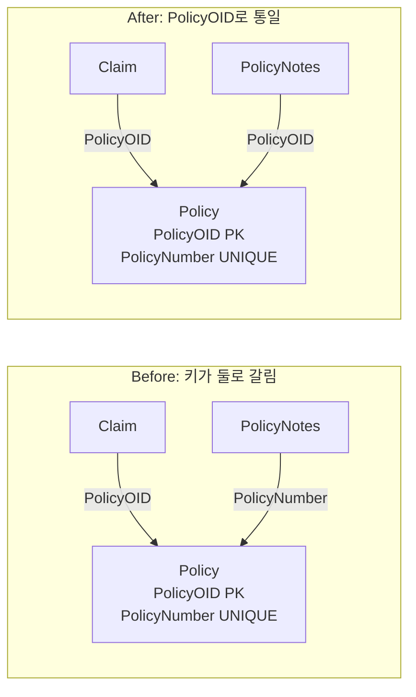

import { Callout, Steps, Step, Tabs, TabsList, TabsTrigger, TabsContent, Icon } from '@/components/writing-ui';

## 이게 뭔데

한 엔티티를 가리키는 키가 두 개 이상 굴러다닐 때, **"앞으로 이 엔티티는 이 키 하나로 식별한다"고 못 박고, DB 안 모든 테이블이 그 키만 보게 통일하는** 리팩토링이다.

비유하자면 회사에 사번이 두 종류 있는 꼴이다. 인사팀은 `EMP-2024-001`로 부르고, 출입카드 시스템은 `자릿수 8개 정수`로 부르고, 회식 정산 엑셀은 "이름+생일"로 부른다. 같은 사람인데 부서마다 부르는 이름이 다르다. 누가 누군지 맞추려면 매번 변환 테이블을 뒤져야 하고, 변환하다 한 글자 틀리면 엉뚱한 사람한테 월급이 꽂힌다. Consolidate Key Strategy는 "전사 공식 사번은 이거 하나"라고 정하고, 모든 시스템이 그것만 쓰게 정렬하는 작업이다.

<Callout type="info" title="한 줄 요약">
같은 엔티티를 식별하는 키가 여러 개면, 인덱스 비용도 여러 배고 접근 코드도 제각각이 된다. 공식 키 하나로 줄이고, 그 키를 FK로 참조하는 모든 테이블을 함께 정렬한다.
</Callout>

## 언제 쓰나

책의 은행 도메인을 그대로 빌려오자. 보험 정책 엔티티 `Policy`가 있다. 그런데 이 친구를 식별하는 방법이 둘이다.

- `PolicyOID` — 시스템이 발급한 대리 키(surrogate key). 의미 없는 일련번호. 정수.
- `PolicyNumber` — 사람이 읽는 정책 번호. 영업팀이 고객한테 불러주는 `"POL-2024-008812"` 같은 거. 문자열.

둘 다 유일하다. 둘 다 `Policy`를 정확히 한 건 가리킨다. 문제는, 이 `Policy`를 참조하는 테이블들이 **각자 다른 키로** 참조하고 있다는 거다. `Claim`(청구) 테이블은 `PolicyOID`로 조인하는데, `PolicyNotes`(정책 메모) 테이블은 `PolicyNumber`로 조인한다. 어떤 배치 프로그램은 `PolicyNumber`로 검색하고, 어떤 API는 `PolicyOID`로 검색한다.

이게 왜 냄새냐면:

**1. 인덱스가 두 배다.** 키 하나당 유일 인덱스 하나는 필수다. `Policy`에 키가 둘이면 유일 인덱스가 둘이고, FK로 참조하는 자식 테이블마다 또 인덱스가 붙는다. 인덱스는 조회엔 약이지만 `INSERT`/`UPDATE`/`DELETE`엔 짐이다. 정책 한 건 넣을 때마다 인덱스를 두 군데 갱신한다. 트래픽 많은 트랜잭션 테이블이면 이 짐이 누적으로 무겁다.

**2. 접근 코드가 제각각이다.** 누구는 `WHERE PolicyOID = ?`, 누구는 `WHERE PolicyNumber = ?`. 신규 입사자가 "정책 조인은 어느 컬럼으로 해요?"라고 물으면 정답이 "그때그때 다름"이다. 이건 유지보수 지옥의 전형적인 입구다.

**3. 조인이 무거워진다.** 최악은 자연 키가 **복합 키**일 때다. `PolicyNumber`가 단일 컬럼이 아니라 `(BranchCode, PolicyYear, SerialNo)` 세 컬럼 조합이면, 조인 조건이 `ON a.branch = b.branch AND a.year = b.year AND a.serial = b.serial`로 길어진다. 단일 정수 키 하나로 조인하는 것보다 비교 비용도 크고, 실수할 여지도 크다.

이 셋 중 하나라도 보이면, 키를 하나로 통합할 때다.

### 시나리오: 이런 적 있을 거임

월말 정산 배치가 갑자기 정책 200건을 누락했다. 추적해 보니 `PolicyNotes`가 `PolicyNumber`로 `Policy`를 조인하는데, 그 200건은 정책 번호 채번 규칙이 작년에 바뀌면서 `PolicyNotes` 쪽 문자열에 공백이 한 칸 섞여 들어가 있었다. `"POL-2024-008812"` vs `"POL-2024-008812 "`. 눈으로는 같은데 조인이 안 붙는다.

`PolicyOID`(의미 없는 정수)로 조인했으면 절대 안 났을 사고다. 사람이 읽으라고 만든 문자열 키를 시스템 조인에 쓰면, 사람이 만든 실수가 그대로 조인을 끊는다. 이게 키가 둘로 갈려 있을 때 생기는 전형적인 손해다. "어떤 테이블은 안전한 키로, 어떤 테이블은 위험한 키로" 참조하고 있으니, 약한 고리에서 터진다.

## 주의할 점

이 리팩토링이 만만해 보이면 함정이다. 핵심 비용은 소스 테이블이 아니라 **참조 테이블 전부**에 있다.

<Callout type="warning" title="파급 범위를 먼저 세어라">
`Policy`의 키를 `PolicyNumber` → `PolicyOID`로 통일한다는 건, `PolicyNumber`를 FK로 참조하던 **모든 자식 테이블의 컬럼을 바꾸는 일**이다(이게 Replace Column 리팩토링). `PolicyNotes`, `Claim`, `Payment`, 어디서 또 참조하는지 다 찾아야 한다. 빠뜨린 테이블 하나가 통합 후 조인을 끊는다. 스키마를 건드리기 전에 "이 키를 누가 참조하는가"부터 전수 조사할 것.
</Callout>

또 하나. **기존 키 중에 "단 하나의 적절한 키"가 없을 수도 있다.** 위 예시는 운 좋게 `PolicyOID`라는 멀쩡한 대리 키가 이미 있었다. 그런데 어떤 엔티티는 자연 키밖에 없고, 그 자연 키마저 (a) 복합이라 무겁거나 (b) 비즈니스 규칙이 바뀌면 값이 변할 수 있어서 식별자로 쓰기 불안한 경우가 있다. 이럴 땐 통합할 "공식 키"를 **새로 만들어야** 한다 — Introduce Surrogate Key. 의미 없는 일련번호를 새 PK로 도입하고, 그걸 공식 키로 삼는 거다.

<Callout type="note" title="키를 줄인다고 제약까지 버리는 건 아니다">
`PolicyNumber`를 공식 키 자리에서 내린다고 해서, `PolicyNumber`의 **유일성(UNIQUE) 제약까지 떼라는 건 아니다.** 정책 번호는 여전히 중복되면 안 되는 업무 값이다. 키 전략 통합의 목표는 "식별/조인에 쓰는 키를 하나로"이지, "다른 컬럼을 자유롭게 풀어라"가 아니다. `PolicyNumber`는 조회용 보조 키 겸 UNIQUE 제약으로 남기고, 시스템 조인만 `PolicyOID`로 모는 게 보통 정답이다.
</Callout>

## 이렇게 한다

목표 상태는 명확하다. `Policy`는 `PolicyOID` 하나로 식별하고, `PolicyNotes`를 포함한 모든 자식이 `PolicyOID`로 조인한다.



순서대로 가자.

<Steps>
<Step title="공식 키를 확정한다">
이해관계자와 합의해 "`Policy`의 공식 키는 `PolicyOID`"라고 못 박는다. 대리 키가 없다면 이 단계에서 Introduce Surrogate Key로 새로 만든다. 합의가 핵심이다 — 영업팀은 `PolicyNumber`로 일을 하므로, "조회/표시는 여전히 PolicyNumber로 한다, 다만 시스템 조인 키만 PolicyOID로 바꾼다"는 점을 분명히 해야 반발이 없다.
</Step>

<Step title="참조 테이블을 전수 조사한다">
`PolicyNumber`를 FK나 조인 키로 쓰는 모든 테이블을 찾는다. 카탈로그 뷰로 긁어내는 게 안전하다.

```sql
-- PostgreSQL: PolicyNumber라는 이름의 컬럼을 가진 테이블 전수 조사
SELECT table_name, column_name
FROM information_schema.columns
WHERE column_name = 'policynumber'
  AND table_schema = 'public';
```

이름이 제각각이면(`policy_no`, `pol_num` 등) 이름으로만 못 잡으니, 코드베이스에서 `PolicyNumber`로 조인하는 SQL도 같이 grep 한다.
</Step>

<Step title="소스 스키마를 정렬한다">
가장 단순한 길은 **현재 PK 유지**다. `Policy.PolicyOID`가 이미 PK라면 소스 테이블은 손댈 게 거의 없다. `PolicyNumber`는 UNIQUE 제약으로 남기되, 더 이상 조인 키로 쓰지 않을 거라면 그 용도로 만들어 뒀던 보조 인덱스는 정리 대상인지 본다.

```sql
-- 소스: PolicyOID는 PK 그대로, PolicyNumber는 UNIQUE만 유지
ALTER TABLE Policy
  ADD CONSTRAINT uq_policy_number UNIQUE (PolicyNumber);

-- 조인 전용으로 만들었던 보조 인덱스가 더 안 쓰이면 정리
-- DROP INDEX idx_policy_number_for_join;
```

대리 키를 새로 도입하는 경우라면 여기서 `PolicyOID` 컬럼을 추가하고 일련번호를 채운다.
</Step>

<Step title="자식 테이블에 공식 키 컬럼을 추가한다 (Replace Column)">
`PolicyNotes`가 `PolicyNumber`로 참조 중이라면, `PolicyOID` 컬럼을 새로 추가한다. **기존 컬럼을 바로 갈아엎지 말고 추가부터** 한다 — 이게 expand 단계다.

```sql
-- PolicyNotes에 공식 키 컬럼 추가 (아직 NOT NULL/FK 안 검)
ALTER TABLE PolicyNotes
  ADD COLUMN PolicyOID BIGINT;
```
</Step>

<Step title="데이터를 마이그레이션한다">
새 컬럼을 기존 키로 조인해서 채운다. 책의 SQL이 거의 그대로 쓰인다.

```sql
-- PolicyNumber로 짝을 찾아 PolicyOID를 복사해 채운다
UPDATE PolicyNotes pn
SET PolicyOID = p.PolicyOID
FROM Policy p
WHERE pn.PolicyNumber = p.PolicyNumber;
```

대량이면 한 방에 `UPDATE` 치지 말고 배치로 쪼개라(키 범위로 끊어 `WHERE PolicyOID BETWEEN ... AND ...` 식). 채운 뒤엔 **빠진 게 없는지 검증**한다.

```sql
-- 매칭 실패(=공백/표기 불일치 등으로 짝 못 찾음) 잔여 확인
SELECT COUNT(*) FROM PolicyNotes WHERE PolicyOID IS NULL;
```

앞 시나리오의 "공백 한 칸" 같은 더러운 데이터가 여기서 0이 아닌 숫자로 잡힌다. 통합의 부수 효과로 데이터 품질 문제가 드러나는 거다 — 이걸 먼저 정제하고 넘어가야 한다.
</Step>

<Step title="제약을 채우고 FK로 묶는다">
값이 다 차고 검증이 끝나면, NOT NULL과 FK 제약을 건다. 운영 중인 큰 테이블이면 락을 길게 잡지 않도록 검증을 분리한다.

```sql
-- PostgreSQL: ADD CONSTRAINT NOT VALID로 즉시 무락에 가깝게 걸고,
-- VALIDATE로 기존 행을 나중에 천천히 검사 (긴 락 회피)
ALTER TABLE PolicyNotes
  ADD CONSTRAINT fk_notes_policy
  FOREIGN KEY (PolicyOID) REFERENCES Policy (PolicyOID)
  NOT VALID;

ALTER TABLE PolicyNotes
  VALIDATE CONSTRAINT fk_notes_policy;
```
</Step>

<Step title="접근 프로그램의 조인/WHERE를 PolicyOID로 바꾼다">
이제 코드 차례다. `PolicyNumber`로 조인하던 SQL을 `PolicyOID`로 바꾼다. 복합 자연 키였다면 조인 조건이 한 줄로 줄어든다.

```sql
-- Before: 사람이 읽는 문자열 키로 조인 (공백/표기에 취약)
SELECT pn.*
FROM PolicyNotes pn
JOIN Policy p ON pn.PolicyNumber = p.PolicyNumber;

-- After: 의미 없는 정수 키로 조인 (안전 + 빠름)
SELECT pn.*
FROM PolicyNotes pn
JOIN Policy p ON pn.PolicyOID = p.PolicyOID;
```

ORM도 관계 매핑을 공식 키로 바꾼다.

```typescript
// Before: PolicyNotes가 PolicyNumber로 Policy를 참조
@ManyToOne(() => Policy)
@JoinColumn({ name: 'PolicyNumber', referencedColumnName: 'policyNumber' })
policy: Policy;

// After: 공식 키 PolicyOID로 참조
@ManyToOne(() => Policy)
@JoinColumn({ name: 'PolicyOID', referencedColumnName: 'policyOID' })
policy: Policy;
```
</Step>

<Step title="구 컬럼을 정리한다 (contract)">
모든 코드가 `PolicyOID`로 넘어간 게 확인되면, `PolicyNotes.PolicyNumber` 같은 **중복 보유 컬럼은 드롭**한다. 단, 영업팀이 메모 화면에서 정책 번호를 직접 봐야 한다면 표시용으로 남길 수도 있다 — 이건 업무 판단이다. 식별/조인용으로는 더 이상 안 쓴다는 게 핵심.
</Step>
</Steps>

### 현대 도구로 강화

위 9단계는 사실 expand-contract(parallel change) 패턴 그 자체다. 2006년 책은 "전환 기간 + 동기화 트리거"로 이걸 손코딩하지만, 지금은 도구가 절반을 대신해 준다.

<Tabs defaultValue="migration">
<TabsList>
<TabsTrigger value="migration">마이그레이션 도구</TabsTrigger>
<TabsTrigger value="online">온라인 스키마 변경</TabsTrigger>
<TabsTrigger value="dual">전환 기간 동기화</TabsTrigger>
</TabsList>

<TabsContent value="migration">

Flyway/Liquibase/Alembic 같은 도구로 expand → migrate → contract를 **별개 버전 스크립트로 쪼개** 배포한다. 한 릴리스에 `V47_1__add_policyoid_to_notes.sql`(컬럼 추가), 다음 릴리스에 `V47_2__backfill_and_fk.sql`(채우고 FK), 마지막에 `V47_3__drop_policynumber.sql`(구 컬럼 드롭). 각 단계가 독립 배포라 중간에 문제가 생겨도 그 지점에서 멈추고 롤백 판단을 할 수 있다.

```text
db/migration/
  V47_1__add_policyoid_to_policynotes.sql   -- expand
  V47_2__backfill_policyoid_and_fk.sql      -- migrate + validate
  V47_3__drop_legacy_policynumber.sql       -- contract (다음 릴리스 이후)
```

</TabsContent>

<TabsContent value="online">

자식 테이블이 수천만 행짜리 트랜잭션 테이블이면, `ALTER TABLE ADD COLUMN`이 락을 길게 잡아 서비스가 멈출 수 있다. 무중단으로 가려면:

- **MySQL**: `gh-ost`나 `pt-online-schema-change`로 섀도 테이블에 컬럼을 추가하고 백그라운드로 복사 후 원자적 스왑.
- **PostgreSQL**: `ADD COLUMN ... NULL`은 메타데이터만 바꿔 빠르다. 인덱스는 `CREATE INDEX CONCURRENTLY`, FK는 위에서 본 `NOT VALID` → `VALIDATE`로 락을 쪼갠다.

핵심은 "큰 테이블에 막 ALTER 치지 말 것". 통합 자체보다 **통합하는 도중 서비스를 안 멈추는 법**이 실무 난이도의 대부분이다.

</TabsContent>

<TabsContent value="dual">

backfill 시작과 코드 배포 사이에 **새로 들어오는 행**이 있다. 그 사이 `INSERT`된 `PolicyNotes`는 `PolicyOID`가 비어 있을 수 있다. 책은 양방향 동기화 트리거로 이 구간을 메운다. 현대적 선택지:

- **DB generated column / 트리거**: `PolicyNumber`로부터 `PolicyOID`를 채우는 트리거를 전환 기간에만 단다.
- **애플리케이션 dual-write**: 새 INSERT 코드가 두 키를 다 채우게 잠깐 바꿔 둔다. 트리거보다 디버깅이 쉽다.
- **CDC(Debezium)**: 변경 이벤트를 흘려 backfill 잡이 따라잡게 한다(대규모일 때).

단일 앱·단일 ORM이고 짧은 점검 창이 허용되면, 이 전환 기간을 **통째로 생략**하고 점검 시간에 expand+migrate+contract를 한 번에 끝내는 게 제일 싸다. 동기화 트리거는 무중단 다중 앱일 때만 꺼내는 비싼 도구다.

</TabsContent>
</Tabs>

<Callout type="success" title="통합이 끝나면 따라오는 보너스">
키가 정수 대리 키 하나로 모이면 조인 비교가 가벼워지고, 사람이 읽는 문자열 키에서 오던 공백/대소문자/표기 불일치 사고가 사라진다. 접근 코드도 "정책 조인은 무조건 PolicyOID"로 단일화돼서, 신규 입사자한테 설명할 규칙이 하나로 준다. 인덱스도 줄어 쓰기 부하가 가벼워진다.
</Callout>

## 정리

Consolidate Key Strategy는 화려한 리팩토링이 아니다. "같은 걸 여러 이름으로 부르던 걸, 한 이름으로 통일하는" 정리정돈이다. 그런데 효과는 정리정돈치고 크다 — 인덱스 부담이 줄고, 조인이 가벼워지고, 무엇보다 접근 코드가 일관돼진다.

> **키가 둘이면 진실의 출처가 둘이고, 진실의 출처가 둘이면 언젠가 둘이 어긋난다.**

요령은 세 가지다. 첫째, 손대기 전에 **누가 이 키를 참조하는지 전수 조사**한다(파급은 소스가 아니라 자식 테이블에 있다). 둘째, 적절한 단일 키가 없으면 **대리 키를 새로 만든다**(Introduce Surrogate Key). 셋째, expand-contract로 **추가 → 채우기 → 검증 → 드롭** 순서를 지켜, 운영 중에도 끊김 없이 키를 바꾼다. 그러면 "이 정책은 어느 컬럼으로 조인해요?"라는 질문에 영원히 같은 답을 줄 수 있다.
