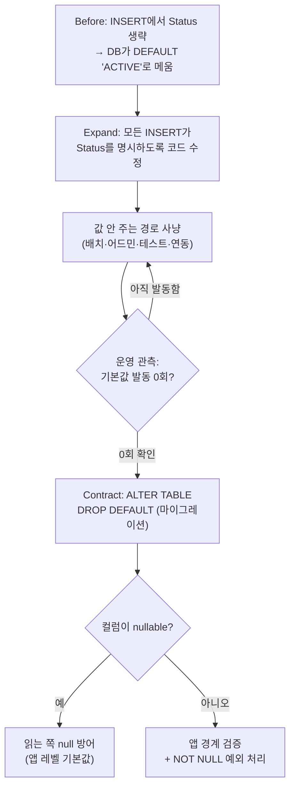

import { Callout, Steps, Step, Tabs, TabsList, TabsTrigger, TabsContent, Icon } from '@/components/writing-ui';

## 이게 뭔데

Drop Default Value. 이름 그대로다. **테이블 컬럼에 걸려 있던 DB 기본값(`DEFAULT`)을 떼어내는** 리팩토링이다.

비유하자면, 같이 사는 룸메이트가 매번 내 몫의 쓰레기까지 대신 버려주던 상황이다. 처음엔 고마웠다. 내가 깜빡해도 쓰레기는 늘 비워져 있었으니까. 근데 어느 날부터 내가 알아서 잘 버리기 시작했다. 그럼 룸메이트가 계속 내 쓰레기까지 챙길 이유가 없어진다. "이제 내가 할게"라고 정리하는 일, 그게 바로 Drop Default Value다. 값을 채우는 책임이 DB에서 애플리케이션으로 넘어간 거다.

`Customer.Status` 컬럼이 있다고 하자. 예전엔 신규 고객을 만들 때 앱이 상태값을 안 줬다. 그래서 DB에 `DEFAULT 'ACTIVE'`를 걸어놓고, INSERT에 `Status`가 빠지면 DB가 알아서 `'ACTIVE'`로 채웠다. 그런데 이제 앱이 가입 플로우에서 상태를 명시적으로 정한다(가입 직후엔 `PENDING`, 이메일 인증 후 `ACTIVE` 식으로). DB가 임의로 끼얹는 기본값이 오히려 거슬리는 시점이 온 거다.

<Callout type="info" title="한 줄 요약">
값을 채우는 주체가 DB에서 앱으로 넘어갔으면, DB의 `DEFAULT`는 은퇴시킨다. 단, 떼어내는 순간 "값을 안 주면 어떻게 되는가"가 바뀌니 그 뒷감당을 먼저 설계해야 한다.
</Callout>

## 언제 쓰나

동기는 거의 항상 하나다. **예전엔 DB가 값을 메워줬는데, 이제는 앱이 값을 책임진다.**

기본값이라는 건 원래 "아무도 값을 안 줄 때를 위한 안전망"이다. 옛날 코드, 옛날 배치, 옛날 관리 화면이 `Status` 없이 INSERT를 날리던 시절엔 그 안전망이 일을 했다. 근데 시스템이 자라면서 값을 정하는 책임이 한곳으로 모이는 일이 생긴다. 도메인 로직이 "고객 상태는 가입 단계에 따라 이렇게 정한다"를 명확히 알게 되면, DB가 뒤에서 `'ACTIVE'`를 끼얹는 게 오히려 진실을 흐린다.

이런 냄새가 나면 Drop Default Value를 의심해도 된다.

- INSERT 코드에 이미 `Status`를 항상 채워 넣고 있다. DB의 `DEFAULT`는 도달조차 안 되는 죽은 안전망이다.
- 그런데 어쩌다 한 번, 누가 `Status`를 빠뜨리면 DB가 조용히 `'ACTIVE'`로 메운다. 버그가 에러로 안 터지고 **"그럴듯한 가짜 값"으로 묻힌다.** 이게 제일 고약하다.
- 기본값이 비즈니스적으로 더는 맞지 않는다. 예전엔 신규 고객이 곧장 `ACTIVE`였는데, 이메일 인증을 도입하면서 `PENDING`이 디폴트여야 맞는다. 근데 코드와 DB가 서로 다른 기본값을 갖고 다투기 시작한다.

핵심은, **기본값이 "도움"에서 "거짓말 가리개"로 바뀌는 순간**이다. 빠진 값을 예외로 드러내고 싶은데 DB가 자꾸 가려주면, 그 가림막을 걷는 게 이 리팩토링이다.

### 현실 시나리오: 이런 적 있을 거임

은행 백오피스. `Customer.Status` 컬럼엔 `DEFAULT 'ACTIVE'`가 걸려 있다. 가입 API는 멀쩡히 상태를 잘 넣는다. 평화로웠다.

그러다 어느 분기, "휴면 고객 일괄 등록" 배치를 새로 짠다. 외부 제휴사한테서 받은 CSV를 그대로 밀어 넣는 잡인데, 이 CSV엔 상태 컬럼이 없다. 배치 짠 사람은 "상태는 나중에 정해지니까 비워두면 되겠지" 하고 `Status`를 INSERT에서 뺐다. 그랬더니 DB가 친절하게 전부 `'ACTIVE'`로 채워줬다.

며칠 뒤. 마케팅이 "활성 고객 전체 대상 프로모션 문자"를 돌린다. `WHERE Status = 'ACTIVE'`. 휴면 고객 수만 명한테 "오랜만이에요! 지금 가입하세요!" 문자가 날아간다. 이미 고객인 사람한테. 컴플레인이 쌓이고, 회의가 잡히고, 원인을 캐다 보니 그 CSV 배치가 나온다. **에러는 단 한 줄도 안 났다.** DB가 빈칸을 너무 성실하게 메워준 게 죄였다.

이런 일을 막으려면, "값을 안 주면 그럴듯한 가짜로 채워지는" 동작 자체를 없애야 한다. 즉 `DEFAULT`를 떼고, 값은 앱이 명시적으로 책임지게 만든다.

## 주의할 점

겉보기엔 `ALTER TABLE` 한 줄짜리 작은 리팩토링이다. 근데 작은 변경일수록 부수효과를 얕보다가 당한다. 책이 짚는 두 갈래를 그대로 가져온다.

<Callout type="warning" title="떼기 전에 두 가지를 점검해라">
**1) null 유입 — 컬럼이 nullable일 때.** 기본값을 떼면, 값을 안 준 INSERT는 이제 `'ACTIVE'`가 아니라 **`NULL`이 들어간다.** "어차피 채워져 있겠지" 하고 `Status`를 늘 non-null로 가정하던 코드(예: `status.toUpperCase()`, `switch(status)`)가 `NULL`을 만나 NPE를 내거나 분기에서 조용히 빠진다. 동작이 *깨지는* 게 아니라 *달라진다*는 게 위험하다. 컴파일도 통과하고, 정상 경로 테스트도 통과한다.

**2) 예외 폭발 — 컬럼이 non-nullable일 때.** `Status NOT NULL`인데 기본값까지 떼면, 값을 안 주는 INSERT는 곧장 DB 예외(`NOT NULL constraint failed`)로 터진다. 안전망이 두 겹(기본값 + non-null)이었는데 한 겹을 걷어낸 셈이다. 이제 "값 안 주는 모든 경로"를 찾아 값을 넣거나, 못 찾으면 운영에서 INSERT가 깨진다. 이 경우 **들이는 노력 대비 가치를 먼저 따져라.** 값 안 주는 경로가 사방에 흩어져 있으면, 기본값을 남겨두는 게 나을 수도 있다.
</Callout>

그리고 데이터 품질 리팩토링이 늘 끌고 다니는 곁가지가 하나 더 있다. **뷰와 저장 프로시저가 기본값에 기대고 있지 않은지** 확인하는 일이다. 어떤 뷰가 `COALESCE(Status, 'ACTIVE')` 없이 그냥 `Status`를 믿고 쓰거나, 프로시저가 "INSERT하면 알아서 ACTIVE 되겠지" 가정하고 있다면, 기본값을 떼는 순간 그것들도 같이 흔들린다. 테스트 스위트 돌리고, DDL에서 컬럼명을 검색해서 의존 지점을 먼저 훑어라.

<Callout type="note" title="Drop Default Value vs Drop Non-Nullable">
둘 다 "컬럼에 걸린 보호장치를 떼는" 작업이라 헷갈리기 쉽다. 갈라보자. **Drop Default Value**는 *값을 자동으로 채워주는 것*을 끄는 거고(null 또는 예외가 새로 가능해짐), **Drop Non-Nullable**은 *null을 금지하던 것*을 푸는 거다(null이 새로 허용됨). 방향이 반대다. 한쪽은 자동 채움을 끄고, 한쪽은 빈칸을 허락한다. 이번 글의 주제는 전자다.
</Callout>

## 이렇게 한다

큰 그림은 단순하다. **(1) 먼저 앱이 값을 100% 책임지게 만들고, (2) 그게 확인된 다음에 DB 기본값을 떼고, (3) 떼면서 드러나는 빈칸을 처리한다.** 순서가 핵심이다. 기본값부터 덜컥 떼면 안 된다 — 안전망을 먼저 걷고 나서 "혹시 떨어지는 사람 없나" 보는 꼴이 된다.

이걸 expand-contract(parallel change)로 풀면 무중단으로 안전하게 굴러간다.

<Steps>
<Step title="Expand: 앱이 값을 항상 채우게 만든다 (DB는 아직 그대로)">
기본값은 **그대로 둔 채**, 모든 INSERT 경로가 `Status`를 명시적으로 채우도록 코드를 먼저 고친다. 이 단계에선 DB 스키마를 건드리지 않으니 롤백도 쉽고 위험이 0에 가깝다. 앱이 항상 값을 주면, DB의 `DEFAULT`는 도달하지 않는 죽은 코드가 된다 — 떼어내도 안전한 상태로 만드는 게 이 단계의 목적이다.
</Step>
<Step title="값을 안 주는 경로를 사냥한다">
가장 품이 드는 진짜 작업. 운영 코드의 INSERT뿐 아니라 배치, 마이그레이션 스크립트, 어드민 화면의 raw SQL, 테스트 픽스처, 외부 연동 잡까지 — `Customer`에 INSERT하는 **모든** 경로를 찾아 `Status`를 채운다. 앞의 휴면 CSV 배치 같은 놈을 이때 잡아야 한다. 못 찾고 남겨두면 그게 곧 운영 사고의 씨앗이다.
</Step>
<Step title="관측으로 검증한다 (떼기 전에 증거를 모은다)">
"다 고쳤겠지"는 믿지 마라. 한동안 운영에서 **기본값이 실제로 발동하는지** 본다. 값을 안 줬을 때만 채워지도록 임시 표식을 두거나(예: 잠시 `DEFAULT '__UNSET__'`로 바꿔 그 값이 들어오는지 모니터링), 애플리케이션 로그/메트릭으로 "Status 없이 들어온 INSERT" 카운트를 잰다. 일정 기간 0이면 떼도 된다는 증거가 생긴 거다.
</Step>
<Step title="Contract: DB 기본값을 제거한다">
이제 떼낸다. 마이그레이션 도구로 한 줄.
</Step>
<Step title="빈칸 처리 정책을 확정한다">
기본값이 사라진 뒤 "그래도 값이 안 들어오면 어쩔 건가"를 코드로 못박는다. nullable이면 null 방어(또는 앱 레벨 기본값), non-nullable이면 명시적 검증/예외 처리.
</Step>
</Steps>

### 스키마 변경 (DDL)

2006년 책은 이걸 직접 `ALTER TABLE`로 손코딩한다. 골격은 지금도 같다.

```sql
-- Before: 컬럼에 DB 기본값이 걸려 있음
-- CREATE TABLE Customer (... Status VARCHAR(20) DEFAULT 'ACTIVE' ...)

-- After: 기본값 제거
-- Oracle 계열(책의 표기): 기본값을 null로 = 기본값 없음
ALTER TABLE Customer MODIFY Status DEFAULT NULL;
```

DBMS마다 문법이 갈린다. 요점은 "이 컬럼의 `DEFAULT`를 없앤다"로 동일하다.

```sql
-- PostgreSQL
ALTER TABLE Customer ALTER COLUMN Status DROP DEFAULT;

-- MySQL / MariaDB
ALTER TABLE Customer ALTER COLUMN Status DROP DEFAULT;

-- SQL Server (제약 이름으로 관리되므로 제약을 드롭)
ALTER TABLE Customer DROP CONSTRAINT DF_Customer_Status;
```

데이터 마이그레이션(DML)은 **없다.** 기본값을 떼는 건 기존 행의 값을 건드리지 않는다. 이미 `'ACTIVE'`로 저장된 행은 그대로 `'ACTIVE'`다. 바뀌는 건 **앞으로 들어올 행의 동작**뿐이다. 그래서 이 리팩토링의 진짜 작업은 DDL이 아니라 접근 프로그램(코드) 쪽에 몰려 있다.

현대 실무에선 이 한 줄을 손으로 안 친다. 버전 관리되는 마이그레이션으로 넣는다. 그래야 로컬-스테이징-운영이 같은 변경을 같은 순서로 받고, 롤백 경로도 남는다.

<Tabs defaultValue="flyway">
<TabsList>
<TabsTrigger value="flyway">Flyway</TabsTrigger>
<TabsTrigger value="liquibase">Liquibase</TabsTrigger>
<TabsTrigger value="alembic">Alembic</TabsTrigger>
</TabsList>

<TabsContent value="flyway">
```sql
-- V49__drop_default_customer_status.sql
ALTER TABLE Customer ALTER COLUMN Status DROP DEFAULT;
```
순방향만 있는 단순 변경이라 Flyway 같은 forward-only 도구와 궁합이 좋다. 되돌려야 하면 다음 버전에서 `SET DEFAULT 'ACTIVE'`를 다시 적용하는 보상 마이그레이션을 새로 발행한다.
</TabsContent>

<TabsContent value="liquibase">
```yaml
databaseChangeLog:
  - changeSet:
      id: 49-drop-default-customer-status
      author: bank-team
      changes:
        - dropDefaultValue:
            tableName: Customer
            columnName: Status
      rollback:
        - addDefaultValue:
            tableName: Customer
            columnName: Status
            defaultValue: "ACTIVE"
```
Liquibase는 `dropDefaultValue`라는 전용 change type을 주고, `rollback`까지 선언적으로 적어둘 수 있다. 떼는 변경과 되돌리는 변경이 한 changeSet에 같이 박혀 있어 의도가 분명하다.
</TabsContent>

<TabsContent value="alembic">
```python
def upgrade():
    op.alter_column("customer", "status", server_default=None)

def downgrade():
    op.alter_column("customer", "status", server_default="ACTIVE")
```
`server_default`가 바로 DB가 채우는 기본값이다. `None`으로 두면 떼는 거고, ORM 모델 정의에서도 `server_default`를 같이 지워 코드와 스키마가 어긋나지 않게 한다.
</TabsContent>
</Tabs>

<Callout type="info" title="잠깐, 앱 기본값과 DB 기본값을 헷갈리지 마라">
ORM에는 비슷해 보이는 두 개념이 있다. SQLAlchemy로 보면 `default=`는 **앱(파이썬)에서 INSERT 직전에 값을 채우는** 것이고, `server_default=`는 **DB의 `DEFAULT` 절**이다. drizzle도 똑같이 갈린다 — `.default(v)`는 DDL에 `DEFAULT`를 찍는 DB 기본값이고, `.$defaultFn(fn)`(구 `$default`)은 drizzle을 거치는 insert에서만 채우는 앱 기본값이다. 이번 리팩토링이 떼는 건 전자(`.default()` / `server_default`)다. 오히려 `default=`(앱 기본값)는 남겨두거나 새로 둬서, "값을 채우는 책임이 앱으로 넘어왔다"를 코드로 표현하는 게 자연스럽다. DB의 안전망은 끄되, 앱이 명시적으로 값을 정하게 하는 것 — 그게 이 리팩토링의 본질이다.
</Callout>

### 접근 프로그램(코드) 수정

여기가 진짜 본체다. 떼고 난 뒤 "값이 안 들어오는 경우"를 어떻게 다룰지가 nullable이냐 non-nullable이냐로 갈린다.

**INSERT는 무조건 값을 명시한다.** 어떤 경우든 출발점은 같다. 기본값에 기대 `Status`를 빼던 INSERT를, 값을 직접 주는 형태로 바꾼다.

```typescript
// Before: Status를 빼고 DB 기본값('ACTIVE')에 기댐
await db.query(
  `INSERT INTO Customer (Id, Name) VALUES ($1, $2)`,
  [id, name],
);

// After: 앱이 도메인 규칙에 따라 상태를 직접 정해서 넣는다
//        (가입 직후엔 PENDING, 인증 완료 시 ACTIVE 등)
const status = resolveInitialStatus(signupContext); // 'PENDING' | 'ACTIVE'
await db.query(
  `INSERT INTO Customer (Id, Name, Status) VALUES ($1, $2, $3)`,
  [id, name, status],
);
```

**컬럼이 nullable이면 — null 방어.** 기본값을 떼면 값을 안 준 INSERT는 `NULL`을 남긴다. 읽는 쪽이 이 `NULL`을 견디게 만든다. 책 표현으로는 "무시하거나 지능적 기본값(intelligent default)을 쓴다".

```typescript
// Before: 항상 채워져 있다고 믿고 그냥 사용 → NULL 만나면 폭발
function badge(c: Customer): string {
  return c.status.toUpperCase(); // status가 null이면 throw
}

// After: null을 명시적으로 다룬다 (앱 레벨 기본값으로 흡수)
function badge(c: Customer): string {
  return (c.status ?? "ACTIVE").toUpperCase();
}
```

읽는 경로가 여러 군데로 흩어져 있어서 매번 `?? 'ACTIVE'`를 붙이기 싫다면, 기본값을 떼는 대신 **Introduce Default Value를 앱 레이어에서** 하는 셈으로 도메인 모델 생성자나 매퍼 한 곳에서 null을 메우는 게 깔끔하다.

**컬럼이 non-nullable이면 — 명시적 검증 + 예외 처리.** 값을 안 주면 DB가 `NOT NULL` 예외를 던진다. 이 예외를 운영에서 처음 만나지 말고, 앱 경계에서 먼저 막는다.

```typescript
// 앱 경계에서 먼저 검증해 "안 준 값"을 명확한 도메인 에러로 바꾼다
function assertStatus(status: string | null): asserts status is string {
  if (status == null || status.trim() === "") {
    throw new DomainError("Customer.Status는 필수입니다. INSERT 전에 상태를 정하세요.");
  }
}
```

그리고 **기본값에 기대 예외를 무시하던 옛 코드는 정리한다.** 예전엔 "값 안 주면 DB가 ACTIVE로 메워주니까" 하고 넘기던 try/catch나 swallow가 있었다면, 이제 그건 죽은 코드거나 위험한 코드다. 책이 말하는 "기본값에 의존하던 접근 프로그램은 데이터 검증 코드를 추가하거나, (감당 못 하면) 이 리팩토링을 철회한다"가 바로 이 지점이다.

<Callout type="success" title="값 누락을 영영 못 들어오게 하고 싶다면 (현대 옵션)">
앱 검증은 사람이 코드를 빠뜨리면 뚫린다. DB 차원에서 "그럴듯한 가짜로 메우진 않되, 빈 값은 거부"하고 싶으면 두 가지를 같이 건다. (1) `Status`를 `NOT NULL`로 두고(빈 값 거부), (2) 허용 코드 집합을 `CHECK (Status IN ('ACTIVE','PENDING','DORMANT'))` 또는 룩업 테이블 FK로 묶는다. 이러면 기본값은 없지만 "아무 값이나/빈 값"은 DB가 막아준다. 운영 테이블에 `NOT NULL`이나 `CHECK`을 새로 거는 건 PostgreSQL이면 `ADD CONSTRAINT ... NOT VALID`로 먼저 걸고 한가할 때 `VALIDATE CONSTRAINT`로 검증하면 풀스캔 락을 피할 수 있다.
</Callout>

### 전체 흐름 그림



## 정리

Drop Default Value는 DDL 한 줄짜리 작은 리팩토링이지만, 진짜 무게중심은 코드 쪽에 있다. 떼는 행위 자체보다, **"값을 채우는 책임이 DB에서 앱으로 넘어왔다"는 사실을 코드로 끝까지 책임지는 일**이 본체다.

> **기본값은 친절한 안전망이지만, 안전망이 거짓말을 메우기 시작하면 걷어내야 한다.**

핵심 순서만 기억하자. 기본값을 먼저 떼지 마라. **앱이 값을 100% 책임지는 걸 먼저 만들고(expand), 관측으로 확인한 다음, 떼고(contract), 빈칸 처리 정책을 못박는다.** nullable이면 null을 견디게, non-nullable이면 빈 값을 명확한 에러로. 그러면 DB가 빈칸을 그럴듯한 가짜로 메워 사고를 묻는 일도, 떼자마자 운영 INSERT가 줄줄이 터지는 일도 없다.
