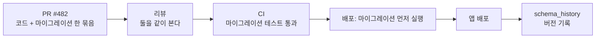
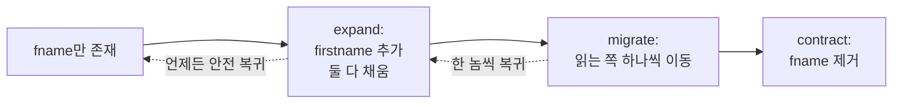

## 이게 뭔데

질문 하나. 지금 너네 운영 DB의 스키마를, 빈 서버에서 처음부터 똑같이 재현할 수 있냐? "어... 누가 콘솔에서 `ALTER TABLE` 친 거랑, 작년에 인턴이 추가한 인덱스랑, 마이그레이션 폴더에 있는 거랑... 다 합치면 되긴 할 텐데..." 이 대답이 나오는 순간, 너네 DB는 **형상 관리(configuration management) 밖에 있는** 거다.

형상 관리란 거창한 게 아니다. **"이 시스템의 현재 상태가 어떻게 만들어졌는지를 추적 가능한 단일 진실의 출처로 남기는 것"** 이다. 애플리케이션 코드는 이걸 당연히 한다. Git에 다 들어 있잖아. `git log` 찍으면 누가 언제 뭘 왜 바꿨는지 다 나오고, `git revert`면 어제 상태로 돌아간다. 근데 이상하게도 DB만큼은 이 규율이 자주 빠진다. 코드는 PR 받고 리뷰하고 버전 박으면서, 정작 그 코드가 의존하는 **스키마는 누가 운영 콘솔에서 손으로 친다.**

<Callout type="warning" title="한 줄 요약">
애플리케이션을 버전 관리하면서 DB 스키마를 손으로 관리하면, 코드는 재현 가능한데 그 코드가 돌아갈 환경은 재현 불가능한 기형이 된다. DDL·마이그레이션·참조 데이터·매핑까지 전부 앱과 같은 저장소에 넣어라.
</Callout>

이 글은 은행 도메인(Customer, Account, Balance, Policy, Insurance 테이블)을 계속 예시로 쓴다. 가상이지만, 너네 회사 어딘가에 분명 비슷한 게 있을 거다.

## 시나리오: FName을 FirstName으로 바꿨을 뿐인데

이 책의 저자들이 든 일화가 너무 현실적이라 그대로 가져온다. 누군가 `Customer.FName` 컬럼이 마음에 안 들었다. 줄임말이 보기 싫었던 거지. 그래서 `Customer.FirstName`으로 이름을 바꿨다. 컬럼명 리네임, 5초짜리 작업이다.

그리고 **외부 프로그램 50개가 깨졌다.**

급여 정산 배치도 `FName`을 찾고, 마케팅 리포트 쿼리도 `FName`을 찾고, 옆 팀 레거시 ESB도 `FName`을 찾고 있었으니까. 50개를 다 고치는 비용이 도저히 감당이 안 되는 상황. 결론은 **롤백**이다. `FirstName`을 다시 `FName`으로 되돌려야 한다.

자, 여기서 진짜 질문. **롤백을 어떻게 하지?**

```text
- 운영에 적용한 ALTER 문이 어딘가에 적혀 있나?  → 없음. 콘솔에서 손으로 침.
- 역방향 ALTER는 누가 가지고 있나?              → 아무도 안 만듦.
- 스테이징엔 적용됐나 안 됐나?                   → 기억 안 남.
- 50개 프로그램 중 몇 개가 새 이름으로 이미 배포됐나? → 파악 불가.
```

이게 형상 관리가 없을 때의 풍경이다. 변경을 적용하는 건 5초인데, **되돌리는 건 고고학**이 된다. 어떤 상태에서 어떤 상태로 갔는지에 대한 기록이 없으니, 역추적이 불가능하다.

<Callout type="error" title="뭐가 문제냐면">
- **롤백이 불가능하다**: 적용한 변경의 기록이 없으면 되돌릴 방법도 없다. "되돌릴 수 없는 변경"은 변경이 아니라 도박이다.
- **버전 식별이 안 된다**: 운영 배포 직전에 "지금 운영 스키마 버전이 뭐지? 어떤 마이그레이션까지 적용됐지?"를 알 수 없다. 사람이 기억으로 때운다.
- **환경 재현이 안 된다**: 신규 입사자가 로컬에 DB를 띄우려는데, "초기 스키마"라는 게 어디에도 없다. 누군가의 노트북 덤프를 받아 온다.
</Callout>

만약 이 컬럼 리네임이 **앱과 같은 저장소의 마이그레이션 스크립트로 들어가 있었다면**, 롤백은 PR 하나로 끝났을 거다. 역방향 스크립트를 돌리고, 어느 환경에 어디까지 적용됐는지는 `schema_history` 테이블이 알려주니까. 차이는 도구가 아니라 **규율**이다.

## 형상 관리에 넣어야 하는 것들

"DB를 버전 관리하자"고 하면 보통 DDL 파일 하나 떠올린다. 근데 책은 형상 관리 대상을 훨씬 넓게 잡는다. 그리고 그 리스트가 정확하다. **DB를 재현하고 롤백하는 데 필요한 모든 산출물**을 같은 저장소에 둬야 한다.

<Callout type="info" title="형상 관리 대상 (책의 1.7절)">
스키마를 정의하고, 채우고, 검증하는 데 관여하는 건 전부 대상이다.

- **DDL 스크립트** — 스키마 생성(CREATE TABLE, ...)
- **데이터 적재/추출/마이그레이션 스크립트** — 데이터를 옮기고 변환하는 코드
- **데이터 모델 파일** — ERD 등 설계 산출물
- **O-R 매핑 메타데이터** — ORM이 객체와 테이블을 연결하는 설정
- **참조 데이터(reference data)** — 코드 테이블, 통화 코드, Policy 종류 같은 "거의 안 변하지만 없으면 앱이 안 도는" 데이터
- **저장 프로시저·트리거 정의**
- **뷰 정의**
- **참조 무결성 제약** — FK, 체크 제약
- **시퀀스·인덱스 등 기타 객체**
- **테스트 데이터, 테스트 데이터 생성 스크립트, 테스트 스크립트**
</Callout>

여기서 사람들이 가장 자주 빼먹는 게 두 개다.

하나는 **참조 데이터.** 스키마는 버전 관리하면서 그 안을 채우는 코드 테이블은 누가 손으로 `INSERT` 한다. Policy 종류가 `LIFE`, `AUTO`, `HOME` 세 개인데, 운영엔 거기에 `MARINE`이 하나 더 있고 로컬엔 없다. 그래서 "내 로컬에선 되는데요"가 발생한다. 참조 데이터는 스키마만큼이나 앱 동작에 필수다. 같이 버전 관리해야 한다.

다른 하나는 **O-R 매핑.** Prisma 스키마, TypeORM 엔티티, Django 모델, JPA 어노테이션 — 이게 다 "객체와 테이블을 잇는 메타데이터"다. 다행히 요즘 ORM은 이게 코드 안에 있어서 자연히 Git에 들어간다. 하지만 그 매핑이 실제 DB 스키마와 **어긋나는** 순간을 잡아 줄 장치(드리프트 감지)는 따로 챙겨야 한다. 뒤에서 다룬다.

## 핵심 원리: 하나의 저장소, 하나의 진실

책의 5.12절은 이걸 딱 한 문장으로 정리한다. **"DB 자산을 애플리케이션과 같은 저장소(repository)에 함께 두면 가장 도움이 된다."** 누가 변경했는지 보이고, 롤백을 지원하기 때문이다.

이게 왜 중요한지는 "따로 두면 어떻게 되는지"를 보면 안다. DB 스크립트가 별도 저장소(혹은 누군가의 공유 드라이브)에 살면, 코드 PR과 스키마 변경이 **시간적으로 분리**된다. 그러면 이런 일이 벌어진다.

```text
[코드 저장소]   PR #482  "Account에 잔액 동결 기능 추가"  →  머지, 배포
[DB 스크립트]   잔액 동결에 필요한 frozen_at 컬럼 ALTER  →  ...누가 언제 돌리지?
```

코드는 `account.frozen_at`을 읽으려 드는데, 그 컬럼을 만드는 ALTER는 다른 저장소에 있고 아직 운영에 안 돌았다. 배포하자마자 `column frozen_at does not exist`로 터진다. **코드와 스키마가 한 PR, 한 커밋, 한 배포 단위로 묶여 있지 않으면** 이 정합성을 사람이 손으로 맞춰야 한다.

같은 저장소에 두면 이게 자동으로 해결된다. `frozen_at` 컬럼을 추가하는 마이그레이션과 그걸 쓰는 코드가 **같은 PR**에 들어간다. 리뷰어가 둘을 같이 본다. 배포 파이프라인이 마이그레이션을 먼저 돌리고 앱을 띄운다. `git revert` 하면 코드와 스키마 변경 의도가 같이 묶여 돌아온다(스키마 롤백 스크립트가 있다는 전제로).



## schema_history: 누가 어디까지 적용했는가

손코딩 시절엔 "이 DB에 어떤 변경까지 적용됐나"를 사람이 기억했다. 현대 마이그레이션 도구는 이걸 **DB 안의 테이블 하나로** 해결한다. Flyway는 `flyway_schema_history`, Liquibase는 `DATABASECHANGELOG`, Alembic은 `alembic_version`, Rails/Django도 각자 마이그레이션 추적 테이블을 둔다.

원리는 단순하다. 마이그레이션 스크립트마다 버전(혹은 체크섬)이 있고, 도구가 그걸 돌릴 때마다 이력 테이블에 한 줄을 박는다.

```sql
-- Flyway의 flyway_schema_history 대략 이런 모양
SELECT version, description, checksum, installed_on, success
FROM flyway_schema_history
ORDER BY installed_rank;
```

```text
version | description                  | installed_on        | success
--------+------------------------------+---------------------+--------
1       | create customer table        | 2026-01-03 09:11:02 | true
2       | create account balance       | 2026-01-09 14:22:51 | true
3       | rename fname to firstname    | 2026-02-01 10:05:33 | true
4       | revert firstname to fname    | 2026-02-01 16:40:12 | true   <- 앞 시나리오의 롤백
5       | add account frozen at        | 2026-03-12 11:30:00 | true
```

이 테이블 하나로 아까 "고고학"이었던 질문들이 전부 `SELECT` 한 방이 된다.

<Steps>
<Step title="지금 이 DB의 버전이 뭐지?">
이력 테이블의 마지막 줄을 보면 된다. 어느 환경이든 동일한 방식으로 확인 가능. "스테이징은 3번까지, 운영은 5번까지" 같은 상태를 사람 기억이 아니라 데이터로 안다.
</Step>
<Step title="아직 안 돌린 마이그레이션이 뭐지?">
도구가 저장소의 스크립트 목록과 이력 테이블을 비교해서, 적용 안 된 것만 골라 순서대로 돌린다(`flyway migrate`, `alembic upgrade head`, `rails db:migrate`).
</Step>
<Step title="스크립트가 적용 후 손상됐나?">
Flyway/Liquibase는 이미 적용한 스크립트의 체크섬을 저장한다. 누가 과거 마이그레이션 파일을 몰래 수정하면 체크섬이 안 맞아서 배포가 멈춘다. "이미 적용된 마이그레이션은 불변" 규율을 도구가 강제해 주는 거다.
</Step>
</Steps>

<Callout type="note" title="이미 적용한 마이그레이션은 절대 수정하지 마라">
가장 흔한 사고가 이거다. "어제 머지한 마이그레이션에 오타 있네?" 하고 그 파일을 고친다. 근데 그건 이미 동료들 로컬과 스테이징에 적용됐다. 이제 체크섬이 안 맞아서 모두의 환경이 깨진다. 규칙: **적용된 마이그레이션은 불변(immutable). 고칠 게 있으면 새 마이그레이션을 추가한다.** 위 이력 테이블의 4번(revert)처럼.
</Callout>

## 롤백을 진짜로 되게 만들기

형상 관리의 목적이 결국 "안전하게 되돌리기"라면, 롤백 가능한 변경을 어떻게 설계하느냐가 핵심이다. 두 갈래가 있다.

**1. 역방향 스크립트(down migration).** 모든 변경에 짝이 되는 역변경을 같이 적는다. Rails/Django/TypeORM 마이그레이션이 기본으로 `up`/`down`을 요구하는 이유다.

```sql
-- V3__rename_fname_to_firstname (up)
ALTER TABLE customer RENAME COLUMN fname TO firstname;

-- U3__rename_firstname_to_fname (down)
ALTER TABLE customer RENAME COLUMN firstname TO fname;
```

문제는, 이게 항상 깔끔하게 안 된다는 거다. 컬럼을 DROP 하는 마이그레이션의 down은 컬럼을 다시 만들 순 있어도 **날아간 데이터는 못 되살린다.** 그래서 "down 스크립트가 있다"가 곧 "안전하다"는 아니다.

**2. expand-contract(parallel change).** 그래서 위험한 변경엔 진짜 롤백 대신 **롤백할 필요가 없는 구조**를 쓴다. FName 사건이 딱 expand-contract로 풀렸어야 할 케이스다.

<Steps>
<Step title="Expand — 새 컬럼을 추가만 한다">
`firstname` 컬럼을 새로 추가한다. `fname`은 그대로 둔다. 트리거나 앱 코드가 둘을 동시에 채운다(dual-write). 이 시점엔 깨지는 게 없다. 추가만 했으니까.
</Step>
<Step title="Migrate — 읽는 쪽을 하나씩 옮긴다">
50개 프로그램을 한 번에 안 고친다. 하나씩 `firstname`을 읽도록 바꿔 배포한다. 한 놈 옮기고 멀쩡한지 보고, 다음 놈 옮긴다. 중간에 문제 생기면 그 한 놈만 되돌리면 된다.
</Step>
<Step title="Contract — 다 옮긴 뒤에야 옛 컬럼을 제거한다">
50개가 전부 `firstname`을 쓰는 게 확인된 (보통 몇 주~몇 달 뒤) 시점에 `fname`을 DROP 한다. 이 마지막 단계 전까지는 언제든 안전하게 돌아갈 수 있다.
</Step>
</Steps>

핵심은, expand-contract는 "변경"과 "정리"를 **시간적으로 분리**해서, 정리 직전까지 옛 상태를 살려 둔다는 거다. 그래서 롤백이 "고고학"이 아니라 "그냥 옛 컬럼 계속 쓰기"가 된다. FName→FirstName을 이렇게 했다면 50개가 동시에 깨지는 일 자체가 없었다.



## 환경을 한 방에 재현하기 (설치 스크립트와 IaC)

형상 관리가 제대로 되면 따라오는 보너스가 있다. **빈 서버에서 운영과 동일한 스키마를 한 명령으로 재현**할 수 있게 된다. 책 5.10절이 말하는 설치 스크립트가 정확히 이거다.

> 초기 DDL로 스키마 생성 → 적용 가능한 변경 스크립트 적용 → 회귀 테스트 스위트로 설치 성공 확인.

2006년엔 이걸 셸 스크립트로 짰다. 지금은 마이그레이션 도구가 그 자체로 설치 스크립트다. `flyway migrate` 한 방이면 빈 DB에 1번부터 끝까지 순서대로 적용된다. 그리고 이걸 IaC(Infrastructure as Code)와 묶으면 **DB 인스턴스 생성부터 스키마 적용까지가 전부 코드**가 된다.

```typescript
// 컨테이너로 DB 띄우고 마이그레이션까지 돌리는 통합 테스트 (Testcontainers 예시)
const pg = await new PostgreSqlContainer("postgres:16").start();

// 빈 DB에 저장소의 마이그레이션을 전부 적용 — 운영과 동일한 스키마가 생성됨
await runMigrations(pg.getConnectionUri());

// 이제 이 스키마 위에서 회귀 테스트를 돌린다
await runRegressionTests(pg.getConnectionUri());
```

여기서 중요한 게, 이게 단지 "편하다"의 문제가 아니라는 거다. **테스트가 매번 운영과 동일한 스키마를 처음부터 빌드한다는 건, 마이그레이션 전체가 항상 검증된다는 뜻**이다. 누가 깨진 마이그레이션을 머지하면 CI가 빨갛게 뜬다. 신규 입사자가 로컬을 세팅하는 것도 `docker compose up` + 마이그레이션 한 줄이다. "누구 노트북 덤프 받아 오세요"가 사라진다.

<Callout type="info" title="드리프트 감지: 코드와 운영 스키마가 갈라질 때">
형상 관리를 해도 누군가는 결국 운영 콘솔에서 `ALTER`를 친다(핫픽스라는 명목으로). 그 순간 저장소의 마이그레이션과 실제 운영 스키마가 **갈라진다(drift).** 이걸 잡으려면: (1) 운영 DB에 직접 DDL 치는 권한을 막고 마이그레이션 파이프라인으로만 변경하게 하거나, (2) 정기적으로 운영 스키마를 덤프해 저장소 기대치와 비교하는 드리프트 체크를 CI에 넣는다. Atlas, Liquibase diff, ORM의 `migrate diff` 같은 게 이 일을 한다.
</Callout>

## 온라인 변경: 적용 자체가 위험할 때

형상 관리로 "무엇을 적용할지"를 추적해도, **"적용하는 행위 자체"가 운영을 멈출 수** 있다. 큰 테이블에 `ALTER TABLE ... ADD COLUMN`을 치거나 인덱스를 만들면 락이 걸려 그 시간 동안 서비스가 멈춘다. 그래서 마이그레이션 스크립트는 **온라인으로** 적용되게 써야 한다.

```sql
-- 위험: 큰 테이블 전체에 락. 그동안 Account 조회/수정 다 멈춤
CREATE INDEX idx_account_customer ON account (customer_id);

-- 안전(PostgreSQL): 락 없이 인덱스 생성
CREATE INDEX CONCURRENTLY idx_account_customer ON account (customer_id);
```

제약 추가도 마찬가지다. 큰 테이블에 FK나 CHECK를 한 번에 거는 건 전체 검증 락이라 위험하다. Postgres라면 `NOT VALID`로 먼저 붙여 신규 행만 검증하게 하고, 나중에 한가할 때 `VALIDATE CONSTRAINT`로 기존 행을 검증한다.

```sql
-- 1) 먼저 제약을 추가하되 기존 행은 검증 안 함 (락 짧음)
ALTER TABLE account
  ADD CONSTRAINT fk_account_customer
  FOREIGN KEY (customer_id) REFERENCES customer (id) NOT VALID;

-- 2) 나중에 따로, 기존 행을 검증 (이건 락 약함)
ALTER TABLE account VALIDATE CONSTRAINT fk_account_customer;
```

MySQL에서 컬럼 타입 변경 같은 무거운 작업은 `gh-ost`나 `pt-online-schema-change` 같은 온라인 스키마 변경 도구가, 원본을 락 안 걸고 그림자 테이블에 복사해 가며 바꾼다. 핵심은, **마이그레이션 스크립트를 형상 관리에 넣는 것과, 그 스크립트가 운영에서 안전하게 도는 것은 별개의 규율**이라는 거다. 둘 다 챙겨야 한다.

## 공유 DB라는 함정

마지막으로 현대 환경 특유의 함정 하나. FName 사건의 "외부 프로그램 50개"는 옛날 얘기 같지만, 마이크로서비스 시대엔 더 흔해졌다. **여러 서비스가 같은 DB, 같은 테이블을 직접 공유**하면, 한 팀의 `ALTER`가 남의 서비스를 조용히 깬다. FName 사건이 분산 시스템 스케일로 재현되는 거다.

이걸 형상 관리만으로는 못 막는다. 구조적으로 풀어야 한다.

- **테이블 소유권 분리.** 한 테이블은 한 서비스만 쓰기(write)한다. 남의 데이터가 필요하면 그 서비스의 API를 부른다. 그러면 스키마 변경 영향이 소유 서비스 안에 갇힌다.
- **데이터 공유는 이벤트로.** 다른 서비스에 변경을 흘려줘야 하면 DB를 같이 보는 대신 이벤트를 발행한다. CDC(Debezium)로 DB 변경을 캡처하거나, outbox 패턴으로 비즈니스 트랜잭션과 이벤트 발행을 한 트랜잭션에 묶는다. 받는 쪽은 자기 스키마에 자기 식대로 저장한다.

이렇게 하면 "FName을 FirstName으로" 같은 변경이 **소유 서비스 내부의 마이그레이션 하나**로 끝난다. 바깥은 API/이벤트 계약만 지키면 되니, 50개가 동시에 깨지는 구조 자체가 사라진다. 계약을 바꿔야 하면 그땐 expand-contract를 계약 레벨에서 한다.

## 정리

FName 사건의 진짜 교훈은 "컬럼 리네임이 위험하다"가 아니다. **변경을 추적할 수 없으면 되돌릴 수도 없다**는 거다.

> 애플리케이션을 버전 관리하면서 DB를 손으로 관리하는 건, 절반만 재현 가능한 시스템을 만드는 일이다.

DDL, 마이그레이션, 참조 데이터, O-R 매핑, 테스트 데이터 — DB를 재현하고 롤백하는 데 필요한 모든 산출물을 앱과 **같은 저장소**에 넣어라. 그러면 `schema_history`가 "지금 이 환경의 버전"을 데이터로 알려주고, 마이그레이션 도구가 빈 서버를 운영과 동일하게 재현하고, 롤백이 고고학이 아니라 PR이 된다. 거기에 expand-contract로 변경을 안전하게 설계하고, 온라인 스키마 변경으로 적용 자체를 무중단으로 만들면, 스키마 변경은 더 이상 도박이 아니라 코드 배포처럼 평범한 일이 된다.

"이 DB를 빈 서버에서 처음부터 재현할 수 있냐"는 질문에 자신 있게 "응, 명령 한 줄"이라고 답할 수 있을 때, 비로소 DB가 형상 관리 안에 들어온 거다.
