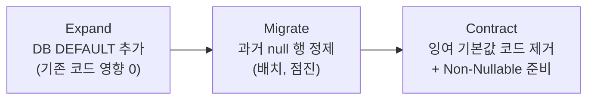

import { Callout, Steps, Step, Tabs, TabsList, TabsTrigger, TabsContent, Icon } from '@/components/writing-ui';

## 이게 뭔데

Introduce Default Value. 한 문장으로 요약하면 **"insert문이 이 컬럼을 안 채우면, DB가 미리 정해둔 값을 대신 넣어줘"** 하고 컬럼에 약속을 거는 거다.

비유를 하나 들자. 회식 장소 예약할 때 인원수 칸을 비워두고 보내면, 식당 사장님이 "보통 이런 모임은 6명 잡으니까 일단 6명으로 잡아둘게요" 하고 채워주는 거랑 똑같다. 네가 깜빡하고 인원을 안 적어도, 빈칸으로 남지 않고 합리적인 값이 들어간다. DB가 바로 그 사장님 역할을 하는 거다.

```sql
ALTER TABLE Customer MODIFY Status DEFAULT 'NEW';
```

이거 한 줄이면 끝이다. 이제부터 `Customer`에 행을 넣을 때 `Status`를 안 적으면, DB가 알아서 `'NEW'`를 박아준다. 리팩토링 카탈로그 중에서도 손에 꼽게 작고 단순한 축에 속한다. 스키마 변경이 딱 한 줄이니까.

<Callout type="info" title="한 줄 요약">
insert가 컬럼을 비워두면 DB가 약속된 기본값으로 채운다. 보기엔 ALTER 한 줄이지만, "기본값을 뭘로 할지"와 "null의 의미가 바뀐다"는 게 진짜 난이도다.
</Callout>

근데 이게 그렇게 사소했으면 카탈로그에 한 항목으로 안 들어갔겠지. ALTER 한 줄은 쉬운데, 그 한 줄을 결정하기까지가 어렵다. 이 글은 사실 그 "한 줄을 결정하는 회의실"에 관한 얘기다.

## 언제 쓰나

동기는 명확하다. **새 행을 넣을 때 이 컬럼이 항상 채워지길 바라는데, 현실의 insert문은 그렇지 않을 때.** 왜 안 채워지냐면 보통 이렇다.

- **컬럼이 나중에 추가됐다.** `Customer` 테이블 만들 때는 `Status`가 없었다. 한참 뒤에 "고객 상태 좀 추적하자"고 컬럼을 붙였는데, 정작 그 테이블에 insert하는 코드는 옛날 그대로다. `Status`를 모르니 안 채운다.
- **앱이 그 컬럼에 관심이 없다.** 가입 처리하는 코드 입장에선 "상태? 그건 내 알 바 아니고, 일단 고객 행만 만들면 됨" 한다. 그래서 비워둔 채로 던진다.

이럴 때 컬럼이 nullable이면 조용히 null이 들어가고, NOT NULL이면 insert가 펑 터진다. 둘 다 반갑지 않다. 기본값을 도입하면 "안 채우면 자동으로 적당한 값" 이라는 안전망이 깔린다.

그리고 진짜 중요한 두 번째 쓰임새. **Make Column Non-Nullable로 가는 디딤돌이다.** 어떤 컬럼을 NOT NULL로 만들고 싶은데, 지금 당장 모든 insert 코드가 값을 채워주진 않는다. 모든 코드를 한 방에 고칠 수도 없다. 이럴 때 순서가 이렇게 된다.

```text
1. Introduce Default Value  → 값 안 줘도 DB가 채워줌 (이제 null이 안 생김)
2. (기존 null 행들 정제)
3. Make Column Non-Nullable → 비로소 NOT NULL을 걸 수 있음
```

기본값을 먼저 깔아두면 "값을 안 주는 insert"가 더 이상 null을 만들지 않으니, NOT NULL 제약을 걸어도 안 깨진다. Make Column Non-Nullable 입장에서 Introduce Default Value는 든든한 선발투수 같은 존재다.

### 현실 시나리오: 이런 적 있을 거임

은행 시스템. `Customer` 테이블에 `Status` 컬럼이 있다. 신규/활성/휴면/해지 같은 상태를 담는다. 처음엔 가입 코드 한 군데서만 고객을 만들었고, 거기서 항상 `'NEW'`를 넣어줬다. 평화로웠다.

근데 시간이 지나면서 고객 행을 만드는 경로가 늘었다. 제휴사 일괄 등록 배치, CS팀 수동 등록 화면, 데이터 마이그레이션 스크립트, 어떤 마이크로서비스의 outbox 컨슈머... 이것들 중 일부는 `Status`를 모른다. 그냥 이름이랑 계좌번호만 알고 행을 꽂는다.

그 결과 어느 날 분석팀에서 슬랙이 온다.

> "고객 상태별 집계 돌렸는데 `Status`가 null인 고객이 4만 명이에요. 이게 무슨 상태예요?"

아무도 모른다. null이 "신규"라는 뜻인지, "상태 모름"이라는 뜻인지, 아니면 "그 경로로 들어온 애들"이라는 뜻인지 합의된 적이 없다. null 하나에 의미가 세 개씩 붙어 있다. 이게 데이터 품질이 무너지는 전형적인 풍경이다.

여기서 "그럼 insert하는 모든 코드를 찾아서 `Status`를 채우게 고치자"는 이상론이고, 현실은 "그 코드가 몇 개인지도 모르고, 일부는 외주가 짠 레거시고, 일부는 우리 팀 소유도 아니다." 이럴 때 DB 레벨에서 기본값 한 줄을 까는 게 가장 적은 비용으로 가장 넓게 막는 수다.

## 주의할 점

작아 보이는 리팩토링일수록 함정이 얄밉다. 세 가지를 조심하자.

<Callout type="warning" title="기본값을 진짜 뭘로 할 건데?">
이게 제일 어렵다. ALTER 한 줄을 짜는 건 5초인데, 그 한 줄의 `'NEW'` 자리에 뭘 넣을지 정하는 회의는 일주일이 걸린다. 같은 `Status` 컬럼이라도 가입팀은 `'NEW'`가 맞다 하고, 마이그레이션팀은 `'IMPORTED'`가 맞다 하고, CS팀은 `'PENDING'`이 맞다 한다. 한 컬럼에 앱마다 원하는 기본값이 다를 수 있다. DB의 기본값은 단 하나만 걸 수 있으니, 이해관계자 협의 없이 혼자 정하면 누군가의 가정을 조용히 짓밟는다. **기술 결정이 아니라 도메인 합의다.**
</Callout>

<Callout type="error" title="null의 의미가 바뀐다 (가장 위험)">
지금까지 null이 **의미를 갖고 있었다면**, 기본값 도입은 그 의미를 죽인다. 예를 들어 `Account.ClosedDate`가 null이면 "아직 안 닫힌 활성 계좌"라는 뜻이었다고 하자. 여기에 기본값으로 아무 날짜나 박아버리면, 활성 계좌를 구분하던 `WHERE ClosedDate IS NULL` 쿼리가 전부 빈손으로 돌아온다. null이 "값 없음"이 아니라 "특정 상태"를 뜻하던 컬럼에 기본값을 까는 순간, 그 의미에 기대던 모든 코드가 소리 없이 틀린 답을 낸다. 컴파일도 통과하고 에러도 안 난다. 그냥 조용히 틀린다.
</Callout>

<Callout type="note" title="이 컬럼 안 쓰던 팀이 혼란스러워한다">
어떤 컬럼을 일부러 비워두고 쓰던 팀이 있을 수 있다. 걔네 입장에선 "우리는 이 칸 안 쓰는데 왜 갑자기 `'NEW'`가 들어가 있지?" 한다. 안 채우는 게 그 팀의 의도였는데, DB가 멋대로 채워버리면 의도가 깨진다. 도입 전에 "이 컬럼 누가 어떻게 쓰는지" 한 바퀴 도는 게 필요하다.
</Callout>

그리고 카탈로그가 굵게 강조하는 함정 하나 더.

> **기존 행은 자동으로 갱신되지 않는다.**

이거 진짜 자주 까먹는다. `MODIFY ... DEFAULT 'NEW'`는 **앞으로 들어올 행**에만 적용된다. 이미 테이블에 null로 박혀 있던 4만 명은 여전히 null이다. 기본값을 걸었다고 과거가 소급해서 채워지지 않는다. 기존 행도 채우고 싶으면 별도 UPDATE 스크립트를 따로 돌려야 한다. "DEFAULT 걸었으니 끝!" 하고 넘어가면, null 4만 명이 그대로 남아서 다음 분기에 똑같은 슬랙이 또 온다.

## 이렇게 한다

순서가 중요하다. 스키마, 데이터, 코드 세 박자로 간다.

<Steps>

<Step title="기본값을 합의한다 (스키마 결정)">

코드 짜기 전에 회의실부터다. 이 컬럼에 행을 넣는 모든 경로를 식별하고, "값 안 주는 애들은 무슨 값이어야 하나"를 이해관계자와 합의한다. `Status`는 `'NEW'`로 가기로 했다 치자. **언제부터 적용되는지(발효일)** 도 같이 정해서 마이그레이션 스크립트에 주석으로 박아둔다. 미래의 누군가가 "이 기본값 왜 이래?"를 추적할 때 단서가 된다.

</Step>

<Step title="DDL 한 줄로 기본값을 건다">

진짜 스키마 변경은 이게 전부다.

```sql
-- 발효일: 2026-06-09, Customer 신규 행은 Status 미지정 시 'NEW'
-- 참고: 기존 행은 이 ALTER로 갱신되지 않음 (별도 UPDATE 필요)
ALTER TABLE Customer MODIFY Status DEFAULT 'NEW';
```

손으로 ALTER 치는 건 2006년 방식이고, 요즘은 이걸 **마이그레이션 도구**에 태운다. 변경 이력이 버전 관리되고, 환경마다 동일하게 재생되고, 롤백 단서가 남는다.

<Tabs defaultValue="flyway">
<TabsList>
<TabsTrigger value="flyway">Flyway</TabsTrigger>
<TabsTrigger value="alembic">Alembic</TabsTrigger>
<TabsTrigger value="prisma">ORM (Prisma)</TabsTrigger>
</TabsList>

<TabsContent value="flyway">

```sql
-- V53__introduce_default_status.sql
-- 기존 행은 안 건드림. 이 마이그레이션은 "앞으로의 행"만 책임진다.
ALTER TABLE Customer ALTER COLUMN Status SET DEFAULT 'NEW';
```

Flyway는 이 파일을 버전 순서대로 한 번만 적용하고 `flyway_schema_history`에 체크섬을 남긴다. 똑같은 ALTER가 두 번 돌 일이 없다.

</TabsContent>

<TabsContent value="alembic">

```python
# alembic/versions/xxxx_introduce_default_status.py
def upgrade():
    op.alter_column("customer", "status", server_default="NEW")

def downgrade():
    op.alter_column("customer", "status", server_default=None)
```

`server_default`가 핵심이다. ORM 모델 쪽 default가 아니라 **DB 스키마에 박히는 기본값**이라, 앱을 거치지 않는 배치 insert에도 적용된다. 우리가 원하는 게 정확히 이거다.

</TabsContent>

<TabsContent value="prisma">

```prisma
model Customer {
  id     Int    @id @default(autoincrement())
  status String @default("NEW")   // DB DEFAULT로 내려감
}
```

주의할 게 있다. ORM의 default에는 두 종류가 있다. **앱 메모리에서 채우는 기본값**과 **DB DEFAULT 제약으로 내려가는 기본값**은 다르다. 앞엣것은 그 ORM을 거치는 insert만 보호하고, 직접 SQL이나 다른 언어 배치는 못 막는다. Introduce Default Value의 의도는 "DB에 들어오는 모든 경로를 막는 것"이므로, **반드시 DB DEFAULT로 내려가는 쪽**을 써야 한다. Prisma `@default`는 마이그레이션 시 `DEFAULT` 절을 생성하니 OK.

</TabsContent>

</Tabs>

</Step>

<Step title="기존 행을 정제한다 (데이터 마이그레이션)">

앞서 강조한 그 함정. DDL은 과거를 안 채운다. 이미 박혀 있던 null들을 어떻게 할지 정해야 한다. 먼저 현황부터 본다.

```sql
-- null이 몇 개나 있나, 다른 이상한 값은 없나
SELECT Status, COUNT(*)
FROM Customer
GROUP BY Status;
```

`Status`가 null인 4만 명을 발견했다. 이해관계자와 "이 null들은 의미상 무엇인가"를 정한 뒤(여기선 "신규로 본다"고 합의했다 치자), 채운다.

```sql
-- 과거 null을 기본값과 같은 값으로 메운다
UPDATE Customer
SET    Status = 'NEW'
WHERE  Status IS NULL;
```

대량 테이블이라 한 방 UPDATE가 락을 오래 잡아 가용성을 해친다면, **배치로 쪼개서** 돌린다. 카탈로그가 말하는 "전체 락 일괄 갱신 vs 부분 락 점진 갱신"의 트레이드오프가 여기서 나온다.

```sql
-- 키 범위로 잘라 한 청크씩. 운영 중이면 이게 안전하다.
UPDATE Customer
SET    Status = 'NEW'
WHERE  Status IS NULL
  AND  CustomerId BETWEEN :lo AND :hi;
```

</Step>

<Step title="접근 프로그램을 정리한다 (코드 수정)">

마지막으로 코드를 손본다. 방향이 세 갈래다.

**(1) 기본값을 손으로 채우던 잉여 코드는 지운다.** 이제 DB가 채워주니, 앱에서 `if (status == null) status = "NEW"` 같은 방어 코드는 중복이다.

```typescript
// Before: 앱이 손으로 기본값을 채웠다
const status = input.status ?? "NEW";
await db.insert("Customer", { name, accountNo, status });

// After: 컬럼을 아예 빼면 DB DEFAULT가 'NEW'를 채운다
await db.insert("Customer", { name, accountNo });
```

**(2) 다른 기본값을 가정하던 코드는 깨질 수 있다.** 어떤 앱이 "이 컬럼은 안 주면 빈 문자열이 들어오겠지" 하고 가정했다면, 이제 `'NEW'`가 들어오니 그 가정이 틀어진다. 도입 전에 코드베이스를 한 바퀴 훑어서 잡아야 한다.

**(3) 불변식(invariant)을 깨는지 본다.** 색깔이 red/green/blue 셋 중 하나라고 믿고 짠 코드가 있는데 기본값을 `'yellow'`로 깔면, 그 가정이 무너진다. 도메인 불변식과 기본값이 충돌하지 않는지 확인하자.

</Step>

</Steps>

### 현대화: expand-contract로 안전하게

위 4단계를 무중단 환경에서 깔끔하게 굴리는 현대적 골격이 **expand-contract(parallel change)** 다. 카탈로그의 "전환 기간" 개념을 배포 안전 패턴으로 다듬은 버전이라고 보면 된다.



핵심은 **확장이 후방 호환된다**는 점이다. DB에 DEFAULT를 추가하는 건 기존 insert의 동작을 깨지 않는다(값을 주던 코드는 그대로 자기 값이 들어가고, 안 주던 코드만 기본값을 받는다). 그래서 스키마 변경을 먼저 배포하고, 코드 정리는 그 뒤 릴리스에서 천천히 따라가도 된다. DB 변경과 코드 변경을 한 배포에 묶지 않아도 되니 사고 반경이 작아진다.

<Callout type="success" title="Make Column Non-Nullable과 묶을 때">
이 리팩토링의 단골 목적지가 NOT NULL이다. Introduce Default Value로 "앞으로의 null"을 막고, UPDATE로 "과거의 null"을 메운 다음에야 비로소 NOT NULL을 걸 수 있다. Postgres라면 마지막 NOT NULL 단계도 <code>ADD CONSTRAINT ... NOT VALID</code> 후 <code>VALIDATE CONSTRAINT</code>로 쪼개서, 풀 테이블 락 없이 검증 부담을 분산할 수 있다. 작은 리팩토링을 여러 개 이어 붙여 큰 변경을 무중단으로 만드는 게 이 책 전체의 정신이다.
</Callout>

## 정리

Introduce Default Value는 카탈로그에서 가장 짧은 리팩토링 중 하나다. 진짜 스키마 변경은 ALTER 한 줄이 전부다. 그런데 그 한 줄의 무게는 절대 가볍지 않다.

> **쉬운 건 ALTER 한 줄이고, 어려운 건 그 한 줄에 뭘 넣을지 정하는 합의다.**

기억할 건 세 개다. 첫째, **기본값을 뭘로 할지는 기술이 아니라 도메인 합의**다 — 한 컬럼에 앱마다 다른 기본값을 원할 수 있으니 혼자 정하지 마라. 둘째, **null이 의미를 갖던 컬럼에 기본값을 깔면 그 의미가 소리 없이 죽는다** — 에러 없이 조용히 틀린 답을 내는 게 제일 무섭다. 셋째, **기존 행은 자동으로 안 채워진다** — DDL은 미래만 책임지니 과거는 UPDATE로 따로 메워라.

그리고 이 리팩토링은 혼자 쓰일 때보다, **Make Column Non-Nullable로 가는 디딤돌**로 쓰일 때 가장 빛난다. "값을 안 주는 insert"가 더는 null을 만들지 않게 막아두는 것 — 그게 이 작은 한 줄이 하는 큰 일이다.
