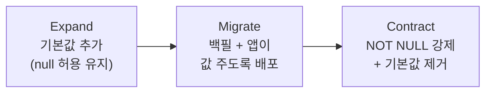

## 이게 뭔데

`Make Column Non-Nullable`은 이름 그대로다. **null을 허용하던 컬럼에 "여기 비워두기 금지" 팻말을 박는** 리팩토링이다. SQL로는 한 줄이다.

```sql
ALTER TABLE Customer MODIFY FirstName NOT NULL;
```

비유를 하나 들자. 회원가입 폼에 "이름(선택)"이라고 적혀 있었는데, 어느 날 비즈니스가 "이름 없는 고객은 더 이상 안 받는다"고 결정했다 치자. 그럼 폼의 그 필드를 "이름(필수)"로 바꿔야 한다. `Make Column Non-Nullable`이 바로 그 "(선택) → (필수)" 전환을 **DB 차원에서** 하는 거다. 앱이 깜빡하고 값을 안 보내면, 폼이 아니라 DB가 직접 "이름 안 채웠는데요?" 하고 빨간불을 켠다.

핵심은 이게 **데이터 품질 리팩토링**이라는 점이다. 테이블 구조를 바꾸는 게 아니라, **이 컬럼에 들어오는 값의 약속을 강화**하는 거다. "여기엔 앞으로 항상 진짜 값이 있다"를 DB가 보증하게 만든다.

<Callout type="info" title="한 줄 요약">
nullable 컬럼에 NOT NULL을 거는 일. SQL은 한 줄이지만, 진짜 일은 그 한 줄을 실행하기 *전에* 끝나 있어야 한다 — 기존 null을 전부 치우고, 모든 앱이 값을 주게 만드는 것.
</Callout>

## 언제 쓰나

이 리팩토링이 답인 상황은 보통 둘 중 하나다.

**하나, "이 값은 사실 필수인데 그동안 강제를 안 했다"는 걸 뒤늦게 깨달았을 때.** 초기엔 대충 nullable로 만들어 놨는데, 알고 보니 비즈니스 규칙상 이 컬럼은 절대 비면 안 되는 값이었던 거다. 예를 들어 `Account.Balance`. 계좌인데 잔액이 null이라는 게 말이 되나? 0이면 0이지 null은 아니다. 그런데 테이블 정의가 nullable이라 옛날 어딘가의 버그난 코드가 잔액을 null로 꽂아놓은 행이 몇 개 굴러다닌다. 이걸 막고 싶을 때.

**둘, 앱마다 흩어진 not-null 체크를 DB로 일원화하고 싶을 때.** 똑같은 검증을 코드 열 군데에서 반복하고 있다면 — `if (customer.firstName == null) throw ...` 같은 거 — 그건 DB가 해줄 일을 앱이 떠안고 있는 거다. DB에 NOT NULL을 한 번 박으면, 그 컬럼이 null일 경우란 **존재할 수 없으므로** 앱 곳곳의 null 체크를 지울 수 있다. 방어 코드 한 무더기가 사라진다.

그러니까 냄새는 이렇다. "이 컬럼 null이면 안 되는데..." 하는 막연한 불안, 코드 리뷰에서 자꾸 "여기 null 체크 빠졌어요" 코멘트가 달리는 현상, 그리고 `WHERE x IS NULL`로 조회했더니 "있으면 안 될" 행이 몇 개 튀어나오는 순간. 이 셋이 겹치면 이 리팩토링을 꺼낼 때다.

### 시나리오: 이런 적 있을 거임

은행 앱을 만든다. `Customer` 테이블에 `FirstName`이 nullable이다. 원래 이유가 있었다 — 가입 마법사가 1단계에서 이메일만 받고 행을 먼저 만든 다음, 2단계에서 이름을 채우는 구조였거든. 그래서 "잠깐 동안" 이름이 null인 행이 존재하는 게 정상이었다.

그런데 작년에 가입 플로우를 싱글 페이지로 갈아엎었다. 이제 이름은 가입 첫 화면에서 무조건 받는다. 즉 **null이 들어올 경로가 사라졌다.** 그런데 테이블 정의는 그대로 nullable이다.

문제는 여기서 시작된다. 신입이 들어와서 고객 목록 화면을 만든다. 너무 자연스럽게 친다.

```typescript
const label = `${customer.firstName.toUpperCase()} 님`;
```

로컬에선 잘 된다. 스테이징도 잘 된다. 배포한다. 그리고 새벽 3시에 알림이 울린다.

```text
TypeError: Cannot read properties of null (reading 'toUpperCase')
```

3년 전 가입 마법사 시절에 만들어진, `FirstName`이 null인 화석 같은 행 하나가 그 목록에 끼어 있었던 거다. 코드는 "이름은 당연히 있겠지"라고 가정했는데, DB는 그 가정을 한 번도 보증한 적이 없다. 신입 탓이 아니다. **"이 컬럼은 필수다"라는 약속을 DB에 적어두지 않은 게** 진짜 원인이다.

이 약속을 적는 도구가 바로 `Make Column Non-Nullable`이다. 박아두면 그 화석 행 자체가 존재할 수 없게 되고, `customer.firstName`은 타입 시스템에서도 `string | null`이 아니라 `string`이 되어, 위의 `.toUpperCase()`가 애초에 빨간 줄을 안 그린다.

## 주의할 점

SQL은 한 줄이라고 했지만, 그 한 줄이 **두 가지를 깨뜨릴 수 있다.**

<Callout type="warning" title="제약을 걸기 전에 반드시 확인할 것">
- **기존 null 데이터가 있으면 그 ALTER는 그냥 실패한다.** DB는 이미 null인 행이 단 하나라도 있으면 NOT NULL을 못 건다. "비면 안 되는 규칙"을 거는데 이미 비어 있는 값이 있으면 모순이니까. 즉 *먼저 null을 전부 정제*해야 한다. 이게 이 리팩토링의 진짜 본체다.
- **이제 값을 안 주는 앱은 INSERT/UPDATE에서 터진다.** nullable이라고 가정하고 그 컬럼을 빼먹고 INSERT하던 앱이 어딘가 남아 있으면, 제약을 거는 순간 그 앱은 제약 위반 예외를 맞는다. *모든* 쓰기 경로가 값을 주는지 확인해야 한다.
</Callout>

그래서 트레이드오프의 핵심 질문은 이거다. **"정말 모든 앱이 이 값을 줄 준비가 됐는가?"** 하나라도 안 됐다면, 그 앱이 망가지거나, 아니면 DB가 대신 값을 채워줘야 한다(`Introduce Default Value`). 이 "DB가 대신 채워주기"가 바로 마이그레이션 기간의 안전망이다 — 뒤에서 다룬다.

또 하나, 기존 null을 정제할 때 **무슨 값으로 채울지**는 기술 문제가 아니라 비즈니스 문제다. `FirstName`이 핵심 데이터라면 함부로 빈 문자열이나 `'Unknown'`을 박으면 안 된다. 책의 권장은 정직하다 — 정말 모르겠으면 `'???'` 같은 **눈에 띄는 표식**을 박아두고, 나중에 진짜 값으로 갱신할 작업을 남겨라. 조용히 가짜 값으로 메우면 "데이터는 깨끗해 보이는데 사실 다 거짓말"이라는 더 나쁜 상태가 된다. 이건 반드시 이해관계자와 같이 정해야 한다.

## 이렇게 한다

순서가 중요하다. 정제 → 모든 앱 값 보장 → 제약. 거꾸로 하면 운영에서 불이 난다.

<Steps>

<Step title="기존 null이 몇 개인지 센다">

제일 먼저, 적을 파악한다. 화석이 몇 마리인지부터.

```sql
SELECT count(*) FROM Customer WHERE FirstName IS NULL;
```

0이면 운이 좋은 거고, 아니면 이 행들을 어떻게 할지 결정해야 한다. **0이 되기 전엔 절대 다음 단계로 넘어가지 마라.** ALTER가 그냥 실패하니까.

</Step>

<Step title="null을 정제한다 (가장 중요한 단계)">

이게 이 리팩토링의 본체다. 무슨 값으로 채울지는 위에서 말했듯 비즈니스가 정한다. 가능한 전략은 보통 셋이다.

```sql
-- 전략 A: 다른 컬럼에서 합리적으로 유도 (예: 이메일 앞부분)
UPDATE Customer
SET FirstName = split_part(Email, '@', 1)
WHERE FirstName IS NULL;

-- 전략 B: 정말 모르겠으면 눈에 띄는 표식 + 추후 갱신 과제로
UPDATE Customer
SET FirstName = '???'
WHERE FirstName IS NULL;

-- 전략 C: 이 행 자체가 쓰레기면 (이해관계자 승인하에) 삭제
DELETE FROM Customer WHERE FirstName IS NULL AND /* 검증 조건 */;
```

대량 테이블이라면 한 방에 전체 락 잡고 UPDATE하면 가용성이 떨어지니, 배치로 쪼개 돌린다(`WHERE FirstName IS NULL LIMIT 10000` 식으로 반복). 이게 책이 말하는 "한 행씩 락 후 갱신" 전략의 현대판이다.

</Step>

<Step title="모든 쓰기 경로가 값을 주게 만든다">

앱 코드 차례다. 이 컬럼을 INSERT/UPDATE하는 *모든* 지점이 값을 보내는지 확인한다.

```sql
-- Before: FirstName을 빼먹은 INSERT — nullable일 땐 통했지만 이제 터진다
INSERT INTO Customer (Email) VALUES ('joon@bank.com');

-- After: 값을 명시적으로 제공
INSERT INTO Customer (Email, FirstName) VALUES ('joon@bank.com', 'Joonho');
```

여기서 **모든 앱을 한 번에 못 고치는 게** 현실이다. 레거시 배치, 외부 연동, 손 못 대는 서드파티 앱... 이때 책이 주는 임시 전략이 `Introduce Default Value`다. DB에 기본값을 박아두면, 값을 안 주는 앱이 INSERT해도 DB가 대신 채워주니 NOT NULL을 어기지 않는다.

```sql
-- 임시 안전망: 값을 안 주는 앱을 위해 DB가 기본값을 제공
ALTER TABLE Customer ALTER COLUMN FirstName SET DEFAULT '???';
```

나중에 모든 앱이 값을 주도록 정리되면, 이 기본값은 `Drop Default Value`로 떼어낸다(불필요한 기본값 평가를 안 하니 미세하게 성능에도 이롭다).

</Step>

<Step title="NOT NULL 제약을 건다">

이제야 본 작업이다. 1~3단계가 끝나 있으면 이 줄은 그냥 통과한다.

```sql
ALTER TABLE Customer ALTER COLUMN FirstName SET NOT NULL;
```

</Step>

<Step title="앱의 null 체크를 정리한다">

제약을 걸었으니 이제 이 컬럼이 null일 경우란 존재할 수 없다. 그동안 깔아둔 방어 코드를 걷어낸다.

```typescript
// Before: 어디서든 null일까 봐 방어
function greet(c: Customer): string {
  if (c.firstName == null) return '고객님';   // 이제 도달 불가능한 코드
  return `${c.firstName} 님`;
}

// After: DB가 보증하므로 타입도 string, 체크 불필요
function greet(c: Customer): string {
  return `${c.firstName} 님`;
}
```

ORM 모델/엔티티의 타입도 `string | null`에서 `string`(nullable: false)로 좁혀준다. 이러면 시나리오의 `.toUpperCase()` 버그는 컴파일 타임에 사라진다 — DB의 약속이 타입 시스템까지 전파되는 거다.

</Step>

</Steps>

### 현대화: 무중단으로 거는 법

위 4단계의 `SET NOT NULL` 한 줄, 2006년 책에선 별 언급 없이 지나가지만 **큰 운영 테이블에선 이게 함정**이다. 전통적으로 `SET NOT NULL`은 테이블 전체를 풀스캔하며 "정말 null이 하나도 없나"를 검증하는데, 그동안 테이블에 강한 락이 걸린다. 수억 행짜리 `Account` 테이블이면 그 사이 서비스가 멈춘다.

PostgreSQL 기준으로 무중단에 가깝게 거는 패턴이 있다. **CHECK 제약을 `NOT VALID`로 먼저 걸고, 나중에 `VALIDATE`하는** 2단계 분리다.

```sql
-- 1) NOT VALID: 기존 행은 검사 안 하고, 앞으로 들어올 행만 막는다. 짧은 락.
ALTER TABLE Customer
  ADD CONSTRAINT customer_firstname_not_null
  CHECK (FirstName IS NOT NULL) NOT VALID;

-- 2) VALIDATE: 기존 행을 스캔해 검증. 이건 ACCESS EXCLUSIVE 락을 안 잡아서
--    읽기/쓰기를 막지 않고 백그라운드로 검증된다.
ALTER TABLE Customer VALIDATE CONSTRAINT customer_firstname_not_null;
```

`NOT VALID`의 핵심은, **거는 순간부터 새 null은 막으면서** 기존 행 검증은 뒤로 미룬다는 거다(전체 락 회피). 그리고 PostgreSQL 12+에선 이렇게 검증까지 끝난 CHECK 제약이 있으면, 진짜 `SET NOT NULL`을 걸 때 풀스캔을 **건너뛴다.** 그다음 중복인 CHECK는 떼어내면 된다.

<Callout type="note" title="MySQL/온라인 스키마 변경 도구">
MySQL은 `NOT VALID` 같은 분리가 없어서 `ALTER` 자체가 테이블을 잠글 수 있다. 이럴 땐 `gh-ost`나 `pt-online-schema-change` 같은 온라인 스키마 변경 도구를 쓴다. 이들은 새 스키마로 그림자 테이블을 만들고, 트리거/바이너리 로그로 변경을 따라잡으며 데이터를 복사한 뒤, 마지막에 원자적으로 테이블을 바꿔치기한다. NOT NULL 전환을 서비스 중단 없이 처리하는 표준 방법이다.
</Callout>

### 백필과 expand-contract

3단계의 "기존 null 정제"를 운영 중에 하는 일을 **백필(backfill)**이라 부른다. 그리고 이 전체 흐름은 사실 **expand-contract(parallel change)** 패턴의 한 사례다.



- **Expand**: `Introduce Default Value`로 안전망을 깐다. 아직 제약은 안 건다. 옛 앱과 새 앱이 공존 가능.
- **Migrate**: 기존 null을 배치로 백필하고, 모든 앱을 "값을 주는" 버전으로 롤링 배포한다.
- **Contract**: 더 이상 null이 안 들어옴을 확인한 뒤 `SET NOT NULL`을 걸고, 임시 기본값은 `Drop Default Value`로 회수한다.

이렇게 단계를 쪼개면 각 단계가 **이전 버전 앱과 호환**되므로, 롤백이 가능하고 무중단으로 굴러간다. Flyway나 Liquibase, Alembic 같은 마이그레이션 도구에선 이 셋을 별도 마이그레이션 버전으로 나눠 커밋하는 게 정석이다 — 한 마이그레이션에 백필 UPDATE와 NOT NULL ALTER를 같이 넣으면 백필이 큰 테이블에서 오래 걸려 배포가 그만큼 락에 잡힌다.

## 정리

`Make Column Non-Nullable`은 SQL 한 줄짜리 리팩토링처럼 보이지만, 실제 무게중심은 그 한 줄 **앞에** 있다.

> **제약을 거는 일이 아니라, 제약을 걸 수 있는 상태를 만드는 일이 본체다.**

기존 null을 정제하고, 모든 쓰기 경로가 값을 주게 하고, 그 사이를 `Introduce Default Value`로 버틴다. 그게 다 끝나야 NOT NULL은 비로소 한 줄로 통과한다. 큰 테이블이라면 PostgreSQL의 `NOT VALID → VALIDATE`, 또는 온라인 스키마 변경 도구로 락을 피하고, 전체를 expand-contract 세 단계로 쪼개 무중단으로 굴린다.

그리고 보상은 분명하다. 이 약속을 DB에 박아두는 순간, 앱 곳곳의 null 체크가 사라지고, 타입 시스템이 `null`을 지워주고, 새벽 3시의 `Cannot read properties of null`이 애초에 일어날 수 없는 일이 된다. null을 한 번 제대로 추방하면, 그 컬럼을 만지는 모든 미래의 코드가 조금씩 더 단순해진다.
