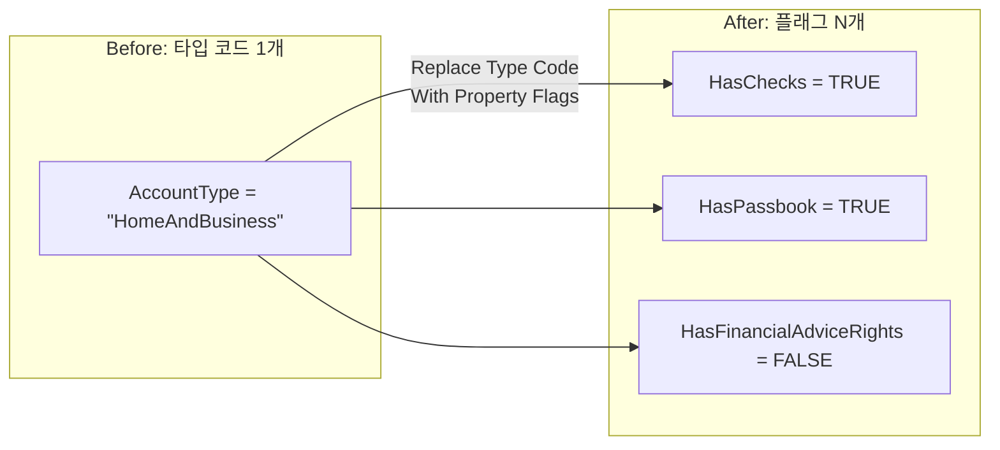

import { Callout, Steps, Step, Tabs, TabsList, TabsTrigger, TabsContent, Icon } from '@/components/writing-ui';

## 이게 뭔데

타입 코드 컬럼 하나를, 여러 개의 Boolean 플래그 컬럼으로 펴는 리팩토링이다. `AccountType VARCHAR`에 `'Home'`, `'Business'`, `'HomeAndBusiness'` 같은 문자열을 욱여넣던 걸, `isHome BOOLEAN`, `isBusiness BOOLEAN`처럼 **속성마다 컬럼 하나씩** 떼어내는 거다.

비유하자면 이렇다. 옷장에 옷을 정리하는데, "이 옷은 어떤 종류냐"를 라벨 한 장에 다 적으려고 한다고 치자. 처음엔 "셔츠", "바지"로 충분했는데, 어느 날 "셔츠인데 잠옷으로도 입는 옷"이 생긴다. 그럼 라벨에 "셔츠겸잠옷"이라고 적는다. "정장바지겸운동복"도 생긴다. 라벨이 점점 길어지고, "잠옷 다 꺼내줘" 하면 "잠옷"과 "셔츠겸잠옷"과 "운동복겸잠옷"을 전부 뒤져야 한다.

플래그 방식은 그냥 옷마다 체크박스를 단다. [v] 셔츠 [v] 잠옷. "잠옷 다 꺼내줘"는 잠옷 체크박스만 보면 끝이다. **하나의 슬롯에 여러 의미를 우겨넣길 그만두고, 의미마다 칸을 따로 주는 것** — 그게 이 리팩토링이다.

<Callout type="info" title="한 줄 요약">
타입이 서로 배타적이지 않은 순간(하나가 동시에 여러 타입), 타입 코드 컬럼은 누더기가 된다. 코드 하나를 플래그 여러 개로 펴면 검색이 단순해지고 새 타입은 컬럼 추가로 끝난다.
</Callout>

## 언제 쓰나

이 리팩토링이 답인 신호는 명확하다. **타입이 더 이상 "둘 중 하나"가 아니게 됐을 때**다. 책의 은행 도메인을 그대로 빌려오자. `Account` 테이블에 `AccountType` 컬럼이 있고, 처음엔 값이 깔끔했다.

```text
AccountType
-----------
'Home'
'Business'
```

집 계좌 아니면 사업자 계좌, 둘 중 하나. 깨끗하다. 그런데 어느 날 영업팀이 "집이면서 동시에 사업자로 쓰는 계좌"를 팔기 시작한다. 자, 코드를 어떻게 넣을 거냐. 방법은 하나뿐이다. 새 코드를 만든다.

```text
AccountType
-----------
'Home'
'Business'
'HomeAndBusiness'    -- 둘 다인 경우
```

여기서부터 무너지기 시작한다. "사업자 계좌 다 뽑아줘"라는 요청이 이제 이렇게 변한다.

```sql
-- 사업자 계좌 = Business 또는 HomeAndBusiness
SELECT * FROM Account
WHERE AccountType = 'Business'
   OR AccountType = 'HomeAndBusiness';
```

`Business`만 보면 안 된다. `HomeAndBusiness`도 사업자니까 같이 잡아야 한다. 그리고 다음 분기에 "투자 자문 권한 있는 계좌"가 추가되면? `'HomeAndBusinessAndAdvice'`, `'BusinessAndAdvice'`... 조합이 폭발한다. **타입 N개면 조합은 2의 N승**이다. 코드 컬럼 하나로 이걸 표현하려는 순간, 쿼리의 `OR` 목록이 끝없이 길어지고, 새 타입을 추가할 때마다 기존 쿼리를 전부 손봐야 한다.

원래 책이 정리한 동기는 세 갈래다.

- **검색 효율(비정규화).** 문자열 `=` 비교보다 Boolean 비교가 싸다. 타입 인스턴스마다 컬럼을 두면 `WHERE isBusiness = TRUE` 한 줄로 끝난다. 성능을 위해 일부러 비정규화하는 셈이다.
- **선택의 단순화.** 위에서 봤듯 비배타적 타입을 코드로 다루면 `Type='Business' OR Type='HomeAndBusiness' OR ...`로 부푼다. 플래그는 `WHERE isBusiness = TRUE`로 **불변**이다. 새 타입이 생겨도 이 쿼리는 안 바뀐다.
- **애플리케이션을 코드 값에서 분리.** 코드 방식은 앱이 "컬럼명 + 그 안에 들어갈 마법 문자열들"에 결합된다. `'HomeAndBusiness'`라는 정확한 철자를 앱이 알아야 한다. 플래그는 컬럼명에만 결합되고, 값은 표준 TRUE/FALSE뿐이라 오타 날 여지가 없다.

<Callout type="note" title="배타적이면 굳이 안 펴도 된다">
반대로 타입이 진짜로 상호 배타적이고(한 계좌는 정확히 한 종류), 앞으로도 조합이 안 생길 거라면 이 리팩토링은 불필요하다. 오히려 룩업 테이블 + FK(Add Lookup Table)가 더 깔끔하다. 이 리팩토링의 핵심 트리거는 "배타적이지 않다"는 사실 하나다. 그게 아니면 다른 카드를 봐라.
</Callout>

## 주의할 점

공짜는 아니다. 플래그로 펴는 순간 생기는 비용이 있다.

<Callout type="warning" title="트레이드오프">
- **새 타입 = 스키마 변경.** 코드 방식이라면 새 타입은 그냥 새 문자열 하나(데이터 행)다. 플래그 방식은 새 타입마다 **컬럼을 추가**해야 한다. money market 상품이 나오면 `isMoneyMarket` 컬럼을 `ALTER TABLE`로 붙여야 한다. 타입이 자주, 동적으로 늘어나는 도메인이면 이게 발목을 잡는다.
- **컬럼 수 폭증.** 타입이 30종이면 Boolean 컬럼 30개가 생긴다. 테이블이 옆으로 길어지고, `SELECT *` 결과가 부담스러워지고, 사람이 스키마를 한눈에 이해하기 어려워진다.
- **다만 컬럼 추가는 서로 독립적이다.** `isMoneyMarket` 하나 붙이는 건 다른 컬럼에 영향이 없다. 그래서 변경 자체는 국소적이고 안전하다 — 빈도만 문제지.
</Callout>

정리하면 이 리팩토링은 **"타입 종류는 비교적 안정적인데, 조합이 다양하다"**는 상황에 가장 잘 맞는다. 종류가 적고(컬럼 수 감당 가능) 자주 안 바뀌면(스키마 변경 빈도 낮음) 플래그가 빛난다. 거꾸로 타입이 수십 종이고 런타임에 계속 늘어나면, 뒤에서 볼 비트마스크나 JSONB 태그 쪽을 봐야 한다.

## 이렇게 한다

책이 권하는 정석은 **전환 기간(transition period)**을 두는 거다. 구 코드 컬럼과 신 플래그 컬럼을 한동안 공존시키고, 트리거로 양방향 동기화하다가, 모든 앱이 넘어오면 구 컬럼을 떨군다. 이게 expand-contract(=parallel change) 패턴의 2006년 버전이다. 순서대로 보자.

<Steps>
<Step title="플래그 컬럼 추가 (Introduce New Column)">

대체할 타입 코드와 그 인스턴스들을 먼저 식별한다. `AccountType` 안에 들어있던 의미들을 펼쳐서, 의미마다 Boolean 컬럼을 만든다. 책 예시는 은행 계좌라서 이렇게 떨어진다.

```sql
-- 구 코드 컬럼(AccountType)은 일단 그대로 둔다
ALTER TABLE Account ADD HasChecks               BOOLEAN;
ALTER TABLE Account ADD HasFinancialAdviceRights BOOLEAN;
ALTER TABLE Account ADD HasPassbook             BOOLEAN;
ALTER TABLE Account ADD IsRetailCustomer        BOOLEAN;
```

<Callout type="note" title="네이티브 Boolean이 없는 DB라면">
Oracle처럼 진짜 BOOLEAN 컬럼 타입이 없는 DB는 `NUMBER(1)`로 흉내 낸다. 1=TRUE, 0=FALSE 컨벤션을 정하고 `CHECK (HasChecks IN (0,1))` 제약을 같이 걸어두면 값이 더러워지는 걸 막을 수 있다. Postgres/MySQL은 네이티브 `BOOLEAN`(MySQL은 `TINYINT(1)` 별칭)을 그냥 쓰면 된다.
</Callout>

</Step>

<Step title="기존 데이터를 플래그로 채우기 (Update Data)">

이제 구 코드 값을 보고 플래그를 세팅하는 1회성 마이그레이션을 돌린다. 코드 값마다 어떤 플래그가 켜지는지 매핑을 정의하고 `UPDATE`로 옮긴다.

```sql
-- 코드 → 플래그 매핑을 UPDATE로 펼친다
UPDATE Account SET HasChecks = TRUE
  WHERE AccountType IN ('CHECKING', 'HomeAndBusiness');

UPDATE Account SET HasPassbook = TRUE
  WHERE AccountType IN ('SAVINGS', 'Home');

UPDATE Account SET HasFinancialAdviceRights = TRUE
  WHERE AccountType = 'ADVISORY';

-- 나머지는 명시적으로 FALSE로 (NULL 방치 금지)
UPDATE Account SET
  HasChecks                = COALESCE(HasChecks, FALSE),
  HasFinancialAdviceRights = COALESCE(HasFinancialAdviceRights, FALSE),
  HasPassbook              = COALESCE(HasPassbook, FALSE),
  IsRetailCustomer         = COALESCE(IsRetailCustomer, FALSE);
```

마지막 `COALESCE` 단계가 은근히 중요하다. 채워주지 않은 행은 플래그가 NULL로 남는데, SQL에서 `WHERE isBusiness = TRUE`는 NULL 행을 **조용히 빼먹는다**(3치 논리). "FALSE"와 "모름(NULL)"은 다른 거라, 의도적으로 FALSE를 박아둬야 검색이 정확해진다.

</Step>

<Step title="전환 기간 — 양방향 동기화">

여러 앱이 한 DB를 공유하고 무중단이 필요하면, 구 코드 컬럼과 신 플래그를 동시에 살려둔다. 아직 안 넘어온 앱은 `AccountType`에 쓰고, 넘어온 앱은 플래그에 쓴다. 둘이 어긋나지 않게 트리거로 양방향 동기화한다.

```sql
-- 책의 SynchronizeAccountTypeColumns 트리거(개념)
-- 코드가 바뀌면 플래그를, 플래그가 바뀌면 코드를 맞춘다
CREATE TRIGGER SynchronizeAccountTypeColumns
BEFORE INSERT OR UPDATE ON Account
FOR EACH ROW
BEGIN
  -- 예: 구 코드가 들어오면 플래그로 반영
  IF :NEW.AccountType = 'HomeAndBusiness' THEN
    :NEW.HasChecks  := TRUE;
    :NEW.HasPassbook := TRUE;
  END IF;
  -- (반대 방향도 대칭으로 채운다)
END;
```

</Step>

<Step title="접근 프로그램 수정">

저장/삭제/조회 SQL과 앱 코드를 플래그 기준으로 바꾼다. 핵심은 `WHERE AccountType='XXXX'`를 `WHERE isXXXX = TRUE`로 옮기는 것, 그리고 도메인 클래스의 `accountType` 문자열 필드를 개별 Boolean 필드로 쪼개는 것이다.

```sql
-- Before: 비배타적 타입을 OR로 긁던 쿼리
SELECT * FROM Account
WHERE AccountType = 'Business'
   OR AccountType = 'HomeAndBusiness';

-- After: 플래그 하나로
SELECT * FROM Account
WHERE HasChecks = TRUE;
```

도메인 객체도 같이 펴진다.

```typescript
// Before: 문자열 코드에 결합 — 정확한 철자를 앱이 알아야 한다
class Account {
  accountType: string; // 'Home' | 'Business' | 'HomeAndBusiness' | ...

  isBusiness(): boolean {
    return this.accountType === 'Business'
        || this.accountType === 'HomeAndBusiness';
  }
}

// After: 의미마다 필드. isBusiness() 같은 분기 로직이 통째로 사라진다
class Account {
  hasChecks = false;
  hasFinancialAdviceRights = false;
  hasPassbook = false;
  isRetailCustomer = false;
}
```

</Step>

<Step title="구 컬럼 떨구기 (Drop Column)">

모든 접근 코드가 플래그로 넘어온 게 확인되면, 전환을 끝낸다. 동기화 트리거를 드롭하고 구 코드 컬럼을 떨군다.

```sql
DROP TRIGGER SynchronizeAccountTypeColumns;
ALTER TABLE Account DROP COLUMN AccountType;
```

</Step>
</Steps>

<Callout type="info" title="현대 도구로 옮기면 (expand-contract)">
위 5단계는 사실 요즘 다들 쓰는 **expand-contract(parallel change)** 그 자체다. Flyway/Liquibase/Alembic 마이그레이션으로 쪼개면 이렇게 떨어진다.

- **Expand:** `V1__add_account_flags.sql` — 플래그 컬럼 추가 + 백필 UPDATE.
- **Migrate:** 앱을 새 버전으로 배포. 새 코드는 플래그를 읽고 쓴다.
- **Contract:** 충분히 지난 뒤 `V2__drop_account_type.sql` — 구 컬럼 드롭.

단일 앱·단일 ORM이라 무중단이 필요 없다면, 책의 전환 기간과 동기화 트리거는 **통째로 생략**해도 된다. 배포 시점에 스키마 변경 + 코드 변경을 한 릴리스로 묶으면 트리거의 순환·디버깅 비용을 안 짊어진다. 트리거는 "무중단 다중 앱"일 때만 꺼내는 비싼 도구다.

백필이 수백만 행이면 한 방 `UPDATE`로 테이블을 오래 락 잡지 말고 PK 범위로 끊어 배치로 돌려라. Postgres 11+면 새 플래그를 `GENERATED ALWAYS AS (AccountType = 'CHECKING') STORED` 같은 generated column으로 만들어 백필 자체를 엔진에 떠넘기는 손도 있다(구 컬럼이 살아있는 전환기 한정).
</Callout>

## 플래그냐, 비트마스크냐, 태그냐 (현대적 선택지)

책은 2006년이라 선택지가 "코드냐 Boolean 컬럼이냐" 둘이었다. 지금은 펴는 방식이 한 가지가 아니다. 같은 "isHome/isBusiness/isPassbook" 정보를 셋 중 어떻게 담느냐의 트레이드오프를 보자.

<Tabs defaultValue="flags">
<TabsList>
<TabsTrigger value="flags">Boolean 컬럼</TabsTrigger>
<TabsTrigger value="bitmask">비트마스크</TabsTrigger>
<TabsTrigger value="jsonb">배열/JSONB 태그</TabsTrigger>
</TabsList>

<TabsContent value="flags">

책이 권하는 정석. 의미마다 컬럼 하나.

```sql
SELECT * FROM Account WHERE HasChecks = TRUE;

-- 부분 인덱스로 "참인 행만" 인덱싱 (Postgres)
CREATE INDEX idx_account_checks
  ON Account (id) WHERE HasChecks = TRUE;
```

**장점:** 쿼리가 사람 말 그대로 읽힌다. 컬럼별로 인덱스(특히 partial index)를 정밀하게 걸 수 있다. 옵티마이저가 통계를 컬럼 단위로 갖는다.

**단점:** 타입이 늘면 컬럼이 늘어 `ALTER TABLE`이 잦아진다. 수십 개면 테이블이 옆으로 길어진다. **타입 종류가 적고 안정적이면 이게 거의 항상 최선이다.**

</TabsContent>

<TabsContent value="bitmask">

플래그들을 정수 한 컬럼의 비트로 욱여넣는다. `1=Checks, 2=Passbook, 4=Advice...`.

```sql
-- HasChecks 비트(=1)가 켜진 행
SELECT * FROM Account WHERE (TypeBits & 1) = 1;
```

**장점:** 컬럼이 하나라 새 타입 = 새 비트(스키마 변경 없음). 저장 공간이 작다.

**단점:** **인덱스를 못 탄다.** `TypeBits & 1` 같은 비트 연산은 일반 B-tree 인덱스로 못 풀어서 보통 풀스캔이다(표현식/부분 인덱스로 우회는 가능하지만 결국 비트마다 따로). 쿼리가 사람한테 안 읽히고, 마법 상수(`& 4`)가 코드에 박힌다. 비트 의미를 앱이 다시 알아야 해서 **"애플리케이션을 코드 값에서 분리"라는 동기를 정면으로 위배**한다. 솔직히 요즘 관계형 DB에서 굳이 권할 일은 드물다 — 극단적 공간 제약이나 임베디드가 아니면 피해라.

</TabsContent>

<TabsContent value="jsonb">

태그 집합으로 본다. Postgres `text[]` 배열이나 JSONB.

```sql
-- tags text[] 컬럼
SELECT * FROM Account WHERE tags @> ARRAY['business'];

-- GIN 인덱스로 포함 검색 가속
CREATE INDEX idx_account_tags ON Account USING GIN (tags);
```

**장점:** 새 타입 = 새 태그 문자열(스키마 변경 없음). GIN 인덱스가 `@>`(포함) 검색을 받쳐줘서 비트마스크와 달리 **인덱스를 탄다**. 타입이 동적으로 많이 늘어나는 도메인에 강하다.

**단점:** 다시 "문자열 값에 결합"된다(`'business'` 철자를 앱이 알아야 함 — 책이 피하려던 그 결합). FK·CHECK로 값 집합을 강제하기 어렵다. 타입이 소수로 고정적이면 과한 도구다. **타입이 많고 동적일 때만 꺼내라.**

</TabsContent>
</Tabs>

<Callout type="success" title="고르는 기준 한 줄">
타입이 적고 안정적 → Boolean 컬럼(책의 정석). 타입이 많고 런타임에 계속 늘어남 → JSONB/배열 태그 + GIN. 비트마스크는 인덱스를 못 타고 코드 결합도 다시 생겨서, 관계형 DB에선 대개 함정이다.
</Callout>

다이어그램으로 보면 "하나의 코드 슬롯"이 "여러 개의 의미 슬롯"으로 펴지는 그림이다.



## 정리

타입 코드 컬럼은 타입이 "둘 중 하나"일 때만 깔끔하다. 하나가 동시에 여러 타입이 되는 순간 — 그리고 비즈니스는 거의 항상 그쪽으로 흐른다 — 코드 컬럼은 `OR` 누더기가 되고, 새 타입마다 기존 쿼리를 전부 손봐야 하는 지옥이 열린다.

> **한 슬롯에 여러 의미를 우겨넣지 말고, 의미마다 칸을 줘라.**

플래그로 펴면 검색이 `WHERE isBusiness = TRUE`로 단순해지고, 그 쿼리는 새 타입이 생겨도 안 바뀐다. 대가는 새 타입마다 컬럼이 느는 것 — 그래서 **타입 종류가 적고 안정적일 때** 가장 잘 맞는다. 타입이 동적으로 폭증하는 도메인이면 JSONB 태그 + GIN으로 같은 발상(의미마다 독립적 표현)을 이어가면 된다. 옮길 땐 expand-contract로 컬럼 추가 → 백필 → 코드 전환 → 구 컬럼 드롭 순서를 지키고, 무중단 다중 앱이 아니면 트리거 같은 비싼 장치는 미련 없이 생략해라.
