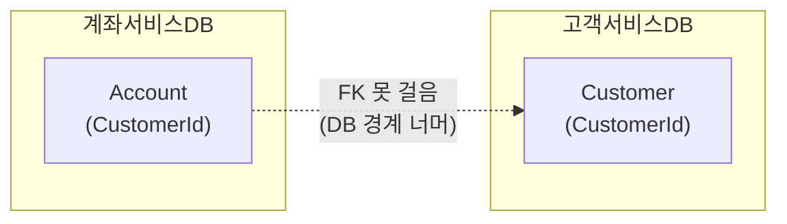

## 이게 뭔데

외래 키 제약 추가(Add Foreign Key Constraint). 한 문장으로 하면, **"이 컬럼에 들어오는 값은 저쪽 테이블에 실제로 존재하는 값이어야 한다"고 DB한테 약속받는 것**이다.

비유하자면 클럽 입구의 가드다. `Account.StatusCode`에 `'DORMANT'`를 꽂으려는데, `AccountStatus` 테이블에 `'DORMANT'`라는 손님 명단이 없으면? 가드가 팔을 가로막는다. "그런 코드 없는데요." 명단에 있는 값만 통과. 없는 값은 입구컷. 그게 외래 키(FK) 제약이다.

지금까지는 이 가드 노릇을 누가 했냐면, 보통은 **애플리케이션 코드**가 했다. 저장하기 전에 `SELECT 1 FROM AccountStatus WHERE StatusCode = ?` 한 번 날려보고, 있으면 insert, 없으면 에러. 동작은 한다. 근데 그 가드가 술 마시러 가거나(버그), 다른 입구로 슬쩍 들여보내거나(다른 앱이 직접 INSERT), 잠깐 자리를 비우면(배치 스크립트) 명단에 없는 손님이 클럽 안에 쌓인다. 이 손님들을 우리는 **고아 행(orphan row)** 이라고 부른다.

<Callout type="info" title="한 줄 요약">
FK 제약 추가는 "참조 무결성을 강제하는 책임을 앱에서 DB로 내려보내는" 리팩토링이다. 앱은 가끔 까먹지만, DB는 안 까먹는다.
</Callout>

## 언제 쓰나

동기는 단순하다. **잘못된 데이터가 애초에 저장되지 못하게 하고 싶을 때.** 특히 다음 냄새가 나면 이 리팩토링이 답이다.

- `StatusCode` 컬럼에 `'DORMANT'`, `'Dormant'`, `'DOMRANT'`(오타), `'X'`(누가 테스트하다 박은 값) 같은 게 섞여 있다.
- "이 주문은 존재하지 않는 고객을 참조하고 있어요" 같은 데이터 사고 리포트가 주기적으로 올라온다.
- **한 DB를 여러 애플리케이션이 공유한다.** 이게 사실 가장 강력한 동기다.

마지막 항목을 좀 더 보자. 앱이 하나뿐이고 그 앱이 무결성을 완벽히 지킨다면, FK 없이도 데이터는 깨끗할 수 있다. 문제는 현실에서 DB는 보통 **여러 입구**를 가진다는 거다. 주력 백엔드도 쓰고, 정산 배치도 쓰고, 데이터팀이 가끔 손으로 `psql` 켜서 UPDATE도 하고, 6년 전에 만든 PHP 어드민도 아직 살아 있다. 이 모든 입구가 똑같이 무결성을 강제하리라고 믿는 건 순진하다. 입구 하나만 가드가 졸아도 고아 행이 들어온다.

그래서 책의 원칙은 이거다. **"여러 앱이 일관되게 무결성을 지킬 거라고 믿을 수 없으면, 그 책임을 DB로 내려라."** DB는 입구가 몇 개든 모든 입구에서 똑같이 가드를 세운다.

### 시나리오: 이런 적 있을 거임

은행 시스템의 `Account` 테이블. 각 계좌는 상태를 가진다 — `NEW`, `ACTIVE`, `DORMANT`, `CLOSED`. 이 상태값은 `AccountStatus` 룩업 테이블에 정의돼 있다. 처음 설계할 땐 백엔드 하나만 이 DB를 썼고, 백엔드 코드가 상태값을 검증했으니 FK는 굳이 안 걸었다.

3년이 지났다. 그동안:

- 콜센터용 상담 앱이 붙었다 (다른 팀, 다른 코드베이스).
- 야간 정산 배치가 계좌 상태를 일괄 변경한다.
- 마케팅팀이 "휴면 계좌 추출"을 한다며 가끔 직접 UPDATE를 날린다.

그러던 어느 날, 휴면 계좌 통계가 안 맞는다는 제보. 까보니 `StatusCode`에 `'Dormant'`(대소문자 다름), `'DOR'`(누가 줄여 씀), 그리고 NULL이 섞여 있다. 정산 배치가 검증 없이 박은 값, 마케팅팀이 손으로 박은 오타, 초기 마이그레이션 때 누락된 NULL이 3년치 쌓인 거다. 통계 쿼리는 `WHERE StatusCode = 'DORMANT'`로 짜여 있으니 이 변종들을 전부 놓친다.

이 시점에 누군가 말한다. "FK 걸었으면 처음부터 안 들어왔잖아." 맞다. 근데 이제 와서 걸려면, 먼저 3년치 쓰레기를 치워야 한다. 그게 이 리팩토링의 절반이다.

## 주의할 점

FK가 공짜는 아니다. 걸기 전에 알아야 할 트레이드오프가 몇 개 있다.

<Callout type="warning" title="FK 걸기 전에 알아둘 것">
- **쓰기 성능 비용**: `Account`에 insert/update가 일어날 때마다 DB가 "이 `StatusCode`가 `AccountStatus`에 진짜 있나?"를 확인한다. 매 쓰기마다 룩업이 한 번 더 붙는 셈. 보통은 무시할 수준이지만, 참조 테이블 PK에 인덱스가 없으면 이 확인이 풀스캔이 되어 느려진다.
- **순서 의존**: 자식 행을 넣기 전에 부모 행이 있어야 한다. `AccountStatus`에 `'DORMANT'`가 없으면 `Account`에 `'DORMANT'` 계좌를 못 넣는다. 반대로 부모를 지우려면 자식이 없어야 한다. 즉 **앱/영속 계층이 테이블 간 의존 순서를 알아야 한다.**
- **고아 행 청소가 선행**: 이미 깨진 데이터가 있으면 FK 추가 자체가 실패한다. 마이그레이션이 먼저, 제약이 나중.
</Callout>

순서 의존 문제는 deferred 검증으로 상당 부분 풀 수 있는데, 이건 바로 아래에서 본다.

## 이렇게 한다

세 갈래로 나눠서 간다. (1) 검증 전략을 고르고, (2) 데이터를 청소하고, (3) 제약을 건 다음, (4) 접근 코드를 정리한다.

### 1단계 — 검증 전략: immediate vs deferred

FK 검증이 **언제** 일어나는지를 고를 수 있다. 두 가지다.

<Tabs defaultValue="immediate">
<TabsList>
<TabsTrigger value="immediate">즉시 검증 (immediate)</TabsTrigger>
<TabsTrigger value="deferred">지연 검증 (deferred)</TabsTrigger>
</TabsList>
<TabsContent value="immediate">

**입력·갱신·삭제 그 문장 시점에 바로 검증한다.** 부모 없는 자식을 넣는 순간 즉시 에러가 난다.

- 장점: 빠른 실패(fail fast). 어디서 무결성을 깼는지 그 줄에서 바로 잡힌다.
- 단점: 쓰기 순서를 강제한다. 부모 먼저, 자식 나중. 일괄 적재 시 순서 신경 써야 함.
- 대부분 DB의 **기본값**이 이거다.

</TabsContent>
<TabsContent value="deferred">

**트랜잭션 커밋 시점까지 검증을 미룬다.** 트랜잭션 안에서는 잠깐 무결성이 깨진 상태여도 되고, 커밋할 때 전부 맞으면 통과.

- 장점: **순서 무관.** 자식 먼저 넣고 부모 나중에 넣어도, 커밋 전에만 짝이 맞으면 OK. 순환 참조나 대량 일괄 쓰기에서 편하다.
- 단점: 대용량 테이블에서 커밋 시점에 검증이 몰려 성능이 출렁일 수 있다.
- 선언 시 `INITIALLY DEFERRED`를 붙인다.

</TabsContent>
</Tabs>

순서 의존이 골치 아픈 상황(여러 테이블을 한 트랜잭션에서 한꺼번에 적재)이라면 deferred가 답이다. 평소엔 immediate가 기본이고 그게 보통 맞다.

### 2단계 — 데이터 마이그레이션: 일단 청소부터

제약을 걸려면 기존 데이터가 이미 깨끗해야 한다. 더러운 채로 `ALTER TABLE`을 날리면 DB가 "FK 위반하는 행이 N개 있는데요"라며 거부한다. 그러니 순서대로 청소한다.

<Steps>
  <Step title="고아 행이 있는지 진단한다">

먼저 `Account`의 `StatusCode`가 `AccountStatus`에 실제로 다 존재하는지 확인. 전체 행 수와 조인했을 때 살아남는 행 수를 비교하면 된다.

```sql
-- 전체 Account 수
SELECT COUNT(*) FROM Account;

-- AccountStatus에 매칭되는 Account만 카운트 (이게 더 작으면 고아 행 존재)
SELECT COUNT(*)
FROM Account a
JOIN AccountStatus s ON a.StatusCode = s.StatusCode;

-- 어떤 값이 고아인지 직접 본다
SELECT a.StatusCode, COUNT(*)
FROM Account a
LEFT JOIN AccountStatus s ON a.StatusCode = s.StatusCode
WHERE s.StatusCode IS NULL
GROUP BY a.StatusCode;
```

마지막 쿼리가 `'Dormant'`, `'DOR'`, `NULL` 같은 걸 뱉어내면, 그게 우리가 치워야 할 목록이다.

  </Step>
  <Step title="참조 테이블에 빠진 값을 보충한다">

고아 값 중에 **사실은 정당한 코드인데 룩업 테이블에 없던 것**이 있다면, 룩업 테이블에 채워 넣는다. 예를 들어 `'PENDING'`이 실제로 쓰이는 상태인데 `AccountStatus`에 정의가 빠져 있었다면 추가한다.

```sql
INSERT INTO AccountStatus (StatusCode, Description)
SELECT DISTINCT a.StatusCode, 'TODO: 설명 보충'
FROM Account a
LEFT JOIN AccountStatus s ON a.StatusCode = s.StatusCode
WHERE s.StatusCode IS NULL
  AND a.StatusCode IS NOT NULL
  AND a.StatusCode IN ('PENDING');  -- 정당하다고 합의된 값만
```

  </Step>
  <Step title="무효값과 NULL을 정상값으로 교정한다">

나머지 — 오타나 쓰레기 값은 가장 가까운 정상값으로 교정한다. NULL은 합리적인 기본값으로 채운다. 어떤 값으로 바꿀지는 도메인 합의가 필요하다(함부로 바꾸면 그것도 데이터 오염이다).

```sql
-- 명단에 없는 무효값은 DORMANT로 (도메인 합의 후)
UPDATE Account
SET StatusCode = 'DORMANT'
WHERE StatusCode NOT IN (SELECT StatusCode FROM AccountStatus)
  AND StatusCode IS NOT NULL;

-- NULL은 신규 계좌로 간주해 NEW로
UPDATE Account
SET StatusCode = 'NEW'
WHERE StatusCode IS NULL;
```

  </Step>
</Steps>

<Callout type="note" title="대소문자/형식 오염은 매핑 테이블로">
`'Dormant'` → `'DORMANT'` 같은 변종이 많으면 일일이 UPDATE 치지 말고, 임시 매핑 테이블(`old_value`, `new_value`)을 만들어 한 번에 조인 업데이트하는 게 깔끔하다. 매핑 테이블은 나중에 "왜 이렇게 바꿨나"의 감사 기록도 된다.
</Callout>

### 3단계 — 스키마 변경: 제약을 건다

데이터가 깨끗해졌으면 이제 제약을 건다. 교과서적인 형태는 이렇다.

```sql
-- 즉시 검증 (기본)
ALTER TABLE Account
  ADD CONSTRAINT FK_Account_AccountStatus
  FOREIGN KEY (StatusCode)
  REFERENCES AccountStatus (StatusCode);

-- 지연 검증이 필요하면
ALTER TABLE Account
  ADD CONSTRAINT FK_Account_AccountStatus
  FOREIGN KEY (StatusCode)
  REFERENCES AccountStatus (StatusCode)
  DEFERRABLE INITIALLY DEFERRED;
```

선택적으로, 참조 테이블 PK에 인덱스가 없다면 검증 성능을 위해 인덱스를 추가한다. 보통 PK엔 이미 인덱스가 있으니 대개 불필요하지만, 참조 컬럼이 PK가 아닌 유니크 컬럼이면 챙겨야 한다. (단, 인덱스는 그 테이블의 쓰기 성능을 약간 깎는 트레이드오프가 있다.)

#### 무중단으로 걸기 — `NOT VALID` → `VALIDATE` (PostgreSQL)

여기서 2006년 책과 현대 실무가 갈린다. 위의 평범한 `ADD CONSTRAINT`는 PostgreSQL에서 **테이블 전체를 스캔하며 기존 행을 전부 검증**한다. 이 동안 테이블에 락이 걸려서, 수억 행짜리 `Account`에 걸면 운영이 멈춘다. 새벽 점검 시간을 잡아야 하는 종류의 작업이 된다.

PostgreSQL은 이걸 두 단계로 쪼개는 길을 준다.

```sql
-- 1) 제약을 걸되, 기존 행은 검증하지 않는다 (NOT VALID)
--    이후 들어오는 신규 INSERT/UPDATE에만 즉시 적용된다.
--    짧은 락만 잡고 거의 즉시 끝난다.
ALTER TABLE Account
  ADD CONSTRAINT FK_Account_AccountStatus
  FOREIGN KEY (StatusCode)
  REFERENCES AccountStatus (StatusCode)
  NOT VALID;

-- 2) 한가한 시간에 기존 행을 천천히 검증한다.
--    VALIDATE는 ACCESS EXCLUSIVE가 아닌 약한 락만 잡아 쓰기를 막지 않는다.
ALTER TABLE Account
  VALIDATE CONSTRAINT FK_Account_AccountStatus;
```

`NOT VALID`로 거는 순간부터 **새 데이터는 이미 보호된다.** 오래된 데이터의 검증은 부하 적은 시간에 `VALIDATE`로 따로 처리한다. 이게 대용량 테이블에 FK를 무중단으로 추가하는 표준 패턴이다. 단계가 둘이라는 점에서 **expand-contract(parallel change)** 사고방식과 결이 같다 — 위험한 변경을 작고 되돌릴 수 있는 단계로 쪼개는 것.

<Callout type="success" title="마이그레이션 도구에 그대로 태운다">
이 DDL은 Flyway/Liquibase/Alembic 같은 버전드 마이그레이션 도구의 한 스텝으로 그대로 넣으면 된다. `NOT VALID`와 `VALIDATE`를 **별도 마이그레이션 파일**로 분리하면, 데이터 청소(2단계) → NOT VALID → 운영 모니터링 → VALIDATE를 각각 독립적으로 배포·롤백할 수 있어 안전하다. ORM 마이그레이션(예: Alembic)에서도 raw DDL로 두 스텝을 나눠 적는 걸 권한다.
</Callout>

### 4단계 — 접근 프로그램 수정

DB가 무결성을 강제하기 시작했으니, 이제 코드를 정리한다.

**먼저 빼는 것** — 앱이 손으로 하던 RI 검증 코드. 이건 이제 DB가 하니 중복이다.

```typescript
// Before: 앱이 직접 가드 노릇
async function updateAccountStatus(accountId: string, status: string) {
  const exists = await db.query(
    "SELECT 1 FROM AccountStatus WHERE StatusCode = $1",
    [status],
  );
  if (exists.rowCount === 0) {
    throw new Error(`Unknown status: ${status}`);
  }
  await db.query(
    "UPDATE Account SET StatusCode = $1 WHERE AccountId = $2",
    [status, accountId],
  );
}
```

```typescript
// After: DB가 강제하므로 사전 검증 제거.
// 대신 DB가 던지는 위반 에러를 잡아 의미 있는 메시지로 변환.
async function updateAccountStatus(accountId: string, status: string) {
  try {
    await db.query(
      "UPDATE Account SET StatusCode = $1 WHERE AccountId = $2",
      [status, accountId],
    );
  } catch (e) {
    // PostgreSQL FK 위반은 SQLSTATE '23503'
    if (e.code === "23503") {
      throw new Error(`Unknown account status: ${status}`);
    }
    throw e;
  }
}
```

**다음 챙길 것** — 모든 앱이 DB가 던지는 위반 예외를 처리해야 한다. FK를 모르던 PHP 어드민도, 정산 배치도 마찬가지. 안 그러면 멀쩡히 돌던 배치가 어느 날 예외 토하며 죽는다. 주요 에러 코드를 알아두면 좋다.

```text
PostgreSQL: 23503  foreign_key_violation (부모 없는 자식 / 자식 있는 부모 삭제 모두)
Oracle:     2291   부모 키 없음 (자식 insert/update 시)
            2292   자식 레코드 존재 (부모 delete 시)
MySQL:      1452   부모 없는 자식 추가
            1451   자식 있는 부모 삭제
```

**마지막으로 합의 재검토** — 기존에 다른 RI 규칙(예: "CLOSED 상태로는 직접 못 바꾸고 DORMANT를 거쳐야 함" 같은 도메인 규칙)을 앱이 강제하고 있었다면, FK는 그걸 대체하지 못한다. FK는 "값이 존재하느냐"만 본다. 상태 전이 규칙 같은 건 여전히 앱 또는 별도 제약/트리거의 몫이니, 무심코 지우지 말 것.

## 마이크로서비스에서는 못 거는 경우가 많다

현대화 얘기를 하나 더. 지금까지는 한 DB 안에 `Account`와 `AccountStatus`가 같이 있다고 가정했다. 그래야 FK를 건다. **FK는 같은 DB 안의 테이블끼리만 걸 수 있기 때문이다.**

그런데 마이크로서비스로 쪼개면서 `Account`는 계좌 서비스 DB, 고객 마스터는 고객 서비스 DB로 갈라졌다면? `Account.CustomerId`가 다른 서비스의 `Customer`를 가리켜도 **FK를 걸 방법이 없다.** DB가 다르니까.



이건 FK 리팩토링의 한계라기보다 **서비스 경계가 만든 제약**이다. 이 경우 무결성은 다시 앱(또는 인프라)으로 돌아온다. 흔한 대응은 이렇다.

- **앱 레벨 무결성**: 계좌 생성 시 고객 서비스 API를 호출해 `CustomerId` 존재를 확인. 이건 결국 우리가 청소했던 그 "앱이 손으로 가드 보는" 방식이다. 동기 호출이라 결합·지연이 생긴다.
- **CDC / outbox 패턴**: 고객 서비스의 변경(특히 삭제)을 Debezium 같은 CDC나 outbox 이벤트로 흘려보내, 계좌 서비스가 고아가 될 행을 비동기로 정리. 강한 일관성 대신 최종 일관성(eventual consistency)을 받아들이는 거다.
- **참조 데이터 복제**: 자주 안 바뀌는 룩업성 데이터(상태 코드 같은 것)는 각 서비스 DB에 복제해 두고, 그 안에서는 다시 FK로 강제. 경계를 좁히는 셈.

<Callout type="warning" title="모놀리스를 쪼갤 때의 함정">
모놀리스 DB를 서비스별로 분리하다 보면 **멀쩡히 잘 걸려 있던 FK를 떼어내야 하는** 순간이 온다. 이때 "DB가 봐주던 무결성"을 누가 대신 볼지 명시적으로 정하지 않으면, 고아 행이 다시 스멀스멀 쌓인다. FK를 떼는 결정은 곧 "무결성 책임을 앱/이벤트로 옮긴다"는 결정이라는 걸 잊지 말 것. 공짜로 떼는 게 아니다.
</Callout>

## 정리

외래 키 제약 추가는 작아 보이는 한 줄 `ALTER TABLE`이지만, 본질은 **"무결성을 지키는 책임을 누가 질 거냐"**를 앱에서 DB로 옮기는 결정이다.

> **앱은 가끔 까먹는다. DB는 안 까먹는다. 입구가 여럿일수록 가드는 입구가 아니라 안쪽에 세워야 한다.**

핵심을 다시 짚으면:

- **걸기 전에 청소**: 고아 행이 있으면 제약 추가가 실패한다. 진단 → 룩업 보충 → 무효값/NULL 교정 순서.
- **검증 전략**: immediate가 기본, 순서 의존이 골치면 deferred.
- **무중단**: 대용량이면 `NOT VALID`로 즉시 보호하고 `VALIDATE`로 기존 행을 한가할 때 검증. 마이그레이션 도구에 두 스텝으로 분리.
- **코드 정리**: 앱의 중복 RI 검증은 빼되, 위반 예외 처리는 모든 입구에 추가. 도메인 규칙은 FK가 대체 못 하니 남겨둔다.
- **경계 너머는 못 건다**: 서비스가 갈라져 DB가 다르면 FK 대신 앱 레벨 검증·CDC·복제로 무결성을 다시 설계해야 한다.

DB가 강제할 수 있는 무결성은 DB에 맡기는 게, 결국 가장 적게 까먹는 길이다.
