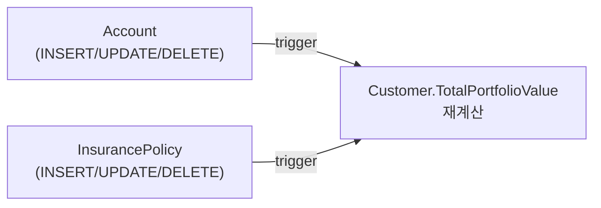

import { Callout, Steps, Step, Tabs, TabsList, TabsTrigger, TabsContent, Icon } from '@/components/writing-ui';

## 이게 뭔데

`Customer` 테이블에 "이 고객이 우리 은행에 맡긴 총 자산"을 담는 `TotalPortfolioValue` 컬럼이 있다고 치자. 이 값은 그 자체로 입력되는 게 아니다. 고객의 `Account`(예금) 잔액들과 `InsurancePolicy`(보험) 평가액들을 다 합친 **계산값**이다. 소스가 어딘가 흩어져 있고, 컬럼은 그 합을 들고 있는 거다.

문제는 이거다. **소스가 바뀌면 누가 이 합계를 다시 계산해서 넣어주냐?** Add Trigger For Calculated Column은 그 일을 **DB한테 떠넘기는** 리팩토링이다. 소스 테이블(`Account`, `InsurancePolicy`)에 트리거를 달아서, 그 테이블에 INSERT/UPDATE/DELETE가 일어날 때마다 트리거가 알아서 `Customer.TotalPortfolioValue`를 다시 계산해 갱신하게 만든다.

비유하자면 가계부다. 평소엔 통장 잔액을 적어둔 메모를 보고 산다. 근데 입금이나 출금이 생길 때마다 그 메모를 손으로 고쳐 쓰면 깜빡하기 십상이잖아. 그래서 "통장에 변동이 생기면 자동으로 메모를 갱신하는 비서"를 한 명 고용하는 거다. 그 비서가 트리거다.

<Callout type="info" title="한 줄 요약">
계산 컬럼의 값을 사람(애플리케이션)이 갱신하면 빠뜨린다. 소스 테이블마다 트리거를 달아 DB가 변경을 감지하고 자동으로 다시 계산하게 한다.
</Callout>

이 리팩토링은 보통 짝꿍이 있다. 계산 컬럼 자체는 **Introduce Calculated Column**으로 먼저 만들어 두고(빈 컬럼 하나 추가), 그다음 이 글의 트리거로 "갱신 책임"을 채워 넣는 식이다. 컬럼 만드는 거랑, 그 컬럼을 살아 있게 유지하는 거는 별개의 일이라는 얘기다.

## 언제 쓰나

핵심 동기는 단순하다. **계산 결과를 미리 저장해두고 싶은데(읽기는 빠르니까), 그 값이 항상 정확하길 원하는** 상황이다.

원래 정석은 이렇다. 매번 읽을 때 `SUM`을 돌리면 된다. 컬럼에 저장할 필요도 없다.

```sql
-- 계산값을 미리 저장 안 하면, 읽을 때마다 이렇게
SELECT c.CustomerId,
       (SELECT COALESCE(SUM(a.Balance), 0) FROM Account a WHERE a.CustomerId = c.CustomerId)
     + (SELECT COALESCE(SUM(p.CashValue), 0) FROM InsurancePolicy p WHERE p.CustomerId = c.CustomerId)
       AS TotalPortfolioValue
FROM Customer c
WHERE c.CustomerId = 42;
```

이게 멀쩡히 돌아가면 굳이 컬럼을 만들 이유가 없다. 그런데 현실에선 다음 냄새가 나기 시작한다.

- **읽기가 너무 잦고 무겁다.** 고객 목록 화면, 대시보드, 리포트마다 매번 이 합계를 실시간으로 돌린다. 계좌가 수백 개인 VIP 고객이면 `SUM`이 꽤 묵직하다. 차라리 결과를 컬럼에 박아두고 그냥 읽고 싶다.
- **같은 계산 로직이 앱마다 복붙돼 있다.** 모바일 앱, 내부 어드민, 야간 배치가 각자 자기 버전의 "총자산 계산" SQL을 들고 있다. 어느 날 보험 평가액 계산식이 바뀌면 세 군데를 다 고쳐야 하고, 한 군데를 빼먹으면 값이 서로 안 맞는다.
- **여러 앱이 한 DB를 공유한다.** 모든 앱이 "계산값 갱신 책임"을 성실히 질 거라고 믿을 수 없다. 누군가는 `Account.Balance`만 슥 바꾸고 `TotalPortfolioValue` 갱신은 까먹는다.

이 셋 중 하나라도 해당되면, 계산을 **DB 한 곳**으로 내려보낼 때가 된 거다. 앱이 뭘 하든 소스가 바뀌면 DB가 알아서 합계를 맞춰주니까.

<Callout type="info" title="먼저 물어라 — 이 DB를 누가 쓰나">
이 리팩토링의 동기 셋 중 둘(중복 계산, 다중 앱 공유)은 결국 "이 DB에 쓰는 주체가 여럿"이라는 한 가지 상황이다. 거꾸로 **drizzle 서비스 하나가 이 DB를 소유하고, 모든 쓰기가 그 서비스를 거친다면** 트리거를 먼저 꺼내지 마라. 순서는 이렇다.

1. **일단 읽을 때 계산한다.** drizzle이면 관계 쿼리나 `sql` 집계로 표현하고, 재사용되면 조건절처럼 함수 하나로 뺀다([뷰 도입](/docs/dev/database/refactoring-database/96.introduce-view)에서 "활성 고객"을 `activeCustomer()`로 뺀 것과 같은 패턴). 컬럼도, 트리거도, 동기화 책임도 없다.
2. **읽기가 실제로 무거워서 측정으로 확인되면**, 그제서야 계산 컬럼 + 갱신 메커니즘을 도입한다.

즉 트리거는 "성능이 진짜 문제거나 / 쓰는 주체가 여럿이라 앱의 양심을 믿을 수 없을 때"의 도구다. 단일 소유 서비스에서 DRY 하나 때문에 트리거부터 가면, 보이지 않는 마법과 두 군데로 쪼개진 로직이라는 비용만 떠안는다.
</Callout>

### 시나리오: 이런 적 있을 거임

신규 가입 이벤트를 한다. "총자산 1억 이상 고객에게 사은품 발송." 마케팅팀이 `Customer.TotalPortfolioValue >= 100000000` 조건으로 대상자를 뽑아 발송 리스트를 만들었다. 잘 나갔다.

그런데 며칠 뒤 컴플레인이 들어온다. "나 분명히 자산 1.5억인데 왜 사은품 안 왔냐"고. 들어가서 보니 그 고객의 `TotalPortfolioValue`가 **8천만 원**으로 박혀 있다. 왜? 한 달 전 모바일 앱에서 큰 금액을 입금했는데, 그 입금 처리 코드가 `Account.Balance`는 올렸지만 `Customer.TotalPortfolioValue` 재계산을 깜빡한 거다. 모바일팀은 "어드민이 갱신하는 줄 알았다"고 하고, 어드민팀은 "그건 배치가 도는 거 아니었냐"고 한다. 아무도 책임 안 진 사이, 컬럼 값은 한 달 전 그대로 화석이 됐다.

이게 계산 컬럼의 고질병이다. **컬럼은 거짓말을 안 한다. 단지 아무도 갱신을 안 했을 뿐이다.** "누가 갱신하냐"를 애플리케이션들의 양심에 맡기는 순간 이런 일이 난다. 트리거는 이 책임을 DB 한 곳으로 못 박는다.

## 주의할 점

좋아 보이지만, 트리거는 양날의 검이다. 마구 쓰면 디버깅 지옥을 부른다.

<Callout type="warning" title="트리거에 비즈니스 로직 몰빵하지 마라">
- **로직이 두 군데로 쪼개진다.** 계산식이 복잡하거나 소스가 여러 테이블/여러 조건에 흩어져 있으면, 그 로직이 결국 트리거 안에 한 벌, 애플리케이션 안에 한 벌 — 두 군데 생긴다. 둘이 미묘하게 달라지는 순간 값이 안 맞고, 어느 쪽이 진실인지 아무도 모른다.
- **트리거 실패 = 트랜잭션 통째 롤백.** 트리거 안에서 예외가 나면 그걸 유발한 INSERT/UPDATE까지 같이 죽는다. 입금하려던 앱 입장에선 "멀쩡한 입금이 왜 실패하지?" 싶은, 원인 모를 부작용이 된다. 트리거는 조용히 곁다리 일을 하는 게 아니라 **본 트랜잭션의 운명에 묶여 있다.**
- **보이지 않는 마법이다.** 코드 어디에도 `TotalPortfolioValue = ...`가 없는데 값이 갱신된다. 신규 입사자는 트리거의 존재를 모르고 한참 헤맨다. 트리거는 "숨은 비용"이다.
- **같은 테이블 자기참조 갱신은 막힌 DB가 많다.** 소스 데이터와 계산 컬럼이 **같은 테이블**에 있으면(예: `Order` 안에서 `LineTotal`을 모아 같은 행의 `OrderTotal`에 넣기), 많은 DB가 "내가 변경 감지한 그 테이블을 트리거 안에서 또 UPDATE" 하는 걸 막는다(mutating table 에러 등). 이럴 땐 트리거가 답이 아니다 — 아래 현대적 대안을 봐라.
</Callout>

규칙으로 삼을 만한 건 이거다. **트리거는 "갱신을 빠뜨리지 않게 하는 안전장치"로만 쓰고, 무거운 비즈니스 판단은 넣지 마라.** 합계 `SUM` 정도는 OK. "환율 받아와서, 등급별 가중치 곱하고, 외부 API 찔러서..." 같은 건 트리거에 들어가면 안 된다.

## 이렇게 한다

은행 도메인으로 가자. 목표: `Customer.TotalPortfolioValue` = 그 고객의 모든 `Account.Balance` 합 + 모든 `InsurancePolicy.CashValue` 합. 소스가 두 테이블이니, **두 테이블 각각에 트리거를 단다.** 이게 핵심이다 — 계산 컬럼 하나여도 소스 테이블 수만큼 트리거가 필요하다.



<Steps>
<Step title="트리거가 가능한지부터 판단">
소스와 계산 컬럼이 다른 테이블이면(`Account`/`InsurancePolicy` → `Customer`) 보통 가능하다. **같은 테이블 안**이면 DB 제품에 따라 막히니, 막히면 generated column이나 뷰로 방향을 튼다(뒤에서).
</Step>
<Step title="계산 컬럼을 둘 테이블 정하고 없으면 추가">
이 합계를 가장 잘 설명하는 엔티티는 고객이다. `Customer`에 컬럼이 없으면 Introduce New Column으로 빈 칸 하나 만든다.

```sql
ALTER TABLE Customer ADD COLUMN TotalPortfolioValue DECIMAL(15,2) DEFAULT 0;
```
</Step>
<Step title="기존 모든 행을 1회 배치로 채운다">
트리거는 "앞으로의 변경"만 잡는다. 이미 들어 있는 과거 데이터는 한 번 손으로 채워줘야 한다. 이건 데이터 마이그레이션이라기보단 초기화에 가깝다.

```sql
UPDATE Customer c
SET TotalPortfolioValue =
      COALESCE((SELECT SUM(a.Balance)   FROM Account a         WHERE a.CustomerId = c.CustomerId), 0)
    + COALESCE((SELECT SUM(p.CashValue) FROM InsurancePolicy p WHERE p.CustomerId = c.CustomerId), 0);
```
</Step>
<Step title="소스 테이블마다 트리거를 단다">
`Account`에 하나, `InsurancePolicy`에 하나. 각각 INSERT/UPDATE/DELETE를 다 잡아야 한다(출금/해약으로 줄어드는 것도 반영해야 하니까).
</Step>
<Step title="앱에서 중복 계산 코드를 걷어낸다">
이제 진실의 원천은 DB다. 앱 곳곳에 흩어진 "총자산 직접 계산" 코드를 찾아 지우고, 그냥 컬럼을 읽게 바꾼다.
</Step>
</Steps>

### 스키마 변경 + 트리거 (DDL)

PostgreSQL 기준이다. 변경된 행의 `CustomerId`만 골라 그 고객만 다시 계산하는 식으로 짠다(전체 테이블을 매번 다시 합치면 안 된다).

```sql
-- 재계산 로직 한 곳에 모음 (트리거 둘이 공유)
CREATE OR REPLACE FUNCTION recalc_portfolio(p_customer_id BIGINT)
RETURNS VOID AS $$
BEGIN
  UPDATE Customer c
  SET TotalPortfolioValue =
        COALESCE((SELECT SUM(a.Balance)   FROM Account a         WHERE a.CustomerId = p_customer_id), 0)
      + COALESCE((SELECT SUM(p.CashValue) FROM InsurancePolicy p WHERE p.CustomerId = p_customer_id), 0)
  WHERE c.CustomerId = p_customer_id;
END;
$$ LANGUAGE plpgsql;

-- 트리거 본체: 영향받은 고객만 재계산
CREATE OR REPLACE FUNCTION trg_recalc_portfolio()
RETURNS TRIGGER AS $$
BEGIN
  IF (TG_OP = 'DELETE') THEN
    PERFORM recalc_portfolio(OLD.CustomerId);
  ELSE
    PERFORM recalc_portfolio(NEW.CustomerId);
    -- UPDATE로 소유 고객이 바뀐 경우, 옛 고객도 갱신
    IF (TG_OP = 'UPDATE' AND OLD.CustomerId <> NEW.CustomerId) THEN
      PERFORM recalc_portfolio(OLD.CustomerId);
    END IF;
  END IF;
  RETURN NULL;  -- AFTER 트리거라 반환값은 무시됨
END;
$$ LANGUAGE plpgsql;

-- 소스 테이블 각각에 부착 (둘 다 필요)
CREATE TRIGGER account_portfolio
  AFTER INSERT OR UPDATE OR DELETE ON Account
  FOR EACH ROW EXECUTE FUNCTION trg_recalc_portfolio();

CREATE TRIGGER policy_portfolio
  AFTER INSERT OR UPDATE OR DELETE ON InsurancePolicy
  FOR EACH ROW EXECUTE FUNCTION trg_recalc_portfolio();
```

2006년 책 버전은 이걸 테이블마다 통째로 손코딩한 `AFTER UPDATE OR INSERT OR DELETE ... FOR EACH ROW` 블록 두 개로 풀어 쓴다. 골격은 똑같다. 다만 위처럼 재계산 로직을 함수 하나(`recalc_portfolio`)로 빼두면, 소스 테이블이 셋, 넷으로 늘어도 트리거만 더 달지 로직은 한 벌만 유지된다. **로직 중복을 트리거 단계에서부터 막는 게 포인트다.**

<Callout type="note" title="FOR EACH ROW vs FOR EACH STATEMENT">
야간 배치가 `Account`를 10만 건 한 번에 UPDATE 하면, `FOR EACH ROW`는 10만 번 트리거가 돈다. 같은 고객 행을 수십 번 다시 합치는 낭비가 생긴다. Postgres라면 `FOR EACH STATEMENT` + transition table(`REFERENCING NEW TABLE AS ...`)로 영향받은 `CustomerId`를 `DISTINCT`로 모아 한 번에 처리하는 게 대량 변경에 훨씬 싸다. 트리거를 둘 거면 대량 쓰기 경로를 꼭 같이 생각해라.
</Callout>

### 마이그레이션 도구로 버전 관리

트리거를 콘솔에서 손으로 때려 넣고 끝내면, 다음 환경에 배포할 때 또 까먹는다. 트리거도 **스키마의 일부**니 마이그레이션 도구로 버전 관리하는 게 맞다.

<Tabs defaultValue="flyway">
<TabsList>
<TabsTrigger value="flyway">Flyway / Liquibase</TabsTrigger>
<TabsTrigger value="alembic">Alembic</TabsTrigger>
<TabsTrigger value="orm">ORM 마이그레이션</TabsTrigger>
</TabsList>
<TabsContent value="flyway">

`V58__add_portfolio_trigger.sql` 한 파일에 함수·트리거 생성 DDL과 기존 행 1회 백필을 함께 담는다. Flyway가 순서대로 적용하고 체크섬으로 변조를 막는다.

```sql
-- V58__add_portfolio_trigger.sql
ALTER TABLE Customer ADD COLUMN IF NOT EXISTS TotalPortfolioValue DECIMAL(15,2) DEFAULT 0;
-- (위의 함수/트리거 생성 DDL)
-- 마지막에 기존 행 백필 UPDATE
```

Liquibase라면 changeset에 `<sqlFile>`로 묶고, 롤백용으로 `DROP TRIGGER`/`DROP FUNCTION`을 명시해두면 깔끔하다.
</TabsContent>
<TabsContent value="alembic">

`upgrade()`에서 `op.execute(...)`로 함수/트리거 DDL을 날리고, `downgrade()`에서 `DROP TRIGGER`/`DROP FUNCTION`으로 되돌린다. 백필 UPDATE도 `upgrade()` 끝에 넣는다.

```python
def upgrade():
    op.execute("ALTER TABLE Customer ADD COLUMN TotalPortfolioValue DECIMAL(15,2) DEFAULT 0")
    op.execute(RECALC_FUNCTION_SQL)
    op.execute(TRIGGER_SQL)
    op.execute(BACKFILL_SQL)

def downgrade():
    op.execute("DROP TRIGGER account_portfolio ON Account")
    op.execute("DROP TRIGGER policy_portfolio ON InsurancePolicy")
    op.execute("DROP FUNCTION trg_recalc_portfolio")
    op.execute("DROP FUNCTION recalc_portfolio")
```
</TabsContent>
<TabsContent value="orm">

대부분의 ORM 마이그레이션(Prisma, TypeORM, Rails 등)은 트리거 같은 raw DDL을 위한 escape hatch가 있다. 자동 생성된 마이그레이션에 raw SQL 블록을 직접 끼워 넣어라. ORM이 트리거를 "모른다"는 점은 늘 의식해야 한다 — 스키마 diff에 안 잡힌다.
</TabsContent>
</Tabs>

### 접근 프로그램 수정 (코드)

이제 앱에서 직접 계산하던 곳을 다 없앤다. 진실은 컬럼에 있으니 읽기만 한다.

```typescript
// Before: 앱이 매번 직접 합산 (앱마다 제각각인 그 코드)
async function getPortfolioValue(customerId: number): Promise<number> {
  const accounts = await accountRepo.find({ where: { customerId } });
  const policies = await policyRepo.find({ where: { customerId } });
  const accountSum = accounts.reduce((s, a) => s + a.balance, 0);
  const policySum  = policies.reduce((s, p) => s + p.cashValue, 0);
  return accountSum + policySum;   // 누군가는 보험을 빼먹고 계산한다
}

// After: DB가 유지하는 컬럼을 그냥 읽는다
async function getPortfolioValue(customerId: number): Promise<number> {
  const customer = await customerRepo.findOneOrFail({ where: { customerId } });
  return customer.totalPortfolioValue;
}
```

그리고 입금/출금/해약 코드에서 `TotalPortfolioValue`를 손으로 갱신하던 부분도 **지워야 한다.** 트리거가 하니까 앱이 또 건드리면 이중 갱신이거나 충돌이다.

<Callout type="warning" title="앱마다 계산이 다르면 그건 버그였을 수도">
코드를 걷어내다 보면 앱A는 보험을 포함하고 앱B는 안 했더라, 하는 걸 발견하게 된다. 이건 "어느 게 맞냐"를 비즈니스와 합의해야 하는 신호다. 트리거 하나로 통일하는 김에 그동안 조용히 어긋나 있던 진실을 바로잡는 거다. 무지성으로 한쪽 코드만 옮기지 말고, 정의부터 확정해라.
</Callout>

### 현대적 대안: 트리거를 안 써도 되는 길

트리거가 정답이 아닐 때가 꽤 있다. 상황별로 더 나은 도구가 있다.

**1. Generated Column — 같은 테이블 안 계산이면 1순위.**
`Order` 행 안에서 `Quantity * UnitPrice`를 `LineTotal`에 넣는 식, 즉 **같은 행의 다른 컬럼으로 계산**되는 거면 트리거 쓰지 말고 generated column을 써라. DB가 정의대로 항상 보장하고, 트리거의 mutating-table 문제도 없고, 보이지 않는 마법도 아니다(컬럼 정의에 식이 그대로 박혀 있다).

```sql
-- Postgres: 저장형 생성 컬럼. 트리거 없이 DB가 항상 유지
ALTER TABLE OrderLine
  ADD COLUMN LineTotal DECIMAL(15,2)
  GENERATED ALWAYS AS (Quantity * UnitPrice) STORED;
```

단, generated column은 **같은 행 안**의 값만 참조할 수 있다. 다른 테이블의 `SUM`(우리 포트폴리오 예시)은 못 한다 — 그건 트리거나 뷰의 영역이다.

**2. 머티리얼라이즈드 뷰 — 합계를 통째로 별도 객체로.**
포트폴리오처럼 여러 테이블을 집계하는 거라면, 컬럼+트리거 대신 머티리얼라이즈드 뷰로 합계를 통째 들고 있는 방법도 있다. 갱신 시점을 우리가 제어할 수 있어서(주기적 `REFRESH`), 실시간성이 덜 중요하고 읽기만 빠르면 되는 리포트/대시보드에 잘 맞는다.

```sql
CREATE MATERIALIZED VIEW customer_portfolio AS
SELECT c.CustomerId,
       COALESCE(SUM(a.Balance), 0) + COALESCE(SUM(p.CashValue), 0) AS TotalPortfolioValue
FROM Customer c
LEFT JOIN Account a         ON a.CustomerId = c.CustomerId
LEFT JOIN InsurancePolicy p ON p.CustomerId = c.CustomerId
GROUP BY c.CustomerId;

-- 야간 배치나 이벤트 후 갱신
REFRESH MATERIALIZED VIEW CONCURRENTLY customer_portfolio;
```

트레이드오프는 명확하다. 트리거는 **실시간 정확**하지만 매 쓰기에 비용을 얹는다. 머티리얼라이즈드 뷰는 **갱신 사이엔 살짝 오래된 값**이지만 쓰기 경로를 건드리지 않는다. "사은품 1억 컷"처럼 실시간이 중요하면 트리거, "월말 리포트"면 뷰. 도메인이 요구하는 신선도에 맞춰 고르면 된다.

**3. CDC / Outbox — 갱신을 비동기로, 다른 서비스로.**
마이크로서비스라 `Customer`와 `Account`가 **서로 다른 서비스/DB 소유**라면, 트리거로 남의 테이블을 건드릴 수가 없다(애초에 건드리면 안 된다 — 데이터 소유권 위반). 이때는 Debezium 같은 CDC로 `Account`의 변경 이벤트를 흘려보내고, 포트폴리오 서비스가 그걸 구독해 자기 쪽 집계값을 갱신한다. 트랜잭션 일관성이 필요하면 outbox 패턴으로 "도메인 변경 + 이벤트 발행"을 한 트랜잭션에 묶는다. 트리거가 "한 DB 안의 동기 갱신"이라면, 이건 "서비스 경계를 넘는 비동기 갱신"이다.

<Callout type="success" title="고르는 기준 정리">
- 단일 소유 서비스 + 읽기 부하 감당 가능 → **그냥 읽을 때 계산**(코드/drizzle 쿼리), 비정규화 자체를 하지 마라
- 같은 행 안 계산 → **generated column** (제일 깔끔)
- 한 DB 안, 다른 테이블 집계, 실시간 정확 필요 → **트리거**
- 한 DB 안, 살짝 오래돼도 OK, 읽기만 빠르면 됨 → **머티리얼라이즈드 뷰**
- 서비스/DB 경계를 넘음 → **CDC / outbox** (비동기)
</Callout>

## 정리

계산 컬럼의 진짜 문제는 "계산"이 아니라 "**누가 갱신하냐**"다. 그걸 애플리케이션들의 양심에 맡기면 언젠가 누군가 빠뜨리고, 컬럼은 화석이 된다.

> **계산 컬럼을 만들었으면, 그걸 살아 있게 유지할 책임도 같이 못 박아라.**

Add Trigger For Calculated Column은 그 책임을 DB 한 곳에 못 박는 리팩토링이다. 소스 테이블마다 트리거를 달아 변경을 감지하고 자동 재계산하게 한다. 대신 트리거는 보이지 않고, 본 트랜잭션의 운명에 묶이고, 로직을 두 군데로 쪼갤 위험이 있으니 — **무거운 판단은 넣지 말고 "갱신 안전장치"로만** 써라. 그리고 같은 행 계산이면 generated column, 오래돼도 되는 집계면 머티리얼라이즈드 뷰, 서비스 경계를 넘으면 CDC가 더 나은 자리가 있다는 걸 잊지 마라. 트리거는 강력하지만, 항상 첫 번째 답은 아니다.
