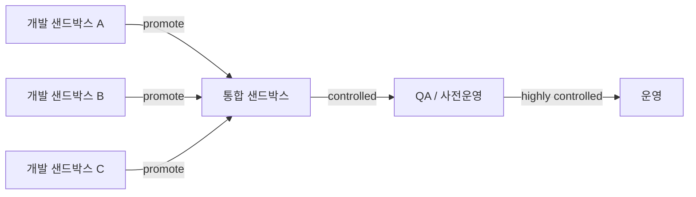

## 이게 뭔데

샌드박스. 모래밭이다. 애가 거기서 성을 쌓든 부수든 누구도 안 다친다. 다 부수고 나가면 다음 애가 또 처음부터 쌓는다. 데이터베이스 샌드박스도 똑같다. **시스템을 빌드하고, 테스트하고, 굴릴 수 있는 완전 기능 환경 한 벌**인데, 핵심은 "여기서 뭘 망가뜨려도 옆 사람과 운영은 멀쩡하다"는 거다.

코드는 다들 이렇게 한다. 내 브랜치 따서 내 로컬에서 막 깨작거리다가, 되면 올리고 안 되면 `git checkout .`으로 갈아엎는다. 망해도 나만 망한다. 그런데 DB는 이상하게 이게 잘 안 된다. **개발자 다섯 명이 공유 개발 DB 하나에 붙어서**, 한 명이 `ALTER TABLE`로 컬럼 하나 날리는 순간 나머지 넷의 로컬이 동시에 빨개진다. "야 누가 account 테이블 건드렸어" 슬랙에 올라오는 그 순간이 바로, **샌드박스가 없어서 생기는 사고**다.

<Callout type="info" title="한 줄 요약">
샌드박스는 "내 DB를 마음껏 망가뜨릴 자유"를 보장하는 격리 환경이다. 개발자는 자기 모래밭에서 부수고 되돌리고, 다 되면 통합 환경으로 **승격(promote)**한다. 핵심은 격리 + 원클릭 재생성이다.
</Callout>

이 글은 은행 도메인을 계속 쓴다. `Customer`, `Account`, `Balance`, `Policy`, `Insurance` 테이블이 있는 그 시스템. 여기에 새 컬럼 하나 넣는 변경을, 어떤 모래밭들을 거쳐 운영까지 밀어 올리는지를 따라가 본다.

## 시나리오: 공유 개발 DB의 비극

이런 적 있을 거다. 팀에 개발 DB가 딱 하나 있다. `dev-db.internal`. 다 같이 붙어 쓴다. 처음엔 편하다. 누가 시드 깔아두면 다 같이 쓰고, 데이터도 풍부하고.

그러다 어느 날, A가 `Account` 테이블에 `interest_rate` 컬럼을 추가하는 작업을 시작한다. 로컬에서 `ALTER TABLE`을 친다. 아, 로컬이 아니지. **공유 DB에 친다.** 그 순간:

```text
A: ALTER TABLE account ADD COLUMN interest_rate NUMERIC(5,4);  -- 작업 중
B: (전혀 모름) 배포 빌드 돌림 → ORM이 모르는 컬럼 발견 → 빌드 깨짐
C: 마이그레이션 테스트 돌림 → "이미 컬럼 있는데요?" 에러
D: 데모 준비 중 → 화면 데이터 갑자기 이상해짐
```

A는 아직 코드도 안 짰는데 스키마만 먼저 바꿔놨고, B/C/D는 그 변경을 **공유받기로 합의한 적이 없다.** 코드라면 머지하기 전엔 안 섞이는데, 공유 DB는 머지고 뭐고 없이 **그냥 즉시 전파**된다. 이게 공유 개발 DB의 근본 문제다. 버전 관리도 안 되고, 격리도 안 되고, 되돌리기도 어렵다.

<Callout type="error" title="뭐가 문제냐면">
- **격리가 없다**: 한 사람의 실험이 전원에게 즉시 전파된다. 코드 머지처럼 "내가 받을 시점을 고를" 권한이 없다.
- **버전이 모호하다**: "지금 dev-db 스키마가 어느 마이그레이션까지 적용된 상태냐"를 아무도 단언 못 한다. 손으로 친 `ALTER`는 기록도 안 남는다.
- **되돌릴 수가 없다**: 누가 데이터를 날리면 복구가 막막하다. 모래성을 부쉈는데 다시 못 쌓는다.
- **마이크로서비스면 더 심하다**: 서비스 여러 개가 DB 하나를 공유하면, 이 비극이 서비스 경계를 넘어 번진다. 공유 DB는 그 자체로 안티패턴이다.
</Callout>

해법은 책이 40년 전부터 말하던 거랑 같다. **모래밭을 나눠라.** 각자 자기 DB를 갖고, 거기서 부수고, 다 되면 통합한다.

## 샌드박스의 종류와 승격 흐름

책은 샌드박스를 논리적 단계로 나눈다. 규모 큰 데가 7~8개씩 쓰기도 하지만, 본질은 다섯 단계다.

<Steps>
<Step title="개발 샌드박스 (development)">
개발자 **한 명당 하나**. 소스 코드 사본 + 데이터베이스 사본을 들고, 아무도 안 보는 데서 막 부순다. 변경을 채택하든 되돌리든 나만 영향받는다. 반복(iteration)이 가장 격렬하게 일어나는 곳. 여기선 깨져도 된다. 깨지라고 있는 환경이다.
</Step>
<Step title="프로젝트 통합 샌드박스 (project-integration)">
개발자들이 각자 작업을 **승격(promote)**해서 합치는 곳. 형상 관리 통제 하에 두고, 다 같이 돌아가는지 본다. 배포가 잦다(frequent deployment). 여기서 깨지면 "누구 변경 때문인지"를 따진다. 통합이 처음 일어나는 지점이라, 충돌도 여기서 처음 드러난다.
</Step>
<Step title="데모 샌드박스 (demo)">
고객·기획에게 보여주는 곳. 안정된 스냅샷을 유지한다. 데모 5분 전에 누가 마이그레이션 돌려서 데이터 날리는 사고를 막으려고 따로 둔다.
</Step>
<Step title="사전 운영 / QA 샌드박스 (pre-production / QA)">
시스템 테스트·인수 테스트를 돌리는 곳. **통제된 배포(controlled deployment)**. 운영과 최대한 비슷한 데이터 규모·구성으로 맞춰, "운영에서만 터지는 문제"를 여기서 잡으려 한다.
</Step>
<Step title="운영 (production)">
**고도로 통제된 배포(highly controlled deployment)**. 여기서의 변경은 신중하고 작고 되돌릴 수 있어야 한다. 모래밭이 아니다. 여긴 진짜 돈이 오가는 곳이다.
</Step>
</Steps>

변경은 이 단계들을 **승격**하면서 위로 올라간다. 승격은 보통 개발 주기당 한 번 일어나지만, 환경에 따라 더 잦을 수도 있다. 그리고 **자주 승격할수록 좋다.** 통합을 늦게 할수록 충돌이 쌓이고, 한 번에 터질 때 더 아프기 때문이다. 코드의 "작은 PR을 자주" 원칙과 정확히 같은 얘기다.



<Callout type="note" title="작은 팀은 다섯 개 다 필요 없다">
SI나 소규모 팀에서 물리 샌드박스 7~8개는 명백히 과하다. 현실적으로는 **(1) 개발자 로컬, (2) 통합/스테이징, (3) 운영** 3단계면 충분하다. 중요한 건 단계 개수가 아니라 두 가지다: 개발자마다 **자기 DB가 격리돼 있을 것**, 그리고 모든 환경이 **같은 마이그레이션 스크립트로 동일하게 재현될 것**. 이 둘만 지키면 단계는 적어도 된다.
</Callout>

## 현대화: 모래밭은 이제 Docker로 판다

책이 2006년에 "개발자마다 DB 사본을 주라"고 했을 때, 그건 사실 좀 사치스러운 조언이었다. DB 인스턴스 하나 까는 게 반나절짜리 일이었으니까. 그래서 다들 공유 DB로 타협했다.

지금은 사정이 완전히 다르다. **DB 한 벌 띄우는 게 명령어 한 줄**이다. 격리를 안 할 이유가 없어졌다.

### 1. Docker Compose — 로컬 개발 샌드박스

개발 샌드박스의 표준 답안. 레포에 `docker-compose.yml` 하나 넣어두면, 새로 합류한 개발자도 `docker compose up` 한 방으로 자기만의 DB를 갖는다.

```yaml
# docker-compose.yml
services:
  db:
    image: postgres:16
    environment:
      POSTGRES_DB: banking
      POSTGRES_USER: dev
      POSTGRES_PASSWORD: dev
    ports:
      - "5432:5432"
    volumes:
      - ./db/init:/docker-entrypoint-initdb.d  # 초기 DDL + seed 자동 실행
```

`./db/init` 디렉터리에 스키마 DDL과 시드 SQL을 넣어두면, 컨테이너가 처음 뜰 때 자동으로 실행된다. 망가뜨렸으면? `docker compose down -v && docker compose up`. 볼륨까지 날리고 처음부터 다시 판다. **모래성 부수고 다시 쌓기가 30초.**

### 2. 설치 스크립트 = 원클릭 셋업

책이 5.10에서 강조한 게 바로 이 **설치 스크립트**다. "다양한 머신에 다양한 버전의 스키마로 DB를 만들 수 있어야 한다"는 요구가, 합류·이탈이 잦은 팀에서 생명줄이라는 거다. 책이 제시한 절차는 지금도 그대로 유효하다.

<Steps>
<Step title="초기 DDL로 스키마 생성">
빈 DB에 `Customer`, `Account`, `Balance`, `Policy`, `Insurance` 테이블을 만든다.
</Step>
<Step title="적용 가능한 변경 스크립트 적용">
그동안 쌓인 마이그레이션을 순서대로 적용한다. 손으로? 아니다. Flyway/Liquibase/Alembic이 한다.
</Step>
<Step title="회귀 테스트로 설치 성공 확인">
스위트를 돌려서 "이 환경이 제대로 만들어졌다"를 기계가 보증한다.
</Step>
</Steps>

이걸 하나로 묶어 `Makefile`이나 `package.json` 스크립트로 노출하면, 신규 입사자 온보딩이 이렇게 끝난다.

```bash
git clone ... && cd banking
make setup        # compose up + migrate + seed + test
# 끝. 본인 전용 DB가 마이그레이션 최신 + 시드까지 채워진 상태로 뜬다
```

마이그레이션 도구가 핵심인 이유는, **"지금 이 DB가 어느 버전이냐"를 기계가 답한다**는 데 있다. Flyway는 `flyway_schema_history` 테이블에, 적용한 스크립트와 체크섬을 기록한다. 공유 개발 DB에서 "스키마 버전을 아무도 단언 못 하던" 그 문제가, 도구를 끼는 순간 사라진다.

```sql
-- Flyway가 관리하는 이력 (직접 만들 필요 없음)
SELECT version, description, checksum, success
FROM flyway_schema_history
ORDER BY installed_rank;
-- 1  init_schema        ...  true
-- 2  add_interest_rate  ...  true   <- A의 변경이 여기 기록됨
```

### 3. Ephemeral DB — 테스트마다 새 모래밭

CI에서는 한술 더 뜬다. 테스트가 시작될 때 컨테이너로 진짜 DB를 띄우고, 끝나면 버린다. **Testcontainers**가 이 일을 한다.

```typescript
// 테스트가 자기만의 일회용 Postgres를 띄운다
const pg = await new PostgreSqlContainer("postgres:16").start();
const url = pg.getConnectionUri();
await runMigrations(url);   // 같은 마이그레이션 적용
// ... 테스트 실행 ...
await pg.stop();            // 통째로 버림. 다음 테스트는 깨끗한 새 DB
```

목(mock)이 아니라 **진짜 Postgres**라서, 실제 운영과 같은 SQL 방언·제약·인덱스가 검증된다. 그리고 일회용이라 테스트 간 오염이 원천 봉쇄된다. 각 테스트가 자기 모래밭을 갖고, 끝나면 부순다.

### 4. 브랜치 DB — 코드 브랜치처럼 DB 브랜치

요즘 나온 서버리스 Postgres(Neon)나 MySQL(PlanetScale)은 한 걸음 더 간다. **DB를 git 브랜치처럼 분기**한다.

```bash
# 운영 데이터의 복사본을 즉시 분기 (copy-on-write라 빠르고 싸다)
neon branches create --name feat/interest-rate --parent main
```

기능 브랜치를 따듯이, 운영 데이터의 격리된 사본을 몇 초 만에 만든다. 거기서 마이그레이션을 시험하고, PR마다 미리보기 DB를 붙이고, 다 되면 브랜치를 지운다. 개발 샌드박스의 "내 DB 사본"이라는 책의 개념이, 운영 데이터 규모로 현실화된 셈이다.

<Callout type="warning" title="브랜치 DB라고 마이그레이션이 자동은 아니다">
DB를 브랜치로 떠도, **스키마 변경 자체는 여전히 expand-contract처럼 안전하게 설계해야** 한다. 컬럼 추가는 nullable로 먼저(expand), 코드 양쪽 배포 후, 나중에 강제(contract). 브랜치는 "실험할 격리 공간"을 줄 뿐, 위험한 변경을 안전하게 만들어주진 않는다. 그건 다른 문제다.
</Callout>

## 승격의 실제: interest_rate 컬럼 따라가기

처음의 그 `Account.interest_rate` 변경을, 이제 제대로 된 샌드박스 흐름으로 다시 굴려보자. 공유 DB에 `ALTER`를 직접 치는 대신:

<Steps>
<Step title="개발 샌드박스에서 마이그레이션 작성">
A는 자기 로컬 Docker DB에서 `V2__add_interest_rate.sql`을 쓴다. `ADD COLUMN interest_rate NUMERIC(5,4)` — 운영 안전을 위해 **nullable 또는 DEFAULT**로. 자기 DB에서만 적용해 보고, 코드도 같이 짠다. B/C/D는 전혀 영향 안 받는다.
</Step>
<Step title="PR로 승격 요청">
마이그레이션 스크립트는 **애플리케이션 소스와 같은 Git 저장소**에 있다(책 5.12의 핵심). PR을 올리면 변경 이력·작성자·리뷰가 코드와 똑같이 남는다. 누가 스키마를 왜 바꿨는지가 `git blame`으로 추적된다.
</Step>
<Step title="통합 샌드박스에서 자동 검증">
CI가 ephemeral DB를 띄워 마이그레이션을 처음부터 끝까지 적용하고 회귀 테스트를 돌린다. 다른 개발자의 마이그레이션과 충돌하면 여기서 빨개진다 — 공유 DB와 달리, **합의된 시점에, 격리된 곳에서** 충돌이 드러난다.
</Step>
<Step title="QA → 운영으로 통제된 승격">
머지되면 같은 스크립트가 스테이징/QA에 적용되고, 마지막으로 운영에 **고도로 통제된 배포**로 올라간다. 모든 환경이 동일한 마이그레이션 파일을 거치므로, "환경마다 스키마가 미묘하게 다른" 일이 안 생긴다.
</Step>
</Steps>

같은 변경인데 결과가 정반대다. 공유 DB에선 작업 시작과 동시에 전원이 깨졌고, 샌드박스 흐름에선 **A가 다 만들고 검증한 뒤에야** 합의된 절차로 전파된다. 바뀐 건 SQL이 아니라 **변경이 흐르는 경로**다.

<Callout type="info" title="시드 데이터도 자산이다">
seed 스크립트(테스트 데이터 생성 스크립트)도 DDL·마이그레이션과 똑같이 버전 관리하고 같은 저장소에 둔다. `Customer` 50명, 각자 `Account` 몇 개, 적당한 `Balance`와 `Policy`를 채우는 시드가 레포에 있으면, 누가 환경을 새로 파든 **같은 출발선**에서 시작한다. "내 로컬엔 그 데이터가 있는데?" 같은 재현 불가 버그가 줄어든다.
</Callout>

## 정리

샌드박스는 거창한 인프라 얘기가 아니다. **"내 DB를 망가뜨릴 자유"**를 모두에게 주는 일이다. 자유에는 격리가 필요하고, 격리에는 원클릭 재생성이 필요하다.

> **각자 자기 모래밭에서 부수고 되돌려라. 다 되면, 합의된 절차로 위로 승격해라.**

책이 2006년에 그린 그림 — 개발/통합/데모/QA/운영으로 나뉜 환경과, 그 사이를 흐르는 승격 — 은 지금도 그대로 옳다. 달라진 건 그걸 **싸고 빠르게** 만드는 도구다. Docker Compose로 로컬 모래밭을 30초에 파고, Testcontainers로 테스트마다 일회용 DB를 쓰고, Neon/PlanetScale로 운영 데이터를 브랜치처럼 떠서 실험한다. 마이그레이션 도구가 모든 환경의 버전을 기계로 보증한다.

판단 기준은 단순하다. **"이 변경을 시작했을 때, 나 말고 누가 깨지는가?"** 답이 "아무도"라면 샌드박스가 제대로 갖춰진 거다. 답이 "팀 전원"이라면, 당신은 아직 공유 개발 DB라는 한 칸짜리 모래밭에서 다섯 명이 서로 성을 밟고 있는 거다. 모래밭부터 나눠라.
