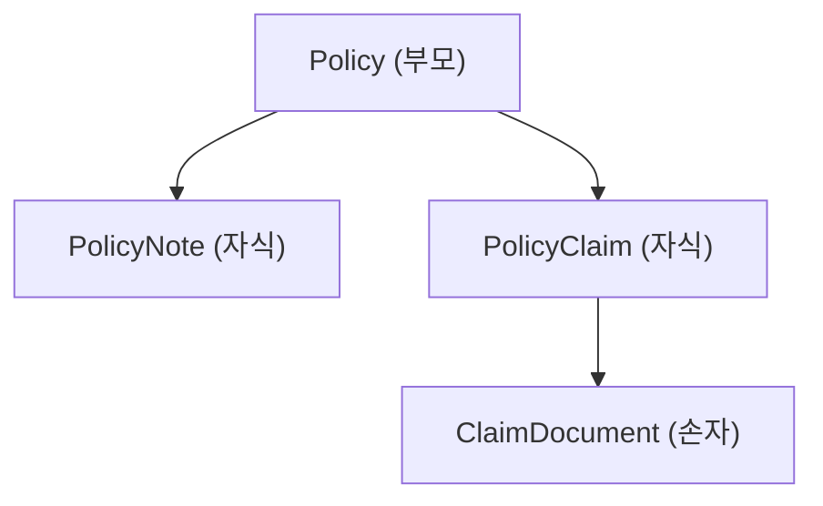

import { Callout, Steps, Step, Tabs, TabsList, TabsTrigger, TabsContent, Icon } from '@/components/writing-ui';

## 이게 뭔데

연쇄 삭제(Cascading Delete)는 **부모 행을 지우면 거기 매달린 자식 행들도 DB가 알아서 같이 지워주는** 규칙이다. `Policy` 한 줄을 지웠는데 그 보험에 딸린 `PolicyNote`, `PolicyClaim`이 손 안 대도 따라 사라진다.

비유하자면 회사 그만둘 때 책상 정리하는 거다. 정상이라면 책상 위 서류, 서랍 속 사물, 컴퓨터에 깔린 계정까지 전부 같이 치워야 깔끔하다. 그런데 사람이 일일이 치우면 꼭 하나씩 빠뜨린다. 서랍 깊숙한 메모 한 장, 어딘가 남은 임시 계정 하나. 그렇게 남은 게 바로 **고아 행(orphaned row)**이다. 부모는 없는데 "나 이 부모 자식인데요" 하고 떠도는 데이터.

연쇄 삭제는 이걸 사람 손이 아니라 DB한테 맡기는 거다. "이 부모 지우면 자식도 다 같이 정리해" 하고 규칙으로 박아두면, 누가 어느 앱에서 부모를 지우든 자식이 깔끔하게 따라 사라진다.

<Callout type="info" title="한 줄 요약">
Introduce Cascading Delete는 "부모 삭제 → 자식 자동 삭제" 정책을 DB에 못 박아 고아 행을 원천 차단하는 리팩토링이다. 손으로 자식을 순회 삭제하던 코드를 DB(또는 ORM)한테 떠넘긴다.
</Callout>

## 언제 쓰나

답은 단순하다. **부모를 지웠을 때 자식만 외톨이로 남는 게 명백히 잘못인 관계**일 때 쓴다.

가장 전형적인 게 "부모 없으면 존재 이유가 없는" 종속 데이터다. 은행 도메인으로 보자. `Policy`(보험증권)가 사라졌으면 그 증권에 달린 메모(`PolicyNote`)와 청구(`PolicyClaim`)는 더 이상 의미가 없다. 증권이 없는 청구가 시스템에 떠 있어 봐야 어디에도 붙을 데가 없는 쓰레기일 뿐이다. 이런 구성을 객체 모델 쪽에선 보통 **composition**(전체-부분, 부분은 전체 없이 못 산다)이라 부른다. 부분이 전체보다 오래 살면 안 되는 관계, 거기가 연쇄 삭제의 자리다.

반대로 연쇄 삭제를 **쓰면 안 되는** 관계도 분명하다. 자식이 부모와 독립적으로도 살아남아야 한다면. `Account`(계좌)를 지운다고 그 계좌의 주인 `Customer`(고객)까지 날아가면 안 된다. 고객은 다른 계좌도 갖고 있고, 계좌 하나 닫았다고 사람이 증발하면 큰일이다. 이런 건 연쇄 삭제가 아니라 "부모가 자식을 갖고 있는데 자식이 더 우선"인 정반대 관계라, 오히려 부모 삭제를 막아야(`ON DELETE RESTRICT`) 한다.

### 현실 시나리오: 이런 적 있을 거임

`deletePolicy(policyId)` 라는 메서드가 있다. 처음엔 한 줄이었다. 보험증권 지우는 거니까 그냥 `DELETE FROM Policy WHERE id = ?`. 평화로웠다.

그러다 어느 날 운영팀이 신고한다. "삭제된 증권의 청구 건이 통계 리포트에 자꾸 잡혀요." 까보니 `Policy`만 지우고 `PolicyClaim`은 안 지웠던 거다. 그래서 코드를 고친다. 청구도 같이 지우자.

```typescript
async function deletePolicy(policyId: number) {
  await db.delete('PolicyClaim', { policyId });
  await db.delete('Policy', { id: policyId });
}
```

몇 달 뒤 또 신고. "삭제된 증권 메모가 검색에 떠요." `PolicyNote`를 빠뜨린 거다. 또 한 줄 추가. 그다음엔 `PolicyDocument`, 그다음엔 `PolicyAuditLog`... 자식 테이블이 늘 때마다 이 메서드를 누가 기억하고 고쳐줘야 한다. 그리고 사람은 반드시 까먹는다.

진짜 문제는 따로 있다. **`deletePolicy`를 안 거치는 삭제 경로**다. 배치 잡이 만료 증권을 직접 `DELETE` 때리고, 어드민 콘솔이 또 직접 지우고, 옆 팀 마이크로서비스가 또 자기 방식으로 지운다. 각자 "자식도 같이 지워야지"를 **알아서 기억해야** 한다. 한 군데라도 까먹으면 고아 행이 쌓인다. 이게 바로 책이 말하는 "여러 애플리케이션이 한 DB를 공유할 때 앱들이 일관되게 무결성을 지키리라 믿을 수 없다"는 상황이다.

연쇄 삭제는 이 책임을 **DB로 끌어내린다**. 삭제 정책을 스키마에 한 번 박아두면, 어느 앱이 어느 경로로 부모를 지우든 자식은 항상 같이 정리된다. 기억할 필요가 없어진다.

## 주의할 점

좋다고 아무 데나 박으면 안 된다. 연쇄 삭제는 본질적으로 "내가 모르는 사이에 데이터가 줄줄이 사라지는" 기능이라, 양날의 검이다.

<Callout type="warning" title="우발적 대량 삭제가 진짜 무섭다">
연쇄 삭제의 가장 위험한 시나리오는 **부모 한 줄 삭제가 자식 수천 줄을 쓸어버리는** 경우다. 책의 예시가 정확하다 — 대형 부서(Department) 하나를 지웠더니 거기 소속 직원(Employee) 수천 명이 연쇄로 날아간다. 콘솔에서 무심코 `DELETE FROM Department WHERE id = 7` 한 줄 친 게, 사실은 "직원 3,000명 삭제" 버튼이었던 거다. 게다가 자식의 자식까지 **재귀적**으로 번지기 때문에, 파급 범위를 머릿속으로 계산하기가 어렵다. 정말로 통째 사라져도 되는 종속 데이터에만 걸고, 사람이 살아남아야 하는 엔티티(Customer, Employee 등)에는 절대 함부로 걸지 마라.
</Callout>

나머지 트레이드오프도 짚어두자.

- **교착(deadlock).** 트리거 방식으로 연쇄를 짜다 보면, 여러 트리거가 같은 테이블들을 서로 다른 순서로 잠그면서 교착이 생길 수 있다. 특히 **순환 의존**(A가 B를, B가 다시 A를 연쇄)은 절대 피해야 한다. 다행히 현대 DB는 교착을 탐지해서 한쪽 트랜잭션을 롤백해주지만, 롤백이 일어난다는 건 그 작업이 실패했다는 뜻이라 결코 공짜가 아니다.
- **트랜잭션 전체 롤백.** 연쇄 삭제 도중 어느 자식 삭제가 실패하면(다른 제약에 걸리거나 락 타임아웃), 부모 삭제까지 통째로 롤백된다. 호출하는 앱 입장에선 "부모 지웠는데 안 지워졌네?" 하는 부작용으로 보이므로, **연쇄 실패용 오류 처리**를 새로 넣어야 한다.
- **기능 중복.** Hibernate, (구) Oracle TopLink 같은 ORM은 이미 관계 관리를 자동화해준다. DB에도 `ON DELETE CASCADE`를 걸고 ORM에도 cascade를 걸면, 같은 일을 두 군데서 하게 돼 동작 예측이 어려워진다. 둘 중 어디서 책임질지 **한 곳으로 정하는** 게 중요하다(뒤에서 다룬다).

<Callout type="error" title="대형 테이블 한 방 삭제는 그 자체가 사고다">
수백만 행을 한 트랜잭션에서 연쇄 삭제하면, 그동안 그 행들에 락이 걸리고 트랜잭션 로그가 폭증한다. 운영 중인 테이블이면 다른 쿼리가 줄줄이 막히고 복제 지연(replication lag)까지 번진다. 큰 정리 작업은 연쇄 삭제 한 줄로 끝낼 게 아니라, 자식부터 배치로 끊어서(chunked delete) 지우는 별도 작업으로 다뤄야 한다. 연쇄 삭제는 "운영 중 한 건 한 건 들어오는 삭제"를 깔끔하게 만드는 용도지, "대량 일괄 청소" 도구가 아니다.
</Callout>

## 이렇게 한다

연쇄 메커니즘을 고르는 게 핵심이다. 크게 세 갈래다. (1) **RI 제약 + `ON DELETE CASCADE`** — DB가 자동 처리, (2) **트리거** — 세밀한 제어, (3) **앱/ORM에서 명시적으로** — 코드가 책임. 하나씩 보자.

### 0단계: 적용 범위 식별 (재귀적으로)

<Callout type="warning" title="한 번에 전체 적용 금지">
책이 강하게 경고하는 부분이다. 연쇄 삭제는 한 방에 모든 테이블에 적용하지 말고, **테이블 세트 단위로 구현·테스트한 뒤** 다음으로 넘어가라. 삭제 대상을 식별할 때 반드시 **재귀적으로** 따져라 — `Policy`의 자식 `PolicyClaim`에 또 자식(`ClaimDocument`)이 있다면 그것까지 연쇄 범위다. 종이에 트리를 그려서 "부모 하나 지우면 정확히 무엇 무엇이 사라지는지"를 눈으로 확인하고 시작하는 게 안전하다.
</Callout>

은행 도메인의 보험증권 트리를 예로 잡자.



`Policy` 하나를 지우면 `PolicyNote`, `PolicyClaim`이 따라가고, `PolicyClaim`을 거쳐 `ClaimDocument`까지 재귀적으로 사라져야 한다. 이 트리 전체가 연쇄 범위다.

### 방법 A: ON DELETE CASCADE (선언적, 보통 1순위)

가장 깔끔한 방법이다. 외래 키 제약에 `ON DELETE CASCADE`만 붙이면, 자식 삭제 코드를 한 줄도 안 짜고 DB가 알아서 처리한다. 단, 연쇄가 동작하려면 **그 관계에 FK 제약이 먼저 있어야** 한다. 없으면 Add Foreign Key Constraint부터 해야 한다.

```sql
-- Before: 그냥 FK만 있는 상태 (또는 FK조차 없는 상태)
ALTER TABLE PolicyNote
  ADD CONSTRAINT FK_PolicyNote_Policy
  FOREIGN KEY (PolicyId) REFERENCES Policy (PolicyId);

-- After: 연쇄 삭제를 켠다
ALTER TABLE PolicyNote
  ADD CONSTRAINT FK_PolicyNote_Policy
  FOREIGN KEY (PolicyId) REFERENCES Policy (PolicyId)
  ON DELETE CASCADE;
```

`PolicyClaim`에도 똑같이 걸고, 손자인 `ClaimDocument`는 `PolicyClaim`을 참조하는 FK에 `ON DELETE CASCADE`를 걸면 재귀 연쇄가 완성된다. `Policy` 한 줄 지우면 → `PolicyClaim` 사라지고 → 그게 `ClaimDocument`까지 끌고 내려간다.

운영 중인 테이블이라면 제약 추가 자체가 락을 잡을 수 있다. 현대 DB의 안전 장치를 쓰자.

<Tabs defaultValue="pg">
  <TabsList>
    <TabsTrigger value="pg">PostgreSQL</TabsTrigger>
    <TabsTrigger value="mysql">MySQL</TabsTrigger>
  </TabsList>
  <TabsContent value="pg">

PostgreSQL은 새 FK를 `NOT VALID`로 먼저 추가해 기존 행 전체 스캔(과 그동안의 락)을 건너뛰고, 나중에 한가할 때 `VALIDATE CONSTRAINT`로 검증할 수 있다. 연쇄 정책 자체는 추가 즉시 적용된다.

```sql
-- 1) 즉시 추가, 기존 행 검증은 미룸 (짧은 락)
ALTER TABLE PolicyNote
  ADD CONSTRAINT FK_PolicyNote_Policy
  FOREIGN KEY (PolicyId) REFERENCES Policy (PolicyId)
  ON DELETE CASCADE
  NOT VALID;

-- 2) 트래픽 적을 때 기존 데이터 검증 (ACCESS EXCLUSIVE 락 없이)
ALTER TABLE PolicyNote VALIDATE CONSTRAINT FK_PolicyNote_Policy;
```

  </TabsContent>
  <TabsContent value="mysql">

MySQL/InnoDB는 FK 추가가 비교적 가볍지만, 대형 테이블이면 온라인 스키마 변경 도구(gh-ost, pt-online-schema-change)로 원본 테이블 락을 피하는 게 안전하다. 도구가 그림자 테이블을 만들고 트리거로 변경분을 따라잡은 뒤 원자적으로 교체한다.

```bash
# pt-online-schema-change 예시 (개념)
pt-online-schema-change \
  --alter "ADD CONSTRAINT FK_PolicyNote_Policy \
           FOREIGN KEY (PolicyId) REFERENCES Policy(PolicyId) \
           ON DELETE CASCADE" \
  D=bank,t=PolicyNote --execute
```

  </TabsContent>
</Tabs>

장점은 명확하다 — 코드가 없으니 까먹을 게 없고, 어느 앱이 어느 경로로 지우든 DB가 일관되게 처리한다. 단점은 책 말대로 **디버깅이 어렵다**는 것. 자식이 왜 사라졌는지 코드 어디에도 안 적혀 있어서, 신입이 처음 보면 "유령이 데이터를 지운다"고 느낀다.

### 방법 B: 트리거 (세밀한 제어가 필요할 때)

단순 "다 지워"가 아니라 조건이 붙거나, 삭제 전에 부가 작업(아카이브, 감사 로그)이 필요하면 트리거를 쓴다. `ON DELETE CASCADE`보다 자유롭지만 코드를 직접 짜야 하고, 다중 트리거 간 교착 위험이 따라온다.

```sql
-- Policy 삭제 시 자식들을 정리하는 트리거 (PostgreSQL 예시)
CREATE OR REPLACE FUNCTION fn_delete_policy_children()
RETURNS TRIGGER AS $$
BEGIN
  -- 필요하면 여기서 아카이브 테이블로 먼저 복사할 수도 있다
  DELETE FROM PolicyNote  WHERE PolicyId = OLD.PolicyId;
  DELETE FROM PolicyClaim WHERE PolicyId = OLD.PolicyId;
  RETURN OLD;
END;
$$ LANGUAGE plpgsql;

CREATE TRIGGER trg_delete_policy_children
  BEFORE DELETE ON Policy
  FOR EACH ROW
  EXECUTE FUNCTION fn_delete_policy_children();
```

<Callout type="note" title="트리거를 쓸 거면 졸업 조건을 함께 정해라">
이 시리즈가 일관되게 강조하는 패턴: 트리거는 **전환 기간(transition period)**의 임시 안전망으로 두고, 모든 앱이 새 정책에 맞춰지면 가능한 한 선언적 `ON DELETE CASCADE`로 갈아타거나 명시적 앱 로직으로 옮겨라. 트리거 정의 위에 drop date 주석(`-- DROP AFTER 2026-09-01, 앱 v3.2 전면 배포 후`)을 달아두면, 6개월 뒤의 누군가가 "이 트리거 왜 있지?"로 헤매지 않는다. 트리거 남발은 디버깅 지옥의 지름길이라, 졸업 조건 없는 트리거는 만들지 마라.
</Callout>

### 방법 C: 명시적 앱 로직 / ORM cascade (현대적 1순위 후보)

여기가 2006년 책과 현대 실무가 가장 크게 갈리는 지점이다. 책은 DB 트리거/제약을 기본으로 다루지만, 요즘은 **삭제 규칙을 애플리케이션(또는 ORM 매핑)에서 명시적으로 표현**하는 쪽을 선호하는 경우가 많다. 이유가 있다 — 도메인 규칙이 코드에 드러나야 읽기 쉽고, 테스트하기 쉽고, "유령이 지웠다" 사고가 안 난다.

ORM을 쓰면 매핑에서 cascade를 선언한다. JPA/Hibernate 기준:

```typescript
// 자식이 부모 없이는 존재 불가 → orphanRemoval + CascadeType.ALL
@Entity()
class Policy {
  @OneToMany(() => PolicyClaim, claim => claim.policy, {
    cascade: ['remove'],     // 부모 remove 시 자식도 remove
    orphanRemoval: true,     // 컬렉션에서 빠진 자식은 고아로 보고 삭제
  })
  claims: PolicyClaim[];
}
```

Hibernate XML 매핑 세계의 그 유명한 `cascade="all-delete-orphan"`이 정확히 이 의미다 — "부모 따라 지우고, 컬렉션에서 떨어져 나간 고아도 지운다." 책 본문도 O-R 매핑 도구를 쓸 땐 매핑 파일에 이 설정을 지정하라고 명시한다.

그 덕에 호출 코드는 책이 보여준 대로 극적으로 짧아진다.

```typescript
// Before: 자식을 일일이 순회 삭제 (까먹기 쉽고, 새 자식 추가 시 또 고쳐야 함)
async function deletePolicy(policyId: number) {
  await db.delete('ClaimDocument', { /* claim 거쳐서... */ });
  await db.delete('PolicyClaim', { policyId });
  await db.delete('PolicyNote',  { policyId });
  await db.delete('Policy',      { id: policyId });
}

// After: 한 줄. cascade가 자식·손자를 책임진다
async function deletePolicy(policy: Policy) {
  await em.remove(policy);   // ORM cascade가 PolicyClaim → ClaimDocument까지 정리
}
```

<Callout type="warning" title="DB cascade와 ORM cascade를 동시에 켜지 마라">
가장 흔한 함정이다. `ON DELETE CASCADE`(DB)와 `cascade=remove`(ORM)를 둘 다 켜면, ORM이 자식을 먼저 일일이 `DELETE` 날리고, 그다음 부모를 지울 때 DB가 또 연쇄하려다 "이미 없는데?"로 꼬이거나, 반대로 ORM이 자식을 메모리에 안 올려서 DB만 조용히 지우고 ORM 캐시는 옛 상태로 남는 식의 불일치가 난다. 책이 말한 "기능 중복"의 현대판이다. **삭제 책임은 DB냐 ORM이냐 한 곳으로 정하고**, 한 군데서만 cascade를 켜라. 마이크로서비스로 테이블 소유권이 갈려 있다면(서비스마다 자기 테이블만 본다면) ORM/앱 레벨 명시적 삭제 + 도메인 이벤트가 더 깔끔할 때가 많다.
</Callout>

### 마이그레이션은 도구로, 데이터 마이그레이션은 없음

이 리팩토링의 좋은 소식: **데이터 마이그레이션이 없다.** 연쇄 삭제는 "앞으로의 삭제 동작"을 바꾸는 거지 기존 데이터를 옮기지 않는다(이미 쌓인 고아 행을 청소하고 싶다면 그건 별개의 정리 작업이다).

스키마 변경은 버전 관리되는 마이그레이션 도구로 박아두는 게 정석이다. 손으로 `ALTER`를 운영 콘솔에 치지 말고, Flyway/Liquibase/Alembic/ORM 마이그레이션에 올려서 어느 환경이든 동일하게 적용되고 롤백 경로가 남게 하라.

<Tabs defaultValue="flyway">
  <TabsList>
    <TabsTrigger value="flyway">Flyway</TabsTrigger>
    <TabsTrigger value="alembic">Alembic</TabsTrigger>
  </TabsList>
  <TabsContent value="flyway">

```sql
-- V60__cascade_delete_policy_children.sql
ALTER TABLE PolicyNote  DROP CONSTRAINT FK_PolicyNote_Policy;
ALTER TABLE PolicyNote  ADD  CONSTRAINT FK_PolicyNote_Policy
  FOREIGN KEY (PolicyId) REFERENCES Policy (PolicyId) ON DELETE CASCADE;

ALTER TABLE PolicyClaim DROP CONSTRAINT FK_PolicyClaim_Policy;
ALTER TABLE PolicyClaim ADD  CONSTRAINT FK_PolicyClaim_Policy
  FOREIGN KEY (PolicyId) REFERENCES Policy (PolicyId) ON DELETE CASCADE;
```

  </TabsContent>
  <TabsContent value="alembic">

```python
def upgrade():
    op.drop_constraint("FK_PolicyNote_Policy", "PolicyNote", type_="foreignkey")
    op.create_foreign_key(
        "FK_PolicyNote_Policy", "PolicyNote", "Policy",
        ["PolicyId"], ["PolicyId"], ondelete="CASCADE",
    )

def downgrade():
    op.drop_constraint("FK_PolicyNote_Policy", "PolicyNote", type_="foreignkey")
    op.create_foreign_key(
        "FK_PolicyNote_Policy", "PolicyNote", "Policy",
        ["PolicyId"], ["PolicyId"],   # ON DELETE 없음 = 원복
    )
```

  </TabsContent>
</Tabs>

### 접근 프로그램 수정

DB나 ORM이 연쇄를 책임지게 됐으니, **앱에서 자식을 손으로 지우던 코드는 제거**한다(앞의 `deletePolicy` Before→After가 그것). 단, 책의 경고를 새겨라.

<Callout type="error" title="모든 삭제 경로가 같은 식으로 자식을 지운다고 가정하지 마라">
앱마다 자식 삭제 구현이 미묘하게 다를 수 있다. A 앱은 `PolicyNote`도 지웠는데 B 앱은 안 지웠다거나, C 배치는 아예 raw SQL로 `Policy`만 지웠다거나. "당연히 다들 똑같이 하겠지"라고 가정하고 한쪽 코드만 지우면, 다른 경로에서 이중 삭제나 누락이 난다. 모든 삭제 경로를 찾아 일관되게 정리하고, **연쇄 실패 시의 새 오류 처리**(트랜잭션 롤백 → "삭제 실패" 응답)를 추가하라.
</Callout>

마지막으로 검증 전략을 정리하면 이렇다.

<Steps>
  <Step title="범위를 재귀적으로 그린다">
  부모 하나 삭제 시 사라질 자식·손자 트리를 종이에 그린다. 사람이 살아남아야 할 엔티티(Customer, Employee)가 섞여 있지 않은지 확인.
  </Step>
  <Step title="메커니즘을 하나로 정한다">
  DB `ON DELETE CASCADE` vs 트리거 vs ORM/앱 cascade 중 하나. 둘 이상 동시에 켜지 않는다.
  </Step>
  <Step title="테이블 세트 단위로 적용·테스트한다">
  한 방에 전부 적용 금지. 한 트리(예: Policy 계열)만 마이그레이션으로 올리고, 부모 삭제 → 자식 정확히 사라지는지 / 무관한 데이터 안 건드리는지 테스트.
  </Step>
  <Step title="앱의 수동 자식 삭제 코드를 제거한다">
  모든 삭제 경로에서 손코딩 자식 삭제를 걷어내고, 연쇄 실패용 오류 처리를 넣는다.
  </Step>
  <Step title="스테이징에서 대량 삭제 폭발 반경을 확인한다">
  "부모 1건이 자식 몇 건을 끌고 가는지" 실제 데이터로 측정. 대형 부모가 수천 건을 쓸어버리는 경로가 있으면 별도 배치 삭제로 분리.
  </Step>
</Steps>

## 정리

Introduce Cascading Delete는 "부모 지우면 자식도 따라 지운다"는 단순한 규칙이지만, **책임을 사람의 기억에서 시스템으로 옮기는** 리팩토링이다. 손으로 자식을 순회 삭제하는 코드는 새 자식 테이블이 생길 때마다, 새 삭제 경로가 생길 때마다 누군가 까먹고 고아 행을 흘린다. 그 책임을 DB 제약이나 ORM cascade로 내리면 어느 경로로 지우든 일관되게 정리된다.

> **연쇄 삭제는 편의가 아니라 정합성 도구다 — 그리고 정합성 도구는 폭발 반경을 알고 써야 한다.**

핵심 균형은 하나다. 고아 행을 막아주는 만큼, **우발적 대량 삭제**라는 칼날을 함께 쥐게 된다. 그러니 (1) 정말로 부모 없이 못 사는 종속 데이터에만 걸고, (2) 메커니즘은 DB·트리거·ORM 중 한 곳으로만 정하고, (3) 사람이 살아남아야 할 엔티티에는 절대 걸지 마라. 2006년의 트리거를 골격으로 두되, 현대에선 선언적 `ON DELETE CASCADE`나 명시적 ORM/앱 cascade로 "데이터가 왜 사라졌는지 코드에 드러나게" 하는 쪽이 대체로 더 안전한 선택이다.
