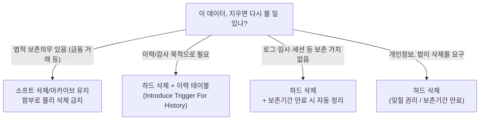

import { Callout, Steps, Step, Tabs, TabsList, TabsTrigger, TabsContent, Icon } from '@/components/writing-ui';

## 이게 뭔데

한 문장으로: **"삭제됐음"이라고 표시만 하던 짓을 그만두고, 진짜로 행을 지우는 것.** 소프트 삭제(soft delete)를 되돌리는 리팩토링이라 보면 된다.

비유를 들자면 책상 서랍이다. 예전의 너는 안 쓰는 영수증을 버리기가 아까워서 서랍에 "버릴 것" 스티커를 붙여 그냥 넣어뒀다. 한 장 두 장은 괜찮았다. 그런데 5년쯤 지나니 서랍이 영수증으로 꽉 차서, 정작 필요한 계약서 한 장 꺼내려면 "버릴 것" 스티커 붙은 종이 수천 장을 매번 헤집어야 한다. Introduce Hard Delete는 그 서랍을 열어서, 스티커 붙은 것들을 실제 쓰레기통에 버리고, 앞으로는 버릴 건 그냥 버리기로 하는 거다.

DB로 옮기면 이렇다. `Customer` 테이블에 `isDeleted` 같은 플래그 컬럼이 있고, 삭제는 `UPDATE Customer SET isDeleted = TRUE`로만 했다고 치자. 모든 조회 쿼리는 매번 `WHERE isDeleted = FALSE`를 달고 다녀야 했고, 테이블엔 아무도 안 쓰는 죽은 행이 산처럼 쌓였다. Introduce Hard Delete는 그 컬럼을 떼어내고, 죽은 행을 실제로 `DELETE`하고, 앞으로의 삭제는 진짜 `DELETE`로 바꾼다.

<Callout type="info" title="한 줄 요약">
삭제 플래그를 떼고 물리 삭제로 돌아간다. 테이블이 작아지고, 쿼리에서 `WHERE isDeleted = FALSE`가 사라진다. 대가는 단 하나 — 삭제된 데이터의 이력을 잃는다.
</Callout>

## 언제 쓰나

이 리팩토링이 답이 되는 상황은 의외로 명확하다. **"이 데이터, 사실 보존할 이유가 없었네"** 하는 깨달음이 올 때다.

소프트 삭제는 처음엔 다 그럴듯한 이유로 들어온다. "혹시 복구해야 할지도 몰라서", "감사(audit) 때문에", "실수로 지우면 무서우니까". 그래서 일단 `isDeleted` 컬럼을 박는다. 문제는 이게 **들어올 땐 쉽고 나갈 땐 어렵다**는 거다. 한번 박아두면 모든 쿼리가 그 플래그를 의식해야 하고, 누구도 "이거 이제 안 쓰는 거 아냐?"라고 먼저 말을 못 꺼낸다.

이 리팩토링이 답인 냄새들:

- **테이블의 절반이 죽은 행이다.** `SELECT COUNT(*) WHERE isDeleted = TRUE`가 살아있는 행보다 많아지는 순간, 인덱스도 통계도 죽은 데이터에 휘둘린다. 옵티마이저가 보는 세상의 절반이 유령이다.
- **모든 쿼리에 `WHERE isDeleted = FALSE`가 덕지덕지 붙어 있다.** 그리고 누군가는 분명 한 군데에서 그걸 빼먹어서, 지운 줄 알았던 고객이 화면에 다시 등장하는 버그를 만든다. 이건 시간문제다.
- **애초에 보존할 이유가 없는 데이터다.** 세션 로그, 임시 토큰, 장바구니 임시 항목, 만료된 캐시 행. 이런 건 "이력"이라는 단어를 붙일 가치조차 없는데 소프트 삭제로 쌓이고 있다.
- **보존정책(data retention)이 오히려 삭제를 요구한다.** GDPR의 잊힐 권리, 개인정보 보존기간 만료. 법이 "지워라"라고 하는데 `isDeleted = TRUE`로 표시만 하고 데이터가 디스크에 남아 있으면, 그건 안 지운 거다.

마지막 항목이 2006년 책엔 약하게 다뤄지지만 현대에선 제일 무겁다. **소프트 삭제는 "데이터를 안 지우는" 설계다.** 개인정보를 다루는 테이블에서 이건 기능이 아니라 리스크다.

### 시나리오: 이런 적 있을 거임

신규 입사해서 `Customer` 테이블을 처음 본다. 컬럼이 한 30개쯤 되는데 그중에 `isDeleted`, `deleted_at`, `deleted_by`, `delete_reason`이 나란히 박혀 있다. "오 이력 관리 잘해놨네" 싶어서 데이터를 까보면 — 전체 800만 행 중 `isDeleted = TRUE`가 520만 행이다. **살아있는 고객은 280만인데 테이블은 800만 행을 짊어지고 있다.**

그러다 운영팀에서 컴플레인이 온다. "탈퇴한 고객이 마케팅 발송 대상에 또 잡혔어요." 코드를 까보니 새로 짠 배치 쿼리 하나가 `WHERE isDeleted = FALSE`를 빠뜨렸다. 520만 명의 유령이 그 한 줄 누락으로 부활한 거다.

여기서 PM한테 묻는다. "이 520만 행, 복구한 적 있어요? 누가 본 적은요?" 돌아오는 답: "어... 그거 왜 남겨두는지 아무도 몰라요. 옛날부터 그랬어요." 바로 이 순간이 Introduce Hard Delete를 꺼낼 타이밍이다. 보존의 근거가 "옛날부터 그랬어요"라면, 그건 보존이 아니라 방치다.

## 주의할 점

<Callout type="warning" title="지우기 전에 세 번 묻는다">
하드 삭제의 유일하면서도 치명적인 단점은 **되돌릴 수 없다**는 거다. 소프트 삭제의 `isDeleted = FALSE`는 한 줄 `UPDATE`로 부활하지만, `DELETE FROM Customer`로 날아간 행은 백업 없이는 영영 안 돌아온다. 그러니:

- **정말 이력이 필요 없는 게 맞나?** 필요하면 하드 삭제 대신 별도 이력 테이블로 옮기는 길(Introduce Trigger For History)이 있다. "지운다"와 "안 보이게 한다"와 "감사 로그에 남긴다"는 전부 다른 요구사항이다. 뭉뚱그리지 마라.
- **이 행을 참조하는 데이터는 없나?** 고객을 지우는데 그 고객의 계좌(`Account`)·보험증권(`InsurancePolicy`)이 FK로 매달려 있으면, 물리 삭제 순간 참조 무결성이 깨지거나 DB가 예외를 던진다. 자식부터 정리하거나 연쇄 삭제 정책을 먼저 정해야 한다.
- **법적 보존의무는 없나?** 금융 거래 기록처럼 법이 "N년 보관"을 강제하는 데이터는 함부로 물리 삭제하면 안 된다. 반대로 개인정보처럼 법이 "지워라"라고 하는 데이터는 소프트 삭제가 위법이 될 수 있다. **삭제 전에 보존정책부터 확인하는 게 순서다.**
</Callout>

그리고 현실적인 함정 하나 더. 운영 테이블에서 수백만 행을 한 방에 `DELETE`하면 그 자체가 사고다. 거대한 트랜잭션이 락을 길게 잡고, 언두 로그(undo/redo)가 폭발하고, 복제 지연(replication lag)이 치솟는다. 죽은 행을 지우려다 살아있는 서비스를 죽인다. 이건 뒤에서 다룬다.

## 이렇게 한다

전체 흐름은 세 갈래다. **스키마 변경(컬럼 제거)**, **데이터 마이그레이션(죽은 행 물리 삭제)**, **접근 프로그램 수정(코드에서 플래그 제거)**. 순서가 중요한데, 직관과 반대로 **데이터부터 지우고 컬럼을 떼는 게** 보통 안전하다. 컬럼이 있어야 어떤 행이 죽은 행인지 알 수 있으니까.

<Steps>
<Step title="죽은 행을 아카이브한다 (롤백 대비)">
물리 삭제는 비가역적이다. 지우기 전에 `isDeleted = TRUE` 행을 통째로 어딘가에 떠둔다. 만약을 위한 안전벨트다.
</Step>
<Step title="참조하는 데이터를 먼저 정리한다">
지울 행을 가리키는 자식 행이 있으면 같이 정리하거나, 연쇄 삭제 / 참조 null 처리를 먼저 정한다. 안 그러면 FK 예외로 삭제가 막힌다.
</Step>
<Step title="죽은 행을 물리 삭제한다 (배치로 쪼개서)">
`isDeleted = TRUE`인 행을 실제로 `DELETE`한다. 단, 한 번에 다 지우지 말고 청크로 나눈다.
</Step>
<Step title="접근 코드를 고친다">
SELECT에서 `WHERE isDeleted = FALSE`를 떼고, 삭제 로직을 `UPDATE ... SET isDeleted = TRUE`에서 진짜 `DELETE`로 바꾼다.
</Step>
<Step title="플래그 컬럼과 트리거를 제거한다">
이제 아무도 `isDeleted`를 안 쓰면, 컬럼을 갱신하던 트리거를 DROP하고 컬럼 자체를 Drop Column 한다. 기본값 제약은 컬럼과 함께 자동으로 사라진다.
</Step>
</Steps>

### 1. 데이터 마이그레이션 — 죽은 행 지우기

가장 순진한 형태는 책에 나온 그대로다.

```sql
-- 책 버전: 논리 삭제된 행을 전부 물리 삭제
DELETE FROM Customer WHERE isDeleted = TRUE;
```

한 줄이라 깔끔해 보이지만, 운영 테이블에서 이 한 줄이 520만 행을 한 트랜잭션으로 지우면 사고가 난다. 현대 실무에선 **배치로 쪼갠다.** 청크 단위로 지우고, 사이사이 숨을 쉬게 해서 복제 지연과 락 보유 시간을 통제한다.

<Tabs defaultValue="pg">
<TabsList>
<TabsTrigger value="pg">PostgreSQL</TabsTrigger>
<TabsTrigger value="mysql">MySQL</TabsTrigger>
</TabsList>
<TabsContent value="pg">

```sql
-- 한 번에 1만 행씩, 더 지울 게 없을 때까지 반복
-- (애플리케이션/스크립트 루프에서 반복 호출하거나 DO 블록으로)
DELETE FROM Customer
WHERE CustomerID IN (
  SELECT CustomerID FROM Customer
  WHERE isDeleted = TRUE
  LIMIT 10000
);
-- 각 청크 사이에 짧게 쉬어 복제 지연(replication lag)을 식힌다
```

</TabsContent>
<TabsContent value="mysql">

```sql
-- MySQL은 DELETE에 LIMIT을 바로 걸 수 있다
DELETE FROM Customer
WHERE isDeleted = TRUE
ORDER BY CustomerID
LIMIT 10000;
-- 영향 행 수가 0이 될 때까지 반복
```

</TabsContent>
</Tabs>

<Callout type="note" title="왜 굳이 쪼개나">
50만 행을 한 트랜잭션으로 지우면 언두 로그가 부풀고, 락이 길게 잡히고, 읽기 복제본이 그 큰 트랜잭션을 재생하느라 수 초~수 분 뒤처진다. 그동안 사용자에겐 "방금 바꾼 게 왜 안 보여요?"가 터진다. 1만 행 단위 청크 + 짧은 휴식이면 각 트랜잭션이 가볍고, 복제도 따라오고, 중간에 멈춰도 이미 지운 건 지운 채로 남아 재개가 쉽다.
</Callout>

자식 데이터가 있다면 순서를 챙겨야 한다. 은행 도메인으로 보면, 탈퇴 고객(`Customer`)을 지우기 전에 그 고객에 매달린 계좌(`Account`)·보험증권(`InsurancePolicy`)을 먼저 처리해야 한다.

```sql
-- 자식부터 정리한 뒤 부모를 지운다 (연쇄 삭제 제약이 없다면 수동으로)
DELETE FROM Account
WHERE CustomerID IN (SELECT CustomerID FROM Customer WHERE isDeleted = TRUE);

DELETE FROM Customer WHERE isDeleted = TRUE;
```

### 2. 접근 프로그램 수정 — 코드에서 플래그 떼기

소프트 삭제의 비용은 사실 디스크가 아니라 **코드 전체에 퍼진 `WHERE isDeleted = FALSE`**다. 이걸 걷어내는 게 이 리팩토링의 진짜 보상이다.

```sql
-- Before: 조회마다 죽은 행을 거른다
SELECT CustomerID, Name, Balance
FROM Customer
WHERE Region = 'KR' AND isDeleted = FALSE;

-- After: 죽은 행이 애초에 없으니 조건이 사라진다
SELECT CustomerID, Name, Balance
FROM Customer
WHERE Region = 'KR';
```

삭제 로직도 바꾼다. "삭제인 척하는 UPDATE"를 진짜 삭제로.

```typescript
// Before: 소프트 삭제 — 지운 척하는 UPDATE
async function deleteCustomer(id: string) {
  await db.query(
    'UPDATE Customer SET isDeleted = TRUE, deleted_at = NOW() WHERE CustomerID = $1',
    [id],
  );
}

// After: 하드 삭제 — 진짜로 지운다
async function deleteCustomer(id: string) {
  await db.query('DELETE FROM Customer WHERE CustomerID = $1', [id]);
}
```

ORM을 쓴다면 이 변화는 더 극적이다. 소프트 삭제를 쓰려고 켜둔 글로벌 필터/스코프를 통째로 들어내면 된다.

```typescript
// Before: 소프트 삭제 플러그인/글로벌 스코프로 모든 쿼리에 자동 필터를 주입
//   - TypeORM @DeleteDateColumn, Sequelize paranoid: true,
//     Prisma 미들웨어, Django objects = SoftDeleteManager() 등
// 이런 "안 보이게 하는 마법"을 전부 제거한다.

// After: 그냥 평범한 delete. 더 이상 숨겨진 필터가 없다.
await customerRepo.delete({ id });
```

<Callout type="success" title="여기서 expand-contract로 안전하게">
운영 중인 시스템이라면 컬럼을 갑자기 떼지 말고 expand-contract(parallel change) 순서로 가는 게 안전하다.

1. **Expand** — 코드를 먼저 고친다. 새 삭제 경로는 `DELETE`로, 조회는 `isDeleted` 의존을 끊는다. 단 이 단계에선 컬럼은 그대로 둔다.
2. **Migrate** — 배포가 끝나 아무 코드도 `isDeleted`를 안 읽고/안 쓰게 되면, 백그라운드 배치로 죽은 행을 청크 삭제한다.
3. **Contract** — 마지막에 트리거를 DROP하고 컬럼을 떼낸다.

코드와 스키마를 동시에 바꾸면 배포 타이밍에 따라 한쪽이 다른 쪽을 못 따라가 깨진다. 단계로 끊어야 무중단이다.
</Callout>

### 3. 스키마 변경 — 컬럼과 트리거 제거

이제 아무도 `isDeleted`를 안 쓴다. 마지막으로 소프트 삭제를 지탱하던 장치를 걷어낸다. 소프트 삭제는 보통 트리거로 구현돼 있다(앱이 갱신을 빠뜨릴 위험을 피하려고). 그 트리거를 먼저 DROP하고 컬럼을 뗀다.

```sql
-- 1) 삭제 시 isDeleted = TRUE로 바꾸던 트리거 제거
DROP TRIGGER IF EXISTS SoftDeleteCustomer;

-- 2) 컬럼 제거 — DEFAULT FALSE 제약은 컬럼과 함께 자동으로 사라진다
ALTER TABLE Customer DROP COLUMN isDeleted;
```

큰 테이블에서 `DROP COLUMN`은 DB에 따라 무거울 수 있다. PostgreSQL은 `DROP COLUMN`이 메타데이터만 건드려 즉시 끝나지만(값은 나중에 정리), MySQL은 버전·엔진에 따라 테이블을 다시 쓸 수 있다. 락이 걱정되는 대형 테이블이라면 gh-ost나 pt-online-schema-change 같은 온라인 스키마 변경 도구로 무중단으로 떼는 걸 고려한다.

그리고 이 모든 변경은 손으로 쿼리를 날리지 말고 마이그레이션 도구에 태운다. Flyway/Liquibase, Alembic, ORM 마이그레이션 어느 쪽이든. 컬럼 제거 같은 비가역적 변경일수록 **버전 관리되는 마이그레이션 파일로 기록**돼야, 누가 언제 왜 지웠는지가 남는다.

```text
# Flyway 예시: 마이그레이션 파일로 단계를 박제한다
V42__archive_deleted_customers.sql      -- 죽은 행 아카이브
V43__hard_delete_customers.sql          -- 청크 삭제 (배치는 별도 잡)
V44__drop_softdelete_trigger.sql        -- 트리거 DROP
V45__drop_isdeleted_column.sql          -- 컬럼 DROP
```

## 어떤 데이터에 쓰면 좋나

전부 다 하드 삭제로 미는 게 정답은 아니다. **데이터 성격에 따라 갈린다.** 큰 그림으로 정리하면 이렇다.



- **로그성·임시 데이터** — 세션, 임시 토큰, 만료 캐시 행. 보존 가치가 없으니 하드 삭제가 기본이고, 한 발 더 나아가 보존기간(TTL/retention)을 정해 자동으로 정리하는 게 낫다. PostgreSQL 파티셔닝으로 오래된 파티션을 통째로 `DROP`하거나, 시계열·로그 저장소의 TTL 기능을 쓰면 한 행씩 `DELETE`하는 비용조차 안 든다.
- **개인정보** — 보존기간이 끝나거나 사용자가 삭제를 요구하면 **진짜로 지워야** 한다. 여기서 소프트 삭제는 "지운 척"이라 컴플라이언스 위반이 될 수 있다. 하드 삭제가 요구사항 그 자체다.
- **감사가 필요한 비즈니스 데이터** — 운영 테이블에선 하드 삭제로 가볍게 가되, 변경 이력은 별도 이력 테이블에 트리거로 떨군다(Introduce Trigger For History). "운영 테이블은 날씬하게, 이력은 따로"가 깔끔하다.
- **법적 보존의무가 있는 데이터** — 금융 거래 기록처럼 N년 보관이 강제되는 건 함부로 물리 삭제하면 안 된다. 이건 하드 삭제의 예외 구역이다.

<Callout type="info" title="삭제 자체를 이벤트로 흘리고 싶다면">
하드 삭제로 운영 테이블을 비우되 다운스트림(검색 인덱스, 데이터 웨어하우스, 다른 마이크로서비스)에는 "이게 지워졌다"를 알려야 할 때가 있다. 이때 CDC(Debezium 같은 변경 데이터 캡처)나 outbox 패턴으로 삭제 이벤트를 흘리면, 원본 테이블은 깔끔하게 비우면서도 "삭제됐다"는 사실은 이벤트 스트림으로 전파된다. 데이터의 물리적 존재와 "삭제됐다는 사실의 기록"을 분리하는 거다.
</Callout>

## 정리

Introduce Hard Delete는 단순한 리팩토링이지만, 그 단순함이 핵심이다.

> **소프트 삭제는 "지우는 결정"을 미루는 설계다. 하드 삭제는 그 미뤄둔 결정을 마침내 내리는 것이다.**

`isDeleted` 컬럼은 들어올 땐 "혹시 몰라서"라는 가벼운 이유로 들어오지만, 한번 박히면 모든 쿼리에 `WHERE isDeleted = FALSE`라는 세금을 매기고, 테이블에 죽은 행을 무한히 쌓고, 누군가는 그 조건을 빼먹어 유령을 부활시킨다. 그러니 "이 데이터, 진짜 보존할 이유가 있었나?"라고 물어서 답이 "옛날부터 그랬어요"라면 — 그건 보존이 아니라 방치고, 걷어낼 때가 된 거다.

다만 비가역적인 작업이니 순서를 지킨다. 아카이브로 안전벨트를 매고, 참조 데이터를 먼저 정리하고, 청크로 쪼개 지우고, expand-contract로 코드와 스키마를 단계적으로 끊는다. 그리고 무엇보다, **지우기 전에 보존정책부터 확인한다.** 어떤 데이터는 법이 "지워라"라고 하고, 어떤 데이터는 법이 "남겨라"라고 한다. 그 둘을 헷갈리지 않는 게 이 리팩토링의 처음이자 끝이다.
