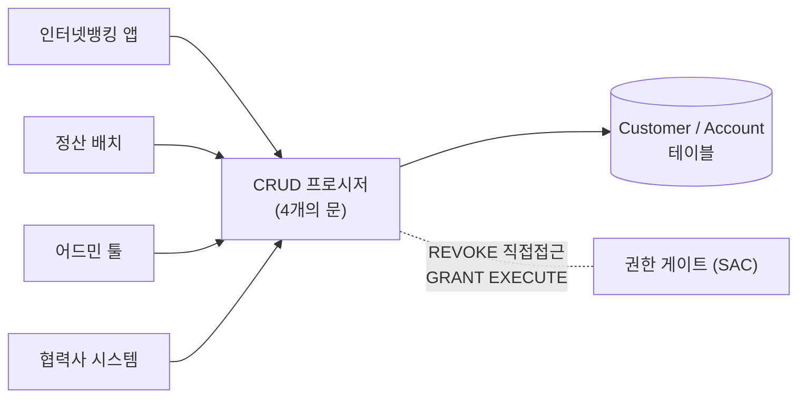

import { Callout, Steps, Step, Tabs, TabsList, TabsTrigger, TabsContent, Icon } from '@/components/writing-ui';

## 이게 뭔데

CRUD 메서드 추가. 이름이 절반은 설명해버리는데, 한 줄로 줄이면 이거다. **`Customer` 테이블 같은 비즈니스 엔티티 하나에 대해 생성(Create)·조회(Retrieve)·수정(Update)·삭제(Delete) 네 가지 저장 프로시저를 만들고, 그 테이블에 손대는 통로를 이 네 개 프로시저로만 제한하는 것.**

비유를 하나 들자면, 테이블을 사방이 뚫린 광장이 아니라 **문이 딱 네 개 달린 건물**로 만드는 일이다. 지금까지는 앱이든 배치든 리포트든 누구나 담을 넘어 들어와서 `Customer` 행을 직접 만지고 다녔다. 어디서 누가 어떻게 `Balance`를 깎았는지 추적이 안 된다. CRUD 메서드를 도입한다는 건, 담을 두르고 "들어올 거면 이 네 개 문 중 하나로만 들어와"라고 선언하는 거다. 문 안쪽에서 무슨 가구를 어떻게 재배치하든(테이블 구조를 바꾸든) 바깥에서 드나드는 사람은 문 모양만 그대로면 아무 영향이 없다.

<Callout type="info" title="한 줄 요약">
테이블에 직접 SQL을 꽂던 걸, 엔티티당 4개의 저장 프로시저 뒤로 숨긴다. 테이블 구조는 캡슐화되고, 앱은 "문"의 시그니처만 알면 된다.
</Callout>

## 언제 쓰나

책이 드는 동기는 셋이고, 셋 다 결국 한 단어로 수렴한다. **캡슐화.**

**1. 데이터 접근 캡슐화.** 지금 `Customer`를 만지는 SQL이 앱 코드 곳곳에 흩뿌려져 있다. 가입 화면에도 `INSERT INTO Customer`, 배치에도 `INSERT INTO Customer`, 누군가 급해서 짠 관리자 스크립트에도 또 `INSERT INTO Customer`. 컬럼 이름 하나가 바뀌면 이 흩뿌려진 SQL을 전부 사냥하러 다녀야 한다. 한 군데라도 놓치면 운영에서 터진다. CRUD 프로시저는 이 흩뿌려진 SQL을 **한 곳으로 모은다.**

**2. 테이블과 앱의 디커플링.** 이게 진짜 핵심이다. `Customer` 테이블을 쪼개든(Split Table), 컬럼을 옮기든(Move Column), 이름을 바꾸든(Rename Table) — 바깥 앱은 `ReadCustomer(customerId)`만 호출하면 된다. 안에서 무슨 일이 벌어지는지 모른다. 스키마 리팩토링의 충격을 프로시저 한 겹이 다 흡수해준다.

**3. 엔티티 단위 보안(SAC).** 진짜 `Customer`라는 비즈니스 엔티티는 한 테이블이 아닐 때가 많다. `Customer` + `CustomerAddress` + `CustomerContact` 세 테이블에 걸쳐 있다고 치자. 테이블 단위로 권한을 주면 "이 사용자는 `Customer`는 읽되 `CustomerContact`는 못 읽음" 같은 누더기가 된다. 대신 "`ReadCustomer` 프로시저 실행 권한"만 주면, 엔티티 하나에 대한 보안이 메서드 하나로 깔끔하게 정리된다.

### 시나리오: 이런 적 있을 거임

은행 시스템이다. `Account` 테이블이 있고, 잔액은 `Balance` 컬럼에 들어 있다. 처음엔 깔끔했다. 그런데 3년이 지나니까 이렇게 됐다.

- 인터넷뱅킹 앱이 `UPDATE Account SET Balance = Balance - ? WHERE id = ?`를 직접 쏜다.
- 야간 이자 정산 배치가 또 `UPDATE Account SET Balance = ...`를 직접 쏜다.
- CS팀이 쓰는 어드민 툴이 또 직접 쏜다.
- 한 협력사 정산 시스템이 link 걸어서 또 직접 쏜다.

어느 날 회계팀에서 "잔액이 1원씩 안 맞는 계좌가 있어요"라고 한다. 범인을 찾으려고 `Balance`를 건드리는 코드를 추적하는데, **네 개의 서로 다른 시스템, 다섯 개의 다른 언어**에 흩어져 있다. 어디서 반올림을 잘못했는지, 어디서 트랜잭션을 안 걸었는지, 전수조사를 해야 한다. 이게 "테이블을 광장으로 열어둔" 대가다.

만약 `Balance`를 만지는 유일한 통로가 `UpdateAccountBalance` 프로시저 하나였다면? 반올림 로직도, 트랜잭션 경계도, 음수 방지 체크도 **거기 한 곳에만** 있다. 범인 추적이 "다섯 개 시스템 전수조사"에서 "프로시저 한 개 코드 리뷰"로 줄어든다. 이게 캡슐화가 사주는 안심이다.

## 주의할 점

좋은 얘기만 했는데, 이 리팩토링은 호불호가 갈리는 데는 이유가 있다.

<Callout type="warning" title="공짜가 아니다 — 트레이드오프">
- **벤더 종속.** 저장 프로시저는 DB 벤더의 절차 언어로 짠다. Oracle PL/SQL과 Sybase/SQL Server T-SQL은 서로 호환이 안 된다. 한번 비즈니스 로직을 프로시저로 옮기면, DB를 갈아탈 때 그 로직을 통째로 다시 써야 한다. 이식성과 업그레이드 부담이 늘어난다.
- **부분/교차 조회에 약하다.** CRUD 프로시저는 "엔티티 한 개를 통째로" 다루는 데 최적화돼 있다. "고객 이름만 필요해" 같은 부분 조회나, "이 달 가입한 고객의 평균 보험료" 같은 엔티티를 넘나드는 리포트 쿼리에는 4개 프로시저로는 부족하다. 별도 Read 메서드를 자꾸 덧대게 된다.
- **로직이 두 군데로 쪼개진다.** 비즈니스 규칙 일부가 앱에, 일부가 프로시저에 들어가면 "이 검증은 어디서 하지?"가 매번 헷갈린다. 경계를 명확히 정하지 않으면 캡슐화하려다 더 산만해진다.
- **버전 관리·테스트가 번거롭다.** 앱 코드는 git에 들어가고 CI가 돌지만, DB 안의 프로시저는 따로 관리해주지 않으면 "지금 운영 DB에 깔린 프로시저가 정확히 어느 버전이냐"가 미궁에 빠진다.
</Callout>

이 마지막 항목이 2006년 책에선 큰 흠이었는데, **지금은 상당 부분 해결 가능하다.** 뒤에서 마이그레이션 도구로 프로시저를 버전 관리하는 법을 같이 본다.

## 이렇게 한다

핵심 흐름은 단순하다. (1) 다룰 엔티티와 원본 테이블을 식별하고, (2) 최소 4개 프로시저를 작성하고, (3) 명명 규칙을 하나 정해 일관되게 박고, (4) 앱의 하드코딩 SQL을 프로시저 호출로 교체한다. 마이그레이션할 데이터는 없다 — 테이블 구조는 안 바꾸고 접근 계층만 두르는 일이니까.

<Steps>
<Step title="엔티티와 원본 테이블 식별">
"`Customer`라는 엔티티가 실제로 어느 테이블들로 이뤄져 있나"를 먼저 정한다. 단일 테이블이면 쉽고, 여러 테이블에 걸친 복합 엔티티면 어디까지를 한 엔티티로 볼지 경계를 긋는다.
</Step>
<Step title="명명 규칙을 하나 정한다">
`CreateCustomer / ReadCustomer / UpdateCustomer / DeleteCustomer` 식의 동사-명사냐, `CustomerCreate / CustomerRead ...` 식의 명사-동사냐. 둘 중 뭘 쓰든 상관없는데, **하나를 정하면 끝까지 그것만** 쓴다. 명사-동사 방식은 객체 탐색기에서 같은 엔티티 프로시저가 알파벳순으로 모이는 이점이 있다.
</Step>
<Step title="최소 4개 프로시저 작성">
기본 키 기반 조회를 Read로 둔다. "이름으로 검색" 같은 다른 조회는 4개에 욱여넣지 말고 별도 Read 메서드로 보강한다(Add Read Method).
</Step>
<Step title="TDD로 테스트">
프로시저도 코드다. 각 프로시저에 대해 테스트를 먼저 짜고 구현한다. "잔액 음수 방지" 같은 규칙은 여기서 테스트로 못 박는다.
</Step>
<Step title="앱의 하드코딩 SQL을 프로시저 호출로 교체">
흩뿌려진 `INSERT/UPDATE/DELETE/SELECT`를 프로시저 호출로 바꾼다. JDBC라면 `prepareCall`, 다른 드라이버라면 그에 상응하는 콜.
</Step>
</Steps>

### 스키마 변경 (DDL)

`Customer` 엔티티의 CRUD 네 개를 PostgreSQL로 짠다고 하자. 함수/프로시저 골격은 이렇다.

```sql
-- 1) Create
CREATE OR REPLACE FUNCTION CreateCustomer(
  p_name        VARCHAR,
  p_email       VARCHAR,
  p_user_ctx    VARCHAR  -- 누가 만들었는지 감사용
) RETURNS BIGINT AS $func$
DECLARE
  v_id BIGINT;
BEGIN
  INSERT INTO Customer (name, email, user_created, creation_date)
  VALUES (p_name, p_email, p_user_ctx, now())
  RETURNING id INTO v_id;
  RETURN v_id;
END;
$func$ LANGUAGE plpgsql;

-- 2) Read (기본 키 기반)
CREATE OR REPLACE FUNCTION ReadCustomer(p_id BIGINT)
RETURNS SETOF Customer AS $func$
BEGIN
  RETURN QUERY SELECT * FROM Customer WHERE id = p_id;
END;
$func$ LANGUAGE plpgsql;

-- 3) Update
CREATE OR REPLACE FUNCTION UpdateCustomer(
  p_id       BIGINT,
  p_name     VARCHAR,
  p_email    VARCHAR,
  p_user_ctx VARCHAR
) RETURNS VOID AS $func$
BEGIN
  UPDATE Customer
     SET name = p_name,
         email = p_email,
         user_last_modified = p_user_ctx,
         last_modified_date = now()
   WHERE id = p_id;
END;
$func$ LANGUAGE plpgsql;

-- 4) Delete (소프트 삭제면 UPDATE로)
CREATE OR REPLACE FUNCTION DeleteCustomer(p_id BIGINT)
RETURNS VOID AS $func$
BEGIN
  DELETE FROM Customer WHERE id = p_id;
END;
$func$ LANGUAGE plpgsql;
```

그리고 **담을 두르는 게 핵심이다.** 프로시저만 만들고 테이블 직접 접근 권한을 그대로 두면, 아무도 문으로 안 다니고 여전히 담을 넘는다. 권한을 회수해서 문으로만 다니게 강제한다.

```sql
-- 앱 롤은 테이블 직접 접근 권한을 잃고,
REVOKE ALL ON Customer FROM app_role;

-- 프로시저 실행 권한만 받는다 (= 엔티티 단위 보안, SAC)
GRANT EXECUTE ON FUNCTION CreateCustomer(VARCHAR, VARCHAR, VARCHAR) TO app_role;
GRANT EXECUTE ON FUNCTION ReadCustomer(BIGINT)                      TO app_role;
GRANT EXECUTE ON FUNCTION UpdateCustomer(BIGINT, VARCHAR, VARCHAR, VARCHAR) TO app_role;
GRANT EXECUTE ON FUNCTION DeleteCustomer(BIGINT)                    TO app_role;
```

<Callout type="note" title="이 권한 회수가 SAC의 정체">
"엔티티 기반 보안 접근 제어"라는 말이 거창한데, 실체는 위의 GRANT/REVOKE 두 줄이다. 테이블 권한을 떼고 프로시저 실행 권한만 주는 순간, 보안 단위가 "테이블"에서 "엔티티(=프로시저 묶음)"로 올라간다. `Customer`가 세 테이블에 걸쳐 있어도 앱한테는 `ReadCustomer` 실행 권한 하나만 주면 되는 게 이래서다.
</Callout>

### 데이터 마이그레이션 (DML)

**없다.** 이 리팩토링은 테이블의 데이터를 한 줄도 안 옮긴다. 기존 테이블은 그대로 두고 접근 계층만 위에 얹는 일이라, "마이그레이션할 데이터는 없음"이 이 항목의 특징이다. 이 점이 다른 스키마 리팩토링과 결정적으로 다르다 — 위험이 데이터가 아니라 **권한과 호출부 교체**에 있다.

### 접근 프로그램(코드) 수정

앱 쪽에서 흩뿌려진 SQL을 프로시저 호출로 바꾼다. 자바 JDBC 기준 before/after다.

```java
// Before: 테이블에 직접 INSERT. 이런 코드가 앱 곳곳에 흩어져 있다.
String sql = "INSERT INTO Customer (name, email) VALUES (?, ?)";
try (PreparedStatement ps = conn.prepareStatement(sql,
        Statement.RETURN_GENERATED_KEYS)) {
    ps.setString(1, name);
    ps.setString(2, email);
    ps.executeUpdate();
    // ... 생성된 키 꺼내기
}
```

```java
// After: 프로시저 호출(prepareCall). 테이블이 어떻게 생겼는지 앱은 모른다.
String call = "{ ? = call CreateCustomer(?, ?, ?) }";
try (CallableStatement cs = conn.prepareCall(call)) {
    cs.registerOutParameter(1, Types.BIGINT);
    cs.setString(2, name);
    cs.setString(3, email);
    cs.setString(4, currentUserContext());  // 감사용 사용자 컨텍스트
    cs.execute();
    long newId = cs.getLong(1);
}
```

핵심은 `INSERT INTO Customer ...`라는 **테이블 지식이 앱에서 사라졌다**는 점이다. 이제 `Customer` 테이블을 쪼개든 컬럼 이름을 바꾸든, 고칠 곳은 `CreateCustomer` 프로시저 한 개뿐이다.

### 현대화: repository/service 계층이라는 등가물

여기서 솔직하게 짚자. 2006년에 이걸 저장 프로시저로 한 건, 그때 그게 캡슐화의 표준 수단이었기 때문이다. **2020년대에 "데이터 접근 캡슐화"의 기본값은 저장 프로시저가 아니라 애플리케이션 쪽 repository/service 계층이다.** 목적은 같다 — 테이블 지식을 한 겹 뒤로 숨기고, 흩뿌려진 SQL을 한 곳으로 모으는 것.

<Tabs defaultValue="repo">
<TabsList>
<TabsTrigger value="repo">Repository (앱 계층)</TabsTrigger>
<TabsTrigger value="sproc">Stored Procedure (DB 계층)</TabsTrigger>
</TabsList>
<TabsContent value="repo">

같은 캡슐화를 앱 코드에서 한다. `CustomerRepository`가 곧 "4개의 문"이다.

```typescript
// 테이블 지식이 이 클래스 안에만 갇힌다. 호출부는 메서드 시그니처만 안다.
export class CustomerRepository {
  async create(input: NewCustomer): Promise<bigint> { /* INSERT */ }
  async read(id: bigint): Promise<Customer | null> { /* SELECT by PK */ }
  async update(id: bigint, patch: CustomerPatch): Promise<void> { /* UPDATE */ }
  async delete(id: bigint): Promise<void> { /* DELETE or soft-delete */ }
}
```

비즈니스 규칙(잔액 음수 방지 등)은 그 위 `service` 계층에 둔다. git에 들어가고, CI가 돌고, 벤더 종속도 없다. 책이 말한 캡슐화/디커플링/엔티티 단위 보안을 **벤더 종속이라는 대가 없이** 거의 그대로 얻는다.

</TabsContent>
<TabsContent value="sproc">

여전히 저장 프로시저가 더 나은 경우가 있다.

- **여러 언어/시스템이 한 테이블을 공유**할 때. repository는 그 언어 안에서만 통하지만, 프로시저는 어느 클라이언트가 붙든 같은 문이다. 위 은행 시나리오처럼 4개 시스템이 한 `Account`를 만진다면, 앱 계층 캡슐화는 시스템마다 따로 만들어야 하지만 프로시저는 하나로 강제된다.
- **DB 레벨 권한 강제(SAC)**가 진짜로 필요할 때. 앱을 우회해 DB에 직접 붙는 경로가 있으면 repository는 무력하다. 테이블 권한을 회수하고 프로시저 실행 권한만 주는 건 DB만이 보장한다.
- 데이터에 **아주 가까이서 도는 무거운 집계/배치**. 네트워크 왕복을 줄이려고 로직을 DB로 내리는 게 합리적일 때.

</TabsContent>
</Tabs>

<Callout type="warning" title="저장 프로시저 호불호 — 결론부터">
"비즈니스 로직을 어디 둘 거냐"의 문제다. **둘 다 캡슐화 도구이고, 선택 기준은 '테이블에 직접 붙는 클라이언트가 하나뿐이냐 여럿이냐'**다. 단일 앱이 단독으로 소유한 테이블이면 repository로 충분하고, 벤더 종속도 없어 그쪽이 보통 낫다. 반대로 레거시 다수 시스템이 한 DB를 공유하는 SI 환경이면, 앱 계층 캡슐화는 시스템마다 새는 구멍이 생기므로 프로시저로 DB 레벨에서 문을 거는 게 안전하다.
</Callout>

### 프로시저도 버전 관리한다 (책의 약점 메우기)

책이 꼽은 흠 중 "프로시저 버전 관리가 번거롭다"는, 지금은 마이그레이션 도구로 메운다. CRUD 프로시저 정의를 **마이그레이션 파일로 git에 넣으면**, 테이블 스키마와 똑같이 버전이 추적되고 CI가 적용한다.

```sql
-- db/migration/V64__add_customer_crud.sql  (Flyway 예시)
CREATE OR REPLACE FUNCTION CreateCustomer(...) ...;
CREATE OR REPLACE FUNCTION ReadCustomer(...) ...;
-- ... Update, Delete
REVOKE ALL ON Customer FROM app_role;
GRANT EXECUTE ON FUNCTION ReadCustomer(BIGINT) TO app_role;
-- ...
```

Flyway/Liquibase(SQL DB), Alembic(파이썬)이 이 파일을 순서대로 적용하고 어느 버전까지 깔렸는지 추적한다. `CREATE OR REPLACE`로 짜두면 같은 프로시저의 다음 버전도 새 마이그레이션 파일로 덮어쓸 수 있어, "운영 DB에 깔린 프로시저가 어느 버전이냐"는 미궁이 사라진다. 2006년의 "프로시저는 관리가 안 된다"는 흠은 이걸로 대부분 무력화된다.

<Callout type="info" title="배포 시 expand-contract 한 스푼">
호출부 전체를 한 번에 프로시저 호출로 바꾸기 무서우면, 단계를 쪼갠다. (1) 프로시저를 먼저 배포해 테이블과 공존시키고(expand) → (2) 앱을 점진적으로 프로시저 호출로 옮기고 → (3) 모든 호출이 프로시저로 넘어간 걸 확인한 뒤에야 테이블 직접 권한을 회수한다(contract). 권한 회수가 마지막인 게 핵심 — 먼저 회수하면 미처 안 옮긴 호출부가 즉사한다.
</Callout>

### 전체 그림



문 없이 네 시스템이 테이블에 제각각 화살을 꽂던 광장이, 프로시저라는 단일 관문 뒤로 정리됐다. 권한 게이트가 "담을 넘는" 경로를 막는다.

## 정리

CRUD 메서드 추가는 작은 리팩토링이지만 사고방식을 바꾼다. **테이블은 광장이 아니라 문이 달린 건물이어야 한다는 것** — 누구나 직접 만지면 추적도 보안도 불가능하니, 통로를 좁히고 그 통로 한 곳에 규칙을 모은다.

> **흩뿌려진 SQL을 한 곳으로 모으면, 테이블 변경의 충격도 한 곳에서 흡수된다.**

2006년 책은 이걸 저장 프로시저로 풀었다. 목적(캡슐화·디커플링·엔티티 단위 보안)은 지금도 100% 유효하고, 수단은 둘로 갈린다. 단일 앱이 소유한 테이블이면 repository/service 계층이 벤더 종속 없이 같은 일을 해준다. 레거시 다수 시스템이 한 DB를 공유하면, 프로시저로 DB 레벨에 문을 걸어야 새는 구멍이 막힌다. 어느 쪽이든 핵심 질문은 똑같다 — **"이 테이블에 직접 붙는 입구가 지금 몇 개고, 그걸 몇 개로 줄일 수 있나?"**
