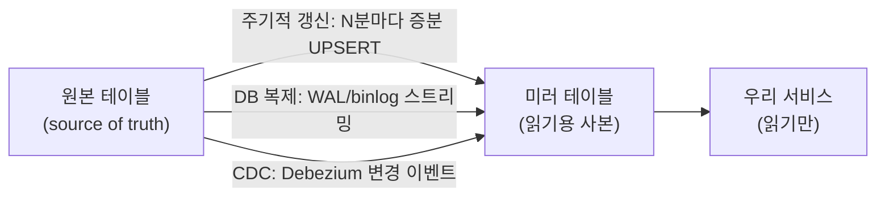

import { Callout, Steps, Step, Tabs, TabsList, TabsTrigger, TabsContent, Icon } from '@/components/writing-ui';

## 이게 뭔데

미러 테이블 추가. 정의는 한 줄이다. **다른 DB에 있는 테이블을, 내 DB에 똑같이 복제해 두고 그걸 읽는 것**이다. 원본은 저쪽에 그대로 있고, 내 쪽엔 사본(mirror)이 하나 생긴다.

비유를 하나 들자. 회사 본사 자료실이 지하철로 40분 거리에 있다고 치자. 매번 서류 한 장 보겠다고 왕복 80분을 쓸 순 없다. 그래서 자주 보는 서류는 복사해서 내 책상 서랍에 둔다. 이제 서류는 손만 뻗으면 본다. 빠르고, 본사 자료실이 점검으로 문 닫아도 내 서랍 사본은 멀쩡하다.

대신 함정이 하나 생긴다. **본사 원본이 어제 수정됐는데, 내 서랍 사본은 지난주 버전이라는 것.** 이게 미러 테이블의 전부다. 빠름과 가용성을 얻는 대신, "내가 보는 게 최신이 아닐 수 있다"는 불안을 떠안는다.

<Callout type="info" title="한 줄 요약">
원격 테이블을 로컬에 복제해 읽기를 가속하고 원본 DB 장애의 버퍼를 만든다. 대가는 단 하나, stale data(오래된 데이터). 그래서 이 리팩토링의 본체는 "복사"가 아니라 "동기화 전략"이다.
</Callout>

## 언제 쓰나

책이 드는 동기는 셋이고, 셋 다 현실에서 자주 만난다.

**1. 원격 DB가 느릴 때.** 우리 은행 시스템에서 `Customer` 테이블이 별도의 마스터 DB에 산다고 치자. 고객 정보를 보려면 매번 그 원격 DB로 네트워크를 타고 건너가야 하고, 그 DB는 다른 팀들도 두들겨대서 항상 바쁘다. 화면 하나 띄우는 데 고객 조회가 200ms씩 걸린다. 근데 우리 서비스는 `Customer`를 거의 **읽기만** 한다. 그럼 로컬에 사본을 두고 거기서 읽는 게 압도적으로 싸다.

**2. 원본 DB가 죽어도 버텨야 할 때.** 원격 마스터 DB가 점검에 들어가거나 장애가 나면, 그 테이블에 의존하는 우리 서비스도 같이 멈춘다. 근데 로컬 미러가 있으면, 원본이 한두 시간 누워 있어도 우리는 (조금 오래된) 사본으로 계속 읽기를 서빙할 수 있다. 미러는 일종의 **장애 버퍼**다.

**3. 여러 프로그램이 같은 조회를 반복할 때.** 정산 배치, 리포트, 알림 발송 세 군데가 전부 같은 `Account` 데이터를 원격에서 긁어 간다. 매번 똑같은 데이터를 똑같은 원격 DB에서. 이걸 로컬 미러 하나로 모아두면, 셋 다 로컬에서 읽고 원격 DB의 부하도 셋만큼 줄어든다.

공통점이 보일 거다. **읽기는 많고, 쓰기는 그 DB 바깥(원본 쪽)에서 일어나며, 약간의 지연을 데이터가 용인한다.** 이 셋이 맞으면 미러가 답이다.

### 시나리오: 이런 적 있을 거임

내가 맡은 건 사내 보험 영업 대시보드였다. 화면마다 고객 이름, 등급, 가입 상품을 띄워야 하는데 그 `Customer`/`Policy` 데이터는 전부 **코어뱅킹 DB**에 산다. 그 DB는 우리 손이 닿는 물건이 아니다. 다른 팀이, 정확히는 다른 부서가, 정확히는 외주 SI가 관리하는, 건드리면 시말서 쓰는 신성한 DB다.

처음엔 화면 뜰 때마다 코어뱅킹으로 직접 쿼리를 날렸다. 데모에선 잘 됐다. 그러다 영업 마감일에 영업사원 200명이 동시에 대시보드를 열었다. 코어뱅킹 DBA한테서 전화가 왔다. "님들 뭔데 우리 DB를 이렇게 긁어요?" 우리 대시보드 트래픽이 코어뱅킹의 슬로우 쿼리 1등에 올라 있었다.

그래서 했다. `Customer`, `Policy`를 우리 DB에 **미러**로 떴다. 매일 새벽 한 번, 그리고 영업시간엔 5분마다 변경분만 당겨오기로. 이제 대시보드는 우리 로컬 미러만 읽는다. 코어뱅킹은 평화를 되찾았고, 우리 화면은 빨라졌다.

그러고 한 달 뒤. 영업사원이 슬랙에 글을 올렸다. "고객 등급이 어제 VIP로 올라갔는데 대시보드엔 아직 일반으로 떠요. 버그 아니에요?" 버그 아니다. 그게 **stale data**다. 미러를 떠본 사람은 누구나 한 번씩 이 슬랙을 받는다.

## 주의할 점

<Callout type="warning" title="미러의 본질적 위험은 단 하나: stale data">
미러 테이블의 모든 고통은 결국 **"원본은 바뀌었는데 미러는 아직"** 이 한 줄로 수렴한다.

- **원본 ≠ 미러 시점에 무슨 일이 벌어지나**: 영업사원은 한 시간 전 등급으로 고객을 응대하고, 정산 배치는 어제 잔액으로 이자를 계산한다. 화면 두 개가 각자 다른 시점의 미러를 보면 사용자 입장에선 "데이터가 따로 논다."
- **미러가 늘수록 동기화 부담이 곱으로 는다**: `Customer` 하나 미러 떴다가, `Account`도 뜨고, `Policy`도 뜨면, 이제 동기화 파이프라인을 세 개 굴려야 한다. 하나가 밀리면 그 테이블만 과거에 산다.
- **양방향이 되는 순간 지옥문이 열린다**: 미러를 읽기 전용으로 두면 그나마 단순하다. 근데 "미러에서도 수정 좀 하자"가 되면 원본과 미러 양쪽이 같은 행을 동시에 바꾸는 **쓰기 충돌(write conflict)** 이 생기고, 누가 이기냐를 정해야 한다(다중마스터의 영원한 숙제).

그래서 미러를 뜨기 전에 반드시 답해야 하는 질문은 이거다. **"이 데이터, 몇 초/몇 분 늦어도 괜찮은가?"** 잔액 이체 화면이면 안 괜찮다. 영업 대시보드 등급 표시면 5분쯤 괜찮다. 이 허용 지연(staleness tolerance)을 정하는 게 동기화 전략 설계의 출발점이다.
</Callout>

핵심을 한 번 더 박아두자. **미러는 절대 진실의 원천(source of truth)이 아니다.** 진실은 항상 원본에 있고, 미러는 "원본의 한 시점 스냅샷"일 뿐이다. 미러를 진실처럼 믿고 거기서 돈 계산을 하면, 그 순간 stale data가 회계 오류로 둔갑한다.

## 이렇게 한다

세 단계다. **(1) 미러를 만들고 → (2) 초기 데이터를 채우고 → (3) 동기화 전략을 건다.** 그리고 앱이 원본 대신 미러를 읽도록 연결을 돌린다.

<Steps>
<Step title="미러 위치와 범위 결정">
어느 DB에, 무슨 테이블을, 어디까지 미러로 둘지 정한다. 보통 "내 서비스가 자주 읽고, 약간 늦어도 되는" 테이블이 후보다. 통째로 뜰지(`Customer` 전체), 일부 컬럼·일부 행만 뜰지도 여기서 정한다. 영업 대시보드엔 고객 주민번호 같은 건 필요 없으니 안 가져온다.
</Step>
<Step title="미러 테이블 생성과 초기 적재">
로컬에 같은 모양의 테이블을 만들고, 원본 데이터를 **전량 한 번 복사**해 시작점을 맞춘다. 이걸 안 하면 동기화가 "변경분만" 당겨올 때 과거 데이터에 구멍이 난다.
</Step>
<Step title="동기화 전략 선택">
미러의 핵심. 주기적 갱신 / DB 복제 / 트리거·CDC 중 데이터의 허용 지연에 맞는 걸 고른다. 5분 stale 허용이면 주기적 갱신으로 충분하고, 초 단위 최신성이 필요하면 복제나 CDC로 간다.
</Step>
<Step title="앱 연결을 미러로 전환">
마지막으로 앱이 원격 원본 대신 로컬 미러를 읽도록 연결 대상(DataSource)을 바꾼다. 코드가 보던 테이블 이름이 같다면 연결 속성만 갈아끼우면 된다.
</Step>
</Steps>

### 스키마: 미러 테이블 만들고 채우기

원본 `Customer`(코어뱅킹 DB)를 우리 로컬 DB에 미러로 뜬다고 하자.

```sql
-- 1) 로컬 미러 테이블 생성 (필요한 컬럼만)
CREATE TABLE CustomerMirror (
    CustomerID   BIGINT      NOT NULL PRIMARY KEY,
    Name         VARCHAR(200) NOT NULL,
    Grade        VARCHAR(20)  NOT NULL,
    BranchCode   VARCHAR(10),
    -- 미러가 "언제 기준 데이터인지" 추적하는 메타 컬럼: stale 디버깅의 생명줄
    SourceUpdatedAt TIMESTAMP NOT NULL,   -- 원본 행의 최종 변경 시각
    MirroredAt      TIMESTAMP NOT NULL    -- 미러에 반영한 시각
);

-- 2) 초기 전량 적재 (원본 → 미러, 1회성)
--    실무에선 DB link / 외부 테이블 / ETL 도구로 당겨온다.
INSERT INTO CustomerMirror (CustomerID, Name, Grade, BranchCode, SourceUpdatedAt, MirroredAt)
SELECT CustomerID, Name, Grade, BranchCode, UpdatedAt, NOW()
FROM remote.Customer;
```

`SourceUpdatedAt`/`MirroredAt` 두 컬럼이 보일 거다. 이게 미러를 운영할 때 목숨줄이다. "지금 이 미러가 몇 시 기준이냐"를 답할 수 없으면 stale 신고가 들어와도 디버깅을 못 한다. **미러엔 항상 시점 메타데이터를 박아라.**

<Callout type="note" title="2006년 손코딩 vs 지금">
책은 이 INSERT/UPDATE를 번호 매긴 SQL과 트리거로 손코딩한다. 골격은 똑같다. 다만 요즘은 이 "초기 적재 + 변경분 동기화"를 Flyway/Liquibase 마이그레이션으로 버전 관리하고, 실제 데이터 이동은 ETL 도구나 DB 자체 복제 기능, CDC로 처리한다. SQL을 직접 짜는 양이 훨씬 줄었다는 게 차이다.
</Callout>

### 동기화: 세 갈래

미러의 본체. 허용 지연에 따라 셋 중 하나(또는 조합)를 고른다.

<Tabs defaultValue="periodic">
<TabsList>
<TabsTrigger value="periodic">주기적 갱신</TabsTrigger>
<TabsTrigger value="replication">DB 복제</TabsTrigger>
<TabsTrigger value="cdc">트리거 / CDC</TabsTrigger>
</TabsList>

<TabsContent value="periodic">

**주기적 갱신(Periodic Refresh).** 가장 단순하고 가장 흔하다. N분/N시간마다 변경분을 당겨와 미러를 갱신한다. 우리 영업 대시보드가 쓴 방식이다.

```sql
-- 마지막 동기화 이후 바뀐 원본 행만 가져와 UPSERT
-- (원본에 UpdatedAt 컬럼이 있어야 "변경분만" 효율적으로 긁는다)
MERGE INTO CustomerMirror m
USING (
    SELECT CustomerID, Name, Grade, BranchCode, UpdatedAt
    FROM remote.Customer
    WHERE UpdatedAt > :last_sync_at      -- 증분(incremental) 동기화
) src
ON (m.CustomerID = src.CustomerID)
WHEN MATCHED THEN UPDATE SET
    m.Name = src.Name, m.Grade = src.Grade,
    m.BranchCode = src.BranchCode,
    m.SourceUpdatedAt = src.UpdatedAt, m.MirroredAt = NOW()
WHEN NOT MATCHED THEN INSERT
    (CustomerID, Name, Grade, BranchCode, SourceUpdatedAt, MirroredAt)
    VALUES (src.CustomerID, src.Name, src.Grade, src.BranchCode, src.UpdatedAt, NOW());
```

- **장점**: 구현이 쉽고, 원본 DB에 부하가 한 번에 몰리지 않으며, 스케줄러(cron, 워크플로 도구) 하나면 된다.
- **단점**: 갱신 주기만큼은 **무조건 stale**. 5분 주기면 최악의 경우 5분 묵은 데이터를 본다.
- **삭제 처리 주의**: `UpdatedAt > :last_sync_at`은 INSERT/UPDATE만 잡는다. 원본에서 **삭제된 행**은 안 잡혀서 미러에 유령으로 남는다. 원본이 소프트 삭제(`isDeleted` 플래그)를 쓰면 그 플래그도 같이 당겨와 처리해야 한다.

머신러닝도, CDC도 필요 없이 "5분 늦어도 되는" 데이터엔 이게 정답이다. 괜히 복제·CDC로 오버엔지니어링하지 마라.

</TabsContent>

<TabsContent value="replication">

**DB 복제(Replication).** DB 엔진이 제공하는 복제 기능에 동기화를 통째로 위임한다. 사실상 현대 실무에서 미러 테이블의 가장 흔한 형태가 바로 이거다 — **read replica**.

```text
[Primary DB]  --- 트랜잭션 로그(WAL/binlog) 스트리밍 --->  [Read Replica]
   (쓰기 전용)                                              (읽기 전용 미러)
```

- **PostgreSQL** — streaming replication / logical replication으로 읽기 복제본을 띄운다.
- **MySQL** — binlog 기반 replica.
- **클라우드 매니지드** — RDS/Aurora read replica처럼 버튼 몇 번이면 복제본이 뜬다.

미러가 "테이블 하나"가 아니라 "DB 전체"라면 사실상 read replica를 쓰는 게 가장 깔끔하다. 동기화를 직접 안 짜도 엔진이 트랜잭션 로그를 흘려보내 준다.

<Callout type="warning" title="복제도 stale를 못 피한다 (복제 지연)">
read replica도 마법이 아니다. primary의 쓰기가 replica에 도달하는 데 **복제 지연(replication lag)** 이 있다. 평소엔 밀리초지만, 대량 쓰기가 몰리면 초 단위로 벌어진다. "방금 내가 쓴 걸 바로 다시 읽었는데 없다"는 read-after-write 불일치가 여기서 나온다. 방금 쓴 직후의 읽기는 primary로 보내는 식의 라우팅이 필요할 때가 있다.
</Callout>

- **장점**: 동기화를 엔진이 해주니 최신성이 (보통) 초 이하로 좋다. 운영 부담이 적다.
- **단점**: 보통 DB 전체 단위라 "테이블 하나만"엔 과하다. 그리고 기본적으로 **읽기 전용**이라 미러에서 쓰려면 다른 그림이 필요하다.

</TabsContent>

<TabsContent value="cdc">

**트리거 / CDC(Change Data Capture).** 원본이 바뀌는 순간을 잡아 미러로 즉시 흘려보낸다. 가장 최신성이 좋지만 가장 손이 많이 간다.

옛날 방식은 원본 테이블에 트리거를 거는 거였다.

```sql
-- 원본 DB에 트리거를 걸어 변경을 미러로 전파 (책의 고전적 방식)
CREATE TRIGGER trg_customer_mirror
AFTER INSERT OR UPDATE OR DELETE ON Customer
FOR EACH ROW
EXECUTE FUNCTION propagate_to_mirror();   -- 변경분을 미러 DB로 push
```

하지만 트리거는 **원본 DB에 직접 부담을 주고**(쓰기마다 트리거가 돈다), 원본을 우리가 못 건드리는 경우(코어뱅킹!)엔 아예 못 쓴다. 그래서 현대 실무는 **CDC**로 옮겨갔다.

```text
[원본 DB] --binlog/WAL--> [Debezium] --> [Kafka] --> [컨슈머] --> [미러 테이블]
  (트리거 없이 트랜잭션 로그만 읽어 변경 이벤트로 스트리밍)
```

- **Debezium** — 원본의 트랜잭션 로그를 읽어 INSERT/UPDATE/DELETE를 이벤트로 뽑아낸다. **원본 스키마를 안 건드린다**는 게 트리거 대비 결정적 장점. DELETE도 이벤트로 잡히니 주기적 갱신의 "유령 행" 문제도 없다.
- **Outbox 패턴** — 원본 앱이 비즈니스 트랜잭션과 같은 커밋으로 outbox 테이블에 변경 이벤트를 적고, 그걸 CDC가 흘려보낸다. 마이크로서비스에서 데이터 소유권을 지키면서 미러를 만드는 정석.

- **장점**: 거의 실시간, DELETE까지 정확히 반영.
- **단점**: Kafka/커넥터 등 인프라가 붙어 운영 복잡도가 확 오른다. 미러 테이블 하나 뜨자고 들이기엔 과한 경우가 많다.

</TabsContent>
</Tabs>

### 그림으로 보는 세 전략



### 앱: 연결 대상을 미러로

마지막으로 앱이 원격 원본 대신 로컬 미러를 읽게 바꾼다. 잘 분리돼 있으면 연결 속성 교체만으로 끝난다.

```typescript
// Before: 매 조회를 원격 코어뱅킹으로 (느리고 그쪽 DB를 두들김)
const customer = await coreBankingDb
  .getRepository(Customer)
  .findOneBy({ customerId });

// After: 로컬 미러에서 읽는다 (빠르고, 코어뱅킹 부하 0)
const customer = await localDb
  .getRepository(CustomerMirror)
  .findOneBy({ customerId });
```

<Callout type="success" title="미러 위에 얹으면 좋은 것들">
미러를 떴으면 로컬에서 마음껏 최적화할 수 있다. 원본 DB는 못 건드려도 내 미러는 내 거니까.

- **인덱스/부분 인덱스** — 우리 화면 쿼리 패턴에 맞춰 미러에만 인덱스를 건다. 예: VIP 고객만 자주 본다면 `WHERE Grade = 'VIP'` 부분 인덱스(partial index)로 가볍게.
- **머티리얼라이즈드 뷰** — 미러를 한 번 더 집계해 대시보드용 사전 계산 테이블로. 미러가 곧 "내가 통제하는 데이터"가 되니 자유도가 높다.
- **캐시와의 관계** — 미러는 결국 "DB 단의 캐시"다. 더 짧은 지연이 필요하면 그 위에 Redis 같은 인메모리 캐시를 한 겹 더 얹는 식으로 staleness를 단계별로 관리한다.
</Callout>

## 정리

미러 테이블 추가는 단순한 리팩토링이다. **원격에 있는 걸 로컬에 복사해서, 거기서 읽는다.** 이걸로 읽기는 빨라지고, 원본 DB의 부하는 줄고, 원본이 죽어도 버틸 버퍼가 생긴다.

> **미러의 본체는 복사가 아니라 동기화 전략이다. 그리고 그 전략을 고르는 기준은 "이 데이터가 몇 분 늦어도 되는가"다.**

stale data는 미러의 버그가 아니라 **계약 조건**이다. 5분 늦어도 되는 영업 대시보드엔 주기적 갱신이면 충분하고, DB 전체를 늦지 않게 읽고 싶으면 read replica가, 초 단위 최신성에 DELETE까지 정확해야 하면 Debezium 같은 CDC가 답이다. 무엇을 고르든, 미러에 시점 메타데이터(`SourceUpdatedAt`)를 박아두고, **이 사본은 진실이 아니라 진실의 그림자**라는 사실을 잊지 마라. 그림자 보고 돈 계산하면 안 된다.
