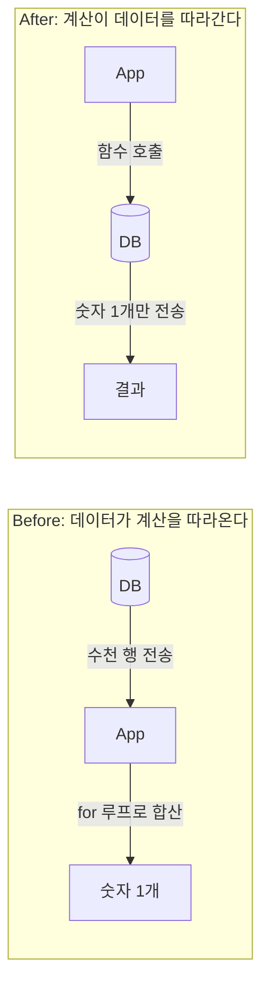

## 이게 뭔데

Introduce Calculation Method. 이름은 길어 보여도, 하는 일은 하나다. **DB에 저장된 데이터로 하는 계산을, 데이터를 앱으로 다 끌어온 뒤가 아니라 DB 안에서 끝내고 결과만 받아오게 만드는 것**이다. 보통 저장 함수(Stored Function) 하나로 구현한다.

비유를 하나 들자. 동네 정육점에서 고기 1kg을 사는데, 가게에서 썰어주겠다는 걸 마다하고 "아니요, 통째로 주세요. 제가 집에서 썰게요" 하는 거다. 그래놓고 집에 와서 칼 갈고, 도마 꺼내고, 한 시간 동안 낑낑댄다. 정육점에는 전문 칼과 저울과 숙련된 손이 있다. 계산도 똑같다. 합계를 내려고 행 50만 개를 앱으로 다 실어 나른 다음 `for` 루프로 더하는 게, 바로 통째로 받아와서 집에서 써는 짓이다.

`SUM(amount)` 한 줄이면 DB가 그 자리에서 더해서 숫자 하나만 돌려준다. 50만 행이 네트워크를 건널 필요가 없다. 이게 계산 메서드 도입의 본질이다. **계산을 데이터 옆으로 보내는 것.**

<Callout type="info" title="한 줄 요약">
계산이 데이터를 따라가야지, 데이터가 계산을 따라오면 안 된다. 더하기는 DB가 데이터 위에서 하게 하고, 앱은 결과 숫자 하나만 받는다.
</Callout>

## 언제 쓰나

책이 드는 동기는 네 가지인데, 결국 두 덩어리로 묶인다.

**첫째, 성능.** 대량 데이터를 계산하겠다고 네트워크로 다 끌어오면, DB가 일하는 시간보다 데이터를 실어 나르는 왕복 시간이 더 든다. 계산식 자체는 `SUM`이든 가중평균이든 DB가 인덱스 타고 순식간에 끝낼 수 있는데, 그 앞에 "행 전부 전송"이라는 통행료가 붙는 거다. 계산을 DB 안으로 밀어넣으면 결과 한 줄만 건너오니 이 통행료가 사라진다.

**둘째, 중복 제거.** 같은 계산을 화면 세 군데, 배치 두 개, 리포트 한 개가 제각각 구현해놨다고 치자. "고객 계좌 총액"을 구하는 로직이 자바에 한 번, 파이썬에 한 번, 어느 리포트 툴 안에 또 한 번. 이게 미묘하게 다르면 같은 고객인데 화면마다 잔액이 다르게 뜬다. 계산을 저장 함수 하나로 추출해두면, 모두가 그 한 곳을 호출한다. 정의가 하나니까 답도 하나다.

나머지 둘(계산 컬럼 지원, 계산 컬럼을 함수로 대체)도 결국 "계산 정의를 한 군데로 모은다"는 같은 줄기다. 미리 저장해둔 계산 컬럼이 자꾸 틀어지면, 컬럼을 지우고 저장 함수가 그때그때 계산하게 바꾸는 식이다.

### 시나리오: 이런 적 있을 거임

은행 시스템이라고 하자. 화면에 고객의 "총 자산"을 띄워야 한다. 한 고객이 여러 `Account`를 갖고, 각 계좌마다 `Balance`가 있고, 거기에 보유 중인 `Policy`(보험/투자 상품) 평가액까지 합쳐야 한다. 신입 때의 나는 너무나 자연스럽게 이렇게 짰다.

```typescript
// Before: 계좌를 다 긁어와서 앱에서 더한다
const accounts = await accountRepo.find({ where: { customerId } });

let total = 0;
for (const acc of accounts) {
  const policies = await policyRepo.find({ where: { accountId: acc.id } });
  total += acc.balance;
  for (const p of policies) {
    total += p.currentValue; // 여기서 또 한 겹
  }
}
```

VIP 고객 화면을 열기 전까지는 멀쩡했다. 계좌 3개에 상품 2개씩이면 행 몇 개 안 되니까. 문제는 법인 고객 화면을 연 날 터졌다. 계좌 수백 개, 상품 수천 개. 그 수천 행이 통째로 앱으로 건너오고, 거기에 N+1까지 얹혀서 화면 하나 뜨는 데 8초가 걸렸다. 정작 우리가 원한 건 **숫자 딱 하나**였는데 말이다.

여기서 필요한 게 계산 메서드다. "총 자산"이라는 계산 자체를 DB 안으로 내려보내면, 수천 행은 DB 안에서만 돌아다니고 네트워크는 숫자 하나만 건넌다.

## 주의할 점

좋은 도구가 다 그렇듯, 이것도 과하면 독이 된다.

<Callout type="warning" title="DB에 로직을 너무 많이 욱여넣지 마라">
계산 메서드의 함정은 "DB가 다 해주니까 편하네?" 하고 비즈니스 로직을 전부 저장 함수로 밀어넣기 시작하는 순간 온다. DB는 보통 **수평 확장이 가장 어려운 컴포넌트**다. 앱 서버는 인스턴스 늘리면 그만이지만, DB는 그게 안 된다. 무거운 계산을 죄다 DB에 몰면, 모든 트래픽이 그 한 점으로 수렴해서 DB가 통째로 병목이 된다. 그러니 "데이터를 많이 훑어야 하는 집계성 계산"은 DB로 내리되, "복잡한 도메인 분기 로직"까지 저장 함수로 끌고 들어가진 마라. 둘은 다른 짐승이다.
</Callout>

여기에 책이 짚는 또 하나의 함정이 있는데, 실무에서 진짜 사람 잡는 건 이쪽이다. **앱마다 계산이 미묘하게 다를 수 있다.** "총 자산"이라는 같은 이름의 계산이, 영업팀 화면에선 해지 예정 상품을 빼고, 회계팀 리포트에선 포함하고, 모바일 앱에선 외화 자산을 환산해서 더한다. 이걸 모르고 "공통이니까 하나로 합치자" 하고 저장 함수 하나로 통일해버리면, 누군가의 숫자가 조용히 틀어진다.

<Callout type="error" title="합치기 전에 반드시 물어봐라">
계산 로직을 추출해 통일하기 전에, 그 계산을 쓰는 모든 이해관계자에게 "당신이 말하는 총액 정의가 정확히 뭐냐"를 확인해라. 답이 다르면 그건 같은 함수가 아니라 **다른 함수 두 개**다. 파라미터로 차이를 흡수할지(`includePending` 플래그 같은), 아예 분리할지 정하는 건 그다음이다. 이 협의를 건너뛰고 합친 통일은, 통일이 아니라 묻혀 있는 버그다.
</Callout>

마지막으로 사소하지만 흔한 것. 저장 함수는 **DB 벤더 종속적**이다. 오라클 PL/SQL과 포스트그레스 PL/pgSQL은 문법이 다르다. 멀티 DB를 지원해야 하거나 벤더 교체 가능성이 있으면, 함수에 로직을 깊게 묻기 전에 이식 부담을 계산에 넣어둬라.

## 이렇게 한다

핵심은 세 단계다. 계산을 DB 안 함수로 옮기고, 데이터는 건드릴 게 없고, 앱은 함수를 호출하게 바꾼다. 마이그레이션할 데이터가 없다는 게 이 리팩토링의 장점이다 — 스키마를 비트는 게 아니라 계산이 사는 위치만 옮기는 거니까.

<Steps>
<Step title="계산 정의를 확정한다">
가장 먼저 할 일은 코드가 아니라 합의다. "고객 계좌 총액"이 정확히 무엇을 더하고 무엇을 빼는지, 어떤 화면/리포트가 이걸 쓰는지, 정의가 같은지 다른지를 못 박는다. 위에서 말한 협의가 여기 들어간다. 정의가 하나로 모이면 함수 하나, 갈리면 파라미터나 별도 함수로 간다.
</Step>
<Step title="저장 함수를 작성하고 테스트한다">
계산을 DB 안 함수로 옮긴다. 입력은 식별자(예: 고객 ID), 출력은 결과 값 하나다. 작성 못지않게 중요한 게 회귀 테스트다 — 옮기기 전과 후의 결과 숫자가 모든 케이스에서 똑같아야 한다.
</Step>
<Step title="기존 호출부를 함수 호출로 교체한다">
앱의 계산 로직, 그리고 같은 계산을 품고 있던 다른 저장 프로시저들을 이 함수 호출로 바꾼다. 한 번에 다 갈아엎지 말고, 한 호출부씩 바꿔가며 결과가 같은지 비교한 뒤 옛 코드를 지운다.
</Step>
</Steps>

### 스키마 변경 — 저장 함수 만들기

은행 도메인 그대로, "고객의 계좌+상품 총액"을 구하는 함수다. 책의 `getCustomerAccountTotal`을 현대 PostgreSQL 문법으로 옮겼다.

```sql
-- After: 계산이 데이터 옆에서 돈다
CREATE OR REPLACE FUNCTION get_customer_account_total(p_customer_id BIGINT)
RETURNS NUMERIC AS $func$
  SELECT
    COALESCE(SUM(a.balance), 0)
    + COALESCE((
        SELECT SUM(p.current_value)
        FROM policy p
        JOIN account a2 ON a2.id = p.account_id
        WHERE a2.customer_id = p_customer_id
      ), 0)
  FROM account a
  WHERE a.customer_id = p_customer_id;
$func$ LANGUAGE sql STABLE;
```

여기서 `STABLE`은 "같은 입력에 같은 출력, 단 DB를 읽긴 한다"는 표시다. 옵티마이저가 호출을 묶거나 최적화할 여지를 준다. 외부 부작용 없는 순수 계산이면 이런 표식을 정확히 달아주는 게 좋다.

데이터 마이그레이션은 없다. 행을 옮기지도 컬럼을 바꾸지도 않았다. 계산이 사는 위치만 자바에서 DB로 이사했을 뿐이다.

### 데이터 마이그레이션 — 없음 (하지만 검증은 한다)

옮길 데이터는 없지만, 옮긴 계산이 옛 계산과 같은 답을 내는지는 **반드시** 확인해야 한다. 옛 로직과 새 함수를 나란히 돌려 결과를 맞춰보는 게 가장 안전하다.

```sql
-- 옛 계산(앱)과 새 함수(DB)의 결과가 어긋나는 고객을 찾는다
SELECT c.id, get_customer_account_total(c.id) AS db_total
FROM customer c
WHERE c.id IN (/* 검증용 표본 고객 */);
-- 이 db_total을, 옛 앱 로직이 내던 값과 한 명씩 대조한다
```

표본 한두 명만 맞춰보고 넘어가면, 위에서 말한 "정의가 미묘하게 다른" 케이스를 놓친다. 외화 보유 고객, 해지 예정 상품을 가진 고객처럼 **경계 케이스를 일부러 골라** 대조해라.

### 접근 프로그램 수정 — 앱 로직을 함수 호출로

이제 앱이다. 행을 다 긁어와 더하던 자바/타입스크립트 로직을, 함수 호출 한 줄로 바꾼다.

```typescript
// After: 행을 끌어오지 않는다. 숫자 하나만 받는다
const [{ total }] = await db.query<{ total: string }>(
  `SELECT get_customer_account_total($1) AS total`,
  [customerId],
);

const customerTotal = Number(total);
```

수천 행이 건너오던 자리에, 이제 숫자 하나가 건너온다. N+1도 같이 사라졌다 — 루프 자체가 없어졌으니까.

ORM을 쓴다면 raw 쿼리나 함수 호출 매핑으로 부른다. 같은 계산을 품고 있던 다른 저장 프로시저들도 이 함수를 호출하도록 바꾼다. 계산 정의가 한 곳에 모인다는 게 이 리팩토링의 진짜 수확이다.

### 현대화 — 푸시다운, 그리고 함수 너머의 선택지

2006년 책은 "저장 함수를 손으로 짜라"고 한다. 골격은 지금도 유효한데, 현대엔 같은 원리("계산을 데이터 옆으로")를 푸는 방법이 더 다양해졌다.

이 리팩토링이 사실 **연산 푸시다운(pushdown)** 의 한 사례라는 걸 알면 시야가 넓어진다. 저장 함수만이 답이 아니다. 쿼리 자체에 집계를 박아 내려보내도 같은 효과다.

```sql
-- 저장 함수 없이도, 집계를 쿼리에 박아 DB가 계산하게 하면 그게 푸시다운이다
SELECT a.customer_id, SUM(a.balance) AS total
FROM account a
WHERE a.customer_id = $1
GROUP BY a.customer_id;
```

선택지를 상황별로 정리하면 이렇다.

<Tabs defaultValue="func">
<TabsList>
<TabsTrigger value="func">저장 함수</TabsTrigger>
<TabsTrigger value="view">머티리얼라이즈드 뷰</TabsTrigger>
<TabsTrigger value="generated">Generated Column</TabsTrigger>
</TabsList>
<TabsContent value="func">
계산이 **재사용**되고 여러 호출부가 같은 정의를 공유해야 할 때. 책의 기본 처방. 정의가 한 곳에 모이는 게 핵심 가치다. 단, 벤더 종속·DB 부하를 감수해야 한다.
</TabsContent>
<TabsContent value="view">
계산이 **무겁고 자주 읽히지만 매번 최신일 필요는 없을** 때. 머티리얼라이즈드 뷰로 결과를 미리 구워두고 주기적으로 갱신한다. 읽기는 인덱스 조회만큼 싸지고, 대신 약간 오래된(stale) 값을 감수한다. 야간 배치로 도는 집계 리포트에 잘 맞는다.
</TabsContent>
<TabsContent value="generated">
한 행 안에서 끝나는 **간단한 파생 값**일 때(예: `price * quantity`). PostgreSQL의 `GENERATED ALWAYS AS ... STORED` 컬럼이면 INSERT/UPDATE 시 DB가 알아서 채운다. 단, 여러 테이블을 가로지르는 집계는 generated column으로 못 한다 — 그땐 함수나 뷰다.
</TabsContent>
</Tabs>

운영 중인 큰 테이블에 머티리얼라이즈드 뷰 인덱스를 새로 만들어야 한다면, 잠금으로 서비스가 멈추지 않게 PostgreSQL의 `CREATE INDEX CONCURRENTLY`를 쓰는 식으로 무중단을 챙긴다. 계산을 내려보내는 것과, 그걸 운영 중에 무중단으로 적용하는 건 별개의 문제니까 둘 다 챙겨야 한다.

흐름을 그림으로 보면 차이가 분명하다.



## 정리

Introduce Calculation Method는 단순한 리팩토링인데, 그 밑에 깔린 원리가 좋다.

> **계산은 데이터가 사는 곳에서 하는 게 싸다.**

행을 통째로 끌어와 앱에서 더하지 말고, 더하기를 DB에 시키고 결과만 받아라. 그게 네트워크 통행료를 없애고, 흩어진 계산 정의를 한 곳으로 모은다. 저장 함수든, 집계 쿼리든, 머티리얼라이즈드 뷰든 — 형태는 상황 따라 골라도, 방향은 늘 하나다. 계산을 데이터 옆으로.

대신 두 가지만 기억하면 된다. DB에 짐을 너무 몰면 확장 안 되는 그 한 점이 병목이 되니 **집계는 내리되 도메인 분기는 적당히**, 그리고 "공통 계산"이라는 말은 종종 거짓말이니 **합치기 전에 정의가 정말 같은지 이해관계자에게 물어볼 것**. 이 둘만 지키면, 계산 메서드는 느린 화면을 숫자 하나짜리 호출로 바꿔주는 깔끔한 도구다.
