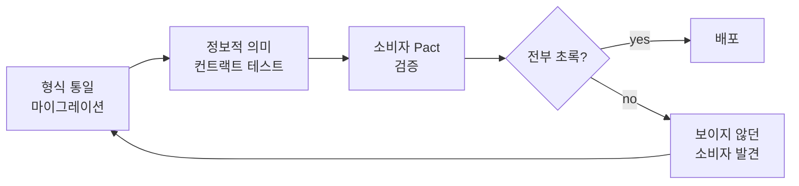

## 이게 뭔데

"리팩토링은 동작을 바꾸지 않으면서 구조를 바꾸는 것"이라는 정의, 다들 한 번쯤 외워봤을 거다. 코드 리팩토링이면 그걸로 충분하다. 함수 쪼개고, 변수 이름 바꾸고, 테스트 초록불이면 끝.

그런데 데이터베이스는 두 종류의 동작을 동시에 들고 있다. 하나는 **그 데이터가 무슨 정보냐**(전화번호 `(416) 555-1234`가 진짜로 가리키는 그 번호), 다른 하나는 **그 데이터로 뭘 하느냐**(저장 프로시저가 잔액을 어떻게 계산하느냐). 이 둘을 책에서는 각각 **정보적 의미(informational semantics)**와 **행위적 의미(behavioral semantics)**라고 부른다. 데이터베이스 리팩토링이 "의미를 바꾸지 않는다"고 할 때, 사실은 이 두 개를 **둘 다** 안 바꾼다는 뜻이다.

<Callout type="info" title="한 줄 요약">
DB 리팩토링은 두 가지 의미를 보존해야 한다. **정보적 의미** = 저장된 값이 가리키는 정보 내용, **행위적 의미** = 그 스키마로 동작하는 블랙박스 기능. 형식을 바꿔도 정보는 같아야 하고, 구조를 바꿔도 기능은 같아야 한다.
</Callout>

## 시나리오: 전화번호 형식이 제각각인 그 테이블

이런 적 있을 거임. 은행 `Customer` 테이블에 전화번호 컬럼이 하나 있다. 그런데 데이터를 까보면 가관이다.

```text
Customer.Phone
--------------
(416) 555-1234
905.555.1212
4165559876
416-555-0001
+1 (416) 555-2222
```

지점마다, 입력 폼마다, 데이터를 밀어 넣은 배치 잡마다 형식이 다르다. 누가 봐도 같은 "전화번호"인데 모양이 다섯 가지다. 그래서 이걸로 뭔가 하려는 코드는 전부 지옥을 맛본다.

```sql
-- "이 번호로 등록된 고객 찾기" — 형식이 제각각이라 이게 안 먹힌다
SELECT * FROM Customer WHERE Phone = '4165551234';
-- (416) 555-1234 로 저장된 그 사람은 안 잡힌다. 같은 사람인데.
```

중복 탐지도 안 되고, 외부 SMS 게이트웨이에 넘기기 전에 매번 정규화 코드를 거쳐야 하고, 신입이 들어올 때마다 "전화번호는 어떤 형식으로 저장하나요?"라고 물으면 아무도 자신 있게 대답을 못 한다. 그래서 우리는 결심한다. **형식을 하나로 통일하자.** 책에서 `Introduce Common Format`이라고 부르는 리팩토링이다.

```sql
-- 저장 형식을 숫자만 남기는 E.164 풍으로 통일
UPDATE Customer
SET Phone = REGEXP_REPLACE(Phone, '[^0-9]', '', 'g');

-- 결과
-- (416) 555-1234  ->  4165551234
-- 905.555.1212    ->  9055551212
-- 416-555-0001    ->  4165550001
```

이제 작업이 단순해졌다. 비교도 되고, 중복도 잡히고, 외부로 넘기기도 쉽다. **그런데 여기서 중요한 질문 하나.** 우리가 `(416) 555-1234`를 `4165551234`로 바꿨는데, **이 고객의 전화번호라는 정보 자체가 바뀐 건가?** 아니다. 둘은 정확히 같은 번호를 가리킨다. 점, 괄호, 하이픈은 사람이 읽기 편하라고 끼워 넣은 장식일 뿐, **정보 내용(information content)**은 한 글자도 안 변했다.

이게 바로 **정보적 의미를 보존했다**는 말의 뜻이다.

<Callout type="success" title="핵심: 형식 ≠ 정보">
전화번호의 **정보**는 "어느 회선으로 연결되는가"다. 괄호와 점은 그 정보가 아니라 표현(presentation)이다. 형식을 통일해도 정보 내용이 동일하면, 정보적 의미는 보존된 거다. 이 데이터를 소비하는 클라이언트(화면, 보고서, 외부 API) 입장에서 "그 번호는 여전히 그 번호"여야 한다.
</Callout>

## 저장 형식과 표시 형식은 다른 레이어다

여기서 거의 모두가 한 번쯤 걸려 넘어지는 지점. "형식을 `4165551234`로 통일했다"고 하면 꼭 누군가 이렇게 반응한다.

> "그럼 이제 화면에 전화번호가 `4165551234`로 보이겠네? 그거 보기 안 좋은데?"

아니다. **저장 형식(storage format)과 표시 형식(display format)은 완전히 다른 레이어다.** DB에는 정규화된 `4165551234`를 저장하되, 화면에 뿌릴 때는 `(416) 555-1234`로 포맷팅하면 된다. 표시는 프레젠테이션 계층의 책임이지, 저장 계층이 떠안을 일이 아니다.

```typescript
// 저장은 숫자만. 표시는 그때그때 포맷팅.
function formatPhone(raw: string): string {
  // raw = "4165551234"
  const m = raw.match(/^(\d{3})(\d{3})(\d{4})$/);
  if (!m) return raw;            // 모르는 형식은 원본 그대로
  return `(${m[1]}) ${m[2]}-${m[3]}`;
}

// DB에서 꺼낸 값
const stored = "4165551234";
// 화면에는 보기 좋게
formatPhone(stored); // -> "(416) 555-1234"
```

이렇게 분리해두면 얻는 게 많다. 표시 형식을 나중에 `+1 416-555-1234`로 바꾸고 싶어도 저장 데이터는 건드릴 필요가 없다. 국제번호를 다루게 되면 저장은 E.164(`+14165551234`)로 가고, 화면은 지역별로 다르게 포맷팅하면 된다. **하나의 진실(정규화된 저장값) + 여러 개의 표현(상황별 포맷)** 이게 거의 모든 "형식 통일" 리팩토링의 정석 구도다.

<Callout type="note" title="돈도 똑같다">
이건 전화번호만의 얘기가 아니다. 금액을 \$1,234.50 같은 문자열로 저장해두면 정렬·합산이 지옥이 된다. 저장은 정수 센트(`123450`)나 `DECIMAL`로 하고, 표시할 때 \$1,234.50으로 포맷팅하는 게 맞다. 날짜도 마찬가지. 저장은 UTC `timestamptz`, 표시는 사용자 타임존. **"저장은 기계가 다루기 좋게, 표시는 사람이 보기 좋게"** 가 원칙이다.
</Callout>

## 그런데 "정보가 안 바뀌었다"를 어떻게 증명하나

여기서 책의 가장 정직한 대목이 나온다. 저자(Ambler & Sadalage)는 Martin Fowler의 **"관찰 가능한 행위(observable behavior)"** 개념을 빌려와 이렇게 고백한다.

> 우리가 의미를 미묘하게 바꾸지 않았다고 **완전히 확신할 수는 없다.** 할 수 있는 최선은 충분한 테스트를 작성하고 돌려서, 의미가 바뀌지 않았음을 검증하는 것뿐이다.

이게 무슨 소리냐면. 전화번호 형식을 바꾸는 게 "안전해 보이는" 리팩토링 같지만, 세상 어딘가에는 **그 형식에 의존하던 코드**가 있을 수 있다는 거다. 예를 들어 어떤 월말 보고서가 이런 식으로 짜여 있었다고 치자.

```sql
-- 옛날 누군가 짠 보고서: 괄호로 시작하는 번호만 "검증된 번호"로 취급
SELECT * FROM Customer
WHERE Phone LIKE '(%';
```

말도 안 되는 가정 같지만, 레거시에는 이런 게 진짜로 있다. 형식을 `4165551234`로 통일한 순간, 이 보고서는 **모든 행을 잃는다.** 우리가 보기엔 "장식만 떼어낸" 무해한 변경이었는데, 그 장식에 의존하던 누군가에게는 정보적 의미가 바뀐 거다.

그래서 결론은 좀 허무하면서도 정직하다. **"의미가 안 바뀌었다"는 증명 불가능하고, 우리가 할 수 있는 건 충분한 테스트를 깔아서 반증을 못 찾았다고 말하는 것뿐**이다. 리팩토링의 안전성은 수학적 보장이 아니라, **테스트 커버리지에 비례하는 자신감**이다.

<Callout type="warning" title="뭐가 문제냐면">
"형식만 바꾸는 거니까 안전하지" 하는 직감이 가장 위험하다. 데이터의 표면 형식에 누가 의존하고 있는지 우리는 전부 알 수 없다. 보고서, 외부 연동, 정규식 검증, 엑셀 매크로... 보이지 않는 소비자가 늘 있다. 그래서 **변경 전에 그 컬럼을 읽는 코드를 최대한 긁어모아 테스트로 박아두는 것**이 리팩토링의 절반이다.
</Callout>

## 현대 실무: 컨트랙트 테스트로 소비자를 못 박아라

2006년 책은 이걸 "테스트를 충분히 짜라"는 원칙으로만 말한다. 지금은 그 원칙을 실어 나르는 구체적 장치가 있다. **컨트랙트 테스트(contract test)**다.

핵심 아이디어는 이렇다. 어떤 데이터(컬럼, API 응답)에 의존하는 소비자가 있다면, 그 소비자가 **기대하는 형태를 명시적인 계약으로 박아두고**, 공급자 쪽 변경이 그 계약을 깨면 CI에서 빨간불이 뜨게 한다. 보이지 않던 소비자를 보이게 만드는 장치다.

```typescript
// "전화번호 컬럼의 계약": 소비자가 의존하는 불변식을 테스트로 고정
describe('Customer.Phone 정보적 의미 계약', () => {
  it('정규화 전후로 같은 번호는 같은 정보를 가리켜야 한다', () => {
    const before = ['(416) 555-1234', '905.555.1212', '416-555-0001'];
    const after  = before.map(normalizePhone);

    // 정보 내용(=숫자 시퀀스)은 보존되어야 한다
    expect(after).toEqual(['4165551234', '9055551212', '4165550001']);
  });

  it('표시 형식은 저장값과 무관하게 복원 가능해야 한다', () => {
    expect(formatPhone('4165551234')).toBe('(416) 555-1234');
  });

  it('보고서 소비자: 괄호 형식에 의존하던 쿼리를 마이그레이션했는지', () => {
    // 옛 보고서가 LIKE '(%' 에 의존했다면, 새 규칙으로 교체됐는지 검증
    expect(legacyReportFinds('4165551234')).toBe(true);
  });
});
```

마이크로서비스라면 Pact 같은 도구로 **소비자 주도 컨트랙트(consumer-driven contract)**를 쓴다. 데이터를 소비하는 쪽이 "나는 이런 형태를 기대한다"는 계약 파일을 만들고, 공급자 CI가 그 계약들을 전부 통과해야만 배포된다. DB 컬럼 형식을 바꾸는 변경이 어떤 다운스트림을 깨는지를, 배포 전에 알게 된다.

여기에 마이그레이션 도구(Flyway, Liquibase, Alembic, Prisma Migrate 등)를 얹으면 그림이 완성된다. 형식 통일 `UPDATE`를 버전 매겨진 마이그레이션으로 박고, 그 마이그레이션이 통과한 뒤 컨트랙트 테스트가 돌게 파이프라인을 묶는다.



`F`로 빠지는 화살표가 핵심이다. 컨트랙트 테스트의 진짜 가치는 통과시키는 게 아니라, **"형식만 바꾼 줄 알았는데 이 보고서가 깨지네"를 운영 사고가 아니라 CI에서 만나게 하는 것**이다.

## 다른 한쪽: 행위적 의미

지금까지는 정보적 의미(저장된 값이 가리키는 정보) 얘기였다. 이제 나머지 절반, **행위적 의미**다. 이건 "데이터가 무슨 정보냐"가 아니라 **"그 스키마로 동작하는 기능이 무엇이냐"**에 관한 거다. Fowler식으로 말하면 **블랙박스 동작**을 유지하는 것. 안에서 구조를 어떻게 뜯어고치든, 밖에서 호출했을 때 나오는 결과가 같아야 한다.

은행 시나리오로 보자. `Account.Balance`(잔액)를 계산하는 로직이, 어쩌다 보니 저장 프로시저 세 군데에 **복붙**되어 있다고 치자.

```sql
-- sp_GenerateStatement 안에도
SET @balance = @deposits - @withdrawals - @fees + @interest;

-- sp_CheckOverdraft 안에도 (똑같은 계산)
SET @balance = @deposits - @withdrawals - @fees + @interest;

-- sp_MonthlyReport 안에도 (또 똑같은 계산)
SET @balance = @deposits - @withdrawals - @fees + @interest;
```

이게 왜 문제냐면, 이자 정책이 바뀌어서 계산식에 한 항을 더해야 하는 날, 세 군데를 다 찾아 고쳐야 하고, 하나라도 빠뜨리면 보고서마다 잔액이 달라지는 미스터리가 시작된다. 그래서 책의 `Introduce Calculation Method` 리팩토링을 적용한다. **계산 로직을 한 곳으로 모으고, 나머지는 그걸 호출하게** 바꾼다.

```sql
-- 계산을 한 곳에 모은다
CREATE FUNCTION fn_CalculateBalance(
  @deposits MONEY, @withdrawals MONEY, @fees MONEY, @interest MONEY
) RETURNS MONEY AS
BEGIN
  RETURN @deposits - @withdrawals - @fees + @interest;
END;

-- 세 프로시저는 이제 이걸 호출만 한다
SET @balance = dbo.fn_CalculateBalance(@deposits, @withdrawals, @fees, @interest);
```

자, 여기서 질문. 우리가 계산식을 함수로 추출하고 세 군데를 호출로 바꿨는데, **각 프로시저가 내놓는 잔액 결과가 달라졌나?** 아니어야 한다. 전체 로직은 동일하고, **계산이 한 곳에 모였을 뿐**이다. 입력이 같으면 출력이 같다. 이게 **행위적 의미를 보존했다**는 말의 뜻이다.

<Callout type="success" title="핵심: 구조 ≠ 기능">
중복을 함수로 빼는 건 **구조**의 변경이지 **기능**의 변경이 아니다. 블랙박스 입출력이 동일하면 행위적 의미는 보존된 거다. 정보적 의미가 "값이 같은가"라면, 행위적 의미는 "기능이 같은가"다.
</Callout>

행위적 의미를 보존했는지 검증하는 방법도 결국 같다. **테스트.** 추출 전후로 동일한 입력에 동일한 출력이 나오는지 본다. 가장 안전한 건 리팩토링 **전에** 현재 동작을 그대로 캡처하는 **특성화 테스트(characterization test)**를 깔아두는 거다. 레거시 계산이 미묘하게 틀려 있더라도(예: 반올림 버그), 일단 "현재 동작"을 박제해두고 추출한 뒤, 결과가 안 변하면 "행위는 보존됐다"고 말할 수 있다. 버그를 고치는 건 그다음, **별개의** 변경으로.

<Callout type="warning" title="리팩토링과 버그 수정을 섞지 마라">
계산 로직을 추출하는 김에 "어차피 손대는데 이 반올림 버그도 고치자"는 유혹이 온다. 참아라. 추출(행위 보존)과 버그 수정(행위 변경)을 한 커밋에 섞으면, 테스트가 깨졌을 때 "추출을 잘못한 건지 버그를 고쳐서 그런 건지"를 분간할 수 없다. 행위를 보존하는 변경과 바꾸는 변경은 항상 분리하자.
</Callout>

## 두 의미, 한 장의 표

정리하면 데이터베이스 리팩토링은 늘 이 두 축을 **동시에** 지킨다.

```text
                  정보적 의미                  행위적 의미
질문         "값이 가리키는 정보가 같나?"   "기능의 입출력이 같나?"
대상         저장된 데이터 값               스키마로 동작하는 코드
대표 예      형식 통일(전화번호/금액/날짜)  계산 로직 추출/저장프로시저 통합
보존 방법    저장-표시 분리 + 형식 무손실    구조만 바꾸고 입출력 고정
검증         컨트랙트 테스트(소비자 계약)   특성화 테스트(입출력 캡처)
못 지키면    "같은 번호인데 조회가 안 됨"   "보고서마다 잔액이 다름"
```

대부분의 리팩토링은 이 중 하나가 주연이고 다른 하나는 따라온다. 형식 통일은 정보적 의미가 주연이지만, 그 컬럼을 읽는 프로시저들이 깨지지 않아야 하니 행위적 의미도 챙겨야 한다. 계산 추출은 행위적 의미가 주연이지만, 추출 과정에서 잔액 값 자체가 틀어지면 정보적 의미가 깨진 거다. **둘은 늘 함께 다닌다.**

## 정리

데이터베이스 리팩토링이 "의미를 바꾸지 않는다"고 할 때, 그 의미는 두 겹이다.

> **정보적 의미** = 저장된 값이 가리키는 정보. 형식을 바꿔도 그 번호는 그 번호여야 한다.
> **행위적 의미** = 그 스키마로 동작하는 블랙박스 기능. 구조를 바꿔도 입출력은 같아야 한다.

전화번호 `(416) 555-1234`를 `4165551234`로 정규화하는 건 정보적 의미를 보존한 형식 통일이고, 저장은 정규화값으로 두되 표시는 보기 좋게 포맷팅하면 된다. 세 군데 복붙된 잔액 계산을 함수 하나로 모으는 건 행위적 의미를 보존한 구조 변경이고, 입출력만 그대로면 안에서 뭘 하든 상관없다.

그리고 가장 정직한 결론. **둘 다 "안 바뀌었음"을 완벽히 증명할 길은 없다.** 보이지 않는 소비자, 형식에 기댄 레거시 보고서, 미묘한 반올림이 어디에 숨어 있는지 우리는 전부 알 수 없다. 그래서 할 수 있는 건 충분한 테스트 — 정보적 의미엔 컨트랙트 테스트, 행위적 의미엔 특성화 테스트 — 를 깔아두고, **반증을 못 찾았다는 자신감**으로 배포하는 것뿐이다. 리팩토링의 안전은 보장이 아니라 커버리지에서 온다.
