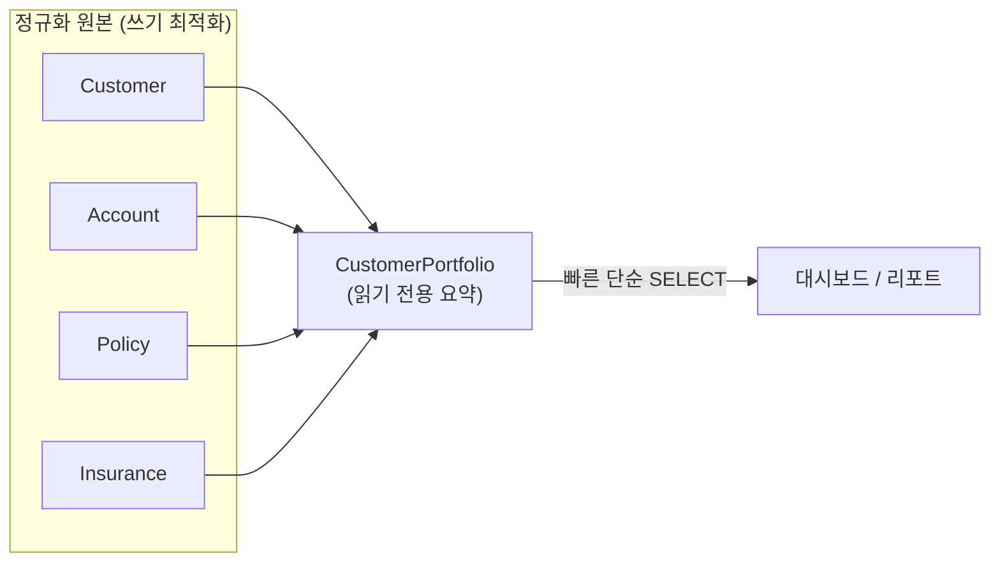

import { Callout, CodeBlock, Steps, Step, Tabs, TabsList, TabsTrigger, TabsContent, Icon } from '@/components/writing-ui';

## 이게 뭔데

**여러 테이블에서 매번 비싸게 조인해서 뽑던 결과를, 미리 한 번 계산해서 평평한 테이블 하나에 박아두고, 거기선 읽기만 하게 만드는 것.** 그게 Introduce Read-Only Table이다.

비유하자면 반찬가게다. 손님이 올 때마다 멸치 볶고 시금치 무치고 계란말이 부치면 주문이 밀린다. 그래서 아침에 미리 다 만들어서 반찬통에 담아 진열대에 올려둔다. 손님은 그냥 집어 가면 된다. 대신 진열대 반찬은 **아침에 만든 것**이라, 점심쯤 되면 살짝 식어 있다. 그게 이 리팩토링의 본질이다. 빠른 대신, 약간 오래된 데이터(stale data)를 파는 거다.

은행 도메인으로 옮겨보자. `Customer`, `Account`, `Balance`, `Policy`, `Insurance` 다섯 테이블을 조인해서 "고객별 총 보유 자산 + 보험 가입 현황" 리포트를 뽑는다고 치자. 이걸 조회할 때마다 다섯 테이블을 묶고 집계하면 DB가 비명을 지른다. 그래서 `CustomerPortfolio`라는 **요약 테이블**을 하나 만들어, 고객 한 명당 한 줄로 미리 말아둔다. 리포트는 이 한 줄짜리를 그냥 SELECT 한다. 끝.

<Callout type="info" title="한 줄 요약">
"매번 조인해서 만들던 비싼 결과"를 "미리 만들어 둔 평평한 읽기 전용 테이블"로 바꾼다. 속도를 사는 대신, 데이터가 약간 stale해지는 걸 받아들인다.
</Callout>

## 언제 쓰나

원본 정규화 스키마는 **쓰기에 최적화**돼 있다. 중복 없이 깔끔하게 쪼개져 있어서 INSERT/UPDATE가 안전하고 정합성이 좋다. 문제는 읽기다. 사람이 보고 싶은 "리포트"는 보통 여러 테이블에 흩어진 조각을 다 끌어모아 집계한 모양이라, 정규화된 테이블에서 뽑으려면 매번 무거운 조인이 필요하다. 쓰기에 좋은 모양과 읽기에 좋은 모양이 **다르다**는 거, 이게 전부의 출발점이다.

이런 냄새가 나면 이 리팩토링이 답일 확률이 높다.

- **조인이 너무 많아 느리다.** 리포트 한 장 뽑는 데 대여섯 테이블을 묶고 GROUP BY를 돌린다. 그것도 같은 모양으로 하루에 수천 번.
- **요약 데이터를 반복해서 만든다.** 여러 화면, 여러 배치, 여러 팀이 사실상 같은 집계를 각자 다시 계산하고 있다.
- **다른 DB/서비스 의존이 부담된다.** 매번 원격 DB를 조인하느니, 필요한 모양으로 한 번 복사해두고 로컬에서 읽고 싶다.
- **고도로 정규화돼 있어서 사람이 못 읽는다.** 테이블이 너무 잘게 쪼개져서, 분석가가 직접 쿼리를 짜다가 길을 잃는다. 역정규화된 평평한 테이블 하나 깔아주면 탐색이 쉬워진다.
- **조회만 시키고 싶다.** 리포트 사용자한테 원본을 직접 만지게 하긴 싫다. 읽기 전용 사본을 주면 보안 경계도 자연스럽게 생긴다.

핵심 공통점은 하나다. **읽기 패턴이 고정돼 있고, 자주 반복되고, 비싸다.** 매번 다른 임의 쿼리가 날아오는 OLTP 트랜잭션 화면이라면 이 리팩토링은 오버다. "정해진 모양의 무거운 조회"가 반복될 때만 의미가 있다.

### 시나리오: 이런 적 있을 거임

월요일 아침. 경영진 대시보드가 "고객 포트폴리오 현황"을 띄운다. 이 한 장을 그리려고 백엔드는 이런 쿼리를 던진다.

```sql
SELECT
  c.customer_id,
  c.name,
  SUM(a.balance)              AS total_balance,
  COUNT(DISTINCT p.policy_id) AS policy_count,
  SUM(i.coverage_amount)      AS total_coverage
FROM Customer c
LEFT JOIN Account   a ON a.customer_id  = c.customer_id
LEFT JOIN Policy    p ON p.customer_id  = c.customer_id
LEFT JOIN Insurance i ON i.policy_id    = p.policy_id
GROUP BY c.customer_id, c.name;
```

고객 600만 명, 계좌 2천만 개, 정책 천만 개. 이 조인+집계가 한 방에 수 초씩 걸린다. 대시보드는 5분마다 새로고침되고, 임원 30명이 동시에 보고 있다. APM에 빨간 줄이 쭉 올라가고, 그 시간엔 정작 실제 고객 거래 트랜잭션까지 같이 느려진다. 리포트 한 장이 운영 DB를 잡아먹는 거다.

여기서 "쿼리를 더 최적화하자"는 답이 아니다. 이미 인덱스도 다 탔고, 옵티마이저도 할 만큼 했다. 진짜 문제는 **같은 무거운 계산을 5분마다 600만 번 반복**하고 있다는 거다. 데이터가 5분마다 그렇게 크게 바뀌지도 않는데 말이지.

그래서 결정한다. "이거, 미리 만들어두자." 고객 한 명당 한 줄로 요약한 `CustomerPortfolio`를 만들고, 대시보드는 거기서 그냥 `SELECT * WHERE ...`만 한다. 5분짜리 조인이 밀리초짜리 단순 조회가 된다.



## 주의할 점

공짜는 없다. 이 리팩토링이 파는 속도의 대가는 **stale data**, 딱 하나다. 근데 이게 생각보다 사람을 자주 문다.

<Callout type="warning" title="stale data를 사용자가 알게 하라">
읽기 전용 테이블은 원본의 **사본**이다. 원본이 방금 바뀌어도, 요약 테이블이 갱신되기 전까진 옛날 값을 보여준다. 갱신 주기가 1시간이면 최대 1시간 묵은 데이터다.

진짜 사고는 사용자가 이걸 **모를 때** 난다. 콜센터 직원이 요약 테이블 기준으로 "고객님 잔액 0원이세요"라고 했는데 실은 5분 전에 입금됐다거나, 정산 담당이 stale한 합계로 마감을 돌린다거나. 그러니 (1) 이 데이터가 얼마나 묵었는지 사용자가 받아들일 수 있는지 먼저 합의하고, (2) 화면에 "마지막 갱신: HH:MM" 같은 갱신 시각을 박아두는 게 안전하다. 돈이 걸린 정확한 잔액 같은 건 절대 stale 사본으로 보여주면 안 된다.
</Callout>

추가로 챙길 트레이드오프 둘:

- **이중 진실의 위험.** 요약 테이블을 만들어 놓고 거기에 "쓰기"까지 허용하면, 원본과 사본 두 곳에 진실이 생긴다. 둘이 어긋나는 순간 어느 쪽이 맞는지 아무도 모른다. 그래서 이 테이블은 **반드시 읽기 전용으로 강제**해야 한다(아래에서 다룬다). 단방향: 원본 → 요약.
- **동기화 비용.** 요약 테이블도 누군가는 채워줘야 한다. 배치든, 트리거든, materialized view 리프레시든, CDC 파이프라인이든, 갱신 메커니즘 자체가 추가 운영 부담이다. 요약 테이블이 늘수록 이 부담은 곱으로 는다.

## 이렇게 한다

크게 세 덩어리다. (1) 테이블을 만들고 초기 적재, (2) 갱신 전략 결정, (3) 읽기 전용으로 강제 + 앱이 거기서 읽게 바꾸기. 현대 도구는 (1)과 (2)를 통째로 묶어주는 게 많으니, 손으로 하는 골격부터 보고 도구로 올라가자.

<Steps>
<Step title="요약 테이블 생성 + 초기 적재">

먼저 원하는 "평평한" 모양으로 테이블을 만들고, `INSERT ... SELECT`로 한 번 채운다.

```sql
-- 1) 읽기 전용 요약 테이블
CREATE TABLE CustomerPortfolio (
  customer_id     BIGINT PRIMARY KEY,
  name            VARCHAR(200) NOT NULL,
  total_balance   DECIMAL(18,2) NOT NULL,
  policy_count    INT NOT NULL,
  total_coverage  DECIMAL(18,2) NOT NULL,
  refreshed_at    TIMESTAMP NOT NULL   -- stale 판단용. 매우 중요.
);

-- 2) 원본을 조인·집계해 한 번에 적재
INSERT INTO CustomerPortfolio
SELECT
  c.customer_id, c.name,
  COALESCE(SUM(a.balance), 0),
  COUNT(DISTINCT p.policy_id),
  COALESCE(SUM(i.coverage_amount), 0),
  NOW()
FROM Customer c
LEFT JOIN Account   a ON a.customer_id = c.customer_id
LEFT JOIN Policy    p ON p.customer_id = c.customer_id
LEFT JOIN Insurance i ON i.policy_id   = p.policy_id
GROUP BY c.customer_id, c.name;
```

`refreshed_at`을 꼭 넣자. 이 한 컬럼이 "데이터 얼마나 묵었냐"를 화면과 모니터링에 알려주는 단 하나의 근거다. 마이그레이션 스크립트는 Flyway/Liquibase(JVM)나 Alembic(Python) 같은 도구로 버전 관리해서, `V70__create_customer_portfolio.sql` 같은 식으로 올려야 나중에 환경별로 재현된다.

</Step>
<Step title="적재(갱신) 전략 결정 — 실시간 vs 배치">

책이 나누는 두 갈래가 그대로 살아 있다. 신선도 요구와 부하 사이의 선택이다.

- **배치 적재** — 야간/주기 배치로 통째로 다시 말거나 변경분만 갱신. stale 허용폭이 넓을 때(일/시간 단위). 구현 단순, 부하 예측 쉬움.
- **실시간 적재** — 원본이 바뀌는 즉시 요약도 갱신. stale을 거의 0으로. 대신 쓰기 경로에 부하·복잡도가 붙음.

방식별 구현 옵션을 표 대신 묶어서 보면 이렇다.

<Tabs defaultValue="batch">
<TabsList>
<TabsTrigger value="batch">주기적 갱신 (배치)</TabsTrigger>
<TabsTrigger value="mv">Materialized View</TabsTrigger>
<TabsTrigger value="trigger">트리거 동기화</TabsTrigger>
<TabsTrigger value="cdc">CDC read store</TabsTrigger>
</TabsList>

<TabsContent value="batch">

가장 단순. 스케줄러가 주기적으로 요약을 다시 만든다. 통째로 갈아엎으면 일관성은 좋은데 무겁고, 변경분만 반영하면 가볍지만 누락 위험이 있다. stale 허용폭이 넉넉한 리포트라면 이걸로 충분하다.

```sql
-- 변경분만 반영하는 UPSERT (PostgreSQL)
INSERT INTO CustomerPortfolio AS cp
SELECT c.customer_id, c.name,
       COALESCE(SUM(a.balance),0),
       COUNT(DISTINCT p.policy_id),
       COALESCE(SUM(i.coverage_amount),0),
       NOW()
FROM Customer c
LEFT JOIN Account   a ON a.customer_id = c.customer_id
LEFT JOIN Policy    p ON p.customer_id = c.customer_id
LEFT JOIN Insurance i ON i.policy_id   = p.policy_id
WHERE c.updated_at >= NOW() - INTERVAL '10 minutes'  -- 최근 변경분만
GROUP BY c.customer_id, c.name
ON CONFLICT (customer_id) DO UPDATE SET
  total_balance  = EXCLUDED.total_balance,
  policy_count   = EXCLUDED.policy_count,
  total_coverage = EXCLUDED.total_coverage,
  refreshed_at   = EXCLUDED.refreshed_at;
```

</TabsContent>

<TabsContent value="mv">

2006년에 손으로 짜던 "주기적 갱신 테이블"을 **DB가 직접 제공**해 주는 게 materialized view다. 정의만 박아두면 요약 로직과 갱신을 DB가 관리한다. 이 리팩토링의 현대판 기본값이라고 봐도 된다.

```sql
-- PostgreSQL: 정의는 한 번, 갱신은 명령 한 줄
CREATE MATERIALIZED VIEW CustomerPortfolio AS
SELECT c.customer_id, c.name,
       COALESCE(SUM(a.balance),0)        AS total_balance,
       COUNT(DISTINCT p.policy_id)       AS policy_count,
       COALESCE(SUM(i.coverage_amount),0) AS total_coverage
FROM Customer c
LEFT JOIN Account   a ON a.customer_id = c.customer_id
LEFT JOIN Policy    p ON p.customer_id = c.customer_id
LEFT JOIN Insurance i ON i.policy_id   = p.policy_id
GROUP BY c.customer_id, c.name;

-- 유니크 인덱스가 있으면 갱신 중에도 읽기를 안 막는다
CREATE UNIQUE INDEX ON CustomerPortfolio (customer_id);

-- 배치로 이 한 줄만 돌리면 됨
REFRESH MATERIALIZED VIEW CONCURRENTLY CustomerPortfolio;
```

`CONCURRENTLY`가 핵심이다. 이게 없으면 리프레시 동안 테이블이 락 걸려 리포트가 멈춘다. 있으면 갱신 중에도 사용자는 옛 데이터를 계속 읽을 수 있다. 그리고 materialized view는 **태생이 읽기 전용**이라, 뒤에 나오는 "읽기 전용 강제"를 따로 안 해도 된다는 보너스가 있다.

</TabsContent>

<TabsContent value="trigger">

원본 테이블에 트리거를 걸어, 변경이 일어날 때 요약을 즉시 갱신한다. 실시간성에 가장 가깝다.

```sql
-- Account가 바뀌면 해당 고객 요약만 다시 계산
CREATE OR REPLACE FUNCTION refresh_portfolio_row()
RETURNS TRIGGER AS $$
BEGIN
  UPDATE CustomerPortfolio cp
  SET total_balance = (SELECT COALESCE(SUM(balance),0)
                       FROM Account WHERE customer_id = NEW.customer_id),
      refreshed_at  = NOW()
  WHERE cp.customer_id = NEW.customer_id;
  RETURN NEW;
END; $$ LANGUAGE plpgsql;

CREATE TRIGGER trg_account_portfolio
AFTER INSERT OR UPDATE OR DELETE ON Account
FOR EACH ROW EXECUTE FUNCTION refresh_portfolio_row();
```

신선하지만 대가가 있다. 원본 쓰기 경로마다 트리거 비용이 붙어 INSERT/UPDATE가 느려지고, 다섯 테이블 전부에 트리거를 깔면 유지보수가 만만치 않다. 쓰기 빈도가 높은 테이블엔 신중하게.

</TabsContent>

<TabsContent value="cdc">

마이크로서비스 시대의 정석. 원본 DB의 변경 로그(WAL/binlog)를 Debezium 같은 CDC로 흘려보내고, 그걸 소비해서 **별도 read store**(다른 DB, 검색엔진, 캐시)에 역정규화된 read model을 쌓는다. 원본 쓰기 경로엔 부하를 안 주면서(트리거와 달리 비동기), 거의 실시간으로 동기화된다. 이게 사실상 CQRS의 read model이다.

```text
Customer/Account/Policy DB
        │ (WAL/binlog)
        ▼
   Debezium (CDC)
        │  변경 이벤트 스트림
        ▼
   소비자(컨슈머)
        │  역정규화 + 집계
        ▼
   read store: CustomerPortfolio
   (조회 전용. 쓰기는 절대 안 함)
```

쓰기 서비스가 트랜잭션과 함께 outbox 테이블에 이벤트를 적고 그걸 CDC가 실어 나르는 outbox 패턴까지 얹으면, "DB 트랜잭션은 커밋됐는데 이벤트는 유실"되는 이중 쓰기 문제도 막을 수 있다. 다만 결과적 일관성(eventually consistent)이라, 여기서도 stale 창은 존재한다 — 그저 창이 매우 짧을 뿐이다.

</TabsContent>
</Tabs>

</Step>
<Step title="읽기 전용으로 강제하기">

이게 빠지면 시한폭탄이다. 누군가 "여기 값이 틀렸네" 하고 요약 테이블을 직접 UPDATE 하는 순간, 원본과 사본의 진실이 갈라진다. 그러니 **사람이 못 쓰게** 막아야 한다. 방법은 세 갈래.

- **권한으로 막기 (SAC).** 가장 깔끔하다. 리포트 계정엔 SELECT만, 쓰기 권한은 갱신 잡(job) 계정한테만.

```sql
REVOKE INSERT, UPDATE, DELETE ON CustomerPortfolio FROM report_user;
GRANT  SELECT                 ON CustomerPortfolio TO   report_user;
GRANT  INSERT, UPDATE, DELETE ON CustomerPortfolio TO   portfolio_loader;
```

- **트리거로 거부.** 권한 분리가 어려운 환경이면, 쓰기 시도에 에러를 던진다.

```sql
CREATE OR REPLACE FUNCTION reject_write() RETURNS TRIGGER AS $$
BEGIN
  RAISE EXCEPTION 'CustomerPortfolio is read-only';
END; $$ LANGUAGE plpgsql;

CREATE TRIGGER trg_portfolio_readonly
BEFORE INSERT OR UPDATE OR DELETE ON CustomerPortfolio
FOR EACH ROW EXECUTE FUNCTION reject_write();
```

- **읽기 전용 뷰로 감싸기.** 테이블은 숨기고, 사용자에겐 갱신 불가능한 뷰만 노출한다(Encapsulate Table With View와 결합).

materialized view를 썼다면 이 단계는 그냥 건너뛴다. 위에서 말했듯 태생이 읽기 전용이라 DB가 알아서 쓰기를 막아준다. 이게 materialized view를 기본값으로 미는 이유 중 하나다.

</Step>
<Step title="앱이 요약 테이블에서 읽게 바꾸기">

마지막. 리포트/대시보드 코드가 원본 다섯 테이블 조인을 때리던 걸, 요약 테이블 단순 조회로 갈아탄다.

```typescript
// Before: 매 요청마다 5테이블 조인 + 집계
const rows = await db.query(`
  SELECT c.customer_id, c.name,
         SUM(a.balance) AS total_balance,
         COUNT(DISTINCT p.policy_id) AS policy_count,
         SUM(i.coverage_amount) AS total_coverage
  FROM Customer c
  LEFT JOIN Account a   ON a.customer_id = c.customer_id
  LEFT JOIN Policy p    ON p.customer_id = c.customer_id
  LEFT JOIN Insurance i ON i.policy_id   = p.policy_id
  GROUP BY c.customer_id, c.name
`);

// After: 미리 말아둔 한 줄을 그냥 읽는다
const rows = await db.query(`
  SELECT customer_id, name, total_balance, policy_count,
         total_coverage, refreshed_at
  FROM CustomerPortfolio
  WHERE total_balance >= $1
  ORDER BY total_balance DESC
`, [minBalance]);
```

여기서 안전한 전환을 위해 **expand-contract(parallel change)**를 쓰면 좋다. (1) 요약 테이블을 먼저 만들고 채운다(expand). (2) 리포트 코드를 새 경로로 옮기되, 한동안 양쪽 결과를 비교 검증한다. (3) 검증이 끝나면 옛 조인 경로를 제거한다(contract). 한 방에 바꾸지 않으니, 요약값이 원본과 어긋나는 버그를 운영 전에 잡을 수 있다.

그리고 `refreshed_at`을 응답에 같이 실어 화면에 "마지막 갱신: 09:35" 식으로 노출하자. stale 사고의 절반은 사용자가 "지금 이 숫자가 언제 것인지" 몰라서 난다.

</Step>
</Steps>

<Callout type="success" title="현대 실무 결정 가이드">
- **stale 허용폭이 넓고(시간/일) 단일 DB** → materialized view + `REFRESH ... CONCURRENTLY` 배치. 가장 적은 노력으로 가장 큰 효과.
- **거의 실시간이 필요하고 단일 DB** → 트리거 동기화. 단 원본 쓰기 빈도가 낮을 때만.
- **서비스가 쪼개져 있고(마이크로서비스) 원본 부하를 못 준다** → CDC(Debezium) + read store, 필요하면 outbox. CQRS read model로 가는 길.
- **어느 경우든** → 읽기 전용 강제(권한/뷰)와 `refreshed_at` 노출은 빼먹지 말 것.
</Callout>

## 정리

Introduce Read-Only Table은 결국 **"읽기 좋은 모양과 쓰기 좋은 모양은 다르다"**는 걸 인정하고, 읽기용 모양을 따로 미리 만들어 두는 일이다. 2006년엔 손으로 `INSERT ... SELECT` 하고 트리거로 막던 걸, 지금은 materialized view가, 더 크게는 CDC 기반 CQRS read model이 같은 일을 더 매끄럽게 해준다. 도구는 바뀌었어도 핵심은 그대로다.

> **속도를 사는 대가는 stale data 하나다. 그 대가를 사용자가 알고 받아들였다면, 미리 말아두고 읽기만 하는 게 맞다.**

세 가지만 기억하자. (1) 읽기 전용을 **반드시 강제**해서 진실이 갈라지지 않게 한다. (2) 데이터가 얼마나 묵었는지(`refreshed_at`)를 **숨기지 말고 드러낸다**. (3) 돈처럼 정확성이 생명인 값은 stale 사본으로 보여주지 않는다. 이 셋만 지키면, 조인 지옥이던 리포트가 밀리초짜리 단순 조회로 내려온다.
