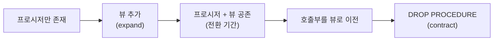

import { Callout, Steps, Step, Tabs, TabsList, TabsTrigger, TabsContent, Icon } from '@/components/writing-ui';

## 이게 뭔데

`Replace Method(s) With View`. 한 문장으로 말하면, **조회만 하는 저장 프로시저를 같은 결과를 내는 뷰(View)로 바꿔치기**하는 리팩토링이다.

비유를 하나 들자. 가게에 "잔액 30만 원 넘는 고객 명단 좀 뽑아 주세요"라고 부탁할 때, 두 가지 방법이 있다. 하나는 **전담 직원한테 매번 부탁하는 것**(프로시저 호출 — `CALL GetActiveCustomers()`). 다른 하나는 **벽에 항상 붙어 있는 게시판을 그냥 보는 것**(뷰 조회 — `SELECT * FROM ActiveCustomers`). 둘 다 같은 명단이 나온다. 근데 게시판은 누구나 와서, 자기가 원하는 방식으로 더 긁어갈 수 있다. "그 명단 중에서 서울 지점만", "이름순으로 정렬해서" — 게시판은 `WHERE`, `ORDER BY`를 덧붙여 다시 쿼리할 수 있지만, 전담 직원은 정해진 결과만 딱 던져준다.

리포팅 도구, BI 툴, 데이터 분석가가 좋아하는 건 압도적으로 **게시판** 쪽이다. 걔들은 SQL을 자유롭게 조립해서 붙이고 싶어 하지, "이 프로시저를 호출하면 결과셋이 나옵니다" 같은 벤더 종속 인터페이스랑 씨름하고 싶어 하지 않는다.

<Callout type="info" title="한 줄 요약">
조회만 하는 단순 프로시저는 뷰로 대체하면 리포팅 도구와 궁합이 좋아지고, 정의가 SQL 표준이라 이식성·유지보수성이 올라간다. 단, "조회만 하는 단순한 것"에만 쓴다.
</Callout>

## 언제 쓰나

이 리팩토링이 답이 되는 냄새는 대충 이런 거다.

**리포팅 도구가 프로시저를 싫어할 때.** 가장 흔한 동기다. Tableau, Power BI, Metabase, 사내 리포트 빌더 같은 도구한테 데이터 소스를 물려줄 때, 뷰는 그냥 테이블처럼 보인다. 드래그앤드롭으로 컬럼 끌어다 쓰고, 거기에 필터 얹고, 다른 테이블이랑 또 조인한다. 반면 저장 프로시저는 "호출해서 결과셋을 받는" 모델이라, 도구에 따라 아예 못 붙이거나, 붙여도 결과를 다시 가공하기가 어렵다. 분석가가 "그 프로시저 결과를 뷰로 좀 빼 주실 수 있어요?"라고 물어보면, 그게 바로 이 리팩토링 신호다.

**메서드가 사실은 그냥 `SELECT` 한 방일 때.** 프로시저를 열어 봤는데, 분기도 없고 루프도 없고 트랜잭션 제어도 없다. 그냥 `SELECT ... FROM ... JOIN ... WHERE ...` 한 덩어리를 감싸 놓은 거다. 이런 건 프로시저라는 무거운 포장지를 두를 이유가 없다. 뷰가 정확히 그 역할이다.

**벤더 종속을 줄이고 싶을 때.** 저장 프로시저 언어는 벤더마다 다르다. Oracle PL/SQL, SQL Server T-SQL, PostgreSQL PL/pgSQL... 문법이 다 따로 논다. 반면 뷰 정의는 (적어도 단순한 건) ANSI SQL에 가깝게 쓸 수 있어서, 나중에 DB를 갈아탈 때 부담이 덜하다. 이식성 얘기다.

### 시나리오: 이런 적 있을 거임

은행 시스템을 굴린다고 하자. 옛날에 누군가 `GetDefaultedCustomers`라는 프로시저를 만들어 뒀다. 연체(default)된 고객을 뽑는 거다. 리스크팀이 매일 이걸 호출해서 명단을 받아 간다.

그런데 어느 날 데이터 분석팀이 새로 BI 도구를 깐다. 분석가가 와서 묻는다. "연체 고객 데이터 좀 보고 싶은데, 데이터 소스에 그 프로시저가 안 잡혀요. 그리고 저는 연체 고객을 지점별로 쪼개서, 보험(Insurance) 가입 여부랑 같이 보고 싶거든요. 프로시저 결과를 또 조인할 수가 없네요."

여기서 뼈아픈 진실 하나. 그 프로시저, 열어 보면 이렇게 생겼다.

```sql
-- 옛날에 만든 GetDefaultedCustomers (PostgreSQL PL/pgSQL)
CREATE OR REPLACE FUNCTION GetDefaultedCustomers()
RETURNS TABLE (customer_id INT, name VARCHAR, balance NUMERIC, branch_id INT) AS $$
BEGIN
  RETURN QUERY
    SELECT c.customer_id, c.name, a.balance, c.branch_id
    FROM Customer c
    JOIN Account a ON a.customer_id = c.customer_id
    WHERE a.balance < 0
      AND a.status = 'DEFAULTED';
END;
$$ LANGUAGE plpgsql;
```

분기도 없고, 트랜잭션 제어도 없고, 부수효과도 없다. **그냥 `SELECT` 한 방을 PL/pgSQL로 비싸게 포장한 것뿐**이다. 이게 바로 "뷰로 내려도 되는" 메서드다. 리스크팀(프로시저 호출)과 분석팀(자유로운 SQL 조립)을 동시에 만족시키려면, 이 결과를 게시판 = 뷰로 빼면 된다.

## 주의할 점

좋아 보인다고 아무 프로시저나 뷰로 바꾸면 큰일 난다. 이 리팩토링엔 분명한 경계가 있다.

<Callout type="warning" title="단순 조회 메서드에만 적용된다">
뷰는 본질적으로 "이름 붙은 `SELECT` 한 방"이다. 그래서 **뷰로 표현 가능한, 비교적 단순한 메서드에만** 쓸 수 있다. 다음 같은 건 뷰로 못 내린다.

- **여러 단계 로직** — `IF`/`CASE`로 분기하거나, 루프를 돌거나, 중간 결과를 임시 테이블에 담아 다시 쓰는 프로시저.
- **데이터를 변경하는 메서드** — `INSERT`/`UPDATE`/`DELETE`를 하는 건 애초에 뷰의 영역이 아니다.
- **갱신 가능 뷰 미지원** — DB가 갱신 가능 뷰(Updatable View)를 제한적으로만 지원하면, **조회용 메서드만** 대체 가능하다. 쓰기까지 하던 프로시저는 못 건드린다.

요약하면, 무거운 로직을 뷰에 욱여넣으려 하지 말 것. 그건 이 리팩토링의 적용 대상이 아니라, 오히려 반대 방향(`Replace View With Method`)이 필요한 신호다.
</Callout>

다행히 비용 쪽은 마음이 편하다. **작업이 전부 DB 안에서 일어나므로, 성능·확장성에 미치는 영향은 사실상 없다.** 프로시저가 돌리던 `SELECT`를 뷰가 똑같이 돌릴 뿐이다. 옵티마이저 입장에선 결국 같은 쿼리다. 그래서 이 리팩토링은 "기능 동등 + 인터페이스 교체"에 가깝다.

대신 진짜 조심할 곳은 **오류 처리**다. 프로시저 호출과 뷰 조회는 실패할 때 돌려주는 오류 코드/예외 모양이 다르다. 호출부가 "프로시저가 던지는 특정 에러 코드"를 잡고 있었다면, 뷰로 바꾼 뒤엔 그 코드가 안 온다. 이 부분은 손봐야 한다.

## 이렇게 한다

핵심 흐름은 단순하다. 갑자기 프로시저를 죽이지 않는다. **뷰를 먼저 만들고, 둘을 한동안 공존시키고(전환 기간), 호출부를 다 옮긴 뒤에야 프로시저를 떨군다.** 이게 expand-contract(parallel change) 패턴 그대로다.



<Steps>
<Step title="뷰를 도입한다 (expand)">

프로시저 안의 `SELECT`를 그대로 들어내서 뷰로 만든다. 결과 컬럼·필터가 프로시저와 **완전히 동일**해야 한다. 이름은 의미가 드러나게 짓자.

```sql
-- 프로시저 본문의 SELECT를 그대로 뷰로
CREATE VIEW DefaultedCustomers AS
SELECT c.customer_id, c.name, a.balance, c.branch_id
FROM Customer c
JOIN Account a ON a.customer_id = c.customer_id
WHERE a.balance < 0
  AND a.status = 'DEFAULTED';
```

이 시점에 **마이그레이션할 데이터는 없다.** 뷰는 데이터를 복제하지 않고, 조회 시점에 원본 테이블을 읽을 뿐이다. 그래서 적재(load)도, 백필(backfill)도 필요 없다. 그냥 정의 하나 추가하는 게 끝이다.

</Step>

<Step title="프로시저를 제거 예정으로 표시한다">

뷰가 생겼다고 바로 프로시저를 지우면, 아직 호출하던 코드가 다 깨진다. 대신 **drop date(제거 예정일)를 박아 두고**, 전환 기간 동안 둘을 공존시킨다.

```sql
COMMENT ON FUNCTION GetDefaultedCustomers()
  IS 'DEPRECATED: 2026-09-01 제거 예정. DefaultedCustomers 뷰를 사용할 것.';
```

이렇게 하면 "프로시저 호출하는 새 코드"가 더 늘어나지 않도록 경고를 남기면서, 기존 호출부가 옮겨 갈 시간을 번다.

</Step>

<Step title="접근 프로그램(앱·리포트)을 뷰로 옮긴다">

호출부를 찾아서, 프로시저 호출을 뷰 조회로 바꾼다. 여기서 오류 처리 코드도 같이 손본다 — 프로시저가 던지던 에러 코드와 뷰 조회 실패는 모양이 다르니까.

<Tabs defaultValue="before">
<TabsList>
<TabsTrigger value="before">Before (프로시저 호출)</TabsTrigger>
<TabsTrigger value="after">After (뷰 조회)</TabsTrigger>
</TabsList>

<TabsContent value="before">

```typescript
// Before: 프로시저를 호출하고, 그 결과셋을 받는다.
// 자유롭게 필터/조인하기 어렵고, 도구 호환성도 떨어진다.
async function listDefaultedCustomers(db: Client) {
  const result = await db.query('SELECT * FROM GetDefaultedCustomers()');
  return result.rows;
}
```

</TabsContent>

<TabsContent value="after">

```typescript
// After: 뷰는 테이블처럼 보이므로, 호출부에서 WHERE/ORDER BY를
// 자유롭게 덧붙일 수 있다. 분석가도 BI 도구로 바로 붙인다.
async function listDefaultedCustomers(db: Client, branchId?: number) {
  const sql = branchId
    ? 'SELECT * FROM DefaultedCustomers WHERE branch_id = $1 ORDER BY balance'
    : 'SELECT * FROM DefaultedCustomers ORDER BY balance';
  const result = await db.query(sql, branchId ? [branchId] : []);
  return result.rows;
}
```

</TabsContent>
</Tabs>

ORM을 쓴다면 뷰를 그냥 읽기 전용 엔티티/모델로 매핑하면 된다 — 프로시저 호출 코드보다 한결 자연스럽다.

</Step>

<Step title="전환 기간이 끝나면 프로시저를 떨군다 (contract)">

drop date가 지나고, 모든 호출부가 뷰로 넘어간 걸 확인했으면, 그제서야 프로시저를 물리적으로 제거한다.

```sql
DROP FUNCTION IF EXISTS GetDefaultedCustomers();
```

"확인"이 핵심이다. 운영에서 누가 아직 호출하고 있는지 모른 채 지우면 사고 난다. 다음 박스 참고.

</Step>
</Steps>

### 현대 도구로 강화하기

2006년 책은 이 절차를 손으로 SQL 쳐가며 했다. 골격은 그대로 두고, 지금이라면 이렇게 한다.

**마이그레이션을 버전 관리한다.** 뷰 생성도, 프로시저 deprecate도, 최종 DROP도 전부 마이그레이션 스크립트로 남긴다. Flyway/Liquibase/Alembic/ORM 마이그레이션 어느 쪽이든. 핵심은 expand와 contract를 **별개의 버전(별개 릴리스)으로 쪼개는 것**이다.

```text
V42__add_defaulted_customers_view.sql      -- expand: 뷰 추가 + 프로시저 deprecate 코멘트
                                           -- (이 릴리스로 한동안 운영하며 호출부 이전)
V57__drop_get_defaulted_customers.sql      -- contract: 전환 기간 후 DROP FUNCTION
```

expand 마이그레이션을 배포한 릴리스와 contract 마이그레이션을 배포하는 릴리스 사이가 곧 "전환 기간"이다. 둘을 같은 PR에 묶지 마라 — 묶으면 전환 기간이 0초가 돼서 expand-contract의 의미가 사라진다.

<Callout type="error" title="DROP 전에 '진짜 아무도 안 쓰는지' 확인할 것">
drop date를 적어 뒀다고 안심하면 안 된다. 코드 검색에 안 잡히는 호출이 있다 — 배치 잡, 사내 리포트, 다른 팀 스크립트, 운영자가 콘솔에서 직접 호출하는 경우. **DROP 전에 실제 호출 흔적을 데이터로 확인하자.**

```sql
-- PostgreSQL: 함수가 마지막으로 호출된 흔적 확인
-- (pg_stat_user_functions는 track_functions 설정이 켜져 있어야 집계됨)
SELECT funcname, calls
FROM pg_stat_user_functions
WHERE funcname = 'getdefaultedcustomers';
```

`calls`가 전환 기간 내내 0이면 안심하고 떨군다. 0이 아니면, 누가 아직 부르고 있다는 뜻이니 추적해서 마저 옮긴 뒤 DROP한다.
</Callout>

<Callout type="note" title="역방향도 있다">
이건 정확히 반대 방향의 리팩토링(`Replace View With Method`)이 존재한다. 뷰가 표현할 수 없는 복잡한 로직이 필요해지거나, 갱신 가능 뷰를 제대로 못 쓰는 DB에서 쓰기까지 캡슐화해야 할 때는 거꾸로 뷰를 메서드로 바꾼다. 즉 "뷰냐 메서드냐"는 영원한 정답이 있는 게 아니라, **그 인터페이스를 누가·어떻게 쓰느냐**에 달렸다. 리포팅·이식성·단순 조회면 뷰, 복잡한 로직·쓰기 캡슐화면 메서드.
</Callout>

## 정리

`Replace Method(s) With View`는 화려한 리팩토링이 아니다. **조회만 하는 단순 프로시저를, 같은 결과를 내는 뷰로 바꾸는 것**뿐이다. 그런데 그 효과는 분명하다 — 리포팅 도구가 좋아하고, 호출부가 `WHERE`/`ORDER BY`/조인을 자유롭게 덧붙일 수 있고, 정의가 SQL 표준에 가까워 이식성이 올라간다. 데이터 마이그레이션도 없고, DB 안에서만 끝나서 성능 부담도 없다.

> **무거운 로직이 없는 프로시저는, 사실 이름 붙은 SELECT 한 방이다. 그럼 뷰가 그 일을 더 잘한다.**

핵심 규율은 두 가지. 첫째, **단순 조회 메서드에만** 적용한다 — 분기·루프·쓰기가 들어간 건 대상이 아니다. 둘째, **expand-contract로 천천히** 한다 — 뷰를 먼저 만들고, 전환 기간 동안 공존시키고, 호출부가 다 넘어간 걸 데이터로 확인한 뒤에야 `DROP PROCEDURE`를 친다. 이 두 가지만 지키면, 리포팅팀도 웃고 운영도 안 깨진다.
