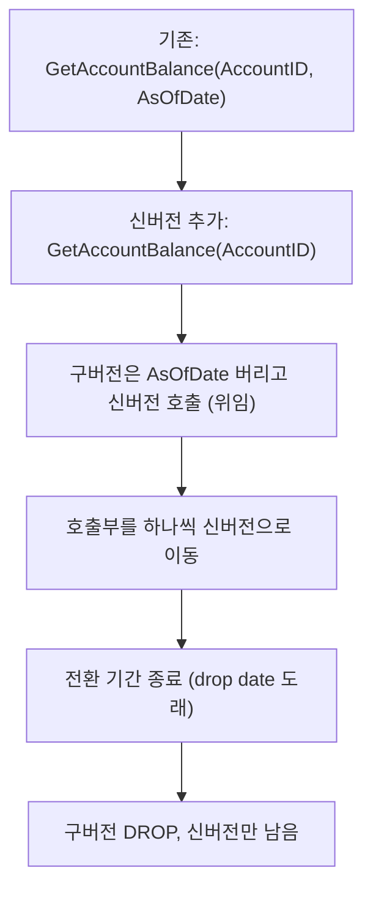

## 이게 뭔데

Remove Parameter. 말 그대로 **저장 프로시저나 함수 시그니처에서 안 쓰는 파라미터 하나를 빼는** 리팩토링이다.

비유를 하나 들자. 회의실 예약 시스템에 "참석 인원" 입력란이 있다고 치자. 처음엔 인원수로 회의실 크기를 자동 매칭하려고 넣었는데, 그 기능은 끝내 안 만들어졌다. 그래서 지금은 누가 예약하든 그냥 아무 숫자나 적어 넣는다. 5라고 적든 500이라고 적든 결과가 똑같다. 그럼 그 입력란은 뭐냐? 그냥 사람을 헷갈리게 하는 장식이다. 떼는 게 맞다.

코드에서도 똑같다. `GetAccountBalance(AccountID, AsOfDate)`인데 정작 안에서 `AsOfDate`를 한 번도 안 쓰고 항상 현재 잔액만 돌려준다면, 그 파라미터는 장식이다. 부르는 쪽은 "이걸 넣으면 과거 시점 잔액이 나오나?" 하고 기대하는데 실제론 무시된다. 거짓말하는 시그니처인 셈이다.

<Callout type="warning" title="한 줄 요약">
안 쓰거나 다른 경로로 얻을 수 있는 파라미터는 시그니처에 남겨두면 거짓말이 된다. 인터페이스가 바뀌니까 호출부도 같이 고쳐야 하고, 그래서 전환 기간이 필요하다.
</Callout>

## 언제 쓰나

Remove Parameter가 답인 상황은 보통 셋 중 하나다.

**첫째, 미래 대비로 넣어놨는데 그 미래가 안 온 경우.** "나중에 필요할 것 같아서" 시그니처에 미리 끼워둔 파라미터다. 위의 `AsOfDate`가 전형이다. 시점 조회 기능을 언젠가 붙이려고 자리를 잡아뒀는데, 요구사항이 바뀌어 끝내 안 붙었다. 그동안 호출하는 쪽은 다들 `SYSDATE`나 `NULL`을 형식적으로 넘기고 있다. YAGNI다. 진짜 필요해지면 그때 Add Parameter로 다시 넣으면 된다.

**둘째, 안에서 다른 경로로 충분히 얻을 수 있는 경우.** 호출자가 굳이 넘겨주지 않아도, 프로시저가 룩업 테이블이나 다른 인자로부터 그 값을 직접 구할 수 있는 상황이다. 예를 들어 `GetAccountBalance(AccountID, BranchID)`인데, `Account` 테이블에 `BranchID` 컬럼이 이미 있어서 `AccountID`만 있으면 지점은 조인으로 알아낼 수 있다면, `BranchID`를 받을 이유가 없다. 오히려 호출자가 틀린 지점을 넘기면 결과가 꼬일 위험만 생긴다. 정보의 단일 출처(single source of truth)가 테이블인데 파라미터로 한 번 더 받는 건 불일치를 부르는 일이다.

**셋째, 리팩토링의 부산물.** 프로시저 내부를 정리하다가(메서드 추출이나 알고리즘 치환 같은 거) 어떤 인자가 더는 분기에 영향을 안 주게 된 경우다. 코드가 죽은 파라미터를 남기고 진화한 거다.

### 시나리오: 이런 적 있을 거임

은행 코어에 `GetAccountBalance`라는 PL/SQL 함수가 있다. 10년 전에 누군가 "감사 대응할 때 특정 일자 기준 잔액이 필요할 수도 있으니까"라며 `AsOfDate` 파라미터를 넣었다. 그런데 시점 잔액은 결국 별도 `BalanceHistory` 테이블과 전용 리포트로 구현됐고, 이 함수는 그냥 현재 잔액만 본다.

오늘 신입이 들어와서 이 함수를 쓴다. 시그니처를 보니 `AsOfDate`가 있다. 자연스럽게 생각한다. "오, 과거 잔액 조회되네." 어제 날짜를 넣고 부른다. 그런데 어제 잔액이 아니라 오늘 잔액이 나온다. 신입은 두 시간 동안 "왜 날짜가 안 먹지?" 하고 헤맨다. 함수 본문을 열어보고서야 깨닫는다. `AsOfDate`는 선언만 돼 있고 본문 어디서도 안 쓰인다. 그냥 받아서 버리는 인자였던 거다.

이런 함수가 코드베이스에 하나 있으면, 똑같은 두 시간을 미래의 모든 신입이 한 번씩 더 쓴다. 그게 거짓말하는 시그니처의 비용이다.

```text
GetAccountBalance(AccountID, AsOfDate)
                             ^^^^^^^^^ 받기만 하고 안 쓰는 유령 파라미터
```

## 주의할 점

Remove Parameter는 **인터페이스 변경 리팩토링**이다. 시그니처가 바뀌니까 이 함수를 부르는 모든 곳이 같이 깨진다. 앱 서버, 배치 잡, 야간 리포트, 다른 프로시저, 어딘가의 엑셀 매크로까지. "안 쓰는 파라미터니까 그냥 빼면 되겠지" 하고 한 방에 시그니처를 바꿔버리면, 미처 못 찾은 호출부에서 컴파일 에러나 런타임 `wrong number of arguments` 에러가 줄줄이 터진다.

<Callout type="warning" title="진짜 안 쓰는 게 맞는지부터 확인해라">
"안 쓰는 것 같다"와 "안 쓴다"는 다르다. Remove Parameter의 가장 위험한 실수는 **사실은 쓰이는데 못 찾은 경우**다.

- **본문에서 안 쓰이는지**: 함수 안에서 그 파라미터를 정말 한 번도 참조 안 하는지 (조건문, 동적 SQL 문자열 조합, 호출하는 다른 프로시저로의 전달까지 전부).
- **동적 SQL 함정**: `EXECUTE IMMEDIATE`나 문자열로 조립한 쿼리 안에 파라미터가 박혀 있으면 정적 분석으로 안 잡힌다. 텍스트 검색까지 해라.
- **호출부에서 의미가 있는지**: 본문에서 무시하더라도, 호출자가 "이걸 넣으면 뭔가 달라진다"고 믿고 있을 수 있다. 그 믿음 자체가 의존이다.

확신이 안 서면 일단 안 빼는 게 낫다. 거짓말하는 시그니처보다 더 나쁜 건, 실제로 쓰이는 파라미터를 들어내서 조용히 틀린 결과를 내는 거다.
</Callout>

특히 **다른 경로로 얻을 수 있다**는 이유로 뺄 때는, 그 다른 경로가 호출자가 넘기던 값과 항상 일치하는지 따져야 한다. `BranchID`를 `Account`에서 조인으로 구하기로 했는데, 옛 호출부 어딘가가 일부러 다른 지점 ID를 넘겨 "남의 지점 관점에서" 조회하던 거였다면, 파라미터를 빼는 순간 그 동작이 사라진다. 안 쓰는 줄 알았던 게 사실은 숨은 기능이었던 거다.

## 이렇게 한다

핵심 전략은 한 단어다. **전환 기간(transition period).** 시그니처를 한 번에 바꾸지 말고, **신버전과 구버전을 한동안 같이 살려두고**, 구버전이 신버전을 대신 호출하게 만든다. 그동안 호출부를 하나씩 신버전으로 옮기고, 다 옮겨지면 구버전을 정리(drop)한다. Fowler의 코드 리팩토링을 DB 메서드에 그대로 적용한 거고, 현대 용어로는 expand-contract(혹은 parallel change)다.

흐름은 이렇다.



### 1단계 — 스키마 변경: 신버전 만들고 구버전은 껍데기로

DDL부터. 파라미터 없는 신버전을 만들고, 기존 함수는 본체를 들어내고 **신버전을 호출하는 통과(pass-through) 껍데기**로 바꾼다. 오버로딩이 되는 DB(PL/SQL 등)면 이름을 그대로 두고 인자 개수로 구분하면 되고, 안 되면 `GetAccountBalance_v2` 같은 이름을 임시로 둔다.

```sql
-- After: 진짜 일을 하는 신버전 (AsOfDate 없음)
CREATE OR REPLACE FUNCTION GetAccountBalance(
    p_AccountID IN NUMBER
) RETURN NUMBER IS
    v_Balance NUMBER;
BEGIN
    SELECT Balance INTO v_Balance
    FROM   Account
    WHERE  AccountID = p_AccountID;

    RETURN v_Balance;
END;
/

-- 전환 기간용 구버전: AsOfDate를 받기만 하고 버린 뒤 신버전에 위임
-- 2027-06-09 drop 예정 (Remove Parameter, AsOfDate 미사용)
CREATE OR REPLACE FUNCTION GetAccountBalance(
    p_AccountID IN NUMBER,
    p_AsOfDate  IN DATE        -- DEPRECATED: 무시됨
) RETURN NUMBER IS
BEGIN
    -- p_AsOfDate는 어차피 안 쓰였으니 그냥 신버전으로 넘긴다
    RETURN GetAccountBalance(p_AccountID);
END;
/
```

핵심은 **구버전이 죽지 않고 신버전을 부른다**는 거다. 옛 호출부는 코드 한 줄 안 고쳤는데도 멀쩡히 돈다. 결과도 전과 똑같다(어차피 `AsOfDate`는 원래 무시됐으니까). 이게 무중단의 비밀이다.

<Callout type="note" title="deprecated 표시를 코드에 남겨라">
구버전 껍데기에는 주석으로 `DEPRECATED`, **drop 예정일(drop date)**, 그리고 "왜 뺐는지"를 박아둬라. 전환 기간이 끝났을 때 "이거 지워도 되나?" 하고 다시 조사하는 일을 막아준다. Liquibase/Flyway changelog의 커밋 메시지에도 같은 정보를 남기면, 6개월 뒤의 내가 git blame으로 맥락을 바로 찾는다.
</Callout>

### 2단계 — 데이터 마이그레이션: 보통 필요 없다

Remove Parameter는 테이블 데이터를 안 건드린다. 시그니처만 바뀌니까 **데이터 마이그레이션(DML)은 보통 없다.** 컬럼을 지우는 게 아니라 인자를 지우는 거라서다.

예외가 딱 하나 있다. 빼려는 파라미터를 **로그/감사 테이블에 적재하고 있었던 경우**다. 예를 들어 호출 때마다 `(AccountID, AsOfDate, 호출시각)`을 감사 테이블에 남겼다면, 신버전엔 `AsOfDate`가 없으니 그 컬럼이 NULL이 된다. 이건 데이터 문제가 아니라 스키마 정리 문제라, 별도로 Drop Column(테이블 리팩토링) 절차를 따로 밟아야 한다. 한 번에 묶지 말고 분리해라.

### 3단계 — 접근 프로그램 수정: 호출부를 하나씩 옮긴다

이제 본 게임이다. 이 함수를 부르는 모든 코드를 신버전으로 옮긴다. 핵심은 **한 번에 다 안 옮겨도 된다**는 점이다. 전환 기간 동안 구버전이 살아 있으니, 팀별/배포 단위로 천천히 이주하면 된다.

```sql
-- Before: 호출부가 형식적으로 SYSDATE를 넘기고 있었다
v_bal := GetAccountBalance(p_AccountID, SYSDATE);

-- After: 유령 인자를 빼고 신버전 호출
v_bal := GetAccountBalance(p_AccountID);
```

애플리케이션 코드도 마찬가지다. ORM이나 raw 호출이나 결국 인자 하나를 떼는 일이다.

```typescript
// Before: 아무도 안 보는 asOfDate를 그냥 new Date()로 채워 넘기던 코드
const balance = await db.func("GetAccountBalance", accountId, new Date());

// After: 인자를 떼면 끝. 의미가 명확해진다
const balance = await db.func("GetAccountBalance", accountId);
```

호출부를 다 찾았다고 확신하려면 검색이 핵심이다.

<Steps>
<Step title="정적 호출부 색출">
코드베이스 전체에서 함수명을 grep/IDE 검색으로 훑는다. 호출 형태가 두 인자인 곳을 전부 리스트업한다. 모노레포면 한 방에 되지만, 리포가 흩어져 있으면 빠뜨리기 쉬우니 조심.
</Step>
<Step title="DB 내부 의존성 확인">
다른 프로시저·트리거·뷰가 이 함수를 부르는지 데이터 딕셔너리로 확인한다. 오라클이면 `ALL_DEPENDENCIES`, 포스트그레면 `pg_depend`/`pg_proc`를 뒤진다. 앱 코드만 보면 DB 안쪽 호출을 놓친다.
</Step>
<Step title="동적/문자열 호출 점검">
`EXECUTE IMMEDIATE`, 문자열로 조립한 SQL, 리포트 도구 정의, 배치 스케줄러 설정처럼 정적 분석이 못 보는 곳을 텍스트 검색으로 별도 점검한다. 여기가 제일 잘 빠진다.
</Step>
<Step title="회귀 테스트로 동치 확인">
신버전과 구버전이 같은 입력에 같은 잔액을 내는지 테스트한다. AsOfDate에 어떤 값을 넣어도 결과가 안 바뀌어야 "정말 안 쓰였다"가 증명된다. 이 테스트가 곧 "빼도 안전하다"의 근거다.
</Step>
<Step title="전환 기간 종료 후 구버전 DROP">
drop date가 오면, 호출부가 0인지 마지막으로 확인하고 구버전 껍데기를 내린다. 운영에서 누가 아직 두 인자로 부르는지 불안하면, drop 전에 구버전 껍데기에 호출 로그를 잠깐 심어 실제 트래픽이 0인지 확인하고 내려라.
</Step>
</Steps>

### 현대 도구로 강화

2006년 책은 이 절차를 손으로 번호 매겨가며 진행한다. 골격은 그대로 두고, 요즘 도구를 얹으면 훨씬 안전해진다.

<Tabs defaultValue="migration">
<TabsList>
<TabsTrigger value="migration">마이그레이션 도구</TabsTrigger>
<TabsTrigger value="observability">호출 관측</TabsTrigger>
<TabsTrigger value="ownership">소유권</TabsTrigger>
</TabsList>

<TabsContent value="migration">
**Flyway/Liquibase로 버전 관리.** 신버전 생성, 구버전 껍데기 전환, 그리고 전환 기간 종료 후의 DROP을 각각 별도 마이그레이션 스크립트로 쪼개 둔다. drop은 보통 한참 뒤(다음 분기 배포 등)에 실행되니까, 아예 별도 changelog 파일로 분리하고 drop date를 파일명/주석에 박아라. 이렇게 하면 "언제 무엇을 왜 바꿨는지"가 changelog에 영구 기록으로 남는다.
</TabsContent>

<TabsContent value="observability">
**진짜 안 쓰는지 운영에서 증명.** drop 전에 구버전 껍데기 안에 가벼운 로그 한 줄(감사 테이블 insert나 메트릭 카운터 증가)을 심어, 두 인자 버전이 실제로 호출되는 횟수를 며칠~몇 주 관측한다. 카운트가 0으로 수렴하면 안심하고 drop. 색출에서 놓친 호출부가 있으면 여기서 잡힌다. "코드 검색으로 다 찾았다"는 믿음보다 "운영 트래픽이 0이더라"는 증거가 훨씬 세다.
</TabsContent>

<TabsContent value="ownership">
**마이크로서비스라면 소유권 경계.** 이 프로시저를 여러 서비스가 공유해 직접 호출하고 있었다면, Remove Parameter 한 번이 여러 팀을 동시에 깨운다. 전환 기간을 길게 잡고, 깨질 수 있는 호출부를 가진 팀에 deprecated 공지를 먼저 돌려라. 애초에 DB 함수를 여러 서비스가 직접 부르는 구조 자체가 결합도 높은 신호라, 이 김에 호출을 소유 서비스의 API 뒤로 감추는 걸 고민해볼 만하다.
</TabsContent>
</Tabs>

<Callout type="info" title="왜 굳이 전환 기간이냐">
"안 쓰는 파라미터 하나 빼는 건데 한 방에 바꾸면 안 되나?" 싶을 수 있다. 호출부를 100% 통제하는 작은 모노레포에 회귀 테스트까지 탄탄하면, 그냥 시그니처를 바꾸고 호출부를 일괄 수정하는 atomic 변경도 가능하다. 하지만 호출부가 여러 리포·배치·외부 시스템에 흩어져 있고 한 번에 다 못 고치는 순간, 전환 기간은 선택이 아니라 필수다. 무중단의 핵심은 "구버전과 신버전이 잠시 공존한다"는 한 가지다.
</Callout>

## 정리

Remove Parameter는 작은 리팩토링이지만 원리는 묵직하다.

> **거짓말하는 시그니처는 코드 냄새다. 안 쓰는 인자는 미래의 모든 호출자를 헷갈리게 한다.**

들어내는 절차 자체는 단순하다. (1) 진짜 안 쓰이는지 본문·동적 SQL·호출부까지 확인하고, (2) 파라미터 없는 신버전을 만들고, (3) 구버전은 죽이지 말고 신버전을 대신 호출하는 껍데기로 바꿔 전환 기간을 열고, (4) 호출부를 하나씩 옮긴 뒤, (5) drop date가 오면 구버전을 내린다. 데이터 마이그레이션은 보통 없다 — 컬럼이 아니라 인자를 지우는 거니까.

요점은 "한 방에 바꾸지 마라"다. 신버전과 구버전을 잠깐 공존시키는 것만으로 무중단이 되고, 운영 호출 카운트가 0인 걸 확인하고 내리면 사고도 안 난다. `AsOfDate`처럼 받기만 하고 버리는 유령 인자를 발견했다면, 그건 정리하라는 신호다.
