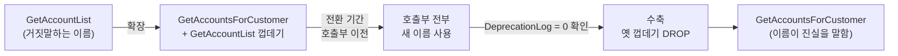

import { Callout, Steps, Step, Tabs, TabsList, TabsTrigger, TabsContent, Icon } from '@/components/writing-ui';

## 이게 뭔데

Rename Method는 이름 그대로다. **잘못 지어졌거나 명명 규칙에 안 맞는 저장 프로시저(메서드)의 이름을 바로잡는 것**. 책의 대표 예시가 `GetAccountList` → `GetAccountsForCustomer`다.

별거 아닌 것 같지? IDE에서 F2 한 번 누르면 다 바뀌는 그거 아니냐고. 코드 안에서라면 맞다. 그런데 저장 프로시저는 사정이 다르다. 이 프로시저를 호출하는 게 같은 코드베이스 안에만 있는 게 아니라, 어디 붙어 있는지도 모르는 배치 잡, 5년 전 퇴사자가 짠 리포트 툴, 다른 팀 마이크로서비스, 심지어 엑셀 매크로일 수도 있다. **DB 프로시저 이름은 사실상 공개 API다.** 그걸 그냥 바꾸면 "어디서 누가 호출하는지 모르는 함수의 시그니처를 통보 없이 갈아엎는" 짓이 된다.

비유하자면 이렇다. 회사 대표번호를 바꾸는 거랑 비슷하다. 내 명함만 새로 찍는다고 끝이 아니다. 거래처 수첩에, 검색엔진에, 5년 전 뿌린 전단지에 옛날 번호가 박혀 있다. 그래서 멀쩡한 회사는 번호를 갈아엎지 않고, **한동안 옛 번호로 걸면 새 번호로 자동 연결되게** 해둔다. 그 사이에 다들 새 번호를 외운다. Rename Method의 핵심도 정확히 이 "자동 연결" 기간, 즉 **전환 기간(Transition Period)** 이다.

<Callout type="info" title="왜 이름이 거짓말하면 안 되나">
`GetAccountList`라는 이름은 "계좌 목록을 준다"고만 말한다. 그런데 실제로는 "특정 고객의 계좌만" 준다. 이름이 동작을 덜 말하거나 틀리게 말하면, 다음 사람이 이걸 "전체 계좌 목록"인 줄 알고 잘못 쓴다. 이름은 가장 많이 읽히는 문서다. 거짓말하는 문서는 없느니만 못하다.
</Callout>

## 언제 쓰나

이름 하나 바꾸자고 이 귀찮은 전환 기간을 다 거치는 데는 신호가 있다. 대충 이런 냄새가 나면 Rename Method가 답이다.

- **이름이 동작을 거짓말한다.** `GetAccountList`가 사실은 고객별 조회다. `UpdateCustomer`가 사실은 주소만 바꾼다. 읽는 사람이 매번 본문을 까봐야 진짜 동작을 안다면, 이름이 일을 안 하고 있는 거다.
- **명명 규칙에 안 맞는다.** 팀이 `Get…ForCustomer` 식으로 통일하기로 했는데 옛날 프로시저 하나만 `GetAccountList`로 혼자 튄다. 규칙은 일관될 때만 규칙이다. 한 군데 깨지면 "아 여긴 예외인가?" 하는 의심 비용이 매번 든다.
- **약어가 암호 수준이다.** `usp_GAFC_v2_final`. 이게 무슨 동작인지 작명자 본인도 6개월 뒤엔 기억 못 한다.

반대로, **혼자 쓰고 곧 지울 임시 프로시저**거나 **이름이 못생겼지만 동작은 정확히 설명하는** 경우라면 굳이 안 건드려도 된다. 모든 못난 이름이 리팩토링 대상은 아니다. 거짓말하는 이름, 규칙을 깨는 이름이 우선순위다.

### 시나리오: 이런 적 있을 거임

은행 시스템에 `GetAccountList`라는 프로시저가 있다. 고객 ID를 받아서 그 고객 계좌들을 돌려준다. 잘 돈다. 5년째 잘 돌고 있다.

어느 날 신입이 들어와서 "고객별 계좌 조회하는 프로시저 어디 있어요?" 묻는다. 너는 `GetAccountList`를 알려준다. 신입이 갸웃한다. "List면 전체 목록 아니에요?" ...그래, 사실 너도 처음엔 그렇게 헷갈렸다. 그냥 익숙해져서 잊고 있었을 뿐이다.

그러다 다른 팀이 이 프로시저를 발견한다. 이름만 보고 "오 전체 계좌 리스트 뽑는 거네" 하면서 고객 ID 자리에 아무 값이나 넣고 돌려본다. 빈 결과가 나오니까 "버그인가?" 하고 우리 팀에 티켓을 끊는다. 버그가 아니다. **이름이 거짓말을 했고, 그 거짓말을 믿은 죄밖에 없다.** 여기서 결심한다. 이름을 고치자. `GetAccountsForCustomer`로.

그런데 막상 바꾸려고 보니, 이 프로시저를 호출하는 곳을 `grep`해보면 우리 앱 코드 12곳, 야간 배치 3개, 어딘가의 리포트 1개, 그리고 정체불명의 호출 로그가 또 있다. 통보 없이 이름만 바꾸면 내일 새벽 배치가 줄줄이 깨진다. 자, 이제 전환 기간이 왜 필요한지 몸으로 느껴진다.

## 주의할 점

<Callout type="warning" title="이건 인터페이스 변경 리팩토링이다">
Rename Method는 **외부에 노출된 인터페이스를 바꾸는** 리팩토링이다(내부만 손대는 Extract Method 같은 것과 다르다). 즉 **이 프로시저를 호출하는 모든 외부 프로그램도 함께 고쳐야 한다.** 그래서 책은 반드시 전환 기간을 두라고 못 박는다. 옛 이름을 곧장 지우는 순간, 옛 이름을 부르던 누군가가 죽는다. 그게 누군지 너는 다 알지 못한다.
</Callout>

몇 가지 더.

- **"호출부를 다 안다"는 건 대개 착각이다.** 코드 검색으로 잡히는 건 정적 호출뿐이다. 문자열로 프로시저 이름을 조립해 동적 실행(`EXEC @name`)하는 코드, 외부 BI 도구, ad-hoc 쿼리는 안 잡힌다. 그래서 "다 찾았으니 바로 지우자"가 위험하다.
- **드롭 날짜(drop date)를 정하고 공지해라.** 전환 기간이 무한정이면 옛 이름이 영원히 안 죽는다. "이 프로시저는 X월 X일 제거 예정" 주석과 공지를 박아라. 데드라인 없는 전환은 전환이 아니라 그냥 방치다.
- **권한도 같이 옮긴다.** 새 프로시저에 옛 프로시저가 갖고 있던 `GRANT`(실행 권한)를 그대로 부여하는 걸 잊으면, 이름은 바꿨는데 호출자가 권한 없어서 깨진다.
- **시그니처는 그대로 두라.** Rename Method는 **이름만** 바꾸는 리팩토링이다. 이름 바꾸는 김에 파라미터까지 슬쩍 추가하거나 순서를 바꾸면 변경 두 개가 한 PR에 섞여 디버깅이 지옥이 된다. 한 번에 하나씩.

## 이렇게 한다

핵심 아이디어는 단순하다. **새 이름의 프로시저를 만들고, 옛 이름은 새 이름을 호출하는 얇은 껍데기(pass-through)로 만들어 둔다.** 그러면 옛 이름을 부르던 코드도 안 깨지고, 새 코드는 새 이름을 쓴다. 전환 기간 동안 둘 다 살아 있다가, 옛 호출부가 다 옮겨가면 껍데기를 제거한다.

이게 사실 현대 용어로 **expand-contract(parallel change)** 패턴 그 자체다. 2006년 책이 손코딩으로 보여준 걸 요즘은 그냥 "확장하고(둘 다 공존), 옮기고(호출부 이전), 수축한다(옛것 제거)"라고 부른다. 이름만 멋있어졌지 골격은 똑같다.

<Steps>
<Step title="확장 — 새 이름 프로시저를 만든다">
실제 로직을 새 이름으로 옮긴다. 옛 프로시저의 본문을 새 프로시저로 가져온다.
</Step>
<Step title="옛 이름을 껍데기로 바꾼다">
옛 프로시저는 로직을 비우고 새 프로시저를 호출만 하게 만든다. 이제 옛 이름을 불러도 결과는 동일하다.
</Step>
<Step title="옮긴다 — 호출부를 하나씩 새 이름으로">
앱 코드, 배치, 리포트의 호출부를 새 이름으로 바꿔 나간다. 이 기간이 전환 기간이다. 옛 껍데기 호출 로그를 모니터링하면 누가 아직 안 옮겼는지 보인다.
</Step>
<Step title="수축 — 드롭 날짜에 껍데기 제거">
공지한 날짜가 되고 옛 이름 호출이 0이 되면, 껍데기 프로시저를 DROP 한다. 끝.
</Step>
</Steps>

### 1단계 + 2단계: 스키마 변경 (DDL)

```sql
-- Before: 이름이 거짓말하는 원본 프로시저
CREATE PROCEDURE GetAccountList(@CustomerID INT)
AS
BEGIN
    SELECT AccountID, Balance, OpeningDate
    FROM   Account
    WHERE  CustomerID = @CustomerID;
END;
```

전환 기간 동안의 모습은 이렇다. 로직은 새 이름으로 옮기고, 옛 이름은 새 이름을 호출하는 껍데기가 된다.

```sql
-- After: 실제 로직은 새 이름으로
CREATE PROCEDURE GetAccountsForCustomer(@CustomerID INT)
AS
BEGIN
    SELECT AccountID, Balance, OpeningDate
    FROM   Account
    WHERE  CustomerID = @CustomerID;
END;

-- 옛 이름은 새 이름을 부르는 얇은 껍데기로 (전환 기간 동안만 생존)
-- DROP 예정: 2026-09-01  ← 드롭 날짜를 코드에 박아둔다
CREATE PROCEDURE GetAccountList(@CustomerID INT)
AS
BEGIN
    -- 사용 추적용: 누가 아직 옛 이름을 부르는지 남긴다
    INSERT INTO DeprecationLog(ProcName, CalledAt)
    VALUES ('GetAccountList', GETDATE());

    EXEC GetAccountsForCustomer @CustomerID;
END;

-- 옛 프로시저가 갖고 있던 실행 권한을 새 프로시저에도 그대로
GRANT EXECUTE ON GetAccountsForCustomer TO AppRole;
```

여기서 옛 껍데기 안에 **deprecation 로그 한 줄**을 넣은 게 포인트다. 책 시대엔 "전환 기간이 끝났는지 어떻게 아냐"가 감이었지만, 이렇게 호출을 기록해두면 옛 이름 호출이 진짜 0이 됐는지 데이터로 확인하고 드롭할 수 있다. 감이 아니라 근거로 죽인다.

<Callout type="note" title="껍데기에 로직을 복붙하지 마라">
옛 껍데기 안에 로직을 한 벌 더 복사해두면, 나중에 로직이 바뀔 때 두 군데를 다 고쳐야 한다. 한쪽만 고치면 "옛 이름으로 부르면 옛 결과가 나오는" 유령 버그가 생긴다. 껍데기는 무조건 새 프로시저를 **호출만** 하게 해서 로직을 한 군데로 모아라. Remove Middle Man을 나중에 적용할 때도 깔끔하다.
</Callout>

### 3단계: 접근 프로그램(코드) 수정

전환 기간 동안 호출부를 옮긴다. 앱 코드라면 이렇게.

```typescript
// Before: 옛 이름 호출
const accounts = await db.exec('GetAccountList', { CustomerID: customerId });

// After: 새 이름으로
const accounts = await db.exec('GetAccountsForCustomer', { CustomerID: customerId });
```

ORM에서 프로시저를 매핑해 쓰고 있었다면 매핑 이름만 바꾸면 된다. 중요한 건 **한 번에 다 바꾸려 하지 말고 하나씩** 옮기는 거다. 옛 껍데기가 살아 있으니 일부만 옮겨도 시스템은 멀쩡하다. 이게 전환 기간이 주는 안전망이다.

### 마이그레이션 도구로 버전 관리

요즘은 이 DDL 변경을 손으로 운영 DB에 치지 않는다. Flyway / Liquibase / Alembic 같은 마이그레이션 도구로 버전 파일을 만들어 코드처럼 관리한다. 그래야 "언제 누가 이름을 바꿨고, 언제 껍데기를 지웠는지"가 히스토리로 남는다.

<Tabs defaultValue="flyway">
<TabsList>
<TabsTrigger value="flyway">Flyway</TabsTrigger>
<TabsTrigger value="liquibase">Liquibase</TabsTrigger>
</TabsList>
<TabsContent value="flyway">

전환 시작과 드롭을 별개 버전 파일로 쪼개는 게 핵심이다. 둘 사이의 시간이 곧 전환 기간이다.

```sql
-- V2026.05.01__rename_get_account_list_expand.sql
-- 확장: 새 이름 생성 + 옛 이름 껍데기화
CREATE PROCEDURE GetAccountsForCustomer(@CustomerID INT) AS
BEGIN
    SELECT AccountID, Balance, OpeningDate
    FROM Account WHERE CustomerID = @CustomerID;
END;

CREATE OR ALTER PROCEDURE GetAccountList(@CustomerID INT) AS
BEGIN
    EXEC GetAccountsForCustomer @CustomerID;  -- pass-through
END;
```

```sql
-- V2026.09.01__rename_get_account_list_contract.sql
-- 수축: 전환 기간 종료. 옛 이름 제거
DROP PROCEDURE GetAccountList;
```

옛 이름 호출이 0임을 `DeprecationLog`로 확인한 뒤에야 `contract` 마이그레이션을 적용한다.

</TabsContent>
<TabsContent value="liquibase">

Liquibase는 변경을 changeSet 단위로 묶고, 드롭 changeSet에는 `rollback`을 명시해 되돌릴 길을 열어둔다.

```xml
<changeSet id="rename-getaccountlist-expand" author="jh">
  <createProcedure>
    CREATE PROCEDURE GetAccountsForCustomer(@CustomerID INT) AS
    BEGIN
      SELECT AccountID, Balance, OpeningDate
      FROM Account WHERE CustomerID = @CustomerID;
    END;
  </createProcedure>
  <createProcedure>
    CREATE OR ALTER PROCEDURE GetAccountList(@CustomerID INT) AS
    BEGIN
      EXEC GetAccountsForCustomer @CustomerID;
    END;
  </createProcedure>
</changeSet>

<changeSet id="rename-getaccountlist-contract" author="jh">
  <preConditions onFail="HALT">
    <!-- 옛 이름 호출이 없을 때만 진행 -->
    <sqlCheck expectedResult="0">
      SELECT COUNT(*) FROM DeprecationLog
      WHERE ProcName = 'GetAccountList'
        AND CalledAt &gt; DATEADD(DAY, -7, GETDATE());
    </sqlCheck>
  </preConditions>
  <sql>DROP PROCEDURE GetAccountList;</sql>
  <rollback>
    CREATE PROCEDURE GetAccountList(@CustomerID INT) AS
    BEGIN EXEC GetAccountsForCustomer @CustomerID; END;
  </rollback>
</changeSet>
```

`preConditions`로 "최근 7일간 옛 이름 호출 0"을 검사하니, 아직 누가 부르고 있으면 드롭이 자동으로 멈춘다. 감으로 지우다 사고 나는 걸 도구가 막아준다.

</TabsContent>
</Tabs>

### 전체 흐름



## 정리

Rename Method는 코드 한 줄짜리 리팩토링처럼 보이지만, 저장 프로시저 이름은 **누가 부르는지 다 알 수 없는 공개 API**라서 함부로 못 바꾼다. 그래서 핵심은 이름 자체가 아니라 **전환 기간**이다.

> **옛 이름이 새 이름을 부르게 해두고, 모두가 옮겨간 뒤에 옛 이름을 죽인다.**

이 패턴(expand-contract)은 이름 변경뿐 아니라 거의 모든 인터페이스 변경에 그대로 쓰인다. 옛것과 새것을 잠시 공존시키고, 트래픽을 옮기고, 확인되면 옛것을 제거한다. 2006년엔 SQL 껍데기를 손으로 짰지만, 지금은 Flyway/Liquibase의 expand/contract 마이그레이션 두 파일과 deprecation 로그로 같은 일을 한다. 도구가 바뀌었을 뿐, "이름이 거짓말하지 않게, 그러나 아무도 안 깨지게"라는 목표는 똑같다.
