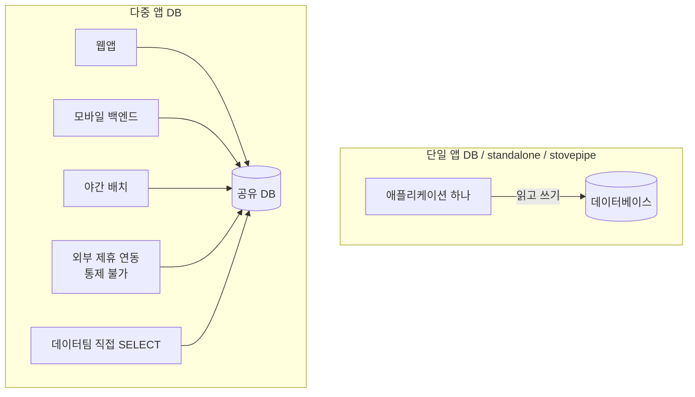
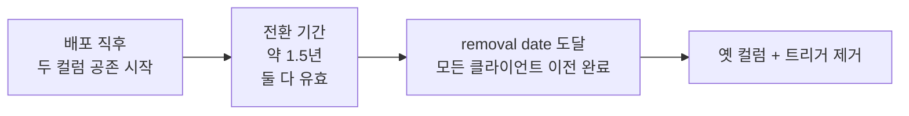
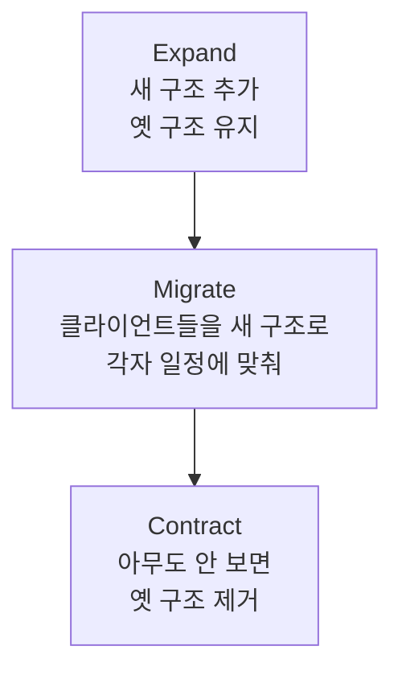
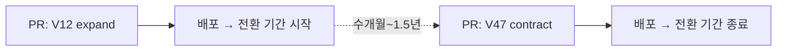
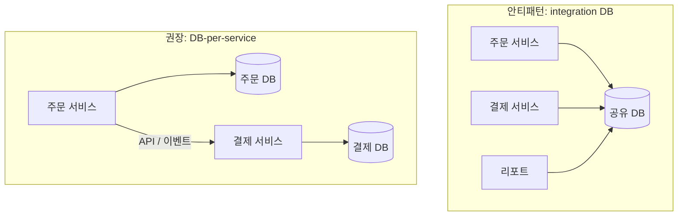

## 이게 뭔데

같은 컬럼 하나를 옮기는 작업인데, 어떤 날은 30분이면 끝나고 어떤 날은 1년 반이 걸린다. 코드가 더 복잡해서가 아니다. **그 DB를 누가 쓰고 있느냐**가 다를 뿐이다.

비유를 하나 들어보자. 내 방 가구 배치를 바꾼다고 치자. 침대를 창가로 옮기고 책상을 반대편으로 돌린다. 내가 혼자 쓰는 방이면 그냥 옮기면 된다. 옮기고 나서 "아 여기 불편하네" 싶으면 또 옮기면 그만이다. 근데 그 방이 사실 **동네 공용 거실**이고, 매일 50명이 들락거리는데 그중 누가 언제 들어와서 어디 앉을지 내가 통제할 수 없다면? 침대를 함부로 못 옮긴다. 누군가는 "원래 거기 침대 있었잖아"를 전제로 움직이고 있으니까. 옮기려면 공지를 붙이고, 한동안 옛 자리와 새 자리에 둘 다 침대를 두고, 다들 새 자리에 적응할 때까지 기다려야 한다.

DB 리팩토링의 난이도를 가르는 게 정확히 이 차이다. **내 앱 하나만 그 DB를 쓰느냐(단일 앱), 통제 못 하는 다수가 붙어 있느냐(다중 앱).** 책 표현으로는 single-application database vs multi-application database다.

<Callout type="info" title="핵심 요약">
- **단일 앱 DB**: 스키마와 코드를 둘 다 통제한다. 같이 고치고 같이 배포하면 끝. standalone/stovepipe라고도 부른다.
- **다중 앱 DB**: 통제 밖의 프로그램까지 붙어 있다. 다 같이 배포된다는 보장이 없으니, 옛 스키마와 새 스키마를 **동시에 살려두는 전환 기간**이 필수다.
- 리팩토링 난이도는 코드 복잡도가 아니라 **결합(coupling)의 범위**가 결정한다.
</Callout>

## 시나리오: 이런 적 있을 거임

은행 시스템이다. 옛날엔 한 고객이 계좌 하나만 가졌다. 그래서 잔액을 `Customer.Balance`에 박아뒀다. 그런데 이제 한 고객이 입출금 계좌, 적금, 마이너스 통장을 다 가진다. 잔액이 고객에 붙어 있으면 말이 안 된다. 잔액은 **계좌의 속성**이지 고객의 속성이 아니다. 그래서 결정한다. `Customer.Balance`를 `Account.Balance`로 옮기자(`Move Column`).

작업 자체는 어렵지 않다. 새 컬럼 만들고, 데이터 복사하고, 코드가 새 컬럼을 보게 고치고, 옛 컬럼 드롭. 끝. 단일 앱이면 진짜 이게 끝이다.

```sql
-- 단일 앱: 이 정도면 한나절 작업
ALTER TABLE Account ADD COLUMN Balance NUMERIC(19,2);
UPDATE Account a
SET Balance = (SELECT c.Balance FROM Customer c WHERE c.id = a.customer_id);
-- 코드 배포 후
ALTER TABLE Customer DROP COLUMN Balance;
```

그런데 회의실에서 누가 손을 든다. "그 DB... 우리 앱만 쓰는 거 아닌데요." 정적이 흐른다.

알고 보니 그 `Customer.Balance`를 읽는 곳이 한둘이 아니다.

```text
- 메인 뱅킹 웹앱        (우리 팀, 2주마다 배포)
- 모바일 백엔드         (다른 팀, 한 달에 한 번 배포)
- 야간 정산 배치        (외주, 분기에 한 번 손댐)
- 리스크 분석 리포트     (데이터팀, 직접 SELECT 날림)
- 콜센터 상담 화면       (10년 된 .NET, 담당자 퇴사)
- 제휴사 정산 연동       (외부 회사, 우리가 배포 못 함)
```

이 중에 `Customer.Balance`를 보는 게 몇 개일지, 솔직히 아무도 정확히 모른다. 콜센터 화면 담당자는 이미 퇴사했고, 제휴사 연동은 우리가 코드를 볼 수조차 없다. **여기서 `Customer.Balance`를 그냥 드롭하면** 다음 날 콜센터 화면이 죽고, 제휴사 정산이 깨지고, 리스크 리포트에 `NULL`이 뜬다. 그리고 그게 다 **운영 장애로** 터진다.

같은 `Move Column`인데, 단일 앱에선 한나절이고 다중 앱에선 1년 반짜리 프로젝트가 된다. 차이를 만든 건 SQL이 아니라 **"누가 이 컬럼에 의존하고 있는지를 내가 통제하느냐"**다.

## 결합의 범위가 모든 걸 결정한다

코드 리팩토링이 DB 리팩토링보다 쉬운 이유가 여기 있다. 코드 리팩토링은 **행위적 의미**만 유지하면 된다. 함수 이름을 바꿔도 호출하는 곳이 같은 레포 안에 있으면 IDE가 다 찾아서 같이 바꿔준다. 컴파일 한 번 돌리면 안 고친 데가 빨갛게 뜬다.

DB는 다르다. 컬럼 하나에 의존하는 코드가 **여러 레포, 여러 언어, 여러 팀, 심지어 여러 회사**에 흩어져 있다. "이 컬럼 누가 쓰는지" 검색할 IDE가 없다. 결합이 강할수록, 그리고 결합된 상대가 **내 통제 밖**일수록, 한쪽 변경이 다른 쪽을 깨뜨릴 가능성이 커진다.

그래서 DB 아키텍처를 딱 두 부류로 나눠서 보면 작업 전략이 자동으로 결정된다.



왼쪽은 가구를 내 마음대로 옮길 수 있는 내 방, 오른쪽은 공용 거실이다. 작업 방식이 같을 수가 없다.

<Callout type="note" title="stovepipe가 뭐냐면">
"stovepipe(난로 연통)" 시스템은 다른 시스템과 통합 안 된 채 자기 데이터를 혼자 끌어안고 수직으로 서 있는 독립 시스템을 말한다. 욕처럼 들리지만, **DB 리팩토링 관점에선 축복이다.** 나 혼자 쓰니까 마음대로 고칠 수 있다. 통합이 강점이 되는 맥락도 많지만, 스키마를 진화시키는 작업에선 stovepipe가 압도적으로 편하다.
</Callout>

## 단일 앱: 같이 고치고 같이 배포하면 끝

단일 앱 환경은 책의 표현대로 "가장 단순"하다. 스키마도 코드도 다 내 손안에 있으니, 둘을 **병렬로 리팩토링하고 한 번에 배포**하면 된다. 옛 스키마와 새 스키마를 동시에 살려둘 이유가 없다. 새 스키마로 배포되는 순간 옛 스키마를 보던 코드는 더 이상 없으니까.

책은 이걸 TDD 흐름으로 권한다. 앱 개발자와 DB 개발자가 한 쌍(pair)으로 붙어서 이렇게 간다.

<Steps>
<Step title="현재 테스트 전부 통과 확인">
손대기 전에 그린(green) 상태를 확보한다. 깨진 상태에서 시작하면 내가 깬 건지 원래 깨진 건지 모른다.
</Step>
<Step title="Account.Balance를 읽는 테스트 작성 → 실패 확인">
아직 컬럼이 없으니 당연히 빨갛게(red) 실패한다. 이게 정상이다.
</Step>
<Step title="Account.Balance 컬럼 도입 → 테스트 통과">
컬럼을 만들면 방금 그 테스트가 통과한다.
</Step>
<Step title="입출금 로직을 Account.Balance로 전환">
입금이 `Customer.Balance`가 아니라 `Account.Balance`를 갱신하도록 고치고, 출금·이체 등 나머지 코드도 똑같이 옮긴다. 테스트로 검증.
</Step>
<Step title="데이터 마이그레이션 + 검증">
안전하게 `Customer.Balance`를 백업하고 해당 행의 `Account.Balance`로 복사한다. 마이그레이션이 맞게 됐는지도 테스트로 확인.
</Step>
<Step title="Customer.Balance 드롭 → 전체 테스트">
이제 옛 컬럼을 본다는 코드가 하나도 없으니 드롭하고, 전체 테스트를 다시 돌려 통합 환경으로 승격한다.
</Step>
</Steps>

여기서 핵심은 **5번 데이터 마이그레이션과 6번 드롭 사이에 시간 간격이 거의 없다**는 거다. 코드와 스키마가 같은 배포 단위에 묶여 나가니까. 현대 도구로 치면 Flyway/Liquibase/Alembic 마이그레이션 한두 개에 애플리케이션 배포 한 번이면 떨어지는 작업이다. CI가 마이그레이션을 적용하고, 같은 파이프라인이 새 코드를 띄운다.

<Callout type="success" title="단일 앱의 특권">
옛 스키마와 새 스키마를 병렬로 유지할 필요가 없다. 동기화 트리거도, 폐기 기간도 필요 없다. **이게 단일 앱이 누리는 가장 큰 특권이다.** 다중 앱으로 넘어가는 순간 이 특권을 다 잃는다.
</Callout>

## 다중 앱: 전환 기간이 등장한다

다중 앱은 전제 하나가 깨지면서 난이도가 폭발한다. 그 전제는 **"모든 클라이언트가 동시에 배포된다"**는 가정이다.

현실은 이렇다. 우리 팀 웹앱은 2주마다 배포한다. 모바일 백엔드는 한 달에 한 번. 야간 배치 외주는 분기에 한 번 손대고, 콜센터 화면은 담당자가 없어서 사실상 안 건드린다. 제휴사 연동은 그쪽 일정이라 우리가 통제 못 한다. 이걸 **한날한시에 다 같이 새 스키마로 바꾸는 건 불가능하다.**

그래서 책이 꺼내는 카드가 **전환 기간(transition period, = 폐기 기간/deprecation period)**이다. 옛 컬럼을 즉시 드롭하지 않는다. 대신 최소 1년 반 동안 `Customer.Balance`와 `Account.Balance`를 **둘 다 살려두고**, 각 팀이 자기 일정에 맞춰 새 컬럼으로 갈아탈 시간을 준다.



전환 기간이 왜 이렇게 긴가? 어떤 앱은 지금 아무도 작업 중이 아니고, 어떤 앱은 옛날 방식대로 1년에 한 번 릴리스하기 때문이다. 전환 기간은 **가장 느린 팀**에 맞춰야 한다. 빠른 팀 기준으로 잡으면 느린 팀이 이전을 끝내기 전에 컬럼이 사라져서 장애가 난다.

그런데 두 컬럼을 그냥 방치하면 값이 따로 논다. 웹앱은 새 컬럼에 입금하고, 콜센터 화면은 옛 컬럼을 읽으면, 콜센터엔 입금이 반영 안 된 잔액이 뜬다. 그래서 **동기화 메커니즘**이 필요하다. 책은 트리거를 쓴다.

```sql
-- Account.Balance가 바뀌면 Customer.Balance도 맞춰준다
CREATE TRIGGER SynchronizeCustomerBalance
AFTER UPDATE ON Account
FOR EACH ROW
BEGIN
    UPDATE Customer
    SET Balance = NEW.Balance
    WHERE id = NEW.customer_id;
END;

-- 반대 방향도 마찬가지: Customer.Balance가 바뀌면 Account.Balance로
CREATE TRIGGER SynchronizeAccountBalance
AFTER UPDATE ON Customer
FOR EACH ROW
BEGIN
    UPDATE Account
    SET Balance = NEW.Balance
    WHERE customer_id = NEW.id;
END;
```

옛 컬럼을 읽는 콜센터든, 새 컬럼을 읽는 웹앱이든 **누가 어디에 쓰든 양쪽이 항상 같은 값**을 본다. 개별 앱이 두 컬럼을 모두 갱신해 줄 거라고 믿을 수 없으니(믿으면 안 되니), DB가 직접 동기화를 떠안는 거다. 뷰나 사후 배치 동기화 같은 대안도 있지만, 실시간 일관성 면에선 트리거가 가장 깔끔하게 작동한다.

<Callout type="warning" title="다중 앱에서 챙겨야 하는 것">
- **removal date**: 폐기 대상 컬럼에 "이 날 이후 제거됨"을 명시한다(예: 2026-12-31). 코드 주석이든, 스키마 메타데이터든, 별도 트래킹 문서든.
- **drop date**: 트리거에도 언제 떼어낼지를 표시한다. 트리거를 영원히 켜두면 그게 또 다른 부채가 된다.
- 두 날짜를 박아두지 않으면 전환 기간이 "임시"가 아니라 **영구**가 된다. 5년 뒤에도 동기화 트리거가 돌고 아무도 이유를 모르는 상태가 진짜 흔하다.
</Callout>

## 현대 실무: 이걸 expand-contract라고 부른다

2006년 책은 이 과정을 손으로 짠 SQL 스크립트와 트리거로 설명한다. 골격은 지금도 똑같지만, 오늘날엔 이 패턴에 이름이 붙어 있다. **expand-contract**, 또는 **parallel change**라고 부른다. 단계는 정확히 책의 전환 기간 구조와 일치한다.



<Steps>
<Step title="Expand (확장)">
새 컬럼/테이블을 추가하되 옛것은 그대로 둔다. 이 마이그레이션은 **하위 호환**이다. 옛 코드는 아무것도 모른 채 계속 돈다. 동기화는 트리거나 애플리케이션의 이중 쓰기(dual write)로 건다.
</Step>
<Step title="Migrate (이전)">
클라이언트들을 하나씩 새 구조로 옮긴다. 다중 앱의 핵심은 이 단계가 **단번에 끝나지 않는다**는 것. 팀마다 자기 릴리스 주기에 맞춰 넘어온다.
</Step>
<Step title="Contract (수축)">
모든 클라이언트가 새 구조만 보는 게 확인되면, 그제서야 옛 컬럼과 동기화 장치를 떼어낸다. removal date가 바로 이 단계의 일정이다.
</Step>
</Steps>

도구 입장에서 보면, expand와 contract가 **별개의 마이그레이션 파일**로 갈라진다는 게 핵심이다. Flyway로 치면 `V12__add_account_balance.sql`(expand)을 먼저 머지·배포하고, 한참 뒤 `V47__drop_customer_balance.sql`(contract)을 따로 머지한다. 둘이 한 PR에 묶이면 안 된다. 묶는 순간 단일 앱처럼 "같이 배포"가 돼버려서 통제 밖 클라이언트가 깨진다.



온라인 스키마 변경 도구도 같은 맥락이다. 운영 중인 큰 테이블에 컬럼을 추가하거나 인덱스를 거는 동안 락이 걸려서 다른 앱이 멈추면 그것도 장애다. 그래서 다중 앱 환경에선 무중단 변경이 사실상 필수다.

- **PostgreSQL**: `CREATE INDEX CONCURRENTLY`로 락 없이 인덱스 생성, `ADD CONSTRAINT ... NOT VALID` 후 `VALIDATE CONSTRAINT`로 제약을 두 단계로 나눠 검증.
- **MySQL**: `gh-ost`(GitHub) 또는 `pt-online-schema-change`(Percona)로 섀도 테이블에 복사하며 변경.

이게 다 같은 정신이다. **"한 번에 바꾸지 말고, 옛것을 살려둔 채 점진적으로."** 책이 트리거로 했던 걸, 지금은 도구가 대신해 줄 뿐이다.

## 그런데 애초에 왜 다중 앱이 됐나: integration DB 안티패턴

여기서 한 발 물러나 물어볼 게 있다. **저 공유 DB는 어쩌다 생겼나?** 대부분은 의도한 게 아니다. "데이터가 이미 거기 있으니까, 새 시스템도 그냥 같은 DB에 붙이면 빠르잖아?"가 쌓인 결과다. 이걸 **integration database(통합 DB) 안티패턴**이라고 부른다. DB 스키마를 여러 시스템의 **공용 통합 지점(integration point)**으로 써버리는 거다.

문제는 이게 너무 편하다는 거다. 새 리포트가 필요하면 그냥 `SELECT` 날리면 되고, 새 연동이 필요하면 그냥 테이블에 붙으면 된다. API를 새로 만들 필요도, 누구한테 물어볼 필요도 없다. 그렇게 한 명씩 붙다 보면, 어느 날 **스키마가 50개 시스템의 사실상 공개 API**가 되어 있다. 그리고 공개 API는 함부로 못 바꾼다. 그게 우리가 지금 1년 반짜리 전환 기간을 치르고 있는 이유다.

<Callout type="error" title="integration DB가 만드는 지옥">
- **숨은 결합**: 컬럼 하나에 누가 의존하는지 추적할 방법이 없다. `git grep`이 안 통한다. 다른 회사 코드는 보이지도 않는다.
- **변경 마비**: 스키마를 못 바꾼다. 캡슐화가 없으니 모든 내부 구조가 곧 공개 계약이다. 컬럼 이름 하나 바꾸려다 외부 정산이 깨진다.
- **책임 분산**: 데이터 정합성을 누가 보장하나? 50개가 다 쓰는데. 한 곳이 잘못된 값을 쓰면 전부가 오염된다.
</Callout>

마이크로서비스가 **database-per-service(서비스당 DB)**를 그렇게 강하게 미는 이유가 정확히 이거다. 각 서비스가 자기 DB를 **혼자** 소유하면, 그 서비스 입장에선 다시 **단일 앱 DB**가 된다. 스키마를 자기 마음대로 진화시킬 수 있다. 다른 서비스가 그 데이터를 원하면 DB에 직접 붙는 게 아니라 **API나 이벤트로** 받아 간다. 내부 스키마는 캡슐화되고, 공개 계약은 API 표면으로 한정된다.



서비스 간에 데이터를 공유하는 현대적 수단이 **CDC와 outbox**다. 한 서비스가 자기 DB에 쓴 변경을 다른 서비스가 알아야 할 때, 그 서비스 DB에 직접 붙는 대신 변경 로그를 흘려보낸다. Debezium 같은 CDC 도구가 트랜잭션 로그를 읽어 이벤트로 발행하고, outbox 패턴은 비즈니스 데이터와 발행할 이벤트를 같은 트랜잭션에 묶어 "쓰기는 됐는데 이벤트는 안 나간" 불일치를 막는다. 핵심은 **"네 DB에 직접 붙지 마, 내가 이벤트로 알려줄게"**다. 이러면 각 서비스의 스키마는 다시 자유로워진다.

<Callout type="note" title="그렇다고 공유 DB가 항상 죄는 아니다">
모놀리스 하나가 자기 DB를 쓰는 건 integration DB가 아니다. 그냥 단일 앱이고, 완벽히 정상이다. 문제는 **서로 독립적으로 배포·소유돼야 할 시스템들이 한 스키마에 강하게 결합될 때** 생긴다. "공유 DB = 무조건 악"이 아니라, **"통제 밖 클라이언트가 내 스키마에 직접 결합되면 변경이 마비된다"**가 진짜 교훈이다. 작은 팀이 무리하게 서비스를 쪼개 분산 모놀리스를 만드는 것도 똑같이 나쁘다.
</Callout>

## 그래서 실무에선 어떻게 판단하나

새 리팩토링을 시작하기 전에, 딱 한 가지 질문에 먼저 답하면 작업 전략이 절반은 결정된다. **"이 스키마에 의존하는 것 중 내가 통제 못 하는 게 있나?"**

<Tabs defaultValue="single">
<TabsList>
<TabsTrigger value="single">단일 앱이면</TabsTrigger>
<TabsTrigger value="multi">다중 앱이면</TabsTrigger>
</TabsList>
<TabsContent value="single">

- 스키마 변경과 코드 변경을 **한 배포 단위**로 묶어도 된다.
- 동기화 트리거, 전환 기간, removal date 다 필요 없다.
- 마이그레이션 도구의 expand/contract를 한 릴리스에 합쳐도 안전하다.
- 단, "지금 단일 앱"이 "영원히 단일 앱"은 아니다. 누가 몰래 붙기 전에 API/이벤트로 데이터를 노출하는 정상 경로를 미리 만들어 두면 좋다.

</TabsContent>
<TabsContent value="multi">

- expand와 contract를 **반드시 분리**한다. 한 PR에 묶지 않는다.
- 전환 기간을 **가장 느린 클라이언트** 기준으로 잡는다. removal date / drop date를 명시한다.
- 옛/새 구조를 트리거나 dual write로 동기화한다.
- "누가 옛 컬럼을 아직 읽고 있나"를 알 수단을 확보한다(쿼리 로그, deprecated 컬럼 접근 모니터링). 안 보이면 영원히 못 드롭한다.
- 길게 보면, 통제 밖 클라이언트를 스키마에서 떼어내 API/이벤트 뒤로 옮기는 게 근본 해법이다.

</TabsContent>
</Tabs>

## 정리

같은 `Move Column`이 어떤 날은 한나절이고 어떤 날은 1년 반이다. 그 차이를 만드는 건 SQL의 복잡도가 아니라, **그 스키마에 결합된 것 중 내가 통제하는 범위가 어디까지냐**다.

> **단일 앱이면 같이 고치고 같이 배포하면 끝이다. 다중 앱이면, 옛것을 죽이기 전에 새것과 함께 살려두는 전환 기간이 필요하다.**

단일 앱은 가구를 내 마음대로 옮길 수 있는 내 방이다. 다중 앱은 50명이 들락거리는 공용 거실이고, 그 50명을 한날한시에 모으는 건 불가능하니 옛 자리와 새 자리에 가구를 한동안 둘 다 둬야 한다. 책이 손코딩 트리거로 풀었던 이 패턴은 오늘날 expand-contract라는 이름과 마이그레이션 도구, 온라인 스키마 변경, CDC/outbox라는 살을 입었지만 정신은 똑같다. **한 번에 바꾸지 말고, 옛것을 살려둔 채 점진적으로.**

그리고 애초에 다중 앱 지옥에 안 빠지는 가장 좋은 길은, 통제 밖의 누군가가 내 스키마에 직접 손을 못 대게 하는 것이다. 스키마는 내부 구현이지 공개 API가 아니다. 데이터를 나눠 주고 싶으면 테이블이 아니라 **계약(API·이벤트)**을 내주자. 그래야 다음 리팩토링이 1년 반이 아니라 한나절로 끝난다.
