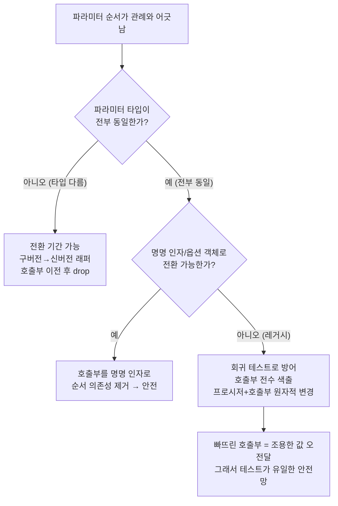

import { Callout, Steps, Step, Tabs, TabsList, TabsTrigger, TabsContent, Icon } from '@/components/writing-ui';

## 이게 뭔데

Reorder Parameters는 한 문장으로 끝난다. **저장 프로시저(메서드)의 파라미터 순서를 업무 관례에 맞게 다시 배치하는 것**이다. 시그니처는 그대로 두고, 인자들의 줄 서는 순서만 바꾼다.

비유하자면 폼(form)의 입력 칸 순서를 바꾸는 거다. 회원가입 폼에서 "비밀번호 → 이메일 → 이름" 순으로 칸이 배치돼 있으면 다들 한 번씩 멈칫한다. 보통은 "이름 → 이메일 → 비밀번호"가 자연스럽잖아. 칸이 받는 값은 똑같은데, 순서가 직관에서 어긋나면 사람이 헷갈려서 엉뚱한 칸에 값을 적는다. 프로시저 파라미터도 똑같다. 받는 타입은 안 바뀌는데, 순서가 관례랑 어긋나면 **호출하는 쪽이 자꾸 헷갈린다.**

겉보기엔 세상 사소한 리팩토링이다. 그런데 이 리팩토링에는 다른 인터페이스 변경에는 없는 **고약한 함정**이 하나 있다. 그것 때문에 책에서도 따로 한 칸을 빼서 경고한다.

## 언제 쓰나

동기는 단순하다. **파라미터 순서가 업무 관례나 팀 컨벤션에 안 맞을 때.** 냄새는 대충 이런 식으로 난다.

- 같은 도메인의 다른 프로시저들은 죄다 `(CustomerID, AccountID, ...)` 순인데, 이 프로시저 하나만 `(AccountID, CustomerID, ...)`로 거꾸로다. 손이 자꾸 미끄러진다.
- 식별자를 앞에, 옵션·날짜·플래그를 뒤에 두는 게 팀 규칙인데, 어쩌다 날짜가 맨 앞에 박혀 있다.
- 코드 리뷰 때마다 "어, 이거 인자 순서 맞아?" 하고 한 번씩 멈춘다. 멈춤이 반복되면 그게 신호다.

은행 도메인으로 보자. `Account` 테이블에 잔액을 갱신하는 프로시저가 있다.

```sql
-- 팀 컨벤션: 식별자(ID) 먼저, 값(value)은 뒤
-- 그런데 이놈만 거꾸로 박혀 있다
CREATE PROCEDURE UpdateAccountBalance(
    p_NewBalance   NUMBER,   -- 값이 맨 앞
    p_AccountID    NUMBER    -- 식별자가 뒤
) AS
BEGIN
    UPDATE Account
       SET Balance = p_NewBalance
     WHERE AccountID = p_AccountID;
END;
```

다른 프로시저들은 `(p_AccountID, ...)`로 식별자가 항상 앞인데, 이놈만 잔액이 앞이다. 이걸 관례대로 `(p_AccountID, p_NewBalance)`로 바로잡고 싶은 게 이 리팩토링의 동기다. 가독성, 일관성, 그리고 "다음 사람이 안 헷갈리게."

<Callout type="info" title="이건 '미관'이 아니라 '안전'의 문제다">
파라미터 순서를 관례에 맞추는 건 단순한 취향이 아니다. 호출부가 일관된 순서를 신뢰할 수 있으면 인자를 잘못 끼우는 사고가 줄어든다. 순서가 제멋대로면 사람이 매번 시그니처를 다시 확인해야 하고, 확인을 빼먹는 순간이 곧 사고다.
</Callout>

## 시나리오: 이런 적 있을 거임

위 프로시저를 호출하는 코드는 사방에 흩어져 있다. 입금 배치, 이체 API, 야간 정산 잡, 리포트 모듈... 다 이렇게 부른다.

```sql
-- 호출부 A (입금 처리)
UpdateAccountBalance(150000, 42);   -- 잔액 150000, 계좌 42

-- 호출부 B (이체)
UpdateAccountBalance(v_amount, v_account_id);
```

어느 날 당신이 마음먹는다. "이거 순서 거슬렸는데, 관례대로 `(AccountID, NewBalance)`로 바꾸자." 프로시저를 고친다.

```sql
CREATE OR REPLACE PROCEDURE UpdateAccountBalance(
    p_AccountID    NUMBER,   -- 식별자 먼저 (관례대로)
    p_NewBalance   NUMBER    -- 값은 뒤
) AS
BEGIN
    UPDATE Account
       SET Balance = p_NewBalance
     WHERE AccountID = p_AccountID;
END;
```

배포한다. 컴파일 에러? 없다. 호출부 A는 여전히 `UpdateAccountBalance(150000, 42)`다. 두 파라미터가 **둘 다 `NUMBER`**니까, DB는 아무 불평도 안 한다. 멀쩡히 실행된다.

그런데 이제 이 호출은 **잔액 150000짜리 계좌의 잔액을, 42로 갱신**한다. 42번 계좌가 아니라, 150000번 계좌(있다면)를 건드리고, 거기에 42원을 박는다. 즉 **계좌 42의 잔액이 어딘가의 계좌 150000으로 둔갑하고, 그 잔액이 42원이 된다.** 고객 잔액이 통째로 증발한 거다.

에러는 안 난다. 로그는 깨끗하다. 테스트가 없으면 아무도 모른다. 며칠 뒤 고객센터에 전화가 오고, 정산이 안 맞고, 누군가 며칠을 추적한 끝에 `git blame`에서 당신의 "refactor: 파라미터 순서 정리" 커밋을 발견한다.

이게 Reorder Parameters의 진짜 함정이다. **타입이 같으면 컴파일러가 못 막아준다.**

## 주의할 점

여기가 이 글의 핵심이다. 다른 인터페이스 변경 리팩토링(Add Parameter, Rename Method 등)은 보통 **전환 기간(Transition Period)** 을 둘 수 있다. 구버전 시그니처를 잠시 살려두고 → 내부에서 신버전을 호출하게 만들고 → 호출부를 천천히 옮기고 → 다 옮긴 뒤 구버전을 폐기(drop date)한다. expand-contract(parallel change) 패턴 그대로다. 호출부가 한 군데라도 안 옮겨졌으면, 그건 옛날 시그니처를 부르다 **눈에 띄게 깨진다.** 깨지니까 잡힌다.

<Callout type="warning" title="같은 타입 파라미터 순서 변경은 전환 기간을 둘 수 없다">
전환 기간의 전제는 "구버전과 신버전을 **구분**할 수 있다"는 거다. 그런데 파라미터의 **개수도 타입도 그대로**이고 순서만 바뀌면, 옛 호출과 새 호출의 시그니처가 완전히 동일하다. 오버로딩으로 구버전을 따로 남길 수도 없고, 옛날 방식으로 부른 호출이 에러로 튕겨 나오지도 않는다. **그냥 조용히 틀린 값으로 실행된다.** 깨지지 않으니 안 잡힌다. 이게 가장 위험한 종류의 결함이다.
</Callout>

조건을 정리하면 이렇다.

- **파라미터 타입이 서로 다르면** — 그나마 낫다. 옛 순서로 부르면 타입이 안 맞아 컴파일/실행 에러가 난다. 시끄럽게 깨지니 적어도 발견은 된다. (단, 자동 형변환이 있는 DB라면 `NUMBER` ↔ `VARCHAR` 사이에서도 조용히 넘어갈 수 있으니 방심 금지.)
- **파라미터 타입이 전부 동일하면** — 최악. 옛 순서 호출이 멀쩡히 통과하면서 값만 뒤바뀐다. 위 시나리오가 정확히 이 경우다.

그래서 책의 결론은 냉정하다. **모든 파라미터 타입이 같을 때의 Reorder Parameters는, 가능하면 하지 마라.** 가독성 좋아지자고 잔액을 날릴 수는 없잖아. 굳이 해야 한다면 전환 기간이라는 안전망 없이 가는 거니까, 다른 방어를 단단히 세우고 들어가야 한다.

## 이렇게 한다

타입이 같은 경우와 다른 경우를 갈라서 보자.

### 타입이 다르면 — 전환 기간을 둔다

파라미터 타입이 충분히 다르다면, 평범한 인터페이스 변경처럼 전환 기간을 끼울 수 있다. 신버전을 새 이름으로 만들고, 구버전을 얇은 래퍼로 남겨 신버전을 호출하게 한 뒤, 호출부를 다 옮기면 구버전을 폐기한다.

```sql
-- 신버전 (관례에 맞는 순서)
CREATE OR REPLACE PROCEDURE GetCustomerAccounts_V2(
    p_CustomerID   NUMBER,
    p_AsOfDate     DATE
) AS
BEGIN
    -- 실제 로직
    NULL;
END;

-- 구버전: 순서가 거꾸로였던 옛 시그니처를 잠시 살려둔다
-- 내부에서 신버전을 호출 → 전환 기간 동안 양쪽 다 동작
CREATE OR REPLACE PROCEDURE GetCustomerAccounts(
    p_AsOfDate     DATE,       -- 옛 순서: 날짜가 앞
    p_CustomerID   NUMBER
) AS
BEGIN
    -- @deprecated drop date: 2026-09-30
    GetCustomerAccounts_V2(p_CustomerID, p_AsOfDate);
END;
```

타입이 `DATE`와 `NUMBER`로 다르니, 누가 옛 순서로 새 프로시저를 잘못 부르면 타입 에러가 나서 잡힌다. 호출부를 다 옮겼다는 게 회귀 테스트로 확인되면 구버전을 drop한다. 여기까진 일반적인 expand-contract라 특별할 게 없다.

### 타입이 같으면 — 순서를 바꾸지 말고 인터페이스 자체를 바꾼다

진짜 문제는 아까 그 `(NUMBER, NUMBER)` 케이스다. 전환 기간이 안 통하니, 발상을 바꾼다. **"순서를 바꾼다"는 목표를 "순서에 의존하지 않게 만든다"로 치환하는 게** 가장 현대적이고 안전한 답이다.

<Tabs defaultValue="named">
<TabsList>
<TabsTrigger value="named">명명 인자</TabsTrigger>
<TabsTrigger value="record">레코드/구조체</TabsTrigger>
<TabsTrigger value="orm">ORM·앱 계층</TabsTrigger>
</TabsList>

<TabsContent value="named">

대부분의 DB는 **명명된 인자(named notation)** 를 지원한다. 호출할 때 위치가 아니라 이름으로 값을 꽂으면, 파라미터 순서가 어떻든 값이 절대 안 엇갈린다. 순서를 바꾸는 리팩토링 자체가 무해해진다.

```sql
-- 위치 인자: 순서가 곧 의미. Reorder하면 조용히 깨짐
UpdateAccountBalance(42, 150000);

-- 명명 인자: 순서와 무관. 이름이 의미를 고정한다 (Oracle/PostgreSQL)
UpdateAccountBalance(p_AccountID => 42, p_NewBalance => 150000);

-- PostgreSQL 스타일
CALL UpdateAccountBalance(p_AccountID := 42, p_NewBalance := 150000);
```

이러면 프로시저 안의 파라미터 순서를 나중에 바꿔도 호출부는 멀쩡하다. **사실상 Reorder Parameters라는 리팩토링을 "공짜"로 만드는 길**이다. 그래서 진짜 현대적 처방은 "순서를 잘 바꾸는 법"이 아니라, **애초에 호출부를 전부 명명 인자로 옮겨놓는 것**이다.

</TabsContent>

<TabsContent value="record">

파라미터가 여러 개고 일부가 같은 타입이라면, 흩어진 스칼라 인자들을 **하나의 레코드/구조체 타입으로 묶는다.** 필드는 이름으로 채우니 순서 사고가 원천 차단된다.

```sql
-- 같은 타입 스칼라들이 줄 서 있으면 순서 사고가 난다
-- p_FromAccount, p_ToAccount 둘 다 NUMBER → 뒤바뀌면 엉뚱한 이체
CREATE PROCEDURE Transfer(
    p_FromAccount NUMBER,
    p_ToAccount   NUMBER,
    p_Amount      NUMBER
);

-- 레코드 타입으로 묶으면 호출은 필드명으로 채운다
CREATE TYPE TransferRequest AS OBJECT (
    FromAccount NUMBER,
    ToAccount   NUMBER,
    Amount      NUMBER
);

CREATE PROCEDURE Transfer(p_Req TransferRequest);
-- 호출: Transfer(TransferRequest(FromAccount => 42, ToAccount => 77, Amount => 1000))
```

이건 사실 "여러 파라미터를 객체로 묶기(Introduce Parameter Object)" 리팩토링과 짝을 이룬다. 순서 리스크를 구조로 없애는 셈이다.

</TabsContent>

<TabsContent value="orm">

저장 프로시저를 앱에서 호출한다면, 앱 계층에서 한 겹 감싸 **위치 인자를 키워드 인자로 강제**하는 게 좋다. Python이면 keyword-only 인자, TypeScript면 옵션 객체.

```typescript
// 위치 인자: 둘 다 number라 뒤바꿔도 타입 통과 → 사고
async function updateBalance(accountId: number, newBalance: number) { /* ... */ }
updateBalance(150000, 42);  // 컴파일 OK, 의미는 박살

// 옵션 객체: 호출부가 키를 써야 한다. 순서 무관, 누락도 타입에러
async function updateBalance(args: { accountId: number; newBalance: number }) {
  return db.query('CALL UpdateAccountBalance(:accountId, :newBalance)', args);
}
updateBalance({ accountId: 42, newBalance: 150000 });  // 안 헷갈림
```

같은 타입 인자가 둘 이상이면 위치 인자 시그니처는 그 자체로 지뢰다. 옵션 객체로 바꿔두면 프로시저 쪽 순서를 어떻게 바꾸든 호출부가 흔들리지 않는다.

</TabsContent>
</Tabs>

### 그래도 위치 인자로 순서를 바꿔야 한다면 — 회귀 테스트로 방어한다

명명 인자도 못 쓰고, 호출부를 다 못 고치는 레거시 상황이라 끝내 위치 인자 그대로 순서를 바꿔야 한다면, 유일한 안전망은 **자동화된 회귀 테스트**다. 전환 기간이라는 보호막이 없으니 테스트가 그 역할을 대신해야 한다.

<Steps>
<Step title="현재 동작을 고정하는 특성화 테스트부터">
순서를 건드리기 전에, 이 프로시저가 지금 무슨 값을 받아 무슨 결과를 내는지 못 박는 테스트를 먼저 쓴다. "계좌 42에 잔액 150000을 넣으면 Account 42의 Balance가 150000이 된다" 같은 결과 검증. 리팩토링 전에 초록불을 확인한다.
</Step>
<Step title="모든 호출부를 grep으로 색출">
이게 진짜 일이다. 앱 코드, 배치, 리포트, 다른 프로시저, 동적 SQL 문자열까지 — `UpdateAccountBalance(` 를 전부 찾는다. 동적 SQL이 무서운 건 컴파일러가 못 잡기 때문이다. 빠뜨린 호출부 하나가 곧 그 조용한 결함이다.
</Step>
<Step title="프로시저와 모든 호출부를 한 커밋에서 동시에 바꾼다">
전환 기간을 못 두는 리팩토링이니, 쪼개서 배포하면 중간 상태가 곧 사고다. 프로시저 시그니처 변경과 모든 호출부 수정을 **원자적으로 한 번에** 반영한다. 가능하면 호출부를 명명 인자로 함께 전환해서, 다음번 순서 변경은 안전하게 만든다.
</Step>
<Step title="회귀 테스트로 값 오전달을 검증">
순서를 바꾼 뒤 같은 특성화 테스트를 돌린다. "계좌 42 잔액 갱신"이 여전히 계좌 42를 건드리는지, 150000번 유령 계좌를 건드리진 않는지 확인한다. 인자가 뒤바뀌면 결과 행이 달라지므로 테스트가 빨갛게 잡아준다.
</Step>
</Steps>

<Callout type="error" title="동적 SQL과 리플렉션 호출을 잊지 마라">
정적으로 `PROC(a, b)`라고 박힌 호출은 그나마 grep으로 잡힌다. 진짜 위험한 건 문자열로 조립되는 동적 SQL, ORM의 raw 호출, 외부 리포트 도구가 던지는 쿼리다. 이것들은 빌드에서 안 걸리고 런타임에 조용히 틀린다. 호출부 색출이 불완전할 것 같으면, 그건 이 리팩토링을 위치 인자로 하면 안 된다는 신호다. 먼저 명명 인자로 갈아엎어라.
</Callout>

전체 흐름을 그림으로 보면 이렇다.



## 정리

Reorder Parameters는 카탈로그에서 제일 사소해 보이는 리팩토링이다. 순서만 바꾸는 거니까. 그런데 바로 그 사소함이 함정이다.

> **순서만 바뀌고 타입이 같으면, 컴파일러도 전환 기간도 너를 못 지켜준다. 그냥 조용히 틀린 값으로 실행된다.**

그래서 현대적 결론은 명료하다. 이 리팩토링을 안전하게 하는 가장 좋은 방법은, **순서에 의존하는 호출 자체를 없애는 것**이다. 명명 인자, 레코드 타입, 옵션 객체 — 무엇이든 위치가 아니라 이름으로 값을 꽂게 만들면, 파라미터 순서는 더 이상 사고의 원천이 아니다. 그게 안 되는 레거시라면, 전환 기간의 빈자리를 회귀 테스트로 메우고, 호출부를 단 하나도 빠짐없이 색출해 프로시저와 함께 원자적으로 바꿔라.

"인자 순서 거슬려서 정리 좀 했어요"라는 한 줄짜리 PR이 고객 잔액을 날릴 수 있다는 것 — 이 리팩토링이 가르치는 진짜 교훈은 그거다.
