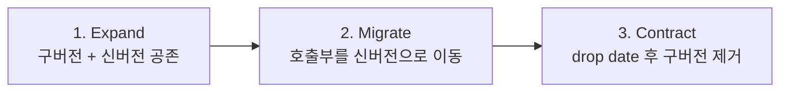

## 이게 뭔데

`Replace Parameter With Explicit Methods`. 이름 길지만 한 줄로 줄이면 이거다. **"값에 따라 하는 일이 완전히 달라지는 만능 메서드"를, 일을 하나씩만 하는 구체적인 메서드 여러 개로 쪼개는 것**이다.

은행 DB에 이런 저장 프로시저가 하나 산다고 치자.

```sql
-- AccountID와 "어떤 값을 줄지"를 가리키는 ColumnID를 받는 만능 프로시저
GetAccountValue(AccountID, ColumnID)
```

`ColumnID`에 `1`을 넣으면 잔액을 주고, `2`를 넣으면 고객 ID를 주고, `3`을 넣으면 개설일을 준다. 호출하는 쪽은 늘 똑같은 함수를 부르는데, 두 번째 인자에 뭘 넣느냐에 따라 전혀 다른 데이터가 튀어나온다.

비유하자면 자판기인데, **버튼이 하나뿐이고 대신 옆에 "1번 누르면 콜라, 2번 누르면 사이다, 3번 누르면 잔돈 반환" 하는 안내문이 붙어 있는 거다.** 안내문 못 보면 망한다. 이걸 그냥 콜라 버튼, 사이다 버튼, 잔돈 버튼으로 나누는 게 이 리팩토링이다.

```sql
-- After: 일 하나당 메서드 하나
GetAccountBalance(AccountID)
GetAccountCustomerID(AccountID)
GetAccountOpeningDate(AccountID)
```

<Callout type="info" title="한 줄 요약">
하나의 메서드가 인자 값으로 분기해서 여러 일을 한다면, 그건 "메서드 하나"가 아니라 "메서드 여러 개가 한 함수에 동거 중"인 거다. 호출부가 매직 넘버로 동작을 고르는 순간, 인터페이스가 거짓말을 시작한다.
</Callout>

이건 책 10장 "메서드 리팩토링", 그중에서도 **인터페이스 변경 리팩토링**에 속한다. 메서드의 시그니처가 바뀌니까, 이 프로시저를 부르는 외부 프로그램(앱, 배치, 리포트)도 같이 고쳐야 한다. 그래서 뒤에서 보겠지만 **전환 기간(Transition Period)** 이 핵심이다.

## 언제 쓰나

증상은 보통 이렇게 나타난다.

코드 리뷰에서 `GetAccountValue(accountId, 2)`라는 호출을 본다. 그리고 묻게 된다. "2가 뭔데?" 작성자도 헷갈려서 프로시저 정의를 다시 열어본다. 거기엔 이런 게 살고 있다.

```sql
CREATE PROCEDURE GetAccountValue(
  IN p_AccountID  BIGINT,
  IN p_ColumnID   INT
)
BEGIN
  IF p_ColumnID = 1 THEN
    SELECT Balance      FROM Account WHERE AccountID = p_AccountID;
  ELSEIF p_ColumnID = 2 THEN
    SELECT CustomerID   FROM Account WHERE AccountID = p_AccountID;
  ELSEIF p_ColumnID = 3 THEN
    SELECT OpeningDate  FROM Account WHERE AccountID = p_AccountID;
  ELSE
    -- 4? 5? 아무도 모름. 누가 또 추가했을 수도
    SELECT NULL;
  END IF;
END;
```

이 프로시저는 냄새를 두 가지 풍긴다.

첫째, **인터페이스가 거짓말을 한다.** 시그니처만 보면 "계좌 값을 준다"는데, 정작 무슨 값인지는 두 번째 인자에 숨어 있다. 타입 시스템도 못 도와준다. `ColumnID`는 그냥 `INT`라서, `2`를 넣든 `99`를 넣든 컴파일러는 아무 말 안 한다. `99`를 넣으면 런타임에 조용히 `NULL`이 나온다.

둘째, **반환 형태가 호출마다 다르다.** `ColumnID=1`이면 `DECIMAL`(잔액)이고 `2`면 `BIGINT`(고객 ID)고 `3`이면 `DATE`(개설일)다. 하나의 함수가 호출마다 다른 타입을 뱉으면, 받는 쪽 코드는 `any`로 받아서 캐스팅하거나, 분기마다 다른 처리를 해야 한다. 정적 타입의 이점이 입구에서부터 증발한다.

이 두 냄새가 같이 나면 답은 거의 정해져 있다. **분기하는 값마다 메서드를 따로 판다.** 그러면 시그니처가 곧 문서가 되고, 반환 타입이 메서드마다 명확해지고, "2가 뭔데?" 같은 질문이 사라진다.

<Callout type="note" title="Parameterize Method랑 헷갈리지 마라">
바로 옆 항목에 정반대처럼 보이는 `Parameterize Method`가 있다. `GetAmericanCustomers`/`GetCanadianCustomers`를 `GetCustomersInCountry(country)` 하나로 **합치는** 리팩토링이다. 이름만 보면 모순 같은데 아니다. 기준은 "분기 대상이 데이터냐, 동작이냐"다. 국가 코드는 **같은 동작에 들어가는 데이터**다. 그래서 합쳐도 된다. 반면 `ColumnID`는 **어떤 동작을 할지 자체를 고르는 스위치**다. 이건 갈라야 한다. 데이터는 모으고, 동작 선택은 쪼갠다.
</Callout>

## 주의할 점

이게 인터페이스 변경 리팩토링이라는 게 모든 함정의 출처다.

<Callout type="warning" title="이 프로시저를 누가 부르는지 다 아냐">
저장 프로시저의 무서운 점은 호출부가 코드베이스 밖에도 있다는 거다. 웹 앱만 부르는 게 아니라, 새벽 배치 잡, 분기마다 도는 정산 리포트, 옆 팀이 3년 전에 만든 ETL, 누군가 크론에 박아둔 셸 스크립트가 같이 부르고 있을 수 있다. `GetAccountValue`를 그냥 지워버리면, 보이지 않던 곳에서 조용히 깨진다. 그것도 분기 정산 같은, 일 년에 네 번만 도는 잡에서. **삭제 전에 호출자를 전수 조사해라.** DB 쿼리 로그, `pg_stat_statements`, 코드 전역 grep, 그리고 모르면 일단 살려둬라.
</Callout>

두 번째 함정은 **메서드 폭발**이다. 분기가 3개면 메서드 3개라 깔끔하다. 근데 `Account` 테이블 컬럼이 40개고, 그걸 다 개별 메서드로 빼면 `GetAccount*` 메서드 40개가 생긴다. 이쯤 되면 분리가 오히려 노이즈다. 이럴 땐 멈추고 물어라. "호출부가 정말 컬럼을 하나씩 따로 필요로 하나, 아니면 그냥 계좌 객체 하나가 필요한 건가?" 후자라면 `GetAccountValue`를 쪼갤 게 아니라 `GetAccount(AccountID)`로 **행 전체를 한 번에 주는** 게 맞다. Replace Parameter는 "분기 종류가 적고, 각 분기가 의미 있게 다를 때" 빛난다.

세 번째는 **반환 타입 불일치 처리**다. 만능 프로시저는 호출마다 다른 타입을 뱉어도 `ColumnID` 뒤에 숨길 수 있었다. 쪼개는 순간 이게 드러난다. 좋은 일이지만, 호출부에서 `result[0]`을 무지성으로 받던 코드가 있다면 타입이 어긋나며 깨질 수 있다. 분리 자체가 잠재 버그를 표면으로 끌어올리니, 회귀 테스트가 없으면 이 단계에서 한번 덴다.

## 이렇게 한다

핵심 전략은 **전환 기간(Transition Period)** 을 두는 것, 그리고 그 기간을 expand-contract(parallel change) 패턴으로 운영하는 것이다. 신버전을 먼저 깔고(expand), 호출부를 옮기고, 마지막에 구버전을 걷어낸다(contract). 한 번에 갈아엎지 않는 게 전부다.



### 1단계 — 신버전 메서드를 깐다 (스키마 변경, DDL)

먼저 구체 메서드들을 새로 만든다. 이때 **구버전 `GetAccountValue`는 절대 건드리지 않는다.** 둘이 공존하는 게 전환 기간의 핵심이다.

```sql
-- 신버전: 일 하나당 프로시저 하나, 반환 타입이 명확하다
CREATE PROCEDURE GetAccountBalance(IN p_AccountID BIGINT)
BEGIN
  SELECT Balance FROM Account WHERE AccountID = p_AccountID;
END;

CREATE PROCEDURE GetAccountCustomerID(IN p_AccountID BIGINT)
BEGIN
  SELECT CustomerID FROM Account WHERE AccountID = p_AccountID;
END;

CREATE PROCEDURE GetAccountOpeningDate(IN p_AccountID BIGINT)
BEGIN
  SELECT OpeningDate FROM Account WHERE AccountID = p_AccountID;
END;
```

여기가 책의 2006년식 손코딩과 현대 실무가 갈리는 지점이다. 옛날엔 이걸 DBA가 운영 DB에 직접 쳤다. 지금은 **마이그레이션 도구**에 태운다. Flyway면 `V81__split_get_account_value.sql` 한 장으로, Liquibase면 changeset으로, Alembic이면 `op.execute()`로. 이러면 (1) 어느 환경에 무엇이 적용됐는지 버전으로 추적되고, (2) 코드 리뷰에 DDL이 올라오고, (3) 롤백 경로가 생긴다. 저장 프로시저 변경이 "DBA의 손기술"이 아니라 "리뷰 가능한 커밋"이 되는 게 가장 큰 차이다.

<Callout type="success" title="구버전을 신버전 위에 올려라">
전환 기간 동안 코드 중복을 줄이는 깔끔한 트릭이 있다. 구버전 `GetAccountValue`의 분기 안 로직을 신버전 호출로 바꿔치기하는 거다. 구버전이 신버전을 부르는 얇은 어댑터가 되면, 실제 로직은 한 군데(신버전)에만 산다. 책에서 말하는 "구버전이 신버전을 호출하도록 한 뒤, 기간 종료 후 정리"가 바로 이거다.
</Callout>

```sql
-- 전환 기간용 어댑터: 구버전을 신버전 위에 얹어 로직 중복 제거
CREATE PROCEDURE GetAccountValue(IN p_AccountID BIGINT, IN p_ColumnID INT)
BEGIN
  IF p_ColumnID = 1 THEN
    CALL GetAccountBalance(p_AccountID);
  ELSEIF p_ColumnID = 2 THEN
    CALL GetAccountCustomerID(p_AccountID);
  ELSEIF p_ColumnID = 3 THEN
    CALL GetAccountOpeningDate(p_AccountID);
  ELSE
    SIGNAL SQLSTATE '45000'
      SET MESSAGE_TEXT = 'GetAccountValue: deprecated. Use explicit methods.';
  END IF;
END;
```

`ELSE` 브랜치를 조용한 `NULL`에서 **시끄러운 에러**로 바꾼 것도 포인트다. 어차피 곧 죽을 함수니까, 남은 호출이 있으면 조용히 넘어가지 말고 빨리 들키게 만든다.

### 2단계 — 데이터 마이그레이션은 (대개) 없다

이 리팩토링의 좋은 점 하나. **테이블 데이터를 건드리지 않는다.** `Account` 테이블의 행은 그대로다. 우리가 바꾸는 건 "그 행을 어떻게 꺼내 쓰는가"라는 접근 인터페이스지, 데이터 자체가 아니다.

이건 책이 다루는 다른 리팩토링(컬럼 쪼개기, 테이블 분할 같은 구조 변경)과 결정적으로 다른 점이다. 그쪽은 무거운 DML 백필과 CDC/트리거로 양쪽 동기화가 필요하다. 여긴 그게 없다. 그래서 **위험의 무게중심이 전적으로 "코드 호출부 이전"에 쏠린다.** 데이터는 안전하니, 신경은 전부 호출부로 모아라.

### 3단계 — 접근 프로그램(코드)을 옮긴다

이제 `GetAccountValue`를 부르던 애플리케이션 코드를 구체 메서드 호출로 바꾼다.

```typescript
// Before: 매직 넘버로 동작을 고른다. 2가 뭔지 호출부만 봐선 모름
const balance = await db.query('CALL GetAccountValue(?, ?)', [accountId, 1]);
const customerId = await db.query('CALL GetAccountValue(?, ?)', [accountId, 2]);
// result 타입이 호출마다 달라서 받는 쪽이 any로 흐른다
```

```typescript
// After: 메서드 이름이 곧 의도. 반환 타입도 메서드마다 고정된다
const balance: Decimal = await getAccountBalance(accountId);
const customerId: bigint = await getAccountCustomerID(accountId);
```

ORM/쿼리 빌더를 쓴다면 이 단계에서 매직 넘버를 리포지토리 메서드로 흡수시키면 된다. 호출부 코드만 보고도 "잔액을 가져온다"가 읽히고, IDE 자동완성이 동작하고, 잘못된 컬럼을 고를 수가 없어진다(애초에 그런 메서드가 없으니까).

옮기는 순서는 한 번에 다 말고 **점진적으로**. 호출부가 여러 서비스에 흩어져 있다면 서비스별로 커밋을 나눠 배포한다. 구버전 어댑터가 살아 있으니, 일부는 신버전을 쓰고 일부는 아직 구버전을 써도 둘 다 정상 동작한다. 이게 parallel change가 주는 안전망이다.

<Callout type="warning" title="삭제는 drop date를 박고 한다">
전환 기간엔 반드시 **명시적인 drop date**가 있어야 한다. 날짜 없는 deprecated는 영원히 안 죽는다. 어댑터에 주석으로 `@deprecated drop after 2026-09-01` 같은 약속을 박고, 그날까지 호출자 0을 확인해라. 확인 방법은 직감이 아니라 데이터다. `pg_stat_statements`나 쿼리 로그에서 `GetAccountValue` 호출 카운트가 0으로 떨어졌는지 보고, 그제서야 마지막 마이그레이션으로 `DROP PROCEDURE`를 친다.
</Callout>

```sql
-- 마지막 마이그레이션 (V82): 호출자 0 확인 후 어댑터 제거
DROP PROCEDURE GetAccountValue;
```

전 과정을 정리하면 이렇다.

<Steps>
<Step title="신버전 메서드 추가 (expand)">
`GetAccountBalance` 등 구체 프로시저를 마이그레이션으로 추가. 구버전은 그대로 둔다.
</Step>
<Step title="구버전을 어댑터로 강등">
`GetAccountValue` 내부를 신버전 호출로 바꿔 로직 중복을 제거하고, 미정의 분기는 에러로 만든다.
</Step>
<Step title="호출부 점진 이전 (migrate)">
애플리케이션 코드의 `GetAccountValue(..., N)` 호출을 구체 메서드로 서비스별로 교체 배포한다.
</Step>
<Step title="호출자 0 확인 후 삭제 (contract)">
drop date까지 쿼리 로그로 잔여 호출을 모니터링하고, 0이 되면 구버전 프로시저를 DROP한다.
</Step>
</Steps>

## 정리

`Replace Parameter With Explicit Methods`는 단순한 리팩토링이지만, 좋은 인터페이스가 뭔지에 대한 작은 교훈을 담고 있다. **메서드의 인자가 "데이터"가 아니라 "어떤 동작을 할지 고르는 스위치"가 되는 순간, 그 인터페이스는 거짓말을 시작한다.** 호출부는 매직 넘버를 외워야 하고, 타입 시스템은 손을 놓고, 반환값은 호출마다 모양이 바뀐다.

> **분기 인자로 동작을 고르고 있다면, 그건 메서드를 쪼개라는 신호다.**

데이터 자체는 안 건드리는 가벼운 리팩토링이라 무게중심은 전적으로 호출부 이전에 있다. 그래서 핵심은 기술이 아니라 절차다. 신버전을 먼저 깔고(expand), 구버전을 신버전 위에 얹어 공존시키고, 호출부를 점진적으로 옮기고, drop date에 호출자 0을 확인한 뒤 걷어낸다. 2006년엔 DBA가 손으로 쳤을 이 과정을, 지금은 마이그레이션 도구의 버전 관리된 커밋으로 안전하게 굴린다. 도구가 바뀌었을 뿐, "한 번에 갈아엎지 말고 다리를 놓고 건너라"는 원칙은 그대로다.
